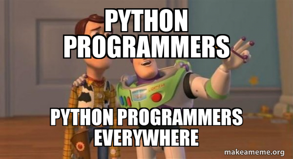
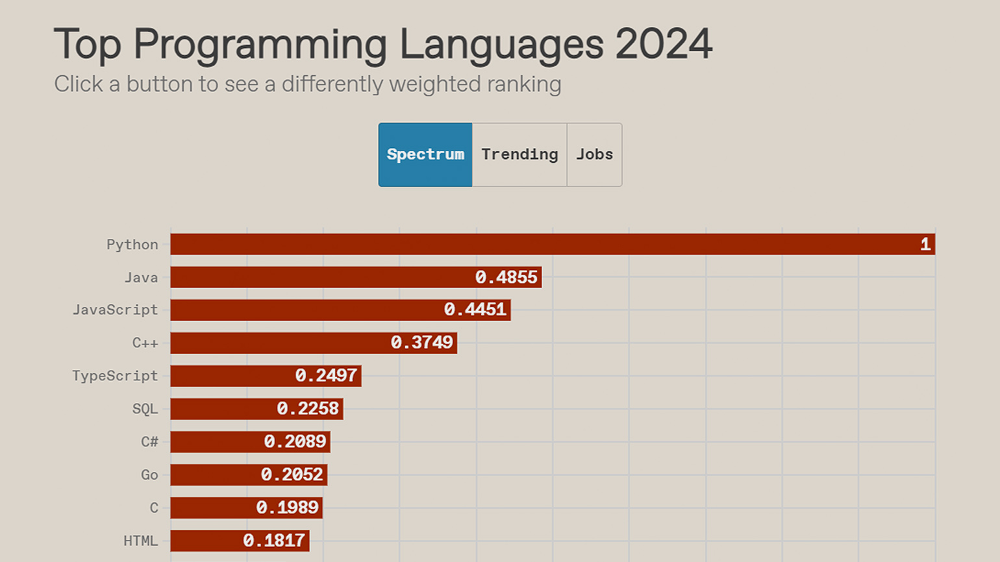
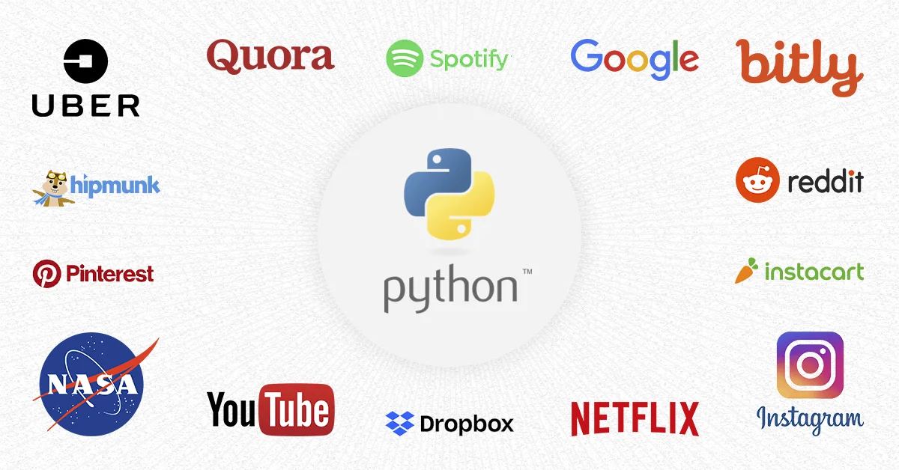
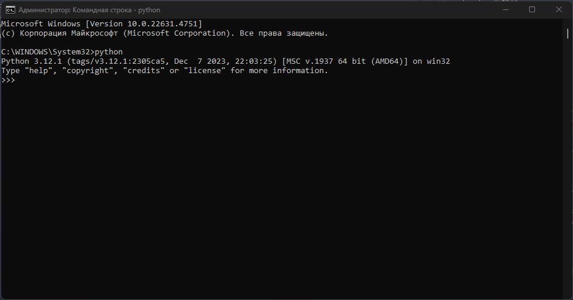
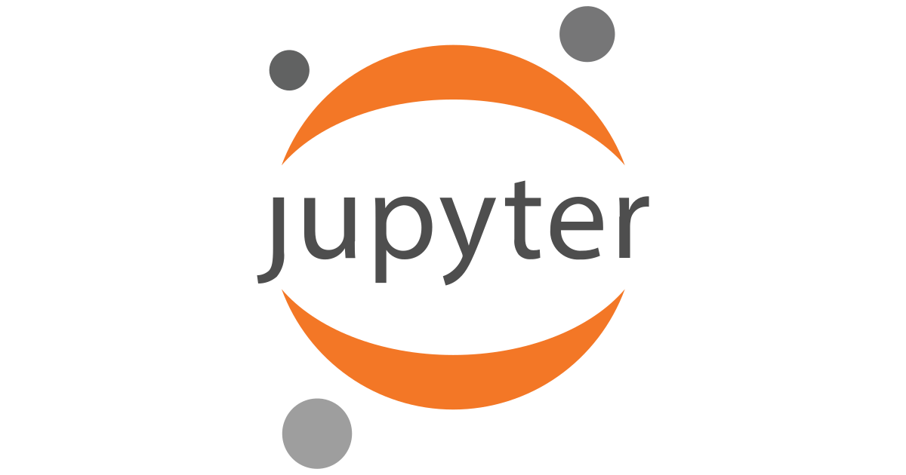
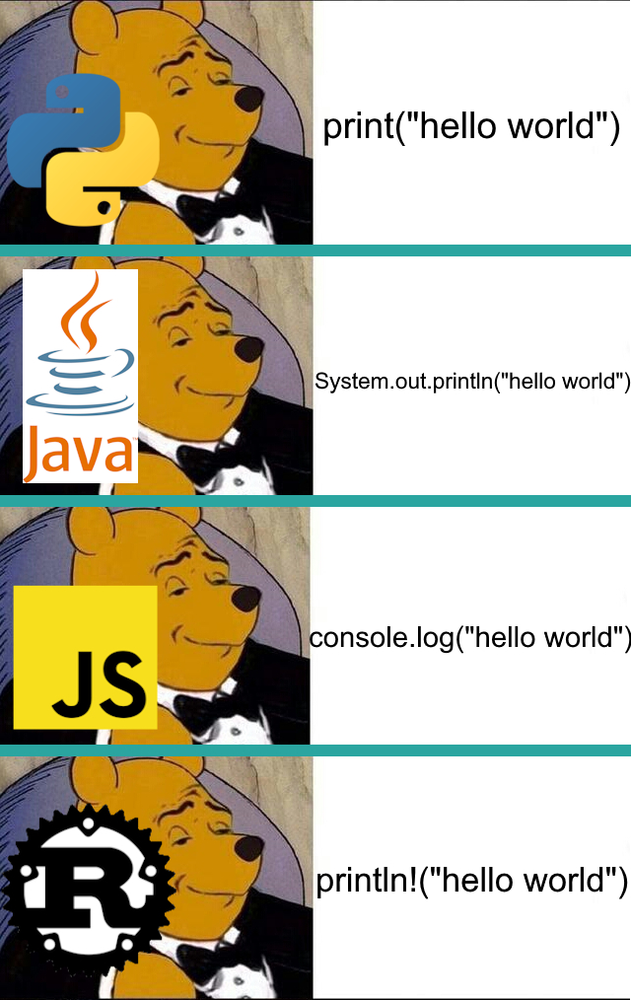
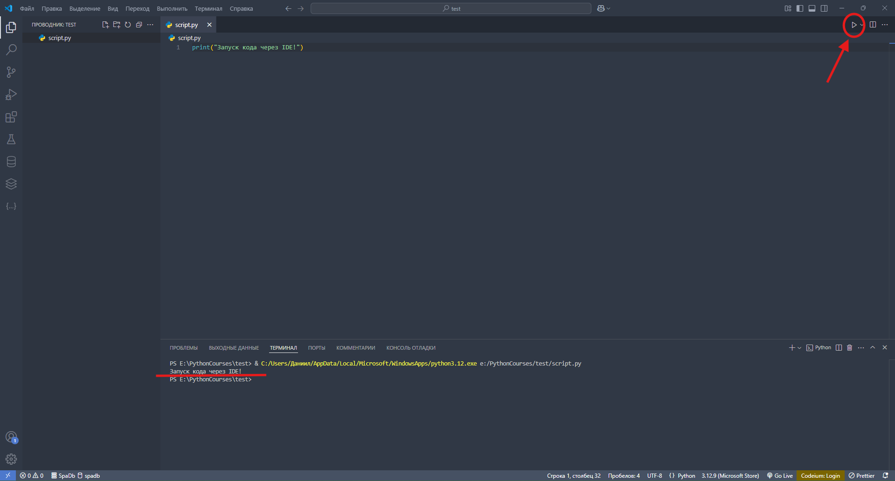

# Лекция 1. Введение в Python. Переменные. Строки и числа.


## Что такое програмирование?

**Програмирование** - это процесс создания наборов инструкций (программ), которые управляют работой компьютера. Оно позволяет давать компьютеру точные команды для выполнения различных задач, начиная от простых вычислений и заканчивая сложными системами искусственного интеллекта.

По сути програмирование состоит из двух частей: алгоритмы, структуры данных.

**Алгоритм** — это пошаговый набор действий для решения задачи. Программирование начинается с разработки алгоритма, который играет ключевую роль в процессе создания программ, так как позволяют разработчикам точно указать, что должно быть сделано для достижения цели. Примеры алгоритмов включают сортировку данных, поиск значений и выполнение математических вычислений.

Хорошим примером алгоритма из жизни является - приготовление чая:

- Налить воду в чайник.
- Включить чайник и вскипятить воду.
- Насыпать чай в кружку.
- Залить чай кипятком.
- Подождать 5 минут.
- Добавить сахар или молоко по желанию.
- Чай готов!

**Структура данных** – это способ организации, хранения и обработки данных в компьютере так, чтобы они могли быть эффективно использованы. Структуры данных позволяют программам управлять информацией, обеспечивать быстрый доступ и эффективные операции с данными.

Пример из жизни:
Представьте, что вам нужно организовать книги в библиотеке. Вы можете сложить их в кучу, разложить по полкам в алфавитном порядке или записать данные о книгах в каталоге. Все это разные структуры данных, каждая из которых удобна для разных задач.

Если говорить простым языком, алгоритмы это как делать, а структуры данных это с чем делать.

**Язык программирования** — это набор формальных правил, по которым пишут программы. Обычный язык нужен для общения людей, а язык программирования — для общения с компьютером. Как и в любом естественном языке, тут есть лексика — слова, функции и операторы, из которых по правилам синтаксиса составляются выражения. Они имеют чёткий, вполне определённый смысл, понятный компьютеру.

Языков программирования существует огромное множество, и каждый из них разработан для определённых целей. Например:

- C и C++ широко используются в системном программировании, разработке драйверов и игровых движков.
- Java – популярный выбор для корпоративных приложений и мобильных приложений на Android.
- JavaScript – основной язык веб-разработки, который управляет интерактивностью на сайтах.
- SQL – язык для работы с базами данных.
- Python – универсальный язык, который применяется в веб-разработке, анализе данных, машинном - обучении и многих других областях.

## Python


**Python** — это высокоуровневый язык программирования, отличающийся эффективностью, простотой и универсальностью использования.

Его легко изучить даже начинающим, поскольку код на Python читается практически как английский текст. За счет простого и интуитивно понятного синтаксиса он является одним из самых распространенных языков для обучения программированию.



Python избавляет разработчика от сложностей, связанных с управлением памятью и компиляцией, что позволяет сосредоточиться на решении задач, а не на технических деталях реализации. Благодаря этому его часто рекомендуют как первый язык для знакомства с программированием.

### Что такое компилятор и интерпретатор?

Компьютер не понимает код, написанный на языке программирования, в том виде, в котором его пишет программист. Ему нужен машинный код (набор инструкций в бинарном формате). Чтобы превратить код из удобочитаемого для человека языка в исполняемый машинный код, используются два основных подхода:

**Компилятор** – это программа, которая сразу переводит весь исходный код в машинный код перед выполнением.

- Примеры языков: C, C++, Java (JVM)
- Как это работает:
   - Компилятор анализирует весь код, проверяет ошибки и создаёт исполняемый файл.
   - Этот файл можно запускать без компилятора.
   - Из-за этого программа запускается быстрее, но изменения требуют перекомпиляции.

**Интерпретатор** – это программа, которая читает код построчно и сразу выполняет его.

- Примеры языков: Python, JavaScript, PHP
- Как это работает:
   - Код исполняется построчно, без предварительного перевода всего кода в машинный.
   - Ошибка в одной строке приведёт к остановке выполнения.
   - Такой подход упрощает тестирование и разработку, но может замедлить работу программы.

### Как это связано с Python?

Python использует интерпретатор, поэтому вам не нужно вручную компилировать код. Это одно из преимуществ Python – возможность быстро запускать и тестировать программы без дополнительной подготовки.

**Дополнительно:**

- Иногда говорят, что Python является компилируемо-интерпретируемым языком, потому что перед исполнением код преобразуется в байт-код (`.pyc` файлы), который выполняется внутри виртуальной машины Python (PVM – Python Virtual Machine).

- Это делает Python гибким и кроссплатформенным, так как этот байт-код может выполняться на разных системах без изменений.

Кроме того, Python поддерживает несколько парадигм программирования:

- Процедурное — позволяет писать код в виде последовательности команд.
- Объектно-ориентированное — помогает организовывать код в виде объектов и классов.
- Функциональное — дает возможность работать с функциями высшего порядка и выражать идеи в декларативном стиле.

Все это делает Python мощным инструментом для самых разных сфер разработки: от веб-программирования и анализа данных до искусственного интеллекта и автоматизации задач.

Язык программирования Python был создан в 1989–1991 годах голландским программистом Гвидо ван Россумом. Изначально это был любительский проект: разработчик начал работу над ним, просто чтобы занять себя на рождественских каникулах. Хотя сама идея создания нового языка появилась у него двумя годами ранее. Имя ему Гвидо взял из своей любимой развлекательной передачи «Летающий цирк Монти Пайтона». Язык программирования он и выбрал — Python, что означало название комик-группы. Это шоу было весьма популярным среди программистов, которые находили в нем параллели с миром компьютерных технологий.


История развития Python включает несколько этапов, каждый из которых заканчивался выходом новой версии:

- В 1991 году Гвидо опубликовал первую версию (0.9.0) языка, включающую базовые возможности — в частности, работу с данными различных типов и корректировку ошибок.
- Через три года вышла версия 1.0, в которой функционал был дополнен обработкой списков данных: систематизацией, фильтрацией, сокращением, сопоставлением.
- Версия 2.0 была опубликована в 2000 году и отличалась исправленными недочетами прежних версий, а также новыми полезными функциями для программистов — в частности, поддержкой Unicode и облегченной методикой циклического просмотра списка.
- В 2008 году представлена версия Python 3, включившая возможность печати, поддержку деления чисел и расширенное исправление ошибок.

Python активно развивается и поддерживается сообществом разработчиков по всему миру. Последние версии языка включают
множество улучшений и новых возможностей, что делает его мощным инструментом для решения самых разнообразных задач.

В современном мире активно используется python 3+, но на некоторых старых проектах можно встретить и версии 2+



Python — универсальный язык программирования, который применяется в самых разных сферах. Вот основные области, где он активно используется:

1. **Анализ данных и наука о данных (Data Science):**
   Python популярен среди аналитиков данных и исследователей, так как позволяет быстро обрабатывать и анализировать большие массивы данных.
   Библиотеки: Pandas, NumPy, SciPy, Matplotlib, Seaborn.
   Используется в финансах, маркетинге, биоинформатике, экономике и других сферах.
2. **Машинное обучение и искусственный интеллект:**
   Python — один из главных языков для работы с искусственным интеллектом.
   Библиотеки: TensorFlow, PyTorch, Scikit-learn, Keras.
   Применяется в чат-ботах, системах рекомендаций (например, Netflix, YouTube), компьютерном зрении и обработке естественного языка.
3. **Веб-разработка:**
   Python позволяет создавать сайты и веб-приложения.
   Фреймворки: **Django**, Flask, FastAPI.
   Используется в бэкенде сайтов, API-сервисах, CMS (например, Reddit написан на Python).
4. **Автоматизация и DevOps:**
   Python помогает автоматизировать рутинные задачи: обработку файлов, сбор данных, развертывание серверов.
   Используется в администрировании серверов, управлении облачными сервисами (AWS, Google Cloud), CI/CD (Jenkins, GitHub Actions).
   Библиотеки: Fabric, Ansible, Selenium.
5. **Разработка игр:**
   Хотя Python не является основным языком для игр, его можно использовать для создания прототипов и небольших игр.
   Библиотеки: Pygame, Panda3D.
6. **Кибербезопасность и тестирование:**
   Python широко применяется в кибербезопасности для анализа уязвимостей, написания автоматизированного тестирования.
   Библиотеки: Requests, Selenium.
7. **Встраиваемые системы:**
   Python используется в Raspberry Pi и микроконтроллерах (MicroPython) для управления роботами и автоматизированными устройствами.
8. **Образование и обучение программированию:**
   Python часто становится первым языком для новичков из-за простого и понятного синтаксиса.
   Программы: Scratch, Jupyter Notebook, Pygame.



В этом курсе мы познакомимся с веб-разработкой на Python и научимся создавать динамические веб-приложения. Мы будем использовать Django — один из самых популярных фреймворков для веб-разработки, который позволяет быстро и эффективно разрабатывать современные сайты и API.

## Установка Python

Python поддерживается на всех популярных операционных системах: Windows, macOS, Linux. В этом руководстве мы разберем установку Python на каждую из них.

1. **Установка Python на Windows:**

- **Шаг 1**: Загрузка установочного файла:

  - Перейдите на официальный [сайт](https://www.python.org/downloads/) Python:
  - На главной странице автоматически предложена последняя версия Python для вашей системы.
  - Нажмите кнопку Download Python (версия).
- **Шаг 2**: Запуск установщика:

  - Откройте загруженный файл python **installer.exe**.
  - Обязательно поставьте галочку **"Add Python to PATH"** – это позволит запускать Python из командной строки.
  - Нажмите "Install Now" (рекомендуется) или "Customize installation", если хотите изменить путь установки.
- **Шаг 3**: Проверка установки

  - Откройте Командную строку (Win + R → введите cmd → Enter).

Введите команду:

```sh
python
```


Если вы увидите вот такой текст, значит вы сделали все правильно:)
Чтобы выйти введите команду:

```sh
exit()
```

2. **Установка Python на macOS**

- **Шаг 1**: Проверка предустановленного Python:

  - На macOS Python уже может быть установлен. Чтобы проверить, откройте Терминал (⌘ + Пробел → Terminal) и введите:

```sh
python3 --version
```

Если Python установлен, отобразится его версия.

- **Шаг 2**: Установка через официальный установщик:

  - Перейдите на [сайт](https://www.python.org/downloads/).
  - Скачайте последнюю версию Python для macOS.
  - Откройте загруженный .pkg-файл и следуйте инструкциям установки.
  - После установки снова откройте Терминал (⌘ + Пробел → Terminal) и введите:

```sh
python3 --version
```

- **Шаг 3**: Установка Python через Homebrew (альтернативный способ):

  - Если у вас установлен Homebrew, можно установить Python одной командой:

```sh
brew install python
```

После завершения установки проверьте:

```sh
python3 --version
```

3. **Установка Python на Linux**

- **Шаг 1**: Проверка установленной версии:

  - Откройте Терминал (Ctrl + Alt + T) и введите:

```sh
python3 --version
```

Если Python установлен, отобразится его версия.

- **Шаг 2**: Установка через пакетный менеджер:

  - Для Ubuntu, Debian:

```sh
sudo apt update
sudo apt install python3 python3-pip -y
```

- **Шаг 3**: Проверка установки:

  - После установки снова введите:

```sh
python3 --version
```


Теперь Python установлен, и можно начинать программировать! 🚀

## Какую среду разработки выбрать ?

Программирование на Python можно выполнять в разных средах. Для удобства и повышения продуктивности мы рассмотрим несколько популярных инструментов для написания и отладки кода:

### 1.PyCharm – профессиональная среда разработки (IDE) для Python.


**PyCharm** — это интегрированная среда разработки (IDE) для Python, разработанная JetBrains. PyCharm доступен в двух
версиях: Community (бесплатная) и Professional (платная с дополнительными функциями).

- **Умное автодополнение кода:** PyCharm предлагает мощное автодополнение кода и анализ кода в реальном времени.
- **Отладка и тестирование:** Встроенные инструменты для отладки и тестирования кода.
- **Поддержка веб-разработки:** Версия Professional поддерживает разработку веб-приложений с использованием Django,
  Flask и других фреймворков.
- **Интеграция с VCS:** Поддержка различных систем контроля версий, включая Git, Mercurial и другие.

### 2.VS Code – лёгкий и мощный текстовый редактор с расширениями для Python.


**Visual Studio Code** — это бесплатный, открытый и кроссплатформенный редактор кода, разработанный Microsoft. Он
поддерживает множество языков программирования, включая Python, и предлагает богатый набор функций:

- **Подсветка синтаксиса и автодополнение:** VS Code поддерживает подсветку синтаксиса и автодополнение для Python.
- **Отладка:** Встроенная отладка позволяет легко находить и исправлять ошибки.
- **Расширения:** Существует множество расширений, которые можно установить для улучшения функциональности редактора.
- **Интеграция с Git:** Удобные инструменты для работы с системой контроля версий Git.

### 3.Jupyter Notebook – интерактивная среда для написания кода и работы с данными.



**Jupyter Notebook** — это веб-приложение, которое позволяет создавать и делиться документами, содержащими живой код,
уравнения, визуализации и текстовые пояснения. Оно широко используется в науке о данных, исследовательской и
образовательной деятельности.

- **Интерактивные блокноты:** Возможность выполнения кода по ячейкам, что упрощает тестирование и отладку.
- **Визуализация данных:** Поддержка встроенных библиотек для визуализации данных, таких как Matplotlib и Seaborn.
- **Поддержка нескольких языков:** Помимо Python, Jupyter Notebook поддерживает другие языки программирования через
  ядра (kernels).

## Какой редактор выбрать?

Подводя черту:

- Если вам нужна мощная и профессиональная IDE – используйте PyCharm.
- Если предпочитаете лёгкий редактор – выбирайте VS Code.
- Для работы с данными и экспериментов с кодом – Jupyter Notebook лучший вариант.

Я лично использую VS Code (он полностью бесплатный), так как для нормального изучения второй половины курса понадобится **платная** версия PyCharm.

## Рекомендуемые расширения для Python в VS Code

При работе с Python в VS Code рекомендуется установить несколько расширений, которые упростят разработку, улучшат автодополнение кода, отладку и форматирование:

- 1️. **Python** (Microsoft) – основное расширение для работы с Python, поддержка отладки, автодополнения и виртуальных окружений.
- 2️. **Pylance** – расширение, улучшающее автодополнение, проверку типов и скорость работы.

Как установить?
Шаги:

- Открываем VS Code
- Переходим во вкладку Extensions (Ctrl + Shift + X)
- Вводим в поисковой строке Python и Pylance
- Устанавливаем оба расширения
- После установки перезапустите VS Code (Ctrl + Shift + P → Reload Window).

## Приступим к коду. Что такое переменная?

**Переменная** – это именованное хранилище данных в памяти компьютера. Она позволяет сохранять значения и использовать их в дальнейшем коде.

Когда мы объявляем переменную, мы даём ей имя и присваиваем значение.

```python
name = "Иван"
age = 25
```

В этих примерах `name` и `age` это имена переменных, а "Иван" и "25" это их значения.

Правила создания переменных:

1. Название переменной должно начинаться с буквы или символа `_` , но не может начинаться с цифры.

   ✅ name = "Alex"

   ❌ 1name = "Alex" (Ошибка!)

2. Переменная может содержать буквы, цифры и `_` (нижнее подчёркивание).

   ✅ user_name = "Anna"

   ✅ age2 = 30

3. Переменные чувствительны к регистру (разные заглавные и строчные буквы – разные переменные).

```python
name = "John"
Name = "Alice"
```

4. Лучше использовать понятные названия переменных, а не `x`, `y`, `z`, если они не несут смысла.

   ❌ a = 25

   ✅ age = 25
5. Соблюдайте стиль именования (в Python принято использовать snake_case – слова разделяются _):

   ✅ user_age = 30

   ❌ UserAge = 30 (такой стиль чаще используется в других языках программирования например в JavaScript).

## Функция `print`



Функция `print()` — встроенная в Python функция, с помощью которой можно вывести текст в консоль. Также с её помощью можно контролировать форматирование вывода, управлять разделителями между элементами, изменять символы окончания строк и перенаправлять вывод данных в файл.

Рассмотрим, как работает функция `print()` в Python и выведем в консоль классическую для программистских гайдов фразу «Hello, world!». Синтаксис вызова функции выглядит следующим образом:

1. **Вывод строки:**

```python
print("Hello, World!")
```

В ней print() — название функции, а Hello, world! — строка, которую надо вывести в консоль

2. **Вывод числа:**

```python
print(13)
```

3. **Вывод переменной:**

```python
number = 13
print(number)
```

4. **Вывод нескольких значений:**

```python
name = "Kate"
age = "26"
print("Name", name, "Age", age)
```

Как вы видите из примеров, можно выводить как переменные так и просто сразу данные, через запятую можно указать
несколько значений для вывода.

## Как запустить Python код?

Python-код можно запускать несколькими способами в зависимости от ваших нужд и удобства работы. Рассмотрим три основных способа.

### **1️. Запуск через командную строку (интерактивный режим)**

Этот способ удобен для тестирования небольших фрагментов кода или работы с интерпретатором Python в режиме реального времени.

Как запустить?

1. Откройте командную строку (Windows: cmd, Linux/Mac: Terminal).
2. Введите команду:

```sh
python3
```

После этого появится приглашение >>>, означающее, что можно вводить команды.

```sh
$ python3
Python 3.9.1 (default, Dec  8 2020, 07:51:42)
[Clang 12.0.0 (clang-1200.0.32.27)] on darwin
Type "help", "copyright", "credits" or "license" for more information.
>>>
```

4. Введите любой код Python, например:

```python
print("Hello, World!")
```

5. Нажмите Enter, и результат отобразится в консоли.

✅ Плюсы: Быстрый способ тестирования кода.

❌ Минусы: Код не сохраняется, используется только для экспериментов.

### **2️. Запуск Python-скрипта из файла**

Если у вас есть готовый скрипт с кодом, его можно запустить через терминал или командную строку.

Как запустить?

1. Создайте файл с кодом, например, script.py.
2. Напишите в нём Python-код:

```python
print("Этот код выполняется из файла!")
```

3. Сохраните файл и откройте терминал/командную строку.
4. Перейдите в папку с файлом (используйте команду `cd`)

```sh
cd путь_к_папке
```

5. Запустите скрипт командой:

```sh
python script.py
```

✅ Плюсы: Код сохраняется и может выполняться много раз.

❌ Минусы: Нужно открывать редактор для изменения кода.

Гораздо чаще мы будем сохранять код в файлах с расширением `.py` и запускать файл целиком (Такие файлы называются
скриптами)

### **3️. Запуск через среду разработки (IDE)**

Среда разработки (например, PyCharm, VS Code, Jupyter Notebook) позволяет удобно писать, редактировать и запускать код в одном месте.

Как запустить?

1. Установите и откройте IDE (например, PyCharm, VS Code).
2. Создайте новый Python-файл (script.py) и напишите в нём код:

```python
print("Запуск кода через IDE!")
```

3. Нажмите кнопку "Запустить" (Run / ▶).
4. Внизу появится результат выполнения.



✅ Плюсы: Удобная работа с кодом, подсветка синтаксиса, автодополнение, отладка.

❌ Минусы: Их нет!

## Типизация в программировании

### 1️. Что такое типизация?

**Типизация** — это система, которая определяет, какие типы данных можно использовать в языке программирования и как они взаимодействуют между собой.

Любая переменная в программе имеет определённый тип данных, который определяет, какие операции с ней допустимы.

### 2️. Виды типизации

Существует несколько классификаций типизации:

#### Слабая (не строгая) / Сильная (строгая) типизации

- Слабая (не строгая) типизация: Язык слабо типизирован, если он позволяет выполнять операции между различными типами
  данных без явного приведения типов. Пример: JavaScript.

```JavaScript
console.log("5" + 10);  // ✅ Выведет "510" (автоматическое преобразование)
console.log("5" - 2);   // ✅ Выведет 3 (строка "5" автоматически преобразуется в число)
```

- Сильная (строгая) типизация: Язык сильно типизирован, если он требует явного приведения типов для выполнения операций
  между различными типами данных. Пример: Python.

```pythom
x = "5"
y = 10
print(x + y)  # ❌ TypeError: can only concatenate str (not "int") to str
```

При слабой типизации сложить число и строку можно, при сильной нельзя.

#### Статическая / Динамическая типизации

Статическая типизация: В статически типизированных языках типы переменных определяются во время компиляции и не могут изменяться. Пример: Java, C++.

Динамическая типизация: В динамически типизированных языках типы переменных могут изменяться во время выполнения программы. Пример: Python, JavaScript.

При статической типизации нужно четко указывать тип данных переменной, при динамической будет использована утиная
типизация, и переменная может изменить свой тип во врем исполнения.

**Python является языком с сильной, динамической типизацией.**

### Утиная типизация (Duck Typing) в программировании

Утиная типизация — это концепция, применяемая в динамически типизированных языках программирования. Она основывается на поведении объекта, а не на его явном типе.

Принцип утиных типов можно описать так:

*"Если что-то выглядит как утка, плавает как утка и крякает как утка, то, вероятно, это утка."*


Для определения типов переменных в Python используются встроенные типы данных:

- int — используется для представления целых чисел, как положительных, так и отрицательных;
- float — числа, которые могут иметь десятичную часть;
- str — текстовая информация (строки);
- bool — булевы значения: True, False;
- list — изменяемые упорядоченные коллекции элементов (списки);
- tuple — неизменяемые упорядоченные коллекции элементов (кортежи);
- dict — пары «ключ-значение», где каждый ключ является уникальным (словари);
- bytes — байтовые последовательности, используются для работы с бинарными файлами;

Сегодня мы разберем два типа данных. Строки и числа.

### Строка (String)

Строка (String) — это последовательность символов, заключенная в кавычки. В Python строки можно записывать в одинарных ('), двойных (") или тройных (''' ''' или """ """) кавычках.

```python
# Одиночные кавычки
name = 'Alice'

# Двойные кавычки
greeting = "Hello, World!"

# Тройные кавычки (многострочная строка)
message = """Это
многострочная
строка"""
```

Строки поддерживают множество операций, таких как конкатенация (сложение), извлечение подстрок и методы для работы с
текстом:

Пока что нас будет интересовать всего одна вещь, конкатенация строк

```python
first = "Hello, "
second = "world!"
result = first + second
print(result)  # "Hello, world!"
```

### Число (Number) в Python

В Python числа представляют собой числовые типы данных, которые используются для хранения и выполнения математических операций.

Основные числовые типы в Python:

- `int` – целые числа (Integer)
- `float` – числа с плавающей точкой (Float)

Целые числа (int)
int (integer) — это числа без дробной части. В Python они могут быть любого размера (ограничены лишь объемом памяти).

Примеры целых чисел:

```python
a = 10
b = -5
c = 1234567890123456789  # Python поддерживает большие числа
```

Числа с плавающей точкой (float)
float — это числа с дробной частью, записанные через точку.

Примеры float:

```python
pi = 3.14
negative = -0.75
scientific = 1.2e3  # 1.2 × 10³ = 1200.0
```

Python поддерживает стандартные арифметические операции, такие как сложение, вычитание, умножение и деление, деление
нацело, остаток от деления, возведение в степень:

```python
a = 10
b = 3

print(a + b)   # Вывод: 13
print(a - b)   # Вывод: 7
print(a * b)   # Вывод: 30
print(a / b)   # Вывод: 3.3333333333333335
print(a // b)  # Вывод: 3
print(a % b)   # Вывод: 1
print(a ** b)  # Вывод: 1000
```

## Порядок выполнения операций в Python

Как и в математике, Python выполняет операции в определённом порядке. Если при вычислениях в выражении используются разные операторы, они выполняются в соответствии с их приоритетом.

Правила порядка выполнения операций:

1️. Операции в скобках выполняются в первую очередь, независимо от приоритета других операторов.

2️. Операторы возведения в степень (**) имеют высокий приоритет, выполняются раньше, чем умножение или деление.

3️. Операторы умножения, деления, целочисленного деления и остатка от деления выполняются раньше сложения и вычитания.

Примеры:

```python
result = 10 + 3 * 2
print(result)  # 16 (Сначала умножение 3 * 2, затем сложение 10 + 6)
result = (10 + 3) * 2
print(result)  # 26 (Сначала сложение в скобках, затем умножение)
print(2 ** 3 * 4)  # 32 (Сначала 2 ** 3 = 8, затем 8 * 4 = 32)
print(2 ** (3 * 4))  # 4096 (Сначала 3 * 4 = 12, затем 2 ** 12)
```

## Операции между разными типами данных в Python

Python позволяет выполнять операции между разными типами данных, но не все типы могут быть объединены автоматически. Некоторые комбинации требуют явного преобразования типов, иначе возникнет ошибка.

### Операции между числами (int, float)

Python автоматически преобразует `int` в `float`, если одно из чисел во время вычислений является `float`.

```python
a = 5      # int
b = 2.5    # float
result = a + b  # float
print(result)   # 7.5
```

***При арифметических операциях с int и float результат всегда float!***

### Операции между числами и строками (int, float ↔ str)

Как мы выяснили выше произойдет ошибка при сложении числа и строки!

```python
num = 5
text = " apples"
print(num + text)  # TypeError: unsupported operand type(s) for +: 'int' and 'str'
```

Решение: Использовать явное преобразование типов `str()`:

```python
print(str(num) + text)  # "5 apples"
```

#### Повторение строки через умножение

```python
print("Hello" * 3)  # "HelloHelloHello"
```

### Функция input() в Python

Функция `input()` используется для получения ввода от пользователя во время выполнения программы.
Она приостанавливает выполнение программы, ожидая ввода данных, и возвращает введенное значение в виде строки (str).

#### Синтаксис input()

```python
variable = input("Введите данные: ")
```

`"Введите данные: "` — это текстовое приглашение (опционально).
`variable` — переменная, в которую будет сохранен результат ввода.

#### Примеры использования input()

1️. Получение строки от пользователя

```python
name = input("Введите ваше имя: ")
print("Привет,", name)
```

2. Ввод числа и приведение к int

```python
number = int(input("Введите число для возведения его в квадрат: "))
print("Ваше число в квадрате:", number ** 2)
```

## Практические задания

1. Создайте две переменные `a` и `b` присвойте им произвольные значения. Выполните сложение, вычитание, умножение и деление этих переменных, сохраните их в переменные и выведите результаты.
2. Запросите у пользователя его имя и возраст, а затем выведите сообщение: `Привет, (имя) Через год вам будет (возраст + 1) лет`.
3. Вычисление площади прямоугольника. Запросите у пользователя ширину `h` и длинну `w` прямоугольника и посчитайте его площадь.
4. Запросите у пользователя слово и число. Выведите слово повторённое указанное количество раз.
5. Запросите у пользователя три числа `a`, `b`, `c`. Вычислите и выведите результат выражения `(a + b) * c - (a % b)`
6. Запросите у пользователя радиус круга `r` и вычислите его площадь `s`. Результат вывести в консоль. (Напомню площадь круга равна `S=pi*r**2`)
