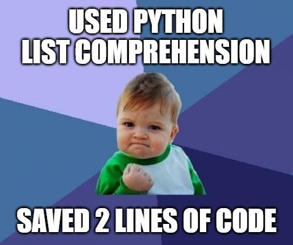
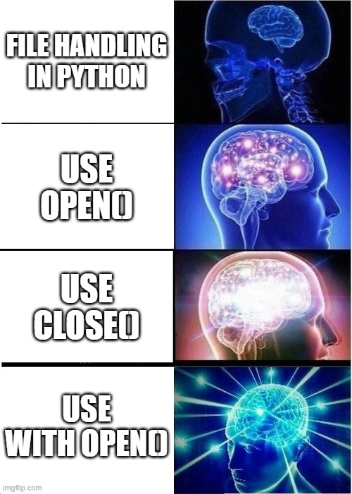

# Лекция 5. List comprehension. Встроенные функции Python. Работа с файлами.

## List Comprehension

У каждого языка программирования есть свои особенности и преимущества. Одна из культовых фишек Python — list comprehension (редко переводится на русский, но можно использовать определение «генератора списка»). Comprehension легко читать, и их используют как начинающие, так и опытные разработчики.

List comprehension — это упрощенный подход к созданию списка, который задействует цикл `for`, а также инструкции `if-else` для определения того, что в итоге окажется в финальном списке.

**Синтаксис List Comprehension**

```python
new_list = [expression for item in iterable if condition]
```

Разберем:

- `new_list` - новый список, который будет создан.
- `expression` - выражение, которое определяет, какие элементы будут включены в новый список.
- `item` - переменная, которая принимает каждый элемент из итерируемой последовательности.
- `iterable` - итерируемая последовательность, например, список или кортеж.
- `condition` (опционально) - условие, которому должен соответствовать элемент, чтобы быть включенным в новый список(не обязательный елемент).

Пример:

```python
numbers = [x for x in range(5)]
print(numbers)  # [0, 1, 2, 3, 4]
```

Здесь создается список чисел от 0 до 4 без использования `for` и `append()`.
Вот как бы выглядел код через `for` и `append()`.

```python
numbers = []
for x in range(5):
    numbers.apend(x)
print(numbers)
```



Так же можно делать List comprehension с изменением списка, Например создания списка квадратов чисел.

```python
numbers = [x**2 for x in range(5)]
print(numbers)  # [0, 1, 4, 9, 16,]
```

**Пример с применением условия (фильтрация)**

```python
evens = [x for x in range(10) if x % 2 == 0]
print(evens)  # [0, 2, 4, 6, 8]
```

Эта программа выводит только четные числа.

**Работа со строками и списками**

Получение списка букв из строки

```python
letters = [char for char in "Python"]
print(letters)  # ['P', 'y', 't', 'h', 'o', 'n']
```

**Преобразование списка строк в числа**

```python
strings = ["1", "2", "3"]
numbers = [int(x) for x in strings]
print(numbers)  # [1, 2, 3]
```

Вложенные List Comprehension
Можно использовать вложенные циклы.

**Создание списка пар чисел**

```python
pairs = [[x, y] for x in range(3) for y in range(2)]
print(pairs)  # [[0, 0], [0, 1], [1, 0], [1, 1], [2, 0], [2, 1]]
```

Этот код эквивалентен:

```python
pairs = []
for x in range(3):
    for y in range(2):
        pairs.append((x, y))
```

### Практические задания

1️. Создайте список чисел от 1 до 20, но оставьте только те, которые делятся на 3.

2️. Создайте список квадратов чисел от 1 до 10, но только для нечетных чисел.

3️. Создайте список первых букв из списка слов ["apple", "banana", "cherry"].

4. Создайте таблицу умножения от 1 до 5, используя вложенный list comprehension.

5. Есть список чисел. Создать список на его основе, но взять только отрицательные значения.

### Встроенные функции Python

Python предоставляет встроенные функции, которые значительно упрощают обработку данных. Эти функции позволяют быстро выполнять математические вычисления, сортировку, проверку условий и многое другое. Сейчас мы познокомимся с несколькими встроенными методами Python, включая `sum`, `all`, `any`, `sorted`, `len`, `min` и `max`.

**`sum()` – сумма элементов**

Функция `sum()` используется для вычисления суммы элементов в итерируемом объекте (списке, кортеже и т. д.).

Синтаксис:

```python
sum(iterable, start)
```

`iterable` – последовательность чисел (список, кортеж и др.).
`start` (необязательный) – число, с которого начнётся сложение (по умолчанию 0).

**Примеры использования sum()**

```python
numbers = [1, 2, 3, 4, 5]
print(sum(numbers))  # 15

print(sum(numbers, 10))  # 25 (начинаем суммирование с 10)
```

**`len()` – количество элементов**
Функция `len()` возвращает количество элементов в последовательности (списке, строке и др.).

Примеры использования `len()`

```python
numbers = [10, 20, 30, 40]
print(len(numbers))  # 4

word = "Python"
print(len(word))  # 6 (количество символов в строке)

empty_list = []
print(len(empty_list))  # 0 (список пустой)
```

**`max()` – максимальное значение**
Функция `max()` возвращает наибольший элемент в переданной коллекции.

Синтаксис:

```python
max(iterable, key=функция)
```

`iterable` – последовательность чисел или строк.
`key (необязательный)` – функция, применяемая к элементам перед сравнением.

**Примеры использования max()**

```python
numbers = [10, 25, 3, 7]
print(max(numbers))  # 25

words = ["apple", "banana", "cherry"]
print(max(words))  # "cherry" (по алфавиту)

# Найдём самое длинное слово:
print(max(words, key=len))  # "banana"
```

**`min()` – минимальное значение**
Функция `min()` работает аналогично `max()`, но возвращает наименьший элемент.

Примеры использования `min()`

```python
numbers = [10, 25, 3, 7]
print(min(numbers))  # 3

words = ["apple", "banana", "cherry"]
print(min(words))  # "apple"

# Найдём самое короткое слово:
print(min(words, key=len))  # "apple"
```

**`all()` – проверяет, что ВСЕ элементы истинные**
Функция `all() `возвращает `True`, если все элементы в последовательности не равны `False`. Если хотя бы один элемент `False`, функция вернёт `False`.

Примеры использования `all()`

```python
print(all([True, True, True]))  # True (все элементы True)
print(all([1, 2, 3]))  # True (все числа не равны 0 → считаются True)
print(all([1, 0, 3]))  # False (0 – это False)

words = ["hello", "world", ""]
print(all(words))  # False (пустая строка – это False)
```

Применение `all()` в условиях:

```python
numbers = [4, 6, 8, 10]
print(all(num % 2 == 0 for num in numbers))  # True (все числа чётные)
```

**`any()` – проверяет, что ХОТЯ БЫ ОДИН элемент истинный**
Функция `any()` возвращает True, если хотя бы один элемент последовательности является True.

Примеры использования `any()`

```python
print(any([False, False, True]))  # True (есть хотя бы один True)
print(any([0, 0, 0, 1]))  # True (есть ненулевое число)
print(any(["", "", "hello"]))  # True (есть непустая строка)
print(any([0, False, ""]))  # False (все значения эквивалентны False)
```

Применение `any()` в условиях:

```python
numbers = [1, 3, 5, 6]
print(any(num % 2 == 0 for num in numbers))  # True (есть хотя бы одно чётное число)
```

#### Практические задания

Списки для выполнения задач
```python
numbers = [3, -1, 7, 10, -5, 8, 2, -9, 6]
words = ["яблоко", "груша", "банан", "апельсин", "слива", "черника"]
```

1. Найдите сумму всех чисел в заданном списке.
2. Определите максимальное и минимальное значение среди чисел списка.
3. Отсортируйте список чисел как в порядке возрастания, так и убывания.
4. Выведите самое длинное слово из заданного списка.
5. Проверьте, содержатся ли в списке только положительные числа и выведите результат.
6. Определите, есть ли в списке хотя бы одно чётное число и отобразите соответствующее сообщение.
7. Вычислите сумму всех положительных элементов в списке.
8. Составьте отсортированный список строк, расположив их по длине от самых коротких к длинным.
9. Выведите все числа между двумя заданными значениями в обратном порядке.

### Работа с файлами в Python

#### Введение



Работа с файлами — одна из ключевых задач в программировании. В Python для этого используется встроенная функция `open()`, которая позволяет создавать, читать, записывать и редактировать файлы.
Файлы бывают текстовыми (например, `.txt`, `.csv`, `.json`) и бинарными (например, `.jpg`, `.png`, `.exe`). В этой лекции мы разберём основные операции с файлами.

#### Открытие и закрытие файлов

Прежде чем начать работать с файлом, его необходимо открыть. В Python используется функция `open()`.

Синтаксис:

```python
file = open("имя_файла", "режим")
```

После работы с файлом его нужно закрывать с помощью метода `.close()`.

```python
file.close()
```

Закрытие файла важно, чтобы освободить ресурсы и обеспечить целостность данных.

#### Режимы открытия файла:

| Режим | Описание                                                                                                                                                                    |
| ---------- | ----------------------------------------------------------------------------------------------------------------------------------------------------------------------------------- |
| `'r'`    | **Чтение (read)** – файл открывается только для чтения. Если файла не существует, будет ошибка.          |
| `'w'`    | **Запись (write)** – создаёт новый файл или перезаписывает существующий.                                                  |
| `'a'`    | **Добавление (append)** – данные добавляются в конец файла без удаления старых данных.                          |
| `'x'`    | **Создание (exclusive creation)** – создаёт новый файл, если он уже существует, будет ошибка.                          |
| `'b'`    | **Бинарный режим (binary)** – используется для работы с бинарными файлами (изображения, аудиофайлы). |
| `'t'`    | **Текстовый режим (text)** – используется по умолчанию.                                                                                 |

Примеры:

```python
# Открываем файл для чтения
file = open("example.txt", "r")

# Открываем файл для записи (перезапишет файл!)
file = open("example.txt", "w")

# Открываем файл для добавления текста в конец
file = open("example.txt", "a")
```

Давайте по подробнее познакомимся с каждым режимом.

#### Чтение данных из файла

Для чтения данных из файла используются методы:

- `.read()` – читает весь файл целиком.
- `.readline()` – читает одну строку из файла.
- .`readlines()` – читает все строки и возвращает их списком.

Примеры:

```python
file = open("example.txt", "r")
content = file.read()  # Читаем весь файл
print(content)
file.close()

file = open("example.txt", "r")
first_line = file.readline()  # Читаем первую строку
print(first_line)
file.close()

file = open("example.txt", "r")
all_lines = file.readlines()  # Читаем все строки как список
print(all_lines)
file.close()
```

#### Запись данных в файл
Чтобы записать данные в файл, используется метод `.write()`.

```python
file = open("example.txt", "w")  # Открываем в режиме записи
file.write("Привет, мир!\n")  # Записываем строку
file.write("Python - это круто!\n")
file.close()
```

#### Кодировка при записи файлов (encoding)

По умолчанию Python записывает файлы в системной кодировке, но для работы с текстом на разных языках, включая русский, важно явно указывать `encoding="utf-8"`.
Это предотвращает ошибки и делает файл читаемым на всех платформах.

Пример записи с кодировкой `UTF-8`:

```python
with open("example.txt", "w", encoding="utf-8") as file:
    file.write("Тестирование записи с кодировкой UTF-8.\n")
```

Если файл не существует, он будет создан. Если файл существует и его открыть в режиме `'w'`, его содержимое будет заменено.

Для добавления данных без удаления используем режим 'a':

```python
file = open("example.txt", "a")
file.write("Эта строка добавлена в конец файла.\n")
file.close()
```

#### Менеджер контекста (with open)

Обычно программисты используют `with open()`, потому что он автоматически закрывает файл после завершения работы с ним.

```python
with open("example.txt", "r") as file:
    content = file.read()
    print(content)
```

Этот способ предпочтительнее, так как не требует ручного вызова `.close()`.

#### Чтение и запись файлов построчно

Иногда файлы могут быть очень большими, и загружать их целиком в память неэффективно. В таких случаях используется построчное чтение.

```python
with open("example.txt", "r") as file:
    for line in file:
        print(line.strip())  # strip() убирает лишние пробелы и символы перевода строки
```

Аналогично можно записывать данные в файл построчно:

```python
data = ["Первая строка\n", "Вторая строка\n", "Третья строка\n"]

with open("example.txt", "w") as file:
    file.writelines(data)  # Записывает список строк
```

#### Работа с Бинарными Файлами
Все вышеупомянутые операции могут быть выполнены как с текстовыми, так и с бинарными файлами. Для работы с бинарными файлами используются режимы доступа `"rb"` (чтение бинарного файла) и `"wb" `(запись бинарного файла).

Бинарные файлы это все файлы которые нельзя прочитать как текст (картинки, исполняемые файлы итд.)

**Чтение бинарного файла**

```python
with open("binary_file.bin", "rb") as file:
    binary_data = file.read()
```
# Запись бинарного файла**

```python
with open("binary_file.bin", "wb") as file:
    binary_data = b'\x00\x01\x02\x03\x04'
    file.write(binary_data)
```

#### Практические задания

Пример строк

```md
Привет, мир!
1234567890
Это третья строка с текстом.
Python - это круто!
Последняя строка.
```

1. Создайте текстовый файл и запишите в него 5 строк с разными данными.

2. Напишите программу, которая читает файл построчно и выводит его содержимое.

3. Реализуйте программу, которая добавляет новую строку в конец существующего файла.

4. Напишите программу, которая копирует содержимое одного файла в другой.

5. Реализуйте программу, которая находит самую длинную строку в файле и выводит её длину.

#### Домашнее задание: List Comprehension и Запись в файл

**Задачи на List Comprehension**

1.Создайте список квадратов всех четных чисел от 1 до 20 с помощью list comprehension.

2. Из списка строк оставьте только те, что начинаются с буквы "А" (без учета регистра).

```python
words = ["Апельсин", "банан", "Авокадо", "Вишня", "ананас", "груша"]
```

3. Создайте список длины строк из другого списка, но только если длина больше 5 символов.

```python
words = ["кот", "автомобиль", "река", "компьютер", "дом"]
```

4. Из списка чисел оставьте только те, которые делятся на 3, и замените их на их куб.

```python
numbers = [1, 3, 5, 9, 12, 15, 18, 20]
```

**Задачи на запись в файл**

1. Запишите в файл numbers.txt все числа от 1 до 50, каждое на новой строке.

2. Создайте программу, которая записывает в файл words.txt только те слова из списка, которые короче 5 символов.

```python
words = ["яблоко", "груша", "кот", "авто", "дверь", "окно"]
```

3. Создайте программу, которая читает файл input.txt, переворачивает порядок строк и записывает результат в reversed.txt.

**Пример входного файла input.txt:**

```md
Первая строка.
Вторая строка.
Третья строка.
```

**Ожидаемый результат в reversed.txt:**

```md
Третья строка.
Вторая строка.
Первая строка.
```