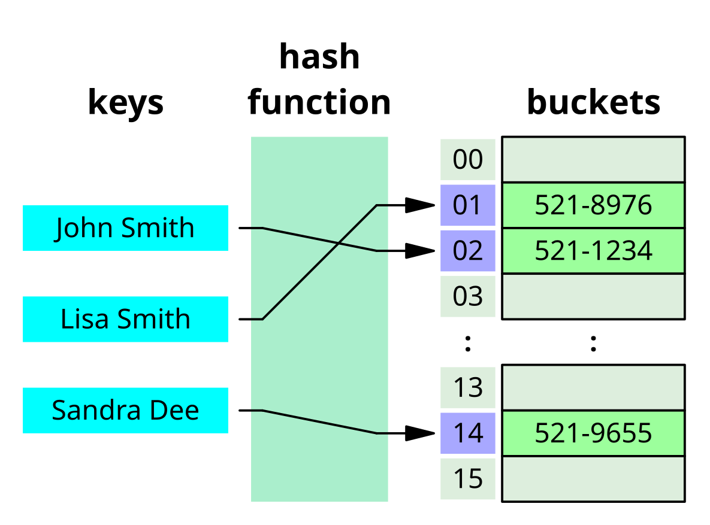

# Лекция 6. Хеш таблицы. Введение в кортежи(tuple), множества(set) и словари(dict).

## Введение

Прежде чем углубляться в изучение кортежей (`tuple`), множеств (`set`) и словари (`dict`), важно понимать, как они устроены и почему работают именно так.

Дело в том, что множества и словари в Python основаны на хеш-таблицах – одной из самых мощных структур данных. Благодаря им мы можем выполнять поиск, добавление и удаление элементов.

Чтобы лучше разобраться, как работают множества и словари, давайте сначала познакомимся с хешами, хеш-функциями и хеш-таблицами, ведь именно они определяют, как Python хранит и обрабатывает данные в этих структурах.

### Что такое хеш?

**Хеш**— это числовое значение фиксированной длины, которое получается в результате применения хеш-функции к исходным данным. Хеширование используется для быстрого поиска, хранения и сравнения данных.

Пример хеширования строки в Python с помощью встроенной функции `hash()`:

```python
print(hash("hello"))  # Выводит уникальное хеш-значение
```

Это число является уникальным представлением строки "hello" в памяти компьютера.

### Хеш-функция

**Хеш-функция** — это алгоритм, который преобразует входные данные в уникальное числовое значение фиксированной длины.

Требования к хорошей хеш-функции:

- Быстрое вычисление.
- Минимальное количество коллизий (разных входных данных, получающих одинаковый хеш).
- Определённость (одни и те же входные данные всегда дают один и тот же хеш).

Пример использования хеш-функции `hash()` для разных типов данных:

```python
print(hash("Python"))   
# -7782804934663510327  
print(hash(13))
# 12345
print(hash([1, 2, 3]))
# Traceback (most recent call last):
# File "<stdin>", line 1, in <module>
# TypeError: unhashable type: 'list'
```

#### Почему hash() работает только с неизменяемыми (immutable) типами?

Хеши используются, например, в словарях `(dict)` и множествах `(set)`, где важна быстрая проверка равенства и доступ к элементам по хешу.Чтобы это работало корректно, хеш объекта должен быть неизменным на протяжении всей его жизни. Если бы можно было использовать изменяемый объект как ключ, это могло бы привести к ошибкам:

```python
lst = [1, 2, 3]
d = {lst: "value"}     # допустим, это работает
lst.append(4)          # теперь lst изменился
```

Теперь `lst` имеет другой хеш, и поиск по ключу в словаре `d` будет невозможен. Чтобы избежать подобных проблем, Python запрещает хешировать изменяемые типы `(list, dict, set)`.

**Важно:** Хеш-функция `hash()` в Python не гарантирует одинаковые результаты при каждом запуске программы, так как Python использует случайное начальное значение хеширования для строк (начиная с Python 3.3). Это делается в целях безопасности (например, для предотвращения атак на хеш-таблицы).

#### Как получить стабильный хеш (например, для строк)

Если вам нужен одинаковый хеш вне зависимости от запуска — используйте модуль `hashlib`:

```python
import hashlib

h = hashlib.sha256("Python".encode()).hexdigest()
print(h)
# 18885f27b5af9012df19e496460f9294d5ab76128824c6f993787004f6d9a7db
```

### Что такое хеш-таблица?

**Хеш-таблица (Hash Table)** — это структура данных, которая позволяет быстро находить и сохранять данные с помощью хеширования. Она основана на словарах (`dict`) в Python.

Хеш-таблица работает так:

- Хеш-функция вычисляет хеш-значение ключа.
- Полученное значение используется как индекс в массиве для хранения данных.
- Если два разных ключа получают одинаковый индекс (коллизия), используется механизм разрешения коллизий.



По сути, программа берёт данные которые мы хотим указать в качестве ключа, хэшируем, и полученное значение используем как номер ячейки для запоминания.

По таким таблицам очень легко искать данные, и очень удобно отслеживать повторения в данных. Ведь хеш одних и тех же данных всегда будет одинаковым, а значит мы всегда можем отследить занята у нас ячейка или нет.

### Методы разрешения коллизий

Хеш-таблицы могут сталкиваться с ситуацией, когда разные ключи попадают в одну и ту же ячейку — это называется коллизией. Чтобы таблица продолжала работать корректно, применяется специальный механизм разрешения таких конфликтов.

В Python используется открытая адресация. Если нужная ячейка уже занята, система ищет следующую свободную, двигаясь по таблице (линейный пробинг). Такой же путь используется при поиске элемента. Данные хранятся прямо в массиве, что ускоряет работу и хорошо использует кэш-память.

В других языках (например, Java) распространён метод цепочек, когда каждая ячейка — это список, в который добавляются элементы при коллизии. Python его не использует, так как открытая адресация эффективнее при небольшой загрузке.

Когда таблица заполняется более чем на 66–75%, происходит перехеширование: создаётся новая таблица большего размера, и все ключи пересчитываются с учётом нового размера. Это помогает сохранить быстродействие.

# Пример хеш-таблицы (открытая адресация)
Для наглядности рассмотрим простую хеш-таблицу из 8 ячеек. Представим, что мы хотим сохранить несколько строк: `"apple"`, `"banana"`, `"grape"`, `"peach"` и `"melon"`. Ниже — условные индексы, по которым каждый элемент попал в таблицу (на практике они вычисляются с помощью `hash() % size`).

| Индекс | Значение   |
| ------ | ---------- |
| 0      | `None`     |
| 1      | `"apple"`  |
| 2      | `"banana"` |
| 3      | `"grape"`  |
| 4      | `None`     |
| 5      | `None`     |
| 6      | `"peach"`  |
| 7      | `None`     |

Теперь добавим значение `"melon"`:

```python
hash("melon") % 8 = 2

```
> Предположим, что хеш-функция для `"melon"` возвращает 2.

Но ячейка 2 занята (`"banana"`), поэтому применяется открытая адресация:
 - проверяется индекс 3 — он тоже занят (`"grape"`),
 - проверяется индекс 4 — свободен → `"melon"` вставляется туда.

 | Индекс | Значение   |
| ------ | ---------- |
| 0      | `None`     |
| 1      | `"apple"`  |
| 2      | `"banana"` |
| 3      | `"grape"`  |
| 4      | `"melon"`  |
| 5      | `None`     |
| 6      | `"peach"`  |
| 7      | `None`     |


### Изменяемые и неизменяемые типы данных в Python

В Python все данные можно разделить на изменяемые (`mutable`) и неизменяемые (`immutable`). Это важно понимать, так как хеш-таблицы (словари и множества) работают только с неизменяемыми типами данных в качестве ключей.

#### Что значит "изменяемость"?

Изменяемость данных означает, можно ли изменить содержимое объекта после его создания без изменения его идентификатора в памяти.

- **Неизменяемые (immutable)** объекты – после создания их содержимое изменить нельзя.
- **Изменяемые (mutable) объекты** – можно менять их содержимое, но адрес объекта в памяти остается тем же.

| **Изменяемые типы данных (Mutable)** | **Неизменяемые типы данных (Immutable)** |
| -------------------------------------------------------------- | -------------------------------------------------------------------- |
| `list` (списки)                                        | `int` (целые числа)                                      |
| `set` (множества)                                   | `float` (числа с плавающей точкой)            |
| `dict` (словари)                                      | `str` (строки)                                               |
|                                                                | `tuple` (кортежи)                                           |
|                                                                | `frozenset` (замороженные множества)          |
|                                                                | `bool` (логический тип)                               |


Когда мы присваиваем новое значение неизменяемому объекту, Python не перезаписывает его, а создаёт новый объект с тем же именем. Чтобы в этом убедиться, достаточно проверить `id` — уникальный номер, который присваивается каждому объекту в Python:

```python
#числовые типы в Python — неизменяемые
int_obj = 10

print("id of int_obj: ", id(int_obj)) # 140720440490712

int_obj += 5
print("id of int_obj: ", id(int_obj)) # 140720440490872
```

Когда мы прибавляем 5 к переменной `int_obj`, на её месте создаётся новый объект с тем же именем. Заметьте: при первом выводе `id` равен `140720440490712`, а после выполнения операции сложения — `140720440490872`.

А вот идентификатор списка `list_obj` не меняется, потому что списки в Python — это изменяемые объекты:

```python
#а объекты типа list — изменяемые
list_obj = [10, 20, 30]
print("id of list_obj: ", id(list_obj)) #3068150586048

list_obj += [40]

print("id of list_obj: ", id(list_obj)) #3068150586048

list_obj[0] = 15

print("id of list_obj: ", id(list_obj)) #3068150586048
```

**Это надо запомнить!!!!**

К **неизменяемым** объектам относятся числа, строки и кортежи, а к **изменяемым** — списки, словари и множества. Это свойство нужно учитывать при передаче объектов в функцию(о которых мы поговорим по позже).

## Кортежи (`tuple`) в Python

### Что такое кортеж?

Кортеж (`tuple`) — это упорядоченная, неизменяемая коллекция данных в Python. Он похож на список, но с одним важным отличием: кортежи нельзя изменять после создания.
Кортежи используются в случаях, когда необходимо хранить несколько значений вместе, но не допускать их изменения в ходе выполнения программы.

**Создание кортежа**

Кортежи создаются с помощью круглых скобок `()`:

```python
# Пустой кортеж
empty_tuple = ()

# Кортеж из нескольких элементов
numbers = (1, 2, 3, 4, 5)
words = ("apple", "banana", "cherry")

# Кортеж с разными типами данных
mixed_tuple = (10, "Python", True, 3.14)

# Кортеж из одного элемента (важно ставить запятую!)
single_element_tuple = (42,)
```

Если не поставить запятую в одном элементе, Python воспримет это как обычное число или строку:

```python
not_a_tuple = (42)   # Это просто число!
print(type(not_a_tuple))  # <class 'int'>

real_tuple = (42,)   # Это кортеж
print(type(real_tuple))  # <class 'tuple'>
```

Кортежи можно конкатенировать(склеивать):

```python
my_tuple = 1, 2, 3
my_tuple = my_tuple + (4, 5)
# (1, 2, 3, 4, 5)

my_tuple += 6,
# (1, 2, 3, 4, 5, 6)
```

**Доступ к элементам кортежа**

Как и в списках, элементы кортежа можно получать по индексу:

```python
fruits = ("яблоко", "банан", "вишня")

print(fruits[0])  # яблоко
print(fruits[1])  # банан
print(fruits[-1]) # вишня (отрицательный индекс - с конца)
```

**Срезы в кортежах**

Кортежи поддерживают срезы так же, как списки:

```python
numbers = (0, 1, 2, 3, 4, 5, 6, 7, 8, 9)

print(numbers[2:5])  # (2, 3, 4)
print(numbers[:4])   # (0, 1, 2, 3)
print(numbers[5:])   # (5, 6, 7, 8, 9)
print(numbers[::2])  # (0, 2, 4, 6, 8) - шаг 2
```

**Неизменяемость кортежей**

Ключевая особенность кортежей – они **неизменяемые**. После создания кортеж нельзя изменить:

```python
my_tuple = (1, 2, 3)
my_tuple[0] = 100  # Ошибка! TypeError: 'tuple' object does not support item assignment
```

Но если кортеж содержит изменяемые объекты (например, списки), то их можно изменять:

```python
nested_tuple = (1, [2, 3], 4)
nested_tuple[1][0] = 99  # Это работает!
print(nested_tuple)  # (1, [99, 3], 4)
```

Как видно из примеров выше, кортеж может быть использован и в левой части оператора присваивания. Значения из кортежа в левой части оператора присваивания связываются с аналогичными элементами правой части. Этот факт как раз и дает нам такие замечательные возможности как массовая инициализация переменных и возврат множества значений из функции одновременно.

Чаще всего кортежи использую для получения данных из функции, хранения каких-то не меняющихся данных и т.п. Чем привлекательна работа с ними:

- работа с ними быстрее(по сравнению со списками);
- занимают в памяти меньше места;
- могут выступать в качестве ключей для словаря (если не содержат нехэшируемых значений);
- имеют только два метода, `count` и `index`;
- используются для массовой инициализации переменных и возврата сразу нескольких значений из функции;

Благодаря кортежам мы можем написать замену переменных в одну строку, в большинстве языков программирования, это чуть более сложная задача.

```python
a = 100
b = 200
a, b = b, a
```

## Множества (set) в Python

### Что такое множества?

**Множества (set)** — это **изменяемые**, неупорядоченные коллекции уникальных элементов. В отличие от списков и кортежей, в множествах не может быть повторяющихся значений.
В этом определении упомянуты три основные особенности сетов - изменяемость, уникальность и отсутствие сортировки.

Почему так?

Под капотом сет это хэш таблица, где в качестве значения, записывается само значения объекта. А это значит, что если мы попытаемся записать в сет дублирующее значение, мы просто перезапишем ту же самую строку хэш таблицы.

Отсутствие сортировки, Мы не контролируем значение хэша, а значит и не можем гарантировать в каком порядке будут записаны элементы.

Множества используются в задачах, где важно хранить только уникальные данные и выполнять быстрые операции над ними, такие как объединение, пересечение и разность.

Создание множества
Множество можно создать с помощью фигурных скобок `{}` или функции `set()`:

```python
# Создание множества с уникальными значениями
numbers = {1, 2, 3, 4, 5}
print(numbers)  # {1, 2, 3, 4, 5}

# Пустое множество (только через set, {} создаст пустой словарь!)
empty_set = set()
print(type(empty_set))  # <class 'set'>

# Создание множества из списка (дубликаты удалятся)
unique_numbers = set([1, 2, 3, 1, 2, 4])
print(unique_numbers)  # {1, 2, 3, 4}
```

**Выделим основные особенности множеств:**

- Нет повторяющихся элементов: при добавлении дубликатов они автоматически удаляются.
- Нет порядка: элементы множества хранятся в произвольном порядке.
- Нельзя изменять элементы: но можно добавлять и удалять.

#### Основные методы работы с множествами

**Добавление и удаление элементов**

Множества поддерживают методы `add()` и `remove()`:

```python
fruits = {"яблоко", "банан", "вишня"}
fruits.add("апельсин")  # Добавляем элемент
print(fruits)  # {'яблоко', 'банан', 'вишня', 'апельсин'}

fruits.remove("банан")  # Удаляем элемент
print(fruits)  # {'яблоко', 'вишня', 'апельсин'}
```

Метод `discard(value) `— удаляет элемент, но не вызывает ошибку, если элемента нет.

```python
fruits.discard("манго")  # Ошибки не будет, даже если элемента нет
```

Метод `pop()` — удаляет случайный элемент.

```python
element = fruits.pop()
print("Удалён:", element)  # Какой-то случайный элемент
```

Метод `clear()` — очищает множество:

```python
fruits.clear()
print(fruits)  # set()
```

#### Операции над множествами

Множества позволяют делать мощные операции, похожие на математические.

**Объединение (union)**

Объединяет элементы двух множеств (дубликаты удаляются):

```python
а = {1, 2, 3}
и = {3, 4, 5}
a | b  # {1, 2, 3, 4, 5}
```

**Разность множеств**

Возвращает элементы, которые есть в `а`, но нет в `b`:

```python
set1 = {1, 2, 3, 4, 5, 6}
set2 = {5, 6, 7, 8, 9}
set1 - set2  # Разность множеств
# {1, 2, 3, 4}
```

**Пересечение (intersection)**

Находит общие элементы двух множеств:

```python
set1 = {1, 2, 3, 4, 5, 6}
set2 = {5, 6, 7, 8, 9}
set1 & set2  # Пересечение множеств
# {5, 6}
```

**Симметрическая разность (symmetric_difference)**

Возвращает элементы, которые есть в одном из множеств, но не в обоих:

```python
set1 = {1, 2, 3, 4, 5, 6}
set2 = {5, 6, 7, 8, 9}
print(set1 ^ set2)  # Пересечение множеств
# {1, 2, 3, 4, 7, 8, 9}
```

**Проверка на подмножество и надмножество**

Подмножество (issubset) — проверяет, содержится ли одно множество в другом:

```python
X = {1, 2}
Y = {1, 2, 3, 4}

print(X.issubset(Y))  # True (X содержится в Y)
print(Y.issubset(X))  # False
```

Надмножество (issuperset) — проверяет, содержит ли одно множество другое:

```python
print(Y.issuperset(X))  # True (Y содержит X)
```

**Преобразование множества в список**

Иногда порядок элементов важен, и нам нужно преобразовать множество в список:

```python
numbers = {3, 1, 4, 1, 5, 9, 13, 200}
numbers_list = list(numbers)
print(numbers_list)  # [1, 3, 4, 5, 200, 9, 13] (но порядок может быть случайным!)
```

**Когда использовать множества?**

- Когда важны уникальные элементы (например, хранение ID пользователей).
- Когда нужно делать быстрые проверки на вхождение (x in my_set).
- Когда важны математические операции (объединение, пересечение).

**Пример использования множеств**

Допустим, у нас есть список студентов, записавшихся на разные курсы. Нужно узнать, какие студенты записались хотя бы на один курс:

```python
python_students = {"Анна", "Иван", "Сергей"}
java_students = {"Сергей", "Марина", "Анна"}

all_students = python_students | java_students
print(all_students)  # {'Анна', 'Иван', 'Сергей', 'Марина'}
```

**frozenset**

Также существует специальный тип данных который превращает сет в неизменяемый тип данных, он называется `frozenset`

```python
fs = frozenset([1, 2, 3, 4, 3, 2, 1])
# frozenset({1, 2, 3, 4})
```

## Словари (`dict`) в Python

Словари (`dict`) — это неупорядоченные коллекции пар "ключ-значение". В отличие от списков и кортежей, доступ к элементам в словаре осуществляется не по индексу, а по ключу.
Значением элемента словаря может быть любой тип данных, ключём элемента - любой хэшируемый (читай неизменяемый ( `immutable`)) тип данных, т.е. `str`, `int`, `float`, `tuple`.

Пример словаря:

```python
student = {
    "name": "Иван",
    "age": 20,
    "city": "Прага"
}
```

- `Ключ` — это уникальный идентификатор значения (например, `"name"`, `"age"`).
- `Значение` — это данные, связанные с этим ключом (`"Иван"`, `20`).

**Создание словаря**

Есть несколько способов создать словарь: Прямое создание, создание при помощи преобразования в тип (используя функцию `dict`), использую функцию `fromkeys` и через генератор словарей :)

Рассмотрим все эти способы на примере:

```python

d = {}  # Создание пустого словаря напрямую, обратите внимание это не сет, это словарь, что бы создать пустой сет нужно использовать s = set()

# {}
d1 = {'a': 1, 'b': 2}  # Создание словаря напрямую

# {'a': 1, 'b': 2}

# создание словаря при помощи функции dict, она же используется для приведения типов:
d = dict(short='dict', long='dictionary')
# {'short': 'dict', 'long': 'dictionary'}

d = dict([(1, 1), (2, 4)])
# {1: 1, 2: 4}

# создание словаря при помощи функции fromkeys:
d = dict.fromkeys(['a', 'b', 1, (1, 2)])
# {'a': None, 1: None, 'b': None, (1, 2): None}

# с заполнением одним значением
d = dict.fromkeys(['a', 'b', 1, (1, 2)], 4)
# {'a': 4, 1: 4, 'b': 4, (1, 2): 4}

# создание словаря при помощи генератора словарей (dict comprehension, по аналогии со списками) :
d = {a: a ** 2 for a in range(7)}
# {0: 0, 1: 1, 2: 4, 3: 9, 4: 16, 5: 25, 6: 36}
```

**Доступ к элементам словаря**

1️. Обращение по ключу

```python
print(student["name"])  # Анна
print(student["age"])   # 21
```

Если ключа нет, произойдет ошибка `KeyError`.

2️. Безопасное обращение с `get()`

```python
print(student.get("city"))  # None (нет ошибки, если ключа нет)
print(student.get("city", "Город не указан"))  # "Город не указан"
```

**Добавление и изменение элементов**

Добавлять новые пары "ключ-значение" в словарь можно просто присваиванием:

```python
student = {
    "name": "Иван",
    "age": 20,
}

student["city"] = "Прага"  # Добавляем новый ключ
student["age"] = 22  # Изменяем существующее значение
print(student)
```

**Удаление элементов**

1️. Удаление с `del`

```python
student = {
    "name": "Иван",
    "age": 20,
}

del student["age"]
print(student)
```

2️. Удаление и возврат значения с `pop()`

```python

city = student.pop("city", "Не найдено")
print(city)  # "Прага"
```

3️. Удаление всех элементов с `clear()`

```python
student.clear()
print(student)  # {}
```

#### Основные методы словарей

| Метод            | Описание                                                        |
| --------------------- | ----------------------------------------------------------------------- |
| `keys()`            | Возвращает список всех ключей                 |
| `values()`          | Возвращает список всех значений             |
| `items()`           | Возвращает пары (ключ, значение)              |
| `update(dict2)`     | Обновляет словарь элементами из `dict2`   |
| `pop(key, default)` | Удаляет ключ и возвращает его значение |
| `clear()`           | Удаляет все элементы                                  |

```python
# Создадим словарь
my_dict = {
    "name": "Alice",
    "age": 25,
    "city": "New York"
}

# keys() - Получаем список всех ключей
print("Ключи:", list(my_dict.keys()))

# values() - Получаем список всех значений
print("Значения:", list(my_dict.values()))

# items() - Получаем список пар (ключ, значение)
print("Пары ключ-значение:", list(my_dict.items()))

# update(dict2) - Обновляем словарь новыми значениями
new_data = {"age": 26, "job": "Developer"}
my_dict.update(new_data)
print("Обновленный словарь:", my_dict)

# pop(key, default) - Удаляем ключ и получаем его значение
removed_value = my_dict.pop("city", "Ключ не найден")
print("Удаленное значение:", removed_value)
print("Словарь после pop:", my_dict)

# clear() - Удаляем все элементы из словаря
my_dict.clear()
print("Словарь после очистки:", my_dict)
```

#### Перебор словаря в цикле

Словари удобно перебирать в цикле `for`.

**Перебор только ключей:**

```python
for key in student:
    print(key)
```

**Перебор ключей и значений:**

```python
for key, value in student.items():
    print(f"{key}: {value}")
```

**Когда использовать словари?**

- Когда нужен быстрый доступ по ключу (поиск в словаре быстрее, чем в списке).
- Когда данные логически связаны ("имя-возраст", "логин-пароль").
- Когда нужны гибкие структуры данных (словарь может содержать списки, кортежи, другие словари).

### Практические задания по кортежам, множествам и словарям

**Кортежи (tuple)**

1. Создайте кортеж из 5 различных чисел. Преобразуйте его в список, добавьте новое число, затем снова преобразуйте в кортеж.
2. Напишите программу, которая принимает кортеж строк и возвращает самый длинный элемент.
3. Даны два кортежа чисел. Объедините их и найдите среднее арифметическое всех элементов.
4. Преобразуйте список в кортеж и проверьте, содержит ли он число 10.
5. Дана строка. Разбейте её на слова и сохраните в кортеж. Затем выведите третье слово из кортежа.

**Множества (set)**

6. Создайте множество из случайных чисел. Добавьте в него новое число и удалите одно из существующих.
7. Даны два множества чисел. Найдите их пересечение (общие элементы).
8. Напишите программу, которая принимает список чисел и удаляет из него повторяющиеся значения с помощью множества.
9. Преобразуйте список слов в множество и выведите количество уникальных слов.
10. Проверьте, является ли одно множество подмножеством другого.

**Словари (dict)**

11. Создайте словарь студентов, где ключ — имя, а значение — баллы за тест. Добавьте нового студента и измените баллы у одного из них.
12. Напишите программу, которая принимает строку и подсчитывает количество вхождений каждого символа в виде словаря.
13. Даны два списка одинаковой длины: имена студентов и их оценки. Создайте словарь, где ключ — имя, а значение — оценка.
14. Напишите программу, которая принимает словарь товаров (название и цена) и выводит самый дорогой товар.
15. Дан список чисел. Сохраните в словаре число как ключ, а его квадрат как значение.

**Дополнительные задачи с преобразованием типов**

16. Преобразуйте список кортежей в словарь, где первый элемент каждого кортежа — ключ, а второй — значение.
17. Дан кортеж чисел. Преобразуйте его в множество и удалите наименьшее значение.
18. Напишите программу, которая преобразует множество строк в список, сортирует его и объединяет в одну строку.
19. Дан словарь, где ключи — строки, а значения — множества чисел. Найдите максимальное число среди всех множеств.
20. Преобразуйте список кортежей (ключ, значение) в словарь, затем выведите все ключи в отсортированном порядке.
