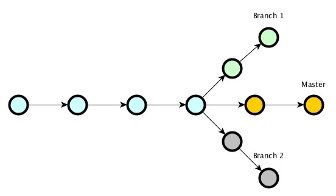
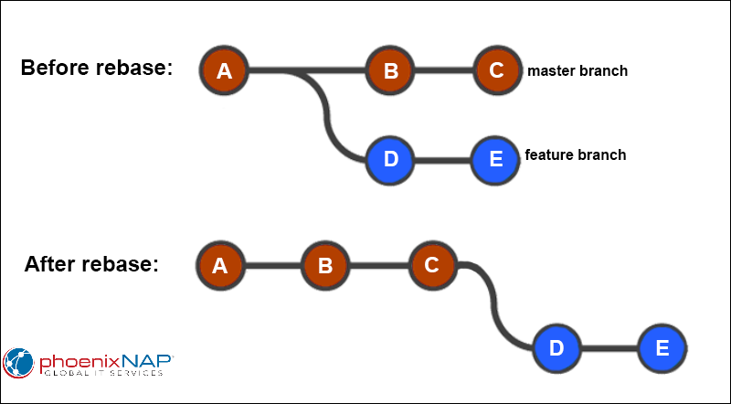

# Лекция 9. Введение в Git. Локальный репозиторий. Базовые команды.


## Введение в Git: зачем нужен контроль версий?

Сегодня мы познакомимся с системой контроля версий Git — одной из самых популярных технологий, используемых в разработке программного обеспечения. В ходе лекции мы разберём, что такое контроль версий, почему он важен, как появился Git и какие задачи он решает.

Что такое система контроля версий и зачем она нужна?
Представьте, что вы работаете над дипломной работой, важным отчетом или проектом. В какой-то момент на вашем компьютере появляются файлы с названиями:

- `проект_финал.docx`
- `проект_финал_новая_версия.docx`
- `проект_финал_окончательный_точно.docx`

Знакомая ситуация? Когда изменений становится слишком много, легко потерять нужную версию или случайно удалить важную информацию. А теперь представте что вы работаете над проектом не один. Каждый делает свои изменения и с каждой версией становится все сложнее следить за проектом.

**Системы контроля версий (VCS – Version Control System)** решают эту проблему. Они позволяют отслеживать изменения, управлять разными версиями проекта и работать в команде без конфликтов.

### Почему системы контроля версий важны?

В процессе разработки ПО возникают типичные сложности:

- **Отслеживание изменений** – Кто и когда изменил код? Что именно изменилось?
- **Совместная работа** – Несколько разработчиков работают над одним проектом. Нужно, чтобы их изменения не конфликтовали.
- **История версий** – Возможность вернуться к прошлым версиям кода, если что-то сломалось.
- **Резервное копирование** – Данные хранятся не только на одном компьютере, но и на удалённых серверах.
- **Разработка новых функций** – Можно экспериментировать в отдельных ветках без риска сломать основной код.

### История Git: как он появился?

Прежде чем `Git` стал основной системой контроля версий, разработчики использовали другие инструменты для управления кодом. Однако каждая из этих систем имела свои недостатки, что и привело к созданию `Git`.

До 2005 года разработчики использовали централизованные системы контроля версий (CVCS - Centralized Version Control Systems). Среди самых популярных были:

**CVS (Concurrent Versions System)** – одна из первых систем контроля версий, разработанная в 1986 году. Позволяла нескольким разработчикам работать над одним кодом, но имела множество технических ограничений, например, отсутствие нормальной поддержки работы с бинарными файлами.

**SVN (Subversion)**– созданная в 2000 году, стала более удобным аналогом `CVS`. Поддерживала версионирование директорий, атомарные коммиты, но по-прежнему оставалась централизованной системой.

**Mercurial** – появилась примерно в одно время с `Git`, но из-за ряда особенностей не получила такого широкого распространения.

Главный недостаток централизованных систем – зависимость от сервера. Если сервер выходил из строя, разработчики теряли доступ к истории проекта и не могли продолжать работу.

### Использование BitKeeper в разработке Linux

В 2002 году команда разработчиков ядра Linux начала использовать BitKeeper – коммерческую систему контроля версий, которая предоставлялась бесплатно для проектов с открытым исходным кодом. BitKeeper позволял эффективно управлять огромным кодом ядра Linux и обеспечивал некоторые преимущества перед централизованными системами.

Однако у BitKeeper был критический недостаток – его владельцы могли в любой момент изменить условия использования. И это произошло.

### Конфликт вокруг BitKeeper и рождение Git

В 2005 году владельцы BitKeeper (компания BitMover) отозвали бесплатные лицензии для проекта Linux. Причиной стала попытка одного из разработчиков Linux (Эндрю Триджелла) создать инструмент для работы с BitKeeper, что не понравилось BitMover. В результате команда Linux потеряла доступ к своему инструменту управления кодом.

Линус Торвальдс, создатель Linux, осознал, что Linux-ядро должно контролировать свою систему версионирования, а не зависеть от коммерческих решений.


**Цели новой системы контроля версий:**

- Распределённость – каждый разработчик должен иметь полную копию проекта.
- Высокая скорость – операции должны выполняться быстрее, чем в существующих системах.
- Простота работы с ветками – легко создавать, объединять и удалять ветки без потери данных.
- Защищённость данных – предотвращение потери истории коммитов.

### Создание Git

В апреле 2005 года Линус Торвальдс начал работу над новой системой контроля версий. Первоначальный код был написан всего за две недели, и новая система получила название `Git`.

### Почему "Git"?

Линус Торвальдс сам шутил на эту тему, заявляя, что `"Git"` (в британском сленге – "придурок") – это название, которое хорошо подходит как для него самого, так и для названия программы. Также есть версии, что Git – это аббревиатура:

- "Global Information Tracker" – если он работает отлично.
- "Garbage in, garbage out" – если что-то пошло не так.

### Развитие Git и его популярность

После первого релиза `Git` быстро стал популярным. Разработчики ядра Linux начали активно использовать его для управления кодом. Благодаря открытому коду и гибкости `Git` начали применять и другие проекты с открытым исходным кодом.

В 2008 году появилась платформа `GitHub`, которая сделала `Git` ещё популярнее. Теперь тысячи разработчиков могли легко размещать свои проекты, совместно работать над ними и контролировать версии кода.

На сегодняшний день `Git` – это стандарт в мире программирования. Практически все IT-компании используют его для управления кодом, а разработчики по всему миру учат `Git` как один из первых инструментов в программировании.

### Итог

Git появился как ответ на коммерческую систему BitKeeper и был создан из необходимости. Сегодня он является неотъемлемой частью работы программистов, предоставляя удобный, быстрый и надёжный способ контроля версий.

## Изучили теорию теперь преступим к практике!!!

### Установка Git

#### Windows

- Скачайте Git for Windows с [официального сайта](https://git-scm.com/).
- Установите, оставляя настройки по умолчанию.

**Проверьте установку:**

```sh
git --version
```

#### MacOS

```sh
brew install git
```

#### Linux (Ubuntu/Debian)

```sh
sudo apt update
sudo apt install git
```

#### Первоначальная настройка Git

После установки важно задать имя и email пользователя:

```sh
git config --global user.name "Ваше Имя"
git config --global user.email "your_email@example.com"
```

Проверка настроек:

```sh
git config --list
```

### Локальный репозиторий и базовые команды Git

Теперь, когда мы знаем, зачем нужен Git и как он появился, давайте разберёмся с его основными возможностями и научимся работать с репозиторием.

### Что такое репозиторий?

Репозиторий – это место, где хранятся файлы проекта и история их изменений. Можно выделить два типа репозиториев:

- **Локальный** – находится на вашем компьютере.
- **Удалённый** – хранится на сервере (например, на GitHub, GitLab, Bitbucket).

В этой лекции мы поговорим о локальном репозитории

#### Создание локального репозитория

Чтобы превратить обычную папку в Git-репозиторий, достаточно выполнить команду:

```sh
git init
```

Эта команда создаст в папке скрытую директорию .git, где будет храниться информация о всех изменениях файлов.

> Важно: Если вы не видите .git, убедитесь, что у вас включено отображение скрытых файлов!!!

Теперь папка стала локальным репозиторием и готова к работе.

#### Состояния файлов в Git

Каждый файл в репозитории может находиться в одном из четырёх состояний:


- **Untracked (Неотслеживаемый)** – новый файл, о котором Git пока ничего не знает.
- **Modified (Изменённый)** – файл уже отслеживается, но в него внесены изменения.
- **Staged (Подготовленный)** – файл отмечен для следующего коммита.
- **Committed (Зафиксированный)** – файл сохранён в истории Git.

Эти состояния можно увидеть с помощью команды:

```sh
git status
```

### Основные команды Git

#### 1. Добавление файлов в индекс (стадия staged)

Чтобы начать отслеживать новый файл или зафиксировать изменения в существующем, используйте команду:

```sh
git add имя_файла
```

Если нужно добавить сразу все файлы, можно использовать точку:

```sh
git add .
```

Эта команда добавляет только новые и изменённые файлы из текущей директории (где выполняется команда) и её поддиректорий, но не удалённые файлы. Если нужно добавить все изменения в репозитории: новые, изменённые и удалённые файлы, из всех директорий проекта, независимо от того, где была выполнена команда.

```sh
git add -A
```

Теперь файлы находятся в состоянии Staged и готовы к коммиту.

#### 2. Фиксация изменений (Commit)

После подготовки файлов их нужно зафиксировать в истории:

```sh
git commit -m "Сообщение о коммите"
```

Сообщение о коммите должно быть осмысленным, чтобы другие разработчики (и вы сами через пару месяцев) понимали, что изменилось.

**Пример:**

```sh
git commit -m "Добавил главную страницу и стили"
```

#### 3. Просмотр истории коммитов

Чтобы увидеть список всех коммитов, используйте команду:

```sh
git log
```

Она покажет:

- Хеш коммита (уникальный идентификатор)
- Автора изменений
- Дату фиксации
- Сообщение коммита

Для краткого отображения можно использовать:

```sh
git log --oneline
```

#### 4. Переключение между коммитами (Checkout)

Если нужно вернуться к прошлой версии проекта, используйте команду:

```sh
git switch --detach хеш_коммита
```

Чтобы снова вернуться к последнему состоянию:

```sh
git switch main
```

### Система ветвления (Branching) в Git

Git предоставляет мощную систему ветвления, позволяющую вести параллельную разработку различных частей проекта. Ветки в Git — это альтернативные версии кода, которые можно свободно создавать, переключать, объединять и удалять.

#### Как работает ветвление?

Каждый коммит в Git запоминает ссылку на предыдущий коммит, таким образом образуя цепочку изменений. При этом Git позволяет создавать разные цепочки коммитов (ветки), которые могут развиваться независимо друг от друга.



#### Главные особенности веток в Git:

- Позволяют изолировать разработку новой функциональности, не затрагивая основной код.
- Обеспечивают удобную работу в команде, где разные разработчики могут вести работу параллельно.
- Легко объединяются между собой с помощью `merge` или `rebase`(об этом поговорим чуть позже).

#### Зачем нужны ветки?

**Ветки позволяют:**

- Работать над новыми функциями отдельно от основного кода.
- Исправлять ошибки без влияния на основную ветку.
- Тестировать изменения, не затрагивая рабочий код.
- Работать в команде, разделяя задачи между разработчиками.

Например, представьте, что у вас есть основной код `(main)`, и вам нужно добавить новую функцию. Вместо того, чтобы изменять основной код, вы создаёте новую ветку `(feature/new-function)` и работаете там. Если всё работает — сливаете её с `main`.


#### Как посмотреть текущие ветки?

Чтобы увидеть список всех веток в проекте, используйте команду:

```sh
git branch
```

Она покажет список локальных веток, а текущая ветка будет отмечена *.

#### Как создать новую ветку?

Создать новую ветку можно командой:

```sh
git branch new-feature
```

Теперь в репозитории появилась новая ветка, но `Git` остаётся в старой ветке. Чтобы переключиться на новую, используйте:

```sh
git checkout new-feature
```

> Совет: Можно создать и сразу переключиться на новую ветку одной командой:

```sh
git checkout -b new-feature
```

**Переключение между ветками**

Чтобы переключиться на другую ветку, используйте:

```sh
git checkout branch-name
```

Или современный аналог:

```sh
git switch branch-name
```

Чтобы вернуться в основную ветку:

```sh
git checkout main
```

**Удаление ветки**

После слияния ветки её можно удалить:

Удалить локальную ветку (если она больше не нужна):

```sh
git branch -d branch-name
```

Если ветка ещё не слита с основной, Git предупредит об этом. Если вы уверены, используйте:

```sh
git branch -D branch-name
```

### Слияние веток (merge)


Когда работа в ветке завершена, её можно объединить с основной. Для этого:

Переключитесь на основную ветку:

```sh
git checkout main
```

Выполните слияние:

```sh
git merge new-feature
```

Эта команда выполнит слияние указанной ветки с той веткой в которой вы в этот момент находитесь.

Что значит слияние, это значит что git найдет первый коммит который для двух веток является общим. После чего попытается "наложить" коммиты из вашей ветки, поверх основной и создать еще один коммит, под названием " merge-commit". Он создается при слиянии.

### Перебазирование (git rebase)

`Git rebase` — это мощный инструмент, который позволяет переставлять коммиты, делая историю более чистой и линейной. В отличие от merge, который сохраняет ветвление, rebase меняет базу (основание) текущей ветки, накладывая её изменения поверх другой ветки.



#### Что делает rebase?

При выполнении команды:

```sh
git rebase main
```

**Git:**

- Находит общий предок (common ancestor) двух веток.
- Копирует коммиты текущей ветки, начиная от этого предка.
- Применяет их поверх указанной ветки (main), как если бы они были созданы в ней изначально.

**Важно!**

`rebase` не просто объединяет изменения, а полностью переписывает историю, что делает её более чистой.


### Конфликты


При работе с `Git` мы часто(нет очень часто!!!!) сталкиваемся с конфликтами. Конфликт возникает, когда две ветки изменяют одну и ту же часть файла и `Git` не может автоматически определить, какие изменения оставить.

Разберёмся, почему возникают конфликты, как их избежать и как правильно их разрешать.

#### Когда возникают конфликты?

Конфликты в Git случаются при слиянии `(merge)` или перебазировании `(rebase)` веток, если:

- Один и тот же участок кода был изменён в обеих ветках.
- Один разработчик изменил строку кода, а другой удалил её.
- В одном коммите файл был переименован или удалён, а в другом — отредактирован.

Git уведомит вас о конфликтных файлах, и вам нужно будет вручную их разрешить. После разрешения конфликтов, добавьте исправленные файлы и создайте коммит:

```sh
git add conflict-file.txt
git commit -m "Resolved merge conflict"
```

Просмотр различий
Чтобы увидеть различия между текущими изменениями и последним коммитом, используйте команду:

```sh
git diff
```

Эта команда покажет, какие строки были добавлены или удалены.

Удаление файлов
Чтобы удалить файл из репозитория и системы, используйте команду:

```sh
git rm example.txt
```

Для удаления файла только из индекса, оставив его в файловой системе, выполните:

```sh
git rm --cached example.txt
```

## Игнорирование файлов (.gitignore)

 `.gitignore` - это специальный файл в Git, который указывает, какие файлы или папки не должны отслеживаться системой контроля версий. Это полезно для исключения временных файлов, конфиденциальных данных или файлов, которые генерируются автоматически.

### Пример использования

Создайте файл `.gitignore` в корне вашего проекта и добавьте в него файлы или папки, которые нужно игнорировать. Например:

```
# Игнорировать временные файлы
*.log
*.tmp

# Игнорировать папку с виртуальным окружением
venv/

# Игнорировать файлы конфигурации IDE
.vscode/
.idea/

# Игнорировать файлы с секретными данными
.env
```

### Как добавить .gitignore в проект?

- Создайте файл `.gitignore` в корне вашего проекта.
- Добавьте в него файлы или папки, которые нужно игнорировать.
- Убедитесь, что `.gitignore` сам отслеживается `Git`:

```sh
git add .gitignore
git commit -m "Добавлен файл .gitignore"
```

## Что такое HEAD?

`HEAD` – это указатель на текущую ветку и последний коммит в этой ветке. Проще говоря, `HEAD` показывает, где вы
находитесь
в дереве изменений вашего репозитория в данный момент.

Представьте `HEAD` как закладку в книге. Когда вы переключаетесь между ветками или коммитами, `HEAD` меняет своё
положение,
указывая на соответствующий коммит.

### Как работает `HEAD`?

В Git `HEAD` обычно указывает на ветку, а ветка, в свою очередь, указывает на коммит. В файле `.git/HEAD` содержится
ссылка
на файл, представляющий текущую ветку. Если вы откроете этот файл, то увидите что-то вроде:

```
ref: refs/heads/main
```

Это означает, что `HEAD` указывает на ветку `main`. Когда вы делаете новый коммит, указатель `HEAD` автоматически
перемещается
на этот новый коммит.

### Типы HEAD

В Git существует два состояния HEAD:

- Указывает на ветку (обычное состояние):

> В этом случае HEAD указывает на ветку, и любое действие, которое вы совершаете, будет относиться к этой ветке.
> Например,
> при коммите HEAD и указатель ветки будут двигаться вперёд.

- Отсутствие привязки к ветке (detached HEAD):

> Это состояние, когда HEAD указывает непосредственно на коммит, а не на ветку. Обычно это происходит, когда вы
> переключаетесь на конкретный коммит с помощью команды git checkout <commit-hash>. В таком состоянии любые изменения и
> коммиты не будут привязаны к какой-либо ветке.
> Основные команды работы с HEAD
> Проверка текущего состояния HEAD:

```shell
git log --oneline --decorate
```

Эта команда покажет список коммитов и укажет, на каком из них находится `HEA`D.

Переключение между ветками:

```shell
git checkout <branch-name>

```

Эта команда переместит `HEAD` на указанную ветку.

Переключение на конкретный коммит (`detached HEAD`):

```shell
git checkout <commit-hash>

```

Это переместит `HEAD` на указанный коммит без привязки к ветке.

Создание новой ветки и переключение на неё:

```shell
git checkout -b <new-branch-name>
```

Эта команда создаст новую ветку и переместит `HEAD` на неё.

## git reset

### Что такое `git reset`?

**`git reset`** – это мощная команда в Git, которая позволяет перемещать указатель текущей ветки и опционально изменять
состояние индекса (staging area) и рабочего каталога. Основная цель этой команды – отменить изменения или переместить
HEAD на другой коммит.

### Синтаксис команды `git reset`

```sh
git reset [<mode>] [<commit>]
```

Где `<mode>` – это один из трёх режимов работы команды, а `<commit>` – это ссылка на коммит, к которому вы хотите
переместить HEAD.

### Режимы работы `git reset`

1. **--soft**:
    - Перемещает HEAD к указанному коммиту.
    - Индекс и рабочий каталог остаются неизменными.
    - Используется для отмены последних коммитов, сохраняя изменения для повторного коммита.

   ```sh
   git reset --soft <commit>
   ```

2. **--mixed** (по умолчанию):
    - Перемещает HEAD к указанному коммиту.
    - Индекс сбрасывается до состояния указанного коммита.
    - Рабочий каталог остаётся неизменным.
    - Используется для отмены коммитов и удаления изменений из индекса, оставляя их в рабочем каталоге.

   ```sh
   git reset --mixed <commit>
   ```

3. **--hard**:
    - Перемещает HEAD к указанному коммиту.
    - Индекс и рабочий каталог сбрасываются до состояния указанного коммита.
    - Используется для полной отмены коммитов и всех изменений в рабочем каталоге и индексе.

   ```sh
   git reset --hard <commit>
   ```

### Примеры использования `git reset`

1. **Отмена последнего коммита, сохраняя изменения для повторного коммита**:

   ```sh
   git reset --soft HEAD~1
   # HEAD перемещается на один коммит назад, изменения сохраняются в индексе
   ```

2. **Отмена последнего коммита и удаления изменений из индекса**:

   ```sh
   git reset --mixed HEAD~1
   # HEAD перемещается на один коммит назад, изменения остаются в рабочем каталоге
   ```

3. **Полная отмена последнего коммита и всех изменений**:

   ```sh
   git reset --hard HEAD~1
   # HEAD перемещается на один коммит назад, все изменения отменяются
   ```

4. **Перемещение HEAD на конкретный коммит**:

   ```sh
   git reset --hard <commit-hash>
   # HEAD перемещается на указанный коммит, состояние репозитория возвращается к этому коммиту
   ```

5. **Отмена нескольких последних коммитов**:

   ```sh
   git reset --hard HEAD~3
   # HEAD перемещается на три коммита назад, все изменения отменяются
   ```

### Важные замечания при использовании `git reset`

- **Режим `--hard`**: Будьте особенно осторожны при использовании этого режима, так как он удаляет все несохранённые
  изменения в рабочем каталоге и индексе, и их нельзя будет восстановить.
- **Резервное копирование**: Перед выполнением `git reset --hard` рекомендуется создать резервную копию текущего
  состояния репозитория или создать новую ветку для сохранения изменений.

### Альтернативы `git reset`

В некоторых случаях другие команды могут быть более подходящими для вашей задачи:

- **`git revert`**: Используйте для отмены конкретных коммитов, создавая новые коммиты с противоположными изменениями.
  Это сохраняет историю изменений.

  ```sh
  git revert <commit>
  ```

- **`git checkout`**: Используйте для переключения веток или возврата к определённому коммиту в
  состоянии `detached HEAD`.

  ```sh
  git checkout <commit>
  ```

- **`git restore`**: Используйте для восстановления файлов из коммита или индекса без изменения состояния ветки или
  истории.

  ```sh
  git restore --source=<commit> --staged --worktree <file>
  ```

Команда `git reset` – это мощный инструмент для управления историей коммитов и состоянием репозитория в Git. Понимание
различных режимов работы этой команды и их правильное использование поможет вам эффективно управлять изменениями и
сохранять чистую историю вашего проекта. Всегда помните о последствиях использования `git reset` и выбирайте наиболее
подходящий инструмент для вашей задачи.

## Chery-pick


### Что такое `git cherry-pick`?

**`git cherry-pick`** – это команда Git, которая позволяет перенести изменения из одного или нескольких коммитов в текущую ветку. Эта команда создаёт новые коммиты в текущей ветке с теми же изменениями, что и в выбранных коммитах, сохраняя их идентичность.

### Синтаксис команды `git cherry-pick`

```sh
git cherry-pick [options] <commit-hash>...
```

Где `<commit-hash>` – это идентификаторы коммитов, которые вы хотите перенести.

### Основные опции `git cherry-pick`

- `-e` или `--edit`: Открыть редактор для изменения сообщения коммита перед созданием нового коммита.
- `-n` или `--no-commit`: Применить изменения, но не делать новый коммит автоматически.
- `-x`: Добавить строку в сообщение коммита, указывающую на оригинальный коммит.
- `--continue`: Продолжить выполнение `cherry-pick` после разрешения конфликтов.
- `--abort`: Прервать операцию `cherry-pick` и вернуть ветку в исходное состояние до начала операции.
- `--skip`: Пропустить коммит, вызвавший конфликт, и продолжить выполнение `cherry-pick`.

### Примеры использования `git cherry-pick`

1. **Применение одного коммита в текущую ветку**:

   ```sh
   git cherry-pick abc123
   # Применить изменения из коммита abc123 в текущую ветку
   ```

2. **Применение нескольких коммитов в текущую ветку**:

   ```sh
   git cherry-pick abc123 def456 ghi789
   # Применить изменения из коммитов abc123, def456 и ghi789 в текущую ветку
   ```

3. **Применение диапазона коммитов**:

   ```sh
   git cherry-pick abc123..def456
   # Применить изменения из всех коммитов в диапазоне от abc123 до def456 (исключая abc123)
   ```

4. **Применение коммита с редактированием сообщения**:

   ```sh
   git cherry-pick -e abc123
   # Применить изменения из коммита abc123 и открыть редактор для изменения сообщения коммита
   ```

5. **Применение коммита без автоматического создания нового коммита**:

   ```sh
   git cherry-pick -n abc123
   # Применить изменения из коммита abc123, но не делать новый коммит автоматически
   ```

6. **Применение коммита с добавлением ссылки на оригинальный коммит**:

   ```sh
   git cherry-pick -x abc123
   # Применить изменения из коммита abc123 и добавить строку в сообщение коммита с ссылкой на оригинальный коммит
   ```

### Разрешение конфликтов при `git cherry-pick`

Иногда при выполнении команды `git cherry-pick` могут возникать конфликты. В таких случаях Git остановит выполнение и предоставит возможность вручную разрешить конфликты.

1. **Разрешение конфликтов**:
   - Откройте файлы с конфликтами и внесите необходимые изменения.
   - Добавьте исправленные файлы в индекс с помощью команды `git add`.

2. **Продолжение выполнения `cherry-pick`**:

   ```sh
   git cherry-pick --continue
   # Продолжить выполнение cherry-pick после разрешения конфликтов
   ```

3. **Прерывание выполнения `cherry-pick`**:

   ```sh
   git cherry-pick --abort
   # Прервать операцию cherry-pick и вернуть ветку в исходное состояние
   ```

### Примеры ситуаций для использования `git cherry-pick`

1. **Перенос фикса ошибок в другие ветки**:
   - Вы обнаружили ошибку в основной ветке и исправили её, создав коммит. Теперь вы хотите перенести это исправление в релизную ветку.

2. **Выборочное применение изменений**:
   - Вы работаете над несколькими задачами в одной ветке, но хотите перенести только некоторые из них в другую ветку.

3. **Слияние отдельных изменений**:
   - Вы хотите объединить только определённые изменения из одной ветки в другую, без выполнения полного слияния веток.

Команда `git cherry-pick` – это мощный инструмент для выборочного применения изменений из одного или нескольких коммитов в текущую ветку. Понимание работы этой команды и её правильное использование помогут вам эффективно управлять изменениями в вашем проекте и поддерживать чистую историю коммитов.

#### Домашка:

Очень рекомендую пройти в эту [игру](https://learngitbranching.js.org/?locale=ru_RU)