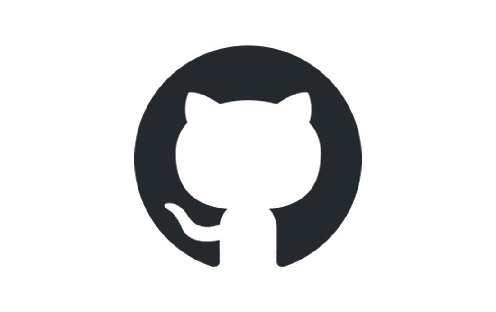
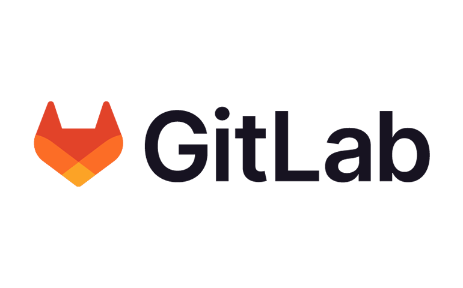
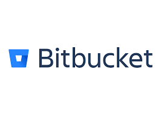
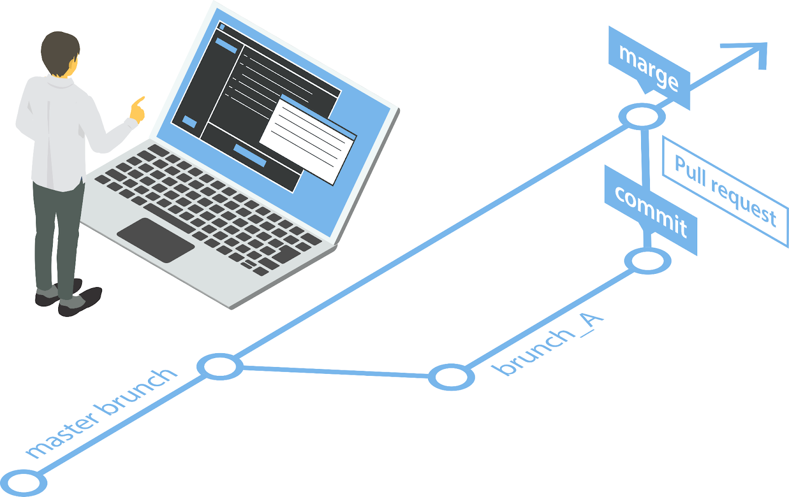

# Лекция 10. Git. Удаленный репозиторий.

## Что такое удалённый репозиторий?

Мы уже знаем, что локальный репозиторий — это Git-репозиторий, который находится на вашем компьютере. Однако при работе в команде или при необходимости синхронизации данных с разных устройств этого недостаточно. Для этого используются удалённые репозитории **(remote repositories)**.

**Удалённый репозиторий** – это хранилище кода, расположенное на сервере. Оно позволяет разработчикам из разных мест работать над одним проектом, обмениваться кодом и вносить изменения.

### Зачем нужны удалённые репозитории?

Удалённые репозитории решают множество задач, связанных с хранением и управлением кодом:

- **Доступ из любой точки мира**  – можно работать с кодом с разных устройств.
- **Совместная работа** – несколько разработчиков могут вносить изменения и синхронизировать их.
- **Резервное копирование**  – если ваш компьютер выйдет из строя, код останется на сервере.
- **История изменений**  – можно вернуться к любому коммиту и восстановить код.
- **Open-source проекты**  – удобное ведение проектов с открытым кодом, привлечение контрибьюторов.
- **CI/CD интеграция**  – автоматическое тестирование и деплой.


## Популярные платформы для работы с удалёнными репозиториями

На сегодняшний день существует несколько популярных платформ, которые позволяют управлять удалёнными Git-репозиториями. Рассмотрим их подробнее.

### GitHub – крупнейшая платформа для разработчиков



**GitHub** – это самая популярная платформа для хранения Git-репозиториев, принадлежащая Microsoft.

**Основные возможности:**

- Хранение публичных и частных репозиториев.
- Pull Requests – удобный инструмент для работы с изменениями.
- GitHub Actions – встроенные инструменты CI/CD.
- GitHub Pages – размещение статических сайтов.
- Интеграция с инструментами разработчиков (Jira, Slack, Docker и др.).

**Когда использовать?**

GitHub идеально подходит для индивидуальных проектов, open-source разработки и командной работы.

### GitLab – мощная альтернатива для DevOps



**GitLab** – это не только платформа для хранения кода, но и полноценное решение для DevOps.

**Основные возможности:**

- Поддержка приватных репозиториев.
- Встроенная система CI/CD для автоматизации тестирования и деплоя.
- Возможность развернуть GitLab на своём сервере (self-hosted).
- Гибкая настройка прав доступа.
- Инструменты для управления проектами (issue tracking, wikis).

**Когда использовать?**

GitLab отлично подходит для компаний и команд DevOps, которым нужна глубокая интеграция процессов разработки и развертывания.

### Bitbucket – интеграция с Atlassian



**Bitbucket** – платформа для хранения репозиториев, разработанная Atlassian.

**Основные возможности:**

- Гибкая система контроля доступа к коду.
- Интеграция с Jira и Trello.
- Бесплатные частные репозитории для небольших команд.
- Поддержка CI/CD через Bitbucket Pipelines.

**Когда использовать?**

Если ваша команда использует продукты Atlassian (Jira, Confluence, Trello), Bitbucket станет отличным выбором.

#### Azure DevOps – корпоративное решение от Microsoft


**Azure DevOps** – это комплексная платформа для управления кодом и процессами разработки.

**Основные возможности:**

- Полная интеграция с облачными сервисами Microsoft.
- Поддержка Git и TFVC (система управления версиями Microsoft).
- Встроенные инструменты CI/CD (Azure Pipelines).
- Возможность хранения и развертывания кода внутри корпоративной инфраструктуры.

**Когда использовать?**

Azure DevOps идеально подходит для крупных организаций, использующих облачные решения Microsoft.

### Какую платформу выбрать?

| **Платформа**     | **Основные преимущества**                                         | **Кому подходит?**                                  |
|-------------------|----------------------------------------------------------------|--------------------------------------------------|
| **GitHub**       | Удобный интерфейс, отличная поддержка open-source, мощные инструменты CI/CD | Разработчики, стартапы, open-source проекты     |
| **GitLab**       | Полноценная DevOps-платформа, возможность self-hosted развертывания | Крупные компании, команды DevOps                |
| **Bitbucket**    | Интеграция с Jira, бесплатные приватные репозитории             | Корпоративные команды, использующие Atlassian   |
| **Azure DevOps** | Глубокая интеграция с Microsoft, поддержка Git и TFVC          | Крупные компании, проекты в экосистеме Microsoft |

## Публичные и приватные репозитории в Git


Когда вы создаёте удалённый репозиторий, перед вами встаёт важный вопрос: делать его публичным или приватным? Разберём разницу между этими типами и их плюсы и минусы.

### Публичные репозитории

**Публичный репозиторий** – это репозиторий, доступ к которому может получить любой пользователь. Такие репозитории широко используются для open-source проектов, где важно вовлечение сообщества.

Преимущества публичных репозиториев:

- Открытый доступ – любой может просматривать, скачивать и использовать ваш код. Это помогает популяризировать проект и делать его доступным для широкой аудитории.
- Вклад сообщества – другие разработчики могут участвовать в вашем проекте, вносить предложения, исправлять ошибки, отправлять pull requests.
- Простота демонстрации – потенциальные работодатели или партнёры могут легко увидеть ваш код, что полезно для портфолио.
- Развитие через open-source – многие успешные проекты, такие как Linux, Python, Django, развиваются благодаря открытым репозиториям.

Недостатки публичных репозиториев:

- Отсутствие приватности – ваш код виден всем. Это может быть проблемой, если вы работаете над коммерческим проектом.

- Открытые уязвимости – если в коде есть ошибки или уязвимости, их может увидеть любой человек, в том числе злоумышленники.

- Отсутствие контроля над внешними форками – любой может скопировать ваш код, и вы не сможете запретить его использование.

### Приватные репозитории

**Приватный репозиторий** – это репозиторий, доступ к которому ограничен только определённым пользователям или командам. Чаще всего он используется для закрытых коммерческих проектов.

Преимущества приватных репозиториев:

- Контроль доступа – только авторизованные пользователи могут просматривать и изменять код.
- Защита интеллектуальной собственности – никто не сможет увидеть или использовать ваш код без разрешения.
- Безопасность – любые ошибки или уязвимости в коде останутся внутри команды, а не будут доступны широкой публике.
- Возможность вести закрытую разработку – часто используется в корпоративных проектах.

Недостатки приватных репозиториев:

- Ограниченное участие сообщества – если вы хотите привлечь сторонних разработчиков, вам придётся вручную давать доступ.
- Стоимость – многие платформы требуют плату за приватные репозитории (например, GitHub предлагает бесплатные приватные репозитории, но с ограничениями на количество участников в команде).
- Менее удобная демонстрация кода – ваш код скрыт, и если вам нужно его показать кому-то, нужно отдельно открывать доступ.

### Git-платформы и их политика приватности

| Платформа      | Публичные репозитории                 | Приватные репозитории                                       |
|---------------|-------------------------------------|----------------------------------------------------------|
| GitHub       | Бесплатные, доступны всем         | Бесплатные для небольших команд, платные для организаций |
| GitLab       | Бесплатные                        | Бесплатные с базовым функционалом, платные расширенные   |
| BitBucket    | Бесплатные                        | Бесплатные для малых команд, платные для организаций    |
| Azure DevOps | Не основная фишка платформы       | Используется для корпоративных решений                  |


### Как выбрать между публичным и приватным репозиториями?

**Используйте публичный репозиторий, если:**

- Вы разрабатываете open-source проект и хотите привлечь сообщество.
- Вам важно показать свой код (например, для портфолио).
- Вы хотите получать помощь от других разработчиков.

**Используйте приватный репозиторий, если:**

- Вы работаете над коммерческим проектом.
- В коде есть конфиденциальная информация (например, API-ключи, логины).
- Вы хотите защитить свой код от посторонних.

**Важно: В коммерческой разработке чаще всего используются приватные репозитории, а в обучении – публичные.**

## Варианты доступа к Git-репозиториям: HTTPS vs SSH

Git-репозитории могут быть доступны через два основных протокола: `SSH` и `HTTPS`. Их особенности мы подробно разберём позже в курсе, но сейчас рассмотрим основные различия.

### Доступ через HTTPS

**HTTPS (HyperText Transfer Protocol Secure)** — это протокол, использующий шифрование **SSL/TLS** для защиты передаваемых данных. Доступ к Git-репозиториям осуществляется с вводом логина и пароля.

**Пример URL для доступа через HTTPS:**

```sh
https://github.com/username/repository.git
```

#### Преимущества HTTPS:

- Простота настройки — достаточно ввести логин и пароль, удобно для новичков.
- Работа в ограниченных сетях — HTTPS проходит через большинство брандмауэров и прокси-серверов.
- Универсальность — поддерживается на любой операционной системе без дополнительной настройки.

#### Недостатки HTTPS:

- Неудобство частого ввода пароля — при каждом взаимодействии с репозиторием требуется вводить логин и пароль.
- Ограниченная безопасность — пароли могут быть перехвачены, в отличие от SSH-ключей.

### Доступ через SSH

**SSH (Secure Shell)** — протокол, обеспечивающий безопасное соединение с удалёнными системами. Аутентификация происходит через пару SSH-ключей: открытый и закрытый.

**Пример URL для доступа через SSH:**

```sh
git@github.com:username/repository.git
```

#### Преимущества SSH:

- Высокая безопасность — используется криптографическая пара ключей, пароль не передаётся по сети.
- Удобство — после настройки SSH-ключей не требуется вводить пароль при каждом подключении.
- Гибкость — можно настраивать доступ для разных пользователей и ключей.

#### Недостатки SSH:

- Сложность первоначальной настройки — требуется создание и настройка ключей.
- Может быть заблокирован в корпоративных сетях — некоторые компании ограничивают SSH-доступ.
- Примеры использования и настройки

### Настройка доступа через HTTPS

**Клонирование репозитория:**

```sh
git clone https://github.com/username/repository.git
```

При выполнении команд, взаимодействующих с удалённым репозиторием, потребуется вводить логин и пароль.

### Настройка доступа через SSH

Хорошая [статья](https://only-to-top.ru/blog/tools/2019-12-08-git-ssh-windows.html) по созданию SSH-ключей.

#### 1. Создание SSH-ключей

Для генерации SSH-ключей используйте следующую команду в терминале (Linux/macOS) или Git Bash (Windows):

```sh
ssh-keygen -t rsa -b 4096 -C "your_email@example.com"
```

Следуйте инструкциям и сохраните ключи в стандартной директории (~/.ssh/id_rsa и ~/.ssh/id_rsa.pub).

#### 2. Добавление публичного ключа в Git-платформу

Скопируйте содержимое файла `~/.ssh/id_rsa.pub` и добавьте его в настройки SSH-ключей (например, в `GitHub`: `Settings` → `SSH and GPG keys`).

#### 3. Клонирование репозитория через SSH

```sh
git clone git@github.com:username/repository.git
```

### Команда git clone

Команда `git clone` создаёт локальную копию удалённого репозитория `(fork)`. Если вам нужно работать с удалённым репозиторием локально, используйте `git clone`.

Выводы

Выбор между `HTTPS` и `SSH` зависит от ваших требований:

- `HTTPS` проще в настройке и подходит для работы в корпоративных сетях.
- `SSH` безопаснее и удобнее в долгосрочной перспективе.

В рамках курса мы будем использовать `SSH-ключи` для работы с удалёнными репозиториями!

### Работа с удалёнными репозиториями

После клонирования удалённого репозитория важно уметь с ним взаимодействовать. Рассмотрим основные команды для работы с удалёнными репозиториями в Git:

#### Просмотр удалённых репозиториев

Для отображения списка удалённых репозиториев используйте команду:

```sh
git remote -v
```

Она выведет список подключённых удалённых репозиториев и их URL.

#### Добавление удалённого репозитория

Если репозиторий не был клонирован, а создан локально, его можно связать с удалённым репозиторием командой:

```sh
git remote add origin https://github.com/username/repository.git
```

#### Отправка изменений в удалённый репозиторий

После выполнения коммитов в локальном репозитории их можно отправить в удалённый репозиторий:

```sh
git push origin main
```

Здесь `main` — это имя ветки, в которую отправляются изменения.

#### Получение изменений из удалённого репозитория

Чтобы получить актуальные изменения из удалённого репозитория, используйте команду:

```sh
git pull origin main
```

Она загрузит изменения и автоматически объединит их с локальной веткой.

#### Удаление удалённого репозитория

Если удалённый репозиторий больше не нужен, его можно удалить командой:

```sh
git remote remove origin
```

## Pull Request



**Pull Request (PR)** – это механизм для предложения изменений в проекте. Он позволяет другим разработчикам просмотреть
ваш код перед его включением в основную ветку проекта. Pull request включает в себя описание изменений, обсуждения,
ревью кода и возможность автоматического тестирования.

> Именно так и надо будет сдавать домашние задания и модули, в виде пулл реквестов.

### Процесс создания Pull Request

1. **Клонирование репозитория**:
    - Клонируйте репозиторий на ваш локальный компьютер.

   ```sh
   git clone <URL>
   ```

2. **Создание новой ветки**:
    - Создайте новую ветку для ваших изменений.

   ```sh
   git checkout -b feature-branch
   ```

3. **Внесение изменений и коммит(ы)**:
    - Внесите необходимые изменения и создайте коммит(ы).

   ```sh
   git add .
   git commit -m "Добавлено новое изменение"
   ```

4. **Отправка изменений в удалённый репозиторий**:
    - Отправьте изменения в ваш удаленный репозиторий на GitHub, BitBucket или GitLab.

   ```sh
   git push origin feature-branch
   ```

5. **Создание Pull Request**:
    - Перейдите на страницу вашего репозитория на платформе и создайте новый pull request, выбрав основную ветку проекта
      и вашу ветку с изменениями.
   
> Этот процесс выглядит по разному на каждом сайте, но суть всегда одна и та же. На занятии покажу как это выглядит на GitHub

6. **Ревью и обсуждение**:
    - Ведите обсуждение изменений с другими разработчиками. Возможно, вам потребуется внести дополнительные изменения.

7. **Мерджинг Pull Request**:
    - После завершения ревью и одобрения изменений ваш pull request может быть объединён с основной веткой проекта.

## Как мы с вами будем взаимодействовать???


Для совместной работы над проектами я должен быть добавлен в ваш репозиторий в качестве коллаборатора. Это позволит мне просматривать код, предлагать изменения и отправлять `Pull Requests`.

Как добавить меня (пользователь `fullt1lt`) в качестве коллаборатора на `GitHub`:

- Откройте ваш репозиторий на `GitHub`.
- Перейдите в раздел Settings (Настройки).
- В левом меню выберите Collaborators & teams.
- В разделе Collaborators нажмите кнопку Add people.
- Введите мой GitHub-никнейм: `fullt1lt`.
- Выберите меня из списка и нажмите Add collaborator.
- Подтвердите действие, если GitHub запросит это.
- После этого я получу уведомление и смогу взаимодействовать с вашим репозиторием!