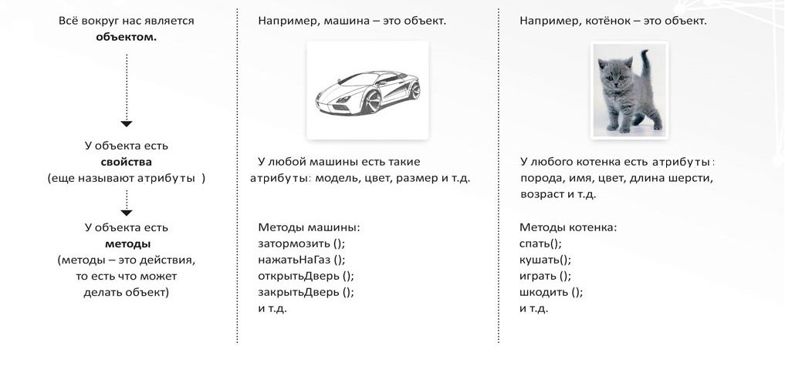
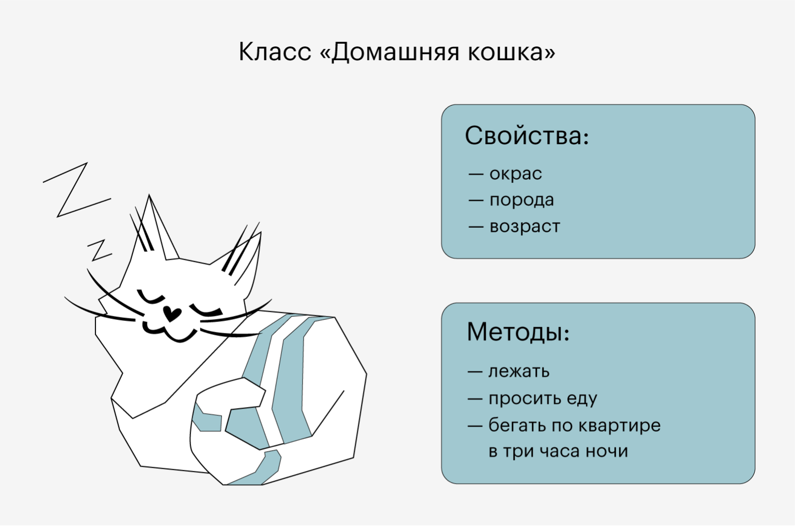
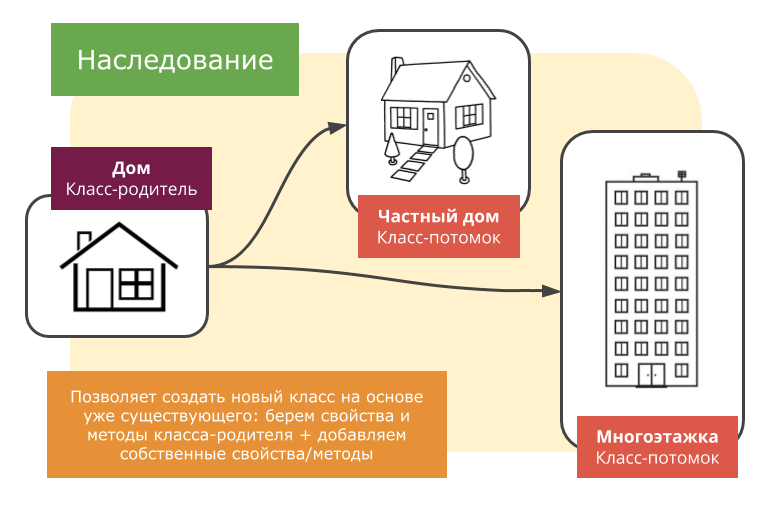
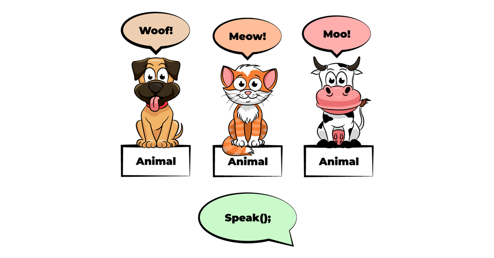
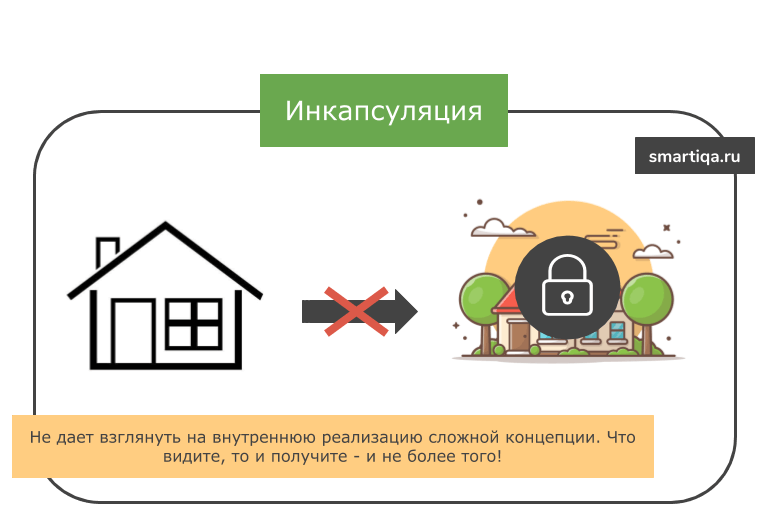
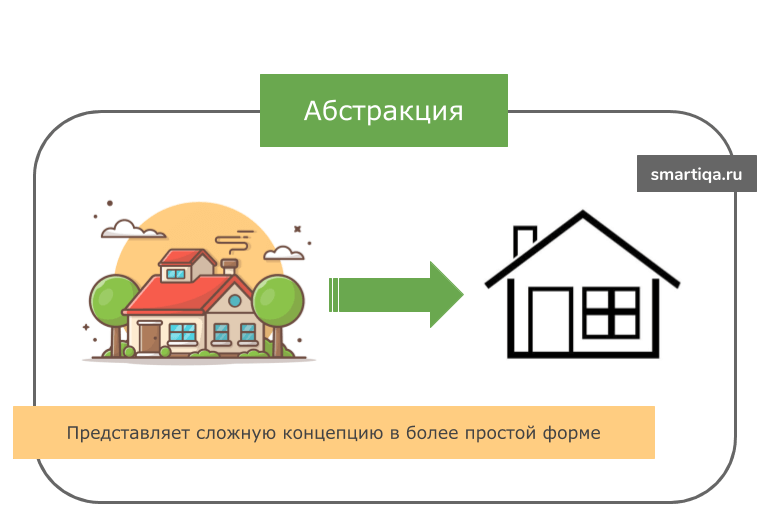

# Лекция 11. Основы ООП.


## Введение в ООП.

**Объектно-ориентированное программирование (ООП)** — это парадигма программирования, которая использует объекты и классы для организации кода. ООП помогает разработчикам создавать более структурированные и понятные программы, что особенно важно для крупных проектов. Основные понятия ООП включают объекты, классы, атрибуты и методы. Разберем их подробнее.

ООП возникло как ответ на необходимость улучшения структуры и читаемости кода, особенно в крупных проектах. В отличие от процедурного программирования, где код организован в виде функций и процедур, ООП позволяет объединить данные и функции, работающие с этими данными, в единые сущности — объекты. Это делает код более интуитивно понятным и легким для сопровождения.

### Почему ООП важно?

В жизни мы не думаем в терминах `"переменных"` или `"списков свойств"` — мы думаем объектами.

Вместо того чтобы сказать: *"У меня есть набор характеристик: цвет — красный, марка — Toyota, скорость — 180"*

мы говорим: *"У меня есть машина. Красная Toyota, которая может ехать быстро."*

То есть: машина — это объект, у которого есть:

- атрибуты (цвет, марка, скорость)
- и действия (поехать, затормозить, подать сигнал)

Примерно так же устроено ООП: мы создаём классы, которые описывают, что такое объект и что он умеет делать, а потом создаём экземпляры этих объектов (конкретные машины, людей, животных и т.п.).

Объектно-ориентированное программирование позволяет писать код, который близок к тому, как мы реально мыслим.



## Что такое объекты и классы?

### Простая аналогия из жизни

Представьте, что класс — это порода кота, а объект — это конкретный кот. У всех котов одной породы есть схожие черты (размер, окрас, поведение), но каждый кот индивидуален. В программировании класс задаёт структуру, а объекты — это реальные экземпляры с уникальными данными.

**Класс** — это шаблон или чертеж для создания объектов. Класс определяет, какие атрибуты и методы будут у объектов, созданных на его основе. Например, класс "Автомобиль" может иметь атрибуты "марка", "модель" и "год выпуска", а также методы "завести двигатель" и "остановить двигатель". Классы позволяют создавать множество объектов с одинаковыми свойствами и поведением, что упрощает процесс разработки и уменьшает количество дублирующегося кода.

**В ООП объект**  — это сущность, экземпляр класса, содержащий свои атрибуты и свои методы, созданный при помощи шаблона (т. е. класса).. Объекты могут представлять реальные или абстрактные сущности. Например, объектом может быть автомобиль, пользователь или банковский счет. Объекты обладают состоянием и поведением, что делает их мощным инструментом для моделирования реального мира в программном коде.

**Атрибуты** — это характеристики объекта. Они хранят данные, описывающие объект.

**Методы** — это функции внутри класса, которые определяют поведение объекта.

## self в Python

В Python self — это специальное слово, которое используется в методах класса для ссылки на конкретный экземпляр объекта. Оно позволяет объектам обращаться к своим атрибутам и другим методам внутри класса.

### Пример:

```python
class Person:
    name = ""
    age = 0
  
    def introduce(self):
        print(f"Привет, меня зовут {self.name}, мне {self.age} лет.")

person1 = Person()
person1.name = "Даниил"
person1.age = 26

person1.introduce()  # Привет, меня зовут Даниил, мне 26 лет.
```

### Почему нужен self?

Когда создаётся объект, Python автоматически передаёт его в методы, но вам нужно явно указать параметр `self`, чтобы обращаться к атрибутам объекта.

#### Пример с автомобилями и сигналом

- У всех автомобилей есть гудок.
- Он реализован в классе `Car` для всех машин.
- В объекте автомобиля нужно как-то вызвать `honk()` у класса `Car`.
- Как это сделать?

Если вызвать `Car.honk()`, засигналят сразу все машины.Если вызвать `self.honk()`, сигналит только конкретный автомобиль.

```python
class Car:
    brand = ""
  
    def honk(self):
        print(f"{self.brand} сигналит: Бип-бип!")

car1 = Car()
car1.brand = "Toyota"

car2 = Car()
car2.brand = "Mercedes"

car1.honk()  # Toyota сигналит: Бип-бип!
car2.honk()  # Mercedes сигналит: Бип-бип!
```

Благодаря `self`, сигнал привязан только к конкретному автомобилю (`Toyota` или `Mercedes`), а не ко всему классу `Car` сразу..

### Примеры использования классов и объектов

После того как мы разобрали `self`, посмотрим, как создаются и взаимодействуют объекты:

**Как примеры и без котиков :) ????**



```python
class Cat:
    name = ""
    color = ""
    age = 0
    energy = 100
  
    def meow(self):
        print(f"{self.name} говорит: Мяу!")
  
    def sleep(self):
        self.energy += 20
        print(f"{self.name} поспал и теперь чувствует себя бодрее! Энергия: {self.energy}")
  
    def scratch_furniture(self):
        self.energy -= 10
        print(f"{self.name} дерёт диван! Хозяин в шоке!")
  
    def wake_owner_at_night(self):
        print(f"{self.name} разбудил хозяина в 3 часа ночи, просто потому что может!")
```

Создадим объекты:

```python
cat1 = Cat()
cat1.name = "Барсик"
cat1.color = "Рыжий"
cat1.age = 2

cat2 = Cat()
cat2.name = "Мурка"
cat2.color = "Серый"
cat2.age = 3

cat3 = Cat()
cat3.name = "Снежок"
cat3.color = "Белый"
cat3.age = 1

cat4 = Cat()
cat4.name = "Гарфилд"
cat4.color = "Оранжевый"
cat4.age = 5

cat1.meow()  # Барсик говорит: Мяу!
cat2.meow()  # Мурка говорит: Мяу!
cat3.scratch_furniture()  # Снежок дерёт диван! Хозяин в шоке!
cat4.wake_owner_at_night()  # Гарфилд разбудил хозяина в 3 часа ночи, просто потому что может!
cat1.sleep()  # Барсик поспал и теперь чувствует себя бодрее! Энергия: 120
```

В Python всё является объектом. Это означает, что любая переменная, значение, структура данных, функция или даже сам класс — это объект.

## Примеры объектов в Python:

### 1. Числа (int, float, complex)

Числа — это объекты, принадлежащие соответствующим классам:

```python
x = 10  # x - это объект класса int
y = 3.14  # y - это объект класса float
z = 2 + 3j  # z - это объект класса complex

print(type(x))  # <class 'int'>
print(type(y))  # <class 'float'>
print(type(z))  # <class 'complex'>
```

### 2. Строки (str)

```python
s = "Привет"  # s - это объект класса str
print(type(s))  # <class 'str'>
```

### 3. Списки (list), кортежи (tuple), множества (set) и словари (dict)

Все эти структуры данных тоже являются объектами:

```python
lst = [1, 2, 3]  # объект списка
tpl = (4, 5, 6)  # объект кортежа
st = {7, 8, 9}  # объект множества
dct = {"ключ": "значение"}  # объект словаря

print(type(lst))  # <class 'list'>
print(type(tpl))  # <class 'tuple'>
print(type(st))  # <class 'set'>
print(type(dct))  # <class 'dict'>
```

### 4. Функции

Функции в Python тоже являются объектами и могут быть переданы как аргументы в другие функции:

```python
def greet():
    print("Привет!")

print(type(greet))  # <class 'function'>

# Можно передавать функцию в качестве аргумента
def call_function(func):
    func()

call_function(greet)  # Вызывает функцию greet()
```

### 5. Классы

Классы в Python тоже являются объектами! Когда вы создаёте класс, Python создаёт объект этого класса.

```python
class Cat:
    pass

print(type(Cat))  # <class 'type'>, потому что Cat — это объект типа "type"
```

### 6. Экземпляры классов

Когда мы создаём объект на основе класса, он также является объектом.

```python
class Cat:
    name = ""


cat1 = Cat()  # Экземпляр класса Cat - объект
cat.name = "Барсик"
print(type(cat1))  # <class '__main__.Cat'>
```

## Принципы ООП

Объектно-ориентированное программирование определяют через четыре принципа, по которым можно понять основы работы. Иногда количество сокращают до трех — опускают понятие абстракции.

### Наследование



**Наследование** — это свойство системы, позволяющее описать новый класс на основе уже существующего, заимствуя его функциональность. Это помогает избежать дублирования кода и делает программу более удобной в сопровождении.

**Бытовой пример:**

Представьте, что все животные умеют есть, но только собаки умеют лаять, а коты — мяукать. Вместо того чтобы описывать возможность еды для каждого животного отдельно, мы можем создать базовый класс `Animal`, а затем унаследовать от него `Dog` и `Cat`, добавляя уникальное поведение для каждого.

Пример кода:

```python
class Animal:
    def eat(self):
        print("Это животное ест пищу")

class Dog(Animal):
    def bark(self):
        print("Собака лает")

class Cat(Animal):
    def meow(self):
        print("Кот мяукает")

puppy = Dog()
kotik = Cat()

puppy.eat()  # Это животное ест пищу
puppy.bark()  # Собака лает
kotik.eat()  # Это животное ест пищу
kotik.meow()  # Кот мяукает
```

В этом примере `Dog` и `Cat` унаследовали метод `eat()` от `Animal`, но также добавили свои уникальные методы `bark()` и `meow()`.

### Метод super()

Метод `super()` используется для вызова методов родительского класса в дочернем классе. Это полезно, когда мы хотим расширить функциональность родительского метода, а не полностью его заменять.

Представь, что у нас есть базовый класс `Device`, который описывает любое устройство. У всех устройств есть общая функция – они могут включаться.

Но:

- Смартфон при включении загружает мобильную ОС (Android, iOS)
- Ноутбук сначала запускает BIOS, затем загружает ОС (Windows, Linux)

Вместо дублирования кода мы используем `super()`, чтобы сначала выполнить общий код (`turn_on()`), а затем добавить уникальные действия.

```python
class Device:
    def turn_on(self):
        print("Устройство включается...")

class Smartphone(Device):
    def turn_on(self):
        super().turn_on()  # Вызываем метод родителя
        print("Загружается операционная система смартфона.")

class Laptop(Device):
    def turn_on(self):
        super().turn_on()  # Вызываем метод родителя
        print("Запускается BIOS, затем загружается Windows или Linux.")

# Создадим объекты и проверим их работу
phone = Smartphone()
laptop = Laptop()

phone.turn_on()
print()
laptop.turn_on()
```

Вывод:

```sh
Устройство включается...
Загружается операционная система смартфона.

Устройство включается...
Запускается BIOS, затем загружается Windows или Linux.
```

### Метод type()

Метод `type(obj)` возвращает тип объекта.

Представь, что ты проверяешь ингредиенты в рецепте. Если у тебя есть морковь, ты можешь сказать: "Это овощ". Python делает то же самое с объектами.

```python
print(type(42))          # <class 'int'>
print(type("Hello"))     # <class 'str'>
print(type([1, 2, 3]))   # <class 'list'>

# Можно использовать для проверки типа
def check_type(value):
    if type(value) == int:
        print("Это целое число.")
    elif type(value) == str:
        print("Это строка.")
    else:
        print("Неизвестный тип.")

check_type(100)      # Это целое число.
check_type("Привет") # Это строка.
```

**Важно:**

Метод `type()` не учитывает наследование. Поэтому, если нужно проверить, принадлежит ли объект классу и его потомкам, лучше использовать `isinstance()`.

### Метод isinstance()

Метод `isinstance(obj, class)` проверяет, является ли объект экземпляром указанного класса или его наследника.

Допустим, у нас есть базовый класс `Animal` и его потомки – `Cat` и `Dog`.

```python
class Animal:
    pass

class Cat(Animal):
    pass

class Dog(Animal):
    pass

cat = Cat()
dog = Dog()

print(isinstance(cat, Cat))   # True (cat - это объект класса Cat)
print(isinstance(dog, Dog))   # True (dog - это объект класса Dog)
print(isinstance(cat, Animal))  # True (Cat наследуется от Animal)
print(isinstance(dog, Animal))  # True (Dog наследуется от Animal)
print(isinstance(cat, Dog))   # False (кот не собака)
```

### Метод issubclass()

Метод `issubclass(cls, parent_cls)` проверяет, является ли один класс подклассом другого.

Представь, что `Cat` и `Dog` – это подклассы `Animal`. Мы можем проверить, действительно ли `Cat` является потомком `Animal`.

```python
class Animal:
    pass

class Cat(Animal):
    pass

class Dog(Animal):
    pass

print(issubclass(Cat, Animal))  # True
print(issubclass(Dog, Animal))  # True
print(issubclass(Dog, Cat))     # False (собаки не являются подтипом котов)
print(issubclass(Animal, Animal))  # True (класс является подклассом самого себя)
```

### Полиморфизм



**Полиморфизм** — это свойство системы использовать объекты с одинаковым интерфейсом без информации о типе и внутренней структуре объекта, т. е. способность одной функции (метода), действовать по-разному в зависимости от обстоятельств (которые мы сами указываем).

**Бытовой пример:**

Представим, что у нас есть метод `drive()` — "поехать".

- У легковой машины этот метод означает: двигаться по дороге с комфортом и скоростью.
- У грузовика — везти тяжёлый груз и ехать медленнее.
- У электросамоката — двигаться по велодорожке от батарейки.
- У гоночного болида — максимально быстро мчать по треку.

Все они реагируют на команду `drive()`, но каждый делает это по-своему.

Вот это и есть полиморфизм — когда мы можем вызвать один и тот же метод у разных объектов, а результат будет зависеть от конкретной реализации внутри каждого из них.

Пример кода:

```python
class Vehicle:
    def drive(self):
        raise NotImplementedError("Этот метод должен быть переопределён в подклассе")


class Car(Vehicle):
    def drive(self):
        return "Легковая машина едет по трассе комфортно и быстро."


class Truck(Vehicle):
    def drive(self):
        return "Грузовик едет медленно, перевозя тяжёлый груз."


class Scooter(Vehicle):
    def drive(self):
        return "Самокат едет по велодорожке на батарейке."


class RaceCar(Vehicle):
    def drive(self):
        return "Гоночный болид мчится по треку на полной скорости!"


# Демонстрация полиморфизма
vehicles = [Car(), Truck(), Scooter(), RaceCar()]

for v in vehicles:
    print(v.drive())
```

У нас есть базовый класс `Vehicle` с методом `drive()`, который должен быть реализован в подклассах. Классы `Car`, `Truck`, `Scooter`, `RaceCar` реализуют свой вариант метода `drive()`. Когда мы перебираем список `vehicles`, один и тот же вызов `drive()` ведёт себя по-разному, в зависимости от типа объекта. Вот это и есть полиморфизм в действии.

### Инкапсуляция



**Инкапсуляция** — это способ скрыть внутренние детали реализации объекта и защитить его данные от прямого доступа или случайных изменений.

**Бытовой пример:**

Ты пользуешься смартфоном. У тебя есть интерфейс — экран, кнопки, меню. Но ты не можешь напрямую управлять процессором или оперативной памятью. Эти детали скрыты от тебя — они инкапсулированы внутри устройства. Ты можешь только пользоваться открытыми функциями.

Пример кода:

```python
class Phone:
    __model = "Неизвестно"  # Приватный атрибут

    def set_model(self, model):
        self.__model = model

    def get_model(self):
        return self.__model

# Создаём объект телефона
my_phone = Phone()

# Пытаемся получить модель через метод — всё работает
print(my_phone.get_model())  # Неизвестно

# Меняем модель через специальный метод
my_phone.set_model("iPhone 15")
print(my_phone.get_model())  # iPhone 15

# Попробуем изменить модель напрямую (НЕ получится)
my_phone.__model = "Samsung Galaxy"
print(my_phone.get_model())  # всё ещё iPhone 15

# Посмотрим, что же теперь лежит в my_phone.__model
print(my_phone.__model)  # Samsung Galaxy (но это НЕ та переменная!)
```

Атрибут `__model` скрыт от внешнего доступа, и его можно изменить только через методы `set_model()` и `get_model()`.

Мы изначально задали значение "Неизвестно" в приватном атрибуте `__model`. Мы поменяли значение правильно — через метод `set_model()`.Попытка изменить `__model` напрямую создала новую переменную, а старая осталась нетронутой. Это доказывает, почему нельзя и не стоит менять приватные атрибуты напрямую.

В Python инкапсуляция очень условная (всегда можно получить доступ куда угодно, было бы желание). Как сказал создатель языка, Гвидо Ван Россум:
*"Мы все же взрослые люди, зачем мы будем кого-то ограничивать?"*

Python предоставляет три уровня доступа к атрибутам и методам:

- `Public` (открытые): доступны везде и могут использоваться без ограничений.
- `Protected` (защищённые, с `_` перед именем): принято использовать только внутри класса и его наследников.
- `Private` (приватные, с `__` перед именем): доступны только внутри класса, но Python позволяет получить к ним доступ при желании.

```python
class Phone:
    model = "Unknown"          # Публичное поле
    _battery_level = 100       # Защищённое поле
    __unlock_code = "1234"     # Приватное поле

    def show_model(self):
        return f"Телефон модели: {self.model}"

    def charge(self):
        self._battery_level = 100
        return "Телефон полностью заряжен"

    def use_battery(self, percent):
        self._battery_level -= percent
        return f"Батарея разряжена до {self._battery_level}%"

    def unlock(self, code):
        if code == self.__unlock_code:
            return "Телефон разблокирован"
        return "Неверный код"

    def change_unlock_code(self, new_code):
        self.__unlock_code = new_code
        return "Код разблокировки обновлён"


phone = Phone()
phone.model = "iPhone 15"
print(phone.show_model())             # Телефон модели: iPhone 15

print(phone.charge())                 # Телефон полностью заряжен
print(phone.use_battery(30))         # Батарея разряжена до 70%

print(phone.unlock("1111"))          # Неверный код
print(phone.unlock("1234"))          # Телефон разблокирован

# Попробуем напрямую изменить код разблокировки
phone.__unlock_code = "0000"
print(phone.unlock("0000"))          # Неверный код — не получилось

# Но через метод — получится
phone.change_unlock_code("0000")
print(phone.unlock("0000"))          # Телефон разблокирован

# Хакерский способ добраться до приватного поля
print(phone._Phone__unlock_code)     # 0000 — работает, но не рекомендуется!
```

Что показывает пример:

- Инкапсуляция позволяет скрыть внутреннюю реализацию — например, код разблокировки.
- Публичные методы (unlock, charge) — это “интерфейс” телефона, доступный пользователю.
- Мы не можем напрямую изменить приватные данные обычным способом.
- Но в Python можно получить доступ даже к приватным полям — это показывает гибкость языка.

### Абстракция



**Абстракция** – это принцип объектно-ориентированного программирования (ООП), который скрывает детали реализации и предоставляет только необходимый интерфейс для работы с объектом.

Главная идея абстракции – оставить только существенные характеристики объекта и скрыть детали, которые пользователю не нужно знать.

Представь, что ты пользуешься смартфоном. Ты звонишь, отправляешь сообщения, пользуешься интернетом, но не знаешь, как телефон обрабатывает сигнал, управляет энергией батареи и кодирует данные. Так же работает абстракция в программировании: мы используем объект, не вдаваясь в его внутреннюю логику.

#### Абстрактные классы в Python

В Python абстракция реализуется с помощью абстрактных классов и методов.

**Абстрактный класс** – это класс, который не может быть создан в экземпляре, но служит шаблоном для других классов.
Для создания абстрактного класса используется модуль abc (`Abstract Base Class` – "абстрактный базовый класс").

#### Пример Абстрактный класс Device:

Допустим, у нас есть разные устройства: `Smartphone`, `Laptop`, `Tablet`. Все они могут включаться, но процесс включения разный для каждого устройства.Создадим абстрактный класс `Device`, который определит общий интерфейс для всех устройств.

```python
class Device:
    def turn_on(self):
        raise NotImplementedError("Этот метод должен быть реализован в дочернем классе")

# Класс "Смартфон"
class Smartphone(Device):
    def turn_on(self):
        print("Смартфон включается: загружается мобильная ОС.")

# Класс "Ноутбук"
class Laptop(Device):
    def turn_on(self):
        print("Ноутбук включается: запускается BIOS, затем загружается Windows или Linux.")

# Попробуем создать объект абстрактного класса (НЕ выдаст ошибку)
device = Device()  # Работает, но если вызвать device.turn_on(), будет ошибка

# Создадим экземпляры подклассов
phone = Smartphone()
laptop = Laptop()

phone.turn_on()  # Смартфон включается: загружается мобильная ОС.
laptop.turn_on()  # Ноутбук включается: запускается BIOS, затем загружается Windows или Linux.
```

Разбор кода:

- Класс `Device` – абстрактный (но Python этого сам не проверяет).
- Метод `turn_on()` вызывает raise `NotImplementedError` – если метод не будет переопределён в дочернем классе, возникнет ошибка.
- Классы `Smartphone` и `Laptop` реализуют `turn_on()` по-своему.

#### Что такое raise NotImplementedError?

Это специальное исключение, которое сигнализирует: "Этот метод должен быть переопределён в дочернем классе!"

Использование raise NotImplementedError

```python
class Animal:
    def sound(self):
        raise NotImplementedError("Этот метод должен быть реализован в дочернем классе")

class Dog(Animal):
    def sound(self):
        return "Woof woof"

class Cat(Animal):
    def sound(self):
        return "Meow meow"

# Создаём объекты
dog = Dog()
cat = Cat()

print(dog.sound())  # Woof woof
print(cat.sound())  # Meow meow

# Если создать объект Animal и вызвать sound(), будет ошибка
animal = Animal()
animal.sound()  # NotImplementedError: Этот метод должен быть реализован в дочернем классе
```

**Важно!!!!**

Python не запрещает создание экземпляра `Animal` или `Device`. Ошибка появится только в момент вызова метода, а не при создании объекта. Решение этой проблемы есть, но познакомимся с ней немного позже :)

## Практика

Написать иерархию транспортных средств, используя наследование, инкапсуляцию, полиморфизм и абстракцию. Будем моделировать транспортную систему, где есть разные виды транспорта (автомобили, велосипеды, самолёты, корабли и поезда).

### Требования
Создать абстрактный класс `Transport`, который будет представлять общее поведение транспорта.

- Должен содержать абстрактный метод `move()`, который будет реализован в дочерних классах.
- Должен содержать метод `info()`, который выводит информацию о транспорте.
- Должен содержать приватное свойство `__speed` и метод для его установки и получения.
- Создать несколько классов-наследников:

- Car (автомобиль) 
- Bicycle (велосипед) 
- Airplane (самолёт) 
- Ship (корабль) 
- Train (поезд) 

Каждый подкласс должен реализовать метод `move()` по-своему. Например, машина едет по дороге, велосипед движется по велодорожке, самолёт летит в воздухе, корабль плывёт по воде.

Реализовать класс `TransportStation`, который управляет транспортными средствами.

- Должен хранить список всех видов транспорта.
- Должен уметь добавлять и удалять транспорт.
- Должен уметь вызывать метод move() у всех видов транспорта.