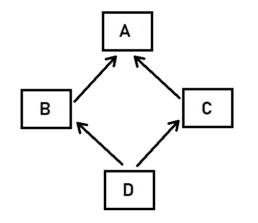

# Лекция 12. Расширенные возможности ООП в Python.


## Множественное наследование

**Множественное наследование** — это возможность класса иметь более одного родительского класса.

В этом случае дочерний класс наследует все свойства и методы от всех родительских классов. Это позволяет комбинировать функциональность из разных классов в одном объекте.

```python
class Animal:
    def eat(self):
        print("Я могу есть!")

class Flyer:
    def fly(self):
        print("Я умею летать!")

# Класс Bird наследует поведение от Animal и Flyer
class Bird(Animal, Flyer):
    def chirp(self):
        print("Чирик-чирик!")

# Создаём объект птицы
sparrow = Bird()
sparrow.eat()  # Я могу есть!
sparrow.fly()  # Я умею летать!
sparrow.chirp()  # Чирик-чирик!
```

Класс `Bird` получил методы `eat()` и `fly()` из обоих родительских классов.

## Многоуровневое наследование

**Многоуровневое наследование** — это когда один класс наследуется от другого, а затем от него наследуется следующий класс.

В этом случае все свойства и методы передаются дальше по цепочке наследования.

```python
class Transport:
    def move(self):
        print("Транспорт движется")

class Car(Transport):
    def honk(self):
        print("Машина сигналит: Бип-бип!")

class ElectricCar(Car):
    def charge(self):
        print("Электромобиль заряжается 🔋")

# Создаём электромобиль
tesla = ElectricCar()

tesla.move()    # Наследуется от Transport
tesla.honk()    # Наследуется от Car
tesla.charge()  # Метод самого ElectricCar
```

### Как работает наследование здесь?

`ElectricCar` наследует всё от `Car`, а `Car` — от `Transport`.

Объект tesla может:

- двигаться, потому что он транспорт;
- сигналить, потому что он машина;
- заряжаться, потому что он электромобиль.

Таким образом, мы начинаем с базовой сущности (транспорт), добавляем возможности (машина), и на вершине цепочки — более конкретный тип (электромобиль), который унаследовал всё полезное, а также добавил своё.

## Порядок разрешения методов (MRO) в Python

В объектно-ориентированном программировании (ООП) наследование позволяет создавать новые классы на основе существующих, что даёт возможность повторного использования кода. Однако, если класс наследуется от нескольких родительских классов, может возникнуть вопрос: "Как Python определяет, в каком порядке искать методы и атрибуты?"

Когда мы вызываем метод у объекта, Python должен найти его в цепочке наследования. Если метод определён в самом классе, он будет использован. Если нет — Python будет искать его в родительских классах, следуя определённым правилам.

Этот процесс называется `Method Resolution Order (MRO)` — порядок разрешения методов. Python использует алгоритм C3-линеаризации, который определяет порядок, в котором должны вызываться методы при множественном наследовании.

Понимание MRO важно для правильного проектирования классов, особенно когда они имеют несколько родителей или используют `super()` для вызова методов родительских классов.



### Все классы в Python наследуются от `object`

В Python все классы неявно наследуются от `object`, даже если мы этого не указываем. Это означает, что все объекты Python имеют общий базовый класс.

Проверим это на практике:

```python
print(issubclass(int, object))  # True
print(issubclass(list, object))  # True
print(isinstance(5.5, object))  # True
print(isinstance("Привет", object))  # True
```

Все объекты Python являются экземплярами `object`, поэтому у них есть методы `__str__()`, `__repr__()` и другие встроенные функции.

### Как Python определяет порядок поиска методов?

Когда мы вызываем метод у объекта, Python ищет его в следующем порядке:

1. Сначала в самом классе.
2. Если метод не найден, Python ищет его в родительских классах слева направо (в порядке их указания при наследовании).
3. Если родительские классы тоже не содержат нужный метод, Python ищет его в их родителях.
4. Если метод не найден ни в одном родительском классе, вызывается ошибка AttributeErro- 1.

Этот процесс называется `Method Resolution Order (MRO)` – порядок разрешения методов.

Python гарантирует, что:

- Класс всегда появляется перед своими родителями.
- Методы ищутся слева направо (если класс наследуется от нескольких родителей).
- Один и тот же класс никогда не обрабатывается дважды.
- MRO можно проверить двумя способами:

  - Атрибут __mro__ (возвращает кортеж).
  - Метод .mro() (возвращает список).

### Простой пример MRO

Давайте рассмотрим ситуацию, когда у нас есть цепочка наследования:

Класс `A` – базовый класс. `B` наследуется от `A`. `C` наследуется от `B`.

```python
class A:
    def show(self):
        print("Метод из A")

class B(A):
    def show(self):
        print("Метод из B")

class C(B):
    def show(self):
        print("Метод из C")

print(C.__mro__)  
# (<class '__main__.C'>, <class '__main__.B'>, <class '__main__.A'>, <class 'object'>)

print(C.mro())  
# [<class '__main__.C'>, <class '__main__.B'>, <class '__main__.A'>, <class 'object'>]
```

Методы сначала ищутся в `C`, затем в `B`, потом в `A`, и в конце — в `object`.

### MRO в множественном наследовании

MRO становится особенно важным при множественном наследовании, когда один класс наследуется сразу от нескольких родительских классов.

Например, у нас есть система оплаты, где:

`PaymentSystem` – общий класс для всех платежных систем.
`BankPayment` – класс для работы с банковскими платежами.
`CryptoPayment` – класс для работы с криптовалютой.
`HybridPayment` – класс, который объединяет оба способа оплаты.

```python
class PaymentSystem:
    def pay(self):
        print("Оплата через основную систему")

class BankPayment(PaymentSystem):
    def pay(self):
        print("Оплата через банковскую систему")

class CryptoPayment(PaymentSystem):
    def pay(self):
        print("Оплата криптовалютой")

class HybridPayment(BankPayment, CryptoPayment):
    pass

print(HybridPayment.mro())
```

Вывод MRO:

```sh
[<class '__main__.HybridPayment'>, <class '__main__.BankPayment'>, <class '__main__.CryptoPayment'>, <class '__main__.PaymentSystem'>, <class 'object'>]
```

Python будет искать методы в следующем порядке:
`HybridPayment` → `BankPayment` → `CryptoPayment` → `PaymentSystem` → `object`.

**Как Python выбирает метод?**

```python
obj = HybridPayment()
obj.pay()

#Оплата через банковскую систему
```

Python вызвал `pay()` из `BankPayment`, потому что он стоит первым в MRO.

### Миксины

В объектно-ориентированном программировании (ООП) миксинами называют классы, которые добавляют дополнительную функциональность другим классам, но сами по себе не предназначены для создания объектов.

Можно сказать, что **миксин** – это своего рода "дополнительный модуль", который можно подключить к классу, если в этом есть необходимость. В отличие от обычного наследования, где один класс является логическим продолжением другого, миксины позволяют разделять код на независимые части и легко добавлять функциональность к разным классам.

Миксины помогают избежать дублирования кода, особенно в больших проектах. Они позволяют использовать одни и те же методы в разных классах, не связывая их жёсткой иерархией наследования.

#### Как понять, что перед вами миксин?

Чтобы правильно использовать миксины, важно знать их основные характеристики:

- Миксин — это вспомогательный класс, который не предназначен для создания объектов. Его цель — быть добавленным в другие классы.
- Миксин обычно содержит только методы, а не данные (атрибуты экземпляра).
- Миксин не должен существовать отдельно — его используют только в связке с другими классами.
- Миксины удобны для повторного использования кода в разных частях программы.

Если класс отвечает этим критериям, скорее всего, он является миксином.

#### Когда использовать миксины?

Миксины особенно полезны в тех случаях, когда несколько разных классов нуждаются в одинаковом дополнительном функционале, но не связаны логически.

Например:

- Если несколько классов должны уметь сохранять данные в файл, но они относятся к разным частям программы.
- Если разные классы должны уметь отправлять уведомления пользователям.
- Если разные классы должны вести логирование своих действий.

В этих случаях лучше создать миксин с нужными методами и добавить его в классы, которым требуется этот функционал.

#### Простой пример миксина

Рассмотрим простой случай, когда у нас есть несколько классов, которым нужно добавить возможность логирования событий.

```python
class LoggerMixin:
    def log(self, message):
        print(f"[LOG]: {message}")

class FileManager(LoggerMixin):
    def save_file(self, filename):
        self.log(f"Файл '{filename}' был сохранён!")

class User(LoggerMixin):
    def create_user(self, username):
        self.log(f"Создан новый пользователь: {username}")

# Используем классы с миксином
file_manager = FileManager()
file_manager.save_file("document.txt")

user = User()
user.create_user("JohnDoe")

#[LOG]: Файл 'document.txt' был сохранён!
#[LOG]: Создан новый пользователь: JohnDoe
```

### Что здесь происходит?

1. Мы создаём миксин `LoggerMixin`, который содержит метод `log()`.
2. Классы `FileManager` и `User` наследуются от `LoggerMixin`.
3. Теперь оба класса могут использовать `log()` без дублирования кода.

### Как работает наследование миксинов?

Python позволяет наследовать несколько классов одновременно. Это значит, что можно добавлять сразу несколько миксинов в один класс.

Код с двумя миксинами

```python
class LoggerMixin:
    def log(self, message):
        print(f"[LOG]: {message}")

class NotifierMixin:
    def send_notification(self, user, message):
        print(f"Отправка уведомления {user}: {message}")

class User(LoggerMixin, NotifierMixin):
    def create_user(self, username):
        self.log(f"Создан новый пользователь: {username}")
        self.send_notification(username, "Добро пожаловать!")

# Создаём пользователя
user = User()
user.create_user("Alice")

#[LOG]: Создан новый пользователь: Alice
#Отправка уведомления Alice: Добро пожаловать!
```

Теперь класс User может и логировать, и отправлять уведомления, потому что мы добавили два миксина (`LoggerMixin` и `NotifierMixin`).

### Отличие миксинов от обычного наследования

В обычном наследовании один класс является логическим продолжением другого, а миксины предназначены только для "примешивания" дополнительного функционала.

Пример обычного наследования

```python
class Animal:
    def eat(self):
        print("Я ем пищу")

class Dog(Animal):
    def bark(self):
        print("Гав-гав!")

dog = Dog()
dog.eat()  # Я ем пищу
dog.bark()  # Гав-гав!
```

Здесь `Dog` – это логическое расширение `Animal`, поэтому обычное наследование подходит.

Но что, если разным классам (не только `Dog`) нужно добавить `bark()`?
Создавать `bark()` в каждом классе – неудобно.

Используем миксин

```python
class BarkMixin:
    def bark(self):
        print("Гав-гав!")

class Dog(BarkMixin):
    pass

class RobotDog(BarkMixin):
    pass

dog = Dog()
robot_dog = RobotDog()

dog.bark()  # Гав-гав!
robot_dog.bark()  # Гав-гав!
```

Теперь функциональность `bark()` доступна разным классам без дублирования.

## Магические методы

Магические методы (их ещё называют `dunder-методы `от `"double underscore"` – двойное подчёркивание) – это специальные методы в Python, которые позволяют переопределять поведение объектов.

Эти методы начинаются и заканчиваются двумя подчёркиваниями `(__method__)`. Они вызываются автоматически в определённых ситуациях, например, при сложении объектов `(+)`, сравнении `(==)`, выводе через `print()`, получении длины `(len())` и других операциях.

Python использует магические методы, чтобы сделать работу с классами более удобной и похожей на работу со встроенными объектами, такими как числа, строки и списки.

### Как работают магические методы?

Когда Python выполняет операцию над объектом, он автоматически вызывает соответствующий магический метод. Например:

При создании объекта вызывается `__init__()`.
При сложении (+) вызывается `__add__()`.
При сравнении (==) вызывается `__eq__()`.
При передаче в print() вызывается `__str__()`.

Пример 1: Магический метод `__str__()`

```python
class Person:
    def __init__(self, name, age):
        self.name = name
        self.age = age

    def __str__(self):
        return f"{self.name}, возраст {self.age}"

person = Person("Алиса", 30)
print(person)  # Алиса, возраст 30
```

Без `__str__()` Python вывел бы что-то вроде `<__main__.Person object at 0x...>`, а с ним – понятное представление объекта.

### Основные магические методы

В Python есть много магических методов, но чаще всего используются следующие категории:

1️. Методы инициализации и создания объектов

2️. Методы строкового представления (__str__, __repr__)

3️. Арифметические операторы (+, -, *, /)

4️. Методы сравнения (==, >, <)

5️. Методы для работы с len(), [], in

## Методы инициализации и создания объектов

Пример : __init__() и __del__()

```python
class Car:
    def __init__(self, brand, model):
        print("Создаём машину...")
        self.brand = brand
        self.model = model

    def __del__(self):
        print(f"Машина {self.brand} {self.model} удалена из памяти")

car = Car("Toyota", "Camry")
del car  # Вызывает __del__()

#Машина Toyota Camry удалена из памяти
```

`__init__()` вызывается при создании объекта, а `__del__()` – при его удалении.

## Методы строкового представления

Когда объект передаётся в `print()`, Python автоматически вызывает либо __str__(), либо __repr__().

### Метод Описание

`__str__()`	Возвращает строку для пользователя `(print(obj))`

`__repr__()` Возвращает строку для разработчика `(repr(obj))`

Пример : Разница между `__str__()` и `__repr__()`

```python
class Book:
    def __init__(self, title, author):
        self.title = title
        self.author = author

    def __str__(self):
        return f"Книга: {self.title} - {self.author}"

    def __repr__(self):
        return f"Book('{self.title}', '{self.author}')"

book = Book("Гарри Поттер", "Дж. К. Роулинг")

print(book)  # Книга: Гарри Поттер - Дж. К. Роулинг
print(repr(book))  # Book('Гарри Поттер', 'Дж. К. Роулинг')
```

Используйте `__str__()` когда нужно строковое представление объекта для конечных пользователей, акцентируя внимание на читаемости, а не на полноте. Используйте `__repr__()` для создания строки, которая будет интересна разработчикам, стремясь к точности и однозначности представления.

## Магические методы арифметических операций

Python позволяет переопределять поведение арифметических операций (`+`, `-`, `*`, `/`) с помощью магических методов.

| Оператор | Магический метод | Описание                    |
| ---------------- | ------------------------------- | ----------------------------------- |
| `+`            | `__add__(self, other)`        | Сложение объектов   |
| `-`            | `__sub__(self, other)`        | Вычитание объектов |
| `*`            | `__mul__(self, other)`        | Умножение объектов |
| `/`            | `__truediv__(self, other)`    | Деление объектов     |

Пример : Сложение объектов (`__add__()`)

```python
class Wallet:
    def __init__(self, balance):
        self.balance = balance

    def __add__(self, other):
        return Wallet(self.balance + other.balance)

    def __str__(self):
        return f"Баланс: {self.balance}$"

wallet1 = Wallet(500)
wallet2 = Wallet(200)

wallet3 = wallet1 + wallet2  # Вызывает wallet1.__add__(wallet2)
print(wallet3)  # Баланс: 700$
```

Теперь можно складывать `Wallet` так же, как числа!

## Методы сравнения (==, >, <)

| Оператор | Магический метод | Описание                        |
| ---------------- | ------------------------------- | --------------------------------------- |
| `==`           | `__eq__(self, other)`         | Равенство объектов     |
| `!=`           | `__ne__(self, other)`         | Неравенство объектов |
| `<`            | `__lt__(self, other)`         | Меньше                            |
| `>`            | `__gt__(self, other)`         | Больше                            |
| `<=`           | `__le__(self, other)`         | Меньше или равно          |
| `>=`           | `__ge__(self, other)`         | Больше или равно          |

Пример : Сравнение объектов (__eq__(), __lt__())

```python
class Product:
    def __init__(self, name, price):
        self.name = name
        self.price = price

    def __eq__(self, other):
        return self.price == other.price

    def __lt__(self, other):
        return self.price < other.price

product1 = Product("Телефон", 50000)
product2 = Product("Ноутбук", 50000)
product3 = Product("Часы", 30000)

print(product1 == product2)  # True (цены одинаковые)
print(product3 < product1)  # True (часы дешевле телефона)
```

Теперь объекты `Product` можно сравнивать по цене.

### Методы `len()`, индексации и `in`

| Операция     | Магический метод   | Описание                                                   |
| -------------------- | --------------------------------- | ------------------------------------------------------------------ |
| `len(obj)`         | `__len__(self)`                 | Возвращает длину объекта                     |
| `obj[key]`         | `__getitem__(self, key)`        | Получение элемента по индексу            |
| `obj[key] = value` | `__setitem__(self, key, value)` | Установка элемента по индексу            |
| `del obj[key]`     | `__delitem__(self, key)`        | Удаление элемента по индексу              |
| `key in obj`       | `__contains__(self, key)`       | Проверка наличия элемента в объекте |

Пример : Длина `len()`, индексация и in

```python
class ShoppingCart:
    def __init__(self, items):
        self.items = items

    def __len__(self):
        return len(self.items)

    def __getitem__(self, index):
        return self.items[index]

    def __contains__(self, item):
        return item in self.items

cart = ShoppingCart(["Телефон", "Ноутбук", "Часы"])

print(len(cart))  # 3
print(cart[1])  # Ноутбук
print("Часы" in cart)  # True
```

Теперь `ShoppingCart` работает как список!

## Создание собственных исключений в Python

Когда мы работаем над своими проектами, не всегда удобно пользоваться только встроенными ошибками, вроде `ValueError`, `TypeError`, `KeyError` и других. Иногда хочется, чтобы ошибка называлась понятно и точно отражала суть проблемы. Именно в таких случаях на сцену выходят пользовательские исключения.

Давайте разберёмся, зачем и как их создавать.

### Зачем вообще нужны собственные исключения?

Собственные классы исключений полезны в нескольких ситуациях:

- Повышают читаемость кода – когда читаешь `raise PasswordTooWeakError`, сразу понятно, в чём проблема.
- Дают гибкость в обработке ошибок – можно перехватывать именно те исключения, которые нам важны.
- Упрощают масштабирование – особенно, если мы проектируем сложную систему с множеством потенциальных ошибок.

### Как создать своё исключение?

Создаётся пользовательское исключение просто: мы создаём свой класс, который наследует от `Exception`.

Простейший пример:

```python
class MyCustomError(Exception):
    """Просто пользовательская ошибка."""
    pass
```

Теперь мы можем использовать `raise MyCustomError("Что-то пошло не так")` как любую встроенную ошибку.

### Добавим больше смысла в исключение

Мы можем передавать в исключение сообщение и дополнительные данные. Для этого нужно переопределить метод __init__, а при желании – и __str__.

```python
class InvalidInputError(Exception):
    def __init__(self, message, value):
        self.message = message
        self.value = value
        super().__init__(message)

    def __str__(self):
        return f"{self.message}: {self.value}"
```

Представим, что у нас есть простая функция деления:

```python
def divide(a, b):
    if b == 0:
        raise InvalidInputError("Деление на ноль", b)
    return a / b

try:
    result = divide(10, 0)
except InvalidInputError as e:
    print("Ошибка:", e)
```

### Создание иерархии исключений

Часто удобно иметь одну базовую ошибку (например, `AppError`), от которой будут наследоваться все остальные. Такой подход помогает, например, обрабатывать все ошибки приложения одним `except`, а при необходимости — обрабатывать каждую конкретно.

**Пример иерархии:**

```python
class ApplicationError(Exception):
    """Базовая ошибка приложения."""
    pass

class DatabaseError(ApplicationError):
    """Ошибка при работе с базой данных."""
    pass

class FileMissingError(ApplicationError):
    """Ошибка при отсутствии нужного файла."""
    pass
```

**Использование:**

```python
def connect_to_db():
    raise DatabaseError("Нет соединения с БД")

try:
    connect_to_db()
except FileMissingError:
    print("Файл не найден.")
except DatabaseError:
    print("База данных недоступна.")
except ApplicationError as e:
    print("Произошла ошибка приложения:", e)
```

Создание собственных исключений — это не усложнение, а инструмент для понятной, масштабируемой и надёжной обработки ошибок. Особенно в больших проектах. Если вы хотите, чтобы ваш код "говорил", не бойтесь создавать свои исключения — это одна из практик зрелого `Python-кода`.

## Практика

Разрабатываеть систему для интернет-магазина, в которой есть разные типы заказов (обычные, премиум, корпоративные).
Задача — создать объектно-ориентированную модель системы заказов, используя наследование, миксины и магические методы.

**Требования к системе**

1️. Создать базовый класс `Order`, который будет представлять заказ.

- должен содержать номер заказа и стоимость.
- должен поддерживать операторы сложения (`+`) и сравнения (`>`, `<`).
- должен уметь отображаться в `print()`.

2️. Создать миксин `DiscountMixin`, который добавляет метод `apply_discount()`.

- Позволяет уменьшать стоимость заказа на определённый процент.

3️. Создать классы `RegularOrder`, `PremiumOrder`, `CorporateOrder`, которые наследуются от `Order` и используют `DiscountMixin`.

- `PremiumOrder` получает 10% скидку автоматически.
- `CorporateOrder` получает 20% скидку автоматически.

4️. Создать список заказов и отсортировать их по стоимости.

- Проверить, работает ли оператор `<` для сортировки.
- Попробовать сложить два заказа (`order1` + `order2`).
