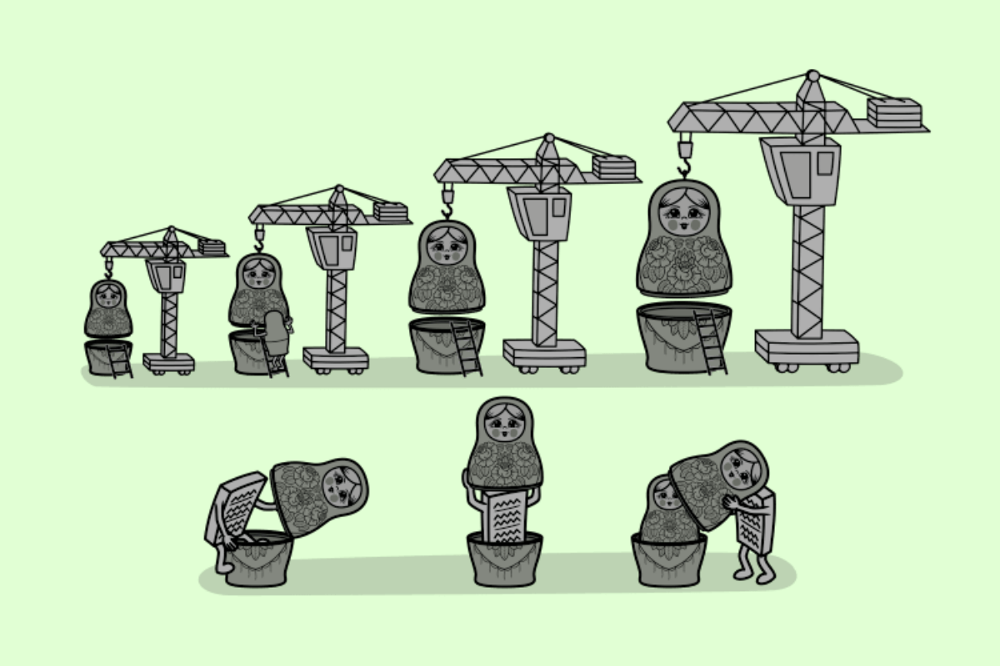

# Лекция 13. Декораторы.


## Функции как объекты

В Python функции не отличаются от других типов данных. Они могут храниться в переменных, передаваться в качестве аргументов в другие функции и даже возвращаться как результат выполнения другой функции.

### Функции можно присваивать переменным

Когда мы определяем функцию, Python создаёт для неё объект в памяти. Этот объект можно присвоить переменной, что позволяет использовать разные имена для одной и той же функции.

Пример присваивание функции переменной

```python
def greet():
    return "Привет!"

hello = greet  # Теперь 'hello' ссылается на функцию 'greet'
print(hello())  # Привет!
```
В этом примере `hello` не является отдельной функцией, а просто ссылается на объект `greet`. Теперь вызов `hello()` равносилен вызову `greet()`.

### Функции можно передавать в аргументы других функций

Так как функции являются объектами, их можно передавать в качестве аргументов другим функциям. Это полезно, например, при написании универсальных обработчиков, которые принимают разные функции для выполнения.

Пример передачи функции как аргумента

```python
def apply_function(func):
    func() 

def say_hello():
    print("Я функция которую передали!")

apply_function(say_hello)# Я функция которую передали!
```

Здесь `apply_function()` получает функцию `say_hello` и вызывает её внутри себя. Таким образом, можно динамически передавать функции для выполнения, не зная заранее, какую именно функцию потребуется вызвать.

### Функции можно возвращать из других функций

Python позволяет не только передавать функции как аргументы, но и возвращать их как результат выполнения других функций.

```python
def outer():
    def inner():
        return "Я внутренняя функция!"
    return inner  # Возвращаем саму функцию без вызова ()

new_function = outer()
print(new_function())  # Я внутренняя функция!
```

В этом примере `outer()` возвращает функцию, а не её результат. Поэтому `new_function` теперь содержит ссылку на `inner()`, и мы можем вызвать её позднее.

### Вложенные функции

Функция в Python может быть объявлена внутри другой функции. Такие функции называются вложенными и используются, когда внутренняя логика должна быть скрыта от внешнего мира.

Вложенные функции создают локальную область видимости, что означает, что они не доступны за пределами родительской функции.

```python
def calculator(a, b):
    def add():
        return a + b
    def subtract():
        return a - b

    return add(), subtract()

print(calculator(10, 5))  # (15, 5)
```

В этом примере функции `add()` и `subtract()` определены внутри `calculator()`, а значит, они доступны только внутри неё.

### Замыкания (Closures)

**Замыкание** — это особый случай вложенной функции, при котором внутренняя функция *"запоминает"* переменные внешней функции даже после её завершения.
Это особенно полезно, если требуется создать настроенную функцию, которая помнит определённые параметры.

Замыкание запоминает значение переменной

```python
def outer(name):
    def inner():
        return f"Привет, {name}!"  # "name" запоминается
    return inner

hello = outer("Алиса")
print(hello())  # Привет, Алиса!
```
Хотя `outer()` завершила свою работу, внутренняя функция `inner()` по-прежнему *"помнит"* переменную `name`.

Замыкание для создания множителей

```python
def multiplier(factor):
    def multiply_by_factor(number):
        return number * factor
    return multiply_by_factor

double = multiplier(2)
triple = multiplier(3)

print(double(10))  # 20
print(triple(10))  # 30
```

В этом коде создаются разные множители, которые **"запоминают"** свой `factor`.

##  Декораторы (Функции-декораторы @decorator)



**Декоратор** — это функция, которая изменяет поведение другой функции, не изменяя её код. Простыми словами, декораторы позволяют добавлять функциональность к уже существующим функциям.

### Как работает декоратор?

**Декоратор** — это функция, которая принимает другую функцию в качестве аргумента, модифицирует её поведение и возвращает новую функцию.Главное преимущество декораторов — они позволяют добавлять новую функциональность к уже существующим функциям без изменения их кода. Мы можем представить декоратор как обёртку вокруг функции, которая выполняет дополнительные действия до и после её вызова.


Пока ничего не понятно, поэтому давайте перейдем к написанию нашего первого декоратора)))

```python
# Декоратор — это функция, принимающая ДРУГУЮ функцию
def my_decorator(func):
    def wrapper():
        print("До вызова функции")
        func()  # Вызываем оригинальную функцию
        print("После вызова функции")
    return wrapper  # Возвращаем обёрнутую функцию

# Определяем простую функцию
def say_hello():
    print("Привет, мир!")

# Декорируем её вручную
decorated_hello = my_decorator(say_hello)

# Теперь вызов decorated_hello() равносилен вызову say_hello(), но с дополнительным кодом
decorated_hello()
```

Мы обернули `say_hello()` в декоратор, и теперь он выполняет дополнительные действия до и после вызова.

### Декораторы с "синтаксическим сахаром" (@decorator)

Python позволяет автоматически применять декоратор к функции с помощью `@` перед её объявлением.

Используем @decorator

```python
def my_decorator(func):
    def wrapper():
        print("До вызова функции")
        func()
        print("После вызова функции")
    return wrapper

@my_decorator  # Эквивалентно: say_hello = my_decorator(say_hello)
def say_hello():
    print("Привет, мир!")

say_hello()  # Вызов теперь автоматически проходит через декоратор
```

Теперь `say_hello()` автоматически оборачивается в декоратор без необходимости вручную присваивать `say_hello = my_decorator(say_hello)`.

### Декораторы с аргументами

Что если нам нужно, чтобы декорируемая функция принимала аргументы? В таком случае внутренняя `wrapper()` тоже должна уметь их принимать.

```python
def my_decorator(func):
    def wrapper(*args, **kwargs):
        print("До вызова функции")
        result = func(*args, **kwargs)  # Вызываем функцию с её аргументами
        print("После вызова функции")
        return result  # Возвращаем результат оригинальной функции
    return wrapper

@my_decorator
def add(a, b):
    print(f"Сумма: {a + b}")
    return a + b

add(5, 10)
```

Теперь декоратор работает с любыми аргументами оригинальной функции.

### Декораторы с параметрами

Иногда нам нужно передавать аргументы не в декорируемую функцию, а в сам декоратор.

Например, представь, что у нас есть декоратор логирования, который должен работать на разных уровнях (`INFO`, `DEBUG`, `ERROR`).

```python
def log(level):
    def decorator(func):
        def wrapper(*args, **kwargs):
            print(f"[{level}] Вызов функции {func.__name__}")
            return func(*args, **kwargs)
        return wrapper
    return decorator  # Возвращаем декоратор

@log("DEBUG")  # Передаём "DEBUG" в декоратор
def say_hello():
    print("Привет, мир!")

say_hello()

#[DEBUG] Вызов функции say_hello
#Привет, мир!
```

Декоратор теперь принимает аргумент `level` и использует его внутри обёртки.

### Каскадное декорирование в Python

Обычно мы используем один декоратор для одной функции, но Python позволяет применять несколько декораторов одновременно. Это называется каскадное (многоуровневое) декорирование.

Каскадное декорирование позволяет комбинировать разные эффекты:

- Один декоратор может изменять данные функции
- Другой может логировать вызовы
- Ещё один может кэшировать результат

Таким образом, мы можем гибко управлять поведением функции.

#### Как работает каскадное декорирование?

Когда на функцию применяется несколько декораторов, Python начинает обработку сверху вниз, но выполняет их в обратном порядке.

**Базовое каскадное декорирование**

```python
def uppercase_decorator(func):
    def wrapper():
        result = func()
        return result.upper()
    return wrapper

def exclamation_decorator(func):
    def wrapper():
        result = func()
        return result + "!!!"
    return wrapper

@uppercase_decorator
@exclamation_decorator
def greet():
    return "Привет, мир"

print(greet())  # ПРИВЕТ, МИР!!!
```

**Как выполняется код?**

1️. Сначала выполняется `exclamation_decorator`, добавляя `!!!`

2️. Затем `uppercase_decorator` приводит текст к верхнему регистру

3️. В итоге получаем: `"ПРИВЕТ, МИР!!!"`


#### Пример: Логирование + измерение времени

Допустим, у нас есть функция, которая выполняет какую-то операцию. Мы хотим:
- Логировать её вызов
- Замерять время выполнения

Для этого мы создадим два декоратора:

`@logger` — записывает информацию о вызове функции.

`@timer `— измеряет время выполнения.

```python
import time

def logger(func):
    """Декоратор для логирования вызова функции"""
    def wrapper(*args, **kwargs):
        print(f"[LOG]: Вызов функции {func.__name__} с аргументами {args}, {kwargs}")
        return func(*args, **kwargs)
    return wrapper

def timer(func):
    """Декоратор для измерения времени выполнения"""
    def wrapper(*args, **kwargs):
        start_time = time.time()
        result = func(*args, **kwargs)
        end_time = time.time()
        print(f"[TIMER]: Функция {func.__name__} выполнялась {end_time - start_time:.5f} секунд")
        return result
    return wrapper

@logger
@timer
def slow_function():
    """Функция, которая имитирует задержку"""
    time.sleep(2)
    print("Функция завершила работу!")

slow_function()

[LOG]: Вызов функции slow_function с аргументами (), {}
Функция завершила работу!
[TIMER]: Функция slow_function выполнялась 2.00012 секунд
```

**Подробная последовательность выполнения:**

1️. Python применяет `@timer` к `slow_function`, создавая wrapper внутри `timer()`.

2️. Затем применяется `@logger`, который оборачивает уже изменённую `slow_function()`.

3️. Теперь, когда мы вызываем `slow_function()`, на самом деле запускается `logger.wrapper()`.

4️. Первый выполняется `logger.wrapper()`, который:

- Логирует вызов функции (print("[LOG]: Вызов функции `slow_function` с аргументами (), {}")).
- Затем вызывает обёрнутую функцию, которая теперь является `timer.wrapper()`.

5️. Затем выполняется `timer.wrapper()`, который:

- Засекает время начала выполнения `(start_time = time.time())`.
- Вызывает оригинальную `slow_function()`, которая выполняется 2 секунды `(time.sleep(2))`.
- Засекает время окончания выполнения `(end_time = time.time())`.
- Выводит время выполнения функции.

### Полезные примеры использования декораторов

Декораторы часто используют для измерения времени выполнения функций.

**Декоратор `@timer`**

```python
import time

def timer(func):
    def wrapper(*args, **kwargs):
        start_time = time.time()
        result = func(*args, **kwargs)
        end_time = time.time()
        print(f"Функция {func.__name__} выполнялась {end_time - start_time:.5f} секунд")
        return result
    return wrapper

@timer
def slow_function():
    time.sleep(2)
    print("Функция завершена")

slow_function()

#Функция завершена
#Функция slow_function выполнялась 2.00012 секунд
```
Теперь можно замерять время выполнения любой функции, просто добавив `@timer`.

**Декоратор для кэширования результатов**

Если функция выполняет тяжёлые вычисления, можно использовать декоратор для кэширования её результатов.

**Декоратор @cache**

```python
def cache(func):
    stored_results = {}

    def wrapper(n):
        if n in stored_results:
            print("Берём из кэша:", n)
            return stored_results[n]
        
        print("Вычисляем значение:", n)
        result = func(n)
        stored_results[n] = result
        return result

    return wrapper

@cache
def factorial(n):
    if n == 0:
        return 1
    return n * factorial(n - 1)

print(factorial(5))
print(factorial(5))  # Берётся из кэша

#Вычисляем значение: 5
#Вычисляем значение: 4
#Вычисляем значение: 3
#Вычисляем значение: 2
#Вычисляем значение: 1
#120
#Берём из кэша: 5
#120
```

Теперь `factorial(5)` не пересчитывается повторно, а берётся из кэша.

## Декораторы для методов класса

Мы уже знаем, что декоратор — это функция, которая принимает другую функцию и возвращает новую. То же самое можно делать и с методами классов.
**Важно помнить:** у метода первым аргументом идёт `self` (ссылка на объект). Поэтому в декораторе мы должны передавать этот аргумент дальше.

```python
def log_method(func):
    def wrapper(self, *args, **kwargs):
        print(f"Вызов метода: {func.__name__}")
        result = func(self, *args, **kwargs)  # вызываем оригинальный метод
        print(f"Метод {func.__name__} завершил работу")
        return result
    return wrapper


class Animal:
    def __init__(self, name):
        self.name = name

    @log_method
    def speak(self):
        print(f"{self.name} говорит: мяу!")


cat.speak()
cat = Animal("Барсик")
```

### Как это работает?

 - Внутри wrapper первым параметром всегда будет `self`, потому что это метод класса.
 - Мы объявили декоратор log_method, который оборачивает любой метод.
 - Перед вызовом метода выводим сообщение, затем запускаем метод, затем выводим ещё одно сообщение.
 - Когда мы написали `@log_method` над `speak`, Python автоматически сделал:

```python
speak = log_method(speak)
```

## Декорирование классом (class-based decorator)

Мы уже видели, что декоратор может быть функцией.
Но в Python есть ещё один подход: декоратор можно написать в виде класса.


Вместо функции-декоратора мы пишем класс, у которого есть метод `__init__` и метод `__call__`.

 - В `__init__` попадает исходная функция, которую мы хотим обернуть.
 - В `__call__` описываем то, что должно выполняться при вызове этой функции.

То есть объект класса начинает вести себя как функция, потому что у него есть метод `__call__`.

**Пример: базовый класс-декоратор**

```python
class Log:
    def __init__(self, func):
        # сюда попадает исходная функция при моменте декорирования
        self.func = func

    def __call__(self, *args, **kwargs):
        # этот метод вызывается вместо исходной функции
        print(f"До: {self.func.__name__}")
        result = self.func(*args, **kwargs)
        print(f"После: {self.func.__name__}")
        return result


@Log
def hello(name):
    print(f"Привет, {name}!")

hello("Алиса")
```

Как это работает по шагам

 - Когда мы пишем `@Log` над функцией `hello`, Python делает следующее:

```python
hello = Log(hello)
```

 - То есть переменная `hello` теперь хранит объект класса `Log`, а не саму функцию.
 - В момент создания `Log(hello) `срабатывает метод `__init__`. В `self.func` сохраняется оригинальная функция.
 - Когда мы вызываем `hello("Алиса")`, на самом деле Python вызывает метод `Log.__call__`.
 - Перед вызовом оригинальной функции печатается `«До»`.
 - Затем выполняется сама функция `self.func(*args, **kwargs)`.
 - После этого печатается **«После»**.

Итог
 - Класс-декоратор работает точно так же, как функция-декоратор, но код получается более структурированным.
 - Такой способ удобен, если нужно хранить состояние (например, считать количество вызовов функции).
 - Главное правило: в классе обязательно должен быть метод `__call__`, чтобы объект можно было вызвать как функцию.


## Декораторы классов в Python (@staticmethod, @classmethod, @property)

Мы уже разобрались с тем, как работают функциональные декораторы, которые изменяют поведение обычных функций. Теперь настало время познакомиться с декораторами классов, которые позволяют изменять поведение методов в классах.

В Python есть три встроенных декоратора для методов классов:

- `@staticmethod` – делает метод статическим, то есть независимым от объекта.
- `@classmethod` – делает метод методом класса, который работает с самим классом, а не с объектами.
- `@property` – превращает метод в "виртуальное" свойство, позволяя обращаться к нему без `()` в вызове.

### Декоратор @staticmethod – статические методы

Обычные методы класса принимают в качестве первого аргумента `self` – это ссылка на объект класса. Однако иногда метод не требует доступа к атрибутам экземпляра, а нужен просто как вспомогательная функция. В таких случаях используется `@staticmethod`, который говорит Python: *"Этот метод не использует `self`, и его можно вызывать без создания объекта."*

**Использование @staticmethod**

```python
class MathUtils:
    @staticmethod
    def add(x, y):
        return x + y

# Вызываем метод без создания объекта
print(MathUtils.add(5, 10))  # 15
```

Метод `add()` объявлен с `@staticmethod`, поэтому он не требует `self` и не работает с экземплярами. Мы можем вызвать его прямо через класс, без создания объекта.

#### Когда использовать @staticmethod?

Используйте `@staticmethod`, когда метод логически относится к классу, но не использует его данные.

Примеры:
- Преобразование данных (например, перевод градусов в радианы).
- Вспомогательные функции (например, математические операции).
- Проверки и валидации (например, проверка формата e-mail).

**Проверка числа на чётность с `@staticmethod`**

```python
class NumberUtils:
    @staticmethod
    def is_even(n):
        return n % 2 == 0

print(NumberUtils.is_even(10))  # True
print(NumberUtils.is_even(7))   # False
```

Здесь метод `is_even()` не использует `self` и просто проверяет число – идеально подходит для `@staticmethod`.

### Декоратор @classmethod – методы класса

Иногда нам нужно, чтобы метод работал с самим классом, а не с конкретными объектами.
Метод, декорированный `@classmethod`, получает в качестве первого аргумента не `self`, а `cls` – это ссылка на сам класс.

**Использование @classmethod**

```python
class Product:
    tax_rate = 0.2  # Налог 20%

    @classmethod
    def set_tax_rate(cls, new_rate):
        cls.tax_rate = new_rate  # Меняем налог для всего класса

# Изменяем налог для всех продуктов
Product.set_tax_rate(0.25)
print(Product.tax_rate)  # 0.25
```

**Что здесь происходит?**

Метод `set_tax_rate()` работает с `cls`, а не с `self`, поэтому он изменяет атрибут всего класса, а не конкретного объекта.

**Создание объекта с `@classmethod`**

Методы класса часто используются для создания объектов альтернативными способами. Например, мы хотим создать объект `User` из строки, содержащей имя и возраст.

```python
class User:
    def __init__(self, name, age):
        self.name = name
        self.age = age

    @classmethod
    def from_string(cls, user_string):
        name, age = user_string.split(", ")
        return cls(name, int(age))  # Создаём объект через `cls`

user = User.from_string("Alice, 30")
print(user.name)  # Alice
print(user.age)   # 30
```

Теперь можно создавать пользователей как `User("Alice", 30)`, так и `User.from_string("Alice, 30")`.

### Декоратор `@property` – создаём свойства (геттеры и сеттеры)

Обычно, чтобы получить или изменить атрибут, мы обращаемся к нему напрямую `(obj.attr)`. Но иногда нам нужно добавить логику при получении или изменении атрибута. В таких случаях используют `@property`, который превращает метод в "виртуальное" свойство.

**Пример: обычный метод**

```python
class Person:
    def __init__(self, name, surname):
        self.name = name
        self.surname = surname

    def get_full_name(self):
        return f"{self.name} {self.surname}"

p = Person("Иван", "Петров")
print(p.get_full_name())  # Иван Петров
```

**Делаем красивее с `@property`**

```python
class Person:
    def __init__(self, name, surname):
        self.name = name
        self.surname = surname

    @property
    def full_name(self):
        return f"{self.name} {self.surname}"

p = Person("Иван", "Петров")
print(p.full_name)  # Иван Петров — БЕЗ скобок!
```

Теперь `full_name` — это как будто обычный атрибут. Хотя под капотом — метод.

**А если нужно изменить full_name?**

Обычно, если написать так:

```python
p.full_name = "Андрей Смирнов"
```

Получим ошибку, потому что @property по умолчанию только для чтения. Чтобы разрешить изменение, используем `@<property>.setter`.

**@property + @setter — пример:**

```python
class Person:
    def __init__(self, name, surname):
        self.name = name
        self.surname = surname

    @property
    def full_name(self):
        return f"{self.name} {self.surname}"

    @full_name.setter
    def full_name(self, value):
        name, surname = value.split()
        self.name = name
        self.surname = surname

p = Person("Иван", "Петров")
print(p.full_name)  # Иван Петров

p.full_name = "Андрей Смирнов"  # Меняем сразу два поля!
print(p.name)      # Андрей
print(p.surname)   # Смирнов
```

Мы позволили менять `full_name`, и при этом внутри поменялись сразу два поля.

**Зачем использовать `@property`?**

- Инкапсуляция: можно защитить внутренние данные от прямого доступа.
- Гибкость: код внешне не меняется, но логика может усложниться.
- Контроль: можно валидировать данные при установке значения.

**Пример с валидацией:**

```python
class Product:
    def __init__(self, price):
        self._price = price

    @property
    def price(self):
        return self._price

    @price.setter
    def price(self, value):
        if value < 0:
            raise ValueError("Цена не может быть отрицательной")
        self._price = value

item = Product(100)
item.price = 150     # Окей
# item.price = -10   # Ошибка: ValueError
```

## Практика

Вы разрабатываете систему управления автомобилями, где каждый автомобиль имеет марку, модель и пробег. В этой системе требуется:

- 1️.Использовать `@staticmethod` для проверки, является ли пробег корректным (например, он не должен быть отрицательным).
- 2️.Использовать `@classmethod` для создания автомобиля с пробегом по умолчанию (новый авто).
- 3️.Использовать `@property` и `@setter` для защиты пробега автомобиля — пробег может увеличиваться, но не уменьшаться.

**Ожидаемый результат работы кода**

- Можно создать автомобиль вручную или через метод класса (например, создать новый автомобиль с пробегом 0 км).
- Можно увеличивать пробег, но нельзя уменьшать.
- Можно проверять корректность пробега перед его установкой.
