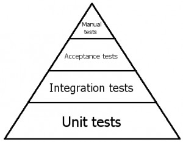

# Лекция 15. Тестирование.


**Тестирование** – это огроменная тема! Она настолько масштабна, что породила целое направление в IT с множеством специалистов, которые занимаются исключительно тестированием. В больших компаниях есть отдельные команды тестировщиков, а автоматизированное тестирование стало неотъемлемой частью разработки.

Но если вы думаете, что тестирование — это исключительно работа тестировщиков, то у меня для вас плохие новости. Каждый разработчик должен уметь тестировать код!

Но есть и хорошая новость — вы, скорее всего, уже занимались тестированием, просто не осознавали этого!

## Исследовательское тестирование против планового

### Исследовательское тестирование

Когда вы запускаете своё приложение впервые и начинаете пробовать разные функции, вводить разные данные и нажимать кнопки, вы тестируете систему.

Это называется исследовательским тестированием — процесс, в котором нет строгого плана. Вы просто пробуете разные варианты и смотрите, как программа реагирует на них.

**Примеры исследовательского тестирования:**

- Вводите число в поле и проверяете, что программа правильно его обрабатывает.
- Пробуете ввести буквы или спецсимволы, чтобы увидеть, что произойдёт.
- Нажимаете все кнопки в случайном порядке, пытаясь сломать программу.

Это интуитивный подход, которым пользуются обычные пользователи. Но у исследовательского тестирования есть минус — оно не системное. Когда программа становится большой, невозможно помнить все сценарии тестирования.

### Плановое тестирование

Чтобы убедиться, что каждая часть программы работает правильно, нужно использовать плановое тестирование.
Здесь на помощь приходит тест-план — структурированное описание того, что и как нужно проверять.

**Что включает в себя тест-план?**

1️. Список всех функций приложения.
2️. Перечень всех возможных входных данных.
3️. Ожидаемые результаты для каждого теста.

Теперь каждый раз, когда вы изменяете код, вам не нужно гадать, всё ли работает — просто проходите по списку и проверяете!

**Пример:**

Представьте, что вы разрабатываете онлайн-магазин.
Без тест-плана вы будете проверять только те сценарии, которые приходят в голову.

А с тест-планом у вас будет структурированный список:

- Можно ли добавить товар в корзину?
- Что будет, если нажать «Заказать» без товаров в корзине?
- Что произойдёт, если ввести отрицательное число в поле «Количество»?

Понимаете разницу?

### Что происходит, если не тестировать код?


Если тестирования нет, всё будет работать до первого сбоя.

- Представьте, что программист изменил код корзины в интернет-магазине. Он не протестировал изменения, выложил их на сайт, и...
- Пользователи не могут добавить товар в корзину!
- Компания теряет деньги!
- Клиенты уходят к конкурентам!

Вот почему тестирование — это не просто лишняя работа, а необходимая часть разработки.

## Виды тестирования


Тестирование делится на разные категории, каждая из которых проверяет систему с разных сторон.
На этой схеме представлена классификация тестирования:

### 1. По производительности сценариев

- **Позитивное тестирование** – проверка ожидаемых сценариев, когда пользователь вводит корректные данные и использует систему так, как задумано.

- **Негативное тестирование** – проверка системы на непредвиденные ситуации:
    - ввод некорректных данных (-100 в поле "Возраст");
    - использование сломанных файлов;
    - попытка создать заказ без заполнения данных.

Если тестирование не проверяет негативные сценарии, пользователи могут случайно сломать систему.

### 2. По времени проведения

Разные тесты запускаются на разных этапах разработки.

- **Альфа-тестирование** – первичная проверка системы внутри компании.
- **Бета-тестирование** – продукт передаётся внешним пользователям перед официальным релизом.
- **Регрессионное тестирование** – проверка, что исправление ошибки не сломало старый функционал.
- **Дымовое тестирование** – быстрая проверка основных функций системы перед выпуском.
- **Приемочное тестирование** – финальная проверка перед тем, как продукт передают заказчику.

### 3.По уровню тестирования

Тесты можно выполнять на разных уровнях приложения.

- **Компонентное тестирование** – проверка отдельных функций и классов.
- **Интеграционное тестирование** – проверка взаимодействия разных модулей.
- **Системное тестирование** – проверка всего приложения целиком.

 Пример: Допустим, мы тестируем приложение для заказа еды:

- Компонентный тест – проверяет, правильно ли считается сумма заказа.
- Интеграционный тест – проверяет, работает ли связь между корзиной и системой оплаты.
- Системный тест – проверяет, что заказ оформляется от начала до конца.

### 4. По автоматизированности

- **Ручное тестирование** – проверка вручную, например, клик по кнопкам в интерфейсе.
- **Автоматизированное тестирование** – тесты написаны в коде и выполняются без участия человека.
- **Полуавтоматизированное тестирование** – часть шагов выполняется автоматически, но есть действия, требующие участия тестировщика.

Мы будем использовать **автоматизированные** тесты в Python, потому что они:

- Работают быстрее, чем ручное тестирование.
- Можно запускать многократно без изменений.
- Позволяют проверить код на разных входных данных.

### 5. По целям тестирования

- **Функциональное тестирование** – проверка, работают ли основные функции системы.
- **Нефункциональное тестирование** – проверка скорости, удобства и безопасности.

К нефункциональному тестированию относятся:

- **Нагрузочное тестирование**– проверка, как система работает под высокой нагрузкой.
- **Стресс-тестирование** – проверка, что будет, если дать чрезмерную нагрузку (например, 10 000 пользователей одновременно).
- **Usability-тестирование** – проверка, удобно ли пользователям работать с программой.
- **Тестирование восстановляемости** – проверка, как система восстанавливается после сбоя.
- **Тестирование надёжности** – оценка стабильности работы системы.
- **Тестирование переносимости** – проверка, как программа работает на разных устройствах и платформах.

### 6. По доступу к системе

- Тестирование "чёрного ящика" – тестировщик не знает, как устроена программа внутри, и проверяет только внешнее поведение.
- Тестирование "белого ящика" – тестировщик видит код и может проверять внутреннюю логику работы.
- Тестирование "серого ящика" – частичный доступ к коду, тестируются и функции, и логика.

## Уровни тестирования

В программировании тестирование происходит на разных уровнях. Представьте пирамиду, в основании которой самые частые тесты, а на вершине – самые редкие.



На этой схеме представлена пирамида тестирования:

- Внизу – юнит-тесты (unit tests), их должно быть больше всего.
- Выше – интеграционные тесты (integration tests), которые проверяют взаимодействие компонентов.
- Ещё выше – приемочные тесты (acceptance tests), которые проверяют готовность продукта.
- На самом верху – ручное тестирование (manual tests), но мы им заниматься не будем!

### Юнит-тесты (Unit Tests) – проверка отдельных деталей


**Юнит-тестирование** – это самый нижний уровень тестирования, он проверяет отдельные части системы.

Представьте, что вы собираетесь строить автомобиль. Перед тем как собирать всю машину, вам нужно проверить каждую деталь по отдельности:

- Работает ли двигатель сам по себе?
- Надёжны ли тормоза?
- Правильно ли передаётся сигнал от руля к колёсам?
- Если тест какой-то одной детали не проходит, вся машина работать не сможет.

В программировании юнит-тесты проверяют каждую функцию и метод отдельно, прежде чем соединять их вместе.

### Интеграционные тесты (Integration Tests) – проверка взаимодействия деталей


Интеграционное тестирование проверяет, как разные части системы работают вместе.

Вы уже проверили, что каждое колесо, тормоза, руль и двигатель работают по отдельности. Но теперь вам нужно понять, как они работают вместе.
Представьте, что вы жмёте на педаль тормоза.

**Что должно произойти?**

- Педаль должна передать сигнал тормозной системе.
- Тормоза должны начать сжимать диски.
- Машина должна замедлиться и остановиться.

Если какая-то связь нарушена – например, тормоза работают, но сигнал не передаётся – машина не сможет остановиться.

Точно так же в программировании интеграционные тесты проверяют, правильно ли взаимодействуют разные модули системы.

### Приемочные тесты (Acceptance Tests) – готов ли продукт к использованию?

**Приемочное тестирование** – это финальная проверка перед тем, как продукт отправится в реальную эксплуатацию. Оно помогает ответить на главный вопрос: *"Можно ли безопасно использовать этот продукт?"*

Вы уже провели все предыдущие тесты:

- Проверили отдельные компоненты (двигатель, тормоза, рулевое управление).
- Проверили, как системы работают вместе (передача сигнала от педали газа к двигателю, от руля к колесам).

Теперь пора провести приемочные тесты, чтобы убедиться, что автомобиль готов к продаже и безопасен для вождения.

#### Что проверяют приемочные тесты?

Перед тем как выпустить автомобиль на рынок, проводится серия тестов, имитирующих реальные условия эксплуатации.

##### 1️. Автомобиль должен ехать

- Разгоняется ли машина без рывков и задержек?
- Работает ли коробка передач при переключении на разные скорости?
- Можно ли плавно остановить автомобиль без резких ударов?

 Если машина не может плавно разгоняться или тормозить – она не проходит тест!

##### 2. Автомобиль должен быть безопасным 

- Работают ли подушки безопасности при столкновении?
- Удерживают ли ремни безопасности пассажиров?
- Можно ли безопасно остановиться на мокрой дороге?

 Если хотя бы одна система безопасности не срабатывает – машину нельзя выпускать!

##### 3️. Автомобиль должен быть удобным для водителя и пассажиров 

- Легко ли открываются и закрываются двери?
- Работает ли кондиционер и обогрев?
- Читается ли информация на приборной панели?

Если водитель не видит скорость на приборной панели – это опасно!

##### 4️. Автомобиль должен работать в разных условиях 

- Заводится ли он в холодную погоду?
- Можно ли ехать по плохим дорогам и бездорожью?
- Работают ли дворники и фары в дождь и снег?

Если машина не заводится зимой – её нельзя продавать в странах с холодным климатом!

**Итог: зачем нужны приемочные тесты?**

Если хотя бы один из этих пунктов не выполнен, выпуск автомобиля откладывается до устранения недостатков.

Программное обеспечение проходит такие же тесты:

- Если сайт не открывается в браузере – его нельзя публиковать.
- Если кнопка "Оплатить" не работает – магазин не может продавать товары.
- Если приложение зависает – его нельзя запускать в продакшен.

> Приемочные тесты – это последний шаг перед выпуском, который гарантирует, что продукт можно безопасно использовать!

### Ручное тестирование (Manual Tests)

Ручное тестирование – это проверка всей системы вручную без автоматических инструментов.

После того как автомобиль прошёл все заводские проверки и официально сошёл с конвейера, его передают тест-пилотам или первым владельцам. Они начинают использовать машину в реальных условиях и обращают внимание на детали, которые нельзя полностью проверить в лаборатории.

#### Что проверяет ручное тестирование в автомобиле?

##### Комфорт при вождении

- Удобно ли сидеть за рулём?
- Хорошо ли видны знаки и дорога?
- Не мешает ли что-то переключению передач?

##### Поведение на дороге

- Как машина ведёт себя на скорости 100 км/ч?
- Есть ли вибрации или посторонние шумы в салоне?
- Не скользит ли автомобиль на мокрой дороге?

##### Долговременные наблюдения

- Насколько удобно парковаться?
- Не появляются ли скрипы в подвеске спустя 10 000 км пробега?
- Как ведёт себя машина в холодную погоду?

**Важно!** Многие такие нюансы нельзя проверить автоматически, поэтому тест-драйвы и отзывы владельцев помогают выявлять проблемы, которые не нашли на заводе.

#### Почему мы не будем этим заниматься?

 - Ручное тестирование долгое и дорогое – один человек не может протестировать всё так же быстро, как машина.
 - Человеческий фактор – тестировщик может что-то забыть проверить.
 - Неповторяемость тестов – у каждого человека разные ощущения, поэтому результаты могут быть неоднозначными.
 - Автоматизированные тесты всегда выполняются одинаково – их можно запускать тысячи раз, и они дадут одинаковый результат.

## Кто пишет тесты? Кто отвечает за их выполнение?

Тестирование – это не просто задача для тестировщиков. Это командная работа, и в процессе тестирования могут участвовать разные специалисты.

### Люди в тестировании

Существует несколько категорий специалистов, которые занимаются тестированием программного обеспечения:

#### Разработчики (Developers, Software Engineers – SE)

- Пишут код и сами должны писать юнит-тесты.
- Отвечают за тестирование отдельных функций и классов.
- Иногда пишут интеграционные тесты, если в компании нет отдельной команды тестировщиков.

#### Автоматизированные тестировщики (AQA – Automation Quality Assurance, SDET – Software Development Engineer in Test)

- Их главная задача – разрабатывать автоматические тесты.
- Они создают интеграционные, регрессионные, нагрузочные тесты.
- Работают со специальными инструментами для тестирования.

#### Мануальные тестировщики (Manual QA, просто “мануальщики”)

- Проверяют продукт вручную, нажимают кнопки, вводят данные.
- Ищут ошибки, которые автоматизация не может предсказать.
- Часто работают в паре с разработчиками и автоматизаторами.

#### QA-инженеры (Quality Assurance – обеспечение качества)

- Могут заниматься как ручным, так и автоматизированным тестированием.
- Пишут тест-кейсы, которые потом выполняют разработчики или тестировщики.
- Работают на стыке между разработчиками, продуктологами и заказчиками.

### Кто пишет тесты на разных уровнях?

#### Кто пишет юнит-тесты?

**Идеальный мир:** - Разработчик сам пишет юнит-тесты к каждому новому коду.

**Реальность:** - Разработчик покрывает тестами только основной функционал. Если тестов мало – приходится тратить время на исправление багов.

**Худший случай:** - Юнит-тестов вообще нет. Если код ломается, никто не знает, почему. Разработчикам приходится тратить часы на поиск проблемы.

#### Кто пишет интеграционные тесты?

**Идеальный мир:** - Интеграционные тесты пишут автоматизированные тестировщики. Они проверяют, как взаимодействуют модули.

**Реальность:** - Если автоматизаторов нет, интеграционные тесты пишут разработчики. Если их тоже нет, тестирование выполняется вручную – что очень долго.

**Худший случай:** - Интеграционных тестов нет вообще. Из-за этого каждое обновление может сломать старый код, и об этом никто не узнает.

#### Кто пишет приёмочные тесты?

**Идеальный мир:** - Приёмочные тесты создают автоматизаторы, иногда вместе с бизнес-аналитиками.

**Реальность:** - Если автоматизаторов нет, тестирование проводят разработчики или менеджеры проекта. Иногда их просто игнорируют, потому что нет времени.

**Худший случай:** - Приемочных тестов нет. В продакшен уходит продукт, который не соответствует ожиданиям пользователей.

#### Кто выполняет ручные тесты?

**Идеальный мир:** - Ручное тестирование выполняют мануальные тестировщики.

**Реальность:** - Если мануальных тестировщиков нет, тестируют автоматизаторы или разработчики. В стартапах тестированием занимаются даже менеджеры.

**Худший случай:** - Ручные тесты не проводятся вообще. В результате клиенты находят ошибки в продакшене, а компания теряет деньги и репутацию.

### Почему тесты должны быть автоматизированными?

Написание автоматических тестов сначала кажется сложным, но в долгосрочной перспективе оно сильно экономит время и позволяет избежать множества ошибок.

- Автоматические тесты быстро выявляют проблемы.
- Они не зависят от человека и всегда дают одинаковый результат.
- Их можно запускать сотни раз в день, чтобы убедиться, что всё работает.

> Нельзя закончить писать тесты – можно только перестать!

Именно поэтому все успешные команды делают тестирование важной частью разработки! 

## Assert в тестировании: основа проверки кода

### Что такое assert и зачем он нужен?

`assert` – это ключевое слово в Python, которое используется для проверки истинности утверждения.

- Если выражение истинное (`True`) – программа продолжает выполнение.
- Если выражение ложное (`False`) – программа выдаёт ошибку и останавливается.

Это делает `assert` основным инструментом для тестирования, так как он позволяет автоматически проверять, работает ли код правильно.

Представьте, что у нас есть кассовый аппарат, который считает сдачу.

```python
def calculate_change(total, paid):
    return paid - total

# Проверяем, правильно ли считается сдача
assert calculate_change(50, 100) == 50  # ОК, всё верно
assert calculate_change(30, 50) == 20   # ОК, всё верно
assert calculate_change(100, 100) == 0  # ОК, всё верно
```

Здесь `assert` убеждается, что сдача считается правильно.

Если бы код был неправильным, например:

```python
assert calculate_change(50, 100) == 40  # Ошибка! Ожидалось 50
```

то программа бы остановилась и выдала ошибку:

```python
AssertionError
```

### Как работает assert в Python?

`assert` проверяет логическое выражение. Если оно `False`, то программа выдаёт ошибку.

```python
assert 2 + 2 == 4  # Всё хорошо, программа продолжает выполнение
assert 2 + 2 == 5  # Ошибка! Ожидали 5, но получили 4
```

Если выражение ложное (`False`), Python вызывает `AssertionError`.

#### Добавление сообщения об ошибке

Чтобы понять, почему тест упал, можно добавить сообщение об ошибке после запятой:

```python
def divide(a, b):
    assert b != 0, "Деление на ноль запрещено!"  # Проверяем, что b не равно 0
    return a / b

print(divide(10, 2))  # Работает нормально
print(divide(10, 0))  # Ошибка: AssertionError: Деление на ноль запрещено!
```

Если `b != 0` – программа продолжает работу.
Если `b == 0` – программа останавливается и выводит `AssertionError`.

по сути весь код сверху, это просто обертка над вот такой конструкцией:

```python
condition = 4 == 5
message = "4 is not equal to 5"
if not condition:
    raise AssertionError(message)
```

### TestCase

**TestCase** – это основной строительный блок модульного тестирования в Python. Он позволяет создавать автономные тесты для проверки работы кода.

**Почему TestCase важен?**

- Объединяет тесты в структурированный класс, а не просто `assert` внутри кода.
- Позволяет писать несколько тестов в одном месте для логически связанных функций.
- Автоматизирует тестирование – все тесты запускаются автоматически и сообщают о проблемах.
- Поддерживает разные типы проверок (например, `assertEqual`, `assertTrue`, `assertRaises` и другие). Ниже в лекции об этом поговорим :)

### Тестовые фреймворки: зачем они нужны и какой будем использовать?

**Фреймворк** – это готовый набор инструментов и правил, который помогает разрабатывать, тестировать и поддерживать код.

Простыми словами: Это "конструктор" для программиста, который позволяет не писать всё с нуля, а использовать готовые решения.Фреймворки упрощают и стандартизируют процесс – все тесты выполняются по единому сценарию, их удобно организовывать и запускать. Без фреймворка тесты пришлось бы писать вручную, как обычный код с `assert`, что неудобно для больших проектов.

#### Какие бывают тестовые фреймворки в Python?

В Python существует несколько популярных фреймворков для тестирования, каждый из которых имеет свои особенности:

##### 1. unittest – встроенный стандарт

-  Входит в стандартную библиотеку Python (не требует установки).
-  Основан на классах (`TestCase`), которые группируют тесты.
-  Использует специальные методы `assertEqual`, `assertTrue`, `assertRaises`.
-  Хорош для юнит-тестов и интеграционного тестирования.

Мы будем использовать `unittest`, потому что он встроен в Python и идеально подходит для базового тестирования.

##### 2. pytest – самый популярный

- Не требует наследования от `TestCase`, можно просто писать тесты с `assert`.
- Поддерживает фикстуры – упрощает настройку тестов.
- Позволяет запускать тесты параллельно.
- Подходит как для юнит-тестов, так и для функционального тестирования.

Требует установки через `pip install pytest`.

Если в будущем вы перейдёте на сложные проекты – `pytest` может быть полезен.

##### 3. doctest – тестирование прямо в документации

- Позволяет писать тесты прямо в `docstring` функции.
- Хорош для простых проверок и примеров.
- Не подходит для сложных тестов.

Хорош для документации, но редко используется для полноценных тестов.

##### 4. nose2 – развитие старого nose

- Автоматически находит тесты, поддерживает unittest.
- Подходит для больших проектов с плагинами.
- Требует установки (`pip install nose2`).

 Редко используется, так как `pytest` более мощный.

#### Почему мы будем использовать unittest?

- Он встроен в Python – ничего не нужно устанавливать.
- Он стандартный – его знают все Python-разработчики.
- Позволяет организовывать тесты по классам (TestCase).
- Подходит для написания юнит-тестов (а это основа тестирования).

Мы будем изучать `unittest`, чтобы научиться писать автоматизированные тесты и делать код надёжнее!

### Как мы будем запускать тесты?

Тесты в реальных проектах почти никогда не пишутся в виде отдельных assert в коде. Вместо этого они организованы в тест-кейсы с помощью `unittest`.`TestCase`.

Что такое `Test Runner`?

`Test Runner` – это специальная программа, которая автоматически находит и запускает тесты.

В `unittest` встроен свой `Test Runner`, который позволяет:

- Искать все файлы с тестами в проекте.
- Запускать тесты и отображать результаты.
- Выдавать подробные отчёты об ошибках.

### Структура тестов в unittest

Тесты организуются в классы, которые наследуются от `unittest.TestCase`.

**Как должны называться тесты?**

- Каждый тест должен быть методом класса.
- Имя теста должно начинаться с `test_`.
- Каждый тест должен содержать хотя бы один `assert`.

Пример проекта с тестами

```bash
/project
    /tests
        __init__.py
        test_math_operations.py
    math_operations.py
```

Файл `__init__.py` в папке tests нужен, чтобы Python воспринимал её как пакет.

### Встроенные методы assert в unittest

Вместо обычного `assert`, `unittest` предоставляет специальные методы, которые делают тесты более понятными:

- `assertEqual(a, b)` – проверяет, что `a == b`.
- `assertTrue(x)` – проверяет, что `x` истинно (`True`).
- `assertFalse(x)` – проверяет, что `x` ложно (`False`).
- `assertIs(a, b)` – проверяет, что `a` и `b` – это один и тот же объект.
- `assertIsNone(x)` – проверяет, что `x` равно `None`.
- `assertIn(a, b)` – проверяет, что `a` содержится в `b`.
- `assertIsInstance(a, b)` – проверяет, что `a` является экземпляром `b`.

Простейший пример
В корне нашего проекта создадим файл tests.py

```python
# tests.py
import unittest


class TestSum(unittest.TestCase):
    def test_sum(self):
        self.assertEqual(sum([1, 2, 3]), 6, "Should be 6")

    def test_sum_tuple(self):
        self.assertEqual(sum((1, 2, 2)), 6, "Should be 6")


if __name__ == '__main__':
    unittest.main()
```

Обратите внимание, код заканчивается такими строками:

```python
if __name__ == '__main__':
    unittest.main()
```

Тут это добавлено, для того что бы мы смогли напрямую, явно запустить этот файл как файл с тестами. В реальности так не делается, дальше покажу как делается.

Теперь если мы запустим файл, в котором это написано, мы увидим следующее:

```
Received test ids from temp file.
test_sum (tests.test_unit.test_sum.TestSum.test_sum) ... ok
test_sum_tuple (tests.test_unit.test_sum.TestSum.test_sum_tuple) ... FAIL

======================================================================
FAIL: test_sum_tuple (tests.test_unit.test_sum.TestSum.test_sum_tuple)
----------------------------------------------------------------------
Traceback (most recent call last):
  File "e:\PythonCourses\Documents\practice\module2\tests\test_unit\test_sum.py", line 9, in test_sum_tuple
    self.assertEqual(sum((1, 2, 2)), 6, "Should be 6")
AssertionError: 5 != 6 : Should be 6

----------------------------------------------------------------------
Ran 2 tests in 0.002s

FAILED (failures=1)
Finished running tests!
```

### Как запускать тесты?

Запустить тесты можно тремя способами:

#### 1. Запуск вручную (через unittest.main())

То можно запустить тесты просто командой:

```sh
python tests.py
```

Но этот способ неудобен для больших проектов.

#### 2. Запуск через unittest в консоли

Python может сам найти и запустить все тесты в проекте.

**Запуск всех тестов в проекте:**

```sh
python -m unittest
```

**Запуск конкретного файла с тестами:**

```sh
python -m unittest tests/test_math_operations.py
```

**Запуск конкретного класса с тестами:**

```sh
python -m unittest tests.test_math_operations.TestMath
```

**Запуск отдельного теста:**

```sh
python -m unittest tests.test_math_operations.TestMath.test_add
```

#### 3. Установка расширения Python Test Explorer for Visual Studio Code

Для удобного запуска и управления тестами в `Visual Studio Code (VS Code)` мы можем использовать расширение `Python Test Explorer`. Оно добавляет графический интерфейс для работы с тестами, позволяя запускать их прямо в редакторе.

**Шаг 1: Установка расширения**

1️. Откройте Visual Studio Code.

2️. Перейдите во вкладку Extensions (или нажмите `Ctrl + Shift + X`).

3️. В строке поиска введите:

```sh
Python Test Explorer
```

4️. Выберите расширение "`Python Test Explorer for Visual Studio Code`".

5. Нажмите "`Install`" (Установить).


После установки в боковой панели VS Code появится вкладка "`Test Explorer`", где будут отображаться все найденные тесты.

**Шаг 2: Настройка тестов в VS Code**

1️. Откройте `Command Palette (Ctrl + Shift + P)`.

2️. Найдите и выберите "`Python: Configure Tests`".

3️. Выберите "`unittest`" в качестве тестового фреймворка.

4️. Укажите папку, где находятся тесты (`tests/` или . – если тесты в корне проекта).

5️. Сохраните настройки.

После этого `Test Explorer` автоматически найдет тесты и отобразит их в боковой панели.

**Шаг 3: Запуск тестов в VS Code**

Теперь в боковой панели `Test Explorer` можно:

- Запускать все тесты сразу.
- Запускать отдельные тесты.
- Просматривать результаты тестов (успешные тесты помечены зелёным, проваленные – красным).

Быстрый запуск тестов:

В боковой панели нажмите `▶ Run All Tests` – запустятся все тесты.
Можно кликнуть `▶`напротив конкретного теста, чтобы запустить его отдельно.

### Методы setUp и tearDown

В `unittest` есть специальные методы, которые запускаются перед каждым тестом и после него.

### Для чего они нужны?

`setUp()` – выполняется перед каждым тестом (например, подготовка данных).
`tearDown()` – выполняется после каждого теста (например, очистка временных файлов).

Это полезно, если нужно инициализировать тестовые данные перед каждым тестом.

```python
import unittest

class TestExample(unittest.TestCase):

    def setUp(self):
        print("Подготовка перед тестом")

    def test_case_1(self):
        print("Выполняется test_case_1")

    def test_case_2(self):
        print("Выполняется test_case_2")

    def tearDown(self):
        print("Очистка после теста")

if __name__ == '__main__':
    unittest.main()

# Подготовка перед тестом
# Выполняется test_case_1
# Очистка после теста
# Подготовка перед тестом
# Выполняется test_case_2
# Очистка после теста
```

### Пропуск тестов (skip, skipIf, skipUnless)

Иногда бывает нужно пропустить определённые тесты.

**Зачем это нужно?**

- Если тест ещё не готов, но его нужно временно отключить.
- Если тест зависит от версии Python или библиотеки.
- Если тест нужен только для Windows или Linux.

**Как пропустить тест?**

```python
import unittest
import sys

class TestExample(unittest.TestCase):

    @unittest.skip("Этот тест пока пропущен")
    def test_skip(self):
        self.fail("Этот тест не должен был выполниться")

    @unittest.skipIf(sys.version_info < (3, 8), "Только для Python 3.8+")
    def test_skip_if(self):
        print("Этот тест выполняется только в Python 3.8+")

    @unittest.skipUnless(sys.platform.startswith("win"), "Только для Windows")
    def test_skip_unless(self):
        print("Этот тест выполняется только на Windows")

if __name__ == '__main__':
    unittest.main()
```

**Вывод в консоли:**

```markdown
s..
----------------------------------------------------------------------
Ran 3 tests in 0.001s
OK (skipped=1)
```

Здесь один тест пропущен (s.. – означает "skipped" + 2 успешных теста).

## Mock

Мок - это фиктивные объекты. Очень часто мы попадаем в такие ситуации, когда в тесте мы не можем выполнить какое-либо
действие, например, в вашем модуле будет метод, который в реальности возвращает случайное значение.

Но в тесте мы не можем полагаться на случайности, нам нужно протестировать как именно ведет себя код, в разных случаях.

`Mock` является частью стандартной библиотеки начиная с python 3.3, очень вряд ли вы столкнетесь с такими старыми
версиями в современном мире

### Как это работает?

Можно создать `Mock` объект и заменить им всё что угодно. Мы можем назначить ему возвращаемый результат, для вызова чего
угодно. Таким образом это объект который не вызывает ошибку при любом его использовании и можно в нем настроить любые
атрибуты или методы

```python
from unittest.mock import Mock

mock = Mock()
mock.some_attribute  # все ок, не существующий атрибут существует
mock.any_method()  # опять все ок, и все существует
mock.method1().attr1.attr2.method2()  # так тоже все ок, любой атрибут или метод будет возвращать Mock объект
```

Мы можем использовать фейковый объект в качестве аргумента или целиком заменяя сущность:

```python
# Pass mock as an argument to do_something()
do_something(mock)

# Patch the random library
random = mock
```

Есть достаточно много способов использовать `Mock`, очень хорошая
статья [Тут](https://realpython.com/python-mock-library/)

Рассмотрим основные

### Контроль возвращаемого результата

Предположим, вам нужно убедиться, что ваш код в будни и в выходные дни ведёт себя по-разному, а код подразумевает
использование встроенной библиотеки `datetime`.

Для упрощения пока засунем все в один файл:

```python
from datetime import datetime


def is_weekday():
    today = datetime.today()
    # Python's datetime library treats Monday as 0 and Sunday as 6
    return 0 <= today.weekday() < 5


# Test if today is a weekday
assert is_weekday()
```

Если мы запустим этот тест в воскресенье, то мы получим `exception`, что же с этим делать? Замокать... `Mock` объект
может возвращать по вызову любой функции необходимое нам значение посредством заполнения `return_value`.

```python
import datetime
from unittest.mock import Mock

# Save a couple of test days
tuesday = datetime.datetime(year=2019, month=1, day=1)
saturday = datetime.datetime(year=2019, month=1, day=5)

# Mock datetime to control today's date
datetime = Mock()


def is_weekday():
    today = datetime.datetime.today()
    # Python's datetime library treats Monday as 0 and Sunday as 6
    return 0 <= today.weekday() < 5


# Mock .today() to return Tuesday
datetime.datetime.today.return_value = tuesday
# Test Tuesday is a weekday
assert is_weekday()
# Mock .today() to return Saturday
datetime.datetime.today.return_value = saturday
# Test Saturday is not a weekday
assert not is_weekday()
```

> В этом примере, мы заставили библиотеку `datetime` не возвращать реальные результаты, а возвращать то, что нужно нам.

> Детально изучите этот пример!

Если нам необходимо, чтобы после повторного вызова мы получали другие результаты, то нам поможет `side_effect`. Работает
также, как и `return_value`, только принимает перебираемый объект и с каждым вызовом возвращает следующее значение.

```python
mock_poll = Mock(side_effect=[None, 'data'])
mock_poll()
# None
mock_poll()
# 'data'
```

Или как в прошлом примере:

```python
import datetime
from unittest.mock import Mock

# Save a couple of test days
tuesday = datetime.datetime(year=2019, month=1, day=1)
saturday = datetime.datetime(year=2019, month=1, day=5)

# Mock datetime to control today's date
datetime = Mock()


def is_weekday():
    today = datetime.datetime.today()
    # Python's datetime library treats Monday as 0 and Sunday as 6
    return 0 <= today.weekday() < 5


# Mock .today() to return Tuesday first time and Saturday second time
datetime.datetime.today.side_effect = [tuesday, saturday]
assert is_weekday()
assert not is_weekday()
```

### Декоратор patch

Допустим, у нас есть класс, где мы вызываем модуль `random` (как будет в вашем модуле), но нам для тестов не подходит
случайность:

```python
import random


class Randomizer:
    def value_from_list(self, some_list: list[int]) -> str:
        return f"{random.choice(some_list)}!"
```

> Этот код будет возвращать случайное значение из списка.

И тест к этой функции:

```python
from unittest import TestCase
from main import Randomizer


class TestCalculator(TestCase):
    def setUp(self):
        self.rand = Randomizer()

    def test_sum(self):
        answer = self.rand.value_from_list([1, 2, 3, 4])
        self.assertEqual(answer, "?!")  # С чем будем сравнивать? мы не знаем какое значение нам вернется
```

На самом деле тестировать функцию которую мы импортировали из стандартной библиотеки не нужно. Но если есть хоть
какие-то наши изменения то уже очень нужно.

Как протестировать наш метод? Замокать случайность.

```python
from unittest import TestCase
from unittest.mock import patch
from main import Randomizer


class TestCalculator(TestCase):
    def setUp(self):
        self.rand = Randomizer()
        self.values = [1, 2, 3, 4]

    @patch('main.Randomizer.random.choice')
    def test_sum(self, choice_mock):
        choice_mock.return_value = 1
        result = self.rand.value_from_list(self.values)
        self.assertEquals(result, "1!")

```

Пропатченные методы попадают в аргументы метода теста.