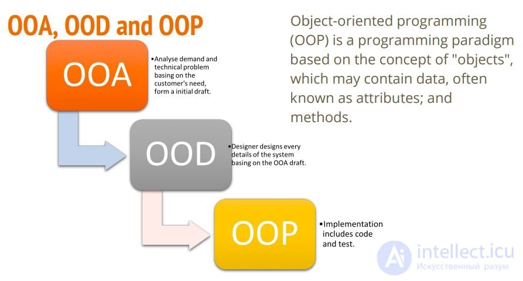
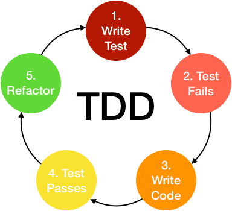
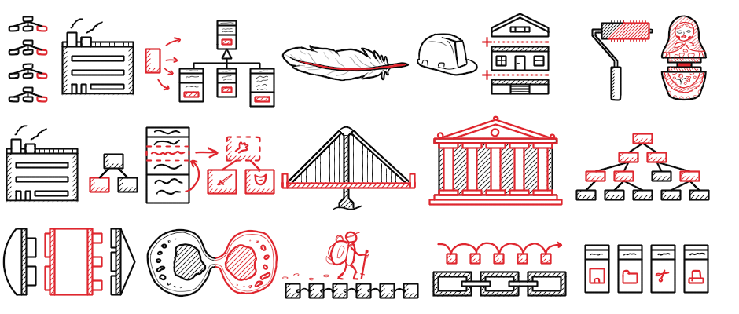

# Лекция 16. Проектирование. Паттерны. SOLID.


## Введение

Программирование — это не только написание кода, но и грамотное проектирование системы. Можно написать код, который работает, но если его сложно поддерживать, тестировать и расширять, то в будущем он превратится в кошмар.

Представьте, что вы строите дом. Если у вас четкий план, вы понимаете, где будет кухня, ванная, стены и окна. Это делает строительство логичным и упорядоченным.
Но если вы будете строить хаотично, не задумываясь о планировке, то однажды вам придется разбирать стены, потому что забыли оставить место для дверей.

То же самое и с кодом. Если он логично структурирован, поддерживать и развивать проект будет легко. Если код хаотичный, то с каждым изменением проект будет разваливаться.

### Почему важно проектирование?

**1. Код должен быть читаемым.**

- Если разработчик смотрит на код и не понимает, что в нем происходит, значит, он плохо спроектирован.

**2. Код должен быть гибким.**

- Добавление новых функций не должно ломать старые.

**3. Код должен быть тестируемым.**

- Хороший код легко покрывается тестами.

**4. Код должен быть переиспользуемым.**

- Не нужно писать одно и то же несколько раз – можно выделить повторяющиеся части и сделать их универсальными.

В этой лекции мы разберем ключевые принципы проектирования, узнаем, как правильно анализировать систему, познакомимся с паттернами проектирования и разберем принципы SOLID, которые помогут писать правильный и поддерживаемый код.

## Виды проектирования в программировании

**Проектирование программного обеспечения** — это процесс создания структуры системы, в которой продумываются её компоненты, их взаимодействие и способы реализации.

Правильное проектирование делает код понятным, расширяемым и удобным в сопровождении.
Без проектирования код превращается в хаос, где любая новая функция может сломать старый функционал.

Проектирование делится на несколько уровней, которые обеспечивают плавный переход от идеи к готовому программному продукту.

### 1. Архитектурное проектирование (Architectural Design)

Архитектурное проектирование отвечает за глобальную структуру системы.

На этом этапе определяют:

- Какие модули будут в системе (например, база данных, сервер, клиентская часть).
- Как они будут взаимодействовать между собой.
- Какие технологии будут использоваться.

**Пример из жизни:**

Представьте, что вы проектируете новый город.

- Нужно определить расположение районов (жилые кварталы, бизнес-центр, промышленная зона).
- Продумать транспортные связи (дороги, мосты, метро).
- Решить, как будут подводиться коммуникации (вода, электричество, интернет).

**Пример в программировании:**

Разрабатывается интернет-магазин.

- Определяется, где будут храниться данные.
- Решается, как будет организован сервер.
- Продумывается, как взаимодействуют компоненты.

Если архитектурное проектирование сделано плохо, код будет сложно поддерживать и изменять.

### 2. Проектирование компонентов (Component Design)

Если архитектурное проектирование отвечает за общую структуру системы, то проектирование компонентов углубляется в детали отдельных модулей.

На этом этапе разбирается каждый модуль по его функционалу, определяется его структура и внутренняя логика.

**Пример из жизни:**

Представьте, что город уже спроектирован. Теперь нужно спроектировать отдельные здания — какой высоты будут дома, сколько в них этажей, какие материалы использовать.

**Пример в программировании:**

Возьмем интернет-магазин.

- Уже определены модули "Пользователи", "Корзина", "Оплата".
- Теперь нужно продумать, какие классы будут внутри каждого модуля.
  - В модуле "Корзина" будет класс `Cart`, а в нем методы `add_product()`, `remove_product()`.
  - В модуле "Оплата" будет класс `PaymentService`, который обрабатывает платежи.

Если компоненты плохо продуманы, система станет сложной, а изменения в одном модуле могут сломать работу других.

### 3. Проектирование интерфейсов (Interface Design)

Проектирование интерфейсов отвечает за способы взаимодействия между модулями.

Это могут быть:

- Графические интерфейсы (кнопки, формы, меню).
- Программные интерфейсы (API, библиотеки, классы, методы).

**Пример из жизни:**

Допустим, строится железная дорога между городами.

- Нужно продумать станции, где поезда будут останавливаться.
- Определить расписание и правила движения поездов.

**Пример в программировании:**

В интернет-магазине:

- фронтенд (React) общается с сервером через API.
- сервер (Django) передает данные в базу.
- когда пользователь делает заказ, корзина отправляет данные в модуль оплаты.

Если интерфейсы плохо продуманы, модули не смогут эффективно взаимодействовать друг с другом.

### Почему все три уровня важны?

1. Архитектурное проектирование — это глобальный план системы.

   - Определяет общую структуру и основные технологии.
2. Проектирование компонентов — это разработка деталей каждого модуля.

   - Определяет, какие классы, методы и связи будут в каждом модуле.
3. Проектирование интерфейсов — это правила общения между модулями.

   - Определяет API, взаимодействие с базами данных и клиентами.

Если пропустить любой из этих этапов, система станет сложной, запутанной и плохо масштабируемой.

## Этапы объектно-ориентированной разработки: OOA → OOD → OOP



Объектно-ориентированное проектирование (ООП) не начинается сразу с написания кода. Перед тем как приступить к разработке, необходимо пройти три важных этапа, которые помогут структурировать систему и избежать ошибок в будущем.

Каждый из этих этапов решает свои задачи и постепенно приближает нас от абстрактного понимания системы к её программной реализации.

### 1. OOA (Объектно-ориентированный анализ – Object-Oriented Analysis)

**Задача:**

На этом этапе проводится анализ системы, определяются основные сущности (объекты) и их свойства.
Разработчики изучают требования к проекту и разбираются, какие объекты существуют в реальном мире и как они взаимодействуют.

**Пример из жизни:**

Представьте, что вам нужно построить новый торговый центр. Прежде чем закладывать фундамент, нужно провести анализ – какие магазины будут в здании, сколько этажей потребуется, какие зоны отдыха нужны, где расположить парковку. Этот анализ поможет понять основные сущности будущего здания: магазины, кассы, эскалаторы, парковка, охрана.

**Пример в программировании:**

Допустим, разрабатывается онлайн-магазин.

- На этом этапе анализируется, какие объекты есть в системе: Пользователь, Товар, Заказ, Корзина.
- Определяются свойства объектов (у товара есть название, цена, количество; у пользователя – имя, email, адрес).
- Анализируются возможные действия (пользователь может добавить товар в корзину, оформить заказ, оплатить).

На этом этапе нет кода, только анализ и планирование структуры системы.

### 2. OOD (Объектно-ориентированное проектирование – Object-Oriented Design)

**Задача:**

После того как мы разобрались, какие объекты есть в системе, нужно продумать как они будут взаимодействовать.
На этом этапе определяются классы, их методы и связи между ними.

**Пример из жизни:**

После анализа торгового центра становится понятно, какие магазины будут внутри. Теперь нужно продумать их расположение – где поставить эскалаторы, как будет устроена навигация, какие магазины будут на первом этаже, а какие на втором.

Этот этап помогает сделать систему удобной и логичной.

**Пример в программировании:**

В интернет-магазине у нас есть объект `"Пользователь"`, но как он взаимодействует с другими объектами?

- Пользователь может взаимодействовать с корзиной, значит, у него должен быть метод `add_to_cart()`.
- Корзина должна хранить список товаров, значит, в ней будет список `products`.
- Для оформления заказа создается объект `Order`, который получает данные из корзины.

На этом этапе разрабатываются диаграммы классов, определяются методы объектов и их связи.
Здесь важно следовать принципам SOLID и применять паттерны проектирования(о них мы поговорим ниже), чтобы система была гибкой и удобной для расширения.

### 3. OOP (Объектно-ориентированное программирование – Object-Oriented Programming)

**Задача:**

На этом этапе мы переходим от проектирования к написанию кода. Разработчики начинают реализовывать классы, прописывать методы, писать логику работы системы.

**Пример из жизни:**

Когда план торгового центра готов, можно начинать строительство – заливать фундамент, возводить стены, прокладывать коммуникации.

Этот этап – конкретная реализация всего, что было продумано ранее.

**Пример в программировании:**

Теперь можно написать код для классов:

- cоздать класс `User` с методами `add_to_cart()` и `checkout()`.
- реализовать класс `Cart`, который хранит товары и считает сумму заказа.
- написать класс `Order`, который фиксирует покупку.

На этом этапе важно следовать принципам ООП, использовать инкапсуляцию, наследование и полиморфизм.

### Как связаны эти этапы?

- **OOA** – анализируем требования, определяем объекты системы.
- **OOD** – продумываем структуру системы, разрабатываем классы и связи.
- **OOP** – реализуем проект в виде кода.

Если **пропустить анализ**, система получится хаотичной. Если **пропустить проектирование**, код будет сложно поддерживать.

Поэтому все три этапа важны для создания качественного программного продукта.

## Подход к проектированию

Проектирование программного обеспечения — это не просто написание кода, а процесс создания логичной, устойчивой и расширяемой системы. Главное саблюдать два принцыпа:

> **KISS** = Keep it simple, stupid (Чем проще, тем лучше! не нужно писать 100 строк кода, если задачу можно решить за 10.)

> **DRY** = Don't repeat yourself (Не повторяйся! Если ты используешь один и тот же код в разных местах, сделай из него функцию или метод)

Для этого существуют разные подходы к разработке, которые помогают избежать хаоса, уменьшить количество ошибок и сделать код более качественным.

Сегодня мы рассмотрим два важных подхода:

- `DDD (Data-Driven Development)` — разработка, основанная на данных.
- `TDD (Test-Driven Development)` — разработка через тестирование.

Эти подходы помогают программистам не просто писать код, а создавать продуманные и надежные системы.

### Data-Driven Development (DDD) – разработка, основанная на данных


Все действия описаны на схеме

- Планируем что-то сделать
- Анализируем полученный на этапе планирования запрос
- Проектируем проект
- Имплементируем (пишем код)
- Пишем тесты
- Поддерживаем приложение

Этот подход означает, что данные являются основой системы, а архитектура приложения строится так, чтобы эффективно работать с ними.

Если в классическом программировании сначала разрабатывают логику, а потом думают, как работать с данными, то в **DDD** всё наоборот – сначала анализируются данные, а потом на их основе проектируется система.

**Как это работает?**

- Определяются основные данные системы: какие сущности есть, как они связаны между собой.
- Выбирается оптимальная структура хранения данных.
- Разрабатываются интерфейсы доступа к данным.
- Вся бизнес-логика строится вокруг работы с данными.

**Пример из жизни:**

Представьте, что вы строите библиотеку.

Прежде чем думать о дизайне здания, нужно понять, какие книги будут храниться, сколько их, как их удобно расставить, где сделать читальный зал.
Все решения принимаются на основе данных — если книг много, нужно больше полок, если библиотека популярна, нужны просторные залы.

**Пример в программировании:**

Разрабатывается интернет-магазин.

В первую очередь анализируются данные:

**Какие есть категории товаров?**

- Какие поля важны для каждого товара (цена, описание, фото)?
- Какие связи существуют (например, товар может принадлежать сразу к нескольким категориям)?
- После этого выбирается структура базы данных и уже на её основе строится код.

**Плюсы DDD:**

- Код получается структурированным, так как вся система строится вокруг данных.
- Легко добавлять новые функции, потому что данные уже хорошо организованы.
- Оптимизирована работа с большими объемами информации.

**Минусы DDD:**

- Подходит не для всех проектов – если система не работает с большими объемами данных, то подход может быть избыточным.
- Требует хорошего понимания предметной области – если данные спроектированы плохо, система получится неэффективной.

### Test-Driven Development (TDD) – разработка через тестирование



Этот подход означает, что прежде чем написать код, мы сначала пишем тесты, а уже потом реализуем саму функциональность.

В классическом программировании сначала пишут код, а потом тестируют его.
В **TDD** всё наоборот: сначала пишем тест, который "падает" (не проходит), а потом делаем так, чтобы он прошел.

**Как это работает?**

- Пишем тест, который проверяет нужную функциональность (например, сложение двух чисел).
- Запускаем тест – он не проходит, потому что код ещё не написан.
- Пишем минимально необходимый код, чтобы тест прошел.
- Оптимизируем код, если это необходимо.
- Повторяем процесс для следующей функции.

**Пример из жизни:**

Представьте, что вы строитель, который проверяет каждую деталь перед её установкой.

Прежде чем класть кирпичи в стену, вы проверяете их прочность.
Прежде чем подключить электричество, вы проверяете проводку.
В итоге, когда дом построен, всё уже проверено и работает без проблем.

**Пример в программировании:**

Разрабатывается калькулятор.

Сначала пишем тест:

```python
def test_add():
    assert add(2, 3) == 5
```

Запускаем тест – он не проходит, потому что функции `add()` ещё нет.

Пишем саму функцию:

```python
def add(a, b):
    return a + b
```

Запускаем тест снова – теперь он проходит. Продолжаем писать новые тесты и функции.

**Плюсы TDD:**

- Меньше багов, так как код сразу проверяется.
- Уверенность в коде – если тесты проходят, значит, всё работает.
- Легче изменять код, потому что тесты сразу показывают, если что-то сломалось.

**Минусы TDD:**

- Дольше писать код – сначала тест, потом код, а потом исправления.
- Нужно понимать, как писать тесты – не все программисты сразу умеют это делать.

## SOLID: 5 Принципов Чистого ООП-Кода


`SOLID` — это набор из пяти принципов, которые помогают писать гибкий, понятный и поддерживаемый код.

Каждая буква в слове `SOLID` обозначает отдельный принцип, и если следовать им, можно избежать множества проблем при разработке.

### Почему важно знать SOLID?

- 1. Упрощает поддержку кода – код становится понятным и логичным.
- 2. Делает код гибким – проще вносить изменения без ломки всей системы.
- 3. Помогает избегать "спагетти-кода" – код не превращается в кашу из зависимостей.
- 4. Упрощает тестирование – легко писать и поддерживать тесты.

Теперь разберём каждый принцип отдельно.

## S - The Single Responsibility Principle (Принцип единственной ответственности)


Каждый класс должен отвечать только за одну задачу.

### Что это значит?

Если класс делает слишком много, он сложно читается и поддерживается. Лучше разделить функциональность на несколько специализированных классов.

**Пример из жизни:**

Представьте себе повара в ресторане. Если он готовит только еду – это логично. Но если он ещё убирает, принимает заказы, моет посуду, то он перегружен.

Хороший ресторан делит обязанности:

Повар – готовит.
Официант – принимает заказы.
Уборщик – убирает.

Плохой код (слишком много обязанностей в одном классе):

```python
class Order:
    def calculate_price(self):
        pass

    def print_receipt(self):
        pass

    def send_email(self):
        pass
```

Этот класс и считает цену, и печатает чек, и отправляет email – это слишком много!

**Хороший код (разделяем обязанности на разные классы):**

```python
class Order:
    def calculate_price(self):
        pass

class ReceiptPrinter:
    def print_receipt(self):
        pass

class EmailSender:
    def send_email(self):
        pass
```

Теперь каждый класс делает только одно действие, и код читается и поддерживается проще.

## O – The Open/Closed Principle (Принцип открытости/закрытости)


Код должен быть открыт для расширения, но закрыт для модификации.

### Что это значит?

Мы можем добавлять новый функционал, но не должны изменять старый код. Это защищает код от неожиданных багов.

**Пример из жизни:**

Представьте розетку в вашей комнате. Если вы хотите подключить новый прибор (телевизор, лампу), вам не нужно разбирать стены и переделывать проводку. Достаточно вставить вилку в розетку – система расширяется без модификации.

Плохой код (каждый раз нужно менять код класса при добавлении нового типа оплаты):

```python
class PaymentProcessor:
    def process(self, payment_type):
        if payment_type == "credit_card":
            print("Processing credit card payment")
        elif payment_type == "paypal":
            print("Processing PayPal payment")
```

Если нам нужно добавить новый способ оплаты, придётся менять этот код – это нарушает принцип `O`.

Хороший код (используем полиморфизм – просто добавляем новые классы):

```python
class PaymentMethod:
    def pay(self):
        pass

class CreditCard(PaymentMethod):
    def pay(self):
        print("Processing credit card payment")

class PayPal(PaymentMethod):
    def pay(self):
        print("Processing PayPal payment")

def process_payment(payment: PaymentMethod):
    payment.pay()

process_payment(CreditCard())  # Легко добавлять новые способы оплаты!
process_payment(PayPal())
```

Теперь добавление новых способов оплаты не требует изменения старого кода.

## L – The Liskov Substitution Principle (Принцип подстановки Лисков)


Подклассы должны полностью заменять родительский класс без изменений логики.

### Что это значит?

Если у вас есть класс `A`, и вы замените его на `B`, то код должен работать так же. Нельзя создавать подклассы, которые меняют поведение родительского класса.

**Пример из жизни:**

Представьте, что у вас есть автомобиль, и вы можете его завести и поехать. Если вы замените его на электромобиль, он всё равно должен работать так же (просто с другим двигателем). Но если новая машина не может ездить, то это уже нарушает принцип Лисков.

Плохой код (подкласс нарушает поведение родителя):

```python
class Bird:
    def fly(self):
        print("Я лечу!")

class Penguin(Bird):  # Пингвин — тоже птица, но он не летает!
    def fly(self):
        raise Exception("Пингвины не умеют летать!")
```

Теперь, если где-то в коде вызвать `penguin.fly()`, то программа сломается.

Хороший код (делаем отдельный класс для нелетающих птиц):

```python
class Bird:
    pass

class FlyingBird(Bird):
    def fly(self):
        print("Я лечу!")

class Penguin(Bird):  # Теперь код корректный!
    def swim(self):
        print("Я плаваю!")
```

Теперь логика соблюдена – пингвины не могут летать, но могут плавать.

## I – The Interface Segregation Principle (Принцип разделения интерфейсов)


Лучше несколько маленьких интерфейсов, чем один большой.

### Что это значит?

Нельзя заставлять классы реализовывать методы, которые им не нужны. Лучше разбить один большой интерфейс на несколько маленьких.

**Пример из жизни:**

Представьте, что в спортивном клубе есть разные тренеры.

- Фитнес-тренер обучает упражнениям.
- Диетолог разрабатывает питание.
- Массажист делает массаж.

Но если заставить всех тренеров делать всё сразу – это будет неудобно.

Плохой код (большой интерфейс с ненужными методами):


Допустим, мы проектируем систему уведомлений для интернет-магазина:

```python
class Notifier:
    def send_email(self, user, message):
        raise NotImplementedError

    def send_sms(self, user, message):
        raise NotImplementedError

    def send_push(self, user, message):
        raise NotImplementedError
```

Теперь, если мы захотим сделать, например, уведомление только через `email` — нам придётся реализовывать и `SMS`, и `push`, даже если они не нужны.

```python
class EmailNotifier(Notifier):
    def send_email(self, user, message):
        print(f"Отправка email {user.email}: {message}")

    def send_sms(self, user, message):
        pass  # Не нужно, но обязаны определить

    def send_push(self, user, message):
        pass  # Не нужно, но обязаны определить
```

Это нарушает принцип `ISP`: «Клиенты не должны зависеть от методов, которые они не используют».

Хороший код (разделяем интерфейсы)

Вместо одного большого интерфейса делаем несколько маленьких:

```python
class EmailNotifiable:
    def send_email(self, user, message):
        raise NotImplementedError


class SmsNotifiable:
    def send_sms(self, user, message):
        raise NotImplementedError


class PushNotifiable:
    def send_push(self, user, message):
        raise NotImplementedError
```

Теперь каждый класс реализует только то, что ему нужно:

```python
class EmailNotifier(EmailNotifiable):
    def send_email(self, user, message):
        print(f"Отправка email {user.email}: {message}")


class SmsNotifier(SmsNotifiable):
    def send_sms(self, user, message):
        print(f"Отправка SMS на {user.phone}: {message}")

class PushNotifier(PushNotifiable):
    def send_push(self, user, message):
        print(f"Отправка push-уведомления {user.username}: {message}")


class MultiChannelNotifier(EmailNotifiable, SmsNotifiable, PushNotifiable):
    def send_email(self, user, message):
        print(f"Email → {user.email}: {message}")

    def send_sms(self, user, message):
        print(f"SMS → {user.phone}: {message}")

    def send_push(self, user, message):
        print(f"Push → {user.username}: {message}")
```

## D – The Dependency Inversion Principle (Принцип инверсии зависимостей)


Зависимости должны строиться на абстракциях, а не на конкретных классах.

### Что это значит?

Модули высокого уровня (управляющая логика) не должны зависеть от модулей низкого уровня (конкретные детали реализации).
Вместо привязки к конкретным реализациям нужно использовать абстракции (интерфейсы), чтобы можно было легко подменять зависимые объекты.

**Пример из жизни:**

Представьте, что лампочка напрямую подключена к сети без выключателя.

- Если вам нужно выключить свет, придётся отключать провода.
- Это неудобно и небезопасно!

Выключатель решает проблему!

- Теперь лампочку можно включать и выключать, не меняя проводку.
- Если лампочка перегорела, её можно заменить на новую без изменений в сети.

Выключатель – это абстракция, которая разрывает жёсткую зависимость между электросетью и лампочкой.

Плохой код (жёсткая зависимость от конкретного класса)

```python
class IncandescentBulb:
    def turn_on(self):
        print("Лампочка накаливания включена")

class Room:
    def __init__(self):
        self.light = IncandescentBulb()  # Жёсткая привязка к лампочке накаливания

    def illuminate(self):
        self.light.turn_on()
```

**Проблема:** Если мы захотим заменить лампочку накаливания на светодиодную, придётся изменять код класса Room.

Хороший код (используем абстракцию для инверсии зависимостей)

```python
# Абстракция – общий интерфейс для всех лампочек
class LightSource:
    def turn_on(self):
        pass

# Конкретные реализации лампочек
class IncandescentBulb(LightSource):
    def turn_on(self):
        print("Лампочка накаливания включена")

class LEDBulb(LightSource):
    def turn_on(self):
        print("Светодиодная лампочка включена")

# Класс Room зависит от абстракции LightSource, а не от конкретной лампочки
class Room:
    def __init__(self, light: LightSource):
        self.light = light  # Можно передать любую лампочку

    def illuminate(self):
        self.light.turn_on()

# Теперь можно легко менять лампочки без изменений в классе Room
room1 = Room(IncandescentBulb())
room1.illuminate()  # Лампочка накаливания включена

room2 = Room(LEDBulb())
room2.illuminate()  # Светодиодная лампочка включена
```

Теперь можно заменять лампочки без изменений в классе `Room`. Если добавится новая лампочка (например, "Умная лампа"), код останется неизменным.

### Итог

- `S` – Классы должны иметь одну обязанность.
- `O` – Код должен быть открыт для расширения, но закрыт для изменений.
- `L` – Подклассы должны полностью заменять родительский класс.
- `I` – Лучше много маленьких интерфейсов, чем один большой.
- `D` – Зависящие модули должны работать через абстракции, а не конкретные классы.

## Паттерны проектирования



**Паттерны проектирования** – это готовые решения типичных проблем в программировании. Они помогают упростить код, сделать его более гибким и понятным.

Паттернов существует просто огромное количество, настолько огромное, что существуют сотни книг по паттернам
проектирования. [Тут](https://refactoring.guru/ru/design-patterns/catalog) можно посмотреть на многие из них, но далеко
не на все.

### Почему они важны?

- Повторяемость – многие задачи в программировании похожи, и вместо того чтобы изобретать велосипед, можно использовать проверенные решения.
- Читаемость кода – паттерны делают код понятным для других разработчиков, потому что они знают, чего ожидать.
- Гибкость – позволяет легко изменять код, добавлять новые функции и адаптировать систему.

**Пример из жизни:**

Представьте, что вам нужно построить дом. Вы можете каждый раз придумывать новую конструкцию, но это долго и дорого. А можете использовать готовые архитектурные решения (например, проекты типовых домов).

Паттерны проектирования – это такие же "типовые проекты" в программировании. Они помогают строить устойчивые и удобные программные решения.

### Виды паттернов проектирования

Все паттерны делятся на три основные группы:

- **Порождающие** – отвечают за создание объектов.
- **Структурные** – помогают организовать код и связи между объектами.
- **Поведенческие** – управляют взаимодействием объектов и распределением обязанностей.

Представьте себе ресторан:

- **Порождающие паттерны** – это кухня и повара (отвечают за создание блюд).
- **Структурные паттерны** – это оформление ресторана (организация пространства).
- **Поведенческие паттерны** – это работа официантов (как передаётся заказ, как обрабатываются запросы клиентов).

## Порождающие паттерны

Порождающие паттерны проектирования помогают управлять созданием объектов. Вместо прямого вызова конструктора (`MyClass()`), вы используете структуру, которая инкапсулирует логику создания, делает её гибкой и безопасной для изменений.

### Простая фабрика (Simple Factory)

**Идея:** Убираем логику создания объекта в отдельный метод. Главный код не зависит от конкретного класса — он лишь запрашивает нужный объект по ключу или параметру.

**Пример из жизни:**

Вы приходите в кофейню и говорите: *"Дайте мне капучино!"* Вам не нужно знать, как именно его готовят – это делает бариста (фабрика).

**Где применять?**

- Когда у вас есть несколько родственных классов (например, разные виды напитков, врагов в игре).
- Когда нужно централизованно управлять созданием объектов.
- Когда нужно скрыть сложную логику создания объекта.

```python
class Coffee:
    def serve(self):
        pass

class Espresso(Coffee):
    def serve(self):
        return "Эспрессо готов"

class Cappuccino(Coffee):
    def serve(self):
        return "Капучино готов"

class CoffeeFactory:
    """Фабрика для создания кофе"""
    def get_coffee(self, type_):
        if type_ == "espresso":
            return Espresso()
        elif type_ == "cappuccino":
            return Cappuccino()
        else:
            raise ValueError("Неизвестный тип кофе")

factory = CoffeeFactory()
coffee = factory.get_coffee("cappuccino")
print(coffee.serve())  # Капучино готов
```

Здесь `CoffeeFactory` – это фабрика, которая создаёт объекты `Espresso` и `Cappuccino`. Главный код не знает, как именно создаются эти объекты, он просто запрашивает нужный тип.

### Фабричный метод (Factory Method)

**Идея:** Создание объектов делегируется подклассам. Каждый подкласс сам знает, как создать нужный объект.

**Пример из жизни:**

У разных пиццерий (подклассов) — своя рецептура, но все они могут приготовить "пиццу".

**Где применять?**

- Когда необходимо делегировать создание объектов подклассам.
- Когда класс не знает заранее, какие конкретные объекты ему нужно создавать.
- Например, в системах логирования – можно создать фабрику, которая выбирает логгер в зависимости от окружения (файл, база данных, консоль).

```python
class Logger:
    def log(self, message):
        raise NotImplementedError

class FileLogger(Logger):
    def log(self, message):
        print(f"[File] {message}")

class DBLogger(Logger):
    def log(self, message):
        print(f"[Database] {message}")

class ConsoleLogger(Logger):
    def log(self, message):
        print(f"[Console] {message}")

# Абстрактная фабрика
class LoggerFactory:
    def get_logger(self):
        raise NotImplementedError

# Конкретные фабрики
class FileLoggerFactory(LoggerFactory):
    def get_logger(self):
        return FileLogger()

class DBLoggerFactory(LoggerFactory):
    def get_logger(self):
        return DBLogger()

class ConsoleLoggerFactory(LoggerFactory):
    def get_logger(self):
        return ConsoleLogger()

# Пример использования
def configure_logging(env: str):
    if env == "production":
        factory = FileLoggerFactory()
    elif env == "dev":
        factory = ConsoleLoggerFactory()
    elif env == "testing":
        factory = DBLoggerFactory()
    else:
        raise ValueError("Неизвестная среда")

    logger = factory.get_logger()
    logger.log("Приложение запущено")

configure_logging("dev")
```

**Что происходит:**

- Вы выбираете нужную фабрику в зависимости от окружения (`dev`, `production`, `testing`);
- Вызываете метод `get_logger()`, и фабрика возвращает подходящий логгер;
- Основной код не знает, какой именно логгер используется — он просто вызывает `.log()`.

### Одиночка (Singleton)

**Идея:** Паттерн гарантирует, что у класса будет только один экземпляр, и предоставляет глобальную точку доступа к этому объекту.

**Пример из жизни:**

В компьютере есть диспетчер задач. Если он уже открыт, нельзя запустить его второй раз. То же самое делает `Singleton` – создаёт только один объект.

**Где применять?**

- Когда нужно, чтобы объект существовал в единственном экземпляре.
- Когда нужно централизованное управление ресурсами (например, работа с базой данных).
- В игровых движках для управления глобальными настройками игры.

```python
class Counter:
    _instance = None

    def __new__(cls):
        if cls._instance is None:
            cls._instance = super().__new__(cls)
            cls._instance.value = 0
        return cls._instance

    def increment(self):
        self.value += 1
        return self.value


# Пример использования
c1 = Counter()
print(c1.increment())  # 1

c2 = Counter()
print(c2.increment())  # 2 — потому что это тот же объект

print(c1 is c2)  # True
```

**Что тут происходит:**

 - `c1` и `c2` — это ссылки на один и тот же объект.
 - Счётчик не сбрасывается при новом вызове `Counter()`.
 - Это и есть суть `Singleton`: создаём один раз, используем везде.

## Структурные паттерны

Эти паттерны помогают организовать классы и объекты так, чтобы код был гибким и поддерживаемым.

### Адаптер (Adapter)

**Идея:**Позволяет объекту с одним интерфейсом работать с другим интерфейсом.

**Пример из жизни:**

Вы купили зарядку из США, но у вас европейская розетка. Вы берёте переходник (адаптер), и теперь зарядка работает.

**Где применять?**

- Когда у вас есть несовместимые классы, которые нужно связать.
- Когда нужно адаптировать старый код к новому интерфейсу.
- В разработке API, когда один сервис должен работать с разными форматами данных.

**Простой пример:** подключаем старую систему печати к новому интерфейсу

Допустим, у вас есть старый принтер с методом `old_print(text)`, а в новом коде вы хотите вызывать `print_text(text)`.

```python
# Старый класс, который нельзя менять
class OldPrinter:
    def old_print(self, text):
        print(f"Старый принтер: {text}")

# Новый интерфейс, который мы хотим использовать
class NewPrinterInterface:
    def print_text(self, text):
        raise NotImplementedError

# Адаптер — обёртка, которая подгоняет старый интерфейс под новый
class PrinterAdapter(NewPrinterInterface):
    def __init__(self, old_printer):
        self.old_printer = old_printer

    def print_text(self, text):
        self.old_printer.old_print(text)

# Использование
old = OldPrinter()
adapter = PrinterAdapter(old)

adapter.print_text("Привет, мир!")  # Работает через адаптер
```

**Что происходит:**

 - У нас есть старый объект с неудобным методом `old_print`.
 - Мы создаём Adapter, который *"переводит"* вызов `print_text()` в `old_print()`.
 - Новый код работает с адаптером, даже не зная, что под капотом старая система.


### Фасад (Facade)

**Идея:** Паттерн Фасад предоставляет простой и унифицированный интерфейс к сложной системе классов. Он как *"витрина"* магазина — вы видите только красивую обёртку, а внутри может быть сколько угодно сложностей.

**Пример из жизни:**

Вы вызываете на смартфоне команду *«Сделать фото»*. Для вас это одна кнопка. Но внутри происходят десятки операций: включается камера, настраивается фокус, создаётся файл изображения, оно сохраняется в галерею и т.д. Вы не видите всей сложности — этим занимается фасад.

**Где применять?**

 - Когда система состоит из множества взаимосвязанных классов, и вы хотите упростить для клиента работу с ней.
 - Когда нужно предоставить простой интерфейс для сложной библиотеки.
 - Когда вы хотите изолировать клиента от сложной внутренней структуры.

Допустим, чтобы запустить компьютер, нужно сделать кучу действий: включить блок питания, запустить загрузку BIOS, начать операционную систему.

Без фасада:

```python
class PowerSupply:
    def on(self):
        print("Питание подано.")

class BIOS:
    def boot(self):
        print("BIOS загружен.")

class OS:
    def start(self):
        print("Операционная система запущена.")
```

Чтобы включить компьютер, придётся вызывать всё вручную:

```python
psu = PowerSupply()
bios = BIOS()
os = OS()

psu.on()
bios.boot()
os.start()
```

С фасадом:

```python
# 1. Интерфейсы (абстракции)
from abc import ABC, abstractmethod

class PowerInterface(ABC):
    @abstractmethod
    def on(self): pass

class BIOSInterface(ABC):
    @abstractmethod
    def boot(self): pass

class OSInterface(ABC):
    @abstractmethod
    def start(self): pass

# 2. Реализация компонентов
class PowerBlock(PowerInterface):
    def on(self):
        print("🔌 Питание включено")

class SimpleBIOS(BIOSInterface):
    def boot(self):
        print("🧬 BIOS запускается")

class WindowsOS(OSInterface):
    def start(self):
        print("💻 Windows загружается")

# 3. Фасад, зависящий от интерфейсов (а не реализаций)
class ComputerFacade:
    def __init__(self, power: PowerInterface, bios: BIOSInterface, os: OSInterface):
        self.power = power
        self.bios = bios
        self.os = os

    def start_computer(self):
        self.power.on()
        self.bios.boot()
        self.os.start()

# 4. Использование
if __name__ == "__main__":
    power = PowerBlock()
    bios = SimpleBIOS()
    os = WindowsOS()

    pc = ComputerFacade(power, bios, os)
    pc.start_computer()
```

## Поведенческие паттерны

Эти паттерны помогают организовать взаимодействие объектов: кто с кем говорит, кто управляет поведением, как избежать сильной связности.

### Команда (Command)

**Идея:** Позволяет представить запрос (например, действие или операцию) в виде отдельного объекта. Это даёт гибкость: можно сохранять команды, откладывать их выполнение, ставить в очередь, отменять и повторять.

**Пример из жизни:**

В ресторане вы заказываете блюдо. Официант передаёт заказ (команду) на кухню, и шеф-повар его выполняет.

**Где применять?**

 - Кнопки в `UI`: каждая кнопка может быть командой.
 - История действий: команды можно сохранять и откатывать.
 - Автоматизация: команды можно поставить в очередь, выполнять с задержкой и т.д.

Пример реализации команды:

```python
# Получатель (исполнитель)
class Light:
    def turn_on(self):
        print("Свет включён")

    def turn_off(self):
        print("Свет выключен")

# Команды
class Command:
    def execute(self):
        pass

class TurnOnCommand(Command):
    def __init__(self, light):
        self.light = light

    def execute(self):
        self.light.turn_on()

class TurnOffCommand(Command):
    def __init__(self, light):
        self.light = light

    def execute(self):
        self.light.turn_off()

# Отправитель 
class RemoteControl:
    def submit(self, command):
        command.execute()

# Использование
lamp = Light()
remote = RemoteControl()

on = TurnOnCommand(lamp)
off = TurnOffCommand(lamp)

remote.submit(on)   #  Свет включён
remote.submit(off)  #  Свет выключен
```

**Что здесь важно:**

- `Light` — это исполнитель (он знает, как включать/выключать).
- `TurnOnCommand` и `TurnOffCommand` — команды: они знают, что нужно сделать, но не когда.
- `RemoteControl` — просто вызывает команды, не зная, что они делают внутри.

### Наблюдатель (Observer)

Позволяет одному объекту (наблюдаемому) автоматически уведомлять другие объекты (наблюдатели), когда его состояние меняется. Всё это происходит без жёсткой связки — наблюдаемые объекты не знают, кто за ними следит.

**Пример из жизни:**

Вы подписались на канал в YouTube. Как только автор выкладывает новое видео — вам приходит уведомление.
При этом блогер не знает, кто именно подписался. Он просто нажимает *“Опубликовать”* — и YouTube оповещает всех подписчиков. Это и есть паттерн *«наблюдатель»*.

**Где применять?**

- В UI: если модель данных меняется — все связанные виджеты автоматически обновляются.
- В системах событий: вы подписываетесь на событие и получаете оповещение.
- В играх: если враг получил урон — все системы (звуки, анимации, интерфейс) узнают об этом автоматически.

```python
class YouTubeChannel:
    def __init__(self):
        self.subscribers = []

    def subscribe(self, user):
        self.subscribers.append(user)

    def unsubscribe(self, user):
        self.subscribers.remove(user)

    def upload_video(self, title):
        print(f"\nНовый ролик: {title}")
        self.notify_subscribers(title)

    def notify_subscribers(self, title):
        for user in self.subscribers:
            user.update(title)

# Наблюдатель (Observer)
class User:
    def __init__(self, name):
        self.name = name

    def update(self, video_title):
        print(f"{self.name}, новое видео: {video_title}!")

# Использование
channel = YouTubeChannel()

alice = User("Алиса")
bob = User("Боб")

channel.subscribe(alice)
channel.subscribe(bob)

channel.upload_video("10 Паттернов Проектирования на Python")
```
**Что здесь происходит:**
- `YouTubeChannel` — это наблюдаемый объект. Он ничего не знает о своих подписчиках, кроме того, что у них есть метод `update()`.
- `User` — наблюдатель. Как только выходит новое видео, он получает уведомление.
- `notify_subscribers()` рассылает всем обновление. Если кто-то отписался — он просто не получит уведомление.

###  Итоги: Зачем знать паттерны?
**Паттерны проектирования** — это не магия и не обязательные конструкции. Это просто универсальные решения типовых задач, с которыми разработчики сталкиваются постоянно.

Представьте себе ящик с инструментами:
 - Вам не всегда нужен молоток, но когда нужно — хорошо бы знать, что он существует и как им пользоваться.
 - То же самое и с паттернами: вы можете годами писать код без `"одиночки"` или `"фабрики"`, но в какой-то момент именно этот приём спасёт ваш проект от хаоса.

#### Что нужно запомнить:
 - Порождающие паттерны помогают создавать объекты гибко и удобно. Например, `Singleton` для глобального объекта или `Factory` для динамического выбора нужного класса.

 - Структурные паттерны организуют взаимодействие классов. Например, `Adapter` объединяет несовместимые интерфейсы, а Facade скрывает сложность за простым интерфейсом.

 - Поведенческие паттерны управляют логикой и взаимодействием объектов. `Observer` позволяет объектам следить друг за другом, а Command превращает действия в объекты, которые можно откладывать, отменять и переиспользовать.

#### Зачем их учить?

- Чтобы писать понятный и поддерживаемый код.
- Чтобы работать в команде на одном языке — паттерны это "общие термины".
- Чтобы легче проходить собеседования — вопросы про паттерны задают часто.
- Чтобы переиспользовать опыт сотен разработчиков, которые сталкивались с такими же проблемами.

Паттерны не делают код идеальным, но они дают мощный набор приёмов, которые экономят время и силы. Главное — понимать идею, а не заучивать определения.