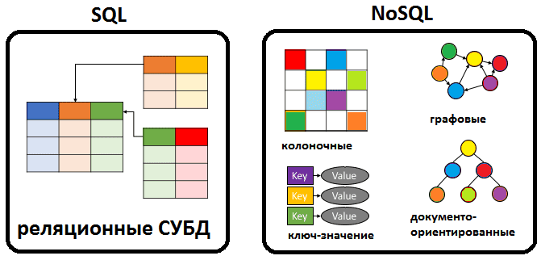
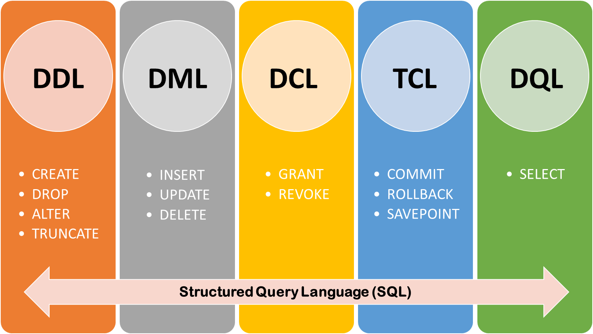
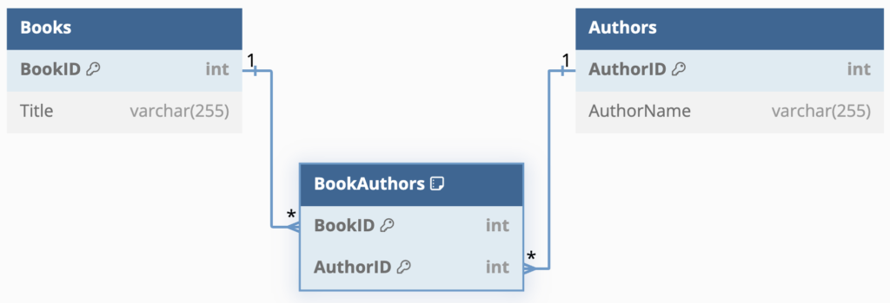

# Лекция 17. СУБД. PostgreSQL. SQL. DDL. Пользователи. DCL. DML. Связи.


## Введение в СУБД

**Системы управления базами данных (СУБД)** – это программные системы, предназначенные для создания, хранения, управления и обработки данных. Они обеспечивают доступ к информации, хранящейся в структурированном виде, и позволяют пользователям выполнять различные операции с данными.

## Почему важны СУБД?

СУБД широко применяются в самых разных сферах: бизнесе, медицине, финансах, образовании, государственных учреждениях и многих других отраслях. Они обеспечивают хранение и обработку больших объемов информации, что делает их важным элементом информационных систем.

## Типы СУБД



Существует несколько основных типов СУБД:

- **Реляционные (SQL)** – используют таблицы для организации данных и поддерживают язык SQL для их обработки. Примеры: PostgreSQL, MySQL, Oracle, MS SQL Server.
- **NoSQL** – предназначены для работы с неструктурированными и слабо структурированными данными. Примеры: MongoDB (документо-ориентированная), Redis (ключ-значение), Neo4j (графовая), Cassandra (колонно-ориентированная).
- **Объектно-ориентированные** – совмещают возможности реляционных баз данных и объектно-ориентированного программирования. Примеры: db4o, Versant.
- **Гибридные** – сочетают возможности SQL и NoSQL для повышения гибкости работы с данными. Пример: PostgreSQL с поддержкой JSONB.

## PostgreSQL


### Что такое PostgreSQL?

**PostgreSQL** – это мощная объектно-реляционная СУБД с открытым исходным кодом. Она известна своей надежностью, поддержкой стандарта SQL и широкими возможностями расширения. PostgreSQL используется во многих крупных проектах благодаря своей гибкости и высокой производительности.

**Преимущества PostgreSQL:**

- Поддержка ACID-транзакций.
- Расширяемость (возможность добавлять собственные функции, операторы и типы данных).
- Полная поддержка SQL, включая оконные функции и подзапросы.
- Возможность хранения структурированных и неструктурированных данных (JSON, JSONB).
- Гибкая система управления доступом.
- Репликация и масштабируемость.

## Что такое база данных?

**База данных (БД)** – это организованный набор данных, который управляется с помощью СУБД. В современных системах баз данных используются различные модели представления данных, однако наиболее распространённой является реляционная модель.

### Взаимодействие баз данных и пользователей в PostgreSQL

В одной СУБД можно создать бесконечно много баз данных. Это позволяет изолировать данные различных проектов и эффективно управлять ими. Кроме того, внутри одной СУБД можно создавать пользователей и назначать им различные права доступа. Это позволяет контролировать, какие действия могут выполнять разные пользователи.

#### Почему это важно?

Когда мы работаем над реальным проектом, под него создаётся отдельная база данных. Это позволяет:

- Изолировать данные проекта от других баз, которые могут находиться в той же СУБД.
- Разграничить доступ – например, один пользователь может только просматривать данные, другой – изменять, а третий – администрировать базу.
- Обеспечить безопасность, исключив возможность случайного удаления или модификации чужих данных.

## Таблицы: строки и столбцы

Что такое таблицы в базе данных?

**Таблица** – это основная структура хранения данных в реляционной базе данных. Она представляет собой двухмерную структуру, состоящую из строк и столбцов.

### Строки в таблице

Строка (или запись) в таблице представляет собой один объект, содержащий определённые данные. Например, если таблица хранит информацию о пользователях, каждая строка будет представлять одного пользователя с уникальными характеристиками.

Пример базы данных в виде таблицы `Пользователи`:

| id | имя         | email             | возраст |
| -- | -------------- | ----------------- | -------------- |
| 1  | Иван       | ivan@example.com  | 25             |
| 2  | Мария     | maria@example.com | 30             |
| 3  | Алексей | alex@example.com  | 28             |

Каждая строка содержит информацию о конкретном пользователе.

### Столбцы в таблице

**Столбец** – это характеристика (атрибут) объекта. Он определяет тип информации, которая хранится в таблице. Например, в таблице Пользователи есть столбцы `id`, `имя`, `email` и `возраст`, которые описывают разные свойства пользователя.

На cтолбцы могут накладываться ограничения. Например, какое-то поле не может быть пустым, или какое-то поле не может быть меньше определенного значения, например возраст не может быть отрицательным.

**Основные свойства столбцов:**

- Имя столбца – определяет, какую информацию он хранит (например, имя для имени пользователя, `email` для электронной почты).
- Тип данных – указывает, какие значения могут храниться в этом столбце (например, возраст – это число, а `email` – строка).
- Ограничения – правила, которые применяются к данным (например, `email` должен быть уникальным, а `id` – автоувеличивающимся).

### Как связаны строки и столбцы?

Каждая строка в таблице содержит значения во всех столбцах. Например, в таблице Пользователи, строка с `id = 1 `хранит:

- В столбце `имя` – `"Иван"`
- В столбце `email` – `"ivan@example.com"`
- В столбце `возраст` – `25`

Это даёт возможность быстро находить, изменять и удалять информацию в базе данных, ориентируясь на значения в столбцах.

## Типы данных в БД

Тип данных определяет, какие значения могут храниться в определённом столбце таблицы. В PostgreSQL используются следующие основные типы данных:

### 1. Строковые типы

- `CHAR(n)` – строка фиксированной длины (например, CHAR(10) хранит ровно 10 символов).
- `VARCHAR(n)` – строка переменной длины, ограниченная n символами.
- `TEXT` – строка произвольной длины без ограничения.

**Применение:** используется для хранения имен, адресов, описаний и других текстовых данных.

### 2. Числовые типы

- `INTEGER (INT)` – целочисленный тип, подходящий для хранения небольших чисел (например, идентификаторов).
- `BIGINT` – используется для больших чисел (например, длинных ID в системах с миллионами записей).
- `DECIMAL (NUMERIC)` – число с фиксированной точностью, часто применяется для денежных значений.
- `REAL, DOUBLE PRECISION` – числа с плавающей запятой для научных вычислений.

**Применение:** возраст, количество, финансовые показатели.

### 3. Булевый тип

- `BOOLEAN` – принимает только два значения: `TRUE` или `FALSE`.

**Применение:** статус включено/выключено, истина/ложь, да/нет.

### 4. Дата и время

- `DATE` – хранит дату (год, месяц, день).
- `TIME` – хранит время (часы, минуты, секунды).
- `TIMESTAMP` – хранит дату и время.
- `INTERVAL` – хранит разницу во времени.

**Применение**: даты создания записей, дедлайны, временные метки событий.

### 5. NULL – отсутствие значения

`NULL` – это специальное значение, обозначающее отсутствие данных. Оно не эквивалентно 0 или пустой строке.

**Пример:** если у пользователя нет номера телефона, его значение в столбце `phone` может быть `NULL`.

### 6. Собственные (кастомные) типы данных

PostgreSQL позволяет создавать собственные типы данных, например:

- `ENUM` – список допустимых значений (например, ('новый', 'в процессе', 'завершён') для статуса заказа).
- `JSON` и `JSONB` – хранение структурированных данных в формате JSON.

## Основные операции с данными (CRUD)


**CRUD** – это аббревиатура из четырёх основных операций, которые выполняются с данными в базе. Эти операции соответствуют основным действиям с записями в таблицах.

### C – Create (Создание)

Операция `Create` добавляет новые записи в таблицу. Например, если у нас есть таблица с пользователями, при создании нового пользователя в базу добавляется новая строка.

Пример: Представьте, что мы добавляем нового клиента в таблицу. До этого в базе были три клиента, и теперь появился четвёртый. В результате в таблице появляется новая строка с данными нового пользователя.

| id | имя         | email             | возраст |
| -- | -------------- | ----------------- | -------------- |
| 1  | Иван       | ivan@example.com  | 25             |
| 2  | Мария     | maria@example.com | 30             |
| 3  | Алексей | alex@example.com  | 28             |
| 4  | Ольга     | olga@example.com  | 22             |

### R – Read (Чтение)

Операция `Read` используется для получения информации из базы данных. Это может быть запрос всех данных из таблицы или выборка конкретных записей.

Пример: Если нам нужно найти всех пользователей старше 25 лет, мы получим следующий результат:

| id | имя         | email             | возраст |
| -- | -------------- | ----------------- | -------------- |
| 2  | Мария     | maria@example.com | 30             |
| 3  | Алексей | alex@example.com  | 28             |

Таким образом, мы получили только нужные нам данные, не изменяя саму базу.

### U – Update (Обновление)

Операция `Update` изменяет существующие данные в базе. Например, если у пользователя изменился email, его можно обновить.

Пример: Мария поменяла свой `email`. Вместо `maria@example.com` теперь указан новый адрес `maria_new@example.com`:

| id | имя         | email                 | возраст |
| -- | -------------- | --------------------- | -------------- |
| 1  | Иван       | ivan@example.com      | 25             |
| 2  | Мария     | maria_new@example.com | 30             |
| 3  | Алексей | alex@example.com      | 28             |
| 4  | Ольга     | olga@example.com      | 22             |

Таким образом, информация в базе обновилась, но сами строки остались на своих местах.

### D – Delete (Удаление)

Операция `Delete` удаляет существующие данные. Например, если Ольга удалила свой аккаунт, её запись исчезнет из таблицы.

Пример: После удаления пользователя Ольги таблица примет такой вид:

| id | имя         | email             | возраст |
| -- | -------------- | ----------------- | -------------- |
| 1  | Иван       | ivan@example.com  | 25             |
| 2  | Мария     | maria@example.com | 30             |
| 3  | Алексей | alex@example.com  | 28             |

Теперь в базе нет информации о пользователе Ольге.


Таким образом, **CRUD**-операции являются основными действиями, которые можно выполнять с данными в базе.

## SQL (Structured Query Language)


**SQL** (**Structured Query Language**, структурированный язык запросов) – это язык, который используется для управления данными в реляционных базах данных. Он позволяет выполнять различные операции: создавать таблицы, добавлять и изменять данные, управлять доступом и многое другое.

SQL является стандартом для большинства СУБД, включая **PostgreSQL**, **MySQL**, **Oracle**, **SQL Server** и другие.

### Языки в составе SQL



SQL состоит из нескольких подъязыков, каждый из которых отвечает за определённые действия в базе данных:

- `DDL (Data Definition Language)` – отвечает за создание, изменение и удаление таблиц и других объектов.
- `DML (Data Manipulation Language)` – используется для добавления, изменения и удаления данных.
- `DQL (Data query language)` - Отвечает за чтение данных из БД
- `DCL (Data Control Language)` – используется для управления правами доступа к базе данных.
- `TCL (Transaction Control Language)` – управляет транзакциями в базе данных, позволяя объединять несколько SQL-команд в одну операцию.

### Синтаксис SQL

В SQL принято писать системные слова (**команды**, **операторы**) заглавными буквами, а пользовательские идентификаторы (названия баз данных, таблиц, колонок) – в нижнем регистре.

> Это не обязательно, но помогает лучше читать код и понимать его структуру.

```sql
CREATE DATABASE mydb;
create database mydb;
```

Обе команды абсолютно идентичны, но первый вариант более читаемый.

### Это очень важно!!

**Обязательное использование точки с запятой (;). Каждая SQL-команда должна заканчиваться точкой с запятой (;), иначе консоль или SQL-редактор не поймёт, что команда завершена!!!**

## DDL (Data Definition Language) – Язык определения данных

DDL отвечает за создание и изменение структуры базы данных. Основные команды DDL:

- `CREATE` – Позволяет создавать таблицы, схемы, индексы, представления и другие объекты базы данных.
- `ALTER` – Позволяет добавлять, изменять или удалять столбцы в уже существующих таблицах.
- `DROP` – Используется для удаления таблиц, схем и других объектов базы.
- `TRUNCATE` – Удаляет все данные из таблицы, но оставляет её структуру. В отличие от DELETE, не позволяет восстановить удалённые данные.

### Создание пользователя (CREATE USER или CREATE ROLE)

#### С чего начинается работа с базой данных?

Обычно всё начинается с создания пользователя и базы данных.

Почему нужно создавать отдельного пользователя?

- Базовый пользователь (например, postgres) обладает абсолютно всеми правами.
- Если его пароль украдут, злоумышленник получит полный контроль над базой данных.
- Поэтому в реальных проектах создаётся как минимум один отдельный пользователь с ограниченными правами, который будет работать только с одной базой данных.

#### Создание пользователя (роль) в PostgreSQL

В PostgreSQL можно создать пользователя двумя равнозначными командами:

```sql
CREATE ROLE new_user WITH LOGIN;
CREATE USER new_user;
```

Обе команды делают одно и то же. В PostgreSQL `USER` и `GROUP` являются частями `ROLE`.

Создание пользователя с паролем и правами.Юзеры обычно создаются с паролем и определёнными правами.

Пример создания суперпользователя:

```sql
CREATE ROLE admin_user WITH LOGIN SUPERUSER PASSWORD 'securepassword';
```

**Что делает эта команда?**

- `LOGIN` – позволяет пользователю входить в psql.
- `SUPERUSER` – делает его суперпользователем с полными правами.
- `PASSWORD 'securepassword'` – задаёт пароль.

Однако такой пользователь тоже небезопасен, поэтому в большинстве случаев создаются ограниченные роли.

Пример создания обычного пользователя:

```sql
CREATE ROLE my_user WITH PASSWORD 'mypassword';
```

Этот пользователь **не является суперпользователем** и не имеет доступа к другим базам данных.

### Создание базы данных (CREATE DATABASE)

После создания пользователя необходимо создать базу данных.

```sql
CREATE DATABASE my_database;
```

Эта команда создаст пустую базу, в которой можно будет создавать таблицы.

Дополнительные настройки при создании базы:

#### 1. Задание кодировки (ENCODING)

```sql
CREATE DATABASE my_database WITH ENCODING 'UTF8';
```

**Зачем?**

Разные операционные системы могут использовать разные кодировки. Это может привести к проблемам при переносе базы данных. UTF8 – универсальная кодировка, которая поддерживает все символы.

#### 2. Назначение владельца базы (OWNER)

```sql
CREATE DATABASE my_database OWNER my_user;
```

**Что делает эта команда?**

- Устанавливает `my_user` владельцем базы.
- Даёт ему полный контроль над этой базой.
- Другие пользователи по умолчанию не имеют доступа.

#### 3. Комбинированное создание базы

Можно сразу задать кодировку и владельца:

```sql
CREATE DATABASE my_database WITH ENCODING 'UTF8' OWNER my_user;
```

## Data Control Language (DCL)

> Небольшое отступление от DDL, так как после создания пользователя в БД, ему администратором можно выдать роль.

**Data Control Language (DCL)** – это часть SQL, предназначенная для управления правами доступа к объектам базы данных. Она позволяет администраторам базы данных выдавать и отзывать разрешения у пользователей, обеспечивая безопасность и контроль над данными.

### Основные команды DCL:

- `GRANT` – предоставляет пользователю права на выполнение определённых операций.
- `REVOKE` – отзывает ранее предоставленные права.

### Что можно указать после GRANT или REVOKE?

DCL позволяет управлять 13 различными видами привилегий:

| Привилегия | Описание                                                                                     |
| -------------------- | ---------------------------------------------------------------------------------------------------- |
| **ALL**        | Выдать все права на объект.                                                    |
| **SELECT**     | Разрешить чтение данных (запрос `SELECT`).                              |
| **INSERT**     | Разрешить добавление новых данных (`INSERT`).                        |
| **UPDATE**     | Разрешить изменение существующих данных (`UPDATE`).            |
| **DELETE**     | Разрешить удаление данных (`DELETE`).                                       |
| **EXECUTE**    | Разрешить выполнение функций и процедур.                          |
| **USAGE**      | Разрешить использование схем и секвенций.                        |
| **ALTER**      | Разрешить изменение структуры базы (`ALTER TABLE`).                 |
| **INDEX**      | Разрешить создание индексов (`CREATE INDEX`).                             |
| **CREATE**     | Разрешить создание новых объектов (таблиц, схем и т. д.). |
| **DROP**       | Разрешить удаление объектов (`DROP TABLE`).                               |
| **REFERENCES** | Разрешить использование внешних ключей (`FOREIGN KEY`).         |
| **TRIGGER**    | Разрешить создание и использование триггеров.                |

Большинство из этих прав мы подробно разберём в ходе курса.

Пример выдачи всех прав (`ALL`) пользователю на таблицу `users`

```sql
GRANT ALL ON users TO my_user;
```

Теперь `my_user` может выполнять любые операции с таблицей users.

Если нужно отозвать все права:

```sql
REVOKE ALL ON users FROM my_user;
```

Теперь `my_user` потеряет доступ к `users`.

### Теперь можно вернуться к DDL

#### Подключение к базе данных

Перед началом работы с таблицами необходимо подключиться к базе данных. В PostgreSQL это можно сделать с помощью следующей команды:

```sql
\c my_database
```

Теперь все операции будут выполняться в рамках базы `my_database`.

## Теперь можно продолжить говорить про DDL

### 1. CREATE TABLE – создание таблицы

Самый простой пример – создадим таблицу для хранения информации о продуктах.

```sql
CREATE TABLE products (
    id SERIAL,
    name TEXT,
    price NUMERIC
);
```

Теперь у нас есть таблица `products` с тремя колонками:

- `id` – уникальный идентификатор, который увеличивается автоматически.
- `name` – название продукта.
- `price` – цена продукта.

**Важно!** В этой таблице пока нет ограничений – в колонку `price` можно вставить отрицательные значения, а name может быть пустым.

#### id

В большинстве таблиц которые вы увидите или создадите, так или иначе будет присутствовать какой-либо уникальный идентификатор чаще всего он будет называться id

Для таких идентификаторов придумали специальное ключевое слово `SERIAL`, которое обозначает, что в этом поле хранится, не пустое, уникальное целое число. Которое будет генерироваться автоматически. Это очень удобно.

### 2. ALTER TABLE – изменение таблицы

Ключевое слово `ALTER` используется когда нам нужно изменить структуру существующей таблицы.

Используется для:

- Добавить поля
- Изменить тип данных поля
- Добавить ограничение
- Изменить значение по умолчанию
- Переименовать поле
- Переименовать таблицу

#### Добавление нового столбца

Если нам нужно добавить новый столбец к уже существующей таблице:

```sql
ALTER TABLE products ADD COLUMN description TEXT;
```

Теперь в таблице products появится новый столбец `description`.

#### Удаление столбца

Если нам больше не нужен какой-то столбец:

```sql
ALTER TABLE products DROP COLUMN description;
```

Внимание! Все данные из `description` будут удалены навсегда.

#### Изменение типа данных столбца

Допустим, мы решили ограничить длину названия продукта:

```sql
ALTER TABLE products ALTER COLUMN name TYPE VARCHAR(100);
```

Теперь в name можно хранить до 100 символов.

#### Изменение значения по умолчанию (DEFAULT)

Допустим, мы хотим, чтобы цена по умолчанию была `9.99`:

```sql
ALTER TABLE products ALTER COLUMN price SET DEFAULT 9.99;
```

Теперь, если при добавлении нового продукта не указывать цену, она будет 9.99.

#### Удаление значения по умолчанию

Если мы хотим убрать значение по умолчанию для `price`:

```sql
ALTER TABLE products ALTER COLUMN price DROP DEFAULT;
```

Теперь при добавлении нового продукта без указания `price` значение будет `NULL`.

### 3. DROP TABLE – удаление таблицы

Если таблица больше не нужна, её можно удалить:

```sql
DROP TABLE products;
```

Все данные из таблицы будут удалены навсегда!

### 4. Добавление ограничений (NOT NULL, DEFAULT, CHECK)

Давайте улучшим нашу таблицу products и добавим ограничения, чтобы данные в ней были корректными.

```sql
CREATE TABLE products (
    id SERIAL PRIMARY KEY,
    name TEXT NOT NULL,
    price NUMERIC CHECK (price > 0) DEFAULT 1.00
);
```

**Что изменилось?**

- `PRIMARY KEY` – `id` теперь уникальный ключ таблицы. Он гарантирует, что:

  - В таблице нет повторяющихся значений в этом столбце.
  - Значение не может быть NULL.
  - Каждая строка имеет уникальный идентификатор.
- `NOT NULL` – `name` теперь обязательно к заполнению.
- `CHECK (price > 0)` – `price` не может быть отрицательной.
- `DEFAULT 1.00` – если цена не указана, она будет `1.00` по умолчанию.

### 5. TRUNCATE TABLE – очистка таблицы

Если мы хотим удалить все данные из таблицы, но оставить её структуру:

```sql
TRUNCATE TABLE products;
```

Теперь таблица `products` пуста, но её структура сохранилась.

## DML (Data Manipulation Language)

DML (Data Manipulation Language) – это часть SQL, предназначенная для работы с данными в таблицах. С помощью команд DML можно добавлять, изменять, удалять и выбирать данные.

### 1. INSERT – добавление данных в таблицу

Когда таблица создана, в ней нет каких записей (данных). Вставка (`INSERT`) данных заполнит таблицу. Записи можно добавлять как по одной, так и по несколько. Но нельзя добавить не целую запись.Значения в записях перечисляются через запятую в том порядке, в котором они находятся в таблице. Если вы не знаете этого порядка, то вы можете указать какое значение соответствует какому полю явно. Если вы указываете не все значения, то база автоматически попытается заполнить значением по умолчанию.

Допустим, у нас уже есть таблица `products`, созданная ранее:

```sql
CREATE TABLE products (
    id SERIAL PRIMARY KEY,
    name TEXT NOT NULL,
    price NUMERIC CHECK (price > 0) DEFAULT 1.00
);
```

Теперь добавим в неё данные.

#### 1.1 Добавление одной строки

```sql
INSERT INTO products (name, price) 
VALUES ('Телефон', 799.99);
```

**Что происходит?**

- В колонку `id` автоматически подставляется следующее значение.
- `name` = 'Телефон'.
- `price` = 799.99.

#### 1.2. Добавление нескольких строк одновременно

```sql
INSERT INTO products (name, price) 
VALUES 
    ('Ноутбук', 1200.50),
    ('Наушники', 59.99),
    ('Монитор', 249.99);
```

Так можно добавить сразу несколько записей, что намного быстрее, чем делать `INSERT` по одной строке.

#### 1.3. Добавление данных без указания всех колонок

Если мы не указываем цену, то будет использовано значение по умолчанию (`DEFAULT`).

```sql
INSERT INTO products (name) 
VALUES ('Клавиатура');
```

В колонку `price` автоматически запишется `1.00` (значение `DEFAULT` из структуры таблицы).

#### 1.4. Возвращение добавленной строки (RETURNING)

```sql
INSERT INTO products (name, price) 
VALUES ('Геймпад', 69.99)
RETURNING *;
```

Добавляет и сразу показывает результат.

### 2. UPDATE – изменение данных в таблице

Для того что бы обновить данные нужно знать 3 вещи.

- Какая таблица и какое поле будет обновлено
- Какое будет новое значение
- Какую именно запись мы обновляем

#### 2.1. Обновление одной строки

```sql
UPDATE products 
SET price = 699.99 
WHERE name = 'Телефон';
```

Изменит цену телефона.

#### 2.2. Обновление нескольких строк

```sql
UPDATE products 
SET price = price * 1.10 
WHERE price < 100;
```

Увеличивает цены всех товаров дешевле 100 на 10%.

#### 2.3. Обновление с RETURNING

```sql
UPDATE products 
SET price = 89.99 
WHERE name = 'Наушники'
RETURNING *;
```

Обновляет и сразу показывает результат.

### 3. DELETE – удаление данных из таблицы

#### 3.1. Удаление одной строки

```sql
DELETE FROM products WHERE name = 'Монитор';
```

Удалит "Монитор".

#### 3.2. Удаление всех товаров дешевле 50

```sql
DELETE FROM products WHERE price < 50;
```

Удаляет все строки, где цена меньше 50.

#### 3.3. Полное очищение таблицы (TRUNCATE)

```sql
TRUNCATE TABLE products;
```

Удаляет все записи, но оставляет структуру таблицы.

# Связи в базе данных


Реляционные базы данных называются так потому, что они основаны на **отношениях (relations)** между данными.
В PostgreSQL связи между таблицами реализуются с помощью **внешних ключей (`FOREIGN KEY`)**, которые обеспечивают ссылочную целостность.

---

## Ключевые термины

### **PRIMARY KEY**

`PRIMARY KEY` – это **уникальный идентификатор** записи в таблице.Каждая таблица **может иметь только один** первичный ключ, и его значения **должны быть уникальными и не `NULL`**.

> Чаще всего `PRIMARY KEY` – это `id`, но можно использовать и другие поля.

### **FOREIGN KEY**

`FOREIGN KEY` создаёт **связь между таблицами**, гарантируя, что значение в одной таблице **существует в другой**.
Это предотвращает появление "разорванных" данных.

### **REFERENCES**

Ключевое слово `REFERENCES` указывает, **на какую таблицу и столбец** ссылается `FOREIGN KEY`.

---

## Основные типы связей в реляционных базах данных

1. **Один к одному (One-to-One)***(Каждая запись в одной таблице соответствует **ровно одной** записи в другой таблице.)*
2. **Один ко многим (One-to-Many)***(Одна запись в первой таблице может иметь **несколько** связанных записей во второй.)*
3. **Многие ко многим (Many-to-Many)***(Запись в первой таблице может иметь **много связей** со второй таблицей и наоборот.)*
4. **Самоссылочные связи (Self-Referenced Relationships)**
   *(Связь внутри одной и той же таблицы.)*

---

## **1. Один к одному (One-to-One)**

- Каждый **пользователь** может иметь **только один паспорт*.
- У каждого паспорта есть только один владелец.
- Если пользователь удаляется, его паспорт тоже удаляется (`ON DELETE CASCADE`).
- Если `id` пользователя изменяется, он автоматически обновляется в passports (`ON UPDATE CASCADE`).

```sql
CREATE TABLE users (
    id SERIAL PRIMARY KEY,
    full_name VARCHAR(100) NOT NULL UNIQUE
);

CREATE TABLE passports (
    id SERIAL PRIMARY KEY,
    user_id INT UNIQUE NOT NULL,
    passport_number VARCHAR(20) NOT NULL,
    issue_date DATE NOT NULL,
    FOREIGN KEY (user_id) REFERENCES users(id) 
        ON DELETE CASCADE 
        ON UPDATE CASCADE
);
```

**Что здесь важно?**

Таблица `users` (Пользователи)

- `id SERIAL PRIMARY KEY` – уникальный идентификатор пользователя.
- `full_name VARCHAR(100) NOT NULL UNIQUE` – имя пользователя, уникальное (один пользователь → один паспорт).

Таблица passports (Паспорта)

- `id SERIAL PRIMARY KEY `– уникальный идентификатор паспорта.
- `user_id INT UNIQUE NOT NULL` – внешний ключ, ссылающийся на `users.id`.
- `UNIQUE` – гарантирует, что у одного пользователя может быть только один паспорт.
- `NOT NULL` – нельзя создать паспорт без владельца.
- `passport_number VARCHAR(20) NOT NULL` – номер паспорта.
- `issue_date DATE NOT NULL` – дата выдачи паспорта.

Внешний ключ `FOREIGN KEY (user_id) REFERENCES users(id)`

- `ON DELETE CASCADE` – если удалить пользователя, его паспорт тоже удалится.
- `ON UPDATE CASCADE` – если изменить id пользователя, он обновится во всех записях passports.

Обратите внимание, поле `user_id` содержит модификатор `UNIQUE` именно он обеспечивает нам связь `1-to-1`, без него это была бы `1-to-many` как в следующем примере.

## **2. Один ко многим (One-to-Many)**

- Один автор (authors) может написать много статей (articles).
- Каждая статья (articles) принадлежит только одному автору.
- Если автора удалить, все его статьи тоже удаляются (ON DELETE CASCADE).
- Если id автора изменяется, он автоматически обновляется в articles (ON UPDATE CASCADE).

```sql
CREATE TABLE authors (
    id SERIAL PRIMARY KEY,
    name VARCHAR(100) NOT NULL
);

CREATE TABLE articles (
    id SERIAL PRIMARY KEY,
    title TEXT NOT NULL,
    author_id INT NOT NULL,
    FOREIGN KEY (author_id) REFERENCES authors(id) ON DELETE CASCADE ON UPDATE CASCADE
);
```

**Что здесь важно?**

Таблица authors (Авторы)

- `id SERIAL PRIMARY KEY` – уникальный идентификатор автора.
- `name VARCHAR(100) NOT NULL` – имя автора, обязательное к заполнению `(NOT NULL)`.

Таблица articles (Статьи)

- `id SERIAL PRIMARY KEY` – уникальный идентификатор статьи.
- `title TEXT NOT NULL` – заголовок статьи, обязательное поле.
- `author_id INT NOT NULL` – внешний ключ, ссылающийся на `authors.id`, который указывает, кому принадлежит статья.

Внешний ключ `FOREIGN KEY (author_id) REFERENCES authors(id)`

- `ON DELETE CASCADE` – если удалить автора, все его статьи удалятся.
- `ON UPDATE CASCADE` – если изменить `id` автора, он автоматически обновится во всех записях `articles`.

### **3. Многие ко многим (Many-to-Many)**



Одна книга может быть написана несколькими авторами, и один автор может участвовать в создании нескольких книг. Такая связь реализуется через промежуточную таблицу BookAuthors.

```sql
CREATE TABLE Books (
    BookID SERIAL PRIMARY KEY,
    Title VARCHAR(255) NOT NULL
);

CREATE TABLE Authors (
    AuthorID SERIAL PRIMARY KEY,
    AuthorName VARCHAR(255) NOT NULL
);

CREATE TABLE BookAuthors (
    BookID INT NOT NULL,
    AuthorID INT NOT NULL,
    PRIMARY KEY (BookID, AuthorID),
    FOREIGN KEY (BookID) REFERENCES Books(BookID) ON DELETE CASCADE,
    FOREIGN KEY (AuthorID) REFERENCES Authors(AuthorID) ON DELETE CASCADE
);
```

**Что здесь важно?**

- `PRIMARY KEY` (`BookID`, `AuthorID`) — задаёт составной первичный ключ, чтобы одна и та же пара книга-автор не могла быть записана дважды.
- `ON DELETE CASCADE` — если удалить книгу, все записи об авторах этой книги в `BookAuthors` удалятся автоматически (и наоборот).
- Таблица `BookAuthors` — это связующая таблица, реализующая связь "многие ко многим".

### Самоссылочные связи (Self-Referenced Relationships)

Самоссылочные связи используются, когда строки в таблице могут ссылаться на другие строки в той же таблице. Это полезно
для создания иерархических структур, таких как отношения "начальник-подчиненный".

> Технически это такой же `FOREIGN KEY` просто в качестве 2 таблиц используется одна и та же

Пример:

```sql
CREATE TABLE employee
(
    id         SERIAL PRIMARY KEY,
    name       VARCHAR(100) NOT NULL,
    manager_id INT,
    FOREIGN KEY (manager_id) REFERENCES employee (id)
);
```

В данном примере `manager_id` ссылается на `id` в той же таблице, создавая иерархию сотрудников.

Обратите внимание тут `manager_id` может быть `NULL` потому что иначе мы не сможем создать `директора`, того у кого
начальника нет.

### Важность соблюдения ссылочной целостности

Ссылочная целостность обеспечивает корректность и непротиворечивость данных. В `PostgreSQL` для этого используются
ограничения внешних ключей (`FOREIGN KEY`), которые позволяют следить за тем, чтобы ссылки между таблицами оставались
корректными.

Пример нарушения ссылочной целостности:

```sql
-- Попытка вставки записи в таблицу orders с несуществующим user_id
INSERT INTO order (order_date, user_id)
VALUES ('2024-07-30', 999);
```

> Этот запрос вызовет ошибку, так как user_id = 999 отсутствует в таблице users.

### ON DELETE

Когда мы создаем внешний ключ, мы можем указать различные параметры для `ON DELETE`, чтобы определить поведение системы
при удалении записей в родительской таблице. Рассмотрим основные из них.

#### CASCADE

Параметр `ON DELETE CASCADE` означает, что при удалении записи в родительской таблице, автоматически будут удалены все
связанные записи в дочерней таблице.

**Пример:**

```sql
CREATE TABLE orders
(
    id         SERIAL PRIMARY KEY,
    student_id INT,
    order_date DATE,
    FOREIGN KEY (student_id) REFERENCES students (id) ON DELETE CASCADE
);
```

**Работа:**

```sql
-- Удаляем студента с id = 1
DELETE
FROM students
WHERE id = 1;
-- Автоматически удаляются все заказы, связанные с этим студентом
```

#### SET NULL

Параметр `ON DELETE SET NULL` устанавливает значение внешнего ключа в `NULL` при удалении записи в родительской таблице.
Это полезно, если нужно сохранить связанные записи, но удалить связь с родительской записью.

**Пример:**

```sql
CREATE TABLE orders
(
    id         SERIAL PRIMARY KEY,
    student_id INT,
    order_date DATE,
    FOREIGN KEY (student_id) REFERENCES students (id) ON DELETE SET NULL
);
```

**Работа:**

```sql
-- Удаляем студента с id = 1
DELETE
FROM students
WHERE id = 1;
-- Поле student_id в таблице orders для всех связанных записей становится NULL
```

#### SET DEFAULT

Параметр `ON DELETE SET DEFAULT` устанавливает значение внешнего ключа в значение по умолчанию при удалении записи в
родительской таблице. Это значение должно быть указано при создании таблицы.

**Пример:**

```sql
CREATE TABLE orders
(
    id         SERIAL PRIMARY KEY,
    student_id INT DEFAULT 0,
    order_date DATE,
    FOREIGN KEY (student_id) REFERENCES students (id) ON DELETE SET DEFAULT
);
```

**Работа:**

```sql
-- Удаляем студента с id = 1
DELETE
FROM students
WHERE id = 1;
-- Поле student_id в таблице orders для всех связанных записей устанавливается в 0
```

#### RESTRICT

Параметр `ON DELETE RESTRICT` предотвращает удаление записи в родительской таблице, если существуют связанные записи в
дочерней таблице. Это полезно для предотвращения удаления данных, которые еще используются.

**Пример:**

```sql
CREATE TABLE orders
(
    id         SERIAL PRIMARY KEY,
    student_id INT,
    order_date DATE,
    FOREIGN KEY (student_id) REFERENCES students (id) ON DELETE RESTRICT
);
```

**Работа:**

```sql
-- Попытка удаления студента с id = 1, если есть связанные заказы
DELETE
FROM students
WHERE id = 1;
-- Возвращает ошибку и предотвращает удаление
```

#### NO ACTION

Параметр `ON DELETE NO ACTION` является значением по умолчанию и ведет себя аналогично `RESTRICT`. Он также
предотвращает удаление записи в родительской таблице, если существуют связанные записи в дочерней таблице. Однако
проверка ограничения выполняется после попытки удаления, что позволяет выполнение других операций до проверки
ограничения.

**Пример:**

```sql
CREATE TABLE orders
(
    id         SERIAL PRIMARY KEY,
    student_id INT,
    order_date DATE,
    FOREIGN KEY (student_id) REFERENCES students (id) ON DELETE NO ACTION
);
```

**Работа:**

```sql
-- Попытка удаления студента с id = 1, если есть связанные заказы
DELETE
FROM students
WHERE id = 1;
-- Возвращает ошибку и предотвращает удаление
```
