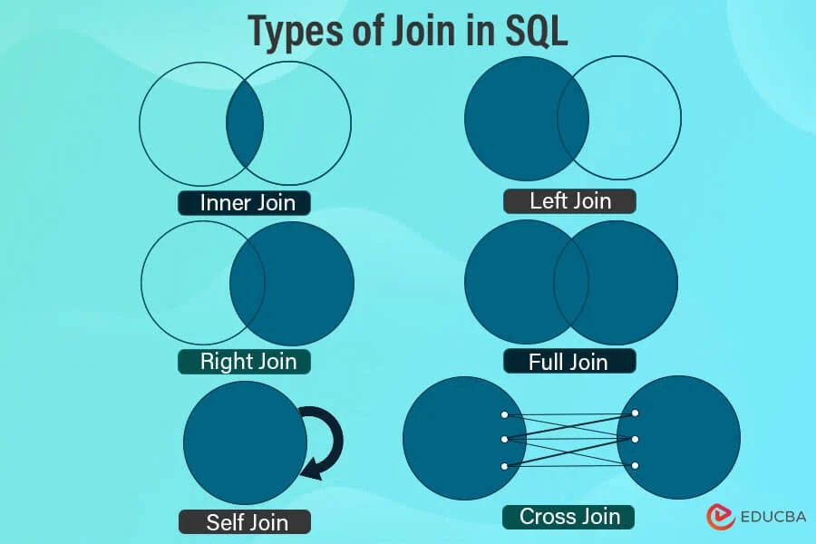

# Лекция 18. СУБД. DQL. SELECT. Индексы. Group by. Joins.

## DQL (Data query language) (Язык запроса данных)

**DQL (Data Query Language)** – это язык запросов, который используется для получения данных из реляционной базы данных.
Основная команда DQL – это `SELECT`.

**DQL НЕ изменяет данные! В отличие от `INSERT`, `UPDATE` или `DELETE`, он только читает информацию.**

## SELECT

Давайте сделаем простой запрос в БД в табличку `products` которую мы создали на прошлой лекции.

```sql
SELECT * FROM products;
```

Этот запрос вернёт все строки из таблицы `products`. Использовать `SELECT *` можно, но если в таблице много данных, это неэффективно!
Лучше выводить только часть столбцов.

```sql
SELECT name, price FROM products;
```

Теперь мы выведем только столбцы `name` и  `price`

Так же `SQL` не плохо справляется с вычислениями))

```sql
SELECT 13 + 56;
```

Поэтому во время запроса мы можем получать не только значения, но и вычисления.

```sql
SELECT name, price / 2 FROM products;
```

### Фильтрация данных с WHERE

В реальных проектах, доставать все данные из таблицы нужно только в редких случаях.Поэтому чтобы выбрать не все записи, а только нужные, используется `WHERE`.

```sql
SELECT id, name, price FROM products WHERE id = 2;

SELECT id, name, price FROM products WHERE price < 1000;

SELECT id, name, price FROM products WHERE name = 'Телефон';
```

В Первом запросе выведется только один продукт с `id = 2` (так как `id` уникальный для каждого продукта). Во втором запросе выведутся только те продукты у которых цена меньше `1000` (price < 1000). А в третьем получим все продукты с именем `Телефон` (name = 'Телефон')

### Логические операторы AND, OR, NOT

Иногда нужно фильтровать данные по нескольким условиям. Для этого можно использовать, нам уже знакомые логические операторы `AND`, `OR`, `NOT`.

#### Оператор AND (Логическое И)

В запросе оба условия должны быть верны, чтобы вывелся резульятат.

```sql
SELECT id, name, price FROM products WHERE price > 1200 AND name = 'Телефон';
```

Теперь выведутся только те товары, которых цена больше `1200` и у которых название `Телефон`.

#### Оператор OR (Логическое ИЛИ)

Хотя бы одно условие должно быть верным.

```sql
SELECT id, name, price FROM products WHERE price < 1200 OR name = 'Наушники';
```

Выведет все Наушники ИЛИ любые товары дешевле 1200.

#### Оператор NOT (Логическое НЕ) - исключить записи

```sql
SELECT id, name, price FROM products WHERE NOT name = 'Телефон';
```

Выберет все товары, кроме Телефонов.

### Оператор LIKE – Поиск по шаблону

Иногда нужно искать частичное совпадение, например, найти все товары, чьи названия начинаются на `"Н"`.

```sql
SELECT * FROM products WHERE name LIKE 'Н%';
```

**Н% означает: имя начинается с "Н", дальше любые символы.**

Примеры шаблонов `LIKE`

| Шаблон | Описание                                                          |
| ------------ | ------------------------------------------------------------------------- |
| 'Н%'        | Наименоование начинается с "Н"                   |
| '%Н'        | Наименоование заканчивается на "Н"           |
| '%Н%'       | Наименоование содержит "Н" в любом месте |
| 'Н_Н'      | Наименоование из трёх букв, вторая "Н"      |

### ORDER BY – Сортировка данных

Чтобы отсортировать результат, используется `ORDER BY`.

#### Сортировка по возрастанию (ASC)

```sql
SELECT * FROM products ORDER BY price ASC;
```

После данного наши товары отсортируются от самого дешевого до самого дорогого.

#### Сортировка по убыванию (DESC)

```sql
SELECT * FROM products ORDER BY price DESC;
```

Товары отсортируются от самого дорого к дешевому.

### Сортировка по нескольким колонкам

```sql
SELECT * FROM products ORDER BY name DESC, price ASC;
```

Тут будет отсортировано сначала по Названию ,потом по цене (от самого дешевого до дорогого)

### LIMIT – Ограничение количества строк

Если нужно вывести только первые `N` записей, используется `LIMIT`.

```sql
SELECT * FROM products LIMIT 5;
```

Вывод 5 первых товаров.

Если нужно вернуть какойто промежуток данных, то можно использовать `OFFSET`.

```sql
SELECT * FROM products LIMIT 5 OFFSET 5;
```

Вернет значения с 5-ого по 10-е. `OFFSET` - сдвиг по данным.

**Все также можно комбинировать запрос**

```sql
SELECT * FROM products ORDER BY price ASC LIMIT 3;
```

Теперь мы выведем 3 самых дешевых товара))

### DISTINCT – Удаление дубликатов

Если нужно вывести только уникальные значения, используется `DISTINCT`.

```sql
SELECT DISTINCT name FROM products;
```

Этот запрос уберёт дубликаты и вернёт только уникальные названия товаров.

## Индексация в Базах Данных (Indexes)

**Индексы в базе данных** – это специальные структуры, которые ускоряют поиск данных в таблицах. Они работают похожим образом на содержание книги: вместо того, чтобы перебирать всю таблицу, база использует индекс, чтобы быстро найти нужные строки.

### Зачем нужны индексы?

- Когда таблица маленькая (до 1000 строк) – поиск работает быстро.
- Когда таблица большая (миллионы строк) – обычный поиск становится медленным.
- Индексы помогают быстро находить данные, уменьшая количество сканируемых строк.

### Типы индексов

В `PostgreSQL` есть разные виды индексов. Самые важные:

| Тип индекса                      | Описание                                                                                                          |
| ------------------------------------------ | ------------------------------------------------------------------------------------------------------------------------- |
| **B-Tree (по умолчанию)** | Самый распространённый индекс для поиска, сравнения и сортировки. |
| **Hash**                             | Оптимален для поиска по `=` (равно).                                                           |
| **GIN (Generalized Inverted Index)** | Используется для поиска по массивам, JSON и полнотекстовому поиску.  |
| **GiST (Generalized Search Tree)**   | Подходит для географических данных и поиска по диапазонам.              |
| **BRIN (Block Range Index)**         | Хорош для больших таблиц, в которых данные отсортированы.                 |

### Создание индексов

**Пример без индекса**

```sql
SELECT * FROM products WHERE name = 'Телефон';
```

Если в таблице миллион строк, поиск будет медленным, так как база данных будет проверять каждую строку.

**Пример с индексом**

```sql
CREATE INDEX idx_product_name ON products(name);
```

Теперь поиск будет намного быстрее, так как `PostgreSQL` будет использовать индекс вместо полного перебора строк.

#### Создание индекса для нескольких колонок

```sql
CREATE INDEX idx_product_name_price ON products(name, price);
```

Этот индекс будет ускорять запросы, которые используют сразу `name` и `price`.

#### Создание уникального индекса

```sql
CREATE UNIQUE INDEX idx_unique_product_name ON products(name);
```

 Этот индекс гарантирует, что в таблице `products` не будет товаров с одинаковыми названиями.

Эквивалентно `UNIQUE` при создании таблицы

```sql
CREATE TABLE products (
    id SERIAL PRIMARY KEY,
    name TEXT UNIQUE,
    price NUMERIC,
    description TEXT
);
```

 В этом случае `PostgreSQL` автоматически создаст уникальный индекс на `name`.

**Проверка работы индекса**

Попробуем добавить дубликаты

```sql
INSERT INTO products (name, price, description) 
VALUES ('Телефон', 1400, 'Айфон');
```

Запрос выполнится успешно.

```sql
INSERT INTO products (name, price, description) 
VALUES ('Телефон', 1200, 'Самсунг');
```

Ошибка! Нарушено уникальное ограничение: `name` уже есть в базе.

**Индексы и сортировка**

```sql
SELECT *
FROM products
ORDER BY name;
```

Индекс на `name` также ускорит выполнение этого запроса.

### Управление индексами

Просмотр существующих индексов.Чтобы увидеть все индексы в таблице, можно использовать следующую команду:

```sql
\d table_name
```

**Удаление индекса**

Если индекс больше не нужен, его можно удалить:

```sql
DROP INDEX idx_unique_product_name;
```

### Проблемы связанные с индексами

А если все так хорошо и быстро, почему бы нам не создать индексы вообще на все поля и все будет работать быстрее?

И да и нет.

Если бы у нас были только операции чтения, то это было бы идеальное решение. Но у нас есть и другие операции.

Представте книгу у которой есть оглавление (по сути та же индексация). Пока мы можем только читать книгу, проблем нет,
добавили несколько страниц в начале, чем упростили жизнь.

Но теперь представте, что вы в эту книгу начинаете дописывать/удалять/изменять страницы или целые главы.

Для каждой такой операции, оглавление придется переписывать заново.

> Если в таблицу часто производится запись/изменение/удаление, то индекс только замедлил работу базы! А он еще и место
> занимает! Поэтому всегда нужно очень аккуратно относиться к индексам, это очень хороший инструмент, который легко
> может
> все сломать

## Встроенные функции в PostgreSQL

**Встроенные функции** – это готовые функции в `PostgreSQL`, которые позволяют изменять, анализировать и агрегировать данные прямо в SQL-запросах. С их помощью можно работать со строками, числами, датами, массивами, JSON и многим другим.

### Логические операторы и операторы сравнения

Таблица истинности для SQL, учитывающая `NULL`, отличается от обычной таблицы истинности, так как `NULL` в SQL
представляет неопределенное значение. В операциях сравнения и логических операциях `NULL` ведет себя особым образом.

Вот таблица истинности для SQL с учетом `NULL`:

### Логические операторы (AND, OR, NOT)

| A     | B     | A AND B | A OR B | NOT A |
| ----- | ----- | ------- | ------ | ----- |
| TRUE  | TRUE  | TRUE    | TRUE   | FALSE |
| TRUE  | FALSE | FALSE   | TRUE   | FALSE |
| TRUE  | NULL  | NULL    | TRUE   | FALSE |
| FALSE | TRUE  | FALSE   | TRUE   | TRUE  |
| FALSE | FALSE | FALSE   | FALSE  | TRUE  |
| FALSE | NULL  | FALSE   | NULL   | TRUE  |
| NULL  | TRUE  | NULL    | TRUE   | NULL  |
| NULL  | FALSE | FALSE   | NULL   | NULL  |
| NULL  | NULL  | NULL    | NULL   | NULL  |

### Операторы сравнения (=, <>, <, >, <=, >=)

| A     | B     | A = B | A <> B | A < B | A > B | A <= B | A >= B |
| ----- | ----- | ----- | ------ | ----- | ----- | ------ | ------ |
| TRUE  | TRUE  | TRUE  | FALSE  | FALSE | FALSE | TRUE   | TRUE   |
| TRUE  | FALSE | FALSE | TRUE   | FALSE | TRUE  | FALSE  | TRUE   |
| TRUE  | NULL  | NULL  | NULL   | NULL  | NULL  | NULL   | NULL   |
| FALSE | TRUE  | FALSE | TRUE   | TRUE  | FALSE | TRUE   | FALSE  |
| FALSE | FALSE | TRUE  | FALSE  | FALSE | FALSE | TRUE   | TRUE   |
| FALSE | NULL  | NULL  | NULL   | NULL  | NULL  | NULL   | NULL   |
| NULL  | TRUE  | NULL  | NULL   | NULL  | NULL  | NULL   | NULL   |
| NULL  | FALSE | NULL  | NULL   | NULL  | NULL  | NULL   | NULL   |
| NULL  | NULL  | NULL  | NULL   | NULL  | NULL  | NULL   | NULL   |

### Примечания:

1. **Логические операторы:**

   - `A AND B` вернет `TRUE`, только если оба значения `TRUE`.
   - `A OR B` вернет `TRUE`, если хотя бы одно значение `TRUE`.
   - `NOT A` вернет противоположное значение, если `A` не `NULL`.
2. **Операторы сравнения:**

   - Любое сравнение с `NULL` всегда возвращает `NULL` (неопределенное).

Эти правила делают работу с `NULL` в SQL специфической, и при работе с данными нужно учитывать, что `NULL` не
эквивалентен ни `TRUE`, ни `FALSE`, а представляет собой третье состояние, которое требует особого внимания при
логических и сравнительных операциях.

### Виды встроенных функций

| Категория функций                           | Описание                                                                                                |
| ----------------------------------------------------------- | --------------------------------------------------------------------------------------------------------------- |
| **Агрегатные функции**               | Выполняют расчёты по группе строк (`SUM`, `AVG`, `COUNT`, `MAX`, `MIN`). |
| **Функции работы со строками** | Обрабатывают текст (`UPPER`, `LOWER`, `LENGTH`, `SUBSTRING`).                          |
| **Функции работы с числами**     | Математические вычисления (`ROUND`, `ABS`, `CEIL`, `FLOOR`).                    |
| **Функции работы с датами**       | Работа с датами и временем (`NOW`, `CURRENT_DATE`, `AGE`, `EXTRACT`).             |
| **Функции для массивов**            | Операции с массивами (`ARRAY_LENGTH`, `ARRAY_APPEND`).                                    |
| **Функции для JSON**                        | Обработка JSON-данных (`JSONB_EXTRACT_PATH_TEXT`).                                             |

#### Агрегатные функции

Агрегатные функции используются с `GROUP BY`, чтобы делать расчёты по нескольким строкам.

| Функция    | Описание                                          |
| ----------------- | --------------------------------------------------------- |
| **SUM()**   | Считает сумму значений.               |
| **AVG()**   | Вычисляет среднее значение.       |
| **COUNT()** | Подсчитывает количество строк. |
| **MAX()**   | Находит максимальное значение. |
| **MIN()**   | Находит минимальное значение.   |

**Общая сумма всех товаров**

```sql
SELECT SUM(price) FROM products;
```

**Средняя цена товаров**

```sql
SELECT AVG(price) FROM products;
```

**Сколько товаров в таблице**

```sql
SELECT COUNT(*) FROM products;
```

**Самый дорогой товар**

```sql
SELECT MAX(price) FROM products;
```

**Самый дешёвый товар**

```sql
SELECT MIN(price) FROM products;
```

### Функции работы со строками (TEXT)

| Функция                           | Описание                                                                     |
| ---------------------------------------- | ------------------------------------------------------------------------------------ |
| **UPPER(text)**                    | Преобразует строку в**верхний регистр**.       |
| **LOWER(text)**                    | Преобразует строку в**нижний регистр**.         |
| **LENGTH(text)**                   | Возвращает**количество символов** в строке. |
| **SUBSTRING(text, start, length)** | Извлекает**часть строки**.                                 |
| **CONCAT(str1, str2, ...)**        | Объединяет строки.                                                   |

**Преобразуем названия товаров в верхний регистр**

```sql
SELECT UPPER(name) FROM products;
```

**Считаем длину названия каждого товара**

```sql
SELECT name, LENGTH(name) FROM products;
```

**Берём первые 5 символов из названия**

```sql
SELECT name, SUBSTRING(name FROM 1 FOR 5) FROM products;
```

**Объединяем название и описание товара**

```sql
SELECT CONCAT(name, ' - ', description) FROM products;
```

### Функции работы с числами

| Функция             | Описание                                                                 |
| -------------------------- | -------------------------------------------------------------------------------- |
| **ROUND(number, n)** | Округляет число до `n` знаков после запятой. |
| **CEIL(number)**     | Округляет**вверх** (до ближайшего целого). |
| **FLOOR(number)**    | Округляет**вниз** (до ближайшего целого).   |
| **ABS(number)**      | Возвращает**модуль числа**.                           |
| **RANDOM()**         | Генерирует случайное число от `0` до `1`.        |

**Округляем цену до 2 знаков после запятой**

```sql
SELECT name, ROUND(price, 2) FROM products;
```

**Округляем цену в большую сторону**

```sql
SELECT name, CEIL(price) FROM products;
```

**Округляем цену в меньшую сторону**

```sql
SELECT name, FLOOR(price) FROM products;
```

**Генерируем случайное число от 0 до 1**

```sql
SELECT RANDOM();
```

### Функции работы с датами и временем

| Функция                     | Описание                                                   |
| ---------------------------------- | ------------------------------------------------------------------ |
| **NOW()**                    | Текущая дата и время.                             |
| **CURRENT_DATE**             | Текущая дата (без времени).                   |
| **AGE(date1, date2)**        | Разница между датами.                            |
| **EXTRACT(field FROM date)** | Извлекает год, месяц, день, час и т. д. |

**Получить текущую дату и время**

```sql
SELECT NOW();
```

**Получить только текущую дату**

```sql
SELECT CURRENT_DATE;
```

**Узнать возраст товара, если есть дата его добавления**

```sql
SELECT name, AGE(NOW(), created_at) FROM products;
```

**Извлекаем год из даты создания**

```sql
SELECT name, EXTRACT(YEAR FROM created_at) FROM products;
```

### Функции для работы с массивами

| Функция                         | Описание                                         |
| -------------------------------------- | -------------------------------------------------------- |
| **ARRAY_LENGTH(array, dim)**     | Длина массива.                               |
| **ARRAY_APPEND(array, element)** | Добавляет элемент в массив.       |
| **ARRAY_REMOVE(array, element)** | Удаляет элемент из массива.       |
| **UNNEST(array)**                | Разворачивает массив в строки. |

**Создаём массив и узнаём его длину**

```sql
SELECT ARRAY_LENGTH(ARRAY['Apple', 'Samsung', 'Xiaomi'], 1);
```

**Добавляем элемент в массив**

```sql
SELECT ARRAY_APPEND(ARRAY['Apple', 'Samsung'], 'Huawei');
```

### Функции работы с JSON (JSONB)

| Функция                                 | Описание                                            |
| ---------------------------------------------- | ----------------------------------------------------------- |
| **JSONB_EXTRACT_PATH_TEXT(json, 'key')** | Извлекает значение по ключу.        |
| **JSONB_OBJECT_KEYS(json)**              | Показывает все ключи JSON-объекта. |

**Допустим, у нас есть колонка data с JSON**

```sql
SELECT JSONB_EXTRACT_PATH_TEXT('{"name": "iPhone", "price": 1000}', 'price');
```

**Получить список ключей JSON-объекта**

```sql
SELECT JSONB_OBJECT_KEYS('{"name": "iPhone", "price": 1000}');
```

## GROUP BY и HAVING в SQL

**GROUP BY** — это мощная команда `SQL`, которая позволяет группировать строки в таблице по одному или нескольким столбцам. Это особенно полезно, когда нужно агрегировать данные, например, суммировать, подсчитывать или находить средние значения. `GROUP BY` часто используется вместе с агрегатными функциями, такими как `COUNT`, `SUM`, `AVG`, `MAX` и `MIN`. Группировка данных позволяет более эффективно анализировать большие объемы информации, выявлять тенденции и аномалии, а также создавать сводные отчеты.

**Синтаксис GROUP BY**

```sql
SELECT column_name, AGGREGATE_FUNCTION(column_name)
FROM table_name
GROUP BY column_name;
```

### Агрегатные функции в SQL

**Агрегатные функции** – это специальные SQL-функции, которые позволяют выполнять расчёты над группами строк.

| Функция    | Описание                                                          |
| ----------------- | ------------------------------------------------------------------------- |
| **COUNT()** | Подсчитывает количество строк в группе. |
| **SUM()**   | Считает сумму значений в группе.               |
| **AVG()**   | Вычисляет среднее значение.                       |
| **MAX()**   | Находит максимальное значение.                 |
| **MIN()**   | Находит минимальное значение.                   |

Давайте разберем примеры использования агрегатных функций на таблице `products`.

| id | name             | price   | description    | rating |
| -- | ---------------- | ------- | -------------- | ------ |
| 1  | Телефон   | 1200.00 | Самсунг | 2      |
| 2  | Телефон   | 1400.00 | Айфон     | 5      |
| 3  | Наушники | 200.00  | Ксяоми   | 5      |
| 4  | Ноутбук   | 1000.00 | Леново   | 4      |
| 5  | Наушники | 150.00  | JBL            | 4      |

#### COUNT() – Подсчёт количества товаров каждого типа

```sql
SELECT name, COUNT(*) AS count_products 
FROM products 
GROUP BY name;
```

Группирует товары по `name` и считает количество строк в каждой группе.

| name             | count_products |
| ---------------- | -------------- |
| Телефон   | 2              |
| Наушники | 2              |
| Ноутбук   | 1              |

#### SUM() – Общая стоимость товаров каждого типа

```sql
SELECT name, SUM(price) AS total_price
FROM products
GROUP BY name;
```

Группирует товары по `name` и суммирует `price`.

| name             | total_price |
| ---------------- | ----------- |
| Телефон   | 2600.00     |
| Наушники | 350.00      |
| Ноутбук   | 1000.00     |

#### AVG() – Средняя цена каждого типа товаров

```sql
SELECT name, AVG(price) AS avg_price
FROM products
GROUP BY name;
```

Группирует товары по name и считает `AVG(price)`.

| name             | avg_price |
| ---------------- | --------- |
| Телефон   | 1300.00   |
| Наушники | 175.00    |
| Ноутбук   | 1000.00   |

#### MAX() – Самый дорогой товар каждого типа

```sql
SELECT name, MAX(price) AS max_price
FROM products
GROUP BY name;
```

 Находит максимальную цену `(MAX(price))` для каждого типа товара.

| name             | max_price |
| ---------------- | --------- |
| Телефон   | 1400.00   |
| Наушники | 200.00    |
| Ноутбук   | 1000.00   |

#### MIN() – Самый дешёвый товар каждого типа

```sql
SELECT name, MIN(price) AS min_price
FROM products
GROUP BY name;
```

Находит минимальную цену `(MIN(price))` для каждого типа товара.

| name             | min_price |
| ---------------- | --------- |
| Телефон   | 1200.00   |
| Наушники | 150.00    |
| Ноутбук   | 1000.00   |

### HAVING – Фильтрация после GROUP BY

HAVING используется для фильтрации групп после применения агрегатных функций. Например, если мы хотим отобрать только те категории, в которых больше 10 товаров.

#### Чем отличается HAVING от WHERE?

| `WHERE`                                                                  | `HAVING`                                                               |
| -------------------------------------------------------------------------- | ------------------------------------------------------------------------ |
| Фильтрует строки**до** `GROUP BY`.                | Фильтрует группы**после** `GROUP BY`.        |
| Нельзя использовать агрегатные функции. | Можно использовать агрегатные функции. |

**Оставить только группы, где больше 1 товара**

```sql
SELECT name, COUNT(*) AS count_products
FROM products
GROUP BY name
HAVING COUNT(*) > 1;
```

Оставляет только группы, в которых товаров больше 1.

**Оставить товары, у которых средняя цена выше 500**

```sql
SELECT name, AVG(price) AS avg_price
FROM products
GROUP BY name
HAVING AVG(price) > 500;
```

Оставляет только товары, у которых `AVG(price) > 500.`

## Вложенные запросы (Subqueries)

**Вложенный запрос (или Subquery)** – это SQL-запрос, который выполняется внутри другого запроса. Вложенные запросы используются, когда нам нужно сначала получить одни данные, а затем использовать их в другом запросе.

### Вложенные запросы в WHERE

Допустим, нам нужно выбрать все товары, у которых цена выше средней.

```sql
SELECT * 
FROM products 
WHERE price > (SELECT AVG(price) FROM products);
```

**Как это работает?**

Вложенный запрос `SELECT AVG(price) FROM products` считает среднюю цену. Основной запрос выбирает только те товары, у которых price > средняя цена.

### Вложенные запросы в SELECT

Допустим, мы хотим вывести название товара и его место в рейтинге по цене.

```sql
SELECT name, price, 
       (SELECT COUNT(*) FROM products p2 WHERE p2.price > p1.price) + 1 AS rank
FROM products p1
ORDER BY rank;
```

**Как это работает?**

Вложенный запрос считает, сколько товаров дороже текущего **(p1.price).** К этому числу добавляется 1, чтобы получить ранг товара по цене.

| name             | price   | rank |
| ---------------- | ------- | ---- |
| Наушники | 150.00  | 5    |
| Наушники | 200.00  | 4    |
| Ноутбук   | 1000.00 | 3    |
| Телефон   | 1200.00 | 2    |
| Телефон   | 1400.00 | 1    |

Теперь у нас товары сортированы по цене.

### Вложенные запросы в FROM (Derived Tables)

Если мы хотим использовать результат одного запроса как временную таблицу, мы можем использовать вложенный запрос в `FROM`. Допустим, мы хотим выбрать все товары, чья цена выше средней, но сразу добавить среднюю цену в вывод.

```sql
SELECT p.*, avg_price 
FROM products p, 
     (SELECT AVG(price) AS avg_price FROM products) AS subquery
WHERE p.price > subquery.avg_price;
```

**Как это работает?**

Вложенный запрос (`subquery`) считает `AVG(price)` и создаёт временную таблицу `subquery`. Основной запрос обращается к этой таблице и фильтрует товары, где `p.price` > `avg_price`.

| id | name           | price   | description    | rating | avg_price |
| -- | -------------- | ------- | -------------- | ------ | --------- |
| 1  | Телефон | 1200.00 | Самсунг | 2      | 990.00    |
| 2  | Телефон | 1400.00 | Айфон     | 5      | 990.00    |

У товаров добавился столбец с средней ценой, по которому мы фильтруем.

### Оператор WITH

Для упрощения понимания некоторых запросов, мы можем применить оператор `WITH`. Который по сути будет являться переменной. В которую мы поместим какой-то запрос.

**Пример: Найти товары, дороже средней цены (но с WITH)**

```sql
WITH avg_price_cte AS (
    SELECT AVG(price) AS avg_price FROM products
)
SELECT * 
FROM products p, avg_price_cte 
WHERE p.price > avg_price_cte.avg_price;
```

**Что делает `WITH avg_price_cte`?**

`WITH` создаёт временную таблицу `avg_price_cte`, которая хранит `AVG(price)`. Основной запрос использует её в FROM, чтобы выбрать товары дороже средней цены. Результат – такой же, как в предыдущем примере.

## Объединение результатов: UNION, INTERSECT, EXCEPT

Иногда нужно объединить результаты разных SQL-запросов. Для этого используются:

| Оператор | Описание                                                                                                     |
| ---------------- | -------------------------------------------------------------------------------------------------------------------- |
| UNION            | Объединяет уникальные строки из двух запросов.                               |
| UNION ALL        | Объединяет все строки, включая дубликаты.                                         |
| INTERSECT        | Возвращает только совпадающие строки из двух запросов.                |
| EXCEPT           | Возвращает разницу (что есть в первом запросе, но нет во втором). |

### UNION

Давайте объединеним товары и аксессуары. Допустим, у нас есть две таблицы:

```sql
CREATE TABLE products (
    id SERIAL PRIMARY KEY,
    name TEXT NOT NULL,
    price NUMERIC
);

CREATE TABLE accessories (
    id SERIAL PRIMARY KEY,
    name TEXT NOT NULL,
    price NUMERIC
);
```

Мы хотим объединить товары и аксессуары в один список.

```sql
SELECT name, price FROM products
UNION
SELECT name, price FROM accessories;
```

`UNION` удаляет дубликаты.

Если хотим оставить дубликаты, используем `UNION ALL`:

```sql
SELECT name, price FROM products
UNION ALL
SELECT name, price FROM accessories;
```

### INTERSECT

Найдем товары и аксессуары с одинаковыми названиями

```sql
SELECT name FROM products
INTERSECT
SELECT name FROM accessories;
```

Покажет только те товары, которые есть и в `products`, и в `accessories`.

### EXCEPT

Выведем товары, которых нет в аксессуарах

```sql
SELECT name FROM products
EXCEPT
SELECT name FROM accessories;
```

Покажет товары из `products`, которых нет в `accessories`.

## Оператор JOIN в SQL

/

### Что такое JOIN и зачем он нужен?

В реальных базах данных данные часто распределены по разным таблицам. Чтобы получить полную картину, нам нужно объединять таблицы и получать данные из нескольких источников одновременно.

Простыми словами:

- Оператор JOIN позволяет связать несколько таблиц по определённому условию.
- Мы можем соединять таблицы по общему признаку (например, `id` пользователя в таблице `users` и `user_id` в таблице `orders`).

**Зачем это нужно?**

- Избегаем дублирования данных (например, не храним имя пользователя в каждой его покупке).
- Оптимизируем хранение (разделяем данные на логические блоки).
- Работаем с более сложными структурами.

Существует несколько типов JOIN:

- INNER JOIN
- LEFT JOIN (или LEFT OUTER JOIN)
- RIGHT JOIN (или RIGHT OUTER JOIN)
- FULL JOIN (или FULL OUTER JOIN)
- CROSS JOIN
- SELF JOIN



Создадим две таблицы для примеров. Для всех примеров будем использовать таблицы `users` и `orders`, которые представляют пользователей и их заказы.

```sql
CREATE TABLE users (
    id SERIAL PRIMARY KEY,
    name VARCHAR(100) NOT NULL,
    email VARCHAR(100) UNIQUE NOT NULL
);

CREATE TABLE orders (
    id SERIAL PRIMARY KEY,
    user_id INT,
    product VARCHAR(100) NOT NULL,
    amount NUMERIC(10,2) NOT NULL,
    FOREIGN KEY (user_id) REFERENCES users(id) ON DELETE CASCADE
);
```

**Что здесь важно?**

- `users.id` – уникальный идентификатор пользователя (ключ PRIMARY KEY).
- `orders.user_id `– внешний ключ, который связывает заказ с пользователем (FOREIGN KEY REFERENCES users(id)).
- `ON DELETE CASCADE` – если пользователь удалится, его заказы тоже удалятся.

Наполним таблицы данными:

```sql
INSERT INTO users (name, email) VALUES
    ('Иван', 'ivan@example.com'),
    ('Мария', 'maria@example.com'),
    ('Алексей', 'alex@example.com'),
    ('Ольга', 'olga@example.com');

INSERT INTO orders (user_id, product, amount) VALUES
    (1, 'Телефон', 1200),
    (2, 'Ноутбук', 2500),
    (2, 'Мышь', 500),
    (3, 'Клавиатура', 1000),
    (5, 'Монитор', 3000); 
```

**Здесь `user_id = 5,` но такого пользователя нет в `users`!**

Проверяем содержимое таблиц

```sql
SELECT * FROM users;
```

| id | name           | email             |
| -- | -------------- | ----------------- |
| 1  | Иван       | ivan@example.com  |
| 2  | Мария     | maria@example.com |
| 3  | Алексей | alex@example.com  |
| 4  | Ольга     | olga@example.com  |

```sql
SELECT * FROM orders;
```

| id | user_id | product              | amount |
| -- | ------- | -------------------- | ------ |
| 1  | 1       | Телефон       | 1200   |
| 2  | 2       | Ноутбук       | 2500   |
| 3  | 2       | Мышь             | 500    |
| 4  | 3       | Клавиатура | 1000   |
| 5  | 5       | Монитор       | 3000   |

**Важные моменты**

- У Ольги `(id = 4)` нет заказов – посмотрим, как она поведёт себя в `LEFT JOIN`.
- У `user_id = 5` есть заказ (Монитор), но такого пользователя нет в таблице `users` – посмотрим, что с ним будет в `RIGHT JOIN`.
- Теперь у нас есть готовая база, и можно выполнять JOIN-запросы!

### INNER JOIN

Этот JOIN вернёт только те строки, у которых есть совпадения в обеих таблицах. Если у пользователя нет заказов, он не попадёт в результат.

**SQL-запрос (INNER JOIN):**

```sql
SELECT users.name, users.email, orders.product, orders.amount
FROM users
INNER JOIN orders ON users.id = orders.user_id;
```

Как это работает?

- SQL ищет совпадения между `users.id` и `orders.user_id`.
- Если в `orders` есть запись, но такого `user_id` нет в `users` – эта строка игнорируется.
- Если у пользователя нет заказов – он тоже не попадает в результат.

| name           | email             | product              | amount |
| -------------- | ----------------- | -------------------- | ------ |
| Иван       | ivan@example.com  | Телефон       | 1200   |
| Мария     | maria@example.com | Ноутбук       | 2500   |
| Мария     | maria@example.com | Мышь             | 500    |
| Алексей | alex@example.com  | Клавиатура | 1000   |

**Что мы видим?**

- `Ольга (id = 4)` не попала в результат, потому что у неё нет заказов.
- Заказ Монитор `(user_id = 5)` тоже не попал, потому что такого пользователя нет в users.

### LEFT JOIN

`LEFT JOIN` возвращает все строки из левой таблицы и совпадающие строки из правой таблицы. Если совпадений нет, то возвращаются `NULL` для столбцов правой таблицы.

**SQL-запрос (LEFT JOIN):**

```sql
SELECT users.name, users.email, orders.product, orders.amount
FROM users
LEFT JOIN orders ON users.id = orders.user_id;
```

**Результат (LEFT JOIN):**

| name           | email             | product              | amount |
| -------------- | ----------------- | -------------------- | ------ |
| Иван       | ivan@example.com  | Телефон       | 1200   |
| Мария     | maria@example.com | Ноутбук       | 2500   |
| Мария     | maria@example.com | Мышь             | 500    |
| Алексей | alex@example.com  | Клавиатура | 1000   |
| Ольга     | olga@example.com  | NULL                 | NULL   |

**Что изменилось?**

- Ольга `(id = 4)` теперь есть в результатах, но у неё нет заказов, поэтому `product = NULL`.
- Заказ Монитор `(user_id = 5)` по-прежнему не попал в результат, потому что в users нет такого пользователя.

### RIGHT JOIN

`RIGHT JOIN` возвращает все строки из правой таблицы и совпадающие строки из левой таблицы. Если совпадений нет, то возвращаются `NULL` для столбцов левой таблицы.

**SQL-запрос (RIGHT JOIN):**

```sql
SELECT users.name, users.email, orders.product, orders.amount
FROM users
RIGHT JOIN orders ON users.id = orders.user_id;
```

**Результат (RIGHT JOIN):**

| name           | email             | product              | amount |
| -------------- | ----------------- | -------------------- | ------ |
| Иван       | ivan@example.com  | Телефон       | 1200   |
| Мария     | maria@example.com | Ноутбук       | 2500   |
| Мария     | maria@example.com | Мышь             | 500    |
| Алексей | alex@example.com  | Клавиатура | 1000   |
| NULL           | NULL              | Монитор       | 3000   |

**Что изменилось?**

- Появился заказ на Монитор `(user_id = 5)`, но у него нет соответствующего пользователя → `NULL`.
- Ольга `(id = 4)` не попала в результат, так как у неё нет заказов.

### FULL JOIN

`FULL JOIN` возвращает все строки, когда есть совпадения в левой или правой таблицах. Если совпадений нет, то возвращаются `NULL` для отсутствующих совпадений с обеих сторон.

**SQL-запрос (FULL JOIN):**

```sql
SELECT users.name, users.email, orders.product, orders.amount
FROM users
FULL JOIN orders ON users.id = orders.user_id;
```

**Результат (FULL JOIN):**

| name           | email             | product              | amount |
| -------------- | ----------------- | -------------------- | ------ |
| Иван       | ivan@example.com  | Телефон       | 1200   |
| Мария     | maria@example.com | Ноутбук       | 2500   |
| Мария     | maria@example.com | Мышь             | 500    |
| Алексей | alex@example.com  | Клавиатура | 1000   |
| Ольга     | olga@example.com  | NULL                 | NULL   |
| NULL           | NULL              | Монитор       | 3000   |

Теперь у нас есть ВСЕ пользователи и ВСЕ заказы, даже если совпадений нет!

### CROSS JOIN

Этот `JOIN` создаёт "Декартово произведение", то есть каждую строку первой таблицы сочетает с каждой строкой второй таблицы.

Используется в редких случаях, например:

- Генерация тестовых данных
- Комбинации всех возможных параметров

**SQL-запрос (CROSS JOIN):**

```sql
SELECT users.name, orders.product
FROM users
CROSS JOIN orders;
```

**Как это работает?**

- Берём всех пользователей из users
- Берём все заказы из `orders`
- Создаём все возможные комбинации пользователей и заказов

| name           | product              |
| -------------- | -------------------- |
| Иван       | Телефон       |
| Иван       | Ноутбук       |
| Иван       | Мышь             |
| Иван       | Клавиатура |
| Иван       | Монитор       |
| Мария     | Телефон       |
| Мария     | Ноутбук       |
| Мария     | Мышь             |
| Мария     | Клавиатура |
| Мария     | Монитор       |
| Алексей | Телефон       |
| Алексей | Ноутбук       |
| Алексей | Мышь             |
| Алексей | Клавиатура |
| Алексей | Монитор       |
| Ольга     | Телефон       |
| Ольга     | Ноутбук       |
| Ольга     | Мышь             |
| Ольга     | Клавиатура |
| Ольга     | Монитор       |

**Что произошло?**

- Каждому пользователю соответствуют все возможные заказы.
- У нас 4 пользователя × 5 заказов = 20 строк.

Использование `CROSS JOIN` может привести к огромному количеству строк, если таблицы большие!

### SELF JOIN

Этот JOIN позволяет сравнивать строки одной таблицы между собой. Часто используется для иерархических структур (например, сотрудники и их начальники).

**Создадим новую таблицу employees (Сотрудники)**

```sql
CREATE TABLE employees (
    id SERIAL PRIMARY KEY,
    name VARCHAR(100) NOT NULL,
    manager_id INT
);
```

**Добавим сотрудников:**

```sql
INSERT INTO employees (name, manager_id) VALUES
    ('Анна', NULL),   -- Анна - директор (без начальника)
    ('Иван', 1),      -- Иван подчиняется Анне
    ('Мария', 1),     -- Мария подчиняется Анне
    ('Алексей', 2),   -- Алексей подчиняется Ивану
    ('Ольга', 3);     -- Ольга подчиняется Марии
```

**Таблица employees (Сотрудники)**

| id | name           | manager_id |
| -- | -------------- | ---------- |
| 1  | Анна       | NULL       |
| 2  | Иван       | 1          |
| 3  | Мария     | 1          |
| 4  | Алексей | 2          |
| 5  | Ольга     | 3          |

**SQL-запрос (SELF JOIN):**

```sql
SELECT e1.name AS employee, e2.name AS manager
FROM employees e1
LEFT JOIN employees e2 ON e1.manager_id = e2.id;
```

**Как это работает?**

- e1 – сотрудник
- e2 – его начальник
- SQL ищет начальника для каждого сотрудника (manager_id = e2.id)

**Результат (SELF JOIN)**

| employee       | manager    |
| -------------- | ---------- |
| Анна       | NULL       |
| Иван       | Анна   |
| Мария     | Анна   |
| Алексей | Иван   |
| Ольга     | Мария |

**Что произошло?**

- Анна – директор, поэтому у неё нет начальника (NULL).
- Иван и Мария подчиняются Анне.
- Алексей подчиняется Ивану.
- Ольга подчиняется Марии.

Теперь у нас есть иерархия сотрудников!
