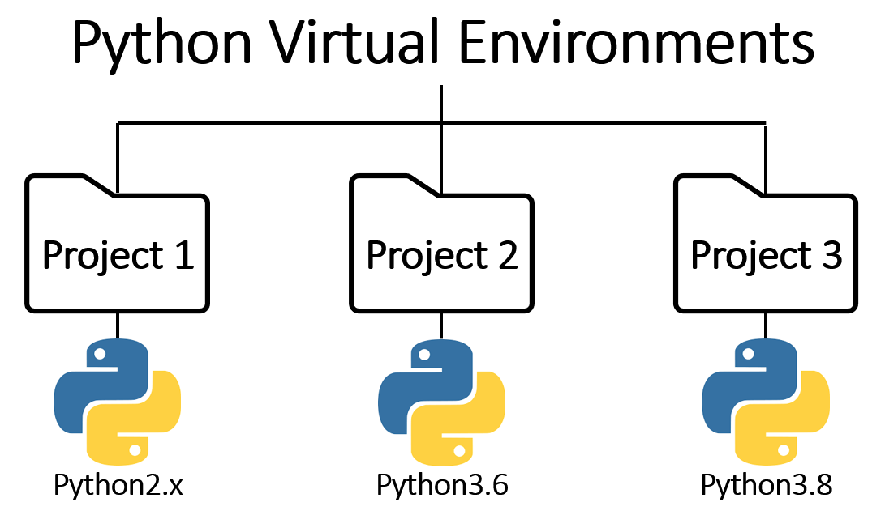
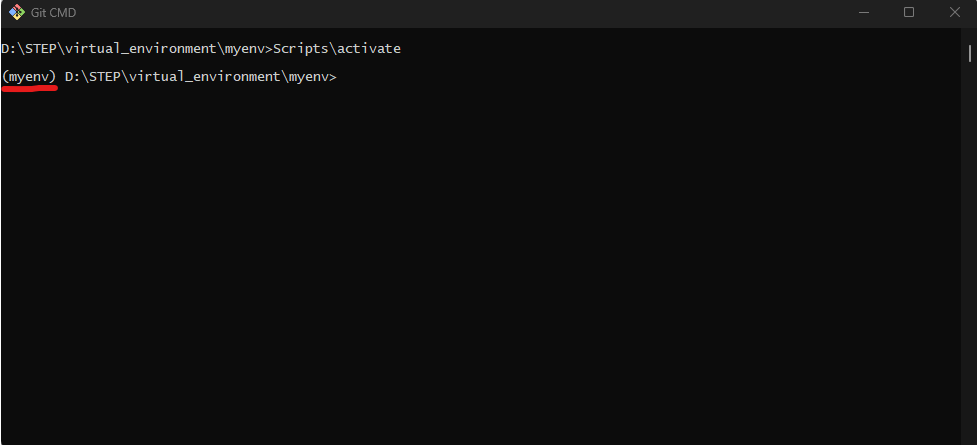
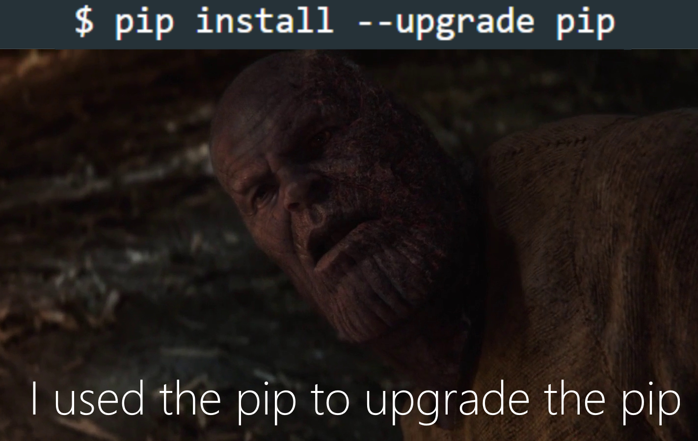

# Лекция 20. Virtual env. Pip. Устанавливаемые модули. Pyenv.


## Virtualenv и venv – Изоляция окружения в Python

**Виртуальное окружение (virtual environment)** – это изолированная копия Python, в которой можно устанавливать свои библиотеки, не затрагивая систему. 

Когда мы пишем программы на Python, нам часто приходится использовать внешние библиотеки (например, `Django`, `Flask`, `requests`). Но что если два разных проекта требуют разные версии одной и той же библиотеки? 

Допустим, у нас есть два проекта:

- Проект 1 – это веб-приложение, написанное на `Django 3.2`.
- Проект 2 – новый сайт, который требует `Django 4.1`.

Если мы установим `Django 4.1` глобально, то `Проект 1` перестанет работать, потому что его код не поддерживает новую версию `Django`. Такую проблему называют **"конфликт версий библиотек"**.

### Как решить проблему?

Решение – использовать виртуальные окружения!

Виртуальное окружение – это специальная папка, в которой хранятся:

- 1️ Своя версия Python
- 2️ Свои установленные библиотеки
- 3️ Свои зависимости (requirements.txt)

Каждый проект получает своё изолированное окружение, где можно устанавливать свои версии библиотек, и это никак не влияет на другие проекты или на глобальную систему Python.

### Как это выглядит на практике?

Представим, что у нас есть два проекта:

**Мой проект 1 (Django 3.2)**

```plaintext
/my_project_1
  ├── venv/  ← Виртуальное окружение для проекта 1
  ├── app.py
  ├── requirements.txt
```
**Мой проект 2 (Django 4.1)**

```plaintext
/my_project_2
  ├── venv/  ← Виртуальное окружение для проекта 2
  ├── main.py
  ├── requirements.txt
```

В каждом проекте в папке `venv/ `хранится отдельный Python и свои библиотеки. Теперь мы можем запустить Проект 1 с `Django 3.2` и Проект 2 с `Django 4.1` без конфликтов.

Результат:

`Django 3.2` в `my_project_1` и `Django 4.1` в `my_project_2` работают одновременно!



### Venv

**venv** – встроенное средство создания окружения. Начиная с `Python 3.3` в стандартную библиотеку добавлен модуль `venv`. Это рекомендованный способ создания виртуального окружения.

**Как создать виртуальное окружение в venv?**

Перейдём в папку проекта или создамим одну папку на компьютере под все виртуальные окружения например: `virtual environments`. Тут все зависит от того как вам удобнее, оба варианта правильные! После находясь в нужной папке нам нужно выполнить команду: 

```bash
python -m venv myenv
```

#### Что происходит?

Создаётся папка `myenv/`, в которой хранятся:

- Собственная копия интерпретатора Python.
- Отдельная директория для установленных пакетов.
- Файлы конфигурации окружения.

**Что находится внутри myenv/?**

Если мы заглянем внутрь `myenv/`, то увидим следующую структуру:

```plaintext
myenv/
│── bin/ (Scripts/ в Windows)
│── include/                   
│── lib/                       
│── pyvenv.cfg                 
```

- **bin/Scripts:** Содержит скрипты для активации/деактивации окружения и сам интерпретатор Python.
- **lib/Lib:** Содержит установленные пакеты и зависимости.
- **include:** Содержит файлы заголовков C, если они требуются для пакетов.
- **pyvenv.cfg:** Конфигурационный файл, содержащий информацию о виртуальном окружении.

### Как активировать окружение?

При активации виртуального окружения происходит изменение переменных окружения:

- **Изменение PATH:** Путь к исполняемым файлам виртуального окружения добавляется в начало переменной `PATH`. Это обеспечивает приоритет использования интерпретатора и скриптов из виртуального окружения.
- **Установка переменных окружения:** Устанавливаются специфические переменные окружения, такие как `VIRTUAL_ENV`, указывающая на путь к активному виртуальному окружению.

**Windows (cmd, PowerShell):**

```bash
myenv\Scripts\activate
```

**Mac/Linux (bash, zsh, fish):**

```bash
source myenv/bin/activate
```
После активации в терминале появится `(myenv)` – это значит, что теперь все пакеты будут устанавливаться только внутри myenv.



### Как деактивировать окружение?

Чтобы выйти из виртуального окружения и вернуться в глобальный Python:

```bash
deactivate
```

Теперь любые установленные пакеты не будут влиять на текущую систему.

## Управление пакетами с pip – Установка и обновление библиотек в Python

После того как мы научились создавать и активировать виртуальные окружения, нам нужно разобраться, как устанавливать библиотеки и управлять зависимостями.

Python использует менеджер пакетов `pip (Python Package Installer)`, который позволяет:

- Устанавливать библиотеки из `PyPI` (Python Package Index)
- Обновлять и удалять пакеты
- Управлять версиями библиотек
- Создавать список зависимостей (`requirements.txt`)



### Что такое pip и зачем он нужен?

**pip** – это стандартный инструмент для управления пакетами Python. Он позволяет легко загружать и устанавливать сторонние библиотеки, которые не входят в стандартную библиотеку Python.

**Пример проблемы без pip**

Представьте, что вам нужна библиотека `requests`, которая помогает делать `HTTP-запросы`. Если бы не было `pip`, вам пришлось бы:

- Найти исходный код библиотеки в интернете.
- Скачать его вручную.
- Убедиться, что все зависимости тоже загружены.
- Подключить библиотеку к проекту.

С `pip` всё гораздо проще:

```bash
pip install requests
```

И всё! `requests` скачан, установлен и готов к использованию. 

### Как проверить, установлен ли pip?

Обычно pip устанавливается вместе с Python, но можно проверить его наличие:

```bash
pip --version
```

Пример вывода:

```sh
pip 22.0.4 from /usr/local/lib/python3.10/site-packages/pip (python 3.10)
```

Если `pip` не установлен, его можно установить вручную:

```bash
python -m ensurepip --default-pip
```

### Как устанавливать пакеты с pip?

Чтобы установить библиотеку, достаточно выполнить команду:

```bash
pip install имя_библиотеки
```

**Примеры установки популярных библиотек**

```bash
pip install requests      # Установка requests для работы с HTTP
pip install numpy         # Установка numpy для работы с числами
pip install pandas        # Установка pandas для анализа данных
pip install django        # Установка Django для веб-разработки
```

После установки `pip` автоматически добавляет библиотеку в виртуальное окружение.

### Как установить конкретную версию библиотеки?

Если вам нужна определённая версия пакета, можно указать её при установке:

```bash
pip install django==3.2  # Устанавливаем Django версии 3.2
pip install numpy>=1.21  # Устанавливаем NumPy версии 1.21 или новее
pip install requests<=2.27  # Устанавливаем requests не выше 2.27
```

### Как обновить библиотеку?

Чтобы обновить библиотеку до последней версии, используйте команду:

```bash
pip install --upgrade имя_библиотеки
```

**Пример:**

```bash
pip install --upgrade requests
```

Регулярное обновление библиотек помогает исправлять ошибки и повышать безопасность.

### Как удалить библиотеку?

Если пакет больше не нужен, его можно удалить:

```bash
pip uninstall имя_библиотеки
```

**Пример:**

```bash
pip uninstall numpy
```

### Как посмотреть установленные пакеты?

Чтобы узнать, какие библиотеки установлены в вашем виртуальном окружении, выполните команду:

```bash
pip list
```

**Пример вывода:**

```sh
numpy  1.23.1
pandas  1.5.3
requests  2.28.1
django  4.0.3
```

Также можно посмотреть более детальную информацию о конкретном пакете:

```bash
pip show имя_библиотеки
```

**Пример:**

```bash
pip show requests
```

**Вывод:**

```sh
Name: requests
Version: 2.28.1
Summary: Python HTTP for Humans.
Author: Kenneth Reitz
License: Apache 2.0
```

### Как заморозить список зависимостей?

Когда мы работаем над проектом, важно сохранить список всех установленных библиотек, чтобы в будущем можно было легко их восстановить. Для этого используется файл `requirements.txt`.

#### Создание списка зависимостей

Чтобы сохранить список всех пакетов в `requirements.txt`, выполните:

```bash
pip freeze > requirements.txt
```

После этого в `requirements.txt` появится список всех установленных библиотек с их версиями:

```ini
Django==4.1.2
requests==2.28.1
numpy==1.23.1
pandas==1.5.3
```

#### Установка зависимостей из requirements.txt

Если другой разработчик хочет развернуть ваш проект, он может установить все пакеты из requirements.txt:

```bash
pip install -r requirements.txt
```

Теперь у него будет точно такое же окружение, как у вас!

#### Как очистить неиспользуемые пакеты?

Если в проекте остались ненужные библиотеки, их можно удалить с помощью:

```bash
pip-autoremove requests -y
```

Этот инструмент удаляет пакет и все его зависимости, которые больше нигде не используются.
