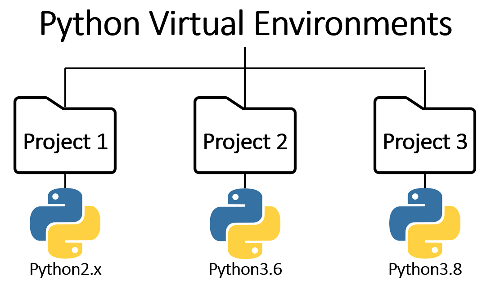
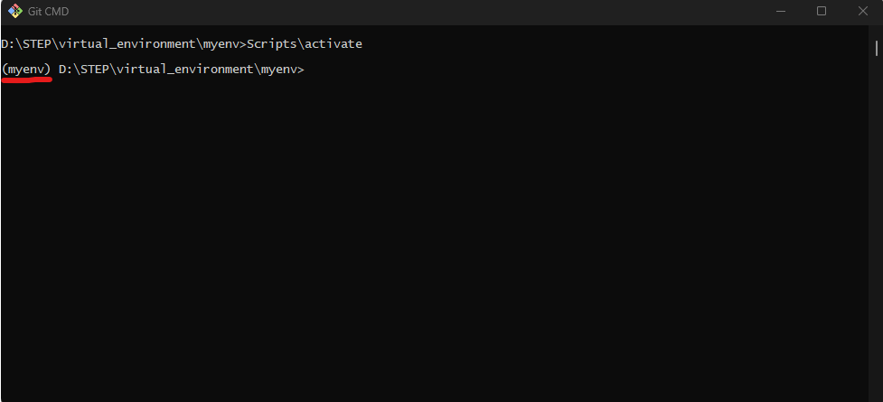

# Лекция 20: Virtual env. Pip. Устанавливаемые модули. Pyenv.


## Virtualenv и venv – Изоляция окружения в Python

**Виртуальное окружение (virtual environment)** – это изолированная копия Python, в которой можно устанавливать свои библиотеки, не затрагивая систему. 

Когда мы пишем программы на Python, нам часто приходится использовать внешние библиотеки (например, `Django`, `Flask`, `requests`). Но что если два разных проекта требуют разные версии одной и той же библиотеки? 

Допустим, у нас есть два проекта:

- Проект 1 – это веб-приложение, написанное на `Django 3.2`.
- Проект 2 – новый сайт, который требует `Django 4.1`.

Если мы установим `Django 4.1` глобально, то `Проект 1` перестанет работать, потому что его код не поддерживает новую версию `Django`. Такую проблему называют **"конфликт версий библиотек"**.

### Как решить проблему?

Решение – использовать виртуальные окружения!

Виртуальное окружение – это специальная папка, в которой хранятся:

- Своя версия Python
- Свои установленные библиотеки
- Свои зависимости (requirements.txt)

Каждый проект получает своё изолированное окружение, где можно устанавливать свои версии библиотек, и это никак не влияет на другие проекты или на глобальную систему Python.

### Как это выглядит на практике?

Представим, что у нас есть два проекта:

**Мой проект 1 (Django 3.2)**

```plaintext
/my_project_1
  ├── venv/  ← Виртуальное окружение для проекта 1
  ├── app.py
  ├── requirements.txt
```
**Мой проект 2 (Django 4.1)**

```plaintext
/my_project_2
  ├── venv/  ← Виртуальное окружение для проекта 2
  ├── main.py
  ├── requirements.txt
```

В каждом проекте в папке `venv/ `хранится отдельный Python и свои библиотеки. Теперь мы можем запустить Проект 1 с `Django 3.2` и Проект 2 с `Django 4.1` без конфликтов.

Результат:

`Django 3.2` в `my_project_1` и `Django 4.1` в `my_project_2` работают одновременно!



### Venv

**venv** – встроенное средство создания окружения. Начиная с `Python 3.3` в стандартную библиотеку добавлен модуль `venv`. Это рекомендованный способ создания виртуального окружения.

**Как создать виртуальное окружение в venv?**

Перейдём в папку проекта или создамим одну папку на компьютере под все виртуальные окружения например: `virtual environments`. Тут все зависит от того как вам удобнее, оба варианта правильные! После находясь в нужной папке нам нужно выполнить команду: 

```bash
python -m venv myenv
```

#### Что происходит?

Создаётся папка `myenv/`, в которой хранятся:

- Собственная копия интерпретатора Python.
- Отдельная директория для установленных пакетов.
- Файлы конфигурации окружения.

**Что находится внутри myenv/?**

Если мы заглянем внутрь `myenv/`, то увидим следующую структуру:

```plaintext
myenv/
│── bin/ (Scripts/ в Windows)
│── include/                   
│── lib/                       
│── pyvenv.cfg                 
```

- **bin/Scripts:** Содержит скрипты для активации/деактивации окружения и сам интерпретатор Python.
- **lib/Lib:** Содержит установленные пакеты и зависимости.
- **include:** Содержит файлы заголовков C, если они требуются для пакетов.
- **pyvenv.cfg:** Конфигурационный файл, содержащий информацию о виртуальном окружении.

### Как активировать окружение?

При активации виртуального окружения происходит изменение переменных окружения:

- **Изменение PATH:** Путь к исполняемым файлам виртуального окружения добавляется в начало переменной `PATH`. Это обеспечивает приоритет использования интерпретатора и скриптов из виртуального окружения.
- **Установка переменных окружения:** Устанавливаются специфические переменные окружения, такие как `VIRTUAL_ENV`, указывающая на путь к активному виртуальному окружению.

**Windows (cmd, PowerShell):**

```bash
myenv\Scripts\activate
```

Если вы используете Git Bash в Windows или VsCode, то используйте:

```bash
source myenv/Scripts/activate
```

**Mac/Linux (bash, zsh, fish):**

```bash
source myenv/bin/activate
```
После активации в терминале появится `(myenv)` – это значит, что теперь все пакеты будут устанавливаться только внутри myenv.



### Как деактивировать окружение?

Чтобы выйти из виртуального окружения и вернуться в глобальный Python:

```bash
deactivate
```

Теперь любые установленные пакеты не будут влиять на текущую систему.

## Управление пакетами с pip – Установка и обновление библиотек в Python

После того как мы научились создавать и активировать виртуальные окружения, нам нужно разобраться, как устанавливать библиотеки и управлять зависимостями.

Python использует менеджер пакетов `pip (Python Package Installer)`, который позволяет:

- Устанавливать библиотеки из `PyPI` (Python Package Index)
- Обновлять и удалять пакеты
- Управлять версиями библиотек
- Создавать список зависимостей (`requirements.txt`)


### Что такое pip и зачем он нужен?

**pip** – это стандартный инструмент для управления пакетами Python. Он позволяет легко загружать и устанавливать сторонние библиотеки, которые не входят в стандартную библиотеку Python.

**Пример проблемы без pip**

Представьте, что вам нужна библиотека `requests`, которая помогает делать `HTTP-запросы`. Если бы не было `pip`, вам пришлось бы:

- Найти исходный код библиотеки в интернете.
- Скачать его вручную.
- Убедиться, что все зависимости тоже загружены.
- Подключить библиотеку к проекту.

С `pip` всё гораздо проще:

```bash
pip install requests
```

И всё! `requests` скачан, установлен и готов к использованию. 

### Как проверить, установлен ли pip?

Обычно pip устанавливается вместе с Python, но можно проверить его наличие:

```bash
pip --version
```

Пример вывода:

```sh
pip 22.0.4 from /usr/local/lib/python3.10/site-packages/pip (python 3.10)
```

Если `pip` не установлен, его можно установить вручную:

```bash
python -m ensurepip --default-pip
```

### Как устанавливать пакеты с pip?

Чтобы установить библиотеку, достаточно выполнить команду:

```bash
pip install имя_библиотеки
```

**Примеры установки популярных библиотек**

```bash
pip install requests      # Установка requests для работы с HTTP
pip install numpy         # Установка numpy для работы с числами
pip install pandas        # Установка pandas для анализа данных
pip install django        # Установка Django для веб-разработки
```

После установки `pip` автоматически добавляет библиотеку в виртуальное окружение.

### Как установить конкретную версию библиотеки?

Если вам нужна определённая версия пакета, можно указать её при установке:

```bash
pip install django==3.2  # Устанавливаем Django версии 3.2
pip install numpy>=1.21  # Устанавливаем NumPy версии 1.21 или новее
pip install requests<=2.27  # Устанавливаем requests не выше 2.27
```

### Как обновить библиотеку?

Чтобы обновить библиотеку до последней версии, используйте команду:

```bash
pip install --upgrade имя_библиотеки
```

**Пример:**

```bash
pip install --upgrade requests
```

Регулярное обновление библиотек помогает исправлять ошибки и повышать безопасность.

### Как удалить библиотеку?

Если пакет больше не нужен, его можно удалить:

```bash
pip uninstall имя_библиотеки
```

**Пример:**

```bash
pip uninstall numpy
```

### Как посмотреть установленные пакеты?

Чтобы узнать, какие библиотеки установлены в вашем виртуальном окружении, выполните команду:

```bash
pip list
```

**Пример вывода:**

```sh
numpy  1.23.1
pandas  1.5.3
requests  2.28.1
django  4.0.3
```

Также можно посмотреть более детальную информацию о конкретном пакете:

```bash
pip show имя_библиотеки
```

**Пример:**

```bash
pip show requests
```

**Вывод:**

```sh
Name: requests
Version: 2.28.1
Summary: Python HTTP for Humans.
Author: Kenneth Reitz
License: Apache 2.0
```

### Как заморозить список зависимостей?

Когда мы работаем над проектом, важно сохранить список всех установленных библиотек, чтобы в будущем можно было легко их восстановить. Для этого используется файл `requirements.txt`.

#### Создание списка зависимостей

Чтобы сохранить список всех пакетов в `requirements.txt`, выполните:

```bash
pip freeze > requirements.txt
```

После этого в `requirements.txt` появится список всех установленных библиотек с их версиями:

```ini
Django==4.1.2
requests==2.28.1
numpy==1.23.1
pandas==1.5.3
```

#### Установка зависимостей из requirements.txt

Если другой разработчик хочет развернуть ваш проект, он может установить все пакеты из requirements.txt:

```bash
pip install -r requirements.txt
```

Теперь у него будет точно такое же окружение, как у вас!

#### Как очистить неиспользуемые пакеты?

Если в проекте остались ненужные библиотеки, их можно удалить с помощью:

```bash
pip-autoremove requests -y
```

Этот инструмент удаляет пакет и все его зависимости, которые больше нигде не используются.

#### Где хранятся установленные библиотеки?

Все библиотеки, установленные в виртуальное окружение, хранятся в папке:

```bash
myenv/lib/site-packages/   
(на Windows: myenv/Lib/site-packages/)
```
В этой папке находятся:

- .py файлы библиотек
- Подпапки с ресурсами
- Модули зависимостей

## Устанавливаемые модули в Python

Теперь, когда мы умеем создавать виртуальное окружение и управлять библиотеками через `pip`, пора разобраться, где вообще брать модули, как их искать, какие модули бывают, и как понять, какие нужны в проекте.

### Что такое устанавливаемый модуль?

Устанавливаемый модуль (или пакет) — это сторонняя библиотека, которая не входит в стандартную поставку Python, и её нужно устанавливать вручную с помощью pip.

Такие модули:

- Хранятся в репозитории PyPI (Python Package Index)

- Устанавливаются в ваше виртуальное окружение

- Решают конкретные задачи — от работы с HTTP до машинного обучения

### Где искать сторонние модули?

Python имеет огромный официальный репозиторий библиотек – [PyPI](https://pypi.org) 

На этом сайте вы можете:

- Искать библиотеки по ключевым словам
- Смотреть инструкции по установке
- Изучать примеры использования
- Смотреть последние версии и их изменения

### Примеры популярных сторонних библиотек

| Библиотека       | Назначение                             |
|------------------|----------------------------------------|
| `requests`         | Отправка HTTP-запросов (API, парсинг) |
| `Flask`            | Минималистичный веб-фреймворк          |
| `Django`           | Полноценный веб-фреймворк              |
| `pandas`           | Работа с таблицами и CSV               |
| `numpy`            | Числовые и матричные вычисления        |
| `matplotlib`       | Построение графиков                    |
| `SQLAlchemy`       | Работа с базами данных                 |
| `pytest`           | Тестирование кода                      |
| `beautifulsoup4`   | Парсинг HTML                           |


### requests

**requests** — это сторонняя библиотека, которая позволяет отправлять `HTTP-запросы` (`GET`, `POST`, `PUT`, `DELETE` и др.) и получать ответы от веб-серверов. Без этой библиотеки работать с интернетом было бы крайне неудобно — приходилось бы использовать встроенные модули `urllib`, которые гораздо сложнее в использовании. 

> requests делает работу с сетью простой и читаемой, как будто ты пишешь обычный Python-код.

#### Установка

Установить библиотеку можно с помощью pip:

```bash
pip install requests
```

**Основные возможности requests**

| Метод  | Назначение                     |
|--------|--------------------------------|
| `GET`    | Получить данные с сервера      |
| `POST`   | Отправить данные на сервер     |
| `PUT`    | Обновить данные                |
| `DELETE` | Удалить данные                 |
| `HEAD`   | Получить только заголовки      |


### Отправка GET-запроса

```python
import requests

response = requests.get("https://api.github.com")

print("Код ответа:", response.status_code)         # 200
print("Заголовки:", response.headers)              # HTTP-заголовки
print("Тело ответа (текст):", response.text[:100]) # Первые 100 символов
print("JSON-ответ:", response.json())              # Если сервер вернул JSON'
```

- `requests.get(...)` — это команда, которая отправляет GET-запрос на указанный URL. В данном случае — на GitHub API.
- `response` — это объект, содержащий ответ сервера.
- `response.status_code` — показывает HTTP-статус-код. 200 означает, что всё прошло успешно.
- `response.headers` — это словарь с HTTP-заголовками ответа (например, тип контента, дата, длина).
- `response.text` — это текст ответа, полученный от сервера. Мы выводим только первые 100 символов, чтобы не перегрузить вывод.
- `response.json()` — если сервер прислал данные в формате JSON, мы можем сразу получить их в виде словаря Python.

### GET с параметрами

Иногда нужно отправить запрос с параметрами (например, поиск):

```python
import requests

params = {"q": "python", "page": 1}
response = requests.get("https://www.google.com/search", params=params)

print("URL:", response.url)  # Покажет сформированный URL с параметрами
```

В `params` мы задаём параметры для поиска: `q=python` (что искать), `page=1` (страница).

Библиотека requests автоматически сформирует URL с параметрами:

```
https://www.google.com/search?q=python&page=1
```

`response.url` — возвращает итоговый URL, с учётом всех параметров. Это удобно для отладки.

Полезно, если ты хочешь управлять фильтрами, страницами, поисковыми запросами.

### POST-запрос (отправка данных на сервер)

```python
import requests

data = {
    "username": "admin",
    "password": "1234"
}

response = requests.post("https://httpbin.org/post", data=data)

print("Статус:", response.status_code)
print("Сервер принял:", response.json()["form"])
```

- `data=...` передаёт данные формы (аналог `form` на сайтах).
- `requests.post(...)` — отправляет POST-запрос, т.е. передаёт данные на сервер.
- `https://httpbin.org/post `— специальный сайт для тестирования HTTP-запросов.

В ответе сервер повторит нам то, что мы отправили, и мы увидим это через `response.json()["form"]`.

Часто используется при логине, отправке данных на сервер, заполнении форм.

###  POST JSON-данных

```python
json_data = {
    "name": "Alice",
    "age": 30
}

response = requests.post("https://httpbin.org/post", json=json_data)

print("Ответ сервера:", response.json())
```

Мы отправляем не форму, а JSON-объект (как словарь в Python).

Аргумент `json=` автоматически:

- преобразует (сериализует) словарь в JSON
- добавляет заголовок Content-Type: `application/json`

Сервер покажет, что он получил наш JSON через `response.json()`.

###  Обработка ошибок

```python
try:
    response = requests.get("https://nonexistent-url.com", timeout=5)
    response.raise_for_status()
except requests.exceptions.RequestException as e:
    print("Ошибка при запросе:", e)
```

`timeout=`5 — ждём максимум 5 секунд.

`raise_for_status()` выбрасывает исключение, если ответ не 200 (успех).

В `except` мы ловим все возможные ошибки — плохой адрес, тайм-аут, отказ сервера и др. Обязательно для продакшн-кода. Без этого приложение может "упасть" при первой же ошибке сети.

### Что такое NumPy?

**NumPy (Numerical Python)**— это библиотека для научных и числовых вычислений, которая предоставляет:

- Быстрые массивы (аналог списков, но быстрее и удобнее)
- Математические функции (корень, синус, логарифм и т. д.)
- Работа с матрицами, линейной алгеброй
- Случайные числа и статистика

Быстрое выполнение операций над данными

Основа для многих других библиотек — `pandas`, `scikit-learn`, `matplotlib` используют `NumPy` под капотом.

#### Установка

Если `NumPy` не установлен:

```bash
pip install numpy
```

#### Основной объект: ndarray

`NumPy` использует массивы `(array)`, а не списки. Это однородные структуры (все элементы одного типа), которые:

- занимают меньше памяти
- работают намного быстрее
- поддерживают удобные векторные операции

#### Примеры использования

**Импорт библиотеки**

```python
import numpy as np
```

`np` — стандартное сокращение, принято во всех проектах.

**Создание массива**

```python
import numpy as np

arr = np.array([1, 2, 3, 4, 5])
print(arr)
```

Это одномерный массив.

**Двумерный массив (матрица)**

```python
matrix = np.array([[1, 2], [3, 4]])
print(matrix)
```

Массив из массивов — создаёт "таблицу".

**Быстрое создание массивов**

```python
print(np.zeros(5))      # [0. 0. 0. 0. 0.]
print(np.ones(3))       # [1. 1. 1.]
print(np.arange(1, 10)) # [1 2 3 4 5 6 7 8 9]
print(np.linspace(0, 1, 5))  # [0.  0.25  0.5  0.75  1.]
```

- `zeros`, `ones` — массивы из `0` или `1`
- `arange` — аналог `range`, но возвращает массив
- `linspace` — равномерно распределённые значения

**Арифметика с массивами**

```python
a = np.array([1, 2, 3])
b = np.array([10, 20, 30])

print(a + b)  # [11 22 33]
print(a * 2)  # [2 4 6]
print(a ** 2) # [1 4 9]
```

Можно выполнять операции сразу на всём массиве, без циклов!

**Статистические функции**

```python
data = np.array([1, 2, 3, 4, 5])

print("Среднее:", np.mean(data))
print("Медиана:", np.median(data))
print("Сумма:", np.sum(data))
print("Максимум:", np.max(data))
```

**Индексация и срезы**

```python
arr = np.array([10, 20, 30, 40, 50])

print(arr[0])      # 10
print(arr[-1])     # 50
print(arr[1:4])    # [20 30 40]
```

Почти как со списками, но быстрее.

**Условные выборки**

```python
arr = np.array([10, 15, 20, 25, 30])

print(arr[arr > 20])  # [25 30]
```

Очень удобно фильтровать данные.

**Работа с двумерными массивами**

```python
matrix = np.array([
    [1, 2, 3],
    [4, 5, 6]
])

print(matrix.shape)     # (2, 3)
print(matrix[0, 1])      # 2 — элемент из 1-й строки, 2-го столбца
print(matrix[:, 1])      # [2 5] — весь второй столбец
```

**Циклы в стиле NumPy**

Вместо обычных циклов в `Python`, `NumPy` позволяет выполнять векторные операции:

```python
# Без numpy
lst = [x**2 for x in range(5)]

# С numpy
arr = np.arange(5)
print(arr**2)
```

### more-itertools

**more-itertools** — это сторонняя библиотека, которая предоставляет дополнительные итераторы и инструменты для работы с коллекциями. Если тебе нравятся списковые включения (list comprehension), генераторы и аккуратный функциональный код, тебе точно стоит взглянуть на эту [библиотеку](https://more-itertools.readthedocs.io/).

#### Установка

```bash
pip install more-itertools
```

**Почему это удобно?**

Позволяет делить, группировать, фильтровать, ограничивать, заполнять, комбинировать — всё, что угодно с итераторами. Позволяет писать более короткий, читаемый и эффективный код, без необходимости самому реализовывать стандартные паттерны.

#### Основные функции с понятными примерами

**`chunked(iterable, n)` — разбивает список на чанки (части) по n элементов**

```python
from more_itertools import chunked

data = [1, 2, 3, 4, 5, 6, 7]
result = list(chunked(data, 3))
print(result)  # [[1, 2, 3], [4, 5, 6], [7]]
```

Очень удобно, если нужно разбить данные на страницы или по частям.

**windowed(iterable, n) — создаёт "скользящее окно" по n элементов**

```python
from more_itertools import windowed

data = [1, 2, 3, 4, 5]
result = list(windowed(data, 3))
print(result)  # [(1, 2, 3), (2, 3, 4), (3, 4, 5)]
```

Используется в анализе данных, машинном обучении, анализе временных рядов.

**collapse() — расплющивает вложенные списки**

```python
from more_itertools import collapse

nested = [1, [2, [3, 4]], 5]
print(list(collapse(nested)))  # [1, 2, 3, 4, 5]
```

Даже вложенность второго уровня разворачивается автоматически!

**`first() и last()`**

```python
from more_itertools import first, last

print(first([10, 20, 30]))  # 10
print(last([10, 20, 30]))   # 30
```

Очень просто и понятно — как `min` или `max`, только для первого и последнего элемента.

**`partition(predicate, iterable)` — разбивает список на два: прошедшие и не прошедшие условие**

```python
from more_itertools import partition

is_even = lambda x: x % 2 == 0
even, odd = partition(is_even, [1, 2, 3, 4, 5])
print(list(even))  # [2, 4]
print(list(odd))   # [1, 3, 5]
```

Заменяет громоздкий код с двумя списковыми включениями.

**`unique_everseen()` — удаляет дубликаты, но сохраняет порядок**

```python
from more_itertools import unique_everseen

data = [1, 2, 2, 3, 1, 4]
print(list(unique_everseen(data)))  # [1, 2, 3, 4]
```

Идеально, когда нужен уникальный список без потери порядка.

**interleave() — чередует элементы нескольких списков**

```python
from more_itertools import interleave

a = [1, 2, 3]
b = ['a', 'b', 'c']
print(list(interleave(a, b)))  # [1, 'a', 2, 'b', 3, 'c']
```

### BeautifulSoup?

**BeautifulSoup** — это библиотека для извлечения данных из `HTML` и `XML` документов. Она превращает текст `HTML` в удобную для навигации структуру, по которой можно легко искать и доставать нужные элементы: заголовки, ссылки, таблицы, теги и атрибуты.

#### Установка

```bash
pip install beautifulsoup4
```
Также нам потребуется библиотека для загрузки HTML-страниц, например, `requests`:

```bash
pip install requests
```

**Получить заголовки новостей с главной страницы https://www.python.org**

```python
import requests
from bs4 import BeautifulSoup

# Загружаем главную страницу
url = "https://www.python.org"
response = requests.get(url)

# Создаём объект BeautifulSoup
soup = BeautifulSoup(response.text, "html.parser")

# Ищем блок с новостями (раздел "Upcoming Events")
news_block = soup.find("div", class_="medium-widget event-widget last")
events = news_block.find_all("li")

print("Ближайшие события на python.org:\n")

for event in events:
    date = event.find("time").text
    title = event.find("a").text
    print(f"{date} – {title}")
```

**Пример вывода:**

```yaml
Ближайшие события на python.org:

2025-03-27 – Python Leiden User Group
2025-03-31 – PyLadies Amsterdam: Introduction to BDD in Python
2025-04-05 – Python Communities - Yaounde
2025-04-06 – Python Conference Austria 2025
2025-04-09 – Python Meeting Düsseldorf
```

**Получить все ссылки с главной страницы Python.org**

```python
import requests
from bs4 import BeautifulSoup

url = "https://www.python.org"
response = requests.get(url)
soup = BeautifulSoup(response.text, "html.parser")

print("🔗 Все ссылки с главной страницы:\n")

for link in soup.find_all("a"):
    href = link.get("href")
    if href and href.startswith("http"):
        print(href)
```

### psycopg

`psycopg` — это адаптер базы данных `PostgreSQL` для Python. Он позволяет соединяться с `PostgreSQL`, выполнять SQL-запросы, получать результаты, управлять транзакциями и делать практически всё, что ты бы делал вручную в `psql` — но прямо из кода Python.


#### Установка

```bash
pip install psycopg2
```

#### Как начать использовать psycopg?

Подключение к базе данных

```python
import psycopg

# Устанавливаем соединение
conn = psycopg.connect(
    dbname="my_database",
    user="my_user",
    password="my_password",
    host="localhost",
    port="5432"
)

# Создаём курсор для выполнения SQL-запросов
cur = conn.cursor()
```

Обязательно закрой соединение, когда закончишь работу:

```python
cur.close()
conn.close()
```

##### Создание таблицы

```python
cur.execute("""
CREATE TABLE IF NOT EXISTS products (
    id SERIAL PRIMARY KEY,
    name TEXT NOT NULL,
    price NUMERIC NOT NULL
);
""")
conn.commit()  # Подтверждаем изменения
```

##### Добавление данных

```python
cur.execute(
    "INSERT INTO products (name, price) VALUES (%s, %s)",
    ("Наушники", 199.99)
)
conn.commit()
```

`psycopg` поддерживает защиту от SQL-инъекций благодаря параметризованным запросам (%s, %d и т.д.).

##### Получение данных

```python
cur.execute("SELECT id, name, price FROM products")
rows = cur.fetchall()

for row in rows:
    print(row)
```

##### Передача параметров словарём

```python
cur.execute(
    "INSERT INTO products (name, price) VALUES (%(name)s, %(price)s)",
    {"name": "Клавиатура", "price": 89.99}
)
conn.commit()
```

##### Использование SELECT с WHERE

Допустим, у нас есть таблица `products`, и мы хотим получить товары с ценой выше 500:

```python
import psycopg

conn = psycopg.connect("dbname=my_database user=my_user password=my_password")
cur = conn.cursor()

cur.execute(
    "SELECT id, name, price FROM products WHERE price > %s",
    (500,)  # Обрати внимание: кортеж из одного элемента
)

rows = cur.fetchall()
for row in rows:
    print(f"{row[1]} стоит {row[2]} у.е.")

cur.close()
conn.close()
```

##### Удаление данных (DELETE)

Предположим, мы хотим удалить товар по имени:

```python
conn = psycopg.connect("dbname=my_database user=my_user password=my_password")
cur = conn.cursor()

product_name = "Телефон"

cur.execute(
    "DELETE FROM products WHERE name = %s",
    (product_name,)
)

conn.commit()
cur.close()
conn.close()
```

Можно использовать условия `WHERE` с `id`, `price`, или даже `LIKE`.

## Pyenv


`pyenv` — это утилита для управления версиями Python, которая позволяет пользователям легко переключаться между разными
версиями Python. Это особенно полезно для разработчиков, которые работают над проектами, требующими различных версий
Python, или тех, кто хочет протестировать свои проекты на нескольких версиях.

### Основные возможности `pyenv`

1. **Установка различных версий Python:**
    - `pyenv` позволяет установить любую версию Python, начиная с самых ранних версий до самых последних релизов,
      включая версии Anaconda и PyPy.

2. **Переключение между версиями Python:**
    - Легко переключаться между установленными версиями Python для различных проектов.

3. **Глобальные и локальные версии Python:**
    - `pyenv` поддерживает установку глобальной версии Python, которая будет использоваться по умолчанию, и локальных
      версий для конкретных проектов.

4. **Поддержка виртуальных окружений:**
    - В сочетании с `pyenv-virtualenv` можно управлять виртуальными окружениями Python, что делает разработку еще более
      гибкой.

### Установка `pyenv`

#### На macOS и Linux:

Для установки `pyenv` на macOS и Linux выполните следующие команды:

```bash
curl https://pyenv.run | bash
```

Далее добавьте следующие строки в ваш профиль оболочки (например, `.bashrc` или `.zshrc`):

```bash
export PATH="$HOME/.pyenv/bin:$PATH"
eval "$(pyenv init --path)"
eval "$(pyenv init -)"
eval "$(pyenv virtualenv-init -)"
```

После этого перезапустите терминал или выполните `source ~/.bashrc` (или соответствующую команду для вашей оболочки).

#### На Windows:

Для Windows рекомендуется использовать `pyenv-win`, который является портом `pyenv` для Windows. Установка
осуществляется через команду:

```bash
pip install pyenv-win --target %USERPROFILE%\.pyenv
```

Далее добавьте следующие пути в переменную окружения PATH:

```
setx PATH "%PATH%;%USERPROFILE%\.pyenv\pyenv-win\bin"
setx PATH "%PATH%;%USERPROFILE%\.pyenv\pyenv-win\shims"
```

### Основные команды `pyenv`

1. **Установка Python:**

   ```bash
   pyenv install 3.9.1
   ```

   Эта команда установит Python версии 3.9.1.

2. **Просмотр доступных версий для установки:**

   ```bash
   pyenv install --list
   ```

3. **Установка глобальной версии Python:**

   ```bash
   pyenv global 3.9.1
   ```

   Эта версия будет использоваться по умолчанию.

4. **Установка локальной версии Python:**

   Внутри каталога проекта выполните:

   ```bash
   pyenv local 3.8.5
   ```

   Эта версия будет использоваться только внутри данного проекта.

5. **Переключение между версиями Python:**

   ```bash
   pyenv shell 3.7.9
   ```

   Эта команда переключит версию Python только для текущей сессии оболочки.

### Примеры использования

#### Пример 1: Установка и переключение между версиями

Установим две версии Python и переключимся между ними.

```bash
# Установка версий Python
pyenv install 3.8.5
pyenv install 3.9.1

# Установка глобальной версии Python
pyenv global 3.9.1

# Проверка текущей версии Python
python --version
# Output: Python 3.9.1

# Переключение на другую версию Python
pyenv shell 3.8.5

# Проверка текущей версии Python
python --version
# Output: Python 3.8.5
```

#### Пример 2: Локальная версия для проекта

Создадим проект и установим для него локальную версию Python.

```bash
# Создание нового проекта
mkdir my_project
cd my_project

# Установка локальной версии Python для проекта
pyenv local 3.7.9

# Проверка текущей версии Python
python --version
# Output: Python 3.7.9
```