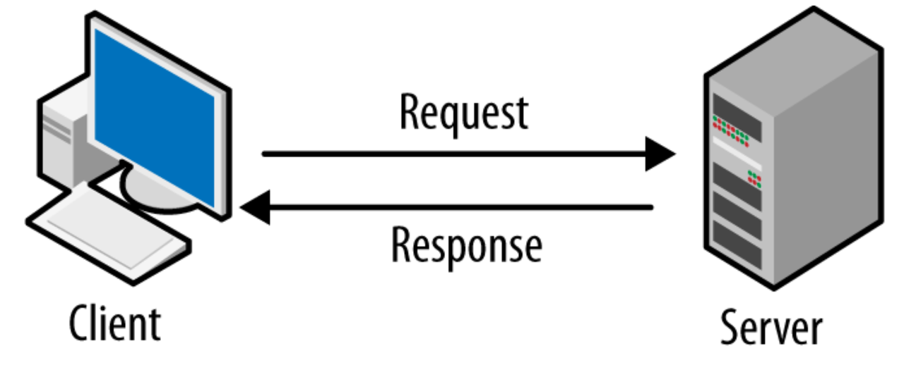
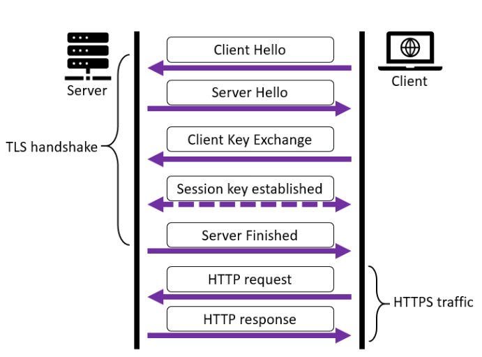

# Лекция 21. Знакомство с Интеренетом.


## Что такое интернет?

**Интернет** — это глобальная сеть, которая соединяет миллионы компьютеров, серверов, смартфонов, устройств «умного дома» и даже холодильники. Это как огромная паутина, которая позволяет устройствам по всему миру обмениваться данными между собой.

Само слово "интернет" происходит от словосочетания `inter-networking`, то есть «взаимное соединение сетей».

Интернет позволяет нам:

- Смотреть видео на YouTube
- Отправлять сообщения в Telegram
- Проверять почту
- Работать с банковскими приложениями
- Играть онлайн и многое другое

Но как это всё происходит? Как один компьютер находит другой? Как твой телефон понимает, куда отправлять запрос? Как сайт отвечает тебе именно тем, что ты хочешь? Давай разбираться.

## Как устройства соединяются между собой?

Каждое устройство в интернете имеет уникальный адрес, как у дома есть почтовый. Это адрес называется IP-адрес (Internet Protocol address) — например: `192.168.1.10`. Интернет состоит из множества локальных сетей, провайдеров, маршрутизаторов и серверов, которые обмениваются данными между собой.

Когда ты вводишь в браузере `google.com`:
- Компьютер отправляет запрос в интернет.
- Запрос идёт на сервер провайдера.
- Провайдер перенаправляет его на нужный сервер Google.
- Google обрабатывает запрос и отправляет ответ обратно по тому же пути.

### Роль серверов, клиентов и сетевого протокола

Интернет — это не просто хаотичный набор соединённых устройств. Он работает по строгим правилам и роли устройств чётко определены:

- `Клиент` — это тот, кто запрашивает информацию (например, твой браузер или мобильное приложение).
- `Сервер` — это тот, кто обрабатывает запрос и отдаёт результат (например, сервер `Google`, `GitHub`, `Instagram` и т.д.).
- `Протоколы` — это правила, по которым клиент и сервер общаются друг с другом.

Для того чтобы понимать друг друга, клиент и сервер используют сетевые протоколы — стандартизированные правила передачи данных. Главный из них — это `HTTP`, о котором мы поговорим чуть позже.

### Что такое Request–Response? Как работает обмен между клиентом и сервером?

Вся современная работа с вебом — будь то сайты, API или веб-приложения — основана на модели взаимодействия "запрос–ответ" (request–response). Это базовая концепция архитектуры интернета, которая определяет, как устройство пользователя получает данные с удалённого сервера.

Когда вы, например, открываете браузер и вводите адрес `https://www.python.org`, происходит следующее:

- Ваш браузер — это клиент. Он формирует `HTTP`-запрос, в котором указывает, что хочет получить: например, главную страницу сайта.
- Этот запрос отправляется по сети на сервер, на котором размещён сайт Python.
- Сервер принимает запрос, обрабатывает его, и возвращает `HTTP`-ответ, содержащий, например, `HTML-документ`, `стили (CSS)`, `JavaScript-код` и другие ресурсы.

Именно так работает каждое взаимодействие между клиентом и сервером — инициатива всегда исходит от клиента. Сервер не может самостоятельно отправить данные, пока не получит запрос. Он просто "ожидает" входящие обращения.



Эта модель применяется не только в браузерах. Примеров множество:
- Мобильное приложение банка запрашивает баланс счёта — сервер отвечает.
- Онлайн-магазин запрашивает список товаров — сервер отдает каталог.
- Python-скрипт отправляет запрос на внешний API — сервер возвращает JSON-данные.

#### Важно понимать:

- **Клиент** — это любая программа, которая может сформировать сетевой запрос (браузер, приложение, скрипт, часы и т.д.).
- **Сервер** — это машина, принимающая запросы и возвращающая соответствующие ответы.

Модель `request–response` — однонаправленная и синхронная по своей природе: клиент делает запрос → сервер отвечает. Только после получения ответа клиент может отправить следующий запрос. Эта структура делает архитектуру веба предсказуемой, масштабируемой и устойчивой. И именно на этом принципе построены все веб приложения, работа `HTTP` и большая часть интернет-коммуникации.

## HTTP – Основной протокол веба

Когда клиент (браузер, приложение, скрипт) и сервер общаются между собой, они должны использовать общий язык, чтобы понимать друг друга. Этим языком и является **HTTP — HyperText Transfer Protocol**, или протокол передачи гипертекста.

### Что делает HTTP?

`HTTP` описывает, как клиент должен отправлять запрос, и как сервер должен на него отвечать. Он определяет чёткие правила — структуру запроса, методы (что именно мы хотим сделать), заголовки (дополнительные данные), коды ответа и прочее.

Например:

- Клиент говорит: "Я хочу получить страницу" — и делает `GET`-запрос.
- Клиент говорит: "Я отправляю форму" — это `POST`-запрос.
- Сервер, получив запрос, отвечает: "Вот тебе данные, всё в порядке" (код 200), либо "Такой страницы нет" (код 404), либо "Что-то пошло не так" (код 500).

### HTTP vs HTTPS — в чём разница?

Когда ты открываешь сайт, в адресной строке браузера ты можешь увидеть, что URL начинается либо с `http://`, либо с `https://`. На первый взгляд, разница всего в одной букве — s. Но на деле эта одна буква — ключ к безопасности всей передачи данных между клиентом и сервером.


### HTTP (HyperText Transfer Protocol)

Это стандартный протокол передачи данных, который был изначально придуман для обмена гипертекстом — то есть HTML-документами.
Суть HTTP-протокола в следующем:

- Клиент (например, браузер) отправляет `HTTP`-запрос на сервер.
- Сервер отвечает `HTTP`-ответом: `HTML`-страницей, изображением, JSON и т.д.

Однако, есть огромный минус: **HTTP никак не шифрует данные**. Это значит, что всё, что ты отправляешь или получаешь — передаётся в открытом виде.

Примеры:

- Когда ты вводишь логин и пароль — они отправляются в тексте запроса.
- Любой, кто стоит между тобой и сервером (например, в одной Wi-Fi сети), может эти данные перехватить и прочитать.
- Даже если ты смотришь новости, кто-то может видеть, какие статьи ты читаешь.

## HTTPS (HyperText Transfer Protocol Secure)

Чтобы решить проблему безопасности, придумали `HTTPS` — защищённый вариант HTTP. "S" означает "Secure" (безопасный).

### Что делает HTTPS:

Использует всё тот же протокол HTTP. Но всё передаваемое шифруется с помощью `SSL/TLS` — криптографических протоколов. Это значит, что:

- Всё, что ты вводишь (логины, пароли, данные банковской карты) — нельзя перехватить или прочитать.
- Даже если кто-то подключён к твоему Wi-Fi, он не увидит содержимое твоих запросов.
- Сертификат `HTTPS` позволяет удостовериться, что ты действительно общаешься с сайтом, которому доверяешь (а не с фейком).

### Как это работает под капотом?

1. Клиент (браузер) говорит: "Привет, я хочу пообщаться по HTTPS!"
2. Сервер отвечает: "Окей, вот мой SSL-сертификат" (в нём: кому принадлежит сайт, когда выдан, кем подписан и т.д.).
3. Браузер проверяет, что сертификат:
   - Подписан доверенным центром сертификации.
   - Не просрочен.
   - Принадлежит нужному домену.
4. Если всё в порядке — между клиентом и сервером устанавливается зашифрованное соединение.
5. Теперь данные гоняются туда-сюда, но уже в шифре. Даже провайдер не видит, что ты передаёшь.



**HTTPS — это не только про безопасность, но и про доверие**

Современные браузеры выдают предупреждение, если сайт использует простой HTTP: **"Соединение небезопасно. Не вводите здесь конфиденциальные данные."**

Кроме того:

- Google снижает позиции HTTP-сайтов в поиске.
- Онлайн-магазины обязаны использовать HTTPS (иначе это нарушение закона в ряде стран).
- HTTPS стал стандартом: почти весь современный интернет — это HTTPS.

### Преимущества HTTPS в сравнении с HTTP:

| Характеристика       | HTTP                     | HTTPS                     |
|----------------------|--------------------------|---------------------------|
| Шифрование           | Нет                     | Да                        |
| Безопасность данных  | Уязвимы                 | Защищены                  |
| Использование        | Устаревает              | Стандарт                  |
| Пример URL           | http://example.com      | https://example.com       |

### Как проверить HTTPS-сертификат?

1. Откройте любой сайт с HTTPS.
2. Нажмите на значок замка в адресной строке.
3. Посмотрите информацию о сертификате: кто его выдал, срок действия и т.д.

HTTPS — это не просто технология, а основа современной интернет-безопасности. Без него невозможно представить себе безопасные платежи, защиту данных и конфиденциальность в интернете.

## Структура HTTP-запроса

Когда клиент (например, браузер) отправляет запрос серверу, он формирует HTTP-запрос, состоящий из нескольких частей:

### Метод запроса (HTTP method)

Это "глагол", который определяет, что мы хотим сделать:

| Метод   | Описание                                                                 |
|---------|--------------------------------------------------------------------------|
| GET     | Получить данные с сервера (например, страницу, изображение, JSON).       |
| POST    | Отправить данные на сервер (например, форму регистрации).                |
| PUT     | Обновить существующий ресурс.                                            |
| DELETE  | Удалить ресурс.                                                          |
| PATCH   | Частично обновить ресурс.                                                |
| HEAD    | Получить только заголовки (без тела ответа).                             |

Наиболее часто используются **GET** и **POST**.

### Заголовки (Headers)

Это дополнительная информация о запросе, которая помогает серверу понять, как обработать запрос:

- **User-Agent**: Кто отправил запрос (например, браузер или приложение).  
- **Accept**: Какой формат данных мы ожидаем (например, `text/html`, `application/json`).  
- **Content-Type**: Какой тип контента отправляем (например, `application/json`).  
- **Authorization**: Токен авторизации, если требуется доступ к защищённым ресурсам.

**Пример заголовков:**
```http
GET /index.html HTTP/1.1
Host: www.example.com
User-Agent: Mozilla/5.0
Accept: text/html
```

### Тело запроса (Body)

Используется в таких методах, как `POST` и `PUT`, когда мы передаём данные на сервер (например, форму входа, JSON, файл).

Пример тела запроса:

```http
POST /login HTTP/1.1
Content-Type: application/json

{
  "username": "alice",
  "password": "12345"
}
```

## Структура HTTP-ответа

Сервер всегда возвращает HTTP-ответ, который также состоит из нескольких частей:

### Статусный код (Status Code)
Это трёхзначное число, которое сообщает, как прошёл запрос. Статусные коды делятся на несколько категорий:

| Код диапазона | Категория                     | Описание                                      |
|---------------|-------------------------------|----------------------------------------------|
| 1xx           | Информационные               | Запрос принят, обработка продолжается.       |
| 2xx           | Успешные                     | Запрос успешно выполнен.                     |
| 3xx           | Перенаправления              | Требуется дополнительное действие от клиента.|
| 4xx           | Ошибки клиента               | Проблема на стороне клиента.                 |
| 5xx           | Ошибки сервера               | Проблема на стороне сервера.                 |

Наиболее часто используемые коды:

| Код  | Значение                              |
|------|---------------------------------------|
| 200  | OK — запрос успешно выполнен.        |
| 201  | Created — создан новый ресурс.       |
| 301  | Moved Permanently — ресурс перемещён.|
| 400  | Bad Request — ошибка в запросе.      |
| 401  | Unauthorized — требуется авторизация.|
| 403  | Forbidden — доступ запрещён.         |
| 404  | Not Found — ресурс не найден.        |
| 500  | Internal Server Error — ошибка на сервере.|

### Заголовки (Headers)
Заголовки в ответе содержат дополнительную информацию о возвращаемых данных. Примеры:

- **Content-Type**: Указывает тип возвращаемых данных (например, `text/html`, `application/json`).  
- **Set-Cookie**: Устанавливает cookie для клиента.  
- **Server**: Информация о сервере (например, его тип и версия).  
- **Content-Length**: Размер возвращаемого содержимого в байтах.

**Пример заголовков ответа:**
```http
HTTP/1.1 200 OK
Content-Type: text/html
Content-Length: 1234
Server: Apache/2.4.41 (Ubuntu)
```

### Тело ответа (Body)

Основное содержимое ответа: HTML-страница, JSON-данные, картинка, текст и т.д.

Пример запроса и ответа (GET)

**Запрос:**

```http
Копировать
Редактировать
GET /index.html HTTP/1.1
Host: example.com
```

**Ответ:**

```http
HTTP/1.1 200 OK
Content-Type: text/html

<!DOCTYPE html>
<html>
<head><title>Example</title></head>
<body>Hello, world!</body>
</html>
```

## Заключение


Теперь, когда мы познакомились с тем, как устроен интернет, как работают запросы и ответы, кто такой клиент, а кто такой сервер, пришло время перейти от теории к практике.

Мы уже знаем:

- как устройства общаются по сети (клиент-сервер),
- как работает протокол HTTP,
- что такое URL, метод запроса, код ответа,
- какие данные передаются между браузером и сервером.

**Но что происходит на самом сервере, когда он получает запрос?**

- Как он принимает решение, что отдать: HTML-страницу, JSON-объект или сообщение об ошибке?
- Кто обрабатывает запрос?
- Где хранятся данные?
- Как управлять логикой ответа?

Чтобы ответить на эти вопросы, мы начнем знакомство с `Django` — одним из самых популярных фреймворков для создания веб-приложений на Python.