# Лекция 22. Введение в Django


## Что такое Django и почему его выбирают?

**Django** — это мощный, зрелый и широко используемый веб-фреймворк для Python, который позволяет создавать полноценные веб-приложения быстро, надёжно и с акцентом на безопасность. Он появился в 2005 году и с тех пор стал одним из самых популярных решений для разработки веб-сайтов на Python.

[Django](https://www.djangoproject.com/) — это не просто библиотека, это фреймворк. Он предлагает структуру и набор готовых решений для типичных задач:

- подключение к базе данных,
- создание страниц,
- обработка форм,
- управление пользователями и правами доступа,
- безопасность,
- маршрутизация URL и многое другое.
- История и философия Django

### Что такое фреймворк?

**Фреймворк** — это набор инструментов, библиотек и правил, которые помогают разработчику создавать приложения быстрее и проще. Он предоставляет готовую структуру и базовый функционал, чтобы не нужно было изобретать всё с нуля.

Если сравнить разработку с постройкой дома:

- **Без фреймворка**: Вы начинаете с чистого листа — сами делаете чертежи, заливаете фундамент, строите стены и крышу.
- **С фреймворком**: У вас уже есть готовый каркас дома, и вы просто добавляете детали — окна, двери, мебель.

Фреймворки помогают сосредоточиться на логике приложения, а не на рутинных задачах. Они упрощают разработку, улучшают качество кода и ускоряют процесс создания приложений.

### Зачем нужен фреймворк?

Фреймворки решают множество задач, которые часто встречаются при разработке приложений. Например:

- **Маршрутизация**: Как запросы от пользователя (например, открытие страницы) обрабатываются сервером.
- **Работа с базой данных**: Упрощение взаимодействия с базами данных (например, добавление, удаление, изменение данных).
- **Шаблоны**: Генерация HTML-страниц с динамическими данными.
- **Безопасность**: Защита от распространённых угроз (например, SQL-инъекций, XSS-атак).
- **Управление пользователями**: Регистрация, авторизация, права доступа.

### Примеры фреймворков

**Для веб-разработки**:

- Django (Python)
- Flask (Python)
- Ruby on Rails (Ruby)
- Laravel (PHP)

**Для мобильной разработки**:

- React Native (JavaScript)
- Flutter (Dart)

**Для фронтенда**:

- Angular (JavaScript)
- Vue.js (JavaScript)
- React (JavaScript)

## Как появился Django?

Django был разработан в период с 2003 по 2005 год командой, которая занималась созданием и обслуживанием газетных веб-сайтов. После создания нескольких сайтов, команда начала повторно использовать множество общего кода и шаблонов проектирования. Этот общий код эволюционировал в веб-фреймворк, который превратился в проект "Django" с открытым исходным кодом в июле 2005 года.

Django продолжает расти и улучшаться с момента его первого релиза (1.0) в сентябре 2008 года до недавно выпущенной версии 3.1 (2020). В каждой версии добавлены новые функциональные возможности и исправлены ошибки, начиная от поддержки новых типов баз данных, шаблонизаторов и кеширования, до добавления «общих» функций просмотра и классов (уменьшающих объём кода, который разработчики должны писать для ряда программных задач). Поэтому его философия звучит как:

> *“The web framework for perfectionists with deadlines”* - *Фреймворк для перфекционистов с дедлайнами*

Он построен с расчётом на:

- Быструю разработку
- Удобство
- Повторное использование кода
- Безопасность
- Поддерживаемость на больших проектах

## Почему разработчики выбирают Django?

Вот несколько причин:

- Быстрая разработка — можно за пару часов собрать полноценный сайт.
- ORM (Object-Relational Mapping) — автоматическая работа с базой данных, без ручного SQL.
- Встроенная админка — можно управлять сайтом через красивый и мощный интерфейс.
- Безопасность — защита от XSS, CSRF, SQL-инъекций и других уязвимостей уже реализована.
- Масштабируемость — Django используется как в маленьких стартапах, так и в огромных корпорациях.
- Большое сообщество — куча документации, обучающих материалов, готовых решений.

## Примеры крупных проектов на Django

Если ты думаешь, что Django — это для учебных пет-проектов, то посмотри на этих гигантов:

- Instagram — начинался на Django и до сих пор активно его использует
- Pinterest — активно применяет Django для серверной части
- Disqus — система комментирования, обслуживает миллионы пользователей
- Spotify — использует Django для внутреннего администрирования и API
- Mozilla — применяет Django в своих веб-сервисах

Django справляется как с небольшими сайтами, так и с огромной нагрузкой. Главное — правильно его использовать.

## Архитектура проекта: зачем нам шаблоны?

Когда вы начинаете писать простую программу — скажем, калькулятор или чат-бота, — вы можете обойтись вводом —> обработкой — > выводом данных. Но что если речь идёт о полноценном веб-приложении? Со страницами, регистрацией, формами, базами данных, правами пользователей, API? Разумеется, всё это нужно как-то организовать. Для этого и существуют шаблоны проектирования — продуманные архитектурные решения, которые помогают структурировать проект так, чтобы с ним было удобно работать, поддерживать и масштабировать.

### Пример из жизни: стройка

Представьте, вы решили построить дом. Можно, конечно, начать с крыши, потом как-то к ней прикрутить стены, а фундамент “придумать по ходу дела”. Но скорее всего, такой подход закончится либо катастрофой, либо дом будет годен только для фотосессий в Инстаграме. Именно поэтому существуют строительные стандарты и этапы: сначала фундамент, потом каркас, затем — коммуникации и отделка.

То же самое в программировании.

Можно всё писать “в одну кучу”: обрабатывать запросы, генерировать HTML и лезть в базу данных — всё в одной функции. Но очень быстро такой код становится неудобным. Невозможно ничего найти, внести изменения без ошибок — тоже беда.

### Решение: архитектурные шаблоны

Так как такие проблемы уже возникали у тысяч команд до нас — решение давно придумано. Это и есть архитектурные шаблоны (design patterns).
Они определяют как разложить логику программы по полочкам.

И один из самых известных шаблонов — `MVC (Model–View–Controller)`.

Когда мы изучали ООП, то уже сталкивались с похожими идеями: разделение ответственности, инкапсуляция, переиспользуемость кода и т.д.

## Что такое MVC?

`MVC` — это архитектура, которая разделяет ваш код на три компонента:

- `Model (Модель)` — отвечает за данные и работу с базой.
- `View (Представление)` — за отображение (то, что видит пользователь).
- `Controller (Контроллер)` — за обработку запросов и принятие решений: какие данные получить, какой HTML отдать, какие действия выполнить.

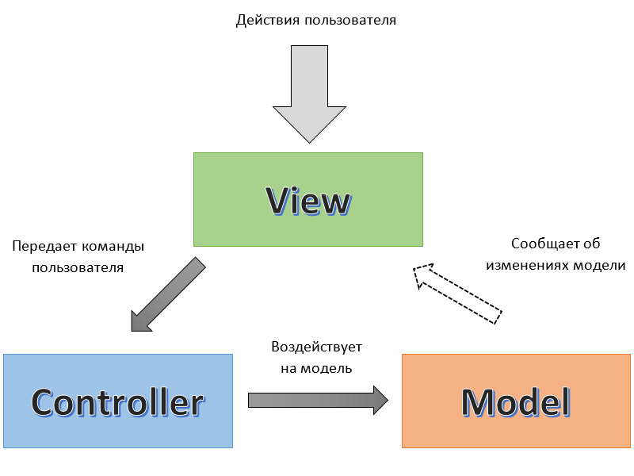

Чтобы было проще понять, что такое MVC, давайте рассмотрим аналогию, очень близкую к реальной жизни — ресторан.

Представьте, вы пришли в ресторан. Сели за столик. Что вы видите? Меню, стол, возможно, официанта. Вы заказываете, например, пасту с грибами и ждёте. Ваш заказ принимает официант, передаёт его на кухню повару, тот проверяет наличие ингредиентов, готовит блюдо и через некоторое время официант возвращается к вам уже с красивой подачей. Вы съедаете и, возможно, даже не задумываетесь, как именно это было приготовлено и где хранились продукты. Но вы довольны, потому что получили именно то, что заказывали.

Теперь разложим эту ситуацию на технические роли:

- Клиент в ресторане — это пользователь вашего сайта.
- Меню и сервировка — это то, что пользователь видит. Это визуальная часть сайта, т.е. `View`.
- Официант — тот, кто принимает запрос от клиента, передаёт его в систему и возвращает результат. Это контроллер — `Controller`.
- Кухня и склад с продуктами — это часть, которая обрабатывает данные. Это модель — `Model`.

Клиент не знает, где хранятся продукты и как именно готовится еда. Его интересует только результат. И это — основная идея MVC: разделить зоны ответственности.

**В программировании это означает следующее:**

- Model (Модель) — это база данных и логика работы с данными. Она знает, как хранить информацию, как её получать, как её проверять. Пользователь не имеет прямого доступа к модели — всё идёт через контроллер.
- View (Отображение) — это пользовательский интерфейс, то, что видит клиент. Он не знает, что происходит за кулисами — он просто получает красиво оформленную страницу или данные.
- Controller (Контроллер) — это связующее звено. Он принимает запросы от пользователя, принимает решения, какие данные нужны, как их обработать и что вернуть пользователю. Он общается и с моделью, и с представлением.


## Django MTV

Когда вы проектируете своё первое веб-приложение, вы, возможно, сначала пишете всё в одном файле: HTML, немного логики, чуть-чуть работы с базой данных. Это нормально для начала. Но в крупных проектах это превращается в кашу. MVC помогает этого избежать.

Именно поэтому Django использует очень похожую архитектуру — только она называется MVT (Model–View–Template).

Здесь:

- `Model` - остаётся той же — это слой данных.
- `View` — в Django это как раз контроллер, который обрабатывает запросы.
- `Template` — то, что отображает данные, т.е. HTML-страницы.

То есть `Django View` — это `Controller`, а `Django Template` — это `View`.

Такое именование выбрано потому, что в `Django View` не только *«контролирует»* логику, но и возвращает ответ пользователю — и именно этот слой считает Django *«представлением»*.
Самое главное, что суть `MVC` остаётся неизменной.

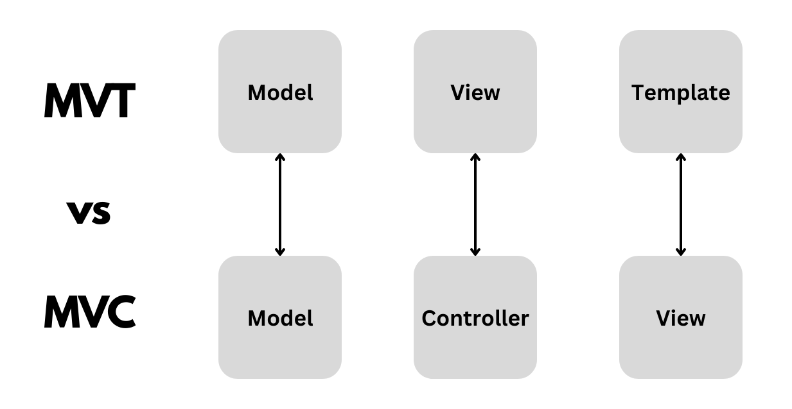

## Установка Django и создание первого проекта

Каждый Django-проект должен жить в своём собственном окружении. Это своего рода “чистая комната”, где будут установлены только те библиотеки, которые нужны именно этому проекту.

Итак, правило простое:

> Один проект — одно виртуальное окружение.

### Создаём папку проекта:

```bash
mkdir my_django_project
cd my_django_project
```

### Создаём виртуальное окружение внутри проекта:

```bash
python -m venv venv
```

### Активируем окружение:

**Windows (cmd / PowerShell):**

```powershell
venv\Scripts\activate
```

**Windows (cmd / Git bash):**

```bash
source venv_lesson/Scripts/activate
```

**Mac / Linux:**

```bash
source venv/bin/activate
```

Если всё прошло хорошо, в начале строки терминала появится префикс `(venv)` — значит окружение активно и готово к работе.

Теперь можно устанавливать Django — и он попадёт только в это окружение.

### Установка Django:

```bash
pip install django
```

Проверим, всё ли установилось:

```bash
django-admin --version
```

Если всё прошло успешно, вы увидите номер установленной версии Django.

### Создание первого проекта:

Для создания проекта в Django используется команда:

```bash
django-admin startproject my_project
```

Эта команда создаст папку `my_project` с базовой структурой проекта Django. Внутри неё будет несколько файлов и папок:

```plaintext
my_project/
    ├── manage.py
    └── my_project
        ├── __init__.py
        ├── asgi.py
        ├── settings.py
        ├── urls.py
        └── wsgi.py
```

### Что это за файлы?

- `manage.py` — это скрипт, который позволяет управлять проектом. С его помощью можно запускать сервер, выполнять миграции, создавать приложения и т.д.

В нутри папки `my_project` которая имеет то же имя, что и проект:

- `__init__.py` — пустой файл, который говорит Python, что это папка является пакетом. Он нужен для импорта модулей
- `asgi.py` — файл для настройки ASGI-приложения. ASGI (Asynchronous Server Gateway Interface) — это стандарт для асинхронных веб-приложений на Python. Он позволяет Django работать с асинхронными веб-серверами. С этим файлом мы познакомимся позже, когда будем разбираться с асинхронным программированием в Django.
- `settings.py` — файл с настройками проекта. Здесь вы можете настроить базу данных, кэш, статические файлы и другие параметры.
- `urls.py` — файл с маршрутизацией. Здесь вы определяете, какие URL-адреса будут обрабатываться вашим приложением и какие функции или классы будут вызываться при обращении к ним.
- `wsgi.py` — файл для настройки WSGI-приложения. WSGI (Web Server Gateway Interface) — это стандарт для синхронных веб-приложений на Python. Он позволяет Django работать с синхронными веб-серверами. С этим файлом мы тоже познакомимся позже.

Главными файлами для нас будут `settings.py` и `urls.py`. В них мы будем настраивать проект и определять маршруты. А через `manage.py` будем запускать сервер и выполнять другие команды.

Давайте запустим сервер, чтобы убедиться, что всё работает:

В консоле перейдите в папку проекта:

```bash
cd my_project
```

После этого запустим сервер:

> Важно: сервер будет работать только в активированном виртуальном окружении. Если вы его деактивировали, то активируйте его снова.

```bash
python manage.py runserver
```

В консоле вы увидите сообщение, что сервер запущен и слушает на порту 8000:

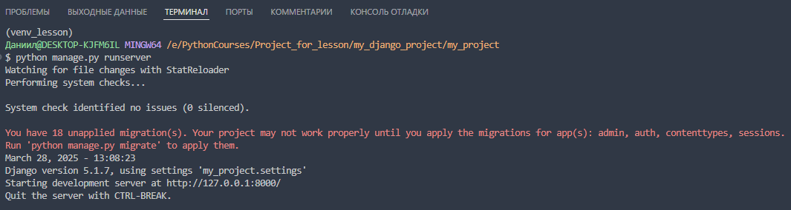

Пока не обращайте внимание на предупреждение о том, что сервер запущен в режиме отладки. Это нормально для разработки, но не рекомендуется для продакшена.

Если кликнем на ссылку(`http://127.0.0.1:8000/`), то откроется браузер с приветственной страницей Django:

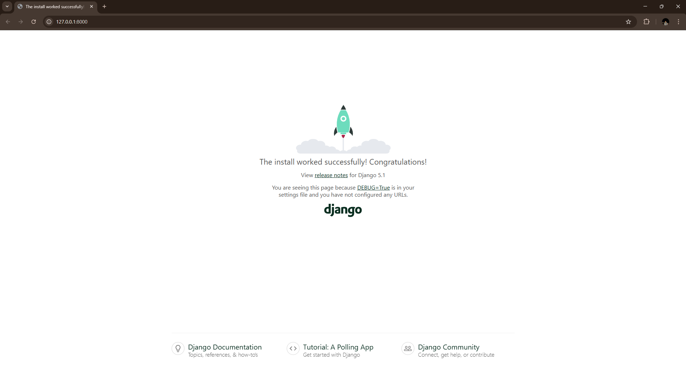

### Что сдесь происходит?

Запустив команду `python manage.py runserver`, мы запустили встроенный `сервер` Django. Он слушает на порту 8000 и ждёт запросов от браузера( `Который выступает ввиде клиента`). Помним, что клиент — это тот, кто делает запросы к серверу. В данном случае это браузер. У нас работает клиент-серверная архитектура. Браузер отправляет запросы на сервер, а сервер отвечает на них.

`http://127.0.0.1` - это адрес вашего локального компьютера. Он называется `localhost`. Порт 8000 — это номер порта, на котором работает сервер. Вы можете использовать любой другой порт, но 8000 — это стандартный порт для Django.

Чтобы остановить сервер, нажмите `Ctrl + C` в терминале.

## Cоздание приложения в Django:

Только что мы создали проект. Теперь давайте создадим приложение. В Django проект может состоять из нескольких приложений. Каждое приложение отвечает за свою часть функционала. Например, у вас может быть одно приложение для управления пользователями, другое — для блога, третье — для интернет-магазина и т.д. 

Чтобы создать приложение, используйте команду:

```bash
python manage.py startapp my_app
```

Где - `my_app` это имя вашего приложения. Вы можете назвать его как угодно, но лучше использовать английские буквы и нижний регистр. Например, `blog`, `shop`, `users` и т.д.

После выполнения команды у вас появится папка `my_app` с такой структурой:

```plaintext
my_app/
    ├── migrations
    │   └── __init__.py
    ├── __init__.py
    ├── admin.py
    ├── apps.py
    ├── models.py
    ├── tests.py
    └── views.py
```

давайте разберём, что это за файлы:

- `migrations` — папка для миграций. Мы позже поговорим о миграциях, но сейчас просто знайте, что это папка, в которой хранятся файлы миграций для базы данных. Она создаётся автоматически при создании приложения.

- `__init__.py` — пустой файл, который говорит Python, что это папка является пакетом. Он нужен для импорта модулей.
- `admin.py` — файл для настройки админки. Здесь вы можете зарегистрировать модели, которые будут отображаться в админке. Мы тоже поговорим об этом позже.
- `apps.py` — файл для настройки приложения. Здесь вы можете настроить имя приложения, его конфигурацию и другие параметры.
- `models.py` — файл для определения моделей. Здесь вы можете создать классы, которые будут представлять ваши данные. Мы тоже поговорим об этом позже.
- `tests.py` — файл для написания тестов. Здесь вы можете написать тесты для вашего приложения.
- `views.py` — файл для определения представлений. Здесь вы можете создать функции или классы, которые будут обрабатывать запросы и возвращать ответы.

На первом этапе все эти файлы будут пустыми. Но мы будем заполнять их по мере изучения Django.

## Подключение приложения к проекту

Чтобы подключить приложение к проекту, нужно добавить его в файл `settings.py` в списке `INSTALLED_APPS`. Найдите строку `INSTALLED_APPS` и добавьте туда ваше приложение:

```python
 INSTALLED_APPS = [
    "django.contrib.admin",
    "django.contrib.auth",
    "django.contrib.contenttypes",
    "django.contrib.sessions",
    "django.contrib.messages",
    "django.contrib.staticfiles",
    "my_app" # <-- добавляем сюда
]

```

## Что такое URL?

`URL` (Uniform Resource Locator) — это адрес ресурса в интернете. Он указывает, где находится ресурс и как к нему получить доступ. Например, `http://www.example.com/index.html` — это URL, который указывает на файл `index.html` на сайте `example.com`.

### Структура URL

URl состоит из нескольких частей:

- `Схема` — это протокол, который используется для доступа к ресурсу. Например, `http`, `https`, `ftp` и т.д.

- `Домен` — это имя сайта, на котором находится ресурс. Например, `www.example.com`.

- `Порт` — это номер порта, на котором работает сервер. Например, `80` для HTTP и `443` для HTTPS. Если порт не указан, то используется стандартный порт для протокола.

- `Путь` — это путь к ресурсу на сервере. Например, `/index.html`.

- `Параметры` — это дополнительные данные, которые передаются серверу. Например, `?id=123&name=John`.

- `Якорь` — это часть URL, которая указывает на определённое место на странице. Например, `#section1`.

Пример полного URL:

```plaintext
https://www.example.com:443/index.html?id=123&name=John#section1
```

### использование URL

URL используется для доступа к ресурсам в интернете. Например, когда вы вводите URL в адресной строке браузера и нажимаете Enter, браузер отправляет запрос на сервер по этому адресу. Сервер обрабатывает запрос и возвращает ответ, который отображается в браузере.

## Что мы сегодня будем учить?

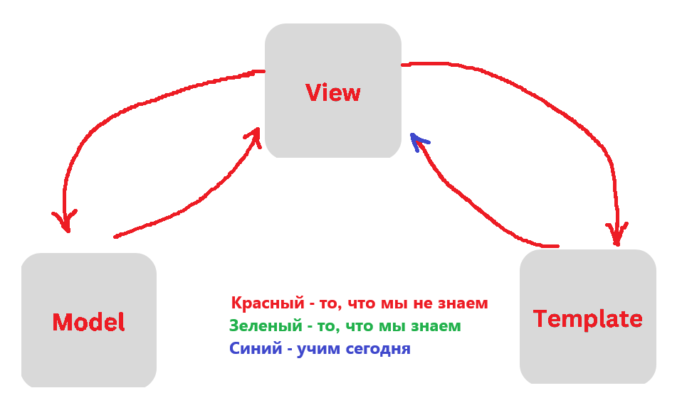

### Основы маршрутизации в Django (urls.py)

Когда пользователь заходит на сайт — будь то домашняя страница, страница с блогом или профилем — он обращается по определённому `URL`. Но откуда `Django` знает, что именно нужно показать по этому адресу?
Вот тут и вступает в игру система маршрутизации — `urls.py`.

### Что такое маршрутизация?

**Маршрутизация** — это способ сопоставить определённый URL с функцией, которая должна обработать этот запрос. Когда браузер отправляет запрос на `http://127.0.0.1:8000/`, Django проверяет в `urls.py`, какая функция или класс должен обработать этот путь.

Проще говоря:

**Путь (URL) → обработчик (View)**

### manage.py

Если вы откроете файл manage.py то там вы увидите что-то такое:

```python
#!/usr/bin/env python
"""Django's command-line utility for administrative tasks."""
import os
import sys


def main():
    """Run administrative tasks."""
    os.environ.setdefault("DJANGO_SETTINGS_MODULE", "mysite.settings")
    try:
        from django.core.management import execute_from_command_line
    except ImportError as exc:
        raise ImportError(
            "Couldn't import Django. Are you sure it's installed and "
            "available on your PYTHONPATH environment variable? Did you "
            "forget to activate a virtual environment?"
        ) from exc
    execute_from_command_line(sys.argv)


if __name__ == "__main__":
    main()
```

Больше всего нас интересует строка:

```python
os.environ.setdefault("DJANGO_SETTINGS_MODULE", "mysite.settings")
```
Она сообщает всей системе, что в качестве настроек нужно использовать файл `setting.py` из папки my_project. То есть, когда вы запускаете сервер, Django ищет файл `settings.py` в папке проекта и использует его настройки

Поэтому при любом запросе к запущенномy `Django` приложению при обработке запроса запущенный сервер в первую очередь заходит в файл `settings.py` и ищет там переменную `ROOT_URLCONF`, по умолчанию там будет указан файл `urls.py`,который находится в той же папке, где и `settings.py`.

Внутри этого файла `Django` ожидает наличие переменной `urlpatterns`, которая содержит коллекцию (например, список), состоящую из специальных объектов `path` или `re_path`.

### Главный urls.py

Когда мы создаём проект, Django автоматически создаёт файл `urls.py` в папке проекта:

```plaintext
my_project/
    └── my_project/
        └── urls.py
```

Откроем его. Внутри уже есть базовая конфигурация:

```python
from django.contrib import admin
from django.urls import path

urlpatterns = [
    path('admin/', admin.site.urls),
]
```

Здесь уже прописан маршрут для панели администратора — `/admin/`.

### Как добавить свой путь?

Допустим, мы хотим, чтобы при заходе на сайт по адресу `/hello/` открывалась страница с приветствием. Для этого:

Идём в `my_app/views.py`

Создаём функцию:

```python
from django.http import HttpResponse

def hello(request):
    return HttpResponse("Привет, это моя первая страница!")
```

Подключаем `views.py` в `urls.py` проекта:

```python
from django.contrib import admin
from django.urls import path
from my_app import views  # <-- импортируем views из нашего приложения

urlpatterns = [
    path('admin/', admin.site.urls),
    path('hello/', views.hello),  # <-- добавляем новый маршрут
]
```

Теперь, если мы откроем `http://127.0.0.1:8000/hello/` — увидим текст **"Привет, это моя первая страница!"**

### А что если у нас много маршрутов?

Проект может расти — и если в одном файле будет 30+ маршрутов, то это станет неудобно. Django предлагает делить маршруты между приложениями.

#### Локальный urls.py внутри приложения

Обычно каждое приложение имеет свой `urls.py`, чтобы маршруты были структурированы.

Для начала создадим файл `urls.py` в папке `my_app`:

```python
from django.urls import path
from my_app import views

urlpatterns = [
    path('hello/', views.hello),  # <-- добавляем новый маршрут
]
```

После этого нужно подключить этот файл в главный `urls.py` проекта:

```python
from django.contrib import admin
from django.urls import path, include  # <-- подключаем include

urlpatterns = [
    path('admin/', admin.site.urls),
    path('', include('my_app.urls')),  # <-- теперь все маршруты из my_app подключены
]
```

Теперь добавим ещё один маршрут для главной страницы:

Для начала создадим функцию в `views.py`:

```python
# my_app/views.py

from django.shortcuts import render
from django.http import HttpResponse

def hello(request):
    return HttpResponse("Hello, world!")

def home(request):
    return HttpResponse("Home Page") # <-- добавляем новую функцию
```

Теперь добавим новый маршрут в `urls.py` приложения:

```python
# my_app/urls.py

from my_app.views import hello, home
from django.urls import path

urlpatterns = [
    path("hello/", hello),
    path("", home) # <-- добавляем новый маршрут для главной страницы
]
```

После всех манипуляций у нас получится следующее:

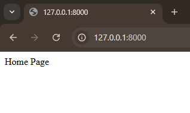

По адресу `http://127.0.0.1:8000/` будет открываться страница с текстом **"Home Page"**.

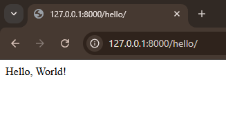

А по адрессу `http://127.0.0.1:8000/hello/` будет открываться страница с текстом **"Hello, world!"**.

**Уже не плохо, правда?**

### URL с параметрами (динамические маршруты)

В реальных проектах часто нужно передавать данные через URL. Например:

- Статьи по id: `site.com/articles/42`
- Профиль пользователя: `site.com/users/john`
- Категория товара: `site.com/products/electronics`

Во всех этих случаях мы не жёстко прописываем URL, а позволяем Django *«поймать»* переменные из адреса.

При этом мы можем использовать как `строки`, так и `числа` в качестве параметров.

**Пример**

Допустим, мы хотим обрабатывать путь вида:

```plaintext
http://localhost:8000/hello/Иван/
```

и показать на странице:

```plaintext
Привет, Иван!
```

#### Как это сделать?

изменим функцию `hello` в `views.py`:

```python
# my_app/views.py
from django.shortcuts import render
from django.http import HttpResponse

def hello(request, name):
    return HttpResponse(f"Hello, {name}")

def home(request):
    return HttpResponse("Home Page")

```

После этого изменим маршрут в `urls.py`:

```python
# my_app/urls.py
from my_app.views import hello, home
from django.urls import path

urlpatterns = [
    path("hello/<str:name>", hello),
    path("", home)
]
```

Если все правильно сделали должно получится следующее:

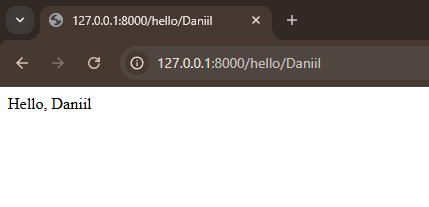


Если имя параметра не указать, то `Django` выдаст ошибку:

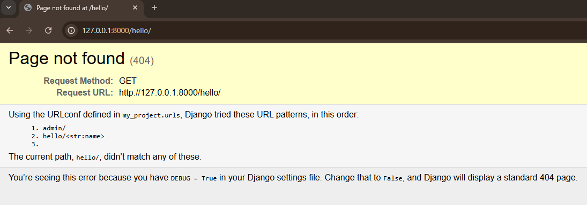

**Пример с числами, фиксированным значением и динамическим параметром:**

Для этого добавим маршруты с фиксированным значением и динамическим параметром в `urls.py`:

```python
from my_app.views import hello, home, hello_fixed, hello_dynamic, hello_id
from django.urls import path

urlpatterns = [
    path("", home),
    path("hello/", hello),
    path("hello/fixed", hello_fixed, name="hello_fixed"),
    path("hello/<str:name>/", hello_dynamic, name="hello_name"),
    path("hello/id/<int:user_id>/", hello_id, name="hello_by_id"),
]
```

`name="..."` — это просто удобная метка для маршрута, чтобы потом можно было легко на него сослаться. Иногда нам нужно дать имя маршруту, чтобы потом обратиться к нему по имени, а не по самому адресу. Это удобно, когда у вас много маршрутов и вы хотите сделать код более читаемым.

А также добавим функции в `views.py`:

```python
from django.shortcuts import render
from django.http import HttpResponse


def hello(request):
    return HttpResponse("Hello, World!")

def home(request):
    return HttpResponse("Home Page")

def hello_fixed(request):
    return HttpResponse("Привет! Это hello по жёстко заданному адресу")


def hello_dynamic(request, name):
    return HttpResponse(f"Привет, {name}!")


def hello_id(request, user_id):
    return HttpResponse(f"Привет, пользователь с ID {user_id}!")
```

По анологии мы получим разные страницы на которых увидим разные приветствия:

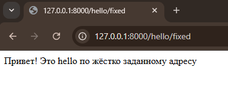

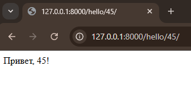

Так же можно использовать `slug` в качестве параметра, чтобы передавать в URL.

**slug** — это строка, состоящая из букв, цифр и символов `-` и `_`. Она используется для создания удобочитаемых `URL`. Например, вместо `http://example.com/article/123` можно использовать `http://example.com/article/my-first-article`.
обычно `slug` используется в адресах статей, категорий и других объектов, чтобы сделать их более понятными для пользователей и поисковых систем.

И может перндавать только:

- строчные латинские буквы (a-z)
- цифры (0-9)
- дефисы (-)

Давайте добавим маршрут с `slug` в `urls.py`:

```python
from my_app.views import hello, home, hello_fixed, hello_dynamic, hello_id, hello_slug
from django.urls import path

urlpatterns = [
    path("", home),
    path("hello/", hello),
    path("hello/fixed", hello_fixed, name="hello_fixed"),
    path("hello/<str:name>/", hello_dynamic, name="hello_name"),
    path("hello/id/<int:user_id>/", hello_id, name="hello_by_id"),
    path("hello/slug/<slug:slug>/", hello_id, name="hello_by_slug")
]
```

И в `views.py`:

```python
from django.shortcuts import render
from django.http import HttpResponse


def hello(request):
    return HttpResponse("Hello, World!")

def home(request):
    return HttpResponse("Home Page")

def hello_fixed(request):
    return HttpResponse("Привет! Это hello по жёстко заданному адресу")


def hello_dynamic(request, name):
    return HttpResponse(f"Привет, {name}!")


def hello_id(request, user_id):
    return HttpResponse(f"Привет, пользователь с ID {user_id}!")

def hello_slug(request, slug): # <-- добавляем новый маршрут
    return HttpResponse(f"Привет, {slug}!")
```

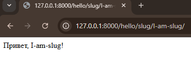

## Регулярные выражения (re_path) в маршрутах Django


В `Django`, кроме обычного` path()`, есть ещё один способ задавать маршруты — с помощью `re_path()`. Он позволяет использовать регулярные выражения (`regex`), чтобы описывать более гибкие шаблоны `URL`.

### А зачем вообще нужны регулярные выражения в URL?

Иногда обычный `path()` не справляется. Например:

- Вам нужно принять какой-то сложный шаблон URL.
- Или вы хотите, чтобы один путь подходил под несколько форматов.

Тогда вы используете `re_path()`, и он даст вам больше гибкости, но взамен нужно немножко разобраться в синтаксисе.

### Простое объяснение: что такое регулярное выражение?

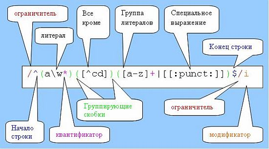

Регулярное выражение — это способ задать шаблон для текста.

Пример из жизни:

- `\d+` — значит "одна или более цифр"
- `\w+` — значит "одна или более букв или цифр"
- `^` и `$` — говорят: "начало строки" и "конец строки"

### Пример в Django

Допустим, вы хотите, чтобы URL выглядел так:

- `/article/123/` — где `123` — это любое число.

Через `path()` это делается так:

```python
path("article/<int:article_id>/", article_view)
```

А через регулярку:

```python
re_path(r"^article/(?P<article_id>\d+)/$", article_view)
```

**Что тут происходит?**

- `^article/` — начало пути
- `(?P<article_id>\d+)` — "поймай одно или больше чисел и назови это article_id"
- `/$` — путь должен заканчиваться слэшем

### Когда использовать re_path()?

На начальном этапе — редко.
Почти всё можно выразить через `path()` с параметрами (`<int:id>`, `<str:slug>` и т.п.)

Но если:

- нужно принять дату в формате 2024-03-01
- или e-mail в URL
- или разные форматы в одном пути

Тогда регулярки вас спасут

### Не пугайтесь!


Вы не обязаны уметь писать сложные регулярки с нуля. Главное — понимать идею: это шаблон, который проверяет, подходит ли текст (в нашем случае — URL).

Позже мы ещё разберём их в отдельной лекции. Сейчас — просто запомните, что есть такой инструмент и он называется `re_path`.