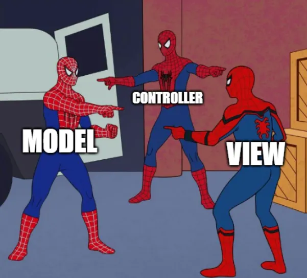

# Лекция 22. Введение в Django


## Что такое Django и почему его выбирают?

**Django** — это мощный, зрелый и широко используемый веб-фреймворк для Python, который позволяет создавать полноценные веб-приложения быстро, надёжно и с акцентом на безопасность. Он появился в 2005 году и с тех пор стал одним из самых популярных решений для разработки веб-сайтов на Python.

Но прежде чем мы углубимся в технические детали, задайся вопросом: Хочешь создать блог, интернет-магазин, соцсеть или админ-панель? 
Django подходит для всего этого. Причём — из коробки.

[Django](https://www.djangoproject.com/) — это не просто библиотека, это фреймворк. Он предлагает структуру и набор готовых решений для типичных задач:

- подключение к базе данных,
- создание страниц,
- обработка форм,
- управление пользователями и правами доступа,
- безопасность,
- маршрутизация URL и многое другое.
- История и философия Django

### Что такое фреймворк?

**Фреймворк** — это набор инструментов, библиотек и правил, которые помогают разработчику создавать приложения быстрее и проще. Он предоставляет готовую структуру и базовый функционал, чтобы не нужно было изобретать всё с нуля.

Если сравнить разработку с постройкой дома:
- **Без фреймворка**: Вы начинаете с чистого листа — сами делаете чертежи, заливаете фундамент, строите стены и крышу.
- **С фреймворком**: У вас уже есть готовый каркас дома, и вы просто добавляете детали — окна, двери, мебель.

Фреймворки помогают сосредоточиться на логике приложения, а не на рутинных задачах. Они упрощают разработку, улучшают качество кода и ускоряют процесс создания приложений.

### Зачем нужен фреймворк?

Фреймворки решают множество задач, которые часто встречаются при разработке приложений. Например:

- **Маршрутизация**: Как запросы от пользователя (например, открытие страницы) обрабатываются сервером.
- **Работа с базой данных**: Упрощение взаимодействия с базами данных (например, добавление, удаление, изменение данных).
- **Шаблоны**: Генерация HTML-страниц с динамическими данными.
- **Безопасность**: Защита от распространённых угроз (например, SQL-инъекций, XSS-атак).
- **Управление пользователями**: Регистрация, авторизация, права доступа.

### Примеры фреймворков

**Для веб-разработки**:
  - Django (Python)
  - Flask (Python)
  - Ruby on Rails (Ruby)
  - Laravel (PHP)

**Для мобильной разработки**:
  - React Native (JavaScript)
  - Flutter (Dart)

**Для фронтенда**:
  - Angular (JavaScript)
  - Vue.js (JavaScript)
  - React (JavaScript)

## Как появился Django?

Django был разработан в период с 2003 по 2005 год командой, которая занималась созданием и обслуживанием газетных веб-сайтов. После создания нескольких сайтов, команда начала повторно использовать множество общего кода и шаблонов проектирования. Этот общий код эволюционировал в веб-фреймворк, который превратился в проект "Django" с открытым исходным кодом в июле 2005 года.

Django продолжает расти и улучшаться с момента его первого релиза (1.0) в сентябре 2008 года до недавно выпущенной версии 3.1 (2020). В каждой версии добавлены новые функциональные возможности и исправлены ошибки, начиная от поддержки новых типов баз данных, шаблонизаторов и кеширования, до добавления «общих» функций просмотра и классов (уменьшающих объём кода, который разработчики должны писать для ряда программных задач). Поэтому его философия звучит как:

> *“The web framework for perfectionists with deadlines”*
> *Фреймворк для перфекционистов с дедлайнами*

Он построен с расчётом на:

- Быструю разработку
- Удобство
- Повторное использование кода
- Безопасность
- Поддерживаемость на больших проектах

## Почему разработчики выбирают Django?

Вот несколько причин:

- Быстрая разработка — можно за пару часов собрать полноценный сайт.
- ORM (Object-Relational Mapping) — автоматическая работа с базой данных, без ручного SQL.
- Встроенная админка — можно управлять сайтом через красивый и мощный интерфейс.
- Безопасность — защита от XSS, CSRF, SQL-инъекций и других уязвимостей уже реализована.
- Масштабируемость — Django используется как в маленьких стартапах, так и в огромных корпорациях.
- Большое сообщество — куча документации, обучающих материалов, готовых решений.

## Примеры крупных проектов на Django

Если ты думаешь, что Django — это для учебных пет-проектов, то посмотри на этих гигантов:

- Instagram — начинался на Django и до сих пор активно его использует
- Pinterest — активно применяет Django для серверной части
- Disqus — система комментирования, обслуживает миллионы пользователей
- Spotify — использует Django для внутреннего администрирования и API
- Mozilla — применяет Django в своих веб-сервисах

Django справляется как с небольшими сайтами, так и с огромной нагрузкой. Главное — правильно его использовать.

## Архитектура проекта: зачем нам шаблоны?

Когда вы начинаете писать простую программу — скажем, калькулятор или чат-бота, — вы можете обойтись одной парой “вход — обработка — вывод”. Но что если речь идёт о полноценном веб-приложении? Со страницами, регистрацией, формами, базами данных, правами пользователей, API? Разумеется, всё это нужно как-то организовать. Для этого и существуют шаблоны проектирования — продуманные архитектурные решения, которые помогают структурировать проект так, чтобы с ним было удобно работать, поддерживать и масштабировать.

### Пример из жизни: стройка

Представьте, вы решили построить дом. Можно, конечно, начать с крыши, потом как-то к ней прикрутить стены, а фундамент “придумать по ходу дела”. Но скорее всего, такой подход закончится либо катастрофой, либо дом будет годен только для фотосессий в Инстаграме. Именно поэтому существуют строительные стандарты и этапы: сначала фундамент, потом каркас, затем — коммуникации и отделка.

То же самое в программировании.

Можно всё писать “в одну кучу”: обрабатывать запросы, генерировать HTML и лезть в базу данных — всё в одной функции. Но очень быстро такой код становится неудобным. Невозможно ничего найти, внести изменения без ошибок — тоже беда.

### Решение: архитектурные шаблоны

Так как такие проблемы уже возникали у тысяч команд до нас — решение давно придумано. Это и есть архитектурные шаблоны (design patterns).
Они определяют как разложить логику программы по полочкам.

И один из самых известных шаблонов — `MVC (Model–View–Controller)`.

Когда мы изучали ООП, то уже сталкивались с похожими идеями: разделение ответственности, инкапсуляция, переиспользуемость кода и т.д.

## Что такое MVC?

`MVC` — это архитектура, которая разделяет ваш код на три компонента:

- `Model (Модель)` — отвечает за данные и работу с базой.
- `View (Представление)` — за отображение (то, что видит пользователь).
- `Controller (Контроллер)` — за обработку запросов и принятие решений: какие данные получить, какой HTML отдать, какие действия выполнить.


Чтобы было проще понять, что такое MVC, давайте рассмотрим аналогию, очень близкую к реальной жизни — ресторан.

Представьте, вы пришли в ресторан. Сели за столик. Что вы видите? Меню, стол, возможно, официанта. Вы заказываете, например, пасту с грибами и ждёте. Ваш заказ принимает официант, передаёт его на кухню повару, тот проверяет наличие ингредиентов, готовит блюдо и через некоторое время официант возвращается к вам уже с красивой подачей. Вы съедаете и, возможно, даже не задумываетесь, как именно это было приготовлено и где хранились продукты. Но вы довольны, потому что получили именно то, что заказывали.

Теперь разложим эту ситуацию на технические роли:

- Клиент в ресторане — это пользователь вашего сайта.
- Меню и сервировка — это то, что пользователь видит. Это визуальная часть сайта, т.е. `View`.
- Официант — тот, кто принимает запрос от клиента, передаёт его в систему и возвращает результат. Это контроллер — `Controller`.
- Кухня и склад с продуктами — это часть, которая обрабатывает данные. Это модель — `Model`.

Клиент не знает, где хранятся продукты и как именно готовится еда. Его интересует только результат. И это — основная идея MVC: разделить зоны ответственности.

**В программировании это означает следующее:**

- Model (Модель) — это база данных и логика работы с данными. Она знает, как хранить информацию, как её получать, как её проверять. Пользователь не имеет прямого доступа к модели — всё идёт через контроллер.

- View (Отображение) — это пользовательский интерфейс, то, что видит клиент. Он не знает, что происходит за кулисами — он просто получает красиво оформленную страницу или данные.

- Controller (Контроллер) — это связующее звено. Он принимает запросы от пользователя, принимает решения, какие данные нужны, как их обработать и что вернуть пользователю. Он общается и с моделью, и с представлением.



## Django MTV

Когда вы проектируете своё первое веб-приложение, вы, возможно, сначала пишете всё в одном файле: HTML, немного логики, чуть-чуть работы с базой данных. Это нормально для начала. Но в крупных проектах это превращается в кашу. MVC помогает этого избежать.

Именно поэтому Django использует очень похожую архитектуру — только она называется MVT (Model–View–Template).

Здесь:

- `Model` - остаётся той же — это слой данных.
- `View` — в Django это как раз контроллер, который обрабатывает запросы.
- `Template` — то, что отображает данные, т.е. HTML-страницы.

То есть `Django View` — это `Controller`, а `Django Template` — это `View`.

Такое именование выбрано потому, что в `Django View` не только *«контролирует»* логику, но и возвращает ответ пользователю — и именно этот слой считает Django *«представлением»*.
Самое главное, что суть `MVC` остаётся неизменной.


## Установка Django и создание первого проекта

Каждый Django-проект должен жить в своём собственном окружении. Это своего рода “чистая комната”, где будут установлены только те библиотеки, которые нужны именно этому проекту.

Итак, правило простое:

> Один проект — одно виртуальное окружение.

### Создаём папку проекта:

```bash
mkdir my_django_project
cd my_django_project
```

### Создаём виртуальное окружение внутри проекта:

```bash
python -m venv venv
```

### Активируем окружение:

**Windows (cmd / PowerShell):**

```bash
venv\Scripts\activate
```

**Mac / Linux:**

```bash
source venv/bin/activate
```

Если всё прошло хорошо, в начале строки терминала появится префикс `(venv)` — значит окружение активно и готово к работе.

Теперь можно устанавливать Django — и он попадёт только в это окружение.

### Установка Django:

```bash
pip install django
```
