# Лекция 23. Шаблоны (Templates) в Django


## Что мы сегодня будем учить?

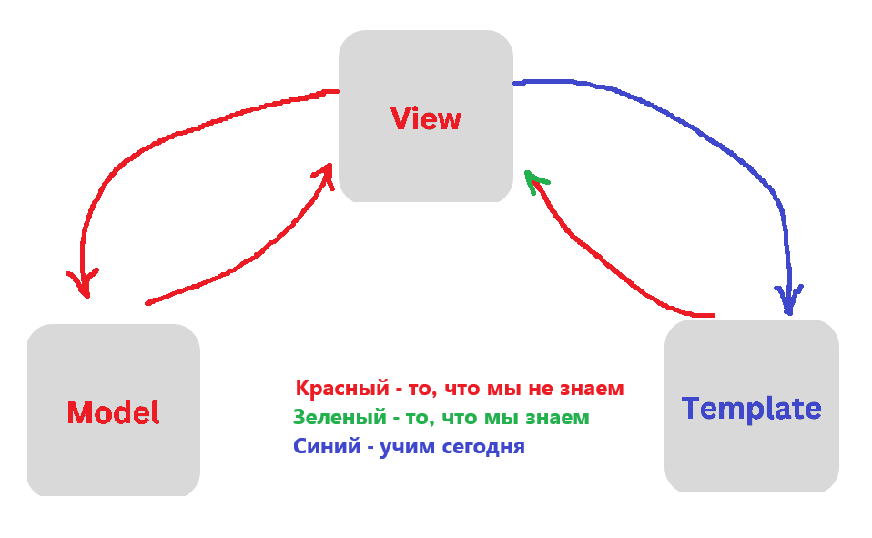

## Введение в Django Templates

Когда мы создаём веб-приложение, одна из главных задач — показать пользователю красивую `HTML`-страницу. Но что делать, если на этой странице должен быть не просто текст, а динамические данные? Например, список товаров, имя пользователя или дата?

Писать `HTML` вручную для каждого случая — очень неудобно и абсолютно непрактично. Здесь нам и приходят на помощь шаблоны (`templates`).

## Что такое шаблоны и зачем они нужны?

**Шаблон** — это обычный `HTML`-файл, в который можно добавить специальный синтаксис `Django`, чтобы вставлять динамические данные прямо в код страницы. Такой подход позволяет сделать `HTML` *«живым»* — он будет меняться в зависимости от ситуации и переданных данных.

Шаблоны позволяют Django:

- Подставлять переменные прямо в `HTML` — например, имя пользователя, список товаров, дату и т.д.
- Разделять логику и отображение — логика остаётся во `view`-функциях, а шаблон отвечает только за внешний вид.
- Переиспользовать один и тот же `HTML`-шаблон с разными данными — это экономит время и упрощает поддержку кода.

Именно шаблоны позволяют нам генерировать динамические страницы без копипаста и лишнего кода. Это один из ключевых инструментов при работе с `Django`.

## Как работает Django с шаблонами?

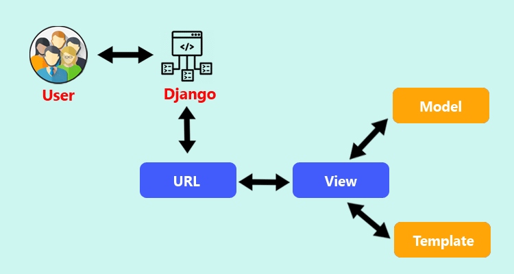

Чтобы понять, как `Django` формирует `HTML`-страницы, представим путь, который проходит каждый запрос пользователя. Это как цепочка действий, где каждая часть отвечает за свою задачу.

На картинке выше изображена архитектура `Django` — `Model–View–Template` (`MVT`).

- Пользователь открывает сайт — и отправляет запрос.
- Этот запрос попадает в Django и сначала проверяется маршрутизатором (URLconf).
- Найдя нужный путь, Django передаёт управление в `View` — это та часть, где мы описываем логику: какие данные получить, как обработать запрос, что вернуть.
- `View` при необходимости обращается к `Model` — это работа с базой данных. Она может что-то запросить, изменить или сохранить.(Пока нас этот блок не интересует)
- Получив нужные данные, `View` подставляет их в шаблон (`Template`).
- `Template` превращается в готовый HTML-код, в котором уже есть данные — например, список товаров, имя пользователя и т.п.
- `Django` возвращает этот `HTML` в браузер, и пользователь видит уже отрисованную страницу.

Таким образом, шаблоны — это конечный этап обработки запроса, который отвечает за красивую подачу данных. Всё, что увидит пользователь — будет результатом работы шаблона.

## Где Django ищет шаблоны?

Когда вы работаете с `HTML`-шаблонами в `Django`, их нужно хранить в специальных папках, чтобы `Django` мог их находить и использовать.

Есть два основных способа хранения шаблонов:

### 1. Внутри приложения (локально)
Каждое приложение в Django может содержать свою папку templates. Это удобно, потому что все шаблоны, относящиеся к этому приложению, будут лежать рядом с ним.

Пример структуры:

```plaintext
my_app/
├── views.py
├── models.py
├── ...
└── templates/
    └── my_app/
        └── hello.html
```

Обрати внимание: внутри `templates/` мы создаём папку с тем же именем, что и приложение — `my_app`. Это не обязательно, но очень рекомендуется, чтобы избежать конфликтов, если в проекте будет много приложений с шаблонами.

### 2. В корневой папке проекта (глобально)

Также можно создать общую папку `templates/` на уровне проекта. Она обычно используется для общих шаблонов — например, главной страницы, страницы ошибки, или позже — базовых шаблонов.

Пример структуры:

```plaintext
my_django_project/
├── my_project/
│   └── settings.py
├── my_app/
│   └── templates/
│       └── my_app/
│           └── hello.html
├── templates/
│   └── some_global_template.html
└── manage.py
```

Чтобы `Django` нашёл шаблоны из этой папки, её нужно указать в `settings.py`. В настройках `TEMPLATES` есть параметр `DIRS`. Туда можно добавить путь до папки `templates`:

```python
TEMPLATES = [
    {
        "BACKEND": "django.template.backends.django.DjangoTemplates",
        "DIRS": ['templates'], #<- глобальная папка с шаблонами
        "APP_DIRS": True,
        "OPTIONS": {
            "context_processors": [
                "django.template.context_processors.debug",
                "django.template.context_processors.request",
                "django.contrib.auth.context_processors.auth",
                "django.contrib.messages.context_processors.messages",
            ],
        },
    },
]
```

Если `APP_DIRS`: `True` — `Django` также будет искать шаблоны внутри каждого приложения `(в my_app/templates/...)`.

### Как выбрать, куда положить шаблон?

- Если шаблон используется только внутри одного приложения, лучше положить его внутрь приложения.
- Если шаблон используется всем проектом (например, общая шапка сайта или главная страница), можно положить его в глобальную папку `templates/`.

Мы пока будем сохранять все наши шаблоны в глобальную папку `templates/`.

## Простой пример

### 1. Создаём папку templates на уровне проекта

На одном уровне с `manage.py`, создим папку `templates/`, а в ней файл `index.html`.

```plaintext
my_project/
├── my_app/
│   └── views.py
├── my_project/
│   ├── settings.py
│   └── urls.py
│
├── templates/
│   └── index.html   ← Шаблон лежит здесь!
│
└── manage.py
```

### 2. Содержимое index.html

```html
<!DOCTYPE html>
<html lang="en">
<head>
    <meta charset="UTF-8">
    <meta name="viewport" content="width=device-width, initial-scale=1.0">
    <title>Hello</title>
</head>
<body>
    <h1>Hello, World!</h1>
</body>
</html>
```

### 3. Обновляем views.py

В файле `myapp/views.py` нужно импортировать обработчик шаблонов, в начало файла добавляем

```python
from django.shortcuts import render
```

**render()** — это встроенная функция Django, которая:

- Принимает HTTP-запрос от пользователя.
- Находит нужный шаблон (HTML-файл).
- Подставляет туда данные (если они есть).
- Возвращает готовый HTML-ответ обратно клиенту.

Нам для начала нужно понимать, что в `render()` нужно передать (`request` — запрос от браузера и вторым параметром `index.html`(**это может быть любой другой шаблон**) в директориях шаблонов (`templates/`, или внутри приложения))

Теперь пусть `hello()` рендерит глобальный шаблон `index.html`:

```python
from django.shortcuts import render

def hello(request):
    return render(request, "index.html")
```

### 4. URL — всё как раньше

В URL после первой лекции можем оставить путь без изменений.

```python
# файл urls.py в папке приложения my_app

from my_app.views import hello, home, hello_fixed, hello_dynamic, hello_id, hello_slug
from django.urls import path

urlpatterns = [
    path("", home),
    path("hello/", hello), # <- оставляем без изменения
    path("hello/fixed", hello_fixed, name="hello_fixed"),
    path("hello/<str:name>/", hello_dynamic, name="hello_name"),
    path("hello/id/<int:user_id>/", hello_id, name="hello_by_id"),
    path("hello/slug/<slug:slug>/", hello_slug, name="hello_by_slug"),
]
```

Теперь при заходе на `http://127.0.0.1:8000/hello/` ты увидишь страницу, сгенерированную из `index.html`, который находится в глобальной папке `templates`.

## Как передать переменные в шаблон?

Только что мы научились выводить статический шаблон для пользователя. У нас есть обычный `HTML`-файл, и `view` просто говорит `Django`: "Отправь этот шаблон пользователю".

```python
def hello(request):
    return render(request, "index.html")
```

Этот пример хорош для понимания, как `Django` ищет и отображает шаблоны. Но, если задуматься: а как нам сделать страницу динамической? Как подставить туда имя пользователя, его возраст или любую другую информацию?

Для этого `Django`-шаблоны умеют принимать данные из `view`-функции. Мы можем передать так называемый `context` — это словарь, в котором ключи становятся переменными в шаблоне.

### Представим следующую ситуацию:

У нас есть пользователь, его зовут `Иван`, и ему `25` лет. Мы хотим, чтобы шаблон приветствовал его по имени и сообщал его возраст.

Для этого мы немного изменим нашу функцию `hello` и передадим в неё `context`:

```python
def hello(request):
    context = {
        "name": "Иван",
        "age": 25
    }
    return render(request, "index.html", context)
```

Значения переданы, но пока они никак не используются, давайте же посмотрим, как отобразить переменные в шаблоне!

Когда мы вызываем `render(request, "index.html", context)`, мы передаём в шаблон третьим аргументом словарь `context`, в котором хранятся данные. Это как посылка: мы кладём в неё нужные переменные, и `Django` приносит их в шаблон.

Теперь внутри `index.html` мы можем использовать эту переменную, чтобы вывести её прямо в `HTML`:

```html
<!-- index.html -->
<!DOCTYPE html>
<html>
<head>
    <title>Приветствие</title>
</head>
<body>
    <h1>Привет, {{ name }}!</h1>
    <p>Тебе {{ age }} лет.</p>
</body>
</html>
```

Конструкция `{{ ... }}` — это синтаксис шаблонного языка `Django`. Всё, что мы передали из `views.py`, можно отобразить с помощью таких двойных фигурных скобок.

**Теперь мы увидим:**

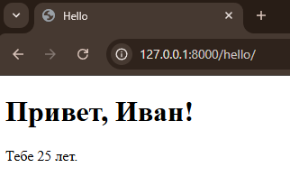

### А если переменной нет?
Если в `context` не было переменной `name`, то `Django` просто ничего не выведет на месте `{{ name }}`. Это безопасно — ошибки не будет, но и данных не будет.

## Пример: передаём разные типы данных в шаблон
В реальных проектах мы часто передаём в шаблон не только строки и числа, но и списки, словари, множества, кортежи. Это необходимо, если вы хотите отобразить таблицу, список товаров, блок новостей или любые другие данные.

**Давайте создадим пример представления:**

```python
from django.shortcuts import render

def hello(request):
    my_num = 42  # Число
    my_str = 'Это просто строка'  # Строка
    my_dict = {"ключ1": "значение1", "ключ2": "значение2"}  # Словарь
    my_list = ['первый элемент', 'второй элемент', 'третий элемент']  # Список
    my_set = {'элемент множества 1', 'элемент множества 2'}  # Множество
    my_tuple = ('первый', 'второй', 'третий')  # Кортеж

    return render(request, 'index.html', {
        'my_num': my_num,
        'my_str': my_str,
        'my_dict': my_dict,
        'my_list': my_list,
        'my_set': my_set,
        'my_tuple': my_tuple,
    })
```

Файл `index.html`

```html
<!DOCTYPE html>
<html>
<head>
    <title>Передача данных в шаблон</title>
</head>
<body>
    <h1>Простые типы</h1>
    <p style="border: 2px solid blue; padding: 5px;">Число: {{ my_num }}</p>
    <p style="border: 2px solid green; padding: 5px;">Строка: {{ my_str }}</p>

    <h1>Коллекции</h1>
    <p style="border: 2px solid red; padding: 5px;">Словарь: {{ my_dict }}</p>
    <p style="border: 2px solid orange; padding: 5px;">Список: {{ my_list }}</p>
    <p style="border: 2px solid purple; padding: 5px;">Множество: {{ my_set }}</p>
    <p style="border: 2px solid pink; padding: 5px;">Кортеж: {{ my_tuple }}</p>
</body>
</html>
```

Все данные, переданные в `context` (в виде словаря), можно вывести в шаблоне через `{{ имя_переменной }}`.

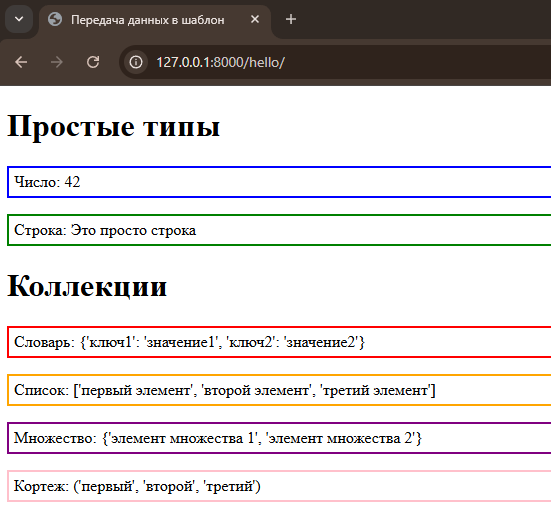

## Логические операторы и циклы


В прошлом примере мы научились передавать данные в шаблон и выводить их в `HTML` как есть — с помощью простого синтаксиса `{{ переменная }}`. Но часто нам нужно не просто отобразить данные, а обрабатывать их в шаблоне: проверять условия или проходиться по коллекциям (спискам, словарям и т.д.).

В `Django`-шаблонах для этого есть логические конструкции. Самые распространённые из них — это:

- `` — условный оператор
- `` — цикл по элементам

### Цикл for в шаблонах

Когда у нас есть список, множество, кортеж или словарь, и мы хотим пройтись по его элементам, мы используем конструкцию ``.

Допустим, в наш шаблон передали список:

```python
def hello(request):
    my_list = ['первый элемент', 'второй элемент', 'третий элемент']

    return render(request, 'index.html', {
        'my_list': my_list,
    })
```

И мы хотим отобразить каждый элемент этого списка отдельно — пишем в шаблоне:

```html
<!DOCTYPE html>
<html lang="en">
  <head>
    <meta charset="UTF-8" />
    <meta name="viewport" content="width=device-width, initial-scale=1.0" />
    <title>Передача данных в шаблон</title>
    <style>
      .Block_List {
        display: flex;
        flex-direction: column;
        align-items: flex-start;
        width: 100%;
      }
      .My_list {
        display: flex;
        flex-direction: column;
        align-items: flex-start;
        width: 100%;
        padding: 0;
      }
      .List_item {
        width: 300px;
        list-style: none;
        padding: 5px;
        margin-top: 10px;
        border: 2px solid red;
      }
    </style>
  </head>
  <body>
    <div class="Block_List">
      <h2>Список</h2>
      <ul class="My_list">
        
        <li class="List_item">{{ item }}</li>
        
      </ul>
    </div>
  </body>
</html>

```

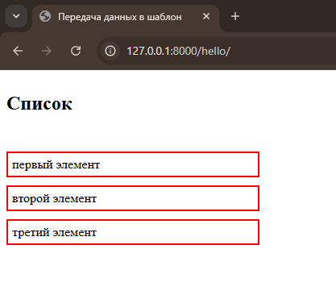

Важно: `for` обязательно закрывается `endfor`. Это похоже на обычный `Python`, но синтаксис без `:` и без отступов.

### Условные конструкции if

А теперь представим, что мы хотим показать блок только при определённом условии.

Например, только если пользователь — админ:

```python
is_admin = True
```

В шаблоне пишем:

```html

  <p>Добро пожаловать, администратор!</p>

  <p>Привет, пользователь!</p>

```

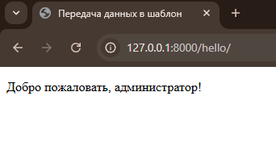

Можно использовать и `elif`:

```html

  <p>Ты ещё слишком юн.</p>

  <p>Здравствуй, взрослый человек.</p>

  <p>Вы мудры и опытны.</p>

```

Обратите вснимание что `if` также нужно закрывать `endif`.

### А теперь — реальный пример

Дополним наш предыдущий шаблон `index.html`, где уже передавали данные, и добавим туда цикл `for` и условие `if`.

Представим, что во `view` у нас такой код:

```python
def hello(request):
    names = ['Иван', 'Мария', 'Алексей']
    is_logged_in = True
    user_age = 25

    return render(request, 'index.html', {
        'names': names,
        'is_logged_in': is_logged_in,
        'user_age': user_age,
    })
```

И вот такой шаблон:

```html
<h1>Добро пожаловать!</h1>


  <p style="color: green;">Вы вошли в систему.</p>

  <p style="color: red;">Пожалуйста, авторизуйтесь.</p>



  <p>Вам нет 18 лет.</p>

  <p>Вы взрослый пользователь.</p>

  <p>Вы пожилой пользователь.</p>


<h2>Список пользователей:</h2>
<ul>
  
    <li>{{ name }}</li>
  
</ul>
```

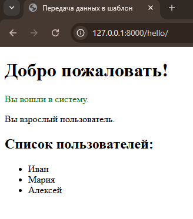

### Дополнительные инструменты в шаблонах: forloop.counter и empty

Шаблонный язык Django предлагает множество удобных инструментов, которые можно использовать прямо внутри `HTML`. Они позволяют нам управлять логикой отображения данных: от простых условий до сложных циклов с проверками.

Полный список таких встроенных возможностей можно найти в официальной [документации](https://docs.djangoproject.com/en/4.2/ref/templates/builtins/)  `Django`:

Но сейчас давай сосредоточимся на двух из них, которые чаще всего используются при работе со списками:

- `forloop.counter` — порядковый номер элемента в цикле
- `` — как показать сообщение, если список пуст

#### forloop.counter — порядковый номер элемента

Когда мы выводим список элементов (например, пользователей, продукты, статьи), часто бывает полезно указать номер каждого элемента.

В Django-шаблоне мы можем это сделать с помощью переменной `forloop.counter`, которая автоматически доступна внутри каждого цикла `for`. Она начинается с `1` и увеличивается на каждой итерации.

**Изменним файл views.py**

```python
# my_app/views.py
def hello(request):
    fruits = ['яблоко', 'банан', 'груша']
    return render(request, 'index.html', {'fruits': fruits})
```

Исправим шаблон:

```html
<h2>Список фруктов:</h2>
<ul>
  
    <li>{{ forloop.counter }}. {{ fruit }}</li>
  
</ul>
```

В браузере увидим:

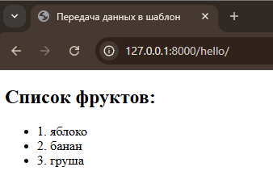

#### empty  — если список пуст

Если коллекция, которую мы хотим отобразить, пуста — мы можем показать понятное сообщение вместо пустого блока. Именно для этого существует ``.

```python
# my_app/views.py
def hello(request):
    fruits = []
    return render(request, 'index.html', {'fruits': fruits})
```

Подправим наш шаблон:

```html
    <h2>Список фруктов:</h2>
    <ul>
      
        <li>{{ fruit }}</li>
      
        <p>Список фруктов пуст.</p>
      
    </ul>
```

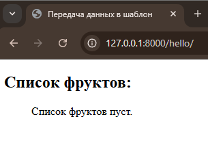

### Что такое  и зачем он нужен?

Когда мы создаём сайты, мы постоянно добавляем ссылки: на главную, на страницу профиля, на список статей и т.д. Самый очевидный способ — просто написать ссылку в `HTML`:

```html
<a href="/home/">Статьи</a>
```

Но такой способ не гибкий:

- если путь изменится в `urls.py`, ты забудешь обновить `HTML` — ссылка сломается
- если ты захочешь переименовать путь, тебе придётся искать и править его в каждом шаблоне

Чтобы избежать этого, Django предлагает тег:

```django

```
Теперь если маршрут переименуется — шаблон продолжит работать, потому что всё привязано к имени маршрута, а не к *"жёстко заданному"* пути.


### Как это работает?

В `urls.py ` мы можем указать имя для маршрута:

```python
from django.urls import path
from .views import hello, home

urlpatterns = [
    path("", home, name="home_page"),
    path("hello/", hello, name="hello_page"),
]
```

А в шаблоне `index.html`:

```html
    <a href="">Приветствие</a>
    <h2>Главная страница</h2>
```

А в шаблоне `hello.html`:

```html
    <a href="">На главную</a>
    <h2>Страница приведствия!</h2>
```

теперь наша главная страница выглядит так:

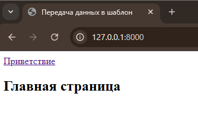

А после того как перейдем по ссылке:

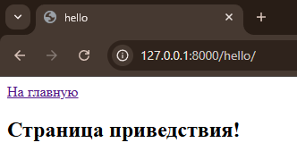

#### Что если маршрут принимает параметры?

Если путь динамический, например:

```python
path("hello/<str:name>/", hello_dynamic, name="hello_dynamic"),
```

То в шаблоне мы передаём аргумент прямо в тег `url`:

```html
<a href="">Привет, Иван</a>
```

Или из переменной:

```html
<a href="">Профиль пользователя</a>
```

Пример — динамические ссылки в списке:

Для начала изменим наш файл `url.py`:

```python
    path("", home, name="home_page"),
    path("hello/<str:name>/", hello, name="hello_page"),
```

Передадим в `index.html` список пользователей через `views.py`, а в :

```python
def hello(request, name):
    return render(request, "hello.html", {"name" : name})


def home(request):
    users = ["alex", "olga", "maria"]
    return render(request, "index.html", {"users": users})
```

Изменим `index.html`:

```html
    <h2>Главная страница</h2>
    <ul>
      
        <li>
          <a href="">{{ user }}</a>
        </li>
      
    </ul>
```

А в шаблоне `hello.html` будем принимать имя пользователя 

```html
    <a href="">На главную</a>
    <h2>Страница приведствия!</h2>
    <h3>Привет, {{name}}</h3>
```

Теперь у каждого пользователя будет своя ссылка: `/hello/alex/`, `/hello/olga/` и т.д.

**Почему это важно?**

- мы не привязываемся к конкретному пути
- Менять `urls.py` — безопасно, ничего не сломается
- Читабельно и удобно
- Работает даже с динамическими маршрутами

## Наследование шаблонов в Django

При разработке любого современного веб-приложения возникает необходимость многократно использовать одну и ту же структуру страниц: шапку сайта, меню, подвал и другие элементы интерфейса, которые повторяются на каждой странице.

Представьте, что у вас есть несколько страниц: главная, «О нас», контакты, список товаров и т.д. И на каждой странице должен быть одинаковый header, меню и footer. Конечно, можно копировать эти элементы вручную, но такой подход быстро становится неудобным — достаточно изменить логотип или ссылку в меню, и придётся редактировать десятки файлов.

#### Зачем нужно наследование шаблонов?

Django предлагает удобный способ решения этой задачи — наследование шаблонов. Это позволяет:

- хранить общую структуру сайта в одном месте (`base.html`);
- в каждом шаблоне описывать только уникальную часть страницы;
- вносить изменения централизованно, без дублирования кода.

#### Как это работает?

Наследование реализуется с помощью двух основных шаблонных тегов:

- `` — указывает, от какого шаблона происходит наследование;
- `` — определяет участок, куда можно вставить собственный контент.

**Пример структуры проекта**

```plaintext
my_project/
├── my_app/
│   └── templates/
│       ├── base.html
│       └── my_app/
│           ├── home.html
│           └── about.html
```

**Пример базового шаблона `base.html `**

```html
<!-- templates/base.html -->
<!DOCTYPE html>
<html lang="ru">
<head>
    <meta charset="UTF-8">
    <title>Сайт компании</title>
</head>
<body>

<header>
    <h1>Мой сайт</h1>
    <nav>
        <a href="/">Главная</a> |
    </nav>
</header>

<hr>

<main>
    
    <!-- Уникальный контент страницы -->
    
</main>

<hr>

<footer>
    <p>© 2025 Все права защищены.</p>
</footer>

</body>
</html>

```

**Пример дочернего шаблона `home.html`**

```html
<!-- templates/my_app/hello.html -->


Главная страница


    <a href="">На главную</a>
    <h2>Страница приведствия!</h2>
    <h3>Привет, {{name}}</h3>

```

Вот так теперь будет выглядеть страничка `hello.html`

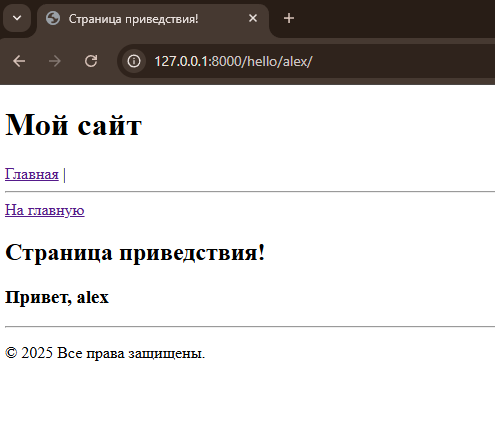

#### Как это работает при запросе?

Когда пользователь переходит на страницу, Django:

- Определяет, какой `view` обрабатывать.
- `View` вызывает шаблон `home.htm`l.
- Django видит, что `home.html `наследует `base.html.`
- Django собирает итоговую HTML-страницу:
  - берёт разметку из `base.html`
  - подставляет в неё содержимое блоков из `home.html`

Именно это позволяет избежать дублирования кода и упростить поддержку.

### Почему одного `base.html` может быть недостаточно?

Когда вы только начинаете проект, одного базового шаблона вполне хватает. В нём можно разместить шапку сайта (`header`) и (`footer`), подключить стили и скрипты, создать блоки content и работать с ними.

Но как только ваш сайт становится сложнее — появляются новые разделы, разные типы пользователей (например, клиенты и администраторы), или требуется особый макет для интернет-магазина — становится неудобно всё подгонять под один шаблон.

**Примеры, когда нужно несколько базовых шаблонов:**

**1. Обычные пользователи и админы**

- `base.html` — для публичного интерфейса (гостям и авторизованным клиентам).
- `admin_base.html` — для панели управления сайтом (сотрудникам и администраторам).

Публичный шаблон может содержать красивую шапку с логотипом, баннеры, футер с контактами. А админский шаблон — минималистичный, без навигации, с тёмной темой и панелью слева.

**2. Интернет-магазин**

- `shop_base.html` — шаблон для магазина: в нём всегда есть корзина, фильтры товаров, категории, избранное.
- `checkout_base.html `— шаблон для оформления заказа, без отвлекающих элементов.

**3. Адаптация под мобильные устройства**

Можно создать `mobile_base.html` и рендерить его, если клиент зашёл с телефона. Конечно, чаще это решается стилями `(CSS/Media Queries)`, но при специфических нуждах — бывает и так.

#### Как это реализуется в Django?

Всё просто: вы создаёте несколько базовых шаблонов и используете extends в зависимости от контекста.

Пример структуры:

```plaintext
templates/
├── base.html             ← основной макет
├── admin_base.html       ← макет админки
├── shop_base.html        ← магазин
└── my_app/
    ├── home.html
    ├── admin_page.html
    └── products.html
```

**Пример: home.html**

```html



<h1>Добро пожаловать на наш сайт!</h1>
<p>Это главная страница, видимая всем.</p>

```

**Пример: admin_page.html**

```html



<h2>Панель управления</h2>
<p>Здесь администратор управляет сайтом.</p>

```

### Как выбрать шаблон в `views.py`?

Вы можете автоматизировать выбор нужного шаблона:

```python
def dashboard(request):
    if request.user.is_staff:
        return render(request, "admin_page.html")
    return render(request, "home.html")
```

А ещё можно использовать условие внутри шаблона:

```django

    

    

```

Но чаще всего выбор шаблона происходит во `views.py`.

**Плюсы такого подхода:**

- Повторное использование шаблонов без дублирования.
- Чёткое разделение макетов под разные части сайта.
- Упрощается поддержка кода — нет необходимости городить условия внутри base.html.
- Увеличивается масштабируемость: сайт растёт — код остаётся чистым.

**Заключение**

Не бойтесь создавать несколько базовых шаблонов. Это нормальная практика в больших проектах. Каждый раздел сайта может наследоваться от своего шаблона, что упрощает разработку и делает структуру логичной.

### Что такое `` и зачем он нужен?

Когда вы создаёте сайт или приложение, у вас часто бывают повторяющиеся части интерфейса: шапка сайта (header), меню, (footer), блоки с сообщениями и т.д.

Чтобы не дублировать код в каждом `HTML`-файле, `Django` позволяет выделить такие куски в отдельные файлы и подключать их в нужные места с помощью тега ``.

Это делает ваш код чище, удобнее для поддержки и переиспользования.

**Простой пример**

Представим, что у нас есть общий шаблон `base.html`, а также повторяющийся блок меню, который мы хотим переиспользовать на всех страницах.

Создаём файл меню `templates/includes/menu.html`:

```html
<nav>
    <ul>
        <li><a href="">На главную</a></li>
    </ul>
</nav>
```

Вставляем меню в базовый шаблон templates/base.html:

```html
<!DOCTYPE html>
<html lang="ru">
<head>
    <meta charset="UTF-8">
    <title>Сайт компании</title>
</head>
<body>
<header>
    <h1>Мой сайт</h1>
    
</header>
<hr>
<main>
    
    <!-- Уникальный контент страницы -->
    
</main>
<hr>
<footer>
    <p>© 2025 Все права защищены.</p>
</footer>

</body>
</html>
```

Теперь на всех страницах, которые наследуются от `base.html`, меню будет автоматически подключаться. И если когда-нибудь нужно изменить меню — достаточно отредактировать один файл, а не бегать по всем шаблонам.


## Фильтры в Django Templates


Когда мы подставляем переменные в шаблон, часто хочется чуть-чуть изменить или отформатировать вывод. 

Например:

- Сделать первую букву заглавной
- Посчитать длину строки
- Отформатировать дату
- Отфильтровать пустые значения

Для этого `Django` предоставляет мощный инструмент — фильтры `(filters)`.

#### Что такое фильтр?

**Фильтр** — это команда, которую можно применить к переменной прямо в шаблоне, чтобы изменить её перед отображением.

Формат:

```django
{{ переменная|фильтр }}
```

Можно даже сцеплять фильтры, передавать параметры, и фильтровать значения в цикле.

#### Примеры фильтров

##### 1. upper — перевод в ВЕРХНИЙ РЕГИСТР

```django
{{ name|upper }}
```

Если `name = "алекс"`, результат будет: `АЛЕКС`

##### 2. lower — в нижний регистр

```django
{{ name|lower }}
```

Если `name = "DJANGO"`, результат будет: `django`

##### 3. title — каждое слово с заглавной

```django
{{ phrase|title }}
```

Если `phrase = "hello from django"`, результат будет: `Hello From Django`

##### 4. length — длина строки или коллекции

```django
{{ my_list|length }}
```

Если `my_list = [1, 2, 3]`, результат будет: `3`

##### 5. date — форматирование даты

```django
{{ current_date|date:"d.m.Y" }}
```

Если `current_date = datetime(2025, 4, 3)`, результат: `03.04.2025`

##### 6. default — значение по умолчанию, если переменная пустая

```django
{{ username|default:"Гость" }}
```

Если `username` пустой — выведется `Гость`

##### 7. join — объединение элементов списка

```django
{{ colors|join:", " }}
```

Если `colors = ['красный', 'зелёный', 'синий']`, результат: `красный, зелёный, синий`

На самом деле их огромное количество, весь список встроенных фильтров можно посмотреть [ТУТ](https://docs.djangoproject.com/en/4.2/ref/templates/builtins/)

Если этого мало, то можно дописывать свои теги и фильтры, документация к вашему [распоряжению](https://docs.djangoproject.com/en/4.2/howto/custom-template-tags/)

## Работа со статикой в Django (CSS, JS, изображения)

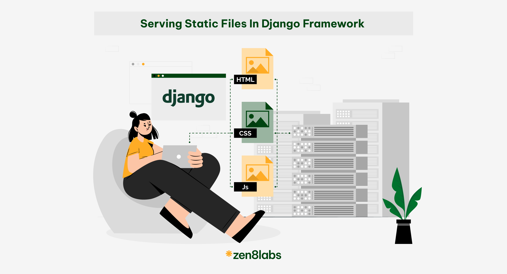

Когда мы создаём веб-приложение, нам нужно не только отображать текст, но и делать сайт красивым и удобным для пользователя. Для этого используются статические файлы:

- CSS — оформление сайта (цвета, шрифты, отступы, стили)
- JavaScript — интерактивность (анимации, клики, динамика)
- Изображения — логотипы, иконки, фотографии

### Что такое "статический файл"?

**Статический файл** — это файл, содержимое которого не меняется при запросе. Например:

- style.css
- logo.png
- main.js

Они не генерируются Django, а просто отдаются как есть при запросе от браузера.

### Где хранятся статические файлы?

Обычно для каждого приложения создаётся папка `static/`, где и хранятся все такие файлы.

```plaintext
my_app/
├── static/
│   └── my_app/
│       ├── style.css
│       └── logo.png
```

Обрати внимание: внутри `static/` принято повторять имя приложения `(my_app)` — это важно для уникальности и организации.

### Настройка статики в Django

Открой файл `settings.py` и проверь, что эти строки уже есть (они создаются автоматически):

```python
STATIC_URL = "static/"
```

Это означает, что все статические файлы будут доступны по `URL` `http://127.0.0.1:8000/static/....`

**Дополнительно (необязательно на этом этапе):**

Для продакшена нужно указать `STATICFILES_DIRS` и `STATIC_ROOT`, но пока нас интересует только `STATIC_URL`.

### Как подключить CSS в шаблоне?

Допустим, у нас есть файл `style.css` в `my_app/static/my_app/style.css`.

В HTML-шаблоне (например, `base.html`) подключаем его так:

- Шаг 1. В самом верху шаблона подключаем ``

```html

```

- Шаг 2. Подключаем CSS-файл

```html
<link rel="stylesheet" href="">
```

Здесь `'my_app/style.css'` — путь относительно папки `static/`

Пример подключения стилей:

```html

<!DOCTYPE html>
<html lang="en">
  <head>
    <meta charset="UTF-8" />
    <meta name="viewport" content="width=device-width, initial-scale=1.0" />
    <link rel="stylesheet" href="" />
    <title>Передача данных в шаблон</title>
  </head>
  <body>
    <h2>Главная страница</h2>
    <ul>
      
      <li><a href="">{{ user|title }}</a></li>
      
    </ul>
  </body>
</html>
```

### Как подключить изображения?

Допустим, вы сохранили картинку в `my_app/static/my_app/logo.png`.

```html

```

### Как подключать JS?

Когда вы работаете с фронтендом, очень часто возникает необходимость добавить какой-то `JavaScript-код`: например, чтобы реагировать на клики, отправлять данные без перезагрузки страницы, добавлять анимации или любые другие интерактивные действия.

В `Django`, как и с `CSS`, мы подключаем `JavaScript-файлы` через статические файлы `(static)`.

```html

<script src=""></script>
```

И теперь ваш `JS-код` будет работать!

**Пример структуры папки static c сss, sass, js:**

```plaintext
my_project/
├── static/
│   └── my_app/
│       ├── scss/
│       │   └── main.scss
│       ├── css/
│       │   └── style.css
│       └── js/
│           └── main.js
```

### Практическое значение и важность

Преимущество использования `` заключается в том, что он обеспечивает правильное разрешение путей к статическим файлам независимо от того, где они находятся. Это особенно важно при деплое (отправке кода на настоящий сервер) приложения, когда может измениться базовый `URL` для статических файлов.

Кроме того, использование `` делает ваш код более устойчивым к изменениям. Например, если вы решите переместить свои статические файлы в другую директорию, вам не придется изменять все шаблоны — достаточно будет обновить настройки.

### Практические рекомендации

- Всегда загружайте библиотеку `static`. Не забывайте добавлять `` в начало ваших шаблонов, где используются статические файлы.

- Не хардкодьте пути к статическим файлам. Всегда используйте `` для создания ссылок на статические файлы.

- Организуйте свои статические файлы логически. Размещайте их в соответствующих поддиректориях, например, `css`, `js`, `images`.