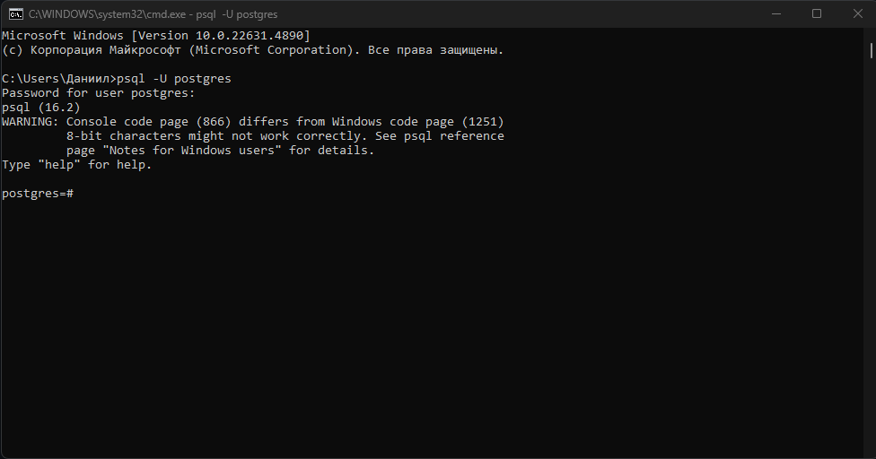

# Лекция 24. Модели в Django. Установка и настройка базы данных PostgreSQL. Связи между моделями. Meta, Abstract, Proxy


## Введение

Когда мы начинаем работать с `Django`, по умолчанию проект использует `SQLite` — это очень простая база данных, которая хранится в одном файле. Она удобна для учебных проектов и быстрого старта. Но как только мы начинаем строить что-то серьёзное — блог, интернет-магазин, корпоративную систему — `SQLite` становится слишком «маленькой» и ограниченной.

Вот тут-то на сцену выходит `PostgreSQL`.

Почему стоит использовать именно PostgreSQL?

- Надёжность — `PostgreSQL` используется многими крупными компаниями, и она считается одной из самых стабильных баз данных.
- Скорость и масштабируемость — когда у вас не 10, а 10 000 записей, `PostgreSQL` работает уверенно и быстро.
- Умная работа с данными — `PostgreSQL` умеет хранить не только таблицы, но и такие вещи как массивы, `JSON`, даты и даже географические координаты.
- Удобство для Django — Django "любит" `PostgreSQL`, потому что с ней работают все фишки фреймворка: поиск по `JSON`, кастомные типы полей и индексы.
- Гибкость и настройка — можно легко подключаться с разных устройств, создавать пользователей с разными правами и безопасно управлять данными.

Всё это делает `PostgreSQL` лучшим выбором для разработки на `Django`, особенно если проект планируется серьёзный и «на вырост».

## Что мы будем учить?


## Установка PostgreSQL

К этому моменту у вас уже должен быть установлен `PostgreSQL`. Если нет, то установите его. Инструкции по установке можно найти [тут](https://github.com/fullt1lt/CoursesPython/blob/main/postgres_installation.md) или [на сайте PostgreSQL](https://www.postgresql.org/download/).

## Создание базы данных и пользователя PostgreSQL.

Для начала зайдем в консоль нашей БД. Для этого откройте терминал и выполните следующие команды:

Для Windows:

```shell
psql -U postgres
```

Для Linux И MacOS:

```bash
sudo -u postgres psql
```

После этого введите пароль от пользователя `postgres`, который вы устанавливали при установке `PostgreSQL`. Если вы всё сделали правильно, то вы увидите что-то вроде этого:



Если нет значит вы что-то сделали не так. Проверьте, правильно ли вы установили `PostgreSQL` и правильно ли указали пароль.

### Создание базы данных

Для создания базы данных в `PostgreSQL` используется команда `CREATE DATABASE`. Например, чтобы создать базу данных с именем `mydatabase` и кодировкой `UTF8`, выполните следующую команду:

```psql
CREATE DATABASE mydatabase WITH ENCODING 'UTF8';
```

После этого вы можете проверить, что база данных была создана, выполнив команду:

```psql
\c mydatabase;
```

Следющий шаг — создание пользователя. Для этого выполните следующую команду:

```psql
CREATE USER myuser WITH PASSWORD 'mypassword';
```

Замените `myuser` и `mypassword` на желаемые имя пользователя и пароль. **Важно придумать надежный пароль, особенно в реальных проектах.**

После этого дадим пользователю права на созданную базу данных:

```psql
GRANT ALL PRIVILEGES ON DATABASE mydatabase TO myuser;
```

Пример как это должно выглядеть:


Если вы используете Postgres 15 и новее. Необходимо выполнить дополнительное действие после предоставления прав к базе данных. Нужно предоставить вашему пользователю права к схеме `public` в новой базе данных.

Для этого нужно подключиться к новой базе если вы еще не подключились:

```psql
\c mydatabase;
```

Где `mydatabase` — это имя вашей базы данных.

И выполнить следующую команду:

```psql
GRANT ALL PRIVILEGES ON SCHEMA public TO myuser;
```

Теперь у вас есть база данных и пользователь, который может к ней подключаться. Вы можете выйти из консоли `PostgreSQL`, выполнив команду:

```psql
\q
```

Но я рекумендую вам оставить консоль открытой, так как мы будем использовать её в дальнейшем, когда будем заполнять файл `settings.py`.

### Установка psycopg:

Чтобы Django мог подключаться к PostgreSQL, ему нужен специальный драйвер. Самый популярный и официальный — это `psycopg` (в новой версии он называется `psycopg` вместо `psycopg2`).
Самое главное, не забываем что `psycopg` должен быть установлен в виртуальном окружении, в котором вы работаете с проектом `Django`. Инструкция [ТУТ](https://github.com/fullt1lt/CoursesPython/blob/main/lesson20.md):

**Windows (cmd, PowerShell):**

```bash
myenv\Scripts\activate
```

Если вы используете Git Bash в Windows или VsCode, то используйте:

```bash
source myenv/Scripts/activate
```

**Mac/Linux (bash, zsh, fish):**

```bash
source myenv/bin/activate
```

После активации в терминале появится `(myenv)` – это значит, что теперь все пакеты будут устанавливаться только внутри `myenv`.

```bash
pip install psycopg
```

Если всё установилось — можно переходить к конфигурации `Django`.

### Настройка Django

Теперь откройте файл `settings.py` вашего проекта и найдите секцию `DATABASES`. Она должна выглядеть примерно так:

```python
DATABASES = {
    'default': {
        'ENGINE': 'django.db.backends.sqlite3',
        'NAME': BASE_DIR / "db.sqlite3",
    }
}
```

Мы будем использовать `PostgreSQL`, поэтому изменим эту секцию на:

```python
DATABASES = {
    'default': {
        'ENGINE': 'django.db.backends.postgresql',
        'NAME': 'mydatabase',           # Имя вашей базы данных
        'USER': 'myuser',         # Имя пользователя
        'PASSWORD': 'mypassword', # Пароль пользователя
        'HOST': 'localhost',      # Хост (обычно localhost)
        'PORT': '5432',           # Порт PostgreSQL (по умолчанию 5432)
    }
}
```

Убедитесь, что вы используете правильные значения для вашей БД, пользователя и пароля.

Теперь, чтобы проверить, что всё работает, запустите сервер `Django`:

```bash
python manage.py runserver
```

Если все быдло сделано правильно, то вы увидите сообщение о том, что сервер запущен и работает:


**Обратите внимание, что в терминале вы можете увидеть предупреждение:**

Когда мы запускаем сервер через `python manage.py runserver`, `Django` сначала делает системную проверку — чтобы убедиться, что всё настроено правильно. И вот здесь мы получили предупреждение:

`You have 18 unapplied migration(s). Your project may not work properly until you apply the migrations for app(s): admin, auth, contenttypes, sessions.`

#### Что это значит?

Когда мы только начинаем проект Django, он уже содержит встроенные приложения:

- `admin` — админ-панель
- `auth` — система авторизации
- `sessions` — работа с сессиями пользователей
- `contenttypes` — поддержка различных типов контента

Эти приложения уже готовы к использованию, но... в базе данных для них пока ничего нет. То есть `Django` говорит: *«У меня есть инструкции, какие таблицы нужны этим приложениям, но я их ещё не создал в базе данных!»*

#### Что такое миграции в Django?

Миграции — это инструкции, по которым Django создаёт таблицы в базе данных. Можно представить их как чертежи или планы строительства:

- Сначала мы описываем модель (класс) в `models.py`, где указываем, какие поля будут в таблице, их типы и связи между ними.
- `Django` на основе этих моделей создаёт файл миграции — в нём прописано, какие поля будут в таблице, как они называются, какие у них типы и связи
- Затем мы применяем миграции, и Django по этим чертежам строит настоящие таблицы в базе данных

#### Применение миграций — команда migrate

Теперь, когда `Django` нас предупредил, что есть неприменённые миграции, самое время их применить. Делается это очень просто:

```bash
python manage.py migrate
```

**Что делает эта команда?**

- Django считывает все файлы миграций (встроенные и созданные тобой).
- Затем он создаёт в базе данных таблицы, описанные в этих миграциях.
- А в специальной служебной таблице (django_migrations) запоминает, что именно уже применено.

**Результат выполнения:**

После запуска команды migrate, в терминале ты увидишь список операций, которые Django проделал:


**Важно:**

**Мы делаем это один раз при первом запуске проекта или каждый раз, когда появляются новые миграции (например, после создания новых моделей).**

Также если в настройках `settings.py` у вас не указано ваше приложение, то команда `migrate` не будет работать. Поэтому убедитесь, что в `settings.py` у вас указано ваше приложение:

```python
INSTALLED_APPS = [
    "django.contrib.admin",
    "django.contrib.auth",
    "django.contrib.contenttypes",
    "django.contrib.sessions",
    "django.contrib.messages",
    "django.contrib.staticfiles",
    "my_app" <-- ваше приложение, которое вы создали ранее
]
```

Теперь, когда все миграции применены, база данных настроена, и можно переходить к созданию собственных моделей в Django!

### Что такое модели Django?

`Модель в Django `— это обычный Python-класс, который наследуется от `django.db.models.Model` и представляет одну таблицу в базе данных. Каждый атрибут класса — это столбец (поле) в таблице.

Проще говоря: `модель → таблица`, `атрибут модели → столбец таблицы`.

Полную документацию по моделям можно найти [тут](https://docs.djangoproject.com/en/4.2/topics/db/models/).

#### Где хранится модель?

По умолчанию модели хранятся в файле `models.py` внутри приложения. Например, если у вас есть приложение `myapp`, то файл будет находиться по пути `myapp/models.py`.

Например, структура проекта будет такая:

```plaintext
my_project/
└── my_app/
    ├── models.py ← вот тут и будут наши модели
    └── ...
```

**После всех настроек, создания базы данных и применения миграций, мы можем создать свою первую модель!!!**

## Первая модель в Django

Перейдите в файл `models.py` вашего приложения и создайте свою первую модель. Например, давайте создадим модель `Product` (товар) для интернет-магазина:

```python
from django.db import models

class Product(models.Model):
    name = models.CharField(max_length=100)  # Название продукта
    price = models.DecimalField(max_digits=10, decimal_places=2)  # Цена
```

Мы создадим модель, которая будет описывать товар в интернет-магазине (или в любой другой системе учёта). Она будет содержать всего два поля:

- `name` – название товара
- `price` – цена товара

Но есть важный момент...Когда мы пишем модель, мы можем не указывать поле `id`. `Django` создаёт его автоматически. Это будет целое число `(IntegerField)` с автоинкрементом — то есть оно будет увеличиваться на 1 с каждой новой записью.

Хотя мы явно указали только два поля — `name` и `price`, Django "под капотом" добавляет третий столбец:

```sql
id INTEGER PRIMARY KEY AUTOINCREMENT
```

После того, как вы создали модель, вам нужно создать миграцию для неё. Это делается с помощью команды:

```bash
python manage.py makemigrations
```

Если всё в порядке, ты увидишь примерно такое сообщение:

```bash
Migrations for 'my_app':
  my_app/migrations/0001_initial.py
    - Create model Product
```

Теперь `Django` создал файл миграции — это `Python-файл`, в котором описано, какую таблицу и поля нужно создать.

Он будет находиться в папке `migrations` вашего приложения. Например, если у вас приложение `my_app`, то файл будет находиться по пути `my_app/migrations/0001_initial.py`. И выглядеть примерно так:

```python
from django.db import migrations, models


class Migration(migrations.Migration):

    initial = True

    dependencies = []

    operations = [
        migrations.CreateModel(
            name="Product",
            fields=[
                (
                    "id",
                    models.BigAutoField(
                        auto_created=True,
                        primary_key=True,
                        serialize=False,
                        verbose_name="ID",
                    ),
                ),
                ("name", models.CharField(max_length=100)),
                ("price", models.DecimalField(decimal_places=2, max_digits=10)),
            ],
        ),
    ]
```

Применение миграции
Теперь нужно применить эту миграцию к базе данных:

```bash
python manage.py migrate
```

Если вы всё сделали правильно, увидите сообщение вроде:

```bash
Operations to perform:
  Apply all migrations: admin, auth, contenttypes, my_app, sessions
Running migrations:
  Applying my_app.0001_initial... OK
```

Готово! Теперь в нашей базе данных появилась таблица `my_app_product`, и в ней три поля: `id (автоинкрементный ключ)`, `name`, `price`.

#### Как проверить, что таблица создана?

Чтобы убедиться, что миграция не применена/применена, используется команда:

```bash
python manage.py showmigrations
```

После выполнения этой команды вы увидите список всех миграций, которые были применены к базе данных:

```bash
$ python manage.py showmigrations
admin
 [X] 0001_initial
 [X] 0002_logentry_remove_auto_add
 [X] 0003_logentry_add_action_flag_choices
auth
 [X] 0001_initial
 [X] 0002_alter_permission_name_max_length
 [X] 0003_alter_user_email_max_length
 [X] 0004_alter_user_username_opts
 [X] 0005_alter_user_last_login_null
 [X] 0006_require_contenttypes_0002
 [X] 0007_alter_validators_add_error_messages
 [X] 0008_alter_user_username_max_length
 [X] 0009_alter_user_last_name_max_length
 [X] 0010_alter_group_name_max_length
 [X] 0011_update_proxy_permissions
 [X] 0012_alter_user_first_name_max_length
contenttypes
 [X] 0001_initial
 [X] 0002_remove_content_type_name
my_app
 [X] 0001_initial # <--- Ваша миграция
sessions
 [X] 0001_initial
```

Если вы видите `[X]` перед вашей миграцией, значит она успешно применена. Если вы видите `[ ]`, значит миграция не применена.

## Админка

`Django Admin` - это специальный веб-интерфейс, который автоматически создаётся вместе с проектом. Через него можно:

- Добавлять, изменять и удалять объекты моделей (например, товары).
- Искать, фильтровать и сортировать данные.
- Управлять пользователями, правами доступа, и многое другое.

### Создаём суперпользователя

Чтобы войти в админку, нужен пользователь с правами администратора. Создаём его с помощью команды:

```bash
python manage.py createsuperuser
```

После ввода этой команды Django поочерёдно попросит ввести:

- Имя пользователя (Username) – обязательно.
- Email address – не обязательно, можно просто нажать Enter.
- Пароль – дважды, для подтверждения.

**Важно! Когда вы вводите пароль — в терминале не отображается ни одна буква или символ. Это нормально и сделано для безопасности.**


#### Что, если пароль слабый?

На скриншоте видно, что Django может не принять введённый пароль и вывести предупреждение:

- `This password is too short.` — пароль слишком короткий.
- `This password is too common.` — слишком простой и легко угадываемый.
- `This password is entirely numeric.` — состоит только из цифр.

Тем не менее, Django спросит:

```pgsql
Bypass password validation and create user anyway? [y/N]:
```

Если вы всё равно хотите создать пользователя с этим паролем (например, для тестов на локальной машине), введите `y` и нажмите `Enter`.

Если все пареметры введены правильно, вы увидите сообщение:


### Проверям URL админки

В файле `urls.py` при создании проекта автоматически добавляется URL для админки, если вы не удаляли его:

```python
urlpatterns = [
    path("admin/", admin.site.urls), # <-- URL админки
    path("", include("my_app.urls"))
]
```

### Запуск сервера и вход в админку

Теперь запустите сервер:

```bash
python manage.py runserver
```

После чего откройте браузер и перейдите по адресу в админку:

```plaintext
http://127.0.0.1:8000/admin/
```


Введите имя пользователя и пароль, которые вы создали ранее. Если всё правильно, вы увидите админку:


Как видно на скриншоте, в админке уже есть модели `User`, `Group`. Это встроенные модели `Django`, которые отвечают за пользователей и группы пользователей. Но нашей модели `Product` там нет. Для этого ее нужно зарегистрировать.

### Добавим модель в админку

Открываем файл `my_app/admin.py` (он уже есть по умолчанию) и добавим:

```python
from django.contrib import admin
from .models import Product  # импортируем нашу модель

admin.site.register(Product)  # регистрируем модель
```

Теперь `Django` "узнает", что модель `Product` должна отображаться в интерфейсе администратора.

Теперь обновим страницу админки и увидим, что модель `Product` появилась в списке:


Теперь мы можем добавлять, редактировать и удалять товары через админку.

## Кастомная Админка

Когда мы впервые регистрируем модель в админке, Django отображает её "как есть": минимально, без фильтров, без поиска и без колонок, которые могут быть действительно полезны. Но у нас есть мощный инструмент — класс `ModelAdmin`. Сылка на документацию [тут](https://docs.djangoproject.com/en/4.2/ref/contrib/admin/#modeladmin-options).

Давай разберёмся, как сделать админку более информативной и удобной шаг за шагом.

Для начала добавим в нашу модель `Product` меджик-метод `__str__`, который будет возвращать строковое представление объекта. Это нужно, чтобы в админке отображалось название товара, а не его ID:

```python
# models.py
from django.db import models

class Product(models.Model):
    name = models.CharField(max_length=100)
    price = models.DecimalField(max_digits=8, decimal_places=2)

    def __str__(self):
        return self.name
```

Потом в файле `admin.py` добавим класс `ProductAdmin`, который будет наследоваться от `admin.ModelAdmin`. Этот класс позволяет кастомизировать админку для нашей модели:

```python
# admin.py
from django.contrib import admin
from .models import Product

class ProductAdmin(admin.ModelAdmin):
    list_display = ("id", "name", "price")  # колонки, которые будут отображаться
    search_fields = ("name",)               # поле для поиска
    list_filter = ("price",)                # фильтр сбоку

admin.site.register(Product, ProductAdmin)
```

Что мы сделали:

- `list_display` – указали, какие поля должны отображаться в списке объектов. По умолчанию показывается только __str__(), а так — видно и ID, и цену.
- `search_fields` – добавили поле поиска по названию. Теперь можно быстро находить нужный продукт.
- `list_filter` – добавили фильтр по цене. Удобно, если у нас много товаров.

Теперь, создамим несколько товаров через админку и увидим, что интерфейс стал более удобным:


### Изменение формы редактирования

Если мы хотим настроить, какие поля и в каком порядке будут отображаться при создании или редактировании объекта:

```python
class ProductAdmin(admin.ModelAdmin):
    fields = ("name", "price")  # порядок и доступные поля
```

Можно также разбить форму на разделы:

```python
class ProductAdmin(admin.ModelAdmin):
    fieldsets = (
        ("Основная информация", {"fields": ("name",)}),
        ("Финансы", {"fields": ("price",)}),
    )
```

### Дополнительные возможности кастомизации админки

| Возможность  | Описание                                                                                                                   |
| ----------------------- | ---------------------------------------------------------------------------------------------------------------------------------- |
| `readonly_fields`     | Делает указанные поля только для чтения в админке.                                       |
| `prepopulated_fields` | Автоматически заполняет поле на основе другого (например,`slug` из `name`). |
| `ordering`            | Задаёт порядок сортировки записей по умолчанию в списке.                           |
| `date_hierarchy`      | Добавляет навигацию по датам сверху страницы списка объектов.                 |
| `list_per_page`       | Количество объектов на одной странице в списке.                                            |

**Пример: более продвинутый ModelAdmin**

```python
from django.contrib import admin
from .models import Product

class ProductAdmin(admin.ModelAdmin):
    list_display = ("id", "name", "price")  # Отображаемые колонки в списке объектов
    list_filter = ("price",)               # Боковой фильтр по полю "price"
    search_fields = ("name",)              # Поиск по полю "name"
    ordering = ("-price",)                 # Сортировка по убыванию цены
    readonly_fields = ("id",)              # Поле "id" нельзя изменить вручную
```

## Основные типы полей в моделях Django

Django предоставляет широкий набор полей для описания структуры таблиц в базе данных. Все они наследуются от `Field` и имеют свои особенности. Подробно ознакомиться с ними можно [тут](https://docs.djangoproject.com/en/4.2/ref/models/fields/).

Самым главным полем явслеется `id`. Оно создаётся автоматически, если вы не указали его в модели. Это поле `Primary Key` является первичным ключом и используется для уникальной идентификации каждой записи в таблице.

### Текстовые поля:

#### `CharField(max_length=...)`

Поле для хранения коротких строк (например, имя, название продукта). Обязательный параметр — `max_length`, который указывает максимально допустимую длину строки.

```python
title = models.CharField(max_length=100)
```

Применяется для заголовков, имён, `email-адресов` и прочего фиксированного текста.

#### `TextField()`

Поле для хранения больших объемов текста, таких как описания, статьи, комментарии. Не требует указания `max_length`.

```python
description = models.TextField()
```

Подходит для длинных описаний, заметок, отзывов и т.д.

### Числовые поля:

#### `IntegerField()`

Хранит целые числа — положительные или отрицательные.

```python
age = models.IntegerField()
```

Используется для хранения возраста, количества, уровня, баллов.

#### `FloatField()`

Хранит дробные числа с плавающей точкой (например, 4.75, 0.99).

```python
rating = models.FloatField()
```

Применимо к значениям, где нужна примерная точность — например, рейтинг, температура, координаты.

#### DecimalField()

Хранит точные десятичные числа — идеально для денег.

- `max_digits` — общее количество всех цифр.
- `decimal_places` — сколько цифр после запятой.

```python
price = models.DecimalField(max_digits=8, decimal_places=2)
```

Лучше использовать для цен и финансов, где важна точность округления.

### Булевы значения:

#### BooleanField()

Хранит логическое значение `True` или `False`.

```python
is_active = models.BooleanField(default=True)
```

Отлично подходит для флагов: включено/выключено, опубликовано/не опубликовано и т.д.

### Дата и время:

#### DateField()

Хранит только дату — без времени.

```python
birth_date = models.DateField()
```

Используется для дней рождения, дат событий, сроков и т.п.

#### DateTimeField()

Хранит дату и время. Часто используется с параметрами:

- `auto_now_add=True` — установить время создания.
- `auto_now=True` — обновлять время при каждом сохранении.


```python
created_at = models.DateTimeField(auto_now_add=True)
updated_at = models.DateTimeField(auto_now=True)
```

Подходит для логирования времени создания и обновления записей.

### EmailField:

#### EmailField()

Такой же как `CharField`, но дополнительно проверяет, что введено корректное значение `email`.

```python
email = models.EmailField()
```

Полезен для валидации адресов электронной почты при регистрации и обратной связи.

### JSONField (только PostgreSQL)

Позволяет сохранять структурированные данные в формате JSON прямо в поле модели. Работает только с PostgreSQL.

```python
metadata = models.JSONField()
```

Используется для хранения гибких, вложенных и изменяемых данных (например, опции товара, параметры, фильтры).

### Параметры полей: null, blank, default

Когда мы создаём поля в моделях Django, мы не просто определяем тип данных (например, CharField, IntegerField, BooleanField). Мы также можем гибко управлять поведением этих полей:

- Разрешать ли пустое значение?
- Подставлять ли значение по умолчанию?
- Как вести себя при работе с формами?

Именно для этого используются параметры `null`, `blank` и `default`.

#### `null=True` и `blank=True `— в чём разница?

##### null=True

Этот параметр говорит Django: *"Разреши хранить в базе данных значение `NULL` в этом поле."* Применяется на уровне базы данных.

```python
description = models.TextField(null=True)
```

Если у записи не будет описания — в базе будет храниться `NULL` вместо строки.

##### blank=True

А это уже для форм и валидации: *"Разреши оставить это поле пустым в форме."*

```python
description = models.TextField(blank=True)
```

Это позволяет не заполнять поле в админке, при отправке форм и т.д.

**Важно!** Часто `null=True` и `blank=True` указывают вместе, если хотим, чтобы поле было необязательным везде:

```python
description = models.TextField(null=True, blank=True)
```

#### default=... — значение по умолчанию

С этим параметром можно указать что будет подставляться, если пользователь ничего не ввёл.

```python
is_active = models.BooleanField(default=True)
```

Если при создании объекта не указать значение поля `is_active`, `Django` сам установит `True`.

Можно задавать:

- строки → `default="Hello"`
- числа → `default=0`
- `datetime.now` → для временных полей
- `list`, `dict` → для `JSONField()` (с осторожностью!)

```python
from datetime import datetime

created_at = models.DateTimeField(default=datetime.now)
```

### Работа с медиафайлами в Django

Иногда в вашем проекте пользователи будут загружать фотографии, документы, аудио или другие файлы. Например:

- Картинки товаров в интернет-магазине
- Аватарки пользователей
- Загруженные резюме в PDF
- Видео- или аудиофайлы

`Django` предоставляет всё необходимое, чтобы загружать, хранить и отображать медиафайлы. Давайте разберём, как это сделать.

#### 1. Настройка settings.py

Чтобы Django знал, куда сохранять загружаемые файлы, и как их потом отдавать в браузер, нужно добавить две настройки:

```python
# settings.py

import os

MEDIA_URL = '/media/'  # URL-адрес, по которому будут доступны медиафайлы
MEDIA_ROOT = os.path.join(BASE_DIR, 'media')  # Путь, куда файлы сохраняются
```

- `MEDIA_URL` — это виртуальный путь, по которому браузер будет обращаться к файлам.
- `MEDIA_ROOT` — это физическая папка на вашем компьютере, где Django будет сохранять загруженные файлы.

После добавления настроек, убедитесь, что у вас создана папка `media/` в корне проекта.

У вас должна быть вот такая структура:

```plaintext
my_project/
├── my_app/
│   ├── migrations/
│   ├── __init__.py
│   ├── admin.py
│   ├── apps.py
│   ├── models.py
|   ├── tests.py
|   └── views.py
├── media/  # <-- папка для медиафайлов
├── my_project/
|
└── manage.py
```
#### 2. Настройка URL для разработки

В режиме разработки (с локальным сервером) `Django` сам может отдавать файлы, если мы укажем нужный путь в `urls.py`.

В конце `urls.py` главного проекта (не приложения!), добавьте:

```python
from django.conf import settings
from django.conf.urls.static import static

urlpatterns = [
    # ваши маршруты
]

# Только в режиме отладки!
if settings.DEBUG:
    urlpatterns += static(settings.MEDIA_URL, document_root=settings.MEDIA_ROOT)

```

>В продакшене (на боевом сервере) обычно используется отдельный сервер (например, Nginx или Apache) для обработки медиа-файлов. Рассмотрим это в самом конце курса.

Теперь все файлы, сохранённые в `media/`, будут доступны по пути `/media/имя_файла`.

#### 3. Поля FileField и ImageField

Теперь давайте научимся создавать поля в моделях, в которых будут храниться загруженные файлы.

##### FileField – для любых файлов

Если вы хотите разрешить загружать любой тип файлов (PDF, DOCX, ZIP, MP3...), используйте `FileField`.

```python
from django.db import models

class Document(models.Model):
    title = models.CharField(max_length=100)
    uploaded_file = models.FileField(upload_to='documents/')
```

Параметр `upload_to='documents/'` говорит `Django`: сохранить файл в папку `media/documents/`.

##### ImageField – только для изображений

Если вы работаете с картинками, используйте `ImageField` — он проверяет, что загружается именно изображение.

```python
class Product(models.Model):
    name = models.CharField(max_length=100)
    image = models.ImageField(upload_to='products/')
```

Важно: `ImageField` требует, чтобы у вас была установлена библиотека `Pillow`, иначе будет ошибка.

Устанавливаем(**Все усанавлеваем в виртуальное окружение!**):

```bash
pip install Pillow
```

#### 4. Загрузка файлов через админку

После того как вы добавили `FileField` или `ImageField` в модель и зарегистрировали её в `admin.py`, вы сможете:

- Загружать файлы прямо из панели администратора.
- Просматривать путь к файлу.

Загруженные файлы будут сохраняться в папке media/.

**Пример: Модель с изображением**

```python
class Products(models.Model):
    name = models.CharField(max_length=100)
    price = models.DecimalField(max_digits=8, decimal_places=2)
    image = models.ImageField(upload_to='products_foto/')

    def __str__(self):
        return self.name
```

Если пользователь загрузит фото с именем `phone.jpg`, оно будет сохранено как:

```plaintext
media/news_photos/cat.jpg
```

#### 5 Отображение изображения в шаблоне

Чтобы отобразить загруженное изображение в `HTML`, используем шаблонный тег `{{ объект.поле.url }}`:

```html

```

Не забудьте в шаблоне подключить `static` и `media`:

```django

```

## Как сделать свой собственный параметр, который будет `primary key` вместо 'id'

В Django, по умолчанию, для каждой модели создается поле `id`, которое является автоинкрементируемым целым числом и
служит в качестве первичного ключа (Primary Key). Однако, Django предоставляет гибкие возможности для управления этим
параметром, если вам нужно заменить его или использовать другой тип данных для первичного ключа.

### Использование собственного поля в качестве Primary Key

Вы можете определить собственное поле в модели и использовать его в качестве Primary Key, просто установив
параметр `primary_key=True`. Например:

```python
from django.db import models


class MyModel(models.Model):
    custom_id = models.CharField(max_length=50, primary_key=True)
    name = models.CharField(max_length=100, db_index=True)
```

В этом примере поле `custom_id` будет использоваться в качестве первичного ключа вместо стандартного `id`.

Либо использовать AutoField

```python
from django.db import models


class MyModel(models.Model):
    custom_id = models.AutoField(primary_key=True)
    name = models.CharField(max_length=100)
```

Тогда ваш `custom_id` - будет полной имитацией оригинального `id`.

## Cвязи

Вспомним, что `Django` использует реляционную базу данных (`PostgreSQL`, `SQLite`, `MySQL` и т. д.). А значит, мы можем и должны использовать связи между таблицами, чтобы грамотно организовать данные:

- У каждого товара есть категория
- У каждой статьи есть автор
- У заказа может быть несколько товаров
- У пользователя может быть только один профиль

Все эти отношения мы описываем через связи между моделями.

В Django для связи моделей используются специальные поля:

- `OneToOne` - связь один-к-одному
- `ForeignKey` - связь один-ко-многим
- `ManyToMany` - связь многие-ко-многим

Разберём каждую подробно.

### OnetoOne

Связь "один к одному" применяется, когда каждая запись в одной таблице соответствует ровно одной записи в другой. Это удобно, например, чтобы вынести дополнительные данные пользователя в отдельную таблицу.

```python
from django.db import models

class Customer(models.Model):
    name = models.CharField(max_length=120)
    age = models.IntegerField()

class CustomerSettings(models.Model):
    preferred_color = models.CharField(max_length=50)
    customer = models.OneToOneField(Customer, on_delete=models.CASCADE, related_name='settings')
```
Теперь каждый `Customer` может иметь ровно один `CustomerSettings`. Если удалить клиента — настройки удалятся тоже.

---

### ForeignKey (Один ко многим)

Наиболее распространённая связь. Подходит, когда одна запись может быть связана с несколькими другими, но каждая из них — только с одной.

```python
class Author(models.Model):
    name = models.CharField(max_length=120)

class Book(models.Model):
    name = models.CharField(max_length=120)
    year_of_public = models.DateField()
    author = models.ForeignKey(Author, on_delete=models.CASCADE, related_name='books')
```
Теперь у каждой книги есть один автор, а один автор может написать много книг. Через `related_name='books'` мы можем обратиться к `author.books.all()`.

---

### ManyToMany (Многие ко многим)

Когда обе стороны могут иметь множество объектов друг друга — используется связь `ManyToMany`. Например, фильмы и актёры:

```python
class Actor(models.Model):
    name = models.CharField(max_length=100)

class Movie(models.Model):
    title = models.CharField(max_length=100)
    actors = models.ManyToManyField(Actor, related_name='movies')
```
Один актёр может сниматься в нескольких фильмах, и один фильм может иметь множество актёров.

---

### ManyToMany через промежуточную модель (through)

Иногда нам нужно добавить дополнительную информацию о связи — например, когда человек вступил в группу. Тогда мы создаём промежуточную модель и указываем `through=`.

```python
class Person(models.Model):
    name = models.CharField(max_length=128)

class Group(models.Model):
    name = models.CharField(max_length=128)
    members = models.ManyToManyField(Person, through='Membership')

class Membership(models.Model):
    person = models.ForeignKey(Person, on_delete=models.CASCADE)
    group = models.ForeignKey(Group, on_delete=models.CASCADE)
    date_joined = models.DateField()
    invite_reason = models.CharField(max_length=64)
```

Теперь у нас есть доступ к информации о дате вступления в группу и причине приглашения. Это мощный инструмент для сложных отношений между моделями.

## class Meta в моделях Django

Когда мы создаём модель в `Django`, чаще всего мы описываем поля таблицы: `CharField`, `IntegerField`, `ForeignKey` и так далее. Но иногда нам нужно задать дополнительные настройки модели, которые не относятся напрямую к полям, но влияют на поведение модели внутри Django и в базе данных.

Для этого в Django-моделях используется внутренний класс `Meta`.

>Этот класс не обязателен, но даёт нам гибкий способ управлять поведением модели.

### Зачем нужен class Meta?

`Meta` позволяет:

- изменить имя таблицы в базе данных;
- указать порядок сортировки объектов по умолчанию;
- задать человекочитаемое имя модели;
- указать, является ли модель абстрактной;
- задать уникальные ограничения;
- установить права доступа;
- и многое другое.

Пример базовой модели с Meta

```python
from django.db import models

class Product(models.Model):
    name = models.CharField(max_length=100)
    price = models.DecimalField(max_digits=8, decimal_places=2)

    class Meta:
        ordering = ['-price']  # Сортировка по убыванию цены
        verbose_name = "Продукт" # Человекочитаемое имя модели в единственном числе
        verbose_name_plural = "Продукты" # Человекочитаемое имя модели во множественном числе

    def __str__(self):
        return self.name
```

В этом примере мы указали, что объекты `Product` будут сортироваться по убыванию цены, а также задали человекочитаемые имена для модели в единственном и множественном числе.

| Параметр           | Описание                                                                                       |
|--------------------|------------------------------------------------------------------------------------------------|
| `ordering`         | Устанавливает сортировку по умолчанию при выборке из базы. Пример: `ordering = ['-created_at']` — сортировка от новых к старым. |
| `verbose_name`     | Человекочитаемое имя модели в админке Django.                                                  |
| `verbose_name_plural` | Множественное число имени модели.                                                           |
| `db_table`         | Имя таблицы в базе данных (по умолчанию Django называет таблицу как `appname_modelname`).     |
| `unique_together`  | Ограничение уникальности на несколько полей одновременно.                                      |
| `permissions`      | Пользовательские права для модели.                                                             |
| `abstract = True`  | Делает модель абстрактной (не создаёт таблицу в БД, но позволяет наследовать поля).            |
| `managed = False`  | Указывает, что Django не должен управлять таблицей (не создаёт, не удаляет, не мигрирует). Используется при работе с внешними таблицами. |


**Пример использования `db_table` и `unique_together`**

```python
class Student(models.Model):
    first_name = models.CharField(max_length=50)
    last_name = models.CharField(max_length=50)

    class Meta:
        db_table = 'custom_student_table'
        unique_together = ('first_name', 'last_name')
```

**Здесь:**

- Django создаст таблицу с именем `custom_student_table` вместо `my_app_student`.
- нельзя будет добавить двух студентов с одинаковыми именем и фамилией.

## Валидация моделей: clean(), full_clean() и ограничения данных

Когда мы создаём модели в Django, важно не только описать структуру таблиц, но и задать правила валидации — то есть проверить, что данные, которые попадают в базу, корректные. `Django` позволяет делать это на нескольких уровнях:

- на уровне отдельных полей — с помощью встроенных валидаторов и параметров (например, `validators`, `unique=True`, `choices`);
- на уровне модели целиком — через методы `clean()` и `full_clean()`, где можно описывать более сложные зависимости между полями;
- и на уровне базы данных — с помощью уникальных и проверочных ограничений (`UniqueConstraint`, `CheckConstraint` и других).

Все эти уровни дополняют друг друга. Простые проверки лучше описывать прямо в полях, бизнес-логику — в методах модели, а правила целостности данных, которые должны соблюдаться при любых обстоятельствах — в базе данных.

### Валидаторы на уровне полей

Иногда нужно проверить правильность значения одного конкретного поля — например, чтобы цена не была отрицательной, рейтинг не выходил за пределы `0–5,` а `slug` содержал только допустимые символы.
Для этого в Django используются валидаторы — специальные функции или классы, которые проверяют данные и, если они не проходят проверку, вызывают исключение `ValidationError`.

Django уже содержит большой набор готовых валидаторов, но при необходимости можно писать и свои.

```python
from django.db import models
from django.core.validators import MinValueValidator, MaxValueValidator, RegexValidator

slug_validator = RegexValidator(
    r'^[a-z0-9-]+$', 
    'Разрешены только строчные латинские буквы, цифры и дефис.'
)

class Product(models.Model):
    name = models.CharField(max_length=100)
    slug = models.CharField(max_length=120, unique=True, validators=[slug_validator])
    price = models.DecimalField(
        max_digits=10,
        decimal_places=2,
        validators=[MinValueValidator(0)]
    )
    rating = models.FloatField(
        null=True, blank=True,
        validators=[MinValueValidator(0.0), MaxValueValidator(5.0)]
    )
```

В этом примере:

- поле `price` не позволит сохранить отрицательное значение;
- поле `rating` должно быть между 0 и 5;
- поле `slug` проверяется регулярным выражением — допускаются только строчные латинские буквы, цифры и дефис.

Эти проверки будут работать в админке, в формах, в сериализаторах(о них поговорим на rest_framework) и при ручном вызове метода `full_clean()`.

#### Основные встроенные валидаторы Django

Django предоставляет готовые валидаторы, которые можно применять сразу — без написания дополнительного кода:

| Валидатор                           | Назначение                                                                                | Пример                                                                         |
| ----------------------------------- | ----------------------------------------------------------------------------------------- | ------------------------------------------------------------------------------ |
| **MinValueValidator**               | Проверяет, что значение не меньше заданного минимума.                                     | `price = models.DecimalField(..., validators=[MinValueValidator(0)])`          |
| **MaxValueValidator**               | Проверяет, что значение не превышает указанный максимум.                                  | `age = models.IntegerField(validators=[MaxValueValidator(120)])`               |
| **MinLengthValidator**              | Проверяет минимальную длину строки.                                                       | `password = models.CharField(validators=[MinLengthValidator(8)])`              |
| **MaxLengthValidator**              | Проверяет максимальную длину строки.                                                      | `comment = models.TextField(validators=[MaxLengthValidator(500)])`             |
| **RegexValidator**                  | Проверяет значение по регулярному выражению.                                              | `slug = models.CharField(validators=[RegexValidator(r'^[a-z0-9-]+$')])`        |
| **EmailValidator / validate_email** | Проверяет корректность email-адреса.                                                      | `email = models.EmailField(validators=[EmailValidator()])`                     |
| **URLValidator**                    | Проверяет корректность URL.                                                               | `link = models.URLField(validators=[URLValidator()])`                          |
| **FileExtensionValidator**          | Проверяет расширение загружаемого файла.                                                  | `file = models.FileField(validators=[FileExtensionValidator(['pdf', 'jpg'])])` |
| **validate_slug**                   | Проверяет, что значение подходит для slug (только латиница, цифры, дефис, подчёркивание). | `slug = models.SlugField(validators=[validate_slug])`                          |

Несколько валидаторов для одного поля

К одному полю можно применить сразу несколько валидаторов — Django проверит их все последовательно:

```python
from django.core.validators import MinValueValidator, MaxValueValidator, RegexValidator

class Product(models.Model):
    name = models.CharField(
        max_length=100,
        validators=[
            RegexValidator(r'^[A-Za-z0-9\s]+$', 'Название может содержать только буквы, цифры и пробелы.')
        ]
    )
    price = models.DecimalField(
        max_digits=10,
        decimal_places=2,
        validators=[
            MinValueValidator(0),
            MaxValueValidator(100000)
        ]
    )
```

Теперь Django проверит:

- что название соответствует шаблону (только буквы, цифры и пробелы);
- что цена не меньше нуля и не больше `100 000`.

Где и когда срабатывают валидаторы

- В админке — при сохранении объекта через интерфейс администратора;
- В формах и `ModelForm` — при вызове метода `is_valid()`;
- При ручной проверке — если вызвать `instance.full_clean()` перед сохранением.

Если валидация не пройдена, Django поднимет `ValidationError` и не позволит сохранить объект в базу данных.

Валидаторы подходят для простых и независимых проверок отдельных полей.
Когда нужно проверить взаимосвязь нескольких полей сразу — используют метод `clean()`, о котором поговорим дальше.

### Метод clean() — проверки на уровне модели

Если правило касается сразу нескольких полей (например, скидка не может быть больше 100%, или цена не может быть отрицательной), то нужно использовать метод `clean()`.

```python
from django.core.exceptions import ValidationError, NON_FIELD_ERRORS

class Product(models.Model):
    name = models.CharField(max_length=100)
    price = models.DecimalField(max_digits=10, decimal_places=2)
    discount_percent = models.PositiveIntegerField(default=0)

    def clean(self):
        super().clean()

        errors = {}

        if self.discount_percent > 100:
            errors['discount_percent'] = 'Скидка не может быть больше 100%.'

        if self.price is not None and self.price < 0:
            errors[NON_FIELD_ERRORS] = ['Цена не может быть отрицательной.']

        if errors:
            raise ValidationError(errors)
```

Здесь мы видим:
- Если правило относится к конкретному полю, используем словарь вида {`'field_name': 'сообщение'`}.
- Если это общая ошибка, не привязанная к полю, — добавляем её в `NON_FIELD_ERRORS`.

Метод `clean()` можно вызывать вручную, а можно — через `full_clean()`, который выполняет все проверки сразу.

#### Метод full_clean() — полный цикл проверки модели

Метод `full_clean() `— это основной способ запустить всю валидацию модели. Django выполняет три шага:

- Проверяет поля (`clean_fields()`).
- Вызывает метод `clean()` (межполевые проверки).
- Проверяет уникальные ограничения (`validate_unique()`).

Пример:

```python
p = Product(name='Phone', price=-10)
p.full_clean()  # вызовет ValidationError
p.save()
```

Если где-то есть ошибка — `Django` поднимет исключение `ValidationError`, и данные не сохранятся.

Важно понимать, что метод `save()` сам по себе не вызывает валидацию, поэтому если вы создаёте или обновляете объекты вне формы (например, в сервисе или скрипте), лучше явно вызвать `full_clean()` перед сохранением.

Валидация в админке и формах

В админке и в ModelForm всё проще — Django вызывает `full_clean()` автоматически, когда вы нажимаете кнопку «Сохранить».
Поэтому все правила, которые вы описали в модели (`validators`, `clean() `и т.д.), будут применены и там.

Ограничения на уровне базы данных

Даже если вы проверяете всё в коде, база данных должна быть последней линией защиты. Django позволяет добавлять ограничения прямо в модели, и при миграции они будут созданы в БД.

Уникальность
```python
class Product(models.Model):
    name = models.CharField(max_length=100)
    sku = models.CharField(max_length=50)

    class Meta:
        constraints = [
            models.UniqueConstraint(fields=['name', 'sku'], name='unique_product_name_sku')
        ]
```

## Абстрактные модели (Abstract Models)

Иногда тебе нужно создать общие поля и методы, которые будут использоваться в разных моделях. Вместо того чтобы дублировать одно и то же в нескольких местах — лучше создать абстрактную модель.

**Абстрактная модель** — это не таблица в базе данных, а просто набор общих инструкций, которые другие модели могут унаследовать.

```python
from django.db import models

class BaseModel(models.Model):
    created_at = models.DateTimeField(auto_now_add=True)
    updated_at = models.DateTimeField(auto_now=True)

    class Meta:
        abstract = True  # Эта модель не создаст таблицу в БД

class Product(BaseModel):
    name = models.CharField(max_length=100)
    price = models.DecimalField(max_digits=8, decimal_places=2)

class Category(BaseModel):
    title = models.CharField(max_length=100)
```

Теперь и `Product`, и `Category` будут автоматически содержать поля `created_at` и `updated_at`.

Преимущество: код становится чище, логика переиспользуется.

## Прокси-модели (Proxy Models)

Иногда тебе нужно переопределить поведение модели — например, изменить сортировку, добавить методы, изменить поведение в админке — не меняя структуру базы данных.

Для этого используют `proxy-модели`.

**Прокси-модель** — это “альтернативное представление” той же таблицы, но с другим поведением Python-класса.

```python
from django.db import models

class Product(models.Model):
    name = models.CharField(max_length=100)
    price = models.DecimalField(max_digits=8, decimal_places=2)

    def __str__(self):
        return f"{self.name} - {self.price}"

# Прокси-модель
class ExpensiveProduct(Product):
    class Meta:
        proxy = True  # таблица не создаётся, используется Product
        ordering = ['-price']  # Изменим порядок по умолчанию

    def is_expensive(self):
        return self.price > 1000
```

Теперь у нас есть два класса:

- `Product` — обычная модель, которая создаёт таблицу в базе данных
- `ExpensiveProduct` — тот же `Product`, но с дополнительным методом `is_expensive()` и другой сортировкой

**Важно: прокси-модель не создаёт новую таблицу, но может использоваться отдельно в Python, в админке, в сериализаторах и т.д.**