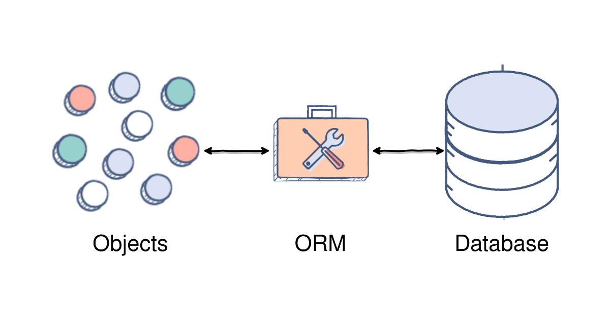
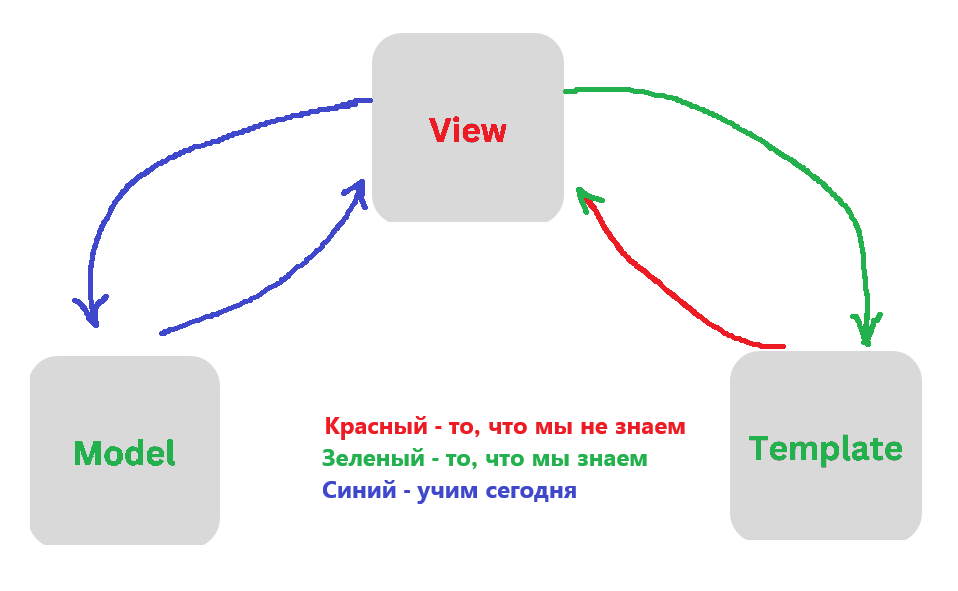
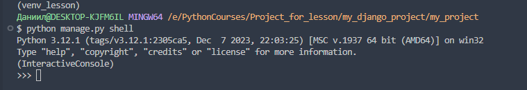
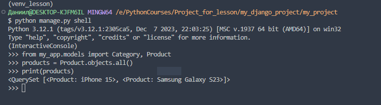

# Лекция 25. Django ORM. Объекты моделей и QuerySet, Meta моделей, Прокси-модели



## Введение в Django ORM
Когда мы говорим о работе с базой данных, многие сразу представляют себе `SQL` — язык, на котором мы пишем запросы вроде `SELECT * FROM, INSERT INTO` и т.д. Но в современном программировании часто используется подход, при котором мы работаем не напрямую с `SQL`, а с более удобным инструментом — `ORM`.

### Что такое ORM?

**ORM (Object-Relational Mapping)** — это подход, при котором таблицы базы данных представляются в виде классов, а строки в этих таблицах — как объекты этих классов. Такой подход позволяет разработчику работать с данными привычным способом, используя объектно-ориентированный код, а не ручные `SQL`-запросы. `ORM` выступает посредником между программой и базой данных: вы пишете код на Python, а под капотом происходит всё необходимое взаимодействие с `SQL`.

### Django ORM

Django предлагает свой встроенный инструмент `ORM` — очень мощный, гибкий и простой в использовании. Он позволяет:

- Создавать и изменять записи в базе данных при помощи обычных Python-классов.
- Не заботиться о `SQL` — всё за нас делает `Django`.
- Работать с разными `СУБД` (`PostgreSQL`, `SQLite`, `MySQL`) без изменения бизнес-логики.

### Что мы сегодня будем учить?



## Работа с объектами моделей в Django ORM

Теперь, когда мы разобрались, что такое Django ORM, пришло время использовать её на практике. Если вы представите себе таблицу в базе данных — то каждая строка в этой таблице по сути представляет один объект. А каждая колонка — это атрибут (поле) этого объекта.

В Django мы описываем структуру таблиц через модели. А теперь мы научимся:

- создавать объекты в базе;
- получать объекты;
- фильтровать их;
- изменять и удалять — всё это без SQL, только на Python!

Тоесть рассмотрим весь CRUD и дополнительные особенности. Очень подробная информация по всем возможным операциям [тут](https://docs.djangoproject.com/en/4.2/topics/db/queries/)

**Для примеров мы будем использовать такие модели:**

```python
from django.db import models

class Category(models.Model):
    name = models.CharField(max_length=100)

    def __str__(self):
        return self.name


class Product(models.Model):
    name = models.CharField(max_length=100)
    price = models.DecimalField(max_digits=8, decimal_places=2)
    category = models.ForeignKey(Category, on_delete=models.CASCADE, related_name="products")

    def __str__(self):
        return self.name


class Order(models.Model):
    customer = models.CharField(max_length=100)
    created_at = models.DateTimeField(auto_now_add=True)

    def __str__(self):
        return f"Заказ #{self.id} от {self.customer}"


class OrderItem(models.Model):
    order = models.ForeignKey(Order, on_delete=models.CASCADE, related_name="items")
    product = models.ForeignKey(Product, on_delete=models.CASCADE)
    quantity = models.PositiveIntegerField()

    def __str__(self):
        return f"{self.product.name} x{self.quantity}"
```

Это простая и понятная структура:

- Категория → содержит список товаров.
- Товар → относится к одной категории.
- Заказ → принадлежит одному покупателю и имеет дату.
- Строка заказа → конкретный товар и его количество в этом заказе.

### Создание объектов моделей в Django ORM (С - Create)

Мы уже создали модели `Category`, `Product`, `Order` и `OrderItem`.Теперь самое время научиться работать с ними: как создавать записи в базе данных, не используя `SQL`, а пользуясь удобным и понятным синтаксисом `Django ORM`.

Для начала — активируйте виртуальное окружение и запустите `Django shell`:

```bash
python manage.py shell
```

Это интерактивный Python-интерпретатор с доступом ко всем моделям проекта.




#### Создание категорий и товаров

Импортируем модели:

```python
from my_app.models import Category, Product
```

Теперь создадим новую категорию:

```python
category = Category.objects.create(name="Смартфоны")
```

`Django ORM` автоматически сформирует и выполнит `SQL`-запрос к базе, а объект category будет сразу доступен в Python.

Создаём несколько товаров:

```python
product1 = Product.objects.create(name="iPhone 15", price=1000, category=category)
product2 = Product.objects.create(name="Samsung Galaxy S23", price=900, category=category)
```

Мы указываем `category=category`, потому что поле category — это `ForeignKey`, и оно ожидает объект `Category`, а не просто `ID`.

#### Способ 2: Создание объекта вручную и сохранение через .save()

Пример с категорией:

```python
category = Category(name="Ноутбуки")  # просто создаём объект (в базе его ещё нет)
category.save()  # сохраняем в базу данных
```

Пример с продуктом:

```python
product = Product(name="MacBook Air", price=1300, category=category)  # пока только в памяти
product.save()  # теперь добавили в базу
```

Вы также можете изменить поля перед сохранением:

```python
product = Product(name="ASUS ZenBook", price=1100, category=category)
product.price = 1050  # передумали :)
product.save()
```

### Получение данных из базы (R - Retrieve)

Теперь, когда у нас есть несколько объектов в базе, давайте научимся их получать.

Получить все товары:

```python
products = Product.objects.all()
print(products)
```

`Product.objects.all()` вернёт `QuerySet` — специальную коллекцию Django, похожую на список. В ней хранятся все объекты модели `Product`.



#### Фильтрация с помощью filter()

Метод `filter() `позволяет выбрать только те записи, которые соответствуют определённым условиям. Если указать `filter()` без параметров, то он сделает то же самое, что и `all()`.

Когда мы используем метод `filter()` для работы с базой данных, мы можем передавать в него разные условия, чтобы получить только нужные нам записи.

Например, мы можем сказать: *"Дай мне все товары, у которых цена больше 1000"* или *"Найди все товары, у которых в названии есть слово 'iPhone'"*

В Django для этого существуют специальные параметры, которые называются *"лукапы"* `(от англ. lookups)`. Они пишутся после двойного подчёркивания `__` и позволяют гибко управлять поиском данных. Документация [тут](https://docs.djangoproject.com/en/4.2/ref/models/querysets/#field-lookups)

**Важно:** таких параметров много, и вы не обязаны запоминать их все сразу. Главное — понять принцип: `модель.objects.filter(поле__параметр=значение)`

**Основные параметры (лукапы), которые стоит знать:**

| Лукап          | Описание                                              |
|----------------|-------------------------------------------------------|
| `exact`        | Точное совпадение значения                            |
| `iexact`       | То же, без учёта регистра                             |
| `contains`     | Содержит подстроку (учитывая регистр)                |
| `icontains`    | Содержит подстроку (без учёта регистра)              |
| `startswith`   | Начинается с подстроки                                |
| `endswith`     | Заканчивается на подстроку                            |
| `in`           | Значение входит в список                              |
| `gt`           | Больше (greater than)                                 |
| `lt`           | Меньше (less than)                                    |
| `gte`          | Больше или равно (greater than or equal)             |
| `lte`          | Меньше или равно (less than or equal)                |
| `isnull`       | Значение равно `NULL` или `None`                      |
| `range`        | Значение находится в диапазоне                        |
| `field__lookup`| Доступ к вложенным полям (через внешние ключи)       |

#### Примеры использования filter() в Django ORM

**Найти все продукты с ценой больше 1000**

```python
Product.objects.filter(price__gt=1000)
```

**Найти все продукты с ценой меньше или равной 800**

```python
Product.objects.filter(price__lte=800)
```

**Найти все продукты, название которых начинается с `"iPhone"`**

```python
Product.objects.filter(name__startswith="iPhone")
```

**Найти все продукты, название которых содержит `"galaxy"` (без учёта регистра)**

```python
Product.objects.filter(name__icontains="galaxy")
```

**Найти все продукты, у которых цена `900` или `1000`**

```python
Product.objects.filter(price__in=[900, 1000])
```

**Найти все продукты, у которых категория с именем `"Смартфоны"`**

```python
Product.objects.filter(category__name="Смартфоны")
```

**Найти все продукты, у которых категория содержит "ноут" (без регистра)**

```python
Product.objects.filter(category__name__icontains="ноут")
```

**Найти все продукты, у которых цена в диапазоне от 500 до 1500**

```python
Product.objects.filter(price__range=(500, 1500))
```

**Найти все продукты, у которых категория — None (не задана)**

```python
Product.objects.filter(category__isnull=True)
```

### exclude() — исключение из выборки

Метод `exclude()` работает так же, как `filter()`, только он исключает записи, соответствующие условиям.

**Исключить продукты с ценой выше 1000**

```python
Product.objects.exclude(price__gt=1000)
```

Вернёт только те товары, у которых цена меньше или равна `1000`.

**Исключить товары из категории "Смартфоны"**

```python
Product.objects.exclude(category__name="Смартфоны")
```

Вернёт товары из всех других категорий, кроме смартфонов.

### get() — получить один объект

Метод `get()` используется, когда мы уверены, что найдётся ровно один объект по условию.

**Получить продукт с id=1**

```python
product = Product.objects.get(id=1)
```

**Получить категорию по имени**

```python
category = Category.objects.get(name="Смартфоны")
```

Если объектов нет — будет ошибка `DoesNotExist`. Если объектов больше одного — будет `MultipleObjectsReturned`. Поэтому обворачиваем наш запрос в консткрукцию `try` - `except`:

```python
try:
    product = Product.objects.get(id=1)
except Product.DoesNotExist:
    return "Can't find object"
except Product.MultipleObjectsReturned:
    return "More than one object"
```

Используйте `get()` только если точно знаете, что результат будет единственным. В остальных случаях — `filter()`.

### order_by() — сортировка результатов

Метод `order_by()` позволяет отсортировать объекты по одному или нескольким полям.

**Примеры:**

```python
# Сортируем товары по цене (от дешёвых к дорогим)
Product.objects.order_by("price")

# Сортируем товары по убыванию цены
Product.objects.order_by("-price")

# Сортируем сначала по категории, потом по цене
Product.objects.order_by("category", "-price")
```

### distinct() — Убираем дубликаты при выборке продуктов

Иногда, когда мы делаем запросы с фильтрацией по связанным полям, один и тот же объект может появляться в результате несколько раз. Чтобы этого избежать, мы используем метод `distinct()`.

**Пример 1: Продукты из определённой категории**

Представим, что мы хотим найти все продукты, которые находятся в категории "Смартфоны":

```python
products = Product.objects.filter(category__name="Смартфоны")
```

В этом случае, `distinct()` не нужен, потому что один товар находится только в одной категории, и мы получим уникальные продукты.

**Пример 2: Продукты из нескольких категорий**

А вот если мы хотим получить все продукты, которые находятся в одной из нескольких категорий, и по какой-то причине дублируются в выдаче (например, через `join` при сложных фильтрациях), — `distinct()` помогает избавиться от повторов:

```python
products = Product.objects.filter(category__name__in=["Смартфоны", "Ноутбуки"]).distinct()
```

Без `distinct()` можно получить один и тот же продукт в выдаче, если он по ошибке оказался в двух похожих категориях (что бывает, если связи `ManyToMany`).

#### Когда точно использовать?

- Когда вы фильтруете через связи (`category__`что-то) и получаете повторы.
- Когда вы объединяете несколько фильтров и Django формирует `SQL` с `JOIN`, из-за чего объекты повторяются.
- Когда вы делаете `.values()` или `.annotate()` с группировками (в таких случаях — особенно полезно).

### values() — получение словарей вместо объектов

Метод `values()` возвращает не объекты модели, а словарь с указанными полями. Это удобно, если нужно получить *"сырые данные"*, например, для `API` или сериализации.

**Примеры:**

```python
# Получаем только названия всех товаров
Product.objects.values("name")

# Получаем имена и цены
Product.objects.values("name", "price")

# Можно комбинировать с filter()
Product.objects.filter(price__gt=1000).values("name", "price")
```

Возвращает `QuerySet`, но не из объектов модели, а из словарей:

```python
[{'name': 'iPhone 15', 'price': 1000}, {'name': 'MacBook Air', 'price': 1300}]
```

### first() и last()

Эти методы позволяют получить один объект из выборки — либо первый, либо последний. Работают только с `QuerySet`, и возвращают один объект или `None`, если ничего не найдено.

**first()**

```python
# Первый добавленный товар
first_product = Product.objects.first()
```

По умолчанию используется порядок, в котором `Django` возвращает записи из БД (часто — по id).

Если нужно явно задать порядок — сначала используем `order_by()`:

```python
# Самый дешёвый товар
cheapest = Product.objects.order_by("price").first()
```

**last()**

```python
# Последний товар в базе
last_product = Product.objects.last()
```
```python
# Самый дорогой товар
expensive = Product.objects.order_by("-price").first()
```

`last()` и `first()` удобны, когда нужен один объект из набора, особенно вместе с `filter()` или `order_by()`.

### related_name — как получить связанные объекты "в другую сторону"

Когда мы используем `ForeignKey`, мы связываем две модели вперёд — указываем, к какой модели относится объект. Но иногда нам нужно получить все связанные объекты с обратной стороны.

**Как это работает:**

```python
class Category(models.Model):
    name = models.CharField(max_length=100)

class Product(models.Model):
    name = models.CharField(max_length=100)
    price = models.DecimalField(max_digits=8, decimal_places=2)
    category = models.ForeignKey(Category, on_delete=models.CASCADE, related_name="products")
```

В этом примере: У `Product` есть ссылка на `Category`. А у `Category` появляется поле `products`, которое содержит все связанные товары.

**Пример использования:**

```python
category = Category.objects.get(name="Смартфоны")

# Все товары, относящиеся к этой категории
products_in_category = category.products.all()

for product in products_in_category:
    print(product.name, product.price)
```

Без `related_name` Django создаёт имя по умолчанию: `product_set`. Но `related_name="products"` делает его более читаемым и удобным.

### Обновление объектов в Django ORM (Update)

В Django ORM можно обновить данные в базе двумя основными способами:

#### Способ 1: Получить объект → изменить → сохранить

Это самый распространённый и интуитивный способ:

```python
product = Product.objects.get(id=1)  # Получаем товар с id=1
product.price = 950  # Меняем цену
product.name = "iPhone 15 Pro"  # Меняем название
product.save()  # Сохраняем изменения в базу
```

Метод `save()` обновит только изменённые поля, а не весь объект — это экономит ресурсы.

#### Способ 2: Массовое обновление (bulk update)

Если нужно обновить сразу несколько объектов:

```python
Product.objects.filter(price__lt=500).update(price=500)
```

Этот запрос найдёт все товары с ценой ниже 500 и обновит их цену на 500. В этом случае `save()` не вызывается, и сигналы не срабатывают — это быстро, но без дополнительной логики. Полезно: `update()` работает только с `QuerySet`-ом (то есть без `.get()` или `.first()`), а `save()` — для конкретного объекта.

### Удаление объектов в Django ORM (Delete)

Удалить объект — очень просто, выполняется методом `delete()`:

**Удаление одного объекта**

```python
product = Product.objects.get(id=1)
product.delete()
```

Объект будет удалён из базы данных.

**Удаление нескольких объектов**

```python
Product.objects.filter(price__gt=1000).delete()
```

Этот запрос удалит все товары дороже 1000. Здесь также используется `QuerySet`, и удаление произойдёт одной SQL-командой, что эффективно.

### Совмещенные методы get_or_create(), update_or_create(), bulk_create(), bulk_update()

`get_or_create()` - это метод, который попытается создать новый объект. Если он не сможет найти нужный в базе, он возвращает сам объект и булево значение, которое обозначает, что объект был создан или получен.

`update_or_create()` - обновит, если объект существует, создаст, если не существует.

`bulk_create()` - массовое создание; необходимо для того, чтобы избежать большого количества обращений в базу.

`bulk_update()` - массовое обновление (отличие от обычного в том, что при обычном на каждый объект создается запрос, в этом случае запрос делается массово)

Подробно почитать про них [ТУТ](https://docs.djangoproject.com/en/4.2/ref/models/querysets/#get-or-create)

### Агрегатные функции в Django ORM (Aggregate)

Агрегатные функции позволяют производить расчёты по данным: сумму, среднее значение, максимум, минимум и количество. Для этого Django предоставляет функции из `django.db.models`:

```python
from django.db.models import Sum, Avg, Count, Max, Min
```

#### Примеры агрегатных функций:

**Сколько всего товаров?**

```python
Product.objects.count()
```

**Общая сумма всех товаров:**

```python
Product.objects.aggregate(Sum("price"))
# {'price__sum': 3250}
```

**Средняя цена всех товаров:**

```python
Product.objects.aggregate(Avg("price"))
```

**Самый дорогой товар:**

```python
Product.objects.aggregate(Max("price"))
```

**Самый дешёвый товар:**

```python
Product.objects.aggregate(Min("price"))
```

### Аннотация (annotate)

Аннотация позволяет добавить к каждому объекту дополнительное вычисляемое поле — например, подсчитать, сколько товаров в категории.

```python
from django.db.models import Count

categories = Category.objects.annotate(product_count=Count("products"))

for category in categories:
    print(f"{category.name} — {category.product_count} товаров")
```

Здесь `"products"` — это `related_name` в модели `Product`:

```python
category = models.ForeignKey(Category, on_delete=..., related_name="products")
```

**Ещё пример: подсчёт количества товаров с фильтрацией**

```python
from django.db.models import Count

popular_categories = Category.objects.annotate(
    product_count=Count("products")
).filter(product_count__gt=2)
```

Здесь мы сразу аннотировали и отфильтровали категории, где больше двух товаров.

### Подробнее про метод save()

Метод save() в Django можно переписать (переопределить), чтобы добавить собственную логику перед сохранением объекта. Это своего рода *"хуки"* или *"триггеры"*, как в базах данных.

**Когда это может быть полезно?**

- Автоматически форматировать данные перед сохранением
- Добавлять или изменять поля
- Писать в лог
- Генерировать значения
- Производить валидацию

**Пример: Модель Product**

Допустим, мы хотим, чтобы:

- Название продукта всегда сохранялось с заглавной буквы (даже если ввели строчными)
- Если цена не указана — она по умолчанию будет 0

```python
from django.db import models
from django.utils.timezone import now


class Category(models.Model):
    name = models.CharField(max_length=100)

    def __str__(self):
        return self.name


class Product(models.Model):
    name = models.CharField(max_length=100)
    price = models.DecimalField(max_digits=10, decimal_places=2, null=True, blank=True)
    category = models.ForeignKey(Category, on_delete=models.CASCADE, related_name='products')
    created_at = models.DateTimeField(auto_now_add=True)

    def save(self, *args, **kwargs):
        # 1. Название будет с заглавной буквы
        self.name = self.name.capitalize()

        # 2. Если цена не указана, ставим 0.00
        if self.price is None:
            self.price = 0.00

        # 3. Не забываем вызвать оригинальный save
        super().save(*args, **kwargs)

    def __str__(self):
        return f"{self.name} - {self.price}"
```

**Почему это удобно?**

- Вы можете централизованно управлять бизнес-логикой при сохранении
- Это удобно, особенно когда объекты создаются в разных местах (вьюхи, админка, shell)
- Это способ гарантировать, что ваши данные в базе будут корректны

### Использование ManyToMany на практике

В Django `ManyToManyField` используется, когда одна запись может быть связана с несколькими другими — и наоборот.

Рассмотрим простой, но наглядный пример: студенты и кружки. Один студент может состоять сразу в нескольких кружках, а один кружок может включать в себя многих студентов.

Мы создадим две модели:

```python
from django.db import models

class Student(models.Model):
    name = models.CharField(max_length=100)

    def __str__(self):
        return self.name


class Club(models.Model):
    name = models.CharField(max_length=100)
    members = models.ManyToManyField(Student, related_name="clubs")

    def __str__(self):
        return self.name
```

Здесь поле `members = models.ManyToManyField(Student)` указывает на связь *«многие ко многим»* между студентами и кружками.


Примеры использования в shell
Создание студентов и кружков:

```python
# Создаём студентов
student1 = Student.objects.create(name="Аня")
student2 = Student.objects.create(name="Борис")

# Создаём кружки
club1 = Club.objects.create(name="Программирование")
club2 = Club.objects.create(name="Робототехника")
```

Добавление студентов в кружки:

```python
club1.members.add(student1)  # Аня записалась на программирование
club1.members.add(student2)  # Борис тоже
club2.members.add(student2)  # А Борис ещё и на робототехнику
```
Получение всех кружков, где участвует студент:

```python
student2.clubs.all()
# <QuerySet [<Club: Программирование>, <Club: Робототехника>]>
```

Кто участвует в определённом кружке:

```python
club1.members.all()
# <QuerySet [<Student: Аня>, <Student: Борис>]>
```

**Как работает под капотом?**

На самом деле Django автоматически создаёт промежуточную таблицу, в которой хранятся связи между `Student` и `Club`. Это позволяет эффективно добавлять, удалять и получать связанные объекты.

#### Добавление нескольких объектов одновременно

Если нужно добавить сразу нескольких студентов в кружок, можно использовать `add()` с несколькими аргументами:

```python
club1.members.add(student1, student2)
```

Это аналогично вызову `add()` дважды, но в одной строке. Django сам обработает это как массовое добавление.

Также можно передать список объектов с помощью распаковки `*`:

```python
students = [student1, student2]
club2.members.add(*students)
```

#### Удаление объектов из связи

Чтобы удалить одного участника из кружка:

```python
club1.members.remove(student1)
```

Чтобы удалить нескольких участников сразу:

```python
club1.members.remove(student1, student2)
```

#### Полная замена участников

Если нужно полностью заменить список участников — используйте метод `set()`:

```python
club1.members.set([student2])  # Теперь только Борис в клубе
```

Этот метод сначала удалит всех участников, а потом добавит переданные объекты.

#### Очистка всех связей

Если нужно удалить всех участников:

```python
club1.members.clear()
```

Теперь в клубе никого нет.

### Q-объекты в Django ORM

Когда нужно выполнить сложные условия фильтрации, особенно с логическими операциями `OR` (или) и `NOT` (не) — `Q-объекты` становятся незаменимыми.

По умолчанию `filter()` работает как логическое И `(AND)`. Но что если нам нужно отфильтровать записи, которые удовлетворяют хотя бы одному из условий? Вот тут на помощь приходит `Q`.

Импорт:

```python
from django.db.models import Q
```

**Пример: Найти студентов с именем "Анна" или возрастом меньше 20**

```python
Student.objects.filter(Q(name="Анна") | Q(age__lt=20))
```

В обычном `filter()` так сделать нельзя — Django интерпретировал бы это как логическое И.

**Пример: Найти студентов не младше 18 лет**

```python
Student.objects.filter(~Q(age__lt=18))
```

Символ `~` — это логическое НЕ.

**Пример: Студенты по нескольким условиям**

```python
Student.objects.filter(
    Q(name__icontains="ив") | Q(name__startswith="А") | Q(age__gte=30)
)
```

Можно комбинировать сколько угодно Q-объектов — и с `|`, и с `&`, и с `~`.

Пример из наших моделей: Найти все кружки, в которых состоит студент по имени `"Ольга"` или `"Иван"`

```python
Club.objects.filter(
    Q(members__name="Ольга") | Q(members__name="Иван")
).distinct()
```

Мы добавляем `.distinct()`, чтобы убрать дубликаты, если студент состоит в нескольких клубах.

### F() выражения

В обычных условиях, когда мы хотим обновить значение в модели, мы работаем в Python, а потом сохраняем объект:

```python
product = Product.objects.get(id=1)
product.price = product.price + 100
product.save()
```

Здесь мы сначала загружаем объект в Python, потом меняем цену, и только потом отправляем обратно в базу. Но это не очень эффективно.

#### Что такое F()?

`F()` — это специальный объект из `django.db.models`, который позволяет выполнять арифметику и сравнение прямо в базе, не загружая объект в память. Это безопаснее, быстрее и эффективнее, особенно когда работает много пользователей.

**Примеры использования**

Импортируем F:

```python
from django.db.models import F
```

Увеличим цену всех продуктов на 100:

```python
Product.objects.update(price=F('price') + 100)
```

Что делает Django: он сформирует SQL-запрос, который обновит поле `price`, прибавив к нему `100` — на уровне базы, без загрузки каждого объекта в Python.

**Удвоить цену только для товаров из категории "Смартфоны":**
```python
Product.objects.filter(category__name="Смартфоны").update(price=F('price') * 2)
```

Сравнение двух полей внутри одной модели: Допустим, у модели был бы old_price и price, тогда:

```python
Product.objects.filter(price__gt=F('old_price'))
```

**Зачем использовать F()?**

- Безопаснее при одновременных запросах (например, увеличении количества в корзине).
- Эффективнее: не грузим объект в Python, всё делается на стороне SQL.
- Позволяет сравнивать два поля одной модели.


### select_related и prefetch_related

Когда вы работаете с базой данных в Django, важно учитывать, сколько запросов вы выполняете и насколько эффективны эти запросы. Один из частых антипаттернов – это проблема `"N+1 запросов"`, когда для получения данных выполняется множество запросов, что замедляет работу приложения. Django предоставляет два мощных инструмента для оптимизации запросов: `select_related` и `prefetch_related`.

#### Проблема N+1

Представим: мы хотим вывести список товаров и их категорий.

```python
products = Product.objects.all()
for product in products:
    print(product.name, product.category.name)
```

На первый взгляд — всё ок. Но за кулисами:

- Django сначала делает 1 запрос на получение всех Product
- Потом для каждого Product делает ещё один запрос к таблице Category, чтобы узнать имя категории

Если товаров 100, то получится 1 (продукты) + 100 (категории) = `101 запрос`

#### Как это исправить?

##### select_related()

`select_related` работает при связи `ForeignKey` и `OneToOne`. Оно делает `JOIN` и подтягивает связанные данные в одном SQL-запросе.

**Пример:**

```python
products = Product.objects.select_related('category')
for product in products:
    print(product.name, product.category.name)
```

Теперь Django сделает один SQL-запрос с `JOIN` — и всё получит сразу.

##### prefetch_related()

`prefetch_related` нужен для `ManyToMany` или обратных `ForeignKey` (например, получить все продукты в категории).

Он делает два отдельных запроса и соединяет их в Python (а не в SQL, как `select_related`).

**Пример:**

```python
categories = Category.objects.prefetch_related('products')
for category in categories:
    print(category.name)
    for product in category.products.all():
        print("-", product.name)
```

Django сначала получает все категории, потом все продукты, и потом связывает их в памяти.

#### Когда что использовать?

| Тип связи              | Что использовать     |
|------------------------|----------------------|
| `ForeignKey`           | `select_related`     |
| `OneToOneField`        | `select_related`     |
| `ManyToMany`           | `prefetch_related`   |
| Обратный `ForeignKey`  | `prefetch_related`   |


#### Примеры на наших моделях

Получить все продукты и категории (оптимизировано):

```python
products = Product.objects.select_related('category')
for p in products:
    print(p.name, p.category.name)
```

Получить все категории и связанные с ними продукты:

```python
categories = Category.objects.prefetch_related('products')
for c in categories:
    print(c.name)
    for p in c.products.all():
        print("-", p.name)
```

### Транзакции

Транзакция — это набор операций с базой данных, которые должны быть выполнены целиком. Если одна из операций не удалась — отменяются все остальные. 
Например перевод денег с одного счёта на другой:

- Списать деньги с одного счёта
- Зачислить на другой

Если в процессе что-то пойдёт не так (например, вторая операция упала), то и первая должна отмениться, чтобы деньги не "исчезли".

### Как использовать транзакции в Django?

Django предоставляет модуль `django.db.transaction`, где есть нужные инструменты.

**Пример с `atomic` — всё или ничего:**

```python
from django.db import transaction
from my_app.models import Product, Order, OrderItem

def create_order():
    try:
        with transaction.atomic():
            order = Order.objects.create(customer="Анна")

            product = Product.objects.get(name="iPhone 15")
            OrderItem.objects.create(order=order, product=product, quantity=1)

            # Принудительная ошибка
            raise ValueError("Что-то пошло не так!")

            # Второй товар не будет добавлен
            another = Product.objects.get(name="MacBook Air")
            OrderItem.objects.create(order=order, product=another, quantity=1)

    except Exception as e:
        print("Транзакция откатилась:", e)
```

Если хотя бы одна строка внутри блока `with transaction.atomic() `вызовет исключение, то все изменения отменятся.Никаких заказов или `OrderItem` не появится в базе.

#### Пример с декоратором @transaction.atomic

```python
from django.db import transaction
from my_app.models import Product, Order, OrderItem

@transaction.atomic
def create_order():
    order = Order.objects.create(customer="Анна")

    product = Product.objects.get(name="iPhone 15")
    OrderItem.objects.create(order=order, product=product, quantity=1)

    # Принудительно вызываем ошибку
    raise ValueError("Ошибка! Что-то пошло не так.")

    another = Product.objects.get(name="MacBook Air")
    OrderItem.objects.create(order=order, product=another, quantity=1)
```

**Что происходит:**

- Декоратор `@transaction.atomic` делает то же самое, что и with `transaction.atomic()`: — оборачивает весь код внутри функции в одну транзакцию.
- Если где-то в функции произойдёт ошибка (например, `raise ValueError(...)`), Django откатит все изменения в базе данных.
- Если всё прошло успешно — изменения зафиксируются (`commit`).

>Важно: `@transaction.atomic` должен быть самым внешним декоратором, если используются другие, иначе поведение может быть неожиданным.

#### Управление транзакциями с помощью `transaction.on_commit()`
Бывают ситуации, когда нужно выполнить какое-то действие только после того, как данные точно записались в базу. Например:

- отправить письмо с подтверждением,
- записать событие в лог,
- запустить задачу в фоне.

Но если вдруг произойдёт ошибка и база *«откатится»* — нам не нужно выполнять это действие. Чтобы так и было, Django предоставляет удобную функцию: `transaction.on_commit()`.


```python
from django.db import transaction
from my_app.models import Order, Product, OrderItem

def send_order_notification(order):
    print(f"Уведомление: заказ №{order.id} создан!")

@transaction.atomic
def create_order():
    order = Order.objects.create(customer="Олег")
    product = Product.objects.get(name="iPhone 15")
    OrderItem.objects.create(order=order, product=product, quantity=2)

    # Отложенное действие: выполняется ТОЛЬКО после успешной записи в базу
    def notify():
        send_order_notification(order)

    transaction.on_commit(notify)

    print("Данные внесены. Уведомление будет отправлено после коммита.")
```

**Что тут важно:**

- `@transaction.atomic` — всё, что внутри, происходит в одной «коробке» (транзакции).
- `transaction.on_commit(notify)` говорит Django: "Вызови эту функцию, когда база успешно сохранится."

Если в процессе произойдёт ошибка — уведомление не отправится, потому что транзакция не завершится.

#### Ручное управление транзакциями: commit() и rollback()

В Django по умолчанию все запросы к базе данных выполняются автоматически — как только вы вызываете `save()` или `create()`, данные сразу записываются в базу. Это называется автокоммит.

Но бывают ситуации, когда нужно временно отключить автозапись, чтобы сначала выполнить несколько действий, и только потом, если всё прошло успешно, сохранить их в базу. Если где-то возникла ошибка — всё отменить (откатить изменения).

Для таких случаев используется ручное управление транзакцией: `set_autocommit(False)`, `commit()` и `rollback()`.

**Пример: создание нескольких объектов за одну транзакцию**

```python
from django.db import transaction
from my_app.models import Product

def create_multiple_products():
    try:
        transaction.set_autocommit(False)  # Отключаем автоматическую запись

        product1 = Product.objects.create(name="Xiaomi Redmi", price=400)
        product2 = Product.objects.create(name="OnePlus Nord", price=500)

        # Если всё хорошо — сохраняем изменения в базе
        transaction.commit()

        print("Товары успешно созданы!")

    except Exception as e:
        # Если произошла ошибка — откатываем изменения
        transaction.rollback()
        print(f"Ошибка при создании товаров: {e}")

    finally:
        # Обязательно включаем автокоммит обратно
        transaction.set_autocommit(True)
```

**Что здесь происходит:**

- Отключаем автозапись: `set_autocommit(False)` — теперь все действия с базой "в подвешенном состоянии".
- Создаём сразу несколько объектов.
- Если всё прошло без ошибок — вызываем `transaction.commit()`, и изменения сохраняются.
- Если произошла любая ошибка — вызываем `transaction.rollback()`, и все изменения отменяются.

В конце — обязательно включаем автокоммит обратно, чтобы не повлиять на остальной код.

Такой подход особенно полезен, если нужно выполнить цепочку действий с данными, и вы хотите быть уверены, что либо всё выполнится, либо ничего не изменится.