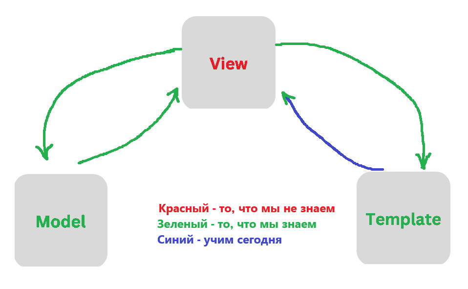
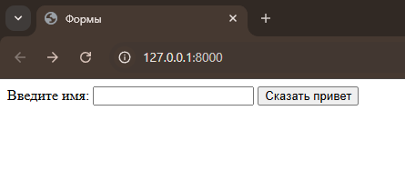
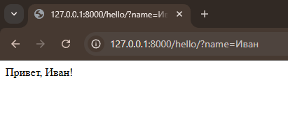
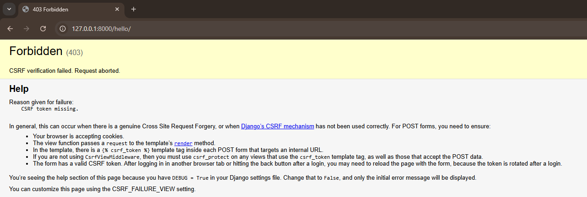
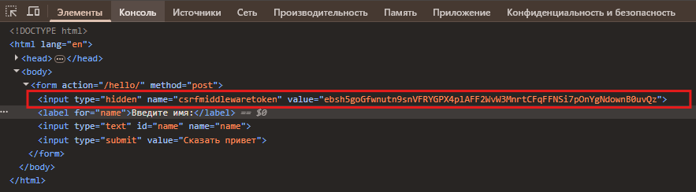
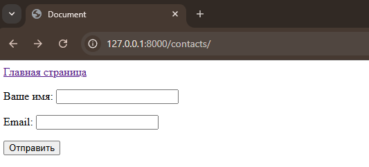
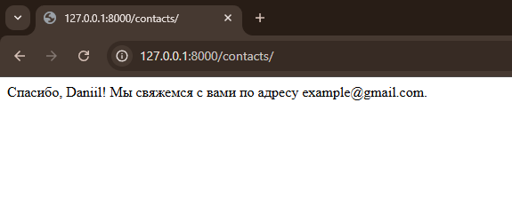

# Лекция 26. Forms, ModelForms. User, Authentication в Django


## Что мы сегодня будем учить?



## Введение в формы в Django

Когда мы создаём сайт, одна из самых частых задач — собрать данные от пользователя. Будь то регистрация, комментарий, покупка или загрузка файла — всё это делается через формы.

**Форма** — это то, что пользователь заполняет, а потом отправляет на сервер. Сервер в ответ обрабатывает полученные данные, делает с ними что-то полезное — например, сохраняет в базу или проверяет корректность.

Django очень мощно работает с формами: он умеет:

- создавать формы автоматически,
- делать валидацию данных,
- генерировать HTML,
- обрабатывать отправленные значения.

Но прежде чем говорить про всё это волшебство, давайте поймём, как работают формы на самом базовом уровне — в обычном HTML.

### Из чего вообще состоит HTML-форма?

Основная её задача — собрать данные от пользователя. А для этого используются поля ввода.

Ниже представлены самые распространённые типы полей, с которыми вы будете сталкиваться в Django и в жизни разработчика:

| Тип поля                       | Назначение                                                                        | HTML-элемент                                        |
| ------------------------------------- | ------------------------------------------------------------------------------------------- | ---------------------------------------------------------- |
| Текстовое поле           | Ввод короткого текста (например, имя)                         | `<input type="text">`                                    |
| Пароль                          | Ввод пароля (символы скрываются)                                 | `<input type="password">`                                |
| Электронная почта     | Ввод email-адреса (проверяется валидность)                   | `<input type="email">`                                   |
| Число                            | Ввод чисел                                                                         | `<input type="number">`                                  |
| Дата / Время                 | Ввод даты, времени или и того и другого                      | `<input type="date">`, `<input type="datetime-local">` |
| Флажок (чекбокс)         | Выбор "Да/Нет", "Вкл/Выкл"                                                 | `<input type="checkbox">`                                |
| Переключатель            | Выбор одного варианта из нескольких                          | `<input type="radio">`                                   |
| Выпадающий список     | Выбор одного (или нескольких) значений из списка    | `<select><option>...</option></select>`                  |
| Многострочный текст | Ввод длинного текста (комментарий, описание и т.п.) | `<textarea></textarea>`                                  |
| Файл                              | Загрузка файла с компьютера                                         | `<input type="file">`                                    |
| Кнопка отправки         | Отправка формы                                                                 | `<input type="submit">` или `<button>`              |

### HTML-форма с GET-запросом

Для начала разберёмся с самой базовой ситуацией — пользователь заполняет форму, а мы получаем и обрабатываем данные на сервере. Самый простой способ передачи данных — через GET-запрос.

Представим, что у нас есть страница с формой, где пользователь может ввести своё имя:

```html
<form action="/hello/" method="get">
  <label for="name">Введите имя:</label>
  <input type="text" id="name" name="name" />
  <input type="submit" value="Сказать привет" />
</form>
```

**Что делает этот код:**

- `action="/hello/"` — указывает, куда отправлять данные после нажатия кнопки. В нашем случае — на адрес /hello/.
- `method="get"` — говорит браузеру, что данные нужно передать через URL, в виде параметров.
- `name="name"` — задаёт имя поля. Именно по этому имени мы потом сможем получить значение в Django.



Когда пользователь нажимает кнопку отправки, браузер формирует запрос вроде:

```bash
/hello/?name=Иван
```

Имя пользователя передаётся в URL, и мы можем его получить на сервере.

### Как Django получает данные из формы?

Когда клиент (браузер) отправляет запрос, Django автоматически передаёт его в функцию-обработчик — view. Этот запрос упакован в объект request, который первым аргументом попадает во все представления:

```python
def hello(request):
    ...
```

Объект `request` содержит всю информацию о запросе: метод (`GET`, `POST`), параметры, куки, файлы и другое.

Нас сейчас интересует:

- `request.method` — позволяет определить, какой метод использовался для запроса (например, "`GET`").
- `request.GET` — это словарь, в котором хранятся параметры из URL.
- `request.POST` — похожий словарь, но с данными, переданными через тело запроса.

**Пример обработки GET-запроса**

Создадим простое представление, которое получает имя из формы и выводит его на экран:

```python
from django.http import HttpResponse

def hello(request):
    if request.method == "GET":
        name = request.GET.get("name") or "Гость"
        return HttpResponse(f"Привет, {name}!")
```

Если пользователь не передал имя, по умолчанию будет использоваться "Гость".

### Настройка маршрута (urls.py)

Чтобы обработчик заработал, нужно зарегистрировать его в `urls.py`:

```python
from django.urls import path
from my_app.views import hello

urlpatterns = [
    path("hello/", hello, name="hello"),
]
```



Теперь при переходе по `/hello/?name=Иван` или после отправки формы, мы увидим: `Привет, Иван!`

Так мы научились принимать данные через `URL`, используя простую HTML-форму и обработчик на стороне Django.

### Почему GET — это не всегда хорошая идея?

В `GET`-запросах данные передаются в `URL`. Это удобно для фильтрации, поиска и быстрого доступа, но у такого подхода есть серьёзные ограничения:

- Ограничение на длину запроса. Браузеры и серверы ограничивают длину URL. Вы не можете передать большие объёмы данных.
- Данные видны всем. То, что пользователь ввёл, можно увидеть в адресной строке.

**Например:**

```perl
http://example.com/hello/?name=Иван&email=ivan@example.com&password=12345
```

Информация может попасть в историю браузера, логи сервера, аналитические системы и кеш. Данные можно случайно (или специально) изменить. Например, злоумышленник может передать вредоносные данные напрямую в URL. 

> Поэтому никогда не передавайте пароли, номера карт, личные сообщения и важные данные через GET.

### Когда использовать POST-запрос?

Если вы передаёте важную, чувствительную или большую информацию — используйте `POST`.

`POST`-запрос отправляет данные в теле запроса, а не в адресной строке. Это:

- безопаснее (не видно в URL),
- нет ограничения по длине,
- нельзя случайно изменить или закешировать.

#### Но и POST небезопасен без защиты

Даже `POST`-запрос может быть уязвим, если не защищён. Например, злоумышленник может подделать форму и отправить запрос от имени пользователя.
Для этого Django предоставляет защиту от `CSRF`-атак (`Cross-Site Request Forgery` — межсайтовая подделка запроса).

#### Что такое CSRF?

`CSRF` — это атака, при которой пользователь делает `POST`-запрос (например, отправляет форму), не подозревая, что это делает сторонний сайт от его имени.Чтобы защититься от этого, Django требует, чтобы каждая форма с `POST`-запросом содержала специальный токен — уникальный код, который вставляется в форму автоматически.

### HTML-форма с POST-запросом

Создадим HTML-форму c POST-запросом, но удалим из неё строку :

```html
<!-- index.html -->
<form action="/hello/" method="post"> {# вот тут просто меняем GET на POST #}
  <label for="name">Введите имя:</label>
  <input type="text" id="name" name="name">
  <input type="submit" value="Отправить">
</form>
```

Теперь нам нужно поменять `views.py` так как мы поменяли метод переачи данных)))

```python
from django.http import HttpResponse

def hello(request):
    if request.method == "POST":
        name = request.POST.get("name")
        return HttpResponse(f"Привет, {name}!")
    return HttpResponse("Ожидается POST-запрос")
```

Теперь при отправки формы мы увидим:



Когда мы отправили POST-запрос без специальной защиты, Django вернул нам ошибку:

```scss
Forbidden (403)
CSRF verification failed. Request aborted.
```

**Что это за ошибка?**

Это ошибка CSRF-токена. Django заблокировал нашу форму, потому что она потенциально небезопасна.

#### Почему возникает ошибка CSRF?

Чтобы это понять, давайте немного углубимся в разницу между `GET` и `POST` запросами:

##### GET-запросы

Это обычные, безопасные запросы. Они используются, чтобы:

- загрузить страницу,
- отфильтровать данные,
- перейти по ссылке и т.д.

`GET`-запросы не изменяют данные на сервере. Даже если их отправить 10 раз подряд — ничего не случится. Максимум — вы получите одни и те же данные.

##### POST-запросы

Это уже чувствительные запросы. Они применяются, когда нужно:

- зарегистрировать пользователя,
- отправить комментарий,
- изменить данные,
- совершить покупку.

Повторно отправленный или поддельный `POST`-запрос может привести к нежелательным последствиям:

- дублирование данных,
- удаление или изменение записей,
- даже мошеннические операции (например, перевод денег на другой счёт).

#### Зачем нужен CSRF?

Чтобы защититься от таких атак, Django требует, чтобы в каждой POST-форме было специальное скрытое поле — `CSRF`-токен.

Это одноразовый, уникальный ключ, который генерируется сервером и отправляется вместе с HTML-формой. При отправке формы сервер проверяет, совпадает ли токен с ожидаемым. Если токена нет или он неправильный — запрос блокируется.

На следующем шаге мы добавим `CSRF`-токен и убедимся, что форма начнёт работать. А более глубоко разберём, как именно работает защита и где она проверяется — позже, когда будем говорить о безопасности.

### Добавляем CSRF-токен в HTML-форму

Чтобы Django *«доверял»* нашей форме, мы должны вставить специальный тег внутри тега `<form>`. Для этого в шаблоне нужно использовать встроенный Django-тег ``.

```html
<form action="/hello/" method="post">
  
  
  <label for="name">Введите имя:</label>
  <input type="text" id="name" name="name" />
  
  <input type="submit" value="Сказать привет" />
</form>
```

**Важно: `` должен быть внутри формы — иначе защита не сработает.**

#### Что теперь происходит?

- Django отрисовывает HTML-страницу и вставляет внутрь формы `CSRF`-токен.

- Пользователь вводит своё имя и нажимает кнопку.
- Данные + токен отправляются серверу.
- Django проверяет токен и принимает запрос, потому что всё в порядке.
- Сервер возвращает: Привет, Иван!

## Формы как классы: django.forms.Form

Django предоставляет нам специальный класс — `Form`, с помощью которого можно создавать формы на Python, без ручного HTML. Это мощный инструмент, который:

- создаёт HTML за нас,
- валидирует введённые данные,
- проверяет типы,
- позволяет удобно работать с формами в Python-коде.

### Где хранить формы в Django-проекте?

По умолчанию Django не создаёт файл `forms.py`, но в большинстве случаев удобно создать его вручную внутри каждого приложения. Это позволяет поддерживать порядок и отделить логику, связанную с формами, от моделей, представлений и `URL`-ов.

**Рекомендуемая структура**

```plaintext
my_project/
├── my_app/
│   ├── models.py        # модели
│   ├── views.py         # представления
│   ├── urls.py          # маршруты
│   ├── forms.py         # формы
│   ├── templates/
│   │   └── my_app/
│   │       └── contacts.html
│   └── ...
```

**Почему forms.py именно здесь?**

- Привязан к конкретному приложению.
- Удобно импортировать и использовать: `from .forms import MyForm`.
- Не засоряет `views.py` логикой создания и валидации форм.

**Альтернатива: forms/ как отдельная папка**

Если у тебя много форм — можно сделать отдельную папку `forms/` и разбить их по файлам:

```plaintext
my_app/
├── forms/
│   ├── __init__.py
│   ├── contact.py
│   ├── login.py
│   └── register.py
```

Это больше подходит для крупных приложений, где десятки разных форм.

В нашем курсе мы будем использовать формат с одним файлом `forms.py` на приложение — он наиболее удобен на старте.


### Создаём свою первую Django-форму

Для начала создадим обычную форму с полями "имя" и "email":

```python
#forms.py
from django import forms

class ContactForm(forms.Form):
    name = forms.CharField(label="Ваше имя", max_length=100)
    email = forms.EmailField(label="Email")
```

Теперь у нас есть полноценный Python-класс, который создаёт `HTML`-форму и умеет проверять данные!

### Подключаем форму во view

Теперь, когда у нас есть форма, давайте разберёмся, как она используется в Django-представлении (то есть во `view`).

Когда пользователь открывает страницу с формой, он отправляет `GET`-запрос. Django должен отдать ему пустую форму.
А когда пользователь заполняет форму и нажимает кнопку "Отправить", браузер отправляет `POST`-запрос — и Django должен принять данные, проверить их и отреагировать соответствующим образом.

**Посмотрим на реальный пример:**

```python
# views.py
from django.shortcuts import render
from django.http import HttpResponse
from .forms import ContactForm

def contact_view(request):
    if request.method == "POST":
        form = ContactForm(request.POST)  # передаём в форму данные от пользователя
        if form.is_valid():  # проверяем, что все поля заполнены правильно
            name = form.cleaned_data["name"]
            email = form.cleaned_data["email"]
            # Здесь можно, например, сохранить данные в базу или отправить письмо
            return HttpResponse(f"Спасибо, {name}! Мы свяжемся с вами по адресу {email}.")
    else:
        # если это GET-запрос, просто создаём пустую форму
        form = ContactForm()

    # Показываем форму на странице (в шаблоне она будет рендериться как HTML)
    return render(request, "contacts.html", {"form": form})
```

**Что здесь происходит пошагово:**

- Django получает запрос и передаёт его в функцию `contact_view`.

- Сначала мы проверяем, какой это тип запроса:

    - Если это `POST` — значит, пользователь уже что-то ввёл и отправил форму.
    - Мы создаём объект формы, передав в него `request.POST` — словарь с данными из формы.
    - Вызываем `form.is_valid()`, чтобы проверить, правильно ли заполнены поля.
    - Если данные валидны — получаем доступ к очищенным данным через `form.cleaned_data` и, например, возвращаем сообщение благодарности.

- Если это `GET`-запрос (то есть пользователь просто открыл страницу), мы создаём пустую форму: `form = ContactForm()`.
- В конце мы возвращаем шаблон `contacts.html`, в который передаём объект формы. Django сам преобразует форму в HTML с помощью `{{ form.as_p }}` или других вариантов отображения.

Таким образом, выстроен чёткий процесс:

- GET → отображаем форму,
- POST → проверяем, обрабатываем и возвращаем результат.

### HTML-шаблон с формой `contacts.html`:

```html
    <a href="">Главная страница</a>
    <form method="post">
       {{ form.as_p }}
      <input type="submit" value="Отправить" />
    </form>
```

- `{{ form.as_p }}` — Django сам отрисует поля формы, обернув каждое в <p>
- `` — не забываем про защиту

### Как это работает?

- Django создаёт HTML-форму на основе класса `ContactForm`.

- Пользователь вводит данные и отправляет их.
- Django принимает данные, проверяет их (`is_valid()`).
- Если всё ок, мы получаем чистые значения через `cleaned_data`.



### Какие бывают поля форм в Django

Список наиболее часто используемых полей в Django Form:

| Поле                | Назначение                                       |
|---------------------|--------------------------------------------------|
| `CharField`         | Строка (аналог `<input type="text">`)           |
| `EmailField`        | Ввод email, проходит email-валидацию            |
| `IntegerField`      | Целое число                                     |
| `FloatField`        | Число с плавающей точкой                        |
| `BooleanField`      | Чекбокс (Да/Нет)                                |
| `DateField`         | Дата                                            |
| `DateTimeField`     | Дата и время                                    |
| `ChoiceField`       | Выбор одного из вариантов                       |
| `MultipleChoiceField` | Выбор нескольких вариантов                   |
| `FileField`         | Загрузка файла                                  |
| `ImageField`        | Загрузка изображения                            |

Документация по полям форм [ТУТ](https://docs.djangoproject.com/en/4.2/ref/forms/fields/#built-in-field-classes).


### Виджеты — настройка отображения

Каждое поле формы в Django использует виджет (`Widget`) — это компонент, который отвечает за визуальное отображение поля в HTML.

Если вы хотите изменить внешний вид поля или добавить атрибуты (например, классы, `placeholder` или стили), вы можете явно указать виджет при создании формы:

```python
from django import forms

class ContactForm(forms.Form):
    name = forms.CharField(
        label="Ваше имя",
        max_length=100,
        widget=forms.TextInput(attrs={
            'class': 'form-control',
            'placeholder': 'Введите имя'
        })
    )
    email = forms.EmailField(
        label="Email",
        widget=forms.EmailInput(attrs={
            'class': 'form-control',
            'placeholder': 'example@mail.com'
        })
    )
```

#### Популярные виджеты в Django

| Виджет           | Описание                                               | Используется с полем                |
|------------------|--------------------------------------------------------|-------------------------------------|
| `TextInput`      | Однострочное текстовое поле (`<input type="text">`)   | `CharField`                         |
| `Textarea`       | Многострочное текстовое поле (`<textarea>`)           | `CharField`, `TextField`           |
| `EmailInput`     | Поле для ввода email-адреса (`<input type="email">`)  | `EmailField`                        |
| `NumberInput`    | Поле для ввода чисел (`<input type="number">`)        | `IntegerField`, `FloatField`       |
| `CheckboxInput`  | Чекбокс (`<input type="checkbox">`)                   | `BooleanField`                      |
| `Select`         | Выпадающий список (`<select>`)                        | `ChoiceField`                       |
| `SelectMultiple` | Список с множественным выбором (`<select multiple>`) | `MultipleChoiceField`              |
| `RadioSelect`    | Радиокнопки (переключатели)                           | `ChoiceField`                       |
| `DateInput`      | Поле для выбора даты (`<input type="date">`)         | `DateField`                         |
| `DateTimeInput`  | Поле для выбора даты и времени (`<input type="datetime-local">`) | `DateTimeField`            |
| `FileInput`      | Поле загрузки файла (`<input type="file">`)          | `FileField`, `ImageField`          |
| `PasswordInput`  | Поле для ввода пароля (скрывает символы)             | `CharField` (при использовании как пароль) |

> Все виджеты можно настраивать с помощью `attrs={...} `— добавляя классы, стили, placeholder и другие HTML-атрибуты.

Прочитать про виджеты нужно [тут](https://docs.djangoproject.com/en/4.2/ref/forms/widgets/#built-in-widgets).

### Валидация форм в Django: is_valid(), cleaned_data и ошибки

Когда пользователь отправляет форму, мы не можем просто взять введённые данные и сразу использовать их. Нам нужно убедиться, что они валидны — то есть соответствуют нужному формату и нашим ожиданиям.

Для этого Django предоставляет очень удобный механизм — валидацию формы.

#### Проверка формы через is_valid()

После отправки формы мы можем вызвать метод `is_valid()` на объекте формы:

```python
form = ContactForm(request.POST)
if form.is_valid():
    ...
```

Этот метод возвращает `True`, если всё заполнено правильно, и `False`, если есть ошибки.

Внутри метода `is_valid()` Django проверяет:

- соответствие типов (например, email должен быть валидным адресом),
- ограничения длины (`max_length`),
- обязательность поля (`required=True `по умолчанию),
- и всё остальное, что вы указали при создании полей в форме.

#### cleaned_data — доступ к «чистым» данным

Если данные валидны, Django сохраняет их в словаре `form.cleaned_data`. Мы можем извлечь значения из него по ключу:

```python
name = form.cleaned_data["name"]
email = form.cleaned_data["email"]
```

Таким образом, `cleaned_data` — это уже проверенные и безопасные данные, с которыми можно работать: отправлять на почту, сохранять в базу и т. д.

#### Обработка ошибок: form.errors

Если данные невалидны, у объекта формы появляется специальный атрибут `errors`. Это словарь, в котором Django хранит сообщения об ошибках по каждому полю.

Например, если пользователь ввёл email неправильно, `form.errors['email']` будет содержать описание ошибки.

В шаблоне ошибки отобразятся автоматически, если вы используете `{{ form.as_p }}` или рендерите поля по отдельности и выводите `{{ form.field.errors }}` рядом с ними.

#### Собственная валидация через clean_<field>()

>Важно: все методы, начинающиеся с `clean_` и совпадающие с названием поля, Django вызывает автоматически при валидации формы. Это происходит внутри метода `is_valid()`, когда форма проходит через этап `full_clean()`. Если такой метод существует — он будет вызван для соответствующего поля после базовой проверки.

Иногда встроенной проверки недостаточно. Например, мы хотим разрешать только адреса с доменом `@gmail.com`. Для этого можно создать собственный метод `clean_email()`:

```python
# forms.py
from django import forms
from django.core.exceptions import ValidationError

class ContactForm(forms.Form):
    name = forms.CharField(label="Ваше имя", max_length=100)
    email = forms.EmailField(label="Email")

    def clean_email(self):
        email = self.cleaned_data.get("email")
        if not email.endswith("@gmail.com"):
            raise ValidationError("Только адреса Gmail разрешены.")
        return email
```

Django автоматически вызовет этот метод при валидации поля email. Если условие не выполняется — он покажет сообщение об ошибке.

#### Несколько ошибок: add_error(field, message)

Если нужно добавить несколько ошибок сразу, или вы хотите привязать ошибку к конкретному полю (или ко всей форме), можно использовать метод `add_error`.

```python
def clean(self):
    cleaned_data = super().clean()
    name = cleaned_data.get("name")
    email = cleaned_data.get("email")

    if name and email:
        if name.lower() in email.lower():
            self.add_error("name", "Имя слишком похоже на email")
        if not email.endswith("@gmail.com"):
            self.add_error("email", "Только Gmail разрешён")

    if name == "admin":
        self.add_error(None, "Нельзя использовать имя 'admin'")
```

- `add_error("name", ...)` — привязывает ошибку к полю name,
- `add_error(None, ...)` — общая ошибка формы (не относится ни к одному полю).

#### Что такое «валидность»?

В контексте Django-форм, валидность — это соответствие данных определённым правилам.

**Например:**

- email должен быть корректным адресом (собака, домен),
- имя должно быть не пустым,
- возраст — числом,
- пароль — не короче 8 символов.

Если хоть одно из условий не выполняется, форма считается невалидной, и Django вернёт пользователю ошибки прямо в шаблоне.

### Отображение формы в шаблоне

Теперь, когда у нас есть форма, нам нужно её правильно отобразить в HTML-шаблоне. Django предоставляет несколько удобных способов сделать это.

#### Что происходит при отображении формы?

Когда пользователь только заходит на страницу, мы передаём в шаблон пустую форму. Но если форма была отправлена и в ней были ошибки (например, пользователь не заполнил обязательное поле или ввёл некорректный email), то при повторном отображении формы она уже будет содержать информацию об ошибках. Django сам добавит нужные сообщения и визуально выделит поля с ошибками.

#### Способы отображения формы

У формы в Django есть несколько встроенных методов, которые позволяют быстро отрисовать HTML-код:

- `{{ form.as_p }}` - Рендерит форму, оборачивая каждое поле в тег <p>
- `{{ form.as_table }}` - Рендерит форму в виде таблицы с использованием <tr> и <td>
- `{{ form.as_ul }}` - Рендерит форму в виде списка с элементами <li>

**Пример:**

```html
<form method="post">
  
  {{ form.as_p }}
  <input type="submit" value="Отправить" />
</form>
```

Но такой способ подходит только для простых форм. Если вы хотите большего контроля — можно выводить поля по отдельности:

```html
<form method="post">
  
  {{ form.name.label_tag }}
  {{ form.name }}
  {{ form.name.errors }}

  {{ form.email.label_tag }}
  {{ form.email }}
  {{ form.email.errors }}

  <input type="submit" value="Отправить" />
</form>
```

#### Перебор формы через for

Можно пройтись по всем полям формы в цикле и отрисовать каждый с ошибками, подписью и текстом-подсказкой:

```html
<form method="post">
  
  
    <div class="fieldWrapper">
      {{ field.label_tag }} {{ field }}
      {{ field.errors }}
      
        <p class="help">{{ field.help_text }}</p>
      
    </div>
  
  <input type="submit" value="Отправить" />
</form>
```

#### Ошибки по полям

Если форма не прошла валидацию, каждый объект поля `({{ form.name }})` будет содержать атрибут `errors`. Он отобразит сообщение об ошибке прямо в шаблоне:

```html
{{ form.name.errors }}
```

Это особенно удобно для кастомного отображения.

### Отправка файлов через формы

Если ваша форма содержит поля типа `FileField` или `ImageField`, то обязательно указывайте `enctype="multipart/form-data"` в теге `<form>`. Без этого файлы просто не будут отправлены.

```html
<form method="post" enctype="multipart/form-data">
  
  {{ form.as_p }}
  <button type="submit">Сохранить</button>
</form>
```

Такой подход позволяет гибко управлять тем, как выглядит форма и как отображаются ошибки, а Django берёт на себя всю *"тяжёлую работу"* по валидации и обработке данных.

## Что такое ModelForm?

Django предоставляет удобный способ работать с формами, связанными с моделями — `ModelForm`. Если обычные формы (`forms.Form`) нужно создавать вручную и прописывать все поля вручную, то `ModelForm` позволяет автоматически сгенерировать поля на основе существующей модели. Это не просто экономит время, но и исключает дублирование кода — ведь поля формы и так уже описаны в модели.

### Зачем использовать ModelForm?

- Не нужно повторно описывать поля модели.
- Поддерживает всю встроенную валидацию модели (`max_length`, `required` и т. д.).
- Позволяет удобно сохранять данные в базу через `.save()`.
- Позволяет легко редактировать существующие объекты.

### Пример моделей

Создадим две простые модели — `Category` и `Product`:

```python
# models.py
class Category(models.Model):
    name = models.CharField(max_length=100, blank=True, null=True)

    def __str__(self):
        return self.name


class Product(models.Model):
    name = models.CharField(max_length=100, blank=True, null=True)
    price = models.DecimalField(max_digits=8, decimal_places=2)
    category = models.ForeignKey(
        Category, on_delete=models.CASCADE, related_name="products"
    )

    def __str__(self):
        return self.name
  ```

### Создание формы на основе модели

Создаём файл `forms.py` в папке приложения и описываем там `ModelForm`:

```python
# forms.py
from django import forms
from .models import Product

class ProductForm(forms.ModelForm):
    class Meta:
        model = Product
        fields = ['name', 'price', 'category']
```

Поле `fields` обязательно! Оно определяет, какие поля модели попадут в форму. Вместо него можно использовать `exclude`, чтобы исключить определённые поля.

### Использование ModelForm во view

Создание нового объекта `Product` с помощью `ModelForm` происходит так же, как и с обычной формой. Мы создаём объект формы, передаём в него данные и проверяем их:
  
```python
# views.py
from django.shortcuts import render, redirect
from .forms import ProductForm

def create_product(request):
    if request.method == "POST":
        form = ProductForm(request.POST)
        if form.is_valid():
            form.save()
            return redirect("home_page")
    else:
        form = ProductForm()
    return render(request, "product_form.html", {"form": form})
```

### HTML-шаблон product_form.html

```html
<h2>Добавить новый товар</h2>
<form method="post">
  
  {{ form.as_p }}
  <input type="submit" value="Сохранить" />
</form>
```

### Валидация данных в ModelForm

В `ModelForm` работают две стадии валидации:

- `is_valid()` — проверяет данные формы на соответствие полям (тип, длина, обязательность и т.д.).
- `full_clean()` — запускается автоматически внутри `is_valid()`. Это комплексная проверка: она валидирует и форму, и саму модель.

Обычно нам достаточно просто вызвать:

```python
if form.is_valid():
    ...
```

Но важно понимать, что под капотом Django вызывает `full_clean()`, которая включает:

- Валидацию полей (включая те, что описаны в `Meta.fields`),
- Метод `clean_<fieldname>()` — если вы переопределили логику поля,
- Общую проверку формы через `clean()` — если она у вас есть.

### Метод .save() в ModelForm

Метод `.save()` — это способ создать или обновить объект модели, используя данные из формы.

Он делает следующее:

- Создаёт объект модели на основе полей формы.
- Вызывает метод `.save()` у модели.
- Возвращает созданный/обновлённый объект.

**Обычное использование:**

```python
form = ProductForm(request.POST)
if form.is_valid():
    form.save()  # Сохраняем объект Product в базу
```

### Аргумент commit=False

Иногда нужно подготовить объект, но не сохранять его сразу. Например, вы хотите задать поле, которого нет в форме (например, текущего пользователя, дату, или категорию, пришедшую из URL). Для этого есть `commit=False`:

```python
form = ProductForm(request.POST)
if form.is_valid():
    product = form.save(commit=False)  # создаём, но не сохраняем
    product.price += 100  # меняем цену вручную
    product.save()  # сохраняем объект в базу
```

Это удобно, если вам нужно:

- дописать или изменить значения перед сохранением,
- сохранить объект позже,
- вызвать другие действия, связанные с этим объектом (например, логгирование, отправку уведомлений и т.д.).

### Пример: Автоматическое добавление категории

Предположим, вы хотите добавить товар к определённой категории, выбранной в `URL`, а не в форме:

```python
def create_product(request, category_id):
    category = Category.objects.get(pk=category_id)
    if request.method == "POST":
        form = ProductForm(request.POST)
        if form.is_valid():
            product = form.save(commit=False)
            product.category = category  # добавили вручную
            product.save()
            return redirect("home_page")
    else:
        form = ProductForm()
    return render(request, "product_form.html", {"form": form})
```

Мы не включаем поле `category` в форму, а задаём его в `view`. Удобно и безопасно.

### Резюме

- `is_valid()` проверяет данные формы.
- `full_clean()` вызывается автоматически и проверяет всю модель.
- `form.save()` создаёт или обновляет объект.
- `commit=False` даёт вам контроль — можно изменить объект перед сохранением.

Эти приёмы позволяют гибко и правильно работать с базой данных, не повторяя одну и ту же логику каждый раз.

### Обновление объекта с помощью ModelForm (instance)

Мы уже научились создавать объекты с помощью `ModelForm`, но часто бывает нужно отредактировать уже существующий объект. Например, пользователь хочет изменить описание товара или его цену. Чтобы использовать `ModelForm` для редактирования, нужно передать параметр `instance`, указывающий на уже существующий объект модели:

```python
def update_product(request, pk):
    product = Product.objects.get(pk=pk)  # получаем объект по id
    if request.method == "POST":
        form = ProductForm(request.POST, instance=product)  # передаём instance
        if form.is_valid():
            form.save()  # сохраняем изменения
            return redirect("home_page")
    else:
        form = ProductForm(instance=product)  # заполняем форму текущими значениями
    return render(request, "product_form.html", {"form": form})
```

Важно: если не передать `instance`, Django создаст новый объект, а не обновит существующий. Это частая ошибка начинающих.

### Кастомная валидация: clean_<field>() и clean()

Иногда встроенных проверок недостаточно. Например, вы хотите запретить отрицательные цены или определённые слова в названии товара. В таких случаях мы можем переопределить методы `clean_<field>()` и `clean()` внутри формы.

**Проверка отдельного поля — `clean_price()`**

```python
class ProductForm(forms.ModelForm):
    class Meta:
        model = Product
        fields = ["name", "price"]

    def clean_price(self):
        price = self.cleaned_data["price"]
        if price < 0:
            raise forms.ValidationError("Цена не может быть отрицательной")
        return price
```

**Общая проверка формы — `clean()`**

```python
    def clean(self):
        cleaned_data = super().clean()
        name = cleaned_data.get("name")
        if name and "запрещено" in name.lower():
            raise forms.ValidationError("Название содержит запрещённое слово")
        return cleaned_data
```

Такие проверки позволяют сделать ваш код устойчивым и безопасным, особенно если форма используется в разных местах.

### Предзаполнение формы начальными значениями (initial)

Иногда удобно заранее заполнить форму значениями, особенно если это повторяющиеся поля или данные, которые можно предугадать:

```python
form = ProductForm(initial={"price": 100, "name": "Без названия"})
```

Вы также можете использовать `initial` в `GET`-запросе, если хотите отобразить пользователю значения по умолчанию.

### Вывод ошибок формы в шаблоне

Чтобы пользователю было понятно, что он сделал не так, важно правильно отображать ошибки формы. Пример красивого и понятного вывода ошибок:

```html
<form method="post">
  
  {{ form.non_field_errors }}
  
    <div>
      {{ field.label_tag }} {{ field }}
      {{ field.errors }}
    </div>
  
  <input type="submit" value="Сохранить" />
</form>
```

`form.non_field_errors` выводит ошибки из метода `clean()` (т.е. ошибки, не относящиеся к отдельному полю).

### Загрузка файлов с помощью ModelForm

Если у модели есть поля `FileField` или `ImageField`, вам нужно:

- Добавить параметр enctype в форму.
- Использовать `request.FILES` во `view`.

Пример модели с изображением:

```python
class Product(models.Model):
    name = models.CharField(max_length=100)
    photo = models.ImageField(upload_to="products/")
```

**Пример формы:**

```html
<form method="post" enctype="multipart/form-data">
  
  {{ form.as_p }}
  <input type="submit" value="Загрузить" />
</form>
```

**А во view:**

```python
form = ProductForm(request.POST, request.FILES)
```

Без `enctype="multipart/form-data"` загрузка файлов не будет работать!

## Модель User

Django предоставляет готовую модель пользователя — `User`, которая входит в модуль `django.contrib.auth.models`. Это полноценная модель с уже реализованной системой аутентификации, авторизации и управления пользователями.

Эта модель содержит такие поля:

| Поле         | Назначение                          |
|--------------|--------------------------------------|
| `username`     | Уникальное имя пользователя          |
| `password`     | Хешированный пароль                  |
| `email`        | Электронная почта (необязательное поле) |
| `first_name`   | Имя                                  |
| `last_name`    | Фамилия                              |
| `is_active`    | Активен ли пользователь              |
| `is_staff`     | Доступ к админке                     |
| `is_superuser` | Полные права                         |
| `last_login`   | Последний вход                       |
| `date_joined`  | Дата регистрации                     |


Django также реализует систему:

- входа и выхода из аккаунта,
- восстановления пароля,
- управления группами и правами доступа.

### Безопасность: как Django хранит пароли?

Почему нельзя хранить пароли *"как есть"*? Если хранить пароль в базе как обычный текст `(plaintext)`, любой, получивший доступ к базе, узнает пароли всех пользователей. А ведь многие используют один и тот же пароль на разных сайтах.

#### Что делает Django?

Django никогда не хранит пароли в открытом виде. При установке пароля используется специальный алгоритм:

```python
user.set_password("my_secret_password")
user.save()
```

Пароль хешируется (например, с помощью `PBKDF2`, `bcrypt`, `Argon2`), и сохраняется хеш — длинная строка, которую нельзя обратно превратить в оригинальный пароль.

### Что такое соль (salt)?

Соль — это случайная строка, которая добавляется к паролю перед хешированием. Благодаря соли:

- Даже одинаковые пароли разных пользователей будут иметь разные хеши.
- Сложнее применить атаки через радужные таблицы.

Django сам автоматически генерирует соль и добавляет её к хешу. Вам ничего делать не нужно — просто вызывайте set_password().

### Работа с паролями: методы пользователя

Модель `User` предоставляет методы для безопасной работы с паролем:

| Метод                      | Назначение                                               |
|---------------------------|-----------------------------------------------------------|
| `set_password(raw_password)` | Хеширует и сохраняет пароль                               |
| `check_password(raw_password)` | Проверяет, совпадает ли введённый пароль с хешем        |
| `set_unusable_password()`    | Делает невозможным вход с этим паролем                    |
| `get_username() `            | Возвращает логин                                          |
| `get_full_name() `           | Имя + фамилия                                             |
| `email_user(subject, message, ...)` | Отправка письма пользователю                    |

```python
user = User.objects.get(username='vasya')
if user.check_password('qwerty123'):
    print("Пароль верный!")
```

### Создание пользователей

Модель `User` использует специальный менеджер с удобными методами:

| Метод              | Что делает                                              |
|--------------------|---------------------------------------------------------|
| `create_user()`      | Создаёт обычного пользователя (использует set_password) |
| `create_superuser()` | Создаёт администратора                                  |
| `create_staffuser()` | Создаёт пользователя с доступом к админке              |


**Пример:**

```python
from django.contrib.auth import get_user_model

User = get_user_model()
user = User.objects.create_user(username="demo", password="12345")
```

**Не используйте `User.objects.create()` — он не хеширует пароль!**

### Когда нужно создавать собственную модель пользователя?

Иногда стандартной модели `User` недостаточно. Например, если вы хотите:

- использовать `email` вместо `username`,
- добавить поля (номер телефона, дата рождения, аватар),
- разделить роли (клиенты, менеджеры, водители и т.п.).

В этих случаях Django позволяет создать свою модель на основе AbstractUser или AbstractBaseUser.

### Расширение модели пользователя: AbstractUser

Наиболее простой и рекомендуемый способ:

```python
# models.py
from django.contrib.auth.models import AbstractUser
from django.db import models

class User(AbstractUser):
    birth_date = models.DateField(null=True, blank=True)
    avatar = models.ImageField(upload_to="avatars/", null=True, blank=True)
```

### Подключение кастомной модели пользователя

Чтобы Django знал, что теперь нужно использовать вашу модель, добавьте в `settings.py`:

```python
AUTH_USER_MODEL = "myapp.User"  # название приложения и модели
```

**ВАЖНО**: это нужно сделать до первой миграции! Иначе Django создаст таблицу для стандартного auth_user, и заменить её будет невозможно без полной пересборки базы.

### Создание обычного пользователя с помощью UserCreationForm

Django уже даёт нам всё "из коробки": форму, валидацию, хеширование пароля. Нужно только:

- подключить форму,
- описать view,
- создать шаблон.

####  Начнем с View: register

```python
# views.py
from django.contrib.auth.forms import UserCreationForm
from django.shortcuts import render, redirect

def register(request):
    if request.method == "POST":
        form = UserCreationForm(request.POST)
        if form.is_valid():
            form.save()  # создаёт нового пользователя
            return redirect("login")  # редирект после регистрации
    else:
        form = UserCreationForm()
    return render(request, "register.html", {"form": form})
```

Форма сама заботится о проверке паролей, уникальности имени и хешировании.

#### Шаблон: register.html

Cоздадим простой шаблон для регистрации:

```html
<h2>Регистрация пользователя</h2>

<form method="post">
  
  {{ form.non_field_errors }}
  
  
    <div>
      {{ field.label_tag }}
      {{ field }}
      {{ field.errors }}
    </div>
  
  
  <button type="submit">Зарегистрироваться</button>
</form>
```

#### Подключение маршрута

В `urls.py` добавим маршрут:

```python
from django.urls import path
from .views import register

urlpatterns = [
    path("register/", register, name="register"),
]
```

## Что такое логин? 

Когда речь идёт о доступе пользователя к веб-приложению, мы сталкиваемся с тремя важными понятиями: аутентификация, идентификация и авторизация. Несмотря на то, что эти слова часто употребляются вместе, они обозначают разные процессы и выполняются в разной последовательности. Разобраться в этих различиях важно для понимания того, как работает система входа в Django и как контролировать доступ к различным частям сайта.

### Аутентификация

**Аутентификация** — это первый шаг. Она отвечает на вопрос: действительно ли пользователь тот, за кого себя выдаёт? В контексте Django и любого веб-приложения — это процесс проверки логина и пароля. Пользователь вводит свои учетные данные, а система проверяет их правильность.

Технически в Django за это отвечает функция `authenticate`. Она принимает логин и пароль и пытается найти соответствующего пользователя в базе данных. Если такой пользователь найден, а пароль подходит, функция возвращает объект пользователя. Если что-то не совпадает — возвращается None.

Можно сказать, что аутентификация — это *«входной фильтр»*. Пока пользователь не прошёл этот этап, он считается незарегистрированным гостем и не может получить доступ к личным страницам или другим защищённым ресурсам.

Пример:

```python
user = authenticate(username='ivan', password='12345')
```

Если пользователь найден, можно переходить ко второму этапу.

### Идентификация

Следующим шагом после успешной аутентификации идёт идентификация. Её задача — точно определить, кто перед нами. В отличие от аутентификации, которая просто проверяет правильность данных, идентификация «называет» пользователя по имени и связывает с ним конкретный объект в системе.

В Django идентификация происходит в момент, когда объект пользователя, полученный через `authenticate`, передаётся функции `login`. После этого пользователь считается вошедшим в систему, и его объект сохраняется в сессии. Во всех следующих запросах к серверу этот пользователь будет доступен через `request.user`.

То есть, если аутентификация — это проверка ключа, то идентификация — это определение, кто именно получил доступ по этому ключу.

Пример:

```python
login(request, user)
```

Теперь во всех представлениях мы можем использовать `request.user`, чтобы работать с текущим пользователем.

### Авторизация

**Авторизация** — это заключительный этап, в котором система решает, какие действия доступны текущему пользователю. Этот процесс отвечает на вопрос: к чему пользователь имеет право доступа?

В Django механизм авторизации включает несколько уровней:

- Проверка, авторизован ли пользователь вообще (`request.user.is_authenticated`);
- Использование декоратора `@login_required` для ограничения доступа к отдельным представлениям;
- Назначение пользователю прав (`permissions`) и групп;
- Проверка статуса пользователя, например, `is_staff` или `is_superuser`.

Авторизация позволяет защитить определённые части сайта от неавторизованных или недостаточно привилегированных пользователей. Например, доступ к административной панели может быть открыт только тем, у кого установлен флаг `is_staff=True`, а выполнение определённых действий может быть доступно только пользователям с соответствующим разрешением.

Таким образом, если аутентификация — это «допущен ли человек внутрь», идентификация — «кто это», то авторизация — «что ему здесь можно делать».

#### Как это выглядит на практике в Django

Когда пользователь вводит свои данные в форму входа и нажимает кнопку "Войти", Django сначала вызывает `authenticate`, чтобы проверить их. Если всё в порядке — вызывается `login`, который сохраняет пользователя в сессии. После этого во всех представлениях можно использовать `request.user`, чтобы понимать, кто перед нами, и какие у него права.

Если представление защищено с помощью `@login_required`, то доступ к нему получат только авторизованные пользователи. В остальных случаях система перенаправит пользователя на страницу входа. 

### Реализация логина через форму

После того как мы разобрались, что такое аутентификация, идентификация и авторизация, давайте реализуем базовый функционал логина на Django. В этом разделе мы создадим собственную форму входа, обработаем её во `view` и выведем на странице.

#### Форма логина (LoginForm)

Создаём обычную форму на основе `forms.Form`, а не `ModelForm`, потому что нам не нужно создавать объекты — мы просто проверяем, существует ли пользователь с введёнными данными.

```python
# forms.py
from django import forms
from django.contrib.auth import authenticate

class LoginForm(forms.Form):
    username = forms.CharField(label="Логин")
    password = forms.CharField(widget=forms.PasswordInput, label="Пароль")

    def clean(self):
        cleaned_data = super().clean()
        username = cleaned_data.get("username")
        password = cleaned_data.get("password")

        if username and password:
            self.user = authenticate(username=username, password=password)
            if self.user is None:
                raise forms.ValidationError("Неверный логин или пароль")
        return cleaned_data
```

**Что здесь происходит:**

- Пользователь вводит логин и пароль.
- Метод `authenticate` проверяет, есть ли такой пользователь и верен ли пароль.
- Если пользователь не найден — поднимается ошибка формы, и сообщение выводится пользователю.

**Важно:** если аутентификация прошла успешно, мы сохраняем объект пользователя в `self.user`, чтобы потом передать его во `view`.

#### View авторизации (login_view)

Теперь создадим представление, которое будет обрабатывать эту форму:

```python
# views.py
from django.shortcuts import render, redirect
from django.contrib.auth import login
from .forms import LoginForm

def login_view(request):
    if request.method == "POST":
        form = LoginForm(request.POST)
        if form.is_valid():
            login(request, form.user)  # сохраняем пользователя в сессии
            return redirect("home_page")  # редирект после логина
    else:
        form = LoginForm()
    return render(request, "login.html", {"form": form})
```

Здесь всё работает по уже знакомой схеме:

- Получаем `POST`-запрос с данными.
- Проверяем форму.
- Если пользователь найден — вызываем `login(request, form.user)`.
- Это авторизует пользователя и создаёт сессию.
- После логина делаем редирект на главную или в личный кабинет.

#### HTML-шаблон (login.html)

Шаблон простой, но функциональный:

```html
<h2>Вход в систему</h2>
<form method="post">
  
  {{ form.non_field_errors }}

  
    <div>
      {{ field.label_tag }}
      {{ field }}
      {{ field.errors }}
    </div>
  

  <button type="submit">Войти</button>
</form>
```

Форма выводится автоматически с помощью Django-форм. Поле с ошибками обязательно, чтобы пользователь понимал, в чём ошибка (например, "неверный логин или пароль").

### Защита маршрутов и управление доступом

После того как мы научились регистрировать, авторизовывать и деавторизовывать пользователей, возникает логичный вопрос: как ограничить доступ к определённым страницам? Например, как сделать так, чтобы к странице профиля мог попасть только залогиненный пользователь? Или чтобы к панели управления был доступ только у администратора?

Django предоставляет для этого удобные инструменты — декораторы `@login_required` и `@user_passes_test`.

#### Ограничение доступа с помощью @login_required

Когда вы хотите, чтобы к какому-либо view могли получить доступ только авторизованные пользователи, используйте декоратор `login_required`.

**Пример:**

```python
from django.contrib.auth.decorators import login_required
from django.shortcuts import render

@login_required
def profile_view(request):
    return render(request, 'profile.html')
```

Если пользователь не вошёл в систему, он будет автоматически перенаправлен на страницу входа. Это делает `@login_required` удобным способом защитить любое представление от гостей.

#### Настройка URL для редиректа
По умолчанию редирект происходит на `/accounts/login/`. Чтобы изменить это, укажите в `settings.py`:

```python
LOGIN_URL = '/login/'
```

Если для конкретного представления нужно указать другой адрес логина, это можно сделать прямо в декораторе:

```python
@login_required(login_url='/custom-login/')
def profile_view(request):
    return render(request, 'profile.html')
```

#### Проверка дополнительных условий через @user_passes_test

Иногда одной аутентификации недостаточно. Например, вы хотите, чтобы доступ к определённому разделу был только у пользователей определённой роли или с определённой почтой. Для этого используется `@user_passes_test`, который принимает функцию. Эта функция должна вернуть `True` — если доступ разрешён, и `False` — если нет.

Пример: разрешаем доступ только тем, у кого email заканчивается на `@example.com`.

```python
from django.contrib.auth.decorators import user_passes_test

def email_check(user):
    return user.email.endswith('@example.com')

@user_passes_test(email_check)
def special_view(request):
    return render(request, 'special.html')
```

Если проверка не проходит, пользователь будет перенаправлен на `LOGIN_URL`, как и в `@login_required`.

Можно указать свой адрес редиректа:

```python
@user_passes_test(email_check, login_url='/no-access/')
def special_view(request):
    return render(request, 'special.html')
```

**Комбинирование `@login_required `и `@user_passes_test`**

Обычно `@user_passes_test` используется вместе с `@login_required`, потому что он предполагает, что пользователь уже авторизован:

```python
from django.contrib.auth.decorators import login_required, user_passes_test

def is_admin(user):
    return user.is_staff

@login_required
@user_passes_test(is_admin)
def admin_dashboard(request):
    return render(request, 'admin_panel.html')
```
В этом примере доступ к представлению будет открыт только для авторизованных пользователей, у которых установлен флаг `is_staff`.

Дополнительно: проверка в шаблоне
Для вывода или скрытия элементов на странице можно использовать request.user прямо в шаблоне:

```html

  <p>Привет, {{ user.username }}!</p>
  
    <a href="">Панель администратора</a>
  

  <a href="">Войти</a>

```

#### Logout — выход из системы

Чтобы пользователь мог выйти из системы, используется функция `logout()`:

```python
from django.contrib.auth import logout
from django.shortcuts import redirect

def logout_view(request):
    logout(request)  # удаляет информацию о пользователе из сессии
    return redirect("home_page")
```

При вызове `logout()` Django просто удаляет из сессии объект текущего пользователя. В результате `request.user` снова станет анонимным пользователем (гостем).

#### Подключение маршрутов

Не забудьте прописать маршруты для логина и логаута:

```python
# urls.py
from django.urls import path
from .views import login_view, logout_view

urlpatterns = [
    path("login/", login_view, name="login"),
    path("logout/", logout_view, name="logout"),
]
```

#### Кнопка выхода из системы в шаблоне

```html

  <p>Привет, {{ user.username }}!</p>
  <form action="" method="post" style="display:inline;">
    
    <button type="submit">Выйти</button>
  </form>

  <p>Вы не авторизованы. <a href="">Войти</a></p>

```

### Вывод

Теперь у нас есть полноценный цикл авторизации:

- Пользователь вводит логин и пароль.
- Если данные верны, система сохраняет его в сессии.
- При выходе из системы пользователь деавторизуется.