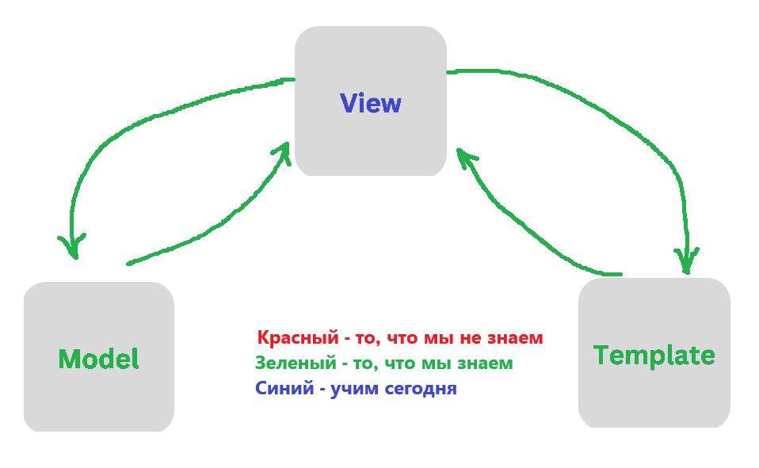

# Лекция 27. Class-Based Views (CBV) в Django


## Что мы сегодня будем учить?



## Что такое CBV и зачем они нужны?

Когда мы создаём сайты на Django, мы привыкли писать функции-обработчики для каждой страницы.

**Например:**

```python
# views.py
from django.shortcuts import render

def home(request):
    return render(request, 'home.html')
```

Это называется `Function-Based View (FBV)` — "представление на основе функции".

Однако, по мере роста проекта, таких функций становится всё больше, и одна и та же логика начинает повторяться:

- Проверка авторизации,
- Загрузка списка объектов,
- Обработка формы создания объекта,
- Обработка формы редактирования объекта,
- Удаление объекта и т.д.

Чтобы избежать дублирования и облегчить поддержку кода, Django предлагает второй подход — **Class-Based Views (CBV)**.

`CBV` — это представления, оформленные в виде классов, а не функций.
Каждый класс отвечает за определённую задачу и может легко переопределять небольшие части поведения, если нужно.

Преимущества использования `CBV`:

- Переиспользование кода: стандартные задачи, вроде CRUD-операций, можно реализовать в пару строк.
- Гибкость: можно менять только нужные части логики, не трогая остальное.
- Расширяемость: легко создавать свои собственные представления на базе стандартных.

## Переход на Class-Based Views

С этого момента мы переходим на использование `view`, основанных исключительно на классах.

Все основные существующие классы Django базируются на классе `View`, который определяет базовое поведение для обработки HTTP-запросов. Ссылка на документацию [тут](https://ccbv.co.uk/).

### Class View

[View](https://ccbv.co.uk/) — это базовый класс для всех `CBV` в Django. Его методы используются абсолютно всеми остальными классами-представлениями (`ListView`, `DetailView`, `CreateView` и т.д.).

### Основные атрибуты и методы класса View

Базовый класс `View` в Django предоставляет несколько важных атрибутов и методов, которые определяют его поведение. Давайте разберём их подробно:

#### http_method_names

Это атрибут класса, который определяет список допустимых HTTP-методов для данного представления. По умолчанию список выглядит так: `['get', 'post', 'put', 'patch', 'delete', 'head', 'options', 'trace']`.Если метод запроса не входит в этот список, будет автоматически возвращён ответ `405 (Method Not Allowed)`.

#### as_view()

Это основной метод, который превращает класс в обычную вызываемую функцию, совместимую с Django маршрутизатором `(urls.py)`. Когда мы указываем класс-представление в `urlpatterns`, мы всегда вызываем `as_view()`. Внутри этот метод создаёт экземпляр класса, вызывает `setup()`, а затем передаёт управление методу `dispatch()`.

#### **setup(request, *args, kwargs)

Этот метод вызывается первым при обработке запроса. Он сохраняет в экземпляре класса `(self)` следующие данные:

- сам запрос `(self.request)`,
- позиционные аргументы `(self.args)`,
- именованные аргументы `(self.kwargs)`.

Благодаря этому, во всех дальнейших методах представления `(get, post и других)` мы можем напрямую обращаться к этим данным через `self.request`, `self.args`, `self.kwargs`.

#### **dispatch(request, *args, kwargs)

После выполнения `setup`, Django вызывает метод `dispatch`. Именно здесь происходит выбор метода для обработки запроса в зависимости от типа запроса (например, `GET`, `POST` и так далее).

Сначала проверяется, разрешён ли тип запроса согласно списку `http_method_names`. Затем `dispatch` ищет соответствующий метод в экземпляре класса (`get()`, `post()`, `put()`, `delete()` и т.д.). Если метод найден — он вызывается. Если нет — вызывается метод `http_method_not_allowed()`.

#### **http_method_not_allowed(request, *args, kwargs)

Этот метод вызывается, если представление не поддерживает пришедший тип HTTP-запроса. Например, если запрос сделан методом `POST`, но в классе определён только метод `get()`, будет вызван `http_method_not_allowed()`, который вернёт стандартный ответ `HTTP 405 (Method Not Allowed)`.

Реализуем класс-представление, которое возвращает HTML-страницу — аналог простой функции `home()` которая у нас была раньше.:

```python
def home(request):
    return render(request, "index.html")

```

Наша функция `home()` возвращает HTML-страницу, а теперь сделаем то же самое с помощью класса-представления:

```python
# views.py
from django.views import View
from django.shortcuts import render

class HomeView(View):

    http_method_names = ['get', ] # разрешаем только GET-запросы

    def get(self, request, *args, **kwargs):
        return render(request, 'index.html')
```

Изменим `urls.py`, чтобы использовать класс-представление:

```python
# urls.py
from django.urls import path
from .views import HomeView

urlpatterns = [
    path('', HomeView.as_view(), name='home'),
]
```

**Что мы сделали:**

- Класс `HomeView` наследует от `View`.
- Определяем метод `get()` — он вызывается при `GET`-запросе.
- Возвращаем HTML-шаблон `index.html` с помощью функции `render()`.
- В `urls.py` передаём `HomeView.as_view()`, чтобы Django мог вызвать класс как обычную view-функцию.


Теперь добавим в класс метод `post()`, который будет обрабатывать `POST`-запросы. Например, мы можем создать форму, которая отправляет данные на сервер:

```python
# views.py
from django.views import View
from django.shortcuts import render
from django.http import HttpResponse

class HomeView(View):

    http_method_names = ['get', ] # разрешаем только GET-запросы

    def get(self, request, *args, **kwargs):
        return render(request, 'index.html')

class HelloView(View):

    http_method_names = ['get', 'post'] # разрешаем GET-запросы, POST-запросы

    def get(self, request, *args, **kwargs):
        return HttpResponse("Ожидается POST-запрос")

    def post(self, request, *args, **kwargs):
        name = request.POST.get('name', '')
        return HttpResponse(f'Привет, {name}!')
```

добавим в `urls.py`:

Изменим `urls.py`, чтобы использовать класс-представление:

```python
# urls.py
from django.urls import path
from .views import HomeView, HelloView  # Импортируем классы

urlpatterns = [
    path("", HomeView.as_view(), name="home_page"),
    path("hello/", HelloView.as_view(), name="hello"),
]
```

**Что здесь происходит:**

- `''` — домашняя страница (HomeView), отображает index.html.
- `'hello/'` — страница для отправки формы (HelloView).

Таким образом, мы грамотно разделяем ответственность: Один класс рендерит форму `(HomeView)`. Другой класс обрабатывает данные `(HelloView)`.

## Class TemplateView

[TemplateView](https://ccbv.co.uk/projects/Django/4.2/django.views.generic.base/TemplateView/) — это один из самых простых и часто используемых классов в Django. Он предназначен для отображения HTML-шаблона без необходимости переопределять метод get() вручную.

Этот класс идеально подходит для:

- статичных страниц (например: "О нас", "Контакты", "Главная"),
- страниц, где не требуется логика в `views.py`,

**Наследование**

`TemplateView` наследуется от:

```python
TemplateView → GenericView → View
```

То есть он использует всё то же поведение, что и `View`, но дополняет его автоматическим рендерингом шаблона.

Основные атрибуты :

`template_name` — имя HTML-шаблона, который будет отображаться.

**Пример использования:**

```python
# views.py
from django.views.generic import TemplateView

class AboutPageView(TemplateView):
    template_name = "about.html"
```

```python
# urls.py
from django.urls import path
from .views import AboutPageView

urlpatterns = [
    path("about/", AboutPageView.as_view(), name="about"),
]
```

**Что здесь происходит:**

- Мы создаём класс `AboutPageView`, наследуемый от `TemplateView`.
- Указываем, какой шаблон должен быть отрендерен `(about.html)`.
- Django сам вызывает метод `get()` и рендерит шаблон без лишнего кода.

### Как передать данные в шаблон?

Есть несколько способов передать данные в шаблон, используя `TemplateView`.

#### 1. Метод `get_context_data()` 

Если нужно передать переменные в шаблон — можно переопределить метод `get_context_data()`:

```python
# views.py
class HomePageView(TemplateView):
    template_name = "home.html"

    def get_context_data(self, **kwargs):
        context = super().get_context_data(**kwargs)
        context["title"] = "Добро пожаловать на сайт!"
        context["year"] = 2025
        return context
```

```html
<!-- templates/home.html -->
<h1>{{ title }}</h1>
<p>Текущий год: {{ year }}</p>
```

**Что происходит:**

- Метод `get_context_data()` возвращает словарь переменных для шаблона и выполняется с каждым запросом.
- Мы добавляем туда ключи `title` и `year`, которые можно использовать в `home.html`.


#### 2. Через атрибут extra_context

Это более короткий способ — если нужно передать **статичные данные**:

```python
# views.py
class AboutPageView(TemplateView):
    template_name = "about.html"
    extra_context = {
        "title": "О нас",
        "company": "MyCompany"
    }
```

```html
<!-- templates/about.html -->
<h2>{{ title }}</h2>
<p>Компания: {{ company }}</p>
```

Особенности:

- Это просто словарь с переменными.
- Подходит для фиксированных значений, которые не меняются от запроса к запросу.
- Django сам добавит их в контекст шаблона без переопределения метода.

Очень удобно, когда нужно передать несколько статичных переменных в шаблон.

**Важно помнить, что `extra_context` не заменяет метод `get_context_data()`. Если оба используются, то сначала выполняется `get_context_data()`, а затем добавляются переменные из `extra_context`.**

#### Важное предупреждение

**Нельзя использовать `extra_context` для запроса данных из базы:**

```python
# Плохо! Это сработает только при запуске сервера.
extra_context = {
    "products": Products.objects.all()  # выполнится один раз
}
```

Почему это опасно:

- Выражение выполнится при старте проекта, а не при каждом запросе.
- Если потом база изменится — в шаблоне будут показаны устаревшие данные.

**Правильный способ — использовать `get_context_data()`:**

```python
def get_context_data(self, **kwargs):
    context = super().get_context_data(**kwargs)
    context["products"] = Products.objects.all()
    return context
```

Теперь данные будут обновляться при каждом запросе.

## Class ListView

[ListView](https://ccbv.co.uk/projects/Django/4.2/django.views.generic.list/ListView/) — это обобщённый класс-представление, предназначенный для отображения списка объектов из базы данных.

Он делает за нас всю типовую работу:

- Получает список объектов из модели,
- Добавляет его в контекст шаблона,
- Использует шаблон с именем `<имя_модели>_list.html` по умолчанию.

```python
# views.py
from django.views.generic import ListView
from .models import Product

class ProductListView(ListView):
    model = Product
    template_name = "products/product_list.html"  # можно не указывать, если придерживаться шаблона
    context_object_name = "products"  # как переменная будет называться в шаблоне
```

```python
# urls.py
from django.urls import path
from .views import ProductListView

urlpatterns = [
    path("products/", ProductListView.as_view(), name="product_list"),
]
```

**Шаблон product_list.html**

```html
<!-- templates/products/product_list.html -->
<h1>Список товаров</h1>

<ul>
  
    <li>{{ product.name }} — {{ product.price }}</li>
  
    <li>Нет доступных товаров.</li>
  
</ul>
```

### Что делает ListView автоматически?

Когда вы используете `ListView`, Django берёт на себя выполнение ряда стандартных действий, чтобы вы могли сосредоточиться на логике приложения.

**Получение списка объектов.**

Если вы указали атрибут `model`, то Django автоматически выполнит запрос `Model.objects.all()` и передаст результат в шаблон.

**Назначение имени переменной в шаблоне.**

По умолчанию список объектов передаётся в шаблон под именем `object_list`. Если хотите использовать другое имя — задайте атрибут `context_object_name`.

**Определение имени шаблона.**

Если вы не указали явно `template_name`, Django будет искать шаблон с именем по формуле:

- `<имя_модели в нижнем регистре>_list.html`,
- например: `product_list.html`.
- Но вы всегда можете указать путь к шаблону вручную.

### Как изменить набор объектов?

По умолчанию `ListView` использует `model.objects.all()`, но вы можете переопределить этот набор, например, чтобы отфильтровать только нужные записи из базы. Для этого нужно переопределить метод `get_queryset()`.

Пример: отобразить только товары дешевле 500

```python
from django.views.generic import ListView
from .models import Product

class CheapProductListView(ListView):
    model = Product
    context_object_name = "products"
    template_name = "products/cheap_list.html"

    def get_queryset(self):
        return Product.objects.filter(price__lt=500)
```

**Что происходит:**

- Мы переопределили метод `get_queryset()`, чтобы вернуть только те товары, у которых цена меньше 500.
- Метод `filter(price__lt=500)` использует Django ORM для фильтрации по полю `price`.
- `context_object_name = "products"` позволяет обращаться к списку объектов в шаблоне как к `products`.

### Кеширование запросов

Если выборка тяжёлая — можно обернуть `get_queryset`() кешем:

```python
from django.views.generic import ListView
from django.core.cache import cache

class CachedProductListView(ListView):
    model = Product
    template_name = "products/list.html"

    def get_queryset(self):
        return cache.get_or_set("product_list", lambda: Product.objects.all(), timeout=60)
```

**Что здесь происходит:**

Метод `get_queryset()` оборачивается функцией `cache.get_or_set()`:

- Если по ключу "`product_list`" в кеше ничего нет — выполняется запрос `Product.objects.all()` и результат сохраняется.
- Аргумент `timeout=60` означает, что кеш будет действовать 60 секунд.

### Как ещё можно задать список объектов?

Если фильтрация не зависит от запроса или логики, можно использовать атрибут `queryset` вместо переопределения `get_queryset()`.

Пример с фильтрацией товаров до 500:

```python
from django.views.generic import ListView
from .models import Product

class CheapProductListView(ListView):
    queryset = Product.objects.filter(price__lt=500)
    context_object_name = "products"
    template_name = "products/cheap_list.html"
```

Мы явно задали `queryset` как отфильтрованный набор объектов. Это делается один раз при загрузке класса, а не при каждом запросе. Подходит, если фильтрация фиксированная и не зависит от пользователя, формы или запроса.

#### Когда не стоит использовать `queryset`?

Если фильтрация должна зависеть от:

- параметров запроса `(request.GET)`,
- текущего пользователя `(request.user)`,
- времени, даты, состояния и т.д.,

то лучше использовать метод `get_queryset()` — он вызывается на каждый запрос и даёт полный контроль.

### Пагинация в ListView

`ListView` в Django поддерживает [пагинацию](https://docs.djangoproject.com/en/4.2/topics/pagination/) *"из коробки"*. Чтобы включить её, достаточно указать атрибут `paginate_by` — и Django сам разобьёт список объектов на страницы.

**Пример: пагинация по 5 товаров на страницу**

```python
from django.views.generic import ListView
from .models import Product

class ProductListView(ListView):
    model = Product
    context_object_name = "products"
    template_name = "products/product_list.html"
    paginate_by = 5  # показывать 5 товаров на одной странице
```

Что делает Django:

- Автоматически разбивает список объектов на страницы.
- Использует параметры `?page=1`, `?page=2` и т.д. из `URL`.
- Добавляет в шаблон объект `page_obj` с текущей страницей.
- Добавляет `is_paginated` — флаг, нужна ли пагинация вообще.

**Пример шаблона с пагинацией**

```html
<!-- templates/products/product_list.html -->
<h1>Все товары</h1>

<ul>
  
    <li>{{ product.name }} — {{ product.price }}</li>
  
    <li>Товары не найдены.</li>
  
</ul>

<!-- Пагинация -->

  <div class="pagination">
    
      <a href="?page=1">Первая</a>
      <a href="?page={{ page_obj.previous_page_number }}">Назад</a>
    

     
      
        <strong>{{ page_num }}</strong>
      
        <a href="?page={{ page_num }}">{{ page_num }}</a>
      
    

    
      <a href="?page={{ page_obj.next_page_number }}">Вперёд</a>
      <a href="?page={{ page_obj.paginator.num_pages }}">Последняя</a>
    
  </div>

```

**Советы**

- Всегда проверяй `is_paginated`, прежде чем показывать кнопки страниц.
- Убедись, что ты правильно используешь `?page=...` в URL — иначе Django не поймёт, на какую - страницу перейти.

### Сортировка через атрибут ordering в ListView

В классе `ListView` можно задать порядок отображения объектов с помощью специального атрибута `ordering`.

Этот способ подходит, когда нужно просто отсортировать объекты без дополнительной логики.

**Пример: сортировка товаров по цене**

```python
from django.views.generic import ListView
from .models import Product

class ProductListView(ListView):
    model = Product
    template_name = "products/product_list.html"
    context_object_name = "products"
    ordering = ['price']  # Сортировка по возрастанию цены
    paginate_by = 5
```

**Убывающая сортировка**

Чтобы отсортировать по убыванию, добавьте минус перед полем:

```python
ordering = ['-created_at']
```

**Важно помнить:**

- `ordering` работает только если вы не переопределили `get_queryset()` вручную.
- Если нужно более гибкая логика (например, фильтрация + сортировка) — переопределяйте `get_queryset()` и используйте `order_by()`.
- Атрибут `ordering` переопределяет `Meta.ordering` в модели, если указан.

Это самый быстрый способ задать простой порядок сортировки объектов в ListView, не прибегая к дополнительному коду.

##  Class DetailView

[DetailView](https://ccbv.co.uk/projects/Django/4.2/django.views.generic.detail/DetailView/) — это обобщённый класс-представление, предназначенный для отображения одного объекта модели.

Он автоматически:

- извлекает объект из базы данных по `pk` или `slug`,
- передаёт его в шаблон (по умолчанию под именем `object`),
- использует шаблон с именем `<имя_модели>_detail.html`, если не указать `template_name`.

**Пример: отображение одного товара**

```python
# views.py
from django.views.generic import DetailView
from .models import Product

class ProductDetailView(DetailView):
    model = Product
    template_name = "products/product_detail.html"
    context_object_name = "product"
```

```python
# urls.py
from django.urls import path
from .views import ProductDetailView

urlpatterns = [
    path("products/<int:pk>/", ProductDetailView.as_view(), name="product_detail"),
]
```

```html
<!-- templates/products/product_detail.html -->
<h1>{{ product.name }}</h1>
<p>Цена: {{ product.price }}</p>
<p>Описание: {{ product.description }}</p>
<a href="">← Назад к списку</a>
```

### Что делает DetailView автоматически?

- Получает объект по `pk`, переданному в URL (например: `/products/3/`).
- Передаёт его в шаблон под именем object (или `context_object_name`, если указано).
- Ищет шаблон по умолчанию: `<имя_модели>_detail.html`.

### Полезные атрибуты и методы DetailView

Класс `DetailView` предоставляет ряд атрибутов и методов, которые позволяют гибко управлять выборкой данных и отображением шаблона:

- `model` — указывает модель, с которой работает представление.

- `template_name` — задаёт путь к шаблону, который нужно отрендерить. Если не указан, Django подставит шаблон по умолчанию.

- `context_object_name` — определяет имя переменной, под которым объект будет передан в шаблон (по умолчанию это `object`).

- `pk_url_kwarg` — имя параметра в URL, по которому ищется pk. По умолчанию используется `"pk"`.

- `slug_field` — указывает поле модели, по которому будет происходить поиск при использовании `slug` (например, `slug = models.SlugField(...))`.

- `slug_url_kwarg` — задаёт имя параметра `slug` в URL-шаблоне, если используется поиск по слагу.

- `get_queryset()` — метод, который позволяет ограничить выборку объектов, например: `Product.objects.filter(is_published=True)`.

- `get_context_data()` — метод, позволяющий добавить дополнительные переменные в контекст шаблона, помимо самого объекта.

### Добавление дополнительных данных через get_context_data()

Иногда нужно передать в шаблон дополнительные переменные, например:

- текущую дату,
- связанные объекты (комментарии, теги),
- заголовок страницы и т.д.

Для этого можно переопределить метод `get_context_data()`:

```python
from datetime import date

class ProductDetailView(DetailView):
    model = Product
    template_name = "products/product_detail.html"
    context_object_name = "product"

    def get_context_data(self, **kwargs):
        context = super().get_context_data(**kwargs)
        context['title'] = f"Товар: {self.object.name}"
        context['today'] = date.today()
        return context
```

```html
<!-- templates/products/product_detail.html -->
<h1>{{ title }}</h1>
<p>Сегодня: {{ today }}</p>
<p>Товар: {{ product.name }}</p>
<p>Цена: {{ product.price }}</p>
```

**Здесь:**

`self.object` — это объект, который извлёк `DetailView` из базы данных по `pk` или `slug`. В данном случае — это товар, который мы хотим отобразить. Мы используем его, чтобы динамически построить заголовок, в шаблон также передаётся текущая дата `today`.

### Когда использовать DetailView

- Когда нужно вывести один объект на отдельной странице (товар, статья, заказ и т.д.).
- Когда хочешь избежать лишнего кода — `DetailView` сам извлечёт объект по `pk` или `slug`.
- Когда шаблон не требует сложной логики (или она добавляется через `get_context_data()`).

### DetailView с использованием slug

Если в модели есть поле `slug`, ты можешь настроить `DetailView` так, чтобы объект искался не по `pk`, а по `slug`.

**Пример модели с slug-полем**

```python
from django.db import models
from django.utils.text import slugify

class Product(models.Model):
    name = models.CharField(max_length=100)
    slug = models.SlugField(unique=True)
    price = models.DecimalField(max_digits=8, decimal_places=2)
    description = models.TextField()

    def __str__(self):
        return self.name
```

**Представление: `DetailView` по `slug`**

```python
from django.views.generic import DetailView
from .models import Product

class ProductDetailView(DetailView):
    model = Product
    template_name = "products/product_detail.html"
    context_object_name = "product"
    slug_field = "slug"             # по какому полю искать в базе
    slug_url_kwarg = "product_slug" # как называется параметр в URL
```

**Настройка URL**

```python
# urls.py
from django.urls import path
from .views import ProductDetailView

urlpatterns = [
    path("products/<slug:product_slug>/", ProductDetailView.as_view(), name="product_detail"),
]
```

**Шаблон**

```html
<!-- templates/products/product_detail.html -->
<h1>{{ product.name }}</h1>
<p>Цена: {{ product.price }}</p>
<p>Описание: {{ product.description }}</p>
```

**Что здесь происходит:**

- URL содержит `slug`, например: `/products/apple-iphone-15/`
- Django получает значение `product_slug` из `URL` и ищет объект в базе: `Product.objects.get(slug="apple-iphone-15")`

- Объект передаётся в шаблон под именем `product`.

Такой подход используется во всех современных сайтах: для SEO, удобных ссылок и читаемости адресов.

## Class CreateView

[CreateView](https://ccbv.co.uk/projects/Django/4.2/django.views.generic.edit/CreateView/) — это обобщённое представление, которое:

- автоматически создаёт HTML-форму на основе модели,
- обрабатывает отправку формы (POST-запрос),
- сохраняет новый объект в базу данных,

перенаправляет пользователя на другую страницу (по умолчанию — на `get_absolute_url()`).

**Простой пример: форма добавления нового товара**

```python
# views.py
from django.views.generic.edit import CreateView
from .models import Product

class ProductCreateView(CreateView):
    model = Product
    template_name = "product_form.html"
    fields = ["name", "price", "category"]  # добавили поле category
    success_url = "/" # куда перенаправить после успешного создания, тут переходим на главную страницу
```

```python
# urls.py
from django.urls import path
from .views import ProductCreateView

urlpatterns = [
    path("products/create/", ProductCreateView.as_view(), name="product_create"),
]
```

```html
<!-- templates/product_form.html -->
<h1>Добавить товар</h1>

<form method="post">
  
  {{ form.as_p }}
  <button type="submit">Сохранить</button>
</form>
```

**Как это работает:**

- CreateView создаёт форму по указанным полям `(fields)`.
- При GET-запросе отображает пустую форму.
- При POST — валидирует, сохраняет объект и выполняет редирект.
- `success_url` указывает, куда перейти после успешного сохранения.
- Если у модели есть метод `get_absolute_url()`, `success_url` можно не указывать — он подставится автоматически.

### Альтернатива: использовать form_class и ModelForm

Иногда базового указания `fields = [...]` недостаточно.
Например, ты хочешь:

- кастомизировать поля (добавить `help_text`, `label`, `widget`, `attrs`),
- изменить порядок полей,
- добавить собственную валидацию.

В таких случаях лучше использовать собственную `ModelForm`, а в `CreateView` подключить её через `form_class`.

**Представление (views.py)**

```python
from django.views.generic.edit import CreateView
from django.urls import reverse_lazy
from .models import Product
from .forms import ProductForm

class ProductCreateView(CreateView):
    model = Product
    form_class = ProductForm
    template_name = "products/product_form.html"
    success_url = reverse_lazy("home_page")  # редирект на главную после создания, еще один способ указать путь
```

**Пример формы (forms.py)**

```python
# forms.py
from django import forms
from .models import Product

class ProductForm(forms.ModelForm):
    class Meta:
        model = Product
        fields = ["name", "price", "category"]
        labels = {
            "name": "Название товара",
            "price": "Цена (крон)",
            "category": "Категория"
        }
        widgets = {
            "name": forms.TextInput(attrs={"class": "form-control"}),
            "price": forms.NumberInput(attrs={"class": "form-control", "min": 0}),
            "category": forms.Select(attrs={"class": "form-select"})
        }
```

**Шаблон (product_form.html)**

```html
<h1>Добавить новый товар</h1>

<form method="post">
  
  {{ form.as_p }}
  <button type="submit" class="btn btn-primary">Сохранить</button>
</form>
```

**Что даёт использование `form_class` и `ModelForm`:**

- Возможность полностью контролировать внешний вид и поведение формы.

- Более чистый и переиспользуемый код — можно подключить эту форму и в admin, и в других местах.

- Простая реализация собственной валидации (`clean_<field>() `или `clean()`).

#### Пример: собственная валидация через clean_price()

Допустим, ты хочешь запретить сохранять товар с ценой меньше 1 кроны.

**Обновим форму (forms.py)**

```python
from django import forms
from .models import Product

class ProductForm(forms.ModelForm):
    class Meta:
        model = Product
        fields = ["name", "price", "category"]
        labels = {
            "name": "Название товара",
            "price": "Цена (крон)",
            "category": "Категория"
        }
        widgets = {
            "name": forms.TextInput(attrs={"class": "form-control"}),
            "price": forms.NumberInput(attrs={"class": "form-control", "min": 0}),
            "category": forms.Select(attrs={"class": "form-select"})
        }

    def clean_price(self):
        price = self.cleaned_data.get("price")
        if price is not None and price < 1:
            raise forms.ValidationError("Цена должна быть не менее 1 кроны.")
        return price
```

**Что здесь происходит:**

- Метод `clean_price()` автоматически вызывается при валидации формы.
- Если условие не проходит, Django подставит ошибку рядом с полем price в шаблоне.
- Если всё в порядке — возвращаем значение поля.

#### Можно сделать общую валидацию всех полей:

Если проверка зависит от двух или более полей — используйте `def clean(self)`:

```python
def clean(self):
    cleaned_data = super().clean()
    price = cleaned_data.get("price")
    name = cleaned_data.get("name")

    if price == 999 and name == "Банан":
        raise forms.ValidationError("Банан не может стоить 999 грн.")
```

Помимо базового использования, `CreateView` позволяет легко добавлять:

- собственную логику до или после сохранения формы,
- дополнительный контекст в шаблон,
- собственную валидацию данных.

#### Переопределение form_valid()

Метод `form_valid(`) вызывается, если форма прошла валидацию. Мы можем переопределить его, чтобы добавить дополнительную логику до сохранения.

Например, сохранить автора созданного объекта:

```python
class ProductCreateView(CreateView):
    model = Product
    fields = ["name", "price", "category"]
    template_name = "products/product_form.html"
    success_url = "/products/"

    def form_valid(self, form):
        form.instance.created_by = self.request.user  # добавим текущего пользователя
        return super().form_valid(form)
```

**Здесь:**

- `form.instance `— это ещё несохранённый объект модели.
- Мы добавили поле `created_by` (предположим, оно есть в модели).
- Затем вызываем родительский `form_valid`, чтобы сохранить объект и выполнить редирект.

#### Добавление данных в шаблон через get_context_data()

Как и в других `CBV`, ты можешь передать в шаблон дополнительные переменные:

```python
def get_context_data(self, **kwargs):
    context = super().get_context_data(**kwargs)
    context["title"] = "Добавление нового товара"
    return context
```

**В шаблоне:**

```html
<h1>{{ title }}</h1>
<form method="post">
    
    {{ form.as_p }}
    <button type="submit">Создать</button>
</form>
```

#### Добавление кастомной валидации

Если нужно провести дополнительную проверку — можно использовать `form.clean()` внутри `ModelForm`, или обработать прямо в `form_valid()`:

```python
def form_valid(self, form):
    if form.cleaned_data["price"] <= 0:
        form.add_error("price", "Цена должна быть больше нуля")
        return self.form_invalid(form)  # не сохраняем, возвращаем форму с ошибкой
    return super().form_valid(form) # обязательно вызываем родительский метод для сохранения
```

## Class UpdateView

[UpdateView](https://ccbv.co.uk/projects/Django/4.2/django.views.generic.edit/UpdateView/) — это обобщённое представление, предназначенное для:

- отображения формы с уже заполненными данными объекта,
- редактирования этих данных,
- сохранения изменений в базу данных,
- перенаправления пользователя на другую страницу после успешного обновления.

Он очень похож на `CreateView`, но вместо создания нового объекта — редактирует существующий.

**Пример: редактирование товара**

```python
# views.py
from django.views.generic.edit import UpdateView
from django.urls import reverse_lazy
from .models import Product
from .forms import ProductForm  # можно использовать ту же форму, что и для создания

class ProductUpdateView(UpdateView):
    model = Product
    form_class = ProductForm
    template_name = "products/product_form.html"
    success_url = reverse_lazy("product_list")
```

```python
# urls.py
from django.urls import path
from .views import ProductUpdateView

urlpatterns = [
    path("products/<int:pk>/edit/", ProductUpdateView.as_view(), name="product_edit"),
]
```
**Что происходит:**

- Django по `pk` находит объект в базе: `Product.objects.get(pk=...).`
- Передаёт его в форму — поля будут автоматически заполнены текущими значениями.
- Если форма прошла валидацию — объект сохраняется `(form.save())`, и выполняется редирект.
- Форма и шаблон могут быть тем же самым, что и у `CreateView`.

В шаблоне чтобы сформировать ссылку на редактирование товара, можно использовать тег ``:

```html
<a href="">Редактировать</a>
```

### Как отличить CreateView и UpdateView в шаблоне

Вы можете в `get_context_data()` добавить переменную `is_update`, чтобы в шаблоне отображались разные заголовки и кнопки:

```python
def get_context_data(self, **kwargs):
    context = super().get_context_data(**kwargs)
    context["is_update"] = True
    return context
```

```html
<h1>
   Редактировать товар
   Создать товар
  
</h1>
```

## Class FormView

[FormView](https://ccbv.co.uk/projects/Django/4.2/django.views.generic.edit/CreateView/) — это представление на основе класса, которое позволяет работать с обычной HTML-формой: отобразить её пользователю, обработать введённые данные, проверить валидность и выполнить нужные действия. Главное отличие от `CreateView` и `UpdateView` заключается в том, что `FormView` не привязан к конкретной модели. Это значит, что мы сами решаем, что делать с введёнными данными: сохранить, отправить на email, записать в лог или просто вывести на экран.

Если у нас есть форма, но мы не хотим автоматически создавать или обновлять объект модели — `FormView` будет правильным выбором.

### Где используется FormView?

`FormView` особенно полезен в таких ситуациях:

- форма обратной связи (контактная форма),
- подписка на рассылку,
- фильтрация данных,
- поиск по сайту,
- форма загрузки файла, если обработка идёт вручную.

Это чистый, контролируемый способ обрабатывать данные формы без привязки к `ModelForm` и базе данных.

**Пример: форма обратной связи**

Представим, что мы хотим сделать страницу, где пользователь может оставить своё имя и сообщение. Эти данные сохраняются не в базу, а, например, отправляются по email или выводятся в консоль.

Сначала создадим форму:

```python
# forms.py
from django import forms

class ContactForm(forms.Form):
    name = forms.CharField(label="Ваше имя", max_length=100)
    message = forms.CharField(label="Сообщение", widget=forms.Textarea)
```

Теперь создадим представление:

```python
# views.py
from django.views.generic.edit import FormView
from django.urls import reverse_lazy
from .forms import ContactForm

class ContactFormView(FormView):
    template_name = "contact_form.html"
    form_class = ContactForm
    success_url = reverse_lazy("home_page")  # перенаправим на главную после отправки формы

    def form_valid(self, form):
        # Здесь можно отправить email, записать лог, уведомить администратора и т.д.
        print("Новое сообщение от:", form.cleaned_data["name"])
        print("Текст сообщения:", form.cleaned_data["message"])
        return super().form_valid(form)
```

В `urls.py` подключим маршрут:

```python
# urls.py
from django.urls import path
from .views import ContactFormView

urlpatterns = [
    path("contact/", ContactFormView.as_view(), name="contact"),
]
```

И создадим шаблон `contact_form.html`:

```html
<h1>Форма обратной связи</h1>

<form method="post">
  
  {{ form.as_p }}
  <button type="submit">Отправить</button>
</form>
```

**Что происходит под капотом?**

Когда пользователь переходит на страницу `/contact/`, `FormView` обрабатывает `GET`-запрос, создаёт объект формы и отображает шаблон с этой формой. Когда пользователь отправляет данные (нажимает кнопку), браузер отправляет `POST`-запрос. Внутри `FormView` выполняются такие шаги:

- Создаётся экземпляр формы с данными из `POST`.
- Выполняется проверка `.is_valid()`.
- Если данные корректны, вызывается метод `form_valid()`.
- Если в форме ошибка — вызывается `form_invalid()` и шаблон отображается снова с сообщениями об ошибках.
- Если `form_valid()` отработал успешно — происходит перенаправление на `success_url`.

Таким образом, ты получаешь очень простую, но мощную структуру: только нужная логика, никакой привязки к моделям.

### Как задать начальные значения в форму?

Иногда нужно заранее заполнить некоторые поля формы, например, имя текущего пользователя. Это можно сделать, переопределив метод `get_initial()`:

```python
def get_initial(self):
    return {
        "name": self.request.user.username  # авто-заполнение имени
    }
```

### Как добавить данные в шаблон?

Если мы хотим передать в шаблон дополнительные переменные (например, заголовок страницы), можем переопределить `get_context_data()`:

```python
def get_context_data(self, **kwargs):
    context = super().get_context_data(**kwargs)
    context["title"] = "Связаться с нами"
    return context
```

И в шаблоне:

```html
<h1>{{ title }}</h1>
<form method="post">
  
  {{ form.as_p }}
  <button type="submit">Отправить</button>
</form>
```

### Что делать в form_valid()?

Этот метод вызывается, когда форма прошла валидацию. Мы можем сделать всё, что угодно:

- отправить письмо,
- сделать запись в лог,
- вызвать внешний `API`,
- записать что-то вручную в базу.

Пример:

```python
def form_valid(self, form):
    name = form.cleaned_data["name"]
    message = form.cleaned_data["message"]
    
    # Псевдо-отправка email
    send_email_to_support(name, message)

    return super().form_valid(form)
```

`FormView` — это мощное, но очень простое средство для работы с формами, когда нам не нужно создавать объекты в базе. Мы полностью контролируем поведение формы и можем сосредоточиться на бизнес-логике.Если `CreateView` и `UpdateView` завязаны на модели, `FormView` даёт нам полную свободу — форма может быть любой, а действия по отправке — абсолютно произвольными.

## Class DeleteView

[DeleteView](https://ccbv.co.uk/projects/Django/4.2/django.views.generic.edit/DeleteView/) — это обобщённое представление, которое:

- отображает страницу подтверждения удаления объекта,
- удаляет объект из базы данных при POST-запросе,
- перенаправляет пользователя на указанную страницу после удаления (success_url).

**Пример: удаление товара**

```python
# views.py
from django.views.generic.edit import DeleteView
from django.urls import reverse_lazy
from .models import Product

class ProductDeleteView(DeleteView):
    model = Product
    template_name = "product_confirm_delete.html"
    success_url = reverse_lazy("product_list")
```

```python
# urls.py
from django.urls import path
from .views import ProductDeleteView

urlpatterns = [
    path("products/<int:pk>/delete/", ProductDeleteView.as_view(), name="product_delete"),
]
```

**Шаблон подтверждения (product_confirm_delete.html)**
```html
<!-- templates/product_confirm_delete.html -->
<h1>Удалить товар "{{ object.name }}"?</h1>

<form method="post">
  
  <button type="submit" class="btn btn-danger">Да, удалить</button>
  <a href="">Отмена</a>
</form>
```

**Как это работает:**

- При GET-запросе отображается страница подтверждения.
- При POST-запросе объект удаляется `(object.delete())`.
- После удаления происходит редирект на `success_url`.

### Полезные атрибуты DeleteView

- `model`	- Удаляемая модель
- `template_name` - HTML-шаблон подтверждения
- `success_url`	- Куда редиректить после удаления
- `context_object_name`	- Как передать объект в шаблон (object по умолчанию)

## Что делать, еcли не нужен шаблон подтверждения?

Иногда не хочется выводить отдельную страницу подтверждения удаления. Например, вы хотите удалить объект сразу по нажатию кнопки на детальной странице.

В этом случае:

- не указывайте `template_name`,
- просто отправьте POST-запрос на URL удаления из любого шаблона.

**Пример: форма удаления на странице `product_detail.html`**

```html
<form method="post" action="">
  
  <button type="submit" class="btn btn-danger">Удалить товар</button>
</form>
```

Представление остаётся тем же:

```python
class ProductDeleteView(DeleteView):
    model = Product
    success_url = reverse_lazy("product_list")
    # template_name не указываем, чтобы не было страницы подтверждения
```

`Важно`: если будет выполнен `GET`-запрос, Django попытается отрендерить шаблон `product_confirm_delete.html`.Поэтому форма обязательно должна отправлять `POST`, иначе будет ошибка `TemplateDoesNotExist`

## Class RedirectView

В Django [RedirectView](https://ccbv.co.uk/projects/Django/4.2/django.views.generic.base/RedirectView/) — это специальный класс-представление, задача которого — перенаправить пользователя с одного URL на другой. Это очень простой и лёгкий способ задать редирект без необходимости писать функцию или логику вручную.

Такой класс удобно использовать, когда нам не нужно отображать страницу, а нужно просто сказать браузеру:
«Эта страница больше не здесь — перейди туда-то».

**Зачем и когда использовать RedirectView?**

- Например, мы перенёсли главную страницу сайта с `/home/` на `/`, но хотим сохранить старый адрес, чтобы не было ошибки `404`.
- Или у нас есть устаревший URL `/about-old/`, который теперь должен вести на `/about/`.
- Также можно сделать временное перенаправление на внешние сайты (например, документацию).
- Или просто перекидывать пользователей на главную после входа или выхода с сайта.

Во всех этих случаях мы можем использовать `RedirectView`, и нам не нужно писать собственную логику — всё уже встроено.

**Простой пример: редирект со страницы `/main/` на `/`**

Допустим, у нас есть URL `/main/`, но мы хотим, чтобы пользователь при переходе на этот адрес автоматически попадал на домашнюю страницу.

```python
# views.py
from django.views.generic.base import RedirectView
from django.urls import reverse_lazy

class HomeRedirectView(RedirectView):
    url = reverse_lazy("home_page")  # указываем имя маршрута, на который надо перенаправить
```

**Теперь добавим маршрут:**

```python
# urls.py
from django.urls import path
from .views import HomeRedirectView

urlpatterns = [
    path("main/", HomeRedirectView.as_view(), name="main_redirect"),
]
```

**Что произойдёт:**

Пользователь заходит по адресу `http://example.com/main/`, и его автоматически перенаправляют на `http://example.com/` — то есть на домашнюю страницу. Никакого HTML-шаблона не нужно, потому что страница даже не загружается — браузер сразу делает переход на другой адрес.

### Временное и постоянное перенаправление

По умолчанию `RedirectView` делает временный редирект — это значит, что браузер считает страницу временно перемещённой (`HTTP-код 302`).
Если мы хотим сделать постоянный редирект (`HTTP-код 301`), например для SEO, можно добавить параметр `permanent = True`:

```python
class HomeRedirectView(RedirectView):
    url = reverse_lazy("home_page")
    permanent = True  # теперь редирект будет постоянным
```

### Как сделать редирект с параметрами (pk, slug)?

Если тебе нужно перенаправить пользователя на страницу конкретного объекта, можно использовать `pattern_name` вместо `url`. В этом случае ты указываешь имя маршрута, в который автоматически подставятся аргументы из URL.

Допустим, у нас есть страница `/go-to-product/3/`, и мы хотим, чтобы она перенаправляла на страницу товара с `ID = 3`.

```python
# urls.py
from django.urls import path
from .views import ProductRedirectView

urlpatterns = [
    path("go-to-product/<int:pk>/", ProductRedirectView.as_view(), name="product_go"),
]
```

```python
# views.py
class ProductRedirectView(RedirectView):
    pattern_name = "product_detail"  # имя маршрута, куда происходит редирект
```

Когда пользователь откроет `/go-to-product/3/`, Django выполнит `reverse("product_detail", kwargs={"pk": 3})` и перенаправит его на страницу `/products/3/`.

## Class LoginView

[LoginView](https://ccbv.co.uk/projects/Django/4.2/django.contrib.auth.views/LoginView/) — это встроенное представление Django, которое отвечает за аутентификацию пользователей. Оно автоматически:

- отображает HTML-форму для ввода логина и пароля,
- обрабатывает `POST`-запрос с учётными данными,
- проверяет пользователя через `authenticate()`,
- выполняет вход с помощью `login()`,
- и перенаправляет пользователя на нужную страницу.

И всё это — без необходимости писать кучу ручного кода. `LoginView` — это стандартный способ реализовать форму входа на сайт.

### Когда использовать LoginView?

Когда нам нужно:

- создать страницу авторизации на сайте,
- выполнить вход пользователя в систему,
- использовать встроенную сессию Django и хранение состояния входа.

Django уже предоставляет готовый функционал, и нам не нужно реализовывать всё вручную.

**Простой пример авторизации**

Напишем представление, которое будет обрабатывать вход пользователя:

```python
# views.py
from django.contrib.auth.views import LoginView
from django.urls import reverse_lazy

class CustomLoginView(LoginView):
    template_name = "login.html"  # Шаблон с формой входа
    redirect_authenticated_user = True  # Уже вошедших перенаправим на главную
    next_page = reverse_lazy("home")  # Куда перейти после входа
```

Подключим представление входа в `urls.py`:

```python
# urls.py
from django.urls import path
from .views import CustomLoginView

urlpatterns = [
    path("login/", CustomLoginView.as_view(), name="login"),
]
```

Всё! Теперь при переходе на `/login/` Django отобразит форму логина.

Но чтобы форма корректно отобразилась, нужен шаблон по умолчанию — `login.html`.

Создим файл templates/login.html и добавим туда:

```html
<h1>Вход на сайт</h1>

<form method="post">
  
  {{ form.as_p }}
  <button type="submit">Войти</button>
</form>
```

Если пользователь введёт корректные данные, он будет автоматически авторизован, и его сессия будет активна.

**Что происходит при логине?**

- Пользователь отправляет `POST` с логином и паролем.
- Django вызывает `authenticate(username=..., password=...)`.
- Если учётные данные корректны — вызывается `login()` и создаётся сессия.
- Затем пользователь перенаправляется на `next` или `LOGIN_REDIRECT_URL`.

### Что происходит при повторном входе?

Если пользователь уже авторизован и снова заходит на `/login/`, он по умолчанию всё равно увидит форму входа. Это может быть не очень удобно — ведь пользователь уже *"в системе"*.

Чтобы избежать этого, мы используем параметр `redirect_authenticated_user = True`. Тогда если пользователь уже вошёл, `LoginView` просто перенаправит его на адрес, указанный в `next_page`, либо в `LOGIN_REDIRECT_URL`.

### Куда редиректить после входа?

Есть три способа задать страницу, куда пользователь попадёт после успешного входа:

#### 1.Через next_page в LoginView

```python
class CustomLoginView(LoginView):
    template_name = "login.html"
    redirect_authenticated_user = True
    next_page = reverse_lazy("home")
```

Здесь пользователь после входа будет перенаправлен на страницу `home`, независимо от того, с какой страницы он пришёл.

#### 2. Через настройку в settings.py

```python
# settings.py
LOGIN_REDIRECT_URL = "/"
```

Если в `LoginView` не указан `next_page`, Django будет использовать `LOGIN_REDIRECT_URL` по умолчанию.

### Кастомизация формы логина

Если мы хотим изменить внешний вид формы или добавить стили, можно создать свою форму на основе `AuthenticationForm`:

```python
# forms.py
from django.contrib.auth.forms import AuthenticationForm
from django import forms

class StyledLoginForm(AuthenticationForm):
    username = forms.CharField(
        widget=forms.TextInput(attrs={"class": "form-control", "placeholder": "Логин"})
    )
    password = forms.CharField(
        widget=forms.PasswordInput(attrs={"class": "form-control", "placeholder": "Пароль"})
    )
```

Теперь подключим эту форму в `LoginView`:

```python
class CustomLoginView(LoginView):
    template_name = "login.html"
    authentication_form = StyledLoginForm
    next_page = reverse_lazy("home")
```

### Обработка успешного входа вручную

Если нам нужно выполнить какие-то действия после успешной авторизации (например, залогировать вход или показать сообщение), мы можем переопределить метод `form_valid()`:

```python
def form_valid(self, form):
    user = form.get_user()
    print("Пользователь вошёл:", user.username)
    return super().form_valid(form)
```

### Что если логин неудачен?

Если пользователь ввёл неверные данные, Django вызовет метод `form_invalid()` и снова отобразит форму с сообщениями об ошибках. Все сообщения уже встроены в `AuthenticationForm`, нам ничего дополнительно делать не нужно. Но так же  — можно подключить `messages` и добавить свои уведомления.

### Полезные параметры `LoginView`

| Атрибут                    | Что делает                                                                 |
|----------------------------|---------------------------------------------------------------------------|
| `template_name`            | Путь к шаблону формы входа                                                |
| `next_page`                | Адрес редиректа после логина                                              |
| `redirect_authenticated_user` | Не показывать форму, если пользователь уже вошёл                          |
| `authentication_form`      | Класс формы логина (можно кастомизировать поля, стили и поведение)        |

`LoginView` — это мощный инструмент, который позволяет быстро и безопасно реализовать вход пользователя. Всё, что нам нужно:

- создать шаблон с формой,
- подключить `LoginView` в `urls.py`,
- если нужно - переопределить `form_valid()`,
- при необходимости настроить `redirect`, форму, шаблон или поведение.

И при этом мы не пишем ни одной строчки логики входа — всё уже реализовано внутри Django.

## Class LogoutView

[LogoutView](https://ccbv.co.uk/projects/Django/4.2/django.contrib.auth.views/LogoutView/) — это встроенное представление Django, которое отвечает за выход пользователя из системы. Когда пользователь обращается к этому view, Django:

- завершает текущую сессию пользователя,
- удаляет информацию о нём из request.user,
- и перенаправляет его на заданную страницу.

Это представление не требует формы, и может быть вызвано даже простым GET-запросом. Вся логика выхода уже реализована — нам нужно только подключить маршрут и при необходимости указать, куда перенаправить пользователя после выхода.

Подключим `LogoutView` в `urls.py`:

```python
# urls.py
from django.urls import path
from django.contrib.auth.views import LogoutView

urlpatterns = [
    path("logout/", LogoutView.as_view(), name="logout"),
]
```

Теперь, если пользователь перейдёт по `/logout/`, он будет автоматически выведен из системы.

**По умолчанию происходит следующее:**

- Пользовательская сессия удаляется.
- `request.user` становится `AnonymousUser`.
- После этого Django перенаправляет пользователя на `/accounts/logout/`, если ты не указал другой адрес.

Чтобы изменить это поведение, нужно явно указать, куда перенаправлять после выхода.

### Куда редиректить после выхода?

Есть два способа:

**1. Указать `next_page` в `LogoutView`**

```python
path("logout/", LogoutView.as_view(next_page="home_page"), name="logout")
```
Здесь next_page — это имя URL, на который будет выполнен редирект.

**2. Установить `LOGOUT_REDIRECT_URL` в `settings.py`**

```python
# settings.py
LOGOUT_REDIRECT_URL = "/"
```

Если `next_page` не указан в `LogoutView`, Django будет использовать `LOGOUT_REDIRECT_URL`.

### Разметка для выхода из аккаунта

Создадим кнопку или ссылку для выхода из аккаунта:

```html
<a href="">Выйти</a>
```

Или форма, если нужно сделать POST-запрос (в целях безопасности):

```html
<form method="post" action="">
  
  <button type="submit">Выйти</button>
</form>
```

По умолчанию `LogoutView` разрешает и `GET`, и `POST` запросы. Если мы хотим, чтобы выход происходил только по `POST` (например, ради защиты от CSRF), мы можем обернуть `LogoutView` в собственное представление и разрешить только `POST`.

### Как ограничить метод выхода?

Если нам важно, чтобы пользователь выходил только через `POST` (например, через кнопку, а не через ссылку), можем сделать вот так:

```python
# views.py
from django.contrib.auth.views import LogoutView
from django.views.decorators.http import require_POST
from django.utils.decorators import method_decorator

@method_decorator(require_POST, name='dispatch')
class SecureLogoutView(LogoutView):
    next_page = "home_page"
```

И в `urls.py`:

```python
path("logout/", SecureLogoutView.as_view(), name="logout"),
```

Теперь попытка выйти по ссылке `(GET)` вызовет ошибку `405 Method Not Allowed`, и пользователь сможет выйти только через кнопку с POST-запросом.

### Основные параметры `LogoutView`

| Атрибут        | Описание                                                                 |
|----------------|--------------------------------------------------------------------------|
| `next_page`    | Куда перенаправить после выхода (можно указать URL или имя маршрута)    |
| `template_name`| Если не перенаправлять, можно отобразить страницу *"Вы вышли из системы"* |
| `extra_context`| Дополнительные переменные в шаблон (если используется `template_name`)  |

### Пример: отображение страницы после выхода

Иногда вместо редиректа нужно показать пользователю страницу с сообщением `"Вы успешно вышли из аккаунта"`. Тогда не нужно использовать `next_page`, а нужно использовать `template_name`:

```python
# views.py
from django.contrib.auth.views import LogoutView

class LogoutDisplayView(LogoutView):
    template_name = "users/logout_success.html"
```

```python
# urls.py
path("logout/", LogoutDisplayView.as_view(), name="logout"),
```

И создать шаблон:

```html
<!-- templates/logout_success.html -->
<h1>Вы вышли из аккаунта</h1>
<p>Спасибо за посещение сайта. До скорой встречи!</p>
<a href="">На главную</a>
```

`LogoutView` — это самый простой способ реализовать выход пользователя. Всё, что нужно:

- подключить маршрут,
- задать `next_page` или `template_name`,
- и сделать кнопку выхода в шаблоне.

Если нам нужно, чтобы выход происходил строго через `POST` — можно легко переопределить поведение через декоратор `@require_POST`. Если нужно кастомизировать страницу выхода — просто укажи `template_name` и создай свой шаблон. Всё остальное уже реализовано в Django.

### Регистрация

По сути регистрация - это `CreateView` со своими особенностями (пароль хешируется), поэтому для регистрации используют просто `CreateView`, и существует заранее описанная форма `UserCreationForm`()

    
```python
class UserCreationForm(forms.ModelForm):
    """
    A form that creates a user, with no privileges, from the given username and
    password.
    """
    error_messages = {
        'password_mismatch': _("The two password fields didn't match."),
    }
    password1 = forms.CharField(label=_("Password"),
                                widget=forms.PasswordInput)
    password2 = forms.CharField(label=_("Password confirmation"),
                                widget=forms.PasswordInput,
                                help_text=_("Enter the same password as above for verification."))

    class Meta:
        model = User
        fields = ("username",)

    def clean_password2(self):
        password1 = self.cleaned_data.get("password1")
        password2 = self.cleaned_data.get("password2")
        if password1 and password2 and password1 != password2:
            raise forms.ValidationError(
                self.error_messages['password_mismatch'],
                code='password_mismatch',
            )
        return password2

    def save(self, commit=True):
        user = super(UserCreationForm, self).save(commit=False)
        user.set_password(self.cleaned_data["password1"])
        if commit:
            user.save()
        return user
```

Принимает `username` и два раза пароль, проверяет, чтобы пароли были одинаковые, и при сохранении записывает пароль в хешированном виде.

## Управление доступом в Django

Управление доступом — это важнейший аспект безопасности и логики любого веб-приложения. Оно позволяет ограничить, кто и когда может просматривать, изменять или удалять ресурсы на сайте. В Django для этой цели есть целый набор встроенных инструментов: декораторы, права доступа (`permissions`), группы пользователей и специальные mixin-классы, которые легко комбинируются с `Class-Based Views`.

В этой лекции мы сосредоточимся на модульном управлении доступом с помощью миксинов, которые идеально подходят для CBV. Однако перед этим давай кратко посмотрим, как работает доступ в FBV и почему подход с миксинами — более удобный для классовых представлений.

### Декораторы для функциональных представлений

Когда мы пишем обычные представления на функциях `(FBV)`, доступ часто ограничивается при помощи декораторов:

```python
from django.contrib.auth.decorators import login_required

@login_required
def profile_view(request):
    ...
```

Здесь `@login_required` не позволит неавторизованному пользователю открыть страницу. В случае необходимости можно использовать и другие декораторы: `@permission_required`, `@user_passes_test`, и так далее.

### Почему декораторы не подходят напрямую к `CBV`?

В `CBV` мы не можем просто так написать:

```python
@login_required
class MyView(View):  # так не работает
    ...
```

Потому что `@login_required` ожидает функцию, а не класс. В классовых представлениях, вместо этого, используется метод `dispatch()`, который вызывается при любом `HTTP`-запросе (`GET`, `POST` и др.). И именно его мы можем обернуть через `@method_decorator`.

**Пример: как применить декоратор к CBV**

```python
from django.contrib.auth.decorators import login_required
from django.utils.decorators import method_decorator
from django.views.generic import ListView
from .models import Post

@method_decorator(login_required, name='dispatch')
class PostListView(ListView):
    model = Post
    template_name = 'post_list.html'
```

Здесь:

`@method_decorator` применяется к методу `dispatch`, который вызывает соответствующий обработчик (`get()`, `post()` и т.д.),

Таким образом, весь класс `PostListView` защищён: только авторизованные пользователи смогут просматривать страницу.

### Альтернатива — использовать mixin-классы

Хотя `method_decorator` — это корректный способ, в мире `CBV` гораздо удобнее и чище использовать специальные миксины, такие как `LoginRequiredMixin`, `PermissionRequiredMixin`, `UserPassesTestMixin`.

Они:

- подключаются через наследование,
- не требуют оборачивания методов вручную,
- работают во всех `CBV` из коробки.

Дальше мы подробно рассмотрим, как с ними работать и в каких случаях каждый из них использовать.

## LoginRequiredMixin

[LoginRequiredMixin](https://ccbv.co.uk/projects/Django/4.2/django.contrib.auth.mixins/LoginRequiredMixin/) — это специальный миксин (наследуемый класс), который позволяет легко ограничить доступ к представлению только для авторизованных пользователей. Если пользователь не вошёл в систему, он будет автоматически перенаправлен на страницу логина. Это поведение похоже на декоратор `@login_required`, но предназначено именно для `Class-Based Views`.

**Простой пример**

```python
# views.py
from django.contrib.auth.mixins import LoginRequiredMixin
from django.views.generic import TemplateView

class ProfileView(LoginRequiredMixin, TemplateView):
    template_name = "users/profile.html"
```

Теперь, если пользователь не авторизован, и он попытается перейти на `/profile/`, Django не покажет страницу — вместо этого произойдёт редирект на страницу входа.

**Важно: порядок наследования**

`LoginRequiredMixin` должен всегда указываться первым в списке наследования. Это связано с порядком разрешения методов `(Method Resolution Order — MRO)` в Python:

```python

# Правильно 
class MyView(LoginRequiredMixin, DetailView):
    ...

# Неправильно 
class MyView(DetailView, LoginRequiredMixin):  # mixin не сработает
    ...
```

### Как указать, куда редиректить?

По умолчанию, если пользователь не авторизован, Django будет редиректить его на /accounts/login/.

Мы можем изменить этот путь двумя способами:

**1. Через settings.py**

```python
LOGIN_URL = "/login/"
```

**2. Через атрибут login_url в представлении**

```python
class ProfileView(LoginRequiredMixin, TemplateView):
    template_name = "users/profile.html"
    login_url = "/custom-login/"  # переопределение только для этого view
```

#### Пример с DetailView

```python
from django.contrib.auth.mixins import LoginRequiredMixin
from django.views.generic import DetailView
from .models import Product

class ProductDetailView(LoginRequiredMixin, DetailView):
    model = Product
    template_name = "products/product_detail.html"
    context_object_name = "product"
    login_url = "/login/"  # редирект если пользователь не авторизован
```
**Почему это лучше, чем @method_decorator?**

- Код чище и проще.
- Поведение читается «по названию» — `LoginRequiredMixin` сразу говорит о себе.
- Не нужно оборачивать `dispatch` вручную.
- Можно комбинировать с другими миксинами, например: `UserPassesTestMixin`, `PermissionRequiredMixin`.

#### Дополнительный функционал

Если мы хотим, чтобы уже авторизованный пользователь не попадал на страницу логина, можно использовать в паре с `LoginView` параметр `redirect_authenticated_user = True`. Таким образом, после входа он не сможет снова зайти на `/login/`, если уже вошёл.

## PermissionRequiredMixin

[PermissionRequiredMixin](https://ccbv.co.uk/projects/Django/4.2/django.contrib.auth.mixins/PermissionRequiredMixin/) — это миксин, который позволяет ограничить доступ к представлению только для пользователей, обладающих определёнными разрешениями (`permissions`).

Этот подход особенно полезен:

- в административных разделах сайта,
- при реализации системы ролей и групп,
- когда нужно разграничить права (например, одни могут просматривать, другие — редактировать или удалять объекты).

**Пример использования**

```python
# views.py
from django.contrib.auth.mixins import PermissionRequiredMixin
from django.views.generic import ListView
from .models import Product

class ProductAdminListView(PermissionRequiredMixin, ListView):
    model = Product
    template_name = "products/admin_product_list.html"
    context_object_name = "products"
    permission_required = "shop.view_product"
```

В этом примере:

- Только пользователи с правом `view_product` из приложения `shop` смогут открыть страницу.
- Остальные увидят ошибку `403 Forbidden`.

### Где появляются права?

Django автоматически создаёт 4 базовых разрешения для каждой модели, если у неё включён `permissions` (включены по умолчанию).

Например, если у нас есть такая модель:

```python
# models.py
class Product(models.Model):
    name = models.CharField(max_length=100)
    price = models.DecimalField(max_digits=8, decimal_places=2)
```

Django автоматически создаст следующие права:

- add_product — право создавать (используется в админке и в CreateView)
- change_product — право редактировать (UpdateView)
- delete_product — право удалять (DeleteView)
- view_product — право просматривать (DetailView, ListView, API)

Эти права создаются при `makemigrations` и `migrate`.

#### Как выдать права пользователю?

Через админку Django:

- Зайти в `/admin/`
- Открыть пользователя, которому хотим выдать права.
- Внизу будет поле `"Права пользователя"`.
- Найти, например, `"Can view product"`, `"Can change product"` и т.д.
- Добавить и сохранить.

Через код:

```python
user = User.objects.get(username='admin')
user.user_permissions.add(Permission.objects.get(codename='view_product'))
```

Главное не забыть импортировать:

```python
from django.contrib.auth.models import Permission, User
```

### Как посмотреть список всех прав?

Через Django shell:

```bash
python manage.py shell
```

```python
from django.contrib.auth.models import Permission
Permission.objects.filter(content_type__app_label='your_app_name')
```

### Как задать свои кастомные права?

В модели можно указать дополнительные (нестандартные) права, если нужно что-то специфическое:

```python
class Product(models.Model):
    ...

    class Meta:
        permissions = [
            ("can_publish", "Может публиковать продукт"),
            ("can_export", "Может экспортировать в PDF"),
        ]
```

После добавления — сделай `makemigrations` и `migrate`, и они появятся в админке.

### Примеры использования прав

Проверка вручную:

```python
if request.user.has_perm("shop.view_product"):
    ...
```

Ограничение через `PermissionRequiredMixin`:

```python
class ProductAdminListView(PermissionRequiredMixin, ListView):
    model = Product
    permission_required = "shop.view_product"
    raise_exception = True
```

`raise_exception = True` — это значит, что если у пользователя нет прав, он увидит ошибку `403 Forbidden`, а не будет перенаправлен на страницу логина.


## UserPassesTestMixin — гибкая проверка доступа

[UserPassesTestMixin](https://ccbv.co.uk/projects/Django/4.2/django.contrib.auth.mixins/UserPassesTestMixin/) используется, когда тебе нужно реализовать свою собственную логику проверки прав доступа, которую нельзя выразить через стандартные разрешения (`permissions`) или простой вход в систему (`LoginRequiredMixin`).

Это может быть, например:

- «пользователь должен быть автором объекта»,
- «пользователь должен быть суперадмином»,
- «пользователь должен принадлежать к определённой группе»,
- «объект не должен быть архивным» и т.п.

### Как работает?

Ты наследуешь `UserPassesTestMixin` и реализуешь метод `test_func()`. Он должен вернуть `True`, если доступ разрешён, и `False`, если нет. Если метод вернёт `False`, Django автоматически покажет ошибку `403 Forbidden`.

**Пример: доступ только автору объекта**

```python
from django.contrib.auth.mixins import UserPassesTestMixin
from django.views.generic import UpdateView
from .models import Product

class ProductUpdateView(UserPassesTestMixin, UpdateView):
    model = Product
    fields = ["name", "price", "category"]
    template_name = "products/product_form.html"
    success_url = "/products/"

    def test_func(self):
        product = self.get_object()
        return self.request.user == product.created_by  # доступ только автору
```

Здесь `get_object()` получает текущий объект модели `Product`, а затем мы сравниваем, совпадает ли текущий пользователь с автором этого объекта.

### Переопределение handle_no_permission()

Если нам не нравится стандартный ответ `403`, мы можем переопределить метод `handle_no_permission()` и, например, сделать редирект:

```python
from django.shortcuts import redirect

def handle_no_permission(self):
    return redirect("home_page")
```

Хорошим решением будет создать свой Миксин на основе `UserPassesTestMixin`:

```python
from django.contrib.auth.mixins import UserPassesTestMixin


class SuperUserRequiredMixin(UserPassesTestMixin):
    
    def test_func(self):
        return self.request.user.is_superuser
```

Тут мы проверяем, является ли пользователь суперпользователем. Теперь его можно использовать в любом представлении:

```python
class MyView(SuperUserRequiredMixin, TemplateView):
    template_name = "admin.html"
```

### Комбинация с LoginRequiredMixin

`UserPassesTestMixin` не требует, чтобы пользователь был авторизован. Если мы хотим, чтобы проверка выполнялась только для вошедших пользователей, обязательно используй `LoginRequiredMixin`:

```python
class ProductUpdateView(LoginRequiredMixin, UserPassesTestMixin, UpdateView):
    ...
```

Порядок важен: `LoginRequiredMixin` — первым!