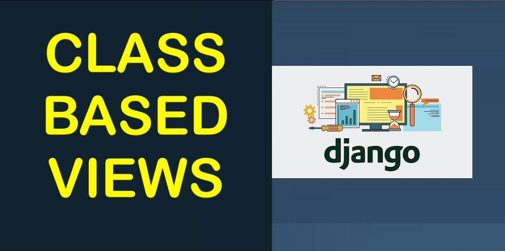

# Лекция 27. Class-Based Views (CBV) в Django



## Что мы сегодня будем учить?


## Что такое CBV и зачем они нужны?

Когда мы создаём сайты на Django, мы привыкли писать функции-обработчики для каждой страницы.

**Например:**

```python
# views.py
from django.shortcuts import render

def home(request):
    return render(request, 'home.html')
```

Это называется `Function-Based View (FBV)` — "представление на основе функции".

Однако, по мере роста проекта, таких функций становится всё больше, и одна и та же логика начинает повторяться:

- Проверка авторизации,
- Загрузка списка объектов,
- Обработка формы создания объекта,
- Обработка формы редактирования объекта,
- Удаление объекта и т.д.

Чтобы избежать дублирования и облегчить поддержку кода, Django предлагает второй подход — **Class-Based Views (CBV)**.

`CBV` — это представления, оформленные в виде классов, а не функций.
Каждый класс отвечает за определённую задачу и может легко переопределять небольшие части поведения, если нужно.

Преимущества использования `CBV`:

- Переиспользование кода: стандартные задачи, вроде CRUD-операций, можно реализовать в пару строк.
- Гибкость: можно менять только нужные части логики, не трогая остальное.
- Расширяемость: легко создавать свои собственные представления на базе стандартных.

## Переход на Class-Based Views

С этого момента мы переходим на использование `view`, основанных исключительно на классах.

Все основные существующие классы Django базируются на классе `View`, который определяет базовое поведение для обработки HTTP-запросов. Ссылка на документацию [тут](https://ccbv.co.uk/).

### Class View

[View](https://ccbv.co.uk/) — это базовый класс для всех `CBV` в Django. Его методы используются абсолютно всеми остальными классами-представлениями (`ListView`, `DetailView`, `CreateView` и т.д.).

### Основные атрибуты и методы класса View

Базовый класс `View` в Django предоставляет несколько важных атрибутов и методов, которые определяют его поведение. Давайте разберём их подробно:

#### http_method_names

Это атрибут класса, который определяет список допустимых HTTP-методов для данного представления. По умолчанию список выглядит так: `['get', 'post', 'put', 'patch', 'delete', 'head', 'options', 'trace']`.Если метод запроса не входит в этот список, будет автоматически возвращён ответ `405 (Method Not Allowed)`.

#### as_view()

Это основной метод, который превращает класс в обычную вызываемую функцию, совместимую с Django маршрутизатором `(urls.py)`. Когда мы указываем класс-представление в `urlpatterns`, мы всегда вызываем `as_view()`. Внутри этот метод создаёт экземпляр класса, вызывает `setup()`, а затем передаёт управление методу `dispatch()`.

#### **setup(request, *args, kwargs)

Этот метод вызывается первым при обработке запроса. Он сохраняет в экземпляре класса `(self)` следующие данные:

- сам запрос `(self.request)`,
- позиционные аргументы `(self.args)`,
- именованные аргументы `(self.kwargs)`.

Благодаря этому, во всех дальнейших методах представления `(get, post и других)` мы можем напрямую обращаться к этим данным через `self.request`, `self.args`, `self.kwargs`.

#### **dispatch(request, *args, kwargs)

После выполнения `setup`, Django вызывает метод `dispatch`. Именно здесь происходит выбор метода для обработки запроса в зависимости от типа запроса (например, `GET`, `POST` и так далее).

Сначала проверяется, разрешён ли тип запроса согласно списку `http_method_names`. Затем `dispatch` ищет соответствующий метод в экземпляре класса (`get()`, `post()`, `put()`, `delete()` и т.д.). Если метод найден — он вызывается. Если нет — вызывается метод `http_method_not_allowed()`.

#### **http_method_not_allowed(request, *args, kwargs)

Этот метод вызывается, если представление не поддерживает пришедший тип HTTP-запроса. Например, если запрос сделан методом `POST`, но в классе определён только метод `get()`, будет вызван `http_method_not_allowed()`, который вернёт стандартный ответ `HTTP 405 (Method Not Allowed)`.

Реализуем класс-представление, которое возвращает HTML-страницу — аналог простой функции `home()` которая у нас была раньше.:

```python
def home(request):
    return render(request, "index.html")

```

Наша функция `home()` возвращает HTML-страницу, а теперь сделаем то же самое с помощью класса-представления:

```python
# views.py
from django.views import View
from django.shortcuts import render

class HomeView(View):

    http_method_names = ['get', ] # разрешаем только GET-запросы

    def get(self, request, *args, **kwargs):
        return render(request, 'index.html')
```

Изменим `urls.py`, чтобы использовать класс-представление:

```python
# urls.py
from django.urls import path
from .views import HomeView

urlpatterns = [
    path('', HomeView.as_view(), name='home'),
]
```

**Что мы сделали:**

- Класс `HomeView` наследует от `View`.
- Определяем метод `get()` — он вызывается при `GET`-запросе.
- Возвращаем HTML-шаблон `index.html` с помощью функции `render()`.
- В `urls.py` передаём `HomeView.as_view()`, чтобы Django мог вызвать класс как обычную view-функцию.


Теперь добавим в класс метод `post()`, который будет обрабатывать `POST`-запросы. Например, мы можем создать форму, которая отправляет данные на сервер:

```python
# views.py
from django.views import View
from django.shortcuts import render
from django.http import HttpResponse

class HomeView(View):

    http_method_names = ['get', ] # разрешаем только GET-запросы

    def get(self, request, *args, **kwargs):
        return render(request, 'index.html')

class HelloView(View):

    http_method_names = ['get', 'post'] # разрешаем GET-запросы, POST-запросы

    def get(self, request, *args, **kwargs):
        return HttpResponse("Ожидается POST-запрос")

    def post(self, request, *args, **kwargs):
        name = request.POST.get('name', '')
        return HttpResponse(f'Привет, {name}!')
```

добавим в `urls.py`:

Изменим `urls.py`, чтобы использовать класс-представление:

```python
# urls.py
from django.urls import path
from .views import HomeView, HelloView  # Импортируем классы

urlpatterns = [
    path("", HomeView.as_view(), name="home_page"),
    path("hello/", HelloView.as_view(), name="hello"),
]
```

**Что здесь происходит:**

- `''` — домашняя страница (HomeView), отображает index.html.
- `'hello/'` — страница для отправки формы (HelloView).

Таким образом, мы грамотно разделяем ответственность: Один класс рендерит форму `(HomeView)`. Другой класс обрабатывает данные `(HelloView)`.

## Class TemplateView

[TemplateView](https://ccbv.co.uk/projects/Django/4.2/django.views.generic.base/TemplateView/) — это один из самых простых и часто используемых классов в Django. Он предназначен для отображения HTML-шаблона без необходимости переопределять метод get() вручную.

Этот класс идеально подходит для:

- статичных страниц (например: "О нас", "Контакты", "Главная"),
- страниц, где не требуется логика в `views.py`,

**Наследование**

`TemplateView` наследуется от:

```python
TemplateView → GenericView → View
```

То есть он использует всё то же поведение, что и `View`, но дополняет его автоматическим рендерингом шаблона.

Основные атрибуты :

`template_name` — имя HTML-шаблона, который будет отображаться.

**Пример использования:**

```python
# views.py
from django.views.generic import TemplateView

class AboutPageView(TemplateView):
    template_name = "about.html"
```

```python
# urls.py
from django.urls import path
from .views import AboutPageView

urlpatterns = [
    path("about/", AboutPageView.as_view(), name="about"),
]
```

**Что здесь происходит:**

- Мы создаём класс `AboutPageView`, наследуемый от `TemplateView`.
- Указываем, какой шаблон должен быть отрендерен `(about.html)`.
- Django сам вызывает метод `get()` и рендерит шаблон без лишнего кода.

### Как передать данные в шаблон?

Есть несколько способов передать данные в шаблон, используя `TemplateView`.

#### 1. Метод `get_context_data()` 

Если нужно передать переменные в шаблон — можно переопределить метод `get_context_data()`:

```python
# views.py
class HomePageView(TemplateView):
    template_name = "home.html"

    def get_context_data(self, **kwargs):
        context = super().get_context_data(**kwargs)
        context["title"] = "Добро пожаловать на сайт!"
        context["year"] = 2025
        return context
```

```html
<!-- templates/home.html -->
<h1>{{ title }}</h1>
<p>Текущий год: {{ year }}</p>
```

**Что происходит:**

- Метод `get_context_data()` возвращает словарь переменных для шаблона и выполняется с каждым запросом.
- Мы добавляем туда ключи `title` и `year`, которые можно использовать в `home.html`.


#### 2. Через атрибут extra_context

Это более короткий способ — если нужно передать **статичные данные**:

```python
# views.py
class AboutPageView(TemplateView):
    template_name = "about.html"
    extra_context = {
        "title": "О нас",
        "company": "MyCompany"
    }
```

```html
<!-- templates/about.html -->
<h2>{{ title }}</h2>
<p>Компания: {{ company }}</p>
```

Особенности:

- Это просто словарь с переменными.
- Подходит для фиксированных значений, которые не меняются от запроса к запросу.
- Django сам добавит их в контекст шаблона без переопределения метода.

Очень удобно, когда нужно передать несколько статичных переменных в шаблон.

**Важно помнить, что `extra_context` не заменяет метод `get_context_data()`. Если оба используются, то сначала выполняется `get_context_data()`, а затем добавляются переменные из `extra_context`.**

#### Важное предупреждение

**Нельзя использовать `extra_context` для запроса данных из базы:**

```python
# Плохо! Это сработает только при запуске сервера.
extra_context = {
    "products": Products.objects.all()  # выполнится один раз
}
```

Почему это опасно:

- Выражение выполнится при старте проекта, а не при каждом запросе.
- Если потом база изменится — в шаблоне будут показаны устаревшие данные.

**Правильный способ — использовать `get_context_data()`:**

```python
def get_context_data(self, **kwargs):
    context = super().get_context_data(**kwargs)
    context["products"] = Products.objects.all()
    return context
```

Теперь данные будут обновляться при каждом запросе.

## Class ListView

[ListView](https://ccbv.co.uk/projects/Django/4.2/django.views.generic.list/ListView/) — это обобщённый класс-представление, предназначенный для отображения списка объектов из базы данных.

Он делает за нас всю типовую работу:

- Получает список объектов из модели,
- Добавляет его в контекст шаблона,
- Использует шаблон с именем `<имя_модели>_list.html` по умолчанию.

```python
# views.py
from django.views.generic import ListView
from .models import Product

class ProductListView(ListView):
    model = Product
    template_name = "products/product_list.html"  # можно не указывать, если придерживаться шаблона
    context_object_name = "products"  # как переменная будет называться в шаблоне
```

```python
# urls.py
from django.urls import path
from .views import ProductListView

urlpatterns = [
    path("products/", ProductListView.as_view(), name="product_list"),
]
```

**Шаблон product_list.html**

```html
<!-- templates/products/product_list.html -->
<h1>Список товаров</h1>

<ul>
  
    <li>{{ product.name }} — {{ product.price }} грн</li>
  
    <li>Нет доступных товаров.</li>
  
</ul>
```

### Что делает ListView автоматически?

Когда вы используете `ListView`, Django берёт на себя выполнение ряда стандартных действий, чтобы вы могли сосредоточиться на логике приложения.

**Получение списка объектов.**

Если вы указали атрибут `model`, то Django автоматически выполнит запрос `Model.objects.all()` и передаст результат в шаблон.

**Назначение имени переменной в шаблоне.**

По умолчанию список объектов передаётся в шаблон под именем `object_list`. Если хотите использовать другое имя — задайте атрибут `context_object_name`.

**Определение имени шаблона.**

Если вы не указали явно `template_name`, Django будет искать шаблон с именем по формуле:

- `<имя_модели в нижнем регистре>_list.html`,
- например: `product_list`.html.
- Но вы всегда можете указать путь к шаблону вручную.

### Как изменить набор объектов?

По умолчанию `ListView` использует `model.objects.all()`, но вы можете переопределить этот набор, например, чтобы отфильтровать только нужные записи из базы. Для этого нужно переопределить метод `get_queryset()`.

Пример: отобразить только товары дешевле 500

```python
from django.views.generic import ListView
from .models import Product

class CheapProductListView(ListView):
    model = Product
    context_object_name = "products"
    template_name = "products/cheap_list.html"

    def get_queryset(self):
        return Product.objects.filter(price__lt=500)
```

**Что происходит:**

- Мы переопределили метод `get_queryset()`, чтобы вернуть только те товары, у которых цена меньше 500 грн.
- Метод `filter(price__lt=500)` использует Django ORM для фильтрации по полю `price`.
- `context_object_name = "products"` позволяет обращаться к списку объектов в шаблоне как к `products`.

### Кеширование запросов

Если выборка тяжёлая — можно обернуть `get_queryset`() кешем:

```python
from django.views.generic import ListView
from django.core.cache import cache

class CachedProductListView(ListView):
    model = Product
    template_name = "products/list.html"

    def get_queryset(self):
        return cache.get_or_set("product_list", lambda: Product.objects.all(), timeout=60)
```

**Что здесь происходит:**

Метод `get_queryset()` оборачивается функцией `cache.get_or_set()`:

- Если по ключу "`product_list`" в кеше ничего нет — выполняется запрос `Product.objects.all()` и результат сохраняется.
- Аргумент `timeout=60` означает, что кеш будет действовать 60 секунд.

### Как ещё можно задать список объектов?

Если фильтрация не зависит от запроса или логики, можно использовать атрибут `queryset` вместо переопределения `get_queryset()`.

Пример с фильтрацией товаров до 500:

```python
from django.views.generic import ListView
from .models import Product

class CheapProductListView(ListView):
    queryset = Product.objects.filter(price__lt=500)
    context_object_name = "products"
    template_name = "products/cheap_list.html"
```

Мы явно задали `queryset` как отфильтрованный набор объектов. Это делается один раз при загрузке класса, а не при каждом запросе. Подходит, если фильтрация фиксированная и не зависит от пользователя, формы или запроса.

#### Когда не стоит использовать `queryset`?

Если фильтрация должна зависеть от:

- параметров запроса `(request.GET)`,
- текущего пользователя `(request.user)`,
- времени, даты, состояния и т.д.,

то лучше использовать метод `get_queryset()` — он вызывается на каждый запрос и даёт полный контроль.

### Пагинация в ListView

`ListView` в Django поддерживает [пагинацию](https://docs.djangoproject.com/en/4.2/topics/pagination/) *"из коробки"*. Чтобы включить её, достаточно указать атрибут `paginate_by` — и Django сам разобьёт список объектов на страницы.

**Пример: пагинация по 5 товаров на страницу**

```python
from django.views.generic import ListView
from .models import Product

class ProductListView(ListView):
    model = Product
    context_object_name = "products"
    template_name = "products/product_list.html"
    paginate_by = 5  # показывать 5 товаров на одной странице
```

Что делает Django:

- Автоматически разбивает список объектов на страницы.
- Использует параметры `?page=1`, `?page=2` и т.д. из `URL`.
- Добавляет в шаблон объект `page_obj` с текущей страницей.
- Добавляет `is_paginated` — флаг, нужна ли пагинация вообще.

**Пример шаблона с пагинацией**

```html
<!-- templates/products/product_list.html -->
<h1>Все товары</h1>

<ul>
  
    <li>{{ product.name }} — {{ product.price }}</li>
  
    <li>Товары не найдены.</li>
  
</ul>

<!-- Пагинация -->

  <div class="pagination">
    
      <a href="?page=1">Первая</a>
      <a href="?page={{ page_obj.previous_page_number }}">Назад</a>
    

     
      
        <strong>{{ page_num }}</strong>
      
        <a href="?page={{ page_num }}">{{ page_num }}</a>
      
    

    
      <a href="?page={{ page_obj.next_page_number }}">Вперёд</a>
      <a href="?page={{ page_obj.paginator.num_pages }}">Последняя</a>
    
  </div>

```

**Советы**

- Всегда проверяй `is_paginated`, прежде чем показывать кнопки страниц.
- Убедись, что ты правильно используешь `?page=...` в URL — иначе Django не поймёт, на какую - страницу перейти.

### Сортировка через атрибут ordering в ListView

В классе `ListView` можно задать порядок отображения объектов с помощью специального атрибута `ordering`.

Этот способ подходит, когда нужно просто отсортировать объекты без дополнительной логики.

**Пример: сортировка товаров по цене**

```python
from django.views.generic import ListView
from .models import Product

class ProductListView(ListView):
    model = Product
    template_name = "products/product_list.html"
    context_object_name = "products"
    ordering = ['price']  # Сортировка по возрастанию цены
    paginate_by = 5
```

**Убывающая сортировка**

Чтобы отсортировать по убыванию, добавьте минус перед полем:

```python
ordering = ['-created_at']
```

**Важно помнить:**

- `ordering` работает только если вы не переопределили `get_queryset()` вручную.
- Если нужно более гибкая логика (например, фильтрация + сортировка) — переопределяйте `get_queryset()` и используйте `order_by()`.
- Атрибут `ordering` переопределяет `Meta.ordering` в модели, если указан.

Это самый быстрый способ задать простой порядок сортировки объектов в ListView, не прибегая к дополнительному коду.

##  Class DetailView

[DetailView](https://ccbv.co.uk/projects/Django/4.2/django.views.generic.detail/DetailView/) — это обобщённый класс-представление, предназначенный для отображения одного объекта модели.

Он автоматически:

- извлекает объект из базы данных по `pk` или `slug`,
- передаёт его в шаблон (по умолчанию под именем `object`),
- использует шаблон с именем `<имя_модели>_detail.html`, если не указать `template_name`.

**Пример: отображение одного товара**

```python
# views.py
from django.views.generic import DetailView
from .models import Product

class ProductDetailView(DetailView):
    model = Product
    template_name = "products/product_detail.html"
    context_object_name = "product"
```

```python
# urls.py
from django.urls import path
from .views import ProductDetailView

urlpatterns = [
    path("products/<int:pk>/", ProductDetailView.as_view(), name="product_detail"),
]
```

```html
<!-- templates/products/product_detail.html -->
<h1>{{ product.name }}</h1>
<p>Цена: {{ product.price }} грн</p>
<p>Описание: {{ product.description }}</p>
<a href="">← Назад к списку</a>
```

### Что делает DetailView автоматически?

- Получает объект по `pk`, переданному в URL (например: `/products/3/`).
- Передаёт его в шаблон под именем object (или `context_object_name`, если указано).
- Ищет шаблон по умолчанию: `<имя_модели>_detail.html`.

### Полезные атрибуты и методы DetailView

Класс `DetailView` предоставляет ряд атрибутов и методов, которые позволяют гибко управлять выборкой данных и отображением шаблона:

- `model` — указывает модель, с которой работает представление.

- `template_name` — задаёт путь к шаблону, который нужно отрендерить. Если не указан, Django подставит шаблон по умолчанию.

- `context_object_name` — определяет имя переменной, под которым объект будет передан в шаблон (по умолчанию это `object`).

- `pk_url_kwarg` — имя параметра в URL, по которому ищется pk. По умолчанию используется `"pk"`.

- `slug_field` — указывает поле модели, по которому будет происходить поиск при использовании `slug` (например, `slug = models.SlugField(...))`.

- `slug_url_kwarg` — задаёт имя параметра `slug` в URL-шаблоне, если используется поиск по слагу.

- `get_queryset()` — метод, который позволяет ограничить выборку объектов, например: `Product.objects.filter(is_published=True)`.

- `get_context_data()` — метод, позволяющий добавить дополнительные переменные в контекст шаблона, помимо самого объекта.

### Добавление дополнительных данных через get_context_data()

Иногда нужно передать в шаблон дополнительные переменные, например:

- текущую дату,
- связанные объекты (комментарии, теги),
- заголовок страницы и т.д.

Для этого можно переопределить метод `get_context_data()`:

```python
from datetime import date

class ProductDetailView(DetailView):
    model = Product
    template_name = "products/product_detail.html"
    context_object_name = "product"

    def get_context_data(self, **kwargs):
        context = super().get_context_data(**kwargs)
        context['title'] = f"Товар: {self.object.name}"
        context['today'] = date.today()
        return context
```

```html
<!-- templates/products/product_detail.html -->
<h1>{{ title }}</h1>
<p>Сегодня: {{ today }}</p>
<p>Товар: {{ product.name }}</p>
<p>Цена: {{ product.price }} грн</p>
```

**Здесь:**

`self.object` — это объект, который извлёк `DetailView` из базы данных по `pk` или `slug`. В данном случае — это товар, который мы хотим отобразить. Мы используем его, чтобы динамически построить заголовок, в шаблон также передаётся текущая дата `today`.

### Когда использовать DetailView

- Когда нужно вывести один объект на отдельной странице (товар, статья, заказ и т.д.).
- Когда хочешь избежать лишнего кода — `DetailView` сам извлечёт объект по `pk` или `slug`.
- Когда шаблон не требует сложной логики (или она добавляется через `get_context_data()`).

### DetailView с использованием slug

Если в модели есть поле `slug`, ты можешь настроить `DetailView` так, чтобы объект искался не по `pk`, а по `slug`.

**Пример модели с slug-полем**

```python
from django.db import models
from django.utils.text import slugify

class Product(models.Model):
    name = models.CharField(max_length=100)
    slug = models.SlugField(unique=True)
    price = models.DecimalField(max_digits=8, decimal_places=2)
    description = models.TextField()

    def __str__(self):
        return self.name
```

**Представление: `DetailView` по `slug`**

```python
from django.views.generic import DetailView
from .models import Product

class ProductDetailView(DetailView):
    model = Product
    template_name = "products/product_detail.html"
    context_object_name = "product"
    slug_field = "slug"             # по какому полю искать в базе
    slug_url_kwarg = "product_slug" # как называется параметр в URL
```

**Настройка URL**

```python
# urls.py
from django.urls import path
from .views import ProductDetailView

urlpatterns = [
    path("products/<slug:product_slug>/", ProductDetailView.as_view(), name="product_detail"),
]
```

**Шаблон**

```html
<!-- templates/products/product_detail.html -->
<h1>{{ product.name }}</h1>
<p>Цена: {{ product.price }} грн</p>
<p>Описание: {{ product.description }}</p>
```

**Что здесь происходит:**

- URL содержит `slug`, например: `/products/apple-iphone-15/`
- Django получает значение `product_slug` из `URL` и ищет объект в базе: `Product.objects.get(slug="apple-iphone-15")`

- Объект передаётся в шаблон под именем product.

Такой подход используется во всех современных сайтах: для SEO, удобных ссылок и читаемости адресов.