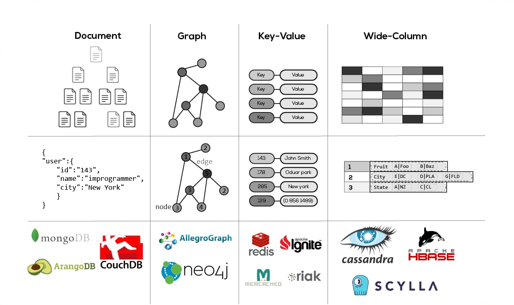
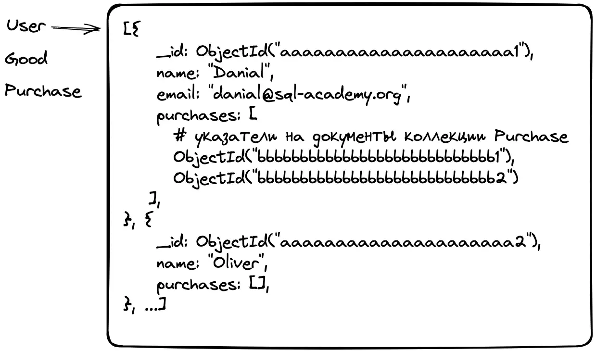
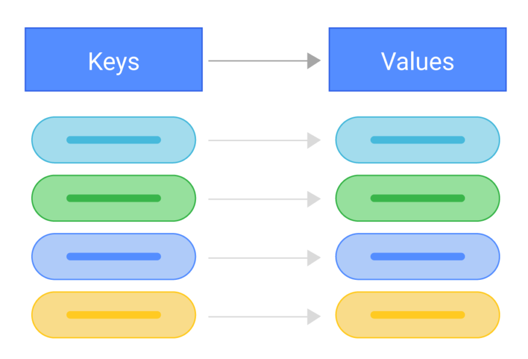
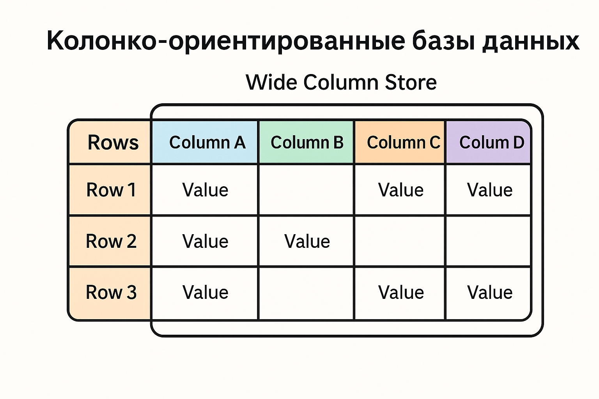
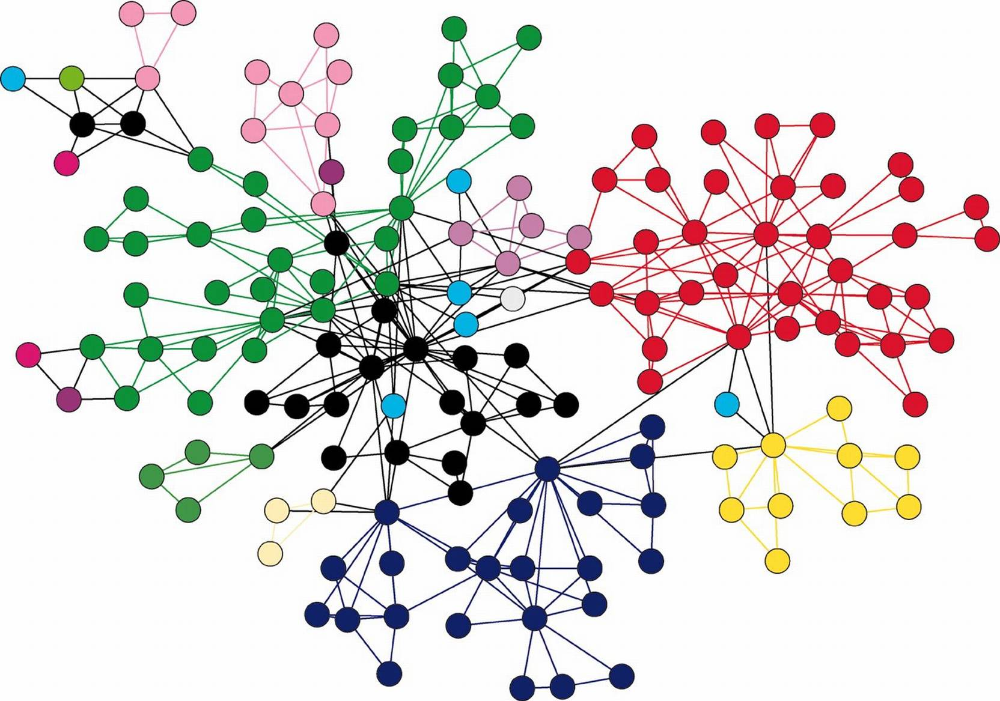
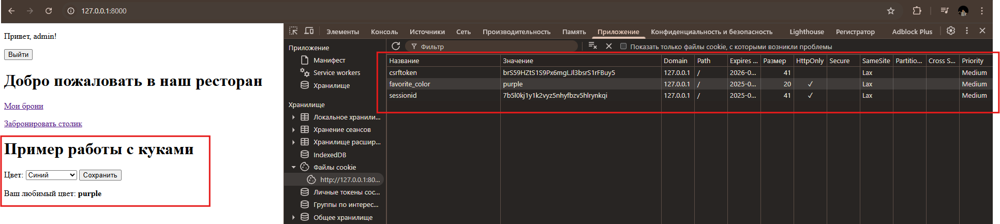
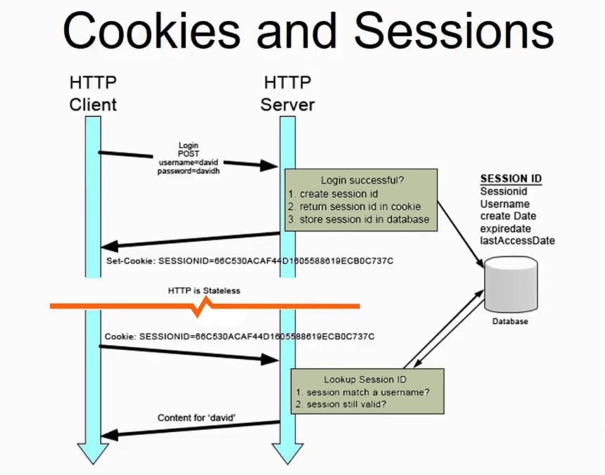
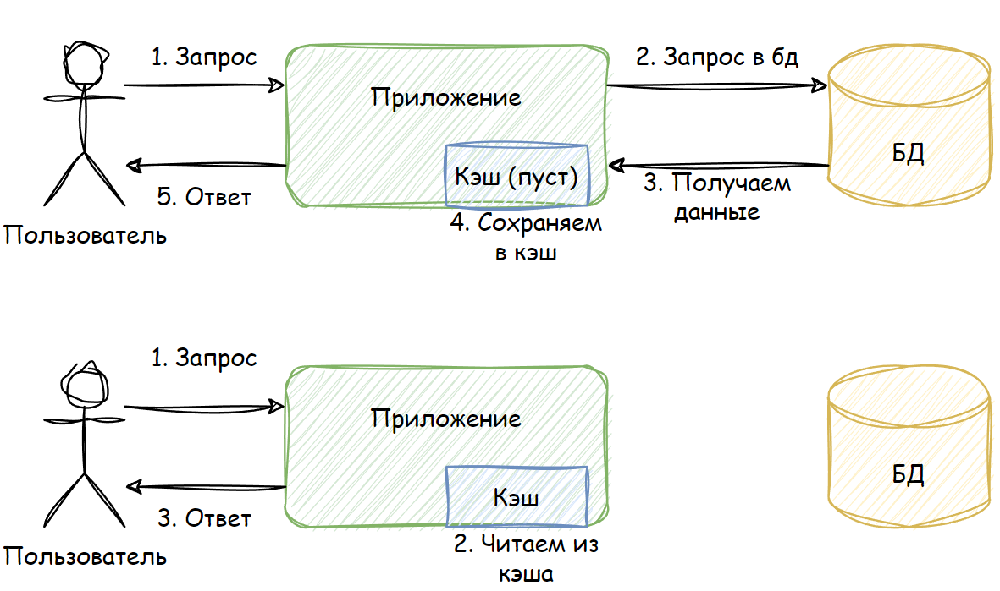
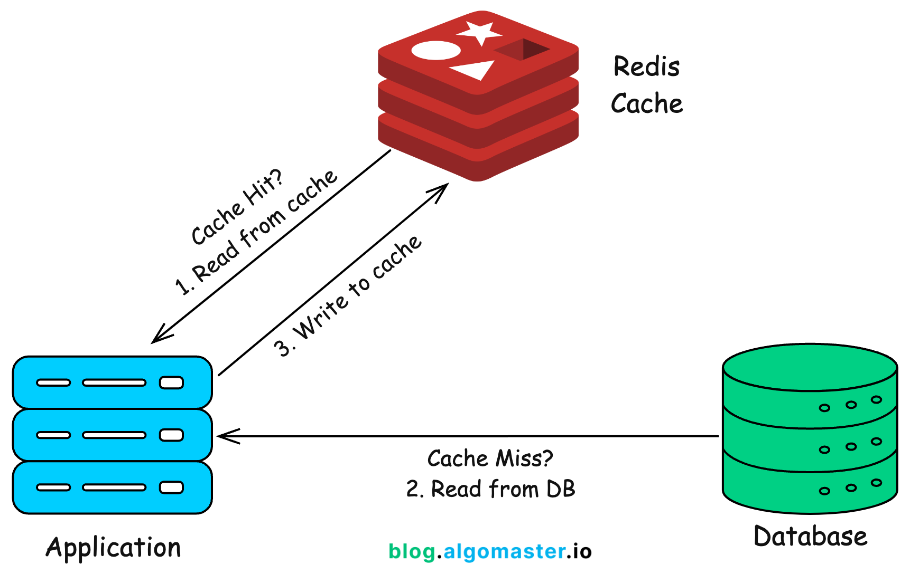

# Лекция 28: NoSQL. Куки, сессии, кеш.



## Введение в NoSQL.

На протяжении десятилетий стандартом в разработке были реляционные базы данных `(SQL)` — такие как `PostgreSQL` и `MySQL`. Они обеспечивают чёткую структуру, поддерживают транзакции и сложные запросы с использованием языка `SQL`. Однако с ростом объёмов данных, популярностью `JSON-структур`, развитием микросервисов и веб-приложений стало очевидно: строгая схема и вертикальная масштабируемость SQL-систем не всегда подходят.

**NoSQL (Not Only SQL)** — это семейство баз данных, использующих альтернативные подходы к хранению и обработке информации. Они не требуют фиксированной схемы и предлагают гибкость при работе с неструктурированными или слабо структурированными данными. Несмотря на название, `NoSQL` — это не *«отказ от SQL»*, а скорее *«не только SQL»*.

### Основные преимущества `NoSQL`:

- Гибкость структуры — данные могут храниться в виде документов, пар ключ-значение, графов или колонок.
- Горизонтальная масштабируемость — возможность распределения нагрузки на множество серверов.
- Высокая производительность — особенно в задачах кэширования, быстрой записи и чтения.
- Отказоустойчивость — многие NoSQL-базы спроектированы как распределённые и самовосстанавливающиеся.

### Когда использовать `NoSQL`:

- Когда структура данных может часто меняться (например, профили пользователей).
- При необходимости кэшировать часто используемые данные (сессии, временные значения).
- Для хранения логов, сообщений, аналитики или данных в реальном времени.
- В проектах с миллионами пользователей и высокой нагрузкой.
- Когда нужна гибкая модель, например, для хранения документов (`MongoDB`) или связей (графовые БД).

### Когда не стоит использовать `NoSQL`:

Если приложение требует жёстких связей между таблицами, транзакционности, строгой валидации данных и сложной отчётности — лучше использовать реляционные базы. В финансовых системах, системах бронирования, ERP и подобных проектах `SQL` остаётся основой.

## Виды NoSQL баз данных

`NoSQL` — это не одна конкретная технология, а целый класс хранилищ данных, различающихся по внутренней структуре и назначению. В зависимости от модели хранения информации, `NoSQL`-базы делятся на несколько основных типов:

### 1. Документо-ориентированные базы данных (Document Store)

Хранят данные в виде документов, чаще всего в формате `JSON`, `BSON` или `XML`. Каждый документ представляет собой отдельный объект (например, товар, пользователь, сообщение) и может содержать вложенные поля, массивы и произвольную структуру. Документы хранятся в коллекциях, аналогичных таблицам в `SQL`.



**Примеры:**

- `MongoDB`- самая популярная документо-ориентированная БД. Хранит документы в формате BSON (расширенный JSON) и поддерживает мощные инструменты для поиска, агрегации, индексов и транзакций. Широко используется в веб-разработке, аналитике, микросервисах.
  - Есть официальный драйвер для Python: `pymongo`.
  - Для Django можно использовать `Djongo` или ODM (object-document mapping), например `mongoengine`.
- `CouchDB` - ещё одна документо-ориентированная БД от Apache. Главная особенность — поддержка репликации, офлайн-доступа и синхронизации.Данные хранятся в `JSON-документах` и могут быть доступны через `REST API`.
  - Хорошо подходит для распределённых систем и мобильных приложений.
  - Имеет встроенный HTTP-интерфейс, поэтому легко интегрируется с веб-клиентами.

**Плюсы:**
- Очень гибкая структура — можно сохранять данные без жёсткой схемы.
- Удобно использовать с JavaScript-фреймворками (данные передаются как `JSON`).
- Хорошо подходят для проектирования `API`.
- Есть возможность вложенных объектов и массивов.

**Минусы:**
- Нет поддержки транзакций в традиционном `SQL-смысле` (хотя `MongoDB` частично реализует это).
- Сложнее обеспечить целостность данных.
- Индексация и запросы по вложенным полям могут быть медленнее, чем в `SQL`.

**Когда использовать:**
- Для хранения данных, структура которых может меняться со временем.
- В блогах, пользовательских профилях, форумах и др.

### 2. Ключ-значение хранилища (Key-Value Store)

Самый простой тип `NoSQL` — данные хранятся как пары *«ключ → значение»*. Используется для быстрого доступа к данным по ключу. Часто применяется для хранения конфигураций, кэша, сессий, токенов и т.п.



**Примеры:**
- `Redis(REmote DIctionary Server)` — это `in-memory` база данных типа *"ключ-значение"*, работающая в оперативной памяти. Очень быстрая и лёгкая, `Redis` используется для кэширования, сессий, очередей задач и даже как брокер сообщений.Ключевые особенности:
    - Хранение данных в оперативной памяти (RAM) с возможностью сохранения на диск.
    - Поддержка не только строк, но и сложных структур: списки, множества, хеши.
    - Поддержка Pub/Sub — механизм публикации и подписки на сообщения.
    - Встроенные TTL (время жизни ключа) и автоудаление.
    - Отличная интеграция с Python (`redis-py`) и Django (через `django-redis` для кэша и сессий).
- `Memcached` — это ещё один `in-memory` *key-value store*, ориентированный на простоту и максимальную скорость. Он хранит данные в RAM, без сложных структур и без поддержки сохранения на диск. Ключевые особенности:
    - Очень лёгкий и быстрый.
    - Используется исключительно как кэш.
    - Поддерживает только строки (в отличие от Redis — без списков и словарей).

- `Amazon DynamoDB` — это полностью управляемая (`serverless`) база данных от `AWS`, основанная на модели *"ключ-значение"* и *"документ"*. Она сочетает масштабируемость, отказоустойчивость и низкую задержку в доступе к данным.Ключевые особенности:
    - Автоматическое масштабирование — можно хранить терабайты данных без настройки серверов.
    - Модель хранения: ключ-значение или документ.
    - Поддержка TTL, транзакций, вторичных индексов и потоков данных.
    - Интеграция с остальными сервисами AWS (Lambda, S3, API Gateway).

**Плюсы:**
- Очень высокая скорость чтения и записи.
- Простая архитектура.
- Хорошо масштабируется.
- `Redis` работает в памяти, что делает его идеальным для кэширования и временных данных.

**Минусы:**
- Нет поиска по значению (только по ключу).
- Нет вложенных структур (в `Redis` — частично реализовано).
- Не подходит для сложных запросов или аналитики.

**Когда использовать:**
- Для хранения сессий, токенов, временных данных.
- Кэширование `HTML`, `SQL-запросов`, сериализованных объектов.

### 3. Колонко-ориентированные базы данных (Wide Column Store)



В колонко-ориентированных БД данные хранятся поколоночно — значения одной колонки (например, всех цен) располагаются вместе. Это даёт огромное преимущество при аналитике и агрегациях по отдельным столбцам: быстрее считать `SUM`, `AVG`, `MAX`, потому что не нужно загружать ненужные колонки.

**Примеры:**
- `Apache Cassandra` - это распределённая, масштабируемая и отказоустойчивая колонко-ориентированная база данных, изначально разработанная в `Facebook`, а затем переданная в `Apache Software Foundation`. Она предназначена для хранения и обработки огромных объёмов данных в режиме реального времени на множестве узлов без потери доступности.Ключевые особенности:
  - Хранение данных в виде строк с динамическими наборами колонок `(wide rows)`.
  - Полностью распределённая архитектура: нет единой точки отказа.
  - Поддержка автоматической репликации между датацентрами.
  - Используется собственный язык запросов — `CQL (Cassandra Query Language)`, похожий на `SQL`.
  - Горизонтально масштабируется — можно добавлять новые узлы без остановки системы.

- `HBase` (на базе Hadoop) — это открытая, распределённая колонко-ориентированная база данных, построенная поверх Hadoop и HDFS (Hadoop Distributed File System). Она обеспечивает быстрый доступ к большим объёмам разреженных данных.Ключевые особенности:
  - Поддержка миллиардов строк и миллионов колонок.
  - Поддержка версионности — можно сохранять несколько версий значения по ключу.
  - Сильно зависит от Java-инфраструктуры.

**Плюсы:**
- Отлично работает с большими объёмами данных.
- Эффективна при выборке по конкретным колонкам.
- Подходит для горизонтального масштабирования.

**Минусы:**
- Сложная настройка и обслуживание.
- Не предназначена для операций с множеством колонок сразу.
- Требует продуманной структуры таблиц — плохо подходит для динамических схем.

**Когда использовать:**
- Для аналитики, логов, телеметрии.
- В проектах с миллионами записей, где важна производительность по колонкам.

### 4. Графовые базы данных (Graph DB)



Эти базы строятся на основе узлов и связей между ними. Идеально подходят для хранения сложных отношений — например, в социальных сетях, рекомендательных системах, маршрутах и т.п.

**Примеры:**
- `Neo4j` - самая известная и широко используемая графовая база данных. Она построена на основе концепции узлов *(nodes)* и рёбер *(relationships)*, которые могут иметь произвольное количество свойств (атрибутов). Для запросов используется мощный язык `Cypher`, похожий на `SQL`, но ориентированный на графы.Ключевые особенности:
  - Чистая графовая модель хранения данных.
  - Оптимизирована под глубокие и частые переходы по связям (например, «друзья друзей»).
  - `Cypher` — декларативный, читаемый язык запросов.
  - Поддержка `ACID-транзакций`.
- `ArangoDB` — это мульти-модельная база данных: она поддерживает графовую, документо-ориентированную и ключ-значение модель в рамках одного движка. Это позволяет использовать одну и ту же БД для разных задач, не разрывая архитектуру приложения. Ключевые особенности:
  - Поддержка нескольких моделей хранения данных.
  - Свой язык запросов — `AQL (ArangoDB Query Language)`.
  - Есть транзакции, репликация, `REST API`.
  - Возможность построения графов поверх документов.
- `OrientDB` — ещё одна мульти-модельная база, сочетающая графовую, документную, объектную и key-value модели. База построена на `Java` и активно используется в случаях, где важно моделирование сложных иерархий.Ключевые особенности:
  - Гибридная модель: узлы — это документы, которые могут быть связаны графовыми рёбрами.
  - Поддержка SQL-подобного языка запросов (расширенный SQL).
  - Поддержка `ACID`, репликации, распределённых кластеров.
  - Поддержка вложенных структур и наследования классов (в стиле объектной модели).

**Плюсы:**
- Высокая скорость запросов по связям (например, «все друзья друзей»).
- Отлично подходят для моделирования сложных отношений.
- Удобный язык запросов (например, `Cypher` в `Neo4j`).

**Минусы:**
- Не универсальны: сложно использовать для всего, кроме графов.
- Меньше экосистема и поддержка, чем у `MongoDB` или `Redis`.
- Более сложные в изучении и проектировании.

**Когда использовать:**
- Социальные сети, рекомендательные системы, маршруты.
- Анализ графов, зависимостей, иерархий.

Во многих современных проектах применяют несколько типов баз одновременно, используя сильные стороны каждой. Например:
- `PostgreSQL` — для основной бизнес-логики,
- `Redis` — для кэша и сессий,
- `MongoDB` — для хранения логов и API-данных,
- `Neo4j` — для рекомендаций и поиска связей между пользователями.

## Почему нужны куки, сессии и кеш?

Протокол `HTTP`, на котором работает весь веб, изначально был разработан как `stateless` — то есть не хранящий состояние. Это значит, что каждый запрос от клиента (браузера) к серверу — независим и не содержит никакой информации о предыдущих запросах.
Если бы не специальные механизмы, сервер каждый раз *"забывал бы"*, кто Вы:
- Вы заходите на сайт, логинитесь — сервер подтверждает.
- Переходите на следующую страницу — и… снова неизвестный пользователь.

Чтобы веб-приложения могли «помнить» пользователей, их действия, настройки, авторизацию и содержимое корзины — появились механизмы хранения состояния, такие как:

- **Куки** — данные сохраняются в браузере, передаются серверу при каждом запросе.
- **Сессии** — данные хранятся на сервере, а в браузере — только идентификатор сессии.
- **Кеш** — временное хранение данных (как на сервере, так и на клиенте), чтобы ускорить ответы и снизить нагрузку.

Эти технологии позволяют сделать из HTTP-общения полноценное *«живое»* взаимодействие, при котором пользователь чувствует, что сайт его *«помнит»*.

## Работа с куками (Cookies) в Django


### Что такое куки?
`Куки (cookies)` — это небольшие фрагменты текстовых данных, которые веб-сервер отправляет в браузер пользователя. Браузер сохраняет эти данные и автоматически отправляет их обратно серверу при каждом следующем запросе к тому же домену.

Куки позволяют *«помнить»* информацию между запросами, несмотря на то, что HTTP-протокол сам по себе не сохраняет состояние. Типичные примеры использования куки:
- Сохранение темы или языка интерфейса
- Идентификатор корзины у неавторизованного пользователя
- Принятие `cookie policy`
- Лёгкая авторизация без сессии (в ограниченных случаях)

**Особенности куки:**
- Представляют собой пары ключ → значение (в виде строки).
- Максимальный размер — `~4 КБ`.
- Хранятся на клиенте, доступны с `JavaScript` (если не защищены).

**Поддерживают параметры:**
- `max_age` или `expires` — срок жизни
- `httponly` — недоступность из `JS`
- `secure` — передача только по `HTTPS`
- `samesite` — защита от `CSRF-атак` через куки


### Пример: Установка и использование куки в одном представлении

```python
class HomePageView(TemplateView):
    template_name = "index.html"

    def get_context_data(self, **kwargs):
        context = super().get_context_data(**kwargs)
        color = self.request.COOKIES.get("favorite_color", "неизвестно")
        context["favorite_color"] = color
        return context

    def post(self, request, *args, **kwargs):
        selected_color = request.POST.get('color')
        response = redirect(request.path)  # <-- редирект на текущую страницу(кука сразу будет показываться в шаблоне после отправки формы)

        if selected_color:
            response.set_cookie(
                key='favorite_color',
                value=selected_color,
                max_age=3600,
                httponly=True,
                samesite='Lax'
            )
        return response
```
Если пользователь выбрал цвет — сохраняем его в куку с параметрами:
 - `max_age=3600` — срок действия 1 час;
 - `httponly=True` — кука недоступна из JavaScript (безопасность);
 - `samesite='Lax'` — кука не отправляется при POST-запросах (предотвращает CSRF).


**Шаблон home.html:**

```html
<!DOCTYPE html>
<html>
<head>
    <title>Куки в Django</title>
</head>
<body>
        <h1>Выберите любимый цвет</h1>

    <form method="post">
        
        <label for="color">Цвет:</label>
        <select name="color" id="color">
            <option value="blue">Синий</option>
            <option value="red">Красный</option>
            <option value="green">Зелёный</option>
            <option value="purple">Фиолетовый</option>
        </select>
        <button type="submit">Сохранить</button>
    </form>

    <hr>
    <p>Ваш любимый цвет: <strong>{{ favorite_color }}</strong></p>
</body>
</html>
```



**Что делает этот код:**
- При `POST` сервер устанавливает куку и отправляет редирект.
- Браузер делает новый `GET` — и в этом запросе кука уже доступна в `request.COOKIES`.
- Контекст обновлён, и шаблон показывает актуальный цвет.

После отправки формы страница обновляется, и внизу отображается выбранный цвет.

Такой подход позволяет пользователю получить «персонализированный» опыт (например, отображение любимого цвета) без использования баз данных или сессий — все данные хранятся непосредственно в браузере.

## Сессии в Django и HTTP

Сессии позволяют Django *"помнить"* пользователя между запросами. Это нужно, чтобы реализовать авторизацию, корзину, настройки и любую другую индивидуальную информацию, связанную с пользователем.

### Что такое сессия?

`Сессия` — это механизм, позволяющий хранить данные между запросами пользователя. Django предоставляет собственную систему сессий, которая работает поверх HTTP, компенсируя его главный недостаток — отсутствие состояния.

`HTTP` — это `stateless-протокол`. Это означает, что каждый запрос от клиента к серверу изолирован и ничего не знает о предыдущих запросах. Если бы не сессии и куки, сервер не мог бы "вспоминать" пользователя, его действия или авторизацию между переходами по страницам.

### Как это работает?


На схеме выше представлена типичная последовательность взаимодействия клиента и сервера с использованием сессии:

**Шаг 1. Клиент отправляет логин-запрос**

Пользователь отправляет POST-запрос на сервер с логином и паролем.

**Шаг 2. Сервер проверяет данные**

Если данные корректны:

- Сервер создаёт объект сессии в базе данных.
- Генерируется уникальный `session_id`.
- Этот `session_id` возвращается клиенту в ответе — в куке (обычно с именем `sessionid`).
- Сама сессия на сервере может хранить, например:
    - ID пользователя
    - дату создания
    - срок действия
    - вспомогательные данные (например, корзину)

**Шаг 3. При следующих запросах**
  - Браузер автоматически отправляет куку `sessionid` вместе с каждым HTTP-запросом.
  - Django получает sessionid, ищет его в БД, и если он валиден — `«восстанавливает»` сессию.
  - Таким образом, сервер знает, кто перед ним, и может предоставить контекст пользователя (например, показать `«Привет, admin!»`).

### Важно
Сам пользователь не знает, что хранится в сессии — он получает только идентификатор. Все данные сессии хранятся на стороне сервера (например, в базе данных или Redis), что делает механизм безопаснее, чем куки. Сессия может быть привязана даже к гостю — авторизация не обязательна, но она даёт наибольшую пользу при логине.

### Где физически хранятся сессии в Django?

Django позволяет выбрать, где будут храниться данные сессии:

| Backend             | Где хранятся данные        | Комментарий                           |
| ------------------- | -------------------------- | ------------------------------------- |
| `db` (по умолчанию) | Таблица `django_session`   | Подходит почти для всех случаев       |
| `cache`             | В памяти/Redis             | Очень быстро, но данные не постоянны  |
| `file`              | В директории на диске      | Подходит для отладки                  |
| `signed_cookies`    | В самой куке (зашифровано) | Без серверной БД, но есть ограничения |


**Пример — как это выглядит в браузере**

Если открыть инструменты разработчика → вкладку `Application` → `Cookies`, можно увидеть:

```ini
sessionid=3e0d49a145e34e7a8d55d8e934fa9c77b68123cd
```

Это и есть ключ, с которым Django найдёт данные пользователя на сервере.

**Зачем нам это?**
  - Узнать, авторизован ли пользователь
  - Сохранить состояние корзины или формы
  - Запомнить выбранную тему, язык или фильтры
  - Работать с контекстом между страницами в рамках одного взаимодействия

С точки зрения протокола `HTTP`, сессия является абстракцией. То есть физически её не существует. Если разобрать любой запрос, там вы сможете увидеть только куки.

### Пример 1: Корзина на сессии (без логина)

**Что делает пример:**
- На странице отображается список товаров.
- У каждого товара есть кнопка *«Добавить в корзину»*.
- При клике его `id` сохраняется в сессии.
- В шаблоне отображается содержимое корзины на основе данных в сессии.

```python
# views.py
from django.views.generic import TemplateView
from django.shortcuts import redirect
from my_app.models import Product

class CartView(TemplateView):
    template_name = "cart.html"

    def get_context_data(self, **kwargs):
        context = super().get_context_data(**kwargs)

        # Получаем список товаров из базы
        context["products"] = Product.objects.all()

        # Получаем корзину из сессии — список id товаров
        cart_ids = self.request.session.get("cart", [])

        # Выбираем объекты Product по этим id
        context["cart_items"] = Product.objects.filter(id__in=cart_ids)
        return context

    def post(self, request, *args, **kwargs):
        product_id = request.POST.get("product_id")
        if product_id:
            cart = request.session.get("cart", [])
            if product_id not in cart:
                cart.append(product_id)
                request.session["cart"] = cart
        return redirect(request.path)
```

**Шаблон cart.html**

```html
<!DOCTYPE html>
<html>
<head>
    <title>Корзина</title>
</head>
<body>
    <h1>Список товаров</h1>
    <ul>
        
        <li>
            {{ product.name }} — {{ product.price }}₽
            <form method="post" style="display:inline;">
                
                <input type="hidden" name="product_id" value="{{ product.id }}">
                <button type="submit">Добавить в корзину</button>
            </form>
        </li>
        
    </ul>

    <hr>

    <h2>Корзина</h2>
    
        <ul>
            
                <li>{{ item.name }} — {{ item.price }}₽</li>
            
        </ul>
    
        <p>Корзина пуста.</p>
    
</body>
</html>
```

**Что показывает этот пример:**
- Сессия используется как временное хранилище товаров, даже без авторизации.
- Данные хранятся только на сервере — браузер получает лишь `sessionid`.
- Корзина *«живёт»* между запросами, пока сессия не истечёт или не будет удалена.

### Пример 2: Переключение темы оформления (тёмная/светлая) с помощью сессии

**Цель:**
- Пользователь может выбрать оформление сайта — тёмное или светлое.
- Выбранная тема сохраняется в сессию.
- При обновлении страницы сайт отображается с учётом выбранной темы.

#### 1. views.py
```python
from django.views.generic import TemplateView
from django.shortcuts import redirect

class HomeView(TemplateView):
    template_name = 'home.html'

class ToggleThemeView(TemplateView):
    def post(self, request, *args, **kwargs):
        current = request.session.get('theme', 'light')
        request.session['theme'] = 'dark' if current == 'light' else 'light'
        return redirect(request.META.get('HTTP_REFERER', '/'))
```

**Удобный трюк:**

```python
return redirect(request.META.get('HTTP_REFERER', '/'))
```

Этот код делает редирект на ту страницу, с которой пришёл пользователь. Если такого заголовка нет (например, в старом браузере или при прямом `POST-запросе`) — редирект на `'/'` (главную).

### 2. context_processors.py — автоматическая передача темы во все шаблоны

Чтобы тема оформления (`light` или `dark`) была доступна во всех шаблонах, не передавая её вручную из каждого представления `(View)`, мы создаём контекстный процессор. Контекстный процессор — это специальная функция, которая возвращает словарь переменных. Эти переменные автоматически попадают в каждый шаблон, когда он рендерится.

```python
# core/context_processors.py

def theme_context(request):
    return {
        'theme': request.session.get('theme', 'light')
    }
```

**Что делает этот код:**
- Получает текущий request.
- Извлекает значение `'theme'` из сессии `(request.session)`.
- Если темы в сессии ещё нет — по умолчанию подставляется `'light'`.
- Возвращает словарь `{ 'theme': 'light' или 'dark' }`.

#### 3. settings.py → TEMPLATES

**Добавить context processor:**

```python
'OPTIONS': {
    'context_processors': [
        ...,
        'core.context_processors.theme_context',
    ],
}
```

#### 4. base.html — применение темы на всём сайте

В этом шаблоне оформляется основа интерфейса сайта, которая будет использоваться во всех других шаблонах. Именно здесь мы:
- Используем переменную `theme`, переданную через `context processor`
- Подставляем класс `dark` для включения тёмной темы
- Подключаем глобальные стили `(style.css)`
- Размещаем кнопку-переключатель темы оформления
- Оставляем место для контента (``), который будет подставляться из других страниц

```html
<!DOCTYPE html>
<html lang="ru" class="dark">
<head>
    <meta charset="UTF-8">
    <title>Мой сайт</title>
    <link rel="stylesheet" href="">
</head>
<body>
    <nav>
        <form method="post" action="">
            
            <button type="submit">
                Светлая темаТёмная тема
            </button>
        </form>
    </nav>

    <main>
        
    </main>
</body>
</html>
```

**Особенности:**
- Класс `dark` добавляется к `<html> `— это позволяет легко применять стили ко всему сайту (например, через `.dark body { ... }` в CSS).
- Форма переключения темы делает `POST-запрос` на `toggle-theme`, где меняется значение в сессии.
- Кнопка динамически меняет надпись в зависимости от текущей темы.
- Любой другой шаблон будет наследовать этот `base.html` и автоматически получать нужное оформление.

#### 5. home.html

```html



    <h1>Добро пожаловать!</h1>
    <p>Вы выбрали <strong>{{ theme }}</strong> тему.</p>

```

#### 6. static/css/style.css

```css
body {
    background-color: #fff;
    color: #000;
    transition: 0.3s ease;
}
.dark body {
    background-color: #111;
    color: #eee;
}

button {
    margin: 1em;
    padding: 0.5em 1em;
}
```

#### 7. urls.py

```python
from django.urls import path
from .views import HomeView, ToggleThemeView

urlpatterns = [
    path('', HomeView.as_view(), name='home'),
    path('toggle-theme/', ToggleThemeView.as_view(), name='toggle-theme'),
]
```

**Как это работает:**
- При первом заходе у пользователя включена светлая тема.
- При нажатии на кнопку — тема переключается.
- Выбор сохраняется в `request.session['theme']`.
- Через `context_processor` переменная theme доступна во всех шаблонах.
- В `base.html` подставляется `CSS-класс` `(dark)`, который влияет на стили.
- Всё это работает без авторизации и на всех страницах.


## Кеширование (Cache) в Django



**Кеширование** — это один из самых эффективных способов ускорить работу веб-приложения и снизить нагрузку на сервер. Суть кеша в том, чтобы не выполнять одни и те же действия повторно, если результат уже известен и может быть временно сохранён.

Когда пользователь открывает страницу, Django может выполнять множество операций: отправлять запросы в базу данных, обрабатывать данные, рендерить HTML-шаблоны. Если такие действия повторяются десятки или сотни раз в секунду (например, на главной странице с каталогом), это может замедлить работу приложения и перегрузить сервер. В таких случаях кеширование позволяет один раз сохранить результат и выдавать его многим пользователям без повторных вычислений.

Django предоставляет встроенную систему кеширования и поддерживает различные способы хранения кеша: от простой памяти текущего процесса `(locmem) `до продвинутых решений, таких как `Redis` и `Memcached`. Выбор зависит от того, где и как вы разворачиваете приложение. На стадии разработки можно использовать встроенные средства, но в продакшене обычно применяют внешние высокопроизводительные кеш-хранилища.

Кеш можно применять на разных уровнях:
  - кешировать всю страницу целиком;
  - кешировать фрагмент шаблона (например, блок с популярными товарами);
  - вручную кешировать результат функции или запроса в коде.

Все эти способы позволяют значительно сократить время обработки запроса и ускорить отклик приложения.

### Примеры кеширования:

**1. Настройка кеша с использованием LocMemCache**

Для начала необходимо указать Django, где и как хранить кеш. В `settings.py` добавляется следующая конфигурация:

```python
CACHES = {
    'default': {
        'BACKEND': 'django.core.cache.backends.locmem.LocMemCache',
        'LOCATION': 'default-local-memory',
    }
}
```

**LocMemCache** — это самый простой тип кеша, работающий в оперативной памяти текущего Python-процесса. Он подходит для отладки, тестов и небольших проектов. Кеш очищается при перезапуске сервера.

**2. Пример кеширования представления (view)**

Django позволяет кешировать целые представления с помощью декоратора `@cache_page`. Ниже представлен пример класса `TemplateView`, который кешируется на 60 секунд:

```python
from django.utils.decorators import method_decorator
from django.views.decorators.cache import cache_page
from django.views.generic import TemplateView
from datetime import datetime

@method_decorator(cache_page(60), name='dispatch')
class CachedView(TemplateView):
    template_name = 'cached_page.html'

    def get_context_data(self, **kwargs):
        context = super().get_context_data(**kwargs)
        context['now'] = datetime.now()
        return context
```

В данном случае страница будет рендериться и сохраняться в кеш при первом запросе. Все последующие запросы в течение 60 секунд будут получать ту же самую HTML-страницу, независимо от времени или контекста.

**3. Шаблон cached_page.html**

```html
<!DOCTYPE html>
<html>
<head>
    <title>Кешированная страница</title>
</head>
<body>
    <h1>Эта страница кешируется на 60 секунд</h1>
    <p>Время генерации: {{ now }}</p>
</body>
</html>
```

На странице отображается время, с которым был сформирован HTML. Это наглядно демонстрирует, что кеш работает: если время не обновляется при перезагрузке страницы — значит возвращается сохранённый результат из памяти.

**4. Как это работает:**

- При первом запросе Django обрабатывает представление и сохраняет результат в кеше.
- В течение указанного времени (60 секунд) повторные запросы к этому URL не вызывают представление, а возвращают уже готовый HTML.
- По истечении времени кеш автоматически сбрасывается, и представление вызывается снова.

Это позволяет существенно уменьшить количество запросов к базе данных и ускорить отклик сервера на страницах, которые не меняются каждую секунду.

**Кеширование фрагментов шаблона в Django**

Иногда нет необходимости кешировать всю страницу — бывает достаточно сохранить в кеш только отдельный фрагмент, например:
- блок с популярными товарами;
- список тегов или категорий;
- боковую панель (sidebar), которая редко меняется.

Для этого в Django предусмотрен встроенный шаблонный тег ``. Он позволяет кешировать конкретную часть HTML-кода в шаблоне на заданное количество секунд.

**Пример: кеширование sidebar на 10 минут**

```django


<div class="sidebar">
    
        <h3>Популярные категории</h3>
        <ul>
            
                <li>{{ category.name }}</li>
            
        </ul>
    
</div>
```

**Что здесь происходит:**

- `` — указывает, что блок будет кешироваться на 600 секунд (10 минут).
- `sidebar_block` — это уникальный ключ кеша для этого фрагмента (можно указать любой строковый идентификатор).
- Django сохранит сгенерированный HTML внутри кеша, и при последующих рендерах не будет выполнять for, if и т.д.

Если данные в блоке могут меняться от пользователя к пользователю, в тег можно передавать аргументы:

```django

    <p>Привет, {{ request.user.username }}!</p>

```

**Когда это полезно?**

- При рендеринге тяжёлых фрагментов (например, сложные annotate() или сортировки).
- В блоках, которые редко изменяются, но вызываются на многих страницах.
- При необходимости кешировать части шаблона в CMS, блогах, каталогах.


### Кеширование с помощью Redis в Django



### Что такое Redis?
**Redis** — это сверхбыстрая `in-memory` база данных, идеально подходящая для кеширования. Он работает в оперативной памяти, что делает его в десятки раз быстрее, чем обычные базы данных или даже файловое хранение. Redis отлично справляется с:
- кешированием HTML-страниц и фрагментов,
- хранением пользовательских данных (сессий, токенов),
- задачами Pub/Sub и очередями.

**Шаг 1: Установка Redis и библиотеки**

Для начала нужно установить сам Redis-сервер.

```bash
pip install django-redis
```

**Шаг 2: Настройка Redis в settings.py**

После установки Redis и библиотеки `django-redis`, необходимо указать Django использовать Redis в качестве backend’а для кеша. Для этого добавим следующее в settings.py:

```python
CACHES = {
    'default': {
        'BACKEND': 'django_redis.cache.RedisCache',
        'LOCATION': 'redis://127.0.0.1:6379/1',
        'OPTIONS': {
            'CLIENT_CLASS': 'django_redis.client.DefaultClient',
        },
        'KEY_PREFIX': 'example'
    }
}
```
- `'redis://127.0.0.1:6379/1'` — адрес `Redis-сервера` и номер базы (1 из 16 по умолчанию).
- `'KEY_PREFIX'` — необязательный параметр, добавляется к каждому ключу, чтобы изолировать данные между проектами.

**Шаг 3: Как запустить Redis**

**Windows**

Redis официально не поддерживается под Windows, но его легко можно запустить через Docker, что является самым универсальным способом:

```bash
docker run -d -p 6379:6379 --name redis redis
```

Эта команда запускает Redis-сервер в фоновом режиме и пробрасывает порт `6379`. После этого `Redis` будет доступен на `localhost:6379`. Если Docker не установлен, для разработки можно использовать `LocMemCache`, как показано выше. Весь код остаётся таким же — меняется только конфигурация в `settings.py`. Альтернативный путь — установить Redis через WSL (Windows Subsystem for Linux), установив, например, Ubuntu из Microsoft Store и выполнив установку там (см. инструкцию ниже для Linux).

**Linux (Ubuntu / Debian)**

Redis легко устанавливается через пакетный менеджер APT:

```bash
sudo apt update
sudo apt install redis-server
```

После установки Redis можно запустить и включить автозапуск:

```bash
sudo systemctl start redis
sudo systemctl enable redis
```

Проверить, работает ли Redis:

```bash
redis-cli ping
```

Если в ответ приходит PONG, значит `Redis` успешно работает и доступен по адресу `localhost:6379`.

Теперь, когда Redis-сервер работает, Django будет использовать его как кеш-хранилище — если указан соответствующий backend в CACHES.

**Поведение кеша с Redis**

При подключении Redis Django будет вести себя точно так же, как с `LocMemCache`: кешировать HTML-страницы, шаблоны или отдельные значения — но теперь данные будут сохраняться в отдельный внешний Redis-сервер. Это делает кеш устойчивым к перезапуску Django, позволяет разделять кеш между несколькими серверами и использовать его в продакшене.

### Альтернативные способы хранения кеша в Django

Django поддерживает разнообразные механизмы хранения кеша — от `in-memory` решений до хранения на диске или в базе данных. Выбор backend'а зависит от целей проекта, его масштабируемости, инфраструктуры и даже от используемой операционной системы.

Ниже представлены различные варианты настройки кеша, которые можно использовать вместо LocMemCache или Redis.

**Стандартное подключение Memcached по IP и порту:**

```python
CACHES = {
    'default': {
        'BACKEND': 'django.core.cache.backends.memcached.MemcachedCache',
        'LOCATION': '127.0.0.1:11211',
    }
}
```

**Через Unix-сокет (только для UNIX-систем):**

```python
CACHES = {
    'default': {
        'BACKEND': 'django.core.cache.backends.memcached.MemcachedCache',
        'LOCATION': 'unix:/tmp/memcached.sock',
    }
}
```

**Использование нескольких Memcached-серверов:**

```python
CACHES = {
    'default': {
        'BACKEND': 'django.core.cache.backends.memcached.MemcachedCache',
        'LOCATION': [
            '172.19.26.240:11211',
            '172.19.26.242:11211',
        ]
    }
}
```

Такой подход позволяет распределить нагрузку между серверами и повысить устойчивость кеш-системы.

**2. База данных**

Можно хранить кеш прямо в базе данных, если нет возможности подключить внешнее кеш-хранилище. Для этого используется backend DatabaseCache:

```python
CACHES = {
    'default': {
        'BACKEND': 'django.core.cache.backends.db.DatabaseCache',
        'LOCATION': 'my_cache_table',
    }
}
```

Перед использованием необходимо создать таблицу:

```bash
python manage.py createcachetable
```

Этот способ надёжен, но медленнее in-memory решений. Подходит для простых проектов или среды разработки.

**3. Файловое кеширование**

Можно сохранить кеш в виде файлов на диске. Это удобно, если Redis или Memcached недоступны, но необходима устойчивость кеша между перезапусками сервера.

**Для Linux / macOS:**

```python
CACHES = {
    'default': {
        'BACKEND': 'django.core.cache.backends.filebased.FileBasedCache',
        'LOCATION': '/var/tmp/django_cache',
    }
}
```

**Для Windows:**

```python
CACHES = {
    'default': {
        'BACKEND': 'django.core.cache.backends.filebased.FileBasedCache',
        'LOCATION': 'c:/foo/bar',
    }
}
```

Файлы кеша будут размещены в указанной директории. Производительность ниже, чем у `Redis` или `Memcached`, но кеш сохраняется между перезагрузками.

**4. DummyCache (заглушка)**

Для разработки или тестирования можно использовать кеш-заглушку, которая фактически ничего не сохраняет:

```python
CACHES = {
    'default': {
        'BACKEND': 'django.core.cache.backends.dummy.DummyCache',
    }
}
```

Кеш-запросы будут «принимать» данные, но на деле ничего не сохранять. Это удобно для отключения кеша без изменения логики приложения.

**5. Пользовательский backend**

Если встроенные варианты не подходят, можно реализовать собственный класс для управления кешем:

```python
CACHES = {
    'default': {
        'BACKEND': 'path.to.custom.backend',
    }
}
```

Это продвинутый вариант для нестандартных сценариев (например, интеграция с внешними API, облачными хранилищами или специфичными корпоративными решениями).

### Ручная работа с кешем в Django (cache.get(), cache.set())

Django предоставляет удобный интерфейс `cache`, с помощью которого можно программно сохранять, получать и удалять данные из кеша. Этот способ даёт максимальную гибкость — можно управлять кешем в любом месте кода: в представлениях, сервисах, моделях, формах и т.д.

Импортировать кеш можно следующим образом:

```python
from django.core.cache import cache
```

**Сохранение значения в кеш (cache.set())**

```python
cache.set('popular_products', ['Phone', 'Laptop'], timeout=60)
```

- `'popular_products'` — ключ кеша (должен быть уникальным).
- `['Phone', 'Laptop']` — значение, которое нужно сохранить.
- `timeout=60` — время хранения в секундах (если не указано — используется значение по умолчанию из `settings.CACHE_TTL`).

**Получение значения из кеша (cache.get())**

```python
products = cache.get('popular_products')
if products is None:
    # Если данных нет в кеше — получаем из БД и сохраняем
    products = Product.objects.filter(is_popular=True)
    cache.set('popular_products', products, timeout=60)
```

**Получить и сразу записать, если пусто (get_or_set())**

```python
products = cache.get_or_set('popular_products', Product.objects.filter(is_popular=True), 60)
```

Функция `get_or_set` проверяет наличие ключа и устанавливает значение только если его ещё нет.

**Удаление из кеша**

```python
cache.delete('popular_products')
```

**Очистка всего кеша (аккуратно!)**
```python
cache.clear()
```

Это полностью очищает кеш — полезно при отладке или при сбросе глобальных данных, но в продакшене использовать стоит осторожно.

**Примеры с другими функциями**

```python
cache.add('key', 'value', timeout=30)  # только если ключа ещё нет
cache.get_many(['a', 'b', 'c'])        # получить сразу несколько ключей
cache.set_many({'a': 1, 'b': 2})       # установить сразу несколько ключей
cache.delete_many(['a', 'b'])          # удалить несколько ключей
cache.touch('a', timeout=300)          # продлить срок жизни ключа
```

**Когда использовать ручной кеш?**
- При кешировании результатов тяжёлых вычислений
- Для сохранения списка товаров, популярных постов, фильтров и т.д.
- При использовании внешних API — чтобы не делать лишние запросы
- Для сохранения промежуточных данных между этапами
