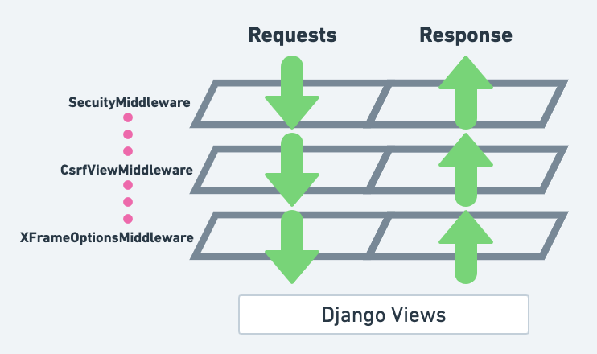
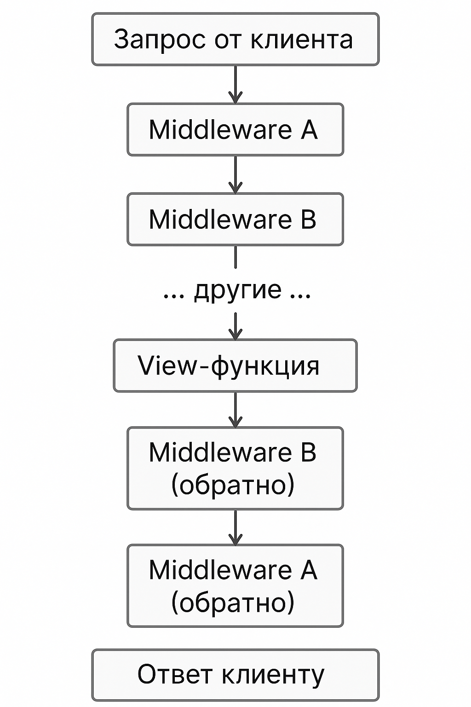

# Лекция 29. Middleware. Signals. Messages. Manage commands

## Введение
В этой лекции мы разберём несколько вспомогательных, но очень полезных инструментов Django: middleware, сигналы, систему сообщений и собственные команды управления. Эти механизмы позволяют управлять запросами и ответами, реагировать на события, взаимодействовать с пользователем через уведомления и расширять функциональность командной строки. Всё это мы рассмотрим на практических примерах.


## Middleware в Django



Когда пользователь заходит на сайт, он отправляет HTTP-запрос. Этот запрос сначала не попадает напрямую в ваше представление `(view)`, а проходит через специальную цепочку обработчиков, которые называются `middleware` — от англ. **"промежуточное ПО"**. Их задача — перехватывать, изменять, дополнять или фильтровать как входящие запросы, так и исходящие ответы. Иными словами, `middleware` — это прослойка между клиентом и вашим приложением, которая позволяет выполнять дополнительные действия с запросами и ответами. Ссылка на [документацию](https://docs.djangoproject.com/en/5.2/topics/http/middleware/).

Представьте, что вы сидите на проходной завода, и каждый человек (запрос) должен пройти через вас, прежде чем попасть внутрь. Вы можете проверить, кто это, записать время прихода, не пустить вовсе или приклеить ему бейдж. `Middleware` выполняет примерно такие функции — он может изменить запрос, а когда человек (ответ) выходит с завода, вы снова можете его перехватить, изменить, записать или отфильтровать.

### Как устроены Middleware в Django?
Django автоматически запускает весь стек `middleware` при каждом запросе. Каждый `middleware` — это класс, который принимает объект `HttpRequest`, а возвращает `HttpResponse`. Django сам формирует цепочку вызовов, и вы как разработчик можете подключать свои `middleware`, изменять порядок или отключать ненужные.

Примерно так выглядит схема работы `middleware`:



### Пример встроенных Middleware в Django

Вот часть стандартного `MIDDLEWARE` в `settings.py`:

```python
MIDDLEWARE = [
    'django.middleware.security.SecurityMiddleware',
    'django.contrib.sessions.middleware.SessionMiddleware',
    'django.middleware.common.CommonMiddleware',
    'django.middleware.csrf.CsrfViewMiddleware',
    'django.contrib.auth.middleware.AuthenticationMiddleware',
    'django.contrib.messages.middleware.MessageMiddleware',
]
```

Каждый из этих `middleware` реализует свою задачу:

| Middleware                 | Назначение                                              |
| -------------------------- | ------------------------------------------------------- |
| `SecurityMiddleware`       | Включает защиту от XSS, HSTS и т.д.                     |
| `SessionMiddleware`        | Управляет сессиями                                      |
| `CommonMiddleware`         | Общие HTTP-фильтры (например, редиректы `APPEND_SLASH`) |
| `CsrfViewMiddleware`       | Защита от CSRF-атак                                     |
| `AuthenticationMiddleware` | Добавляет `request.user`                                |
| `MessageMiddleware`        | Добавляет поддержку временных сообщений                 |

### Простой пример middleware

Создадим `middleware`, который будет логировать каждый запрос и ответ:

```python
# myapp/middleware.py

class SimpleLogMiddleware:
    def __init__(self, get_response):
        self.get_response = get_response

    def __call__(self, request):
        # Этап до view
        print(f"[Middleware] Пришел запрос: {request.method} {request.path}")

        response = self.get_response(request)

        # Этап после view
        print(f"[Middleware] Ответ со статусом: {response.status_code}")
        return response
```

**Этот класс делает всего две вещи:**

- Перед тем как запрос дойдёт до `view`, он выведет метод и путь;
- После того как `view` вернёт ответ, он выведет статус ответа.

Чтобы этот класс заработал, нужно подключить его в `settings.py`:

```python
MIDDLEWARE = [
    ...
    'myapp.middleware.SimpleLogMiddleware',
]
```

Теперь каждый входящий и исходящий `HTTP-запрос` будет сопровождаться логами.

### Как написать middleware правильно

Каждый `middleware` в современном Django — это класс с методом `__call__()`. При этом в конструктор `(__init__)` автоматически передаётся функция `get_response`, которая вызывает следующий слой — либо другой `middleware`, либо `view`.
Внутри __call__ вы можете:
- работать с `request` до вызова `get_response`;
- работать с `response` после вызова `get_response`.

Именно так можно внедрять логику проверки IP-адресов, фильтрации по токенам, подсчета времени ответа, добавления заголовков, или даже остановки цепочки и возврата собственного ответа без вызова `view`.

#### Старый стиль через MiddlewareMixin

В старых версиях Django использовались методы `process_request`, `process_response` и `process_exception`, и чтобы поддерживать совместимость, можно использовать `MiddlewareMixin`:

```python
from django.utils.deprecation import MiddlewareMixin

class LegacyStyleMiddleware(MiddlewareMixin):
    def process_request(self, request):
        print("Обработка запроса")

    def process_response(self, request, response):
        print("Обработка ответа")
        return response
```

Однако сейчас рекомендуется использовать современный способ с `__call__`, потому что он проще, понятнее и гибче.

#### Пример практического middleware

Допустим, вы хотите добавить в каждый ответ HTTP-заголовок с названием вашей компании:

```python
class CustomHeaderMiddleware:
    def __init__(self, get_response):
        self.get_response = get_response

    def __call__(self, request):
        response = self.get_response(request)
        response['created_by'] = 'MyCompany Inc. FullT1lt'
        return response
```

Всё просто: после выполнения `view` вы вставляете дополнительный заголовок, и он уйдёт вместе с ответом пользователю.

#### Порядок имеет значение

`Middleware` обрабатываются в том порядке, в котором указаны в `MIDDLEWARE`. Чем выше `middleware` в списке, тем раньше он видит `request` и тем позже он обрабатывает `response`. Поэтому, если у вас есть `middleware`, который должен что-то *"обернуть"* или *"перехватить"* до остальных — он должен быть выше в списке. Например, если вы хотите, чтобы ваш `CustomHeaderMiddleware` добавлял заголовок после всех других `middleware`, он должен быть в конце списка. А если он должен обрабатывать запросы раньше, то его нужно поставить выше.

## Сигналы в Django

Когда мы пишем Django-приложение, часто возникают ситуации, когда при одном действии нужно автоматически выполнить другое. Например:
- пользователь зарегистрировался — нужно создать для него профиль;
- заказ оформлен — отправить письмо;
- объект удаляется — сохранить лог;
- обновляется товар — пересчитать цену.

Конечно, можно написать всё это вручную прямо во `view` или в методе `save()`, но это делает код связанным, *"тяжёлым"* и плохо расширяемым. Именно для таких случаев Django предоставляет сигналы — способ *"реагировать на события"*, которые происходят в модели или приложении.

Сигналы позволяют отделить реакцию на событие от места, где это событие произошло. Это как *"невидимый слушатель"*: когда происходит определённое действие, Django посылает сигнал, и функция-обработчик может среагировать на него. Официальная документация по сигналам доступна [здесь](https://docs.djangoproject.com/en/5.2/topics/signals/).

### Сигнал при создании покупки

Представим, что у нас есть модель `Purchase`, которая описывает покупку товара пользователем.
Когда создаётся объект `Purchase`, мы хотим:
- автоматически списать деньги с баланса пользователя;
- возможно, отправить уведомление (в дальнейшем);
- или просто залогировать покупку.

**Шаг 1: Модель пользователя и покупок**

```python
# models.py

from django.contrib.auth.models import AbstractUser
from django.db import models

class User(AbstractUser):
    balance = models.DecimalField(max_digits=10, decimal_places=2, default=0)

class Product(models.Model):
    name = models.CharField(max_length=100)
    price = models.DecimalField(max_digits=10, decimal_places=2)

class Purchase(models.Model):
    user = models.ForeignKey(User, on_delete=models.CASCADE)
    product = models.ForeignKey(Product, on_delete=models.CASCADE)
    created_at = models.DateTimeField(auto_now_add=True)
```

**Шаг 2: Сигнал post_save для Purchase**

Теперь напишем сигнал: после создания объекта `Purchase` мы хотим уменьшить баланс пользователя на цену продукта.

```python
# signals.py

from django.db.models.signals import post_save
from django.dispatch import receiver
from .models import Purchase

@receiver(post_save, sender=Purchase)
def deduct_balance_after_purchase(sender, instance, created, **kwargs):
    if created:
        user = instance.user
        product = instance.product
        user.balance -= product.price
        user.save()
        print(f"[SIGNAL] С пользователя {user.username} списано {product.price} за покупку {product.name}")
```

**Шаг 3: Подключение сигнала**
Чтобы сигнал заработал, его нужно зарегистрировать. Обычно это делается в файле `apps.py` вашего приложения:

```python
# apps.py

class ShopConfig(AppConfig):
    default_auto_field = 'django.db.models.BigAutoField'
    name = 'shop'

    def ready(self):
        import shop.signals
```

Теперь Django будет автоматически вызывать `deduct_balance_after_purchase` каждый раз, когда создаётся новый объект `Purchase`.

```python
# __init__.py
default_app_config = 'shop.apps.ShopConfig'
```

#### Как работает сигнал при создании покупки

**1. Пользователь оформляет покупку**
Допустим, где-то в приложении — например, в `view` или через админку — создаётся объект `Purchase`:

```python
purchase = Purchase.objects.create(user=user, product=product)
```

На этом этапе Django создаёт новую запись в базе данных: в таблице покупок появляется строка, где указано, какой пользователь купил какой товар.

**2. Django посылает сигнал post_save**
Сразу после того как объект успешно создан в базе (после `.save()`), Django автоматически вызывает сигнал `post_save`.

Сигнал — это как системное уведомление:
*«Эй! Только что сохранён объект модели `Purchase`! Кому это важно — среагируйте!»*

**3. Наш обработчик ловит сигнал**

Мы ранее зарегистрировали специальную функцию, которая будет вызываться каждый раз, когда создаётся объект Purchase.
Вот она:
```python
@receiver(post_save, sender=Purchase)
def deduct_balance_after_purchase(sender, instance, created, **kwargs):
```

- sender=`Purchase` — мы слушаем только модель Purchase;
- `created=True` — проверяем, что объект только что создан, а не просто обновлён;
- `instance` — это сам объект покупки (тот, что только что был сохранён).

**4. Выполняется логика внутри обработчика**
Если покупка действительно новая `(created == True)`, то мы:

Достаём пользователя и товар:

```python
user = instance.user
product = instance.product
```

Уменьшаем баланс:

```python
user.balance -= product.price
```

Сохраняем обновлённого пользователя:

```python
user.save()
```

Выводим сообщение в консоль (или можно залогировать в файл, или отправить в Telegram и т.д.):

```python
print(f"[SIGNAL] С пользователя {user.username} списано {product.price}")
```

**Почему это удобно?**
Мы не вмешиваемся в модель `Purchase`, не усложняем View-функции и не забываем про списание — сигнал всё сделает сам. Код получается разделённым по зонам ответственности:
- View отвечает за оформление покупки;
- Модель отвечает за данные;
- Сигнал — за последствия действия.

Если в будущем мы захотим добавить:
- Уведомление по email;
- Создание PDF-чека;
- Начисление бонусов;
- Запись в лог-файл...

— всё это можно сделать прямо внутри или рядом с сигналом, не трогая основной код.

## Django Messages: как передавать сообщения пользователю

[Официальная документация](https://docs.djangoproject.com/en/5.2/ref/contrib/messages/)

Когда пользователь выполняет какое-либо действие на сайте — например, отправляет форму, логинится, удаляет объект или оформляет заказ — ему полезно получить обратную связь. То есть увидеть сообщение вроде:
- «Вы успешно зарегистрировались»
- «Неверный логин или пароль»
- «Товар добавлен в корзину»

Вместо того чтобы *«зашивать»* эти сообщения вручную в шаблоны, Django предлагает встроенную систему под названием *Messages Framework*. Это механизм для временного хранения сообщений, которые автоматически исчезают после отображения.

### Как это работает?

- Во view-функции вы добавляете сообщение с помощью `messages.success()`, `messages.error()` и т.д.
- Django сохраняет сообщение во временное хранилище (обычно в сессии).
- При следующем запросе сообщение становится доступно в шаблоне.
- После отображения оно автоматически исчезает.
- То есть это как одноразовая записка для пользователя: положили в карман (сессию), пользователь прочитал — она исчезла.

### Подключение messages

Если вы используете `django.contrib.messages`, то скорее всего всё уже работает *«из коробки»*. Убедитесь, что:

- 1. В `INSTALLED_APPS` есть:
```python
'django.contrib.messages',
```
- 2. В `MIDDLEWARE`:
```python
'django.contrib.messages.middleware.MessageMiddleware',
```

- 3. В `TEMPLATES` включён контекстный процессор:
```python
'django.contrib.messages.context_processors.messages',
```

Все эти настройки по умолчанию есть в стандартном проекте Django.

**Добавление сообщений во view**

В view-функции (или в CBV через `self.request`) можно добавить сообщение вот так:

```python
from django.contrib import messages
from django.shortcuts import redirect

def add_to_cart(request, product_id):
    # логика добавления в корзину
    messages.success(request, "Товар добавлен в корзину")
    return redirect('cart')
```

Другие типы сообщений:

```python
messages.debug(request, "Отладочная информация")
messages.info(request, "Информационное сообщение")
messages.success(request, "Успешно выполнено")
messages.warning(request, "Предупреждение")
messages.error(request, "Произошла ошибка")
```

**Отображение сообщений в шаблоне**

Чтобы сообщения отобразились — нужно вставить специальный блок в ваш шаблон (обычно в `base.html`):

```django

  <ul class="messages">
    
      <li class="{{ message.tags }}">{{ message }}</li>
    
  </ul>

```

Каждое сообщение автоматически получает `CSS-класс` по его уровню (`success`, `error`, `info` и т.д.), что удобно для стилизации.

**Как это выглядит в HTML (пример)**

```html
<ul class="messages">
  <li class="success">Товар добавлен в корзину</li>
  <li class="error">Неверный пароль</li>
</ul>
```

Если подключён `Bootstrap`, можно использовать классы `alert` `alert-success`, `alert` `alert-danger` и т.д.

```django
<li class="alert alert-{{ message.tags }}">{{ message }}</li>
```

**Сообщения в CBV (Class-Based Views)**

В `CBV` доступ к `messages` тоже очень простой:

```python
from django.views.generic.edit import FormView
from django.contrib import messages

class ContactFormView(FormView):
    template_name = 'contact.html'
    form_class = ContactForm

    def form_valid(self, form):
        messages.success(self.request, "Спасибо за обращение!")
        return super().form_valid(form)
```

**Важные детали**

- Сообщения хранятся в сессии, поэтому работают только если настроены `SessionMiddleware`.
- Django сам очищает сообщения после одного показа (`One-time messages`).
- Вы можете использовать `messages.get_messages(request)` для ручного доступа.

## Manage-команды в Django


В каждом Django-проекте есть файл `manage.py`, и вы наверняка уже не раз запускали команды вроде:

```bash
python manage.py runserver
python manage.py makemigrations
python manage.py migrate
```

Все эти вызовы используют механизм manage-команд, встроенный в `Django`. Это система, которая позволяет выполнять различные действия через командную строку: запуск сервера, создание миграций, управление базой данных, импорт/экспорт данных, запуск тестов и многое другое.

Но кроме встроенных команд, `Django` позволяет создавать собственные кастомные команды. Это особенно удобно, когда необходимо автоматизировать рутинные действия: загрузку данных, генерацию отчётов, очистку базы, интеграции с внешними сервисами и так далее.

### Как устроены manage-команды?

Команда в Django — это Python-класс, который наследуется от BaseCommand и реализует метод `handle()`.Django автоматически находит такие команды по определённой структуре папок внутри приложения:

```plaintext
myapp/
├── management/
│   └── commands/
│       └── my_command.py
```

В этом примере `myapp` — это ваше приложение, а `my_command.py` — файл с вашей командой. Внутри него вы определяете логику команды. Если вы создадите файл `my_command.py` в этой структуре, его можно будет запустить так:

```bash
python manage.py my_command
```

**Пример: команда для вывода всех пользователей**

```python
# myapp/management/commands/list_users.py
from django.core.management.base import BaseCommand
from django.contrib.auth import get_user_model

User = get_user_model()

class Command(BaseCommand):
    help = 'Выводит список всех пользователей'

    def handle(self, *args, **kwargs):
        for user in User.objects.all():
            self.stdout.write(f'{user.username} — {user.email}')
```

После этого вы можете вызвать:

```bash
python manage.py list_users
```

Результат отобразится прямо в терминале.

### Основные встроенные команды Django

Вот некоторые из самых полезных встроенных команд Django:

| Команда                              | Назначение                                                                    |
| ------------------------------------ | ----------------------------------------------------------------------------- |
| `runserver`                          | Запускает локальный сервер разработки. По умолчанию `http://127.0.0.1:8000/`. |
| `makemigrations`                     | Создаёт миграции по изменениям моделей.                                       |
| `migrate`                            | Применяет миграции к базе данных.                                             |
| `createsuperuser`                    | Создаёт суперпользователя для админки.                                        |
| `shell`                              | Запускает интерактивную Python-оболочку с доступом к моделям.                 |
| `dbshell`                            | Подключается к базе данных через системную консоль.                           |
| `check`                              | Проверяет проект на ошибки конфигурации и моделей.                            |
| `showmigrations`                     | Показывает все миграции и статус их применения.                               |
| `sqlmigrate app_name migration_name` | Показывает SQL, который будет выполнен в миграции.                            |
| `flush`                              | Удаляет все данные из базы и сбрасывает счётчики ID (⚠️ осторожно).           |
| `loaddata file.json`                 | Загружает фикстуры (предопределённые данные) в базу.                          |
| `dumpdata`                           | Экспортирует данные из базы в формате JSON.                                   |
| `startapp appname`                   | Создаёт новое приложение внутри проекта.                                      |
| `startproject projectname`           | Создаёт новый Django-проект.                                                  |
| `collectstatic`                      | Собирает все статические файлы в одну директорию (для деплоя).                |
| `test`                               | Запускает юнит-тесты.                                                         |

### Аргументы, stdout и stderr в manage-командах

Вы можете сделать кастомную Django-команду более гибкой, добавив поддержку аргументов из командной строки. Это позволяет управлять поведением команды без изменения кода — например, передавать ID пользователя, дату, флаг `--delete` и так далее.

Рассмотрим пример команды, которая принимает `ID` пользователя и выводит его имя и `email`:

```python
from django.core.management.base import BaseCommand
from django.contrib.auth import get_user_model

User = get_user_model()

class Command(BaseCommand):
    help = 'Показывает одного пользователя по ID'

    def add_arguments(self, parser):
        parser.add_argument('user_id', type=int)

    def handle(self, *args, **kwargs):
        user_id = kwargs['user_id']
        try:
            user = User.objects.get(pk=user_id)
            self.stdout.write(f'{user.username} — {user.email}')
        except User.DoesNotExist:
            self.stderr.write('Пользователь не найден')
```

Теперь вы можете вызвать эту команду так:

```bash
python manage.py show_user 5
```

Если пользователь с `ID 5` существует, вы получите:

```nginx
admin — admin@example.com
```

Если пользователя нет:

```nginx
Пользователь не найден
```

**Пояснение к коду:**

- `help` — описание команды, отображается при вызове `--help`;
- `add_arguments()` — добавление позиционного аргумента `user_id` типа `int`;
- `handle()` — основной метод, где выполняется логика команды;
- `self.stdout.write()` — вывод информации в терминал (успешный результат);
- `self.stderr.write()` — вывод ошибки, если пользователь не найден.

### Что такое stdout и stderr?

В контексте командной строки и программирования, `stdout` и `stderr` — это два стандартных потока вывода, которые используются для передачи информации от программы к пользователю или системе.

#### stdout (standard output)

`stdout` — это стандартный поток вывода, в который попадает вся текстовая информация, выводимая программой. Когда вы вызываете `print("Привет")` — это по сути то же самое, что:

```python
import sys
sys.stdout.write("Привет\n")
```

Django рекомендует не использовать `print()`в manage-командах, а использовать `self.stdout.write()` — это:

- правильно обрабатывает цвета и стили;
- сохраняет совместимость с перенаправлением вывода `(> файл.txt)`;
- не смешивается с ошибками `(stderr)`;
- логируется корректно в CI-системах.

Пример:

```python
self.stdout.write("Пользователь успешно найден")
```

**stderr (standard error)**

`stderr` — это поток ошибок, который используется для сообщений об ошибках и исключениях. Он также отображается в терминале, но может быть отдельно от `stdout`.В manage-командах рекомендуется использовать:

```python
self.stderr.write("Ошибка: пользователь не найден")
```

**Это позволяет:**
- отделить ошибки от обычных сообщений;
- фильтровать сообщения при логировании;
- интегрироваться с внешними системами (например, `Jenkins`, `GitHub Actions`).

Сравнение `stdout` и `stderr`

| Поток    | Назначение                   | Как использовать в Django-командах |
| -------- | ---------------------------- | ---------------------------------- |
| `stdout` | Обычные сообщения, результат | `self.stdout.write("...")`         |
| `stderr` | Ошибки, исключения           | `self.stderr.write("Ошибка: ...")` |

**Пример использования:**
```python
self.stdout.write("Покупка успешно сохранена")
self.stderr.write("Ошибка: недостаточно средств на балансе")
```

Использование `stdout` и `stderr` делает вашу команду чистой, предсказуемой и удобной для отладки. Это особенно важно, если команды будут использоваться в продакшене, в автоматизации или при `CI/CD`.
