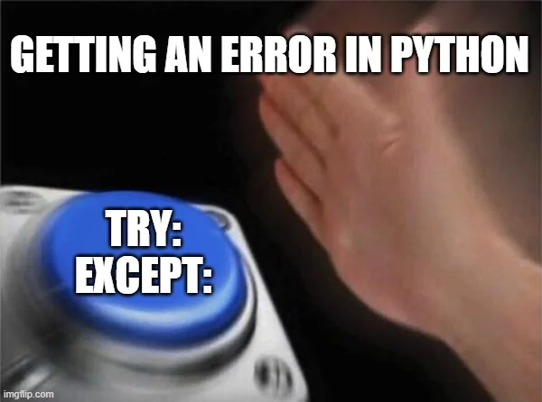
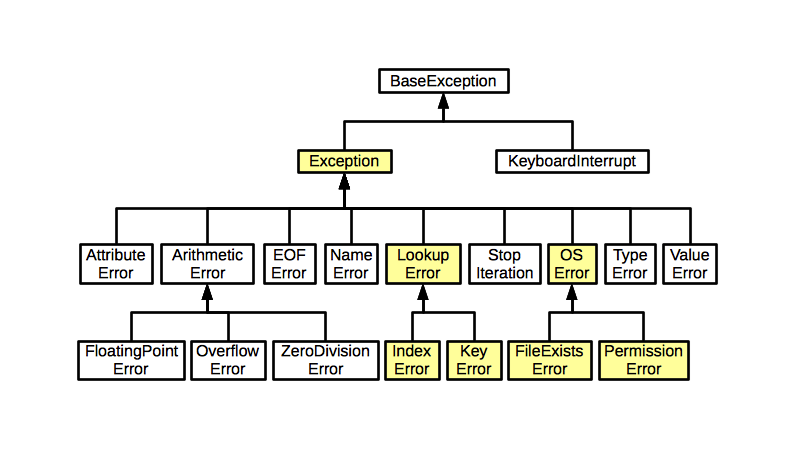

# Лекция 3. Исключения и их обработка в Python



## Что такое исключение?

Исключения (exceptions) в Python — это механизм обработки ошибок во время выполнения программы. Они позволяют программе продолжить работу после обнаружения ошибки, а не завершаться аварийно. В Python есть встроенные исключения, которые обрабатывают большинство типовых ошибок.

Иерархия исключений выглядит вот так:



## Основные исключения в python

В Python существует множество встроенных исключений, которые возникают при различных ошибках во время выполнения программы. Рассмотрим наиболее распространённые типы исключений.

`SyntaxError` - Возникает, когда код написан с нарушением правил синтаксиса Python.

`NameError` - Возникает, если в коде используется переменная, которая не была объявлена.

`TypeError`- Происходит, если операция выполняется между несовместимыми типами данных.

`ValueError` - Возникает, если переданное значение имеет правильный тип, но недопустимое значение.

`IndexError` - Возникает при попытке обращения к элементу списка (или другого индексируемого объекта) по несуществующему индексу.

`KeyError` - Возникает при попытке получить значение по несуществующему ключу в словаре.

`ZeroDivisionError` - Возникает при попытке деления числа на 0.

`FileNotFoundError` - Происходит, если пытаемся открыть файл, которого не существует.

Разберём каждое исключение подробнее с примерами.

### 1. SyntaxError (Ошибка синтаксиса)

Возникает, когда код написан с нарушением правил синтаксиса Python. Это самая частая ошибка у новичков.

```python
if True
    print("Ошибка!")  # Пропущено двоеточие после if
```

Ошибка:

```sh
SyntaxError: expected ':'
```

### 2. NameError (Ошибка имени)

Возникает, если в коде используется переменная, которая не была объявлена.

```python
value1 = 1
print(value)  # Переменная value не определена
```

Ошибка:

```sh
NameError: name 'value' is not defined
```

### 3. TypeError (Ошибка типа)

Происходит, если операция выполняется между несовместимыми типами данных.

```python
print(5 + "5")  # Нельзя сложить число и строку без преобразования
```

Ошибка:

```sh
TypeError: unsupported operand type(s) for +: 'int' and 'str'
```

### 4. ValueError (Ошибка значения)

Возникает, если переданное значение имеет правильный тип, но недопустимое значение.

```python
num = int("Hello")  # Нельзя преобразовать строку "Hello" в число
```

Ошибка:

```sh
ValueError: invalid literal for int() with base 10: 'Hello'
```

### 5. KeyError (Ошибка ключа)

Возникает при попытке получить значение по несуществующему ключу в словаре.

```python
my_dict = {"name": "Alice"}
print(my_dict["age"])  # В словаре нет ключа "age"
```

Ошибка:

```sh
KeyError: 'age'
```

### 6. ZeroDivisionError (Ошибка деления на ноль)

Возникает при попытке деления числа на 0.

```python
result = 10 / 0
```

Ошибка:

```sh
ZeroDivisionError: division by zero
```

## Обработка исключений с помощью try-except

Python позволяет перехватывать ошибки и продолжать выполнение программы. Для этого используется конструкция `try-except`.

**Базовый try-except**

В блоке `try` должен выполняться код в котором мы ожидаем какое-либо исключение. И если исключение происходит, то код перестает выполняться, и переходит к блоку/блокам `except`, и пытается понять произошло ли то исключение, которое описано в блоке `except`

```python
try:
    print(10 / 0)  # Ошибка
except:
    print("Произошла ошибка!")
```

Вывод: Произошла ошибка! (программа не сломалась)

А теперь перейдем к обработка конкретных исключений. И начнем с ошибки `TypeError` которую мы уже с вами видили на прошлых занятиях. Теперь мы научимся ее отлавливать:)

```python
try:
    print(5 + "5")  # Ошибка: нельзя сложить число и строку
except TypeError:
    print("Ошибка: Нельзя сложить число и строку!")
```

Вывод: Ошибка: Нельзя сложить число и строку!

Все впорядке программа не сломалась и продолжила свою работу благодаря блоку `except TypeError:`.

### Обработка нескольких исключений

Можно обрабатывать разные ошибки в одном блоке `try-except`. Блоков `except` может быть любое колличество. Например:

```python
try:
    num = int(input("Введите число: "))  # Ошибка, если введено не число
    result = 10 / num  # Ошибка, если num == 0
    print(result)
except ValueError:
    print("Ошибка: Введите корректное число!")
except ZeroDivisionError:
    print("Ошибка: Деление на ноль невозможно!")
```

**Как это работает?**

- `ValueError` возникает, если пользователь вводит, например, "abc" вместо числа.
- `ZeroDivisionError` возникает, если введён 0.

### Обработка множества ошибок в одном except

Можно перехватывать несколько исключений сразу:

```python
try:
    num = int(input("Введите число: "))  # Может вызвать ValueError
    result = 10 / num  # Может вызвать ZeroDivisionError
except (ValueError, ZeroDivisionError):
    print("Ошибка: Некорректный ввод или деление на ноль!")
```

**Зачем это нужно?**

Когда не требуется разное поведение для разных ошибок, можно объединить их.

### Использование Exception для всех ошибок
Если мы не знаем, какие ошибки могут произойти, можно использовать `Exception` – он перехватывает любые исключения.

```python
try:
    x = int(input("Введите число: "))
    print(10 / x)
except Exception as e:
    print("Произошла ошибка:", e)
```

Если ввести 0, программа не сломается:

```sh
Введите число: 0
Произошла ошибка: division by zero
```

### Оператор finally

Оператор `finally` используется в блоке `try-except` для выполнения кода в любом случае, независимо от того, возникла ошибка или нет.

**Зачем нужен finally?**

- Освобождение ресурсов (например, закрытие файлов или соединений с базой данных).
- Выполнение кода, который должен выполниться всегда, даже если произошла ошибка.

```python
try:
    print("Начинаем выполнение...")
    num = int(input("Введите число: "))
    result = 10 / num
    print("Результат:", result)
except ZeroDivisionError:
    print("Ошибка: Деление на ноль!")
finally:
    print("Этот код выполнится в любом случае.")
```

При успешном выполнени (например поделим на 2) мы получим вот такой вывод:
```sh
Начинаем выполнение...
Введите число: 2
Результат: 5.0
Этот код выполнится в любом случае.
```

При делении на ноль :

```sh
Начинаем выполнение...
Введите число: 0
Ошибка: Деление на ноль!
Этот код выполнится в любом случае.
```

### Перехват ошибок с else

Если внутри `try` не возникло ошибок, можно выполнить код в `else`:

```python
try:
    num = int(input("Введите число: "))
    result = 100 / num
except ValueError:
    print("Ошибка: Введите число!")
except ZeroDivisionError:
    print("Ошибка: Деление на 0 невозможно!")
else:
    print("Результат:", result)  # Выполнится, если ошибок не было
```

В этом примере, если мы введем число, то исключения не случится, и это именно тот случай когда мы попадем в `else`.

### Конструкция try-except-else-finally в Python

```python
try:
    num = int(input("Введите число: "))  # Может вызвать ValueError
    result = 10 / num  # Может вызвать ZeroDivisionError
except ValueError:
    print("Ошибка: введено не число!")
except ZeroDivisionError:
    print("Ошибка: деление на ноль!")
else:
    print("Результат:", result)  # Выполнится, если ошибок не было
finally:
    print("Программа завершила обработку.")  # Выполняется всегда
```

В данном коде работают и оператор `else`, и `finally` если введете число или except и `finally` если букву. Большую часть времени вы не будете сталкиваться с оператором `else`, используемым в том или ином коде, который следует за оператором `try/except`, если ни одна ошибка не была найдена. Единственное полезное применение оператора `else`, которое я видел, — это когда вы хотите запустить вторую часть кода, в которой может быть ошибка. Конечно, если ошибка возникает в `else`, то она не будет поймана.

### Оператор raise

В Python слово `raise` применяется для инициирования исключения в том случае, когда вам необходимо специально вызвать ошибку. Вы указываете исключение и передаёте сообщение об ошибке. Вот перекрасный пример использования:

```python
number = int(input("Введите положительное число: "))
if number < 0:
    raise ValueError(" Ошибка: число не может быть отрицательным!")
print("Число принято:", number)
```

Эта конструкция и ключевое слово нам понадобится после того как мы разберем функции. Сейчас нужно запомнить что такая конструкция есть.

Технически всегда можно обработать исключение и вызвать его же еще раз. Зачем такое может быть надо? В случае когда нам не надо предотвращать ошибку, а только записать о том что ошибка случилась (так часто делается), тогда можно записать информацию и вызвать эту же ошибку еще раз

#### Наконец-то практика!!!!

1. Напишите программу, которая запрашивает у пользователя два числа и выполняет деление первого на второе. Обработайте ZeroDivisionError, если второе число равно 0.

2. Напишите программу, которая запрашивает у пользователя число. Если пользователь введёт не число, обработайте ошибку ValueError и попросите ввести число снова.

3. Попросите пользователя ввести число и делитель. Обработайте ValueError (если введено не число) и ZeroDivisionError.

4. Напишите программу, которая всегда выводит "Программа завершена.", даже если произошла ошибка.

**Домашнее задание**
Напишите калькулятор, который:
- Запрашивает два числа и операцию (+, -, *, /)
- Выполняет операцию
- Обрабатывает ошибки:
    - `ValueError`, если введено не число
    - `ZeroDivisionError`, если деление на ноль
    - Некорректный оператор (+, -, *, /)