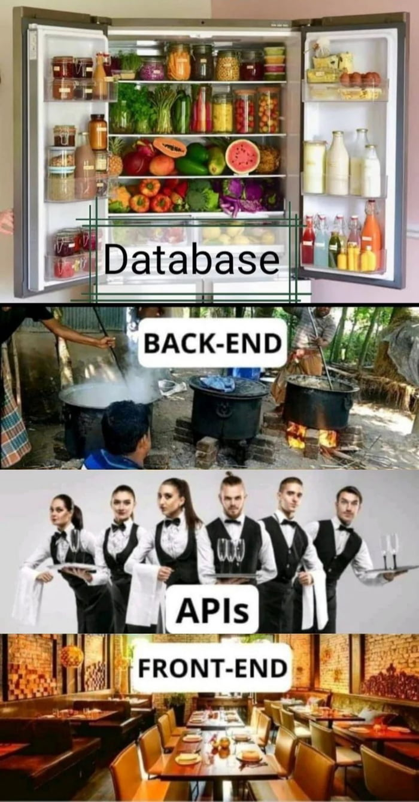
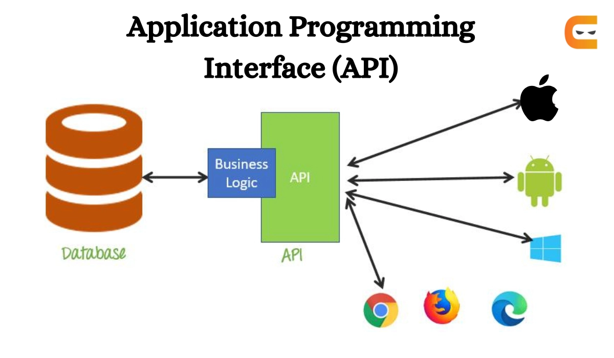

# Лекция 30: Введение в REST API. Основы API. HTTP-запросы. JSON.



## Введение. Что такое API и зачем оно нужно

Когда вы заходите на сайт, нажимаете на кнопку или оформляете заказ — вы взаимодействуете с интерфейсом пользователя `(UI)`. Это визуальная часть: кнопки, таблицы, формы, изображения.

Но теперь представьте: вы — не человек, а программа. Как вам получить список товаров, узнать цены, сделать заказ, не открывая браузер?
В таких случаях в дело вступает `API`.


### Что такое API


`API (Application Programming Interface)` — это интерфейс прикладного программирования, то есть набор правил и соглашений, с помощью которых одна программа может взаимодействовать с другой.

Когда одна система хочет получить данные от другой — будь то сайт, мобильное приложение или внешняя платёжная система — она делает это через `API`.
`API` определяет, какие запросы можно отправить, какие ответы можно получить, в каком формате происходит общение (например, JSON), и как обрабатываются ошибки.

**Простыми словами**

`API` — это как договор между двумя программами:
«Я, клиент, могу отправлять тебе такие-то запросы, а ты, сервер, обязан на них правильно ответить — если всё верно, дай мне данные, если ошибка — сообщи об этом понятным способом».

**Пример из жизни: ресторан**

Представьте, что вы пришли в ресторан.
Вы — клиент, повара — внутренняя кухня, а официант — `API`.
- Вы делаете заказ официанту (например: «салат и кофе») — это запрос.
- Официант передаёт его на кухню — это как `API` перенаправляет данные серверу.
- Кухня готовит, и официант приносит вам результат — это ответ `API`.

Вы не знаете, как устроена кухня, кто там готовит и сколько нужно времени на кофе. Вы просто пользуетесь понятным интерфейсом — меню и официантом.
Точно так же `API` скрывает детали реализации, но позволяет работать с системой через простой и предсказуемый интерфейс.

### API в веб-разработке
Веб-разработка делится на две части: фронтенд (клиентская часть) и бэкенд (серверная часть).

Во фронтенде или мобильных приложениях `API` используется, чтобы:
- получить список данных (например, список товаров);
- отправить информацию (например, оформить заказ или отправить сообщение);
- удалить или обновить запись.

Фронтенд обращается к `API`, получает данные в формате JSON и отображает их пользователю. Бэкенд — создаёт `API` и отвечает на запросы.

### Интерфейс для человека vs интерфейс для программ

`UI (User Interface)` — графический интерфейс для пользователя (HTML-страница, кнопки, формы);

`API` — программный интерфейс, который возвращает только данные (чаще всего в формате JSON), без оформления.

Например, вместо страницы `https://example.com/products/` вы можете обратиться к `https://example.com/api/products/` и получить *"сырые"* данные, которые можно обрабатывать программно. 

>Серыми данными называют данные без визуального оформления, которые можно использовать в коде.

### Зачем нужен API?

- Чтобы мобильные и веб-приложения получали и отправляли данные.
- Чтобы связать несколько сервисов (например, интеграция с платёжной системой).
- Чтобы другие разработчики могли использовать ваш сервис (например, `Telegram Bot API` или `OpenAI API`).
- Чтобы разделить клиентскую и серверную части проекта (`frontend ↔ backend`).

### Какие бывают API?

API бывают разными — как по назначению, так и по способу взаимодействия. Ниже — основные типы:

| Тип API            | Описание                                                                    |
| ------------------ | --------------------------------------------------------------------------- |
| **Локальный API**  | Взаимодействие между частями одной программы (модули, библиотеки).          |
| **Web API**        | API, доступные через интернет — они работают по HTTP/HTTPS.                 |
| **Внутренний API** | Используется только внутри одной компании/проекта (например, микросервисы). |
| **Публичный API**  | Открыт для внешних разработчиков (например, Google Maps API, Telegram API). |
| **Закрытый API**   | Доступен только определённым пользователям или партнёрам (например, API банков). |

## Что такое REST?


`REST (Representational State Transfer)` — это архитектурный стиль построения `Web API`. Его предложил Рой Филдинг в своей диссертации в 2000 году.

### Свойства REST архитектуры.



Свойства архитектуры, которые зависят от ограничений, наложенных на `REST-системы`:

 1. `Client-Server`. Система должна быть разделена на клиентов и на сервер(ы). Разделение интерфейсов означает, что клиенты не связаны с хранением данных, которое остается внутри каждого сервера, так что мобильность кода клиента улучшается. Серверы не связаны с интерфейсом пользователя или состоянием, так что серверы могут быть проще и масштабируемы. Серверы и клиенты могут быть заменяемы и разрабатываться независимо, пока интерфейс не изменяется.

 2. `Stateless`. Сервер не должен хранить какой-либо информации о клиентах. В запросе должна храниться вся необходимая информация для обработки запроса и, если необходимо, идентификации клиента.

 3. `Cache․` Каждый ответ должен быть отмечен, является ли он кэшируемым или нет, для предотвращения повторного использования клиентами устаревших или некорректных данных в ответ на дальнейшие запросы.

 4. `Uniform Interface`. Единый интерфейс определяет интерфейс между клиентами и серверами. Это упрощает и отделяет архитектуру, которая позволяет каждой части развиваться самостоятельно. Четыре принципа единого интерфейса:

    4.1) Identification of resources (основан на ресурсах). В REST ресурсом является все то, чему можно дать имя. Например, пользователь, изображение, предмет (майка, голодная собака, текущая погода) и т. д. Каждый ресурс в REST должен быть идентифицирован посредством стабильного идентификатора, который не меняется при изменении состояния ресурса. Идентификатором в REST является URI.

    4.2) Manipulation of resources through representations. (Манипуляции над ресурсами через представления). Представление в REST используется для выполнения действий над ресурсами. Представление ресурса представляет собой текущее или желаемое состояние ресурса. Например, если ресурсом является пользователь, то представлением может являться XML или HTML описание этого пользователя.

    4.3) Self-descriptive messages (само-документируемые сообщения). Под само-описательностью имеется в виду, что запрос и ответ должны хранить в себе всю необходимую информацию для их обработки. Не должны быть дополнительные сообщения или кэши для обработки одного запроса. Другими словами, отсутствие состояния, сохраняемого между запросами к ресурсам. Это очень важно для масштабирования системы.

    4.4) HATEOAS (hypermedia as the engine of application state). Статус ресурса передается через содержимое body, параметры строки запроса, заголовки запросов и запрашиваемый URI (имя ресурса). Это называется гипермедиа (или гиперссылки с гипертекстом). HATEOAS также означает, что в случае необходимости ссылки могут содержаться в теле ответа (или заголовках) для поддержки URI, извлечения самого объекта или запрошенных объектов.

 5. `Layered System`. В `REST` допускается разделить систему на иерархию слоев, но с условием, что каждый компонент может видеть компоненты только непосредственно следующего слоя. Например, если вы вызываете службу `PayPal`, а она в свою очередь вызывает службу `Visa`, вы о вызове службы `Visa` ничего не должны знать.

 6. `Code-On-Demand (опционально)`. В `REST` позволяется загрузка и выполнение кода или программы на стороне клиента.

Если выполнены первые 4 пункта и не нарушены 5 и 6, такое приложение называется `RESTful` 

!Важно понимать, что `REST` — это не протокол, а архитектурный стиль. Он не определяет, как именно реализовывать `API`, а лишь задаёт принципы и ограничения, которым следует следовать. `Restful API` может использовать разные протоколы (чаще всего HTTP), но всегда придерживается этих принципов.

Вы можете писать `REST API` на любом языке и с любым фреймворком (`Django`, `Flask`, `Node.js`, и т.д.).

### Как устроен REST API?

`REST API` обычно строится вокруг ресурсов, каждый из которых представлен в виде URL-адреса.

Примеры ресурсов:
- `/users/` — список пользователей
- `/users/5/` — пользователь с ID 5
- `/products/` — список товаров
- `/orders/17/` — заказ №17

Запросы к этим ресурсам происходят через `HTTP`-методы.

### Основные HTTP-методы

| Метод    | Назначение                | Пример                                       |
| -------- | ------------------------- | -------------------------------------------- |
| `GET`    | Получить ресурс           | `GET /products/` — получить список товаров   |
| `POST`   | Создать новый ресурс      | `POST /users/` — создать нового пользователя |
| `PUT`    | Полностью обновить ресурс | `PUT /users/5/` — заменить пользователя      |
| `PATCH`  | Частично обновить ресурс  | `PATCH /users/5/` — обновить email           |
| `DELETE` | Удалить ресурс            | `DELETE /products/10/` — удалить товар       |

### HTTP-статусы ответов

Каждый ответ от сервера сопровождается статусом, который помогает понять, что произошло. Вот самые часто встречающиеся:

| Код                | Назначение                                 |
| ------------------ | ------------------------------------------ |
| `200 OK`           | Всё хорошо, данные получены                |
| `201 Created`      | Ресурс успешно создан                      |
| `204 No Content`   | Запрос прошёл, но ответ без тела           |
| `400 Bad Request`  | Ошибка в запросе (например, неверный JSON) |
| `401 Unauthorized` | Пользователь не авторизован                |
| `403 Forbidden`    | Доступ запрещён                            |
| `404 Not Found`    | Ресурс не найден                           |
| `500 Server Error` | Внутренняя ошибка сервера                  |

**Пример: как выглядит REST-запрос**

Допустим, у нас есть `API` интернет-магазина. Запрос на добавление нового товара может выглядеть так:

**Запрос:**

```bash
POST /api/products/
Content-Type: application/json
{
  "name": "Ноутбук ASUS",
  "price": 28999,
  "stock": 5
}
```

**Ответ:**

```bash
201 Created
{
  "id": 7,
  "name": "Ноутбук ASUS",
  "price": 28999,
  "stock": 5
}
```

### Идемпотентность HTTP-методов


`Идемпотентность` — это свойство некоторых HTTP-методов, которое позволяет повторять запросы без изменения результата. Это важное свойство некоторых `HTTP-методов`, которое означает, что многократный повтор одного и того же запроса не изменит результат.

Иными словами: если вы отправите такой запрос 1 раз или 10 раз подряд — состояние сервера останется прежним (или приведёт к одному и тому же состоянию).

| Метод    | Идемпотентен? | Почему?                                                       |
| -------- | ------------- | ------------------------------------------------------------- |
| `GET`    | Да          | Просто получает данные, ничего не меняет.                     |
| `DELETE` | Да          | Повторное удаление не влияет: объект уже удалён.              |
| `PUT`    | Да          | Перезаписывает объект заново, результат всегда одинаков.      |
| `PATCH`  | Частично    | Зависит от реализации — может быть или не быть.               |
| `POST`   | Нет         | Создаёт новый объект — каждый запрос может породить новый ID. |


**Примеры идемпотентных методов:**

Допустим, у вас есть товар с ID 10. Вы отправляете такой запрос:

```http
PUT /products/10/
{
  "name": "Кофеварка",
  "price": 1500
}
```

 - при первом запросе товар обновится.
 - при втором — он обновится тем же самым значением.

То есть никакого дополнительного эффекта не произойдёт — это и есть идемпотентность.

А вот POST не идемпотентен:

```http
POST /products/
{
  "name": "Кофеварка",
  "price": 1500
}
```
Каждый вызов такого запроса создаст новый товар с новым `ID`, даже если тело запроса одинаковое.

## Форматы передачи данных в API

Когда клиент и сервер обмениваются данными через `API`, они должны использовать общий формат, понятный обеим сторонам. Существуют разные форматы, но наиболее популярные:

| Формат                                              | Описание                                                                        |
| --------------------------------------------------- | ------------------------------------------------------------------------------- |
| **JSON** (JavaScript Object Notation)               | Самый популярный. Текстовый, лёгкий, читаемый. Используется почти везде.     |
| **XML** (eXtensible Markup Language)                | Более громоздкий. Часто используется в старых системах и в банковской сфере. |
| **Form data** (`application/x-www-form-urlencoded`) | Классический способ отправки форм. Используется браузерами.                  |
| **Multipart/form-data**                             | Применяется при загрузке файлов (например, изображений).                     |
| **YAML**                                            | Удобен для конфигураций. В `API` — редко.                                      |


### Почему все любят JSON?
 - Он компактнее XML — меньше *"воды"* и лишних тегов;
 - Его легче читать и писать;
 - У него широкая поддержка: все языки, все фреймворки, все инструменты;
 - Он нативен для `JavaScript`, а значит идеален для работы в браузере.

Поэтому в современных `REST API JSON` стал де-факто стандартом обмена данными.

### Что такое сериализация и десериализация?

В контексте `API` часто нужно передавать данные между клиентом и сервером. Однако объекты Python (например, `dict`, `list`, `User`) нельзя отправить по сети напрямую — они должны быть преобразованы в текстовый формат, понятный обеим сторонам (обычно это `JSON`).

- Сериализация — это процесс преобразования объекта Python в JSON-строку.
- Десериализация — это обратный процесс: из JSON-строки получаем объект Python.

Простыми словами:
- Сериализация: `Python → JSON`
- Десериализация: `JSON → Python`

### JSON в Python

В Python работа с `JSON` осуществляется через стандартный модуль `json`.

Сериализация (перевод объекта Python в строку JSON):

```python
import json

product = {"name": "Планшет", "price": 12999}
json_data = json.dumps(product)
print(json_data)  # {"name": "Планшет", "price": 12999}
```

Десериализация (из JSON-строки обратно в объект Python):

```python
json_text = '{"name": "Планшет", "price": 12999}'
data = json.loads(json_text)
print(data["name"])  # Планшет
```

### Почему API работают через JSON?

- `JSON` хорошо структурирует данные: вложенные объекты, списки, ключи;
- `JSON` универсален — одинаково работает на клиенте (например, JavaScript) и на сервере (Python);
- Он читаем и удобен для отладки;
- Он поддерживается браузерами, Postman, curl и другими средствами.

**Пример использования JSON в API**

Запрос: клиент отправляет данные в JSON-формате:

```http
POST /api/products/
Content-Type: application/json

{
  "name": "Флешка 64GB",
  "price": 599,
  "in_stock": true
}
```

**Ответ сервера (тоже JSON):**

```http
201 Created

{
  "id": 12,
  "name": "Флешка 64GB",
  "price": 599,
  "in_stock": true
}
```

И клиент, и сервер говорят на одном *"языке"* — `JSON`.

## Тестируем API с помощью Postman

[Postman](https://www.postman.com/downloads/) — это незаменимый инструмент для каждого `backend-разработчика`, работающего с `REST API`.

Когда вы создаёте или тестируете `API`, нужно проверять:
- корректность маршрутов;
- структуру и формат тела запроса;
- валидацию данных и обработку ошибок;
- ответы сервера.

`Postman` даёт удобный графический интерфейс, который позволяет быстро формировать запросы, видеть ответы и отлаживать поведение API. А также позволяет:
- формировать любые GET, POST, PUT, DELETE запросы;
- передавать заголовки, параметры, тело запроса;
- видеть статус ответа, заголовки и JSON-данные;
- сохранять коллекции запросов для тестов и документации;
- работать с токенами, авторизацией и куки.

Он становится особенно полезным:
- на этапе разработки сериализаторов и `view`;
- при интеграции с фронтендом или мобильным приложением;
- при демонстрации работы `API`.

## Подробно о сериализаторах в Django REST Framework


В предыдущем блоке мы упомянули сериализацию и десериализацию данных — давайте теперь разберёмся глубже: как это работает в Django, зачем нужны сериализаторы, какие они бывают, и как с ними работать на практике. Но сначала установим и подключим `Django REST Framework (DRF)`.

### Django REST Framework (DRF)

[Оффициальная документация DRF](https://www.django-rest-framework.org/)

В Django для реализации `REST API` чаще всего используется библиотека `Django REST Framework (DRF)`. Она предоставляет удобные инструменты для построения API: сериалайзеры, валидацию, представления, роутеры, права доступа и многое другое. 

**Установка и подключение DRF:**

```bash
pip install djangorestframework
```

> НЕ забываем устанавливать пакеты в виртуальное окружение!

**Добавьте 'rest_framework' в INSTALLED_APPS:**

```python
INSTALLED_APPS = [
    ...
    'rest_framework',
]
```

> НЕ забываем про миграции после установки новых приложений:

### Организация структуры API внутри существующего приложения

Когда мы начинаем добавлять `REST API` в уже работающий Django-проект, возникает логичный вопрос: куда поместить сериализаторы, представления, маршруты и всё остальное, что связано с `API`?

**Есть два подхода:**
 - Создать отдельное Django-приложение `api`;
 - Или — создать папку `api/` внутри уже существующего приложения.

Именно второй способ — простой, логичный и удобный, особенно если у вас одно приложение и вы просто хотите к нему добавить API-интерфейс (например, для мобильного клиента, `frontend` на `React/Vue`, или просто удобного `JSON-доступа`).

**Пример структуры приложения shop с API внутри**

Предположим, у вас есть стандартное Django-приложение `my_app`:

```markdown
my_app/
├── __init__.py
├── admin.py
├── apps.py
├── models.py
├── views.py
├── tests.py
├── urls.py
├── templates/
└── migrations/
```

Чтобы добавить API, создаём в этом приложении новую подпапку `api/`:

```markdown
shop/
├── ...
├── api/
│   ├── __init__.py
│   ├── serializers.py
│   ├── views.py
│   ├── urls.py
│   ├── permissions.py
│   ├── filters.py
│   └── pagination.py
```

Такая структура помогает вам логически отделить `API-логику` от `HTML-представлений`, но при этом оставаться в рамках одного приложения.

#### Подключение маршрутов API

В `my_app/urls.py` подключаем вложенные маршруты:

```python
# my_app/urls.py
from django.urls import path, include

urlpatterns = [
    ...
    path('api/', include('my_app.api.urls')),  # подключаем api-маршруты
]
```

Дальше в `my_app/api/urls.py` будем определять маршруты для нашего `API`:

```python
# my_app/api/urls.py

from django.urls import path
from .views import ProductListAPIView  # мы пока ещё не создали этот класс, сделаем это позже!

urlpatterns = [
    path('products/', ProductListAPIView.as_view()),
]
```

> Это в будущем позволит нам легко расширять API, добавляя новые маршруты и представления.

**Преимущества такого подхода**

| Преимущество                  | Пояснение                                                               |
| ----------------------------- | ----------------------------------------------------------------------- |
| Логическая изоляция         | Код API находится отдельно от views и forms                             |
| Единая зона ответственности | Всё, что относится к `my_app`, находится внутри него                      |
| Нет дублирования моделей    | Модели не нужно импортировать из других приложений                      |
| Масштабируемость            | Если API разрастётся, можно будет вынести `api/` в отдельное приложение |
| Удобство навигации          | Простая и понятная структура папок, особенно в IDE                      |

**Важно: не забывайте**
 - Модели, админка и логика остаются общими;
 - `API` будет использовать те же модели, просто оборачивать их в сериалайзеры и отдавать как `JSON`;
 - Это не влияет на работу стандартных `views`, шаблонов и прочего.

### Когда всё-таки стоит создать отдельное приложение api?

Создайте отдельное `api-приложение`, если:
 - у вас много **Django-приложений** (shop, blog, users, и т.д.) и вы хотите собрать все API в одном месте;
 - вы готовите отдельную документацию по API (drf-yasg, OpenAPI, Redoc);
 - у вас отдельная команда или микросервисная архитектура;

`API` должно быть изолировано от остального backend-кода (например, для сторонних интеграций).

>Если у вас одно приложение и вы просто добавляете к нему API — смело создавайте папку api/ внутри приложения.

## Первый сериализатор

Теперь, когда структура проекта готова, можно перейти к сериализаторам — именно они отвечают за преобразование данных модели в формат, который понимает клиент (например, JSON), и обратно.

### Что такое сериализация?

**Сериализация** — это процесс преобразования объекта Python (например, экземпляра модели) в формат, пригодный для передачи по сети — чаще всего это JSON.
**Десериализация** — это обратный процесс: из JSON-строки получаем Python-объект, который можно сохранить в базу.

### Что такое сериализатор?

**Сериализатор** — это компонент, который:
 - Преобразует объекты Django (например, Product) в JSON-структуру — сериализация;
 - Принимает JSON-данные от клиента и превращает их в Python-объекты — десериализация;
 - Выполняет валидацию данных (аналогично Django-формам);
 - Может создавать и обновлять объекты моделей.

В Django REST Framework сериализаторы работают очень похоже на формы Django.

**Виды сериализаторов**

В DRF есть два подхода:

| Тип                           | Особенности                                                           |
| ----------------------------- | --------------------------------------------------------------------- |
| `serializers.Serializer`      | Полный контроль, всё описывается вручную.                             |
| `serializers.ModelSerializer` | Полуавтоматическая генерация полей на основе модели. Быстрее и проще. |

Обычно вы начинаете с `ModelSerializer`, а потом при необходимости переходите к `Serializer`, когда нужен тонкий контроль или кастомная логика.

### Пример: сериализатор на serializers.Serializer

Предположим у нас есть модель `Product`:

```python
# my_app/models.py
from django.db import models

class Product(models.Model):
    name = models.CharField(max_length=255)
    description = models.TextField()
    price = models.DecimalField(max_digits=8, decimal_places=2)
    in_stock = models.BooleanField(default=True)

    def __str__(self):
        return self.name
```

Создадим сериализатор вручную для модели `Product`:

```python
# my_app/api/serializers.py

from rest_framework import serializers
from my_app.models import Product

class ProductSerializer(serializers.Serializer):
    name = serializers.CharField(max_length=255)
    description = serializers.CharField()
    price = serializers.DecimalField(max_digits=8, decimal_places=2)
    in_stock = serializers.BooleanField(default=True)

    def create(self, validated_data):
        return Product.objects.create(**validated_data)

    def update(self, instance, validated_data):
        instance.name = validated_data.get('name', instance.name)
        instance.description = validated_data.get('description', instance.description)
        instance.price = validated_data.get('price', instance.price)
        instance.in_stock = validated_data.get('in_stock', instance.in_stock)
        instance.save()
        return instance
```

Здесь мы:
 - Вручную описали все поля модели;
 - Указали методы `create()` и `update()`, которые DRF вызывает при `POST` и `PUT`;
 - Получили полный контроль над поведением сериализатора.

**Сериализация (вывод объекта в JSON)**

```python
product = Product.objects.first()
serializer = ProductSerializer(product)
print(serializer.data)
```

Тут в сериализатор передаётся объект `Product`, и он преобразуется в словарь, который `DRF` затем конвертирует в `JSON`.


```json
{
  "name": "Ноутбук",
  "description": "Игровой ноутбук",
  "price": "99999.99",
  "in_stock": true
}
```

**Десериализация (из JSON в объект):**

```python
data = {
    "name": "Планшет",
    "description": "Новый планшет",
    "price": "29999.99",
    "in_stock": True
}

serializer = ProductSerializer(data=data)
if serializer.is_valid():
    product = serializer.save()  # создаст новый объект Product
    print(product)
else:
    print(serializer.errors)  # если есть ошибки валидации
```

Этот код принимает словарь `data`, проверяет его на валидность и, если всё в порядке, создаёт новый объект `Product` с помощью метода `save()`.

Таким образом у нас есть простой сериализатор, который умеет как сериализовать объекты в JSON, так и десериализовать JSON в объекты Django.

### Пример: сериализатор на serializers.ModelSerializer

Мы уже написали сериализатор вручную через `serializers.Serializer`. Это гибко, но требует много кода. В большинстве случаев можно воспользоваться `ModelSerializer`, который:
- автоматически подтягивает поля из модели;
- уже содержит реализацию `create()` и `update()`;
- даёт возможность легко добавить кастомную логику (если нужно).

> Как я уже говорил много раз, в python много чего уже сделано за нас, и мы можем использовать готовые инструменты, чтобы не изобретать велосипед.

```python
# my_app/api/serializers.py


from rest_framework import serializers
from shop.models import Product

class ProductModelSerializer(serializers.ModelSerializer):
    class Meta:
        model = Product
        fields = ['id', 'name', 'description', 'price', 'in_stock']
```

Здесь мы просто указали модель `Product` и список полей, которые хотим сериализовать. `DRF` сам сгенерирует код для сериализации и десериализации.

#### Когда использовать ModelSerializer?

Используйте `ModelSerializer`, если:
 - вам нужно просто сериализовать модель;
 - поля один в один с моделью;
 - вы хотите быстро и просто реализовать CRUD-операции.

Используйте `Serializer`, если:
 - структура данных отличается от модели;
 - нужна сложная валидация;
 - вы сериализуете внешние данные (например, сторонние `API`).

### Поля сериализаторов в Django REST Framework

[Официальная документация DRF](https://www.django-rest-framework.org/api-guide/fields/)

Сериализаторы в `Django REST Framework` работают очень похоже на формы и модели Django. Они описывают структуру данных, которую мы хотим сериализовать или десериализовать, а также правила валидации и отображения.

#### Базовые типы полей

В `DRF` доступны десятки типов полей. Вот самые часто используемые:

| Поле                         | Назначение                                 |
| ---------------------------- | ------------------------------------------ |
| `CharField`                  | Строка (текст)                             |
| `IntegerField`               | Целое число                                |
| `BooleanField`               | Логическое значение `True/False`           |
| `DecimalField`               | Десятичное число с фиксированной точностью |
| `FloatField`                 | Число с плавающей точкой                   |
| `DateField`, `DateTimeField` | Дата и время                               |
| `EmailField`, `URLField`     | Специальные поля со встроенной валидацией  |
| `ChoiceField`                | Поле с ограниченным набором значений       |

#### Пример использования полей

```python
class ProductSerializer(serializers.Serializer):
    name = serializers.CharField(max_length=255)
    price = serializers.DecimalField(max_digits=8, decimal_places=2)
    in_stock = serializers.BooleanField()
    created_at = serializers.DateTimeField(read_only=True)
```

В этом примере:
 - `name` — строка с максимальной длиной 255 символов;
 - `price` — десятичное число с 8 цифрами всего и 2 после запятой;
 - `in_stock` — логическое значение, указывающее, есть ли товар в наличии;
 - `created_at` — дата и время создания товара, доступно только для чтения (read-only).

#### Аргументы полей

Каждое поле можно гибко настраивать с помощью аргументов:

| Аргумент         | Описание                                                       |
| ---------------- | -------------------------------------------------------------- |
| `read_only`      | Поле только для чтения (не участвует в валидации при POST/PUT) |
| `write_only`     | Поле только для записи (не возвращается в ответе)              |
| `required`       | Обязательное поле. По умолчанию `True`                         |
| `default`        | Значение по умолчанию, если поле не указано                    |
| `allow_null`     | Можно ли передать `null`                                       |
| `validators`     | Список дополнительных валидаторов                              |
| `error_messages` | Кастомизация текста ошибок                                     |

Пример с аргументами:

```python
class ProductSerializer(serializers.Serializer):
    name = serializers.CharField(max_length=255, required=True)
    price = serializers.DecimalField(max_digits=8, decimal_places=2, required=True)
    in_stock = serializers.BooleanField(default=True, allow_null=False)
    created_at = serializers.DateTimeField(read_only=True)
```

В этом примере:
 - `name` и `price` обязательны для заполнения;
 - `in_stock` по умолчанию `True`, но не может быть `null`;
 - `created_at` доступно только для чтения.

#### source — специальный аргумент

Поле source позволяет вам:
 - Переименовать поле;
 - Вытянуть значение из вложенного объекта;
 - Использовать метод объекта.

**Пример переименования поля:**

```python
class ProductSerializer(serializers.Serializer):
    product_name = serializers.CharField(source='name')  # переименовываем поле
    price = serializers.DecimalField(max_digits=8, decimal_places=2)
```

В этом примере поле `product_name` будет сериализовать значение из поля `name` модели `Product`.

**Пример вложенного объекта:**

```python
class Product(models.Model):
    name = models.CharField(max_length=255)
    description = models.TextField()
    price = models.DecimalField(max_digits=8, decimal_places=2)
    category = models.ForeignKey('Category', on_delete=models.CASCADE)

class Category(models.Model):
    name = models.CharField(max_length=100)
```

Теперь мы хотим сериализовать название категории вместе с продуктом:

```python
class ProductSerializer(serializers.ModelSerializer):
    category_name = serializers.CharField(source='category.name', read_only=True)

    class Meta:
        model = Product
        fields = ['id', 'name', 'description', 'price', 'in_stock', 'category_name'] # Тут мы добавили поле category_name, которое будет брать значение из связанной модели Category.
        read_only_fields = ['category_name']  # Делаем поле только для чтения
```

Теперь при сериализации продукта будет возвращаться название категории, связанной с этим продуктом, в поле `category_name`.

**Пример использования метода объекта:**

Если у вас есть метод в модели, который возвращает какую-то вычисляемую информацию, вы можете использовать `source` для его вызова:

```python
class Product(models.Model):
    name = models.CharField(max_length=255)
    price = models.DecimalField(max_digits=8, decimal_places=2)

    def get_discounted_price(self):
        return self.price * 0.9  # Применяем скидку 10%
```

Теперь мы можем использовать этот метод в сериализаторе:

```python
class ProductSerializer(serializers.ModelSerializer):
    discounted_price = serializers.DecimalField(source='get_discounted_price', max_digits=8, decimal_places=2, read_only=True)

    class Meta:
        model = Product
        fields = ['id', 'name', 'price', 'discounted_price']
```

В этом примере поле `discounted_price` будет возвращать значение, вычисленное методом `get_discounted_price`, и будет доступно только для чтения.

Способность `source` позволяет вам гибко настраивать сериализацию, переименовывать поля, вытаскивать данные из связанных объектов и использовать методы модели для вычислений. Это делает сериализаторы мощным инструментом для работы с данными в `Django REST Framework`.

### Валидация полей сериализатора

`Валидация` — это процесс проверки данных на соответствие определённым правилам. В `Django REST Framework` сериализаторы автоматически выполняют валидацию полей, но вы можете добавлять свои правила и кастомные проверки.

Когда данные приходят от пользователя (например, через POST или PUT), мы должны обязательно их проверить перед сохранением в базу. `DRF` предоставляет несколько уровней валидации:
 - стандартная валидация полей (например, проверка на пустоту, формат);
 - на уровне отдельных полей (например, проверка формата email);
 - на уровне всего объекта;
 - с помощью кастомных валидаторов и ошибок с кастомными сообщениями.

#### Стандартная валидация полей
Когда вы определяете поля в сериализаторе, `DRF` автоматически применяет базовую валидацию:
 - `CharField` проверяет, что значение — строка и не превышает максимальную длину;
 - `IntegerField` проверяет, что значение — целое число;
 - `DecimalField` проверяет формат числа с плавающей точкой.

Например, если вы определили поле `price` как `DecimalField`, то при попытке передать строку вместо числа будет ошибка валидации.

```python
class ProductSerializer(serializers.ModelSerializer):
    price = serializers.DecimalField(max_digits=8, decimal_places=2)

    class Meta:
        model = Product
        fields = ['id', 'name', 'price']
```

Если пользователь попытается отправить некорректное значение для `price`, например, строку `"abc"`, то сериализатор вернёт ошибку:

```json
{
  "price": [
    "A valid number is required."
  ]
}
```

#### Валидация на уровне отдельных полей

Вы можете добавить кастомную валидацию для отдельных полей, переопределив метод `validate_<field_name>()`. Этот метод вызывается автоматически при валидации данных.

```python
class ProductSerializer(serializers.ModelSerializer):
    name = serializers.CharField(max_length=255)

    class Meta:
        model = Product
        fields = ['id', 'name', 'price']

    def validate_name(self, value):
        if len(value) < 3:
            raise serializers.ValidationError("Название должно быть не короче 3 символов.")
        return value
```

Тут главное название метода — `validate_name`. Метод должен назваться `validate_<имя_поля>`. Если валидация не проходит, нужно выбросить исключение `serializers.ValidationError` с текстом ошибки.
Если пользователь попытается отправить название товара короче 3 символов, будет ошибка:

```json
{
  "name": [
    "Название должно быть не короче 3 символов."
  ]
}
```

#### Валидация на уровне всего объекта

Иногда нужно проверить данные сразу по нескольким полям. Для этого переопределяем метод `validate()` в сериализаторе. Этот метод вызывается после валидации всех полей.

```python
class ProductSerializer(serializers.ModelSerializer):
    name = serializers.CharField(max_length=255)
    price = serializers.DecimalField(max_digits=8, decimal_places=2)

    class Meta:
        model = Product
        fields = ['id', 'name', 'price']

    def validate(self, data):
        if data['price'] <= 0:
            raise serializers.ValidationError("Цена должна быть больше 0.")
        return data
```
Если пользователь попытается отправить товар с ценой 0 или меньше, будет ошибка:

```json
{
  "non_field_errors": [
    "Цена должна быть больше 0."
  ]
}
```

#### Кастомные валидаторы

Вы можете создавать свои валидаторы и использовать их в полях сериализатора. Это позволяет переиспользовать логику валидации в разных местах.

```python
def validate_positive(value):
    if value <= 0:
        raise serializers.ValidationError("Значение должно быть больше 0.")
    return value

class ProductSerializer(serializers.ModelSerializer):
    price = serializers.DecimalField(max_digits=8, decimal_places=2, validators=[validate_positive])

    class Meta:
        model = Product
        fields = ['id', 'name', 'price']
```

Тут в поле `price` добавлен кастомный валидатор `validate_positive`, который проверяет, что цена больше 0. Если пользователь попытается отправить отрицательное значение, будет ошибка:

```json
{
  "price": [
    "Значение должно быть больше 0."
  ]
}
```

### Связи в сериализаторах

Во многих Django-моделях есть связи: `ForeignKey`, `ManyToMany`, `OneToOne`. Когда мы строим `API`, такие связи тоже нужно корректно сериализовать и десериализовать. `Django REST Framework` предоставляет несколько способов отображения связанных объектов в `API` — от простого `id` до вложенных сериализаторов и ссылок.

**Пример моделей со связью**

```python
# models.py

class Category(models.Model):
    title = models.CharField(max_length=100)

class Product(models.Model):
    name = models.CharField(max_length=255)
    category = models.ForeignKey(Category, on_delete=models.CASCADE, related_name='products')
    price = models.DecimalField(max_digits=8, decimal_places=2)
```

#### 1. PrimaryKeyRelatedField — только ID


```python
class ProductSerializer(serializers.ModelSerializer):
    class Meta:
        model = Product
        fields = ['id', 'name', 'category', 'price']

```

**Что вернёт API:**

```json
{
  "id": 1,
  "name": "Ноутбук",
  "category": 3,
  "price": "49990.00"
}
```

**Плюсы:** просто, удобно.
**Минусы:** клиенту нужно отдельно запрашивать `/categories/3/`, чтобы узнать название категории.

#### 2. StringRelatedField — по __str__

```python
class ProductSerializer(serializers.ModelSerializer):
    category = serializers.StringRelatedField()

    class Meta:
        model = Product
        fields = ['id', 'name', 'category', 'price']
```

Если у `Category` определён __str__, например:

```python
def __str__(self):
    return self.title
```

**Результат:**

```json
{
  "id": 1,
  "name": "Ноутбук",
  "category": "Электроника",
  "price": "49990.00"
}
```

**Плюсы:** клиент сразу видит название категории.
**Минусы:** если __str__ возвращает много информации, это может быть избыточно. Также нельзя использовать для записи.

#### 3. SlugRelatedField — по конкретному полю

```python
class ProductSerializer(serializers.ModelSerializer):
    category = serializers.SlugRelatedField(read_only=True, slug_field='title')

    class Meta:
        model = Product
        fields = ['id', 'name', 'category', 'price']
```

**Результат:**

```json
{
  "id": 1,
  "name": "Ноутбук",
  "category": "Электроника",
  "price": "49990.00"
}
```
**Плюсы:** клиент сразу видит название категории, но при этом можно указать любое поле модели.
**Минусы:** нельзя использовать для записи (только для чтения). Если нужно записывать, то нужно использовать `queryset`.

Вот пример, как это сделать:

```python
category = serializers.SlugRelatedField(slug_field='title', queryset=Category.objects.all())
```
**Результат:**

```json
{
  "id": 1,
  "name": "Ноутбук",
  "category": "Электроника",
  "price": "49990.00"
}
```

#### 4. Вложенный сериализатор (Nested)

```python
class CategorySerializer(serializers.ModelSerializer):
    class Meta:
        model = Category
        fields = ['id', 'title']

class ProductSerializer(serializers.ModelSerializer):
    category = CategorySerializer(read_only=True)

    class Meta:
        model = Product
        fields = ['id', 'name', 'category', 'price']
```

**Результат:**

```json
{
  "id": 1,
  "name": "Ноутбук",
  "category": {
    "id": 3,
    "title": "Электроника"
  },
  "price": "49990.00"
}
```

**Плюсы**: клиенту сразу всё видно, не нужно делать второй запрос.
**Минусы**: нельзя использовать для записи (нужен write_serializer).

#### 5. HyperlinkedRelatedField — ссылки на объекты

Если вы используете `HyperlinkedModelSerializer` и настроили `view_name`, можно вернуть ссылки:

```python
class ProductSerializer(serializers.HyperlinkedModelSerializer):
    category = serializers.HyperlinkedRelatedField(
        read_only=True,
        view_name='category-detail'
    )

    class Meta:
        model = Product
        fields = ['url', 'name', 'category', 'price']
```

**Результат:**

```json
{
  "url": "http://localhost:8000/api/products/1/",
  "name": "Ноутбук",
  "category": "http://localhost:8000/api/categories/3/",
  "price": "49990.00"
}
```

**Плюсы**: клиент может легко перейти по ссылке и получить данные.
**Минусы**: нужно следить за правильностью ссылок, может быть избыточно для простых API.

### Пример чтения и записи связанных сериализаторов

Когда у вас есть вложенные сериализаторы, важно правильно настроить как чтение `(GET)`, так и запись `(POST/PUT)` данных.

#### Чтение связанных данных
Когда вы используете вложенные сериализаторы для чтения, `DRF` автоматически сериализует связанные объекты. Например, если у вас есть `ProductSerializer` с вложенным `CategorySerializer`, то при запросе продукта будет возвращаться информация о категории.

```python
class ProductSerializer(serializers.ModelSerializer):
    category = CategorySerializer(read_only=True)

    class Meta:
        model = Product
        fields = ['id', 'name', 'category', 'price']
```
При запросе `/api/products/1/` вы получите:

```json
{
  "id": 1,
  "name": "Ноутбук",
  "category": {
    "id": 3,
    "title": "Электроника"
  },
  "price": "49990.00"
}
```

#### Запись связанных данных

Когда вы хотите создать или обновить объект с вложенными данными, нужно переопределить методы `create()` и `update()` в сериализаторе, чтобы вручную обработать вложенные данные.

Пример: создаём товар вместе с категорией

```python
class ProductSerializer(serializers.ModelSerializer):
    category = CategorySerializer()

    class Meta:
        model = Product
        fields = ['id', 'name', 'category', 'price']

    def create(self, validated_data):
        category_data = validated_data.pop('category')
        category, created = Category.objects.get_or_create(**category_data)
        product = Product.objects.create(category=category, **validated_data)
        return product

    def update(self, instance, validated_data):
        category_data = validated_data.pop('category')
        instance.name = validated_data.get('name', instance.name)
        instance.price = validated_data.get('price', instance.price)

        # Обновляем или создаём категорию
        category, created = Category.objects.get_or_create(**category_data)
        instance.category = category

        instance.save()
        return instance
```

**Пример запроса на создание:**

```json
{
  "name": "Беспроводная мышь",
  "category": {
    "title": "Аксессуары"
  },
  "price": "1290.00"
}
```

> Обратите внимание: если вложенная категория уже существует — мы её переиспользуем. Если нет — создаём. Такой подход гарантирует, что API будет работать как при добавлении новых данных, так и при повторном использовании существующих.