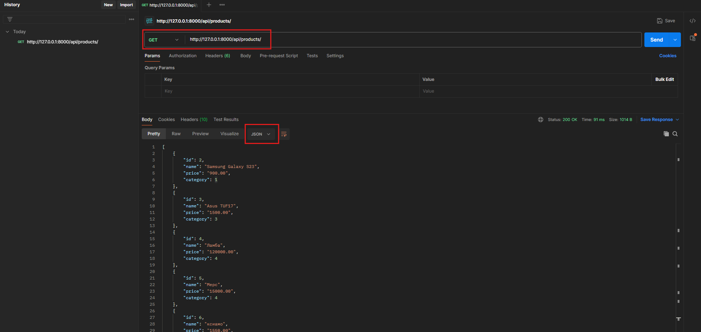
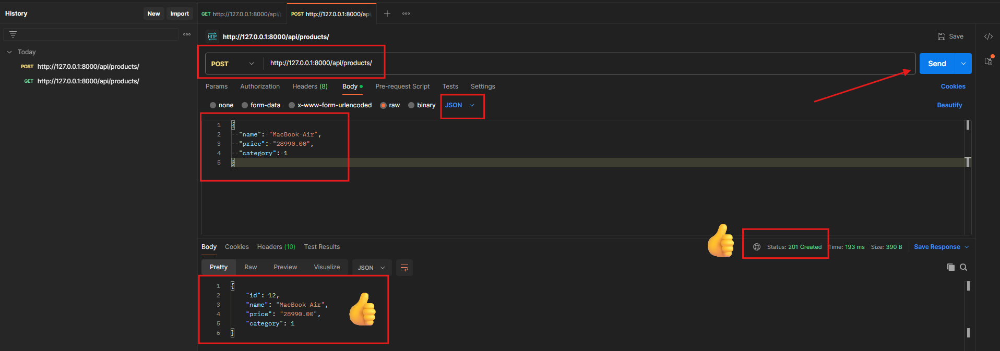
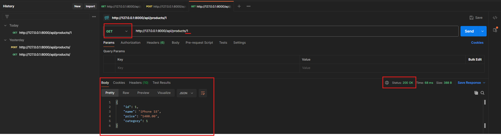
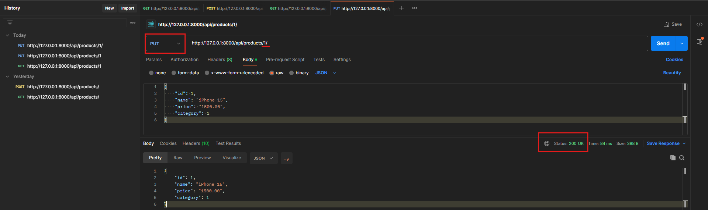
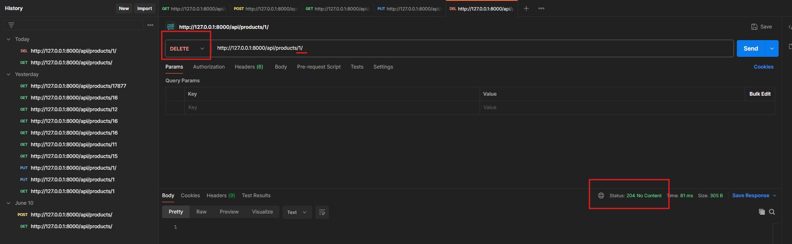

# Лекция 31: Django REST Framework. Установка.FBV.  Создание API. APIView, ViewSet, Routers.

## Введение

На предыдущем занятии мы с вами говорили о том, что такое API, зачем оно нужно и как устроен REST. Мы посмотрели на сериализаторы — научились преобразовывать модели в `JSON` и обратно, разобрались с вложенными сериализаторами и даже переопределили методы `create()` и `update()`.

Теперь пришло время перейти к следующему логическому шагу — научиться отвечать на запросы. Мы хотим, чтобы наше приложение стало полноценным сервером: принимало HTTP-запросы, обрабатывало их, сохраняло данные в базу и возвращало ответы в формате `JSON`. То есть — чтобы у нас наконец-то появился настоящий `REST API`.

Для начала мы будем использовать простой и понятный подход — представления на функциях, или `Function-Based Views (FBV)`. Этот способ чуть более *"низкоуровневый"*, но зато даёт прекрасное понимание того, что происходит в DRF *"под капотом"*.

## Что такое @api_view?

[официальная документация](https://www.django-rest-framework.org/api-guide/views/#api_view)

`@api_view` — это декоратор из Django REST Framework (DRF), который позволяет создавать API-представления на основе обычных функций. Он упрощает работу с HTTP-запросами и делает код более читаемым и понятным.

`@api_view` — это специальный декоратор, который превращает обычную функцию в Django в API-представление, способное принимать HTTP-запросы и возвращать JSON-ответы.

По сути, он заменяет привычные HTML-страницы и `render()` на что-то новое: теперь вместо шаблона мы отправляем чистые данные, чаще всего в формате `JSON`. Это удобно, если вы делаете фронтенд отдельно (на `React`, `Vue`, мобильном приложении) или просто хотите построить `API`, доступный другим сервисам.

### Пример простого API-представления

```python
from rest_framework.decorators import api_view
from rest_framework.response import Response

@api_view(['GET'])
def hello_world(request):
    return Response({'message': 'Hello, API!'})
```

Этот код делает следующее:

- принимает `GET`-запрос;
- возвращает `JSON`-ответ с полем *"message"*.

Если вы подключите эту функцию к маршруту в `urls.py`, например так:

```python
# my_app/api/urls.py
from django.urls import path
from .views import hello_world

urlpatterns = [
    path('hello/', hello_world),
]
```

а потом подключите этот файл в основной `urls.py` вашего проекта:

```python
# my_project/urls.py
from django.contrib import admin
from django.urls import path, include
urlpatterns = [
    path('admin/', admin.site.urls),
    path("", include("my_app.urls")),
    path('api/', include('my_app.api.urls')),  # Подключаем API маршруты
]
```

При переходе по адресу `http://127.0.0.1:8000/api/hello/` вы увидите:

```json
{
  "message": "Hello, API!"
}
```

### Разрешённые методы: GET, POST, PUT, DELETE...

По умолчанию `@api_view` не разрешает все методы. Вы должны явно указать, какие HTTP-методы поддерживаются этим представлением:

```python
@api_view(['GET', 'POST'])
def my_view(request):
    ...
```

Если клиент отправит `PATCH`, `PUT` или любой другой неподдерживаемый метод — он получит ошибку `405 (Method Not Allowed)`. Это важный принцип `REST` — каждый маршрут должен явно определять, какие действия он разрешает.

### Пример: `GET` и `POST` запрос в одном представлении

Представим, что у нас есть модель `Product` и соответствующий сериализатор `ProductSerializer`. Мы хотим создать представление, которое:

- при `GET` возвращает список всех товаров;
- при `POST` — принимает данные нового товара и сохраняет его в базе.

```python
@api_view(['GET', 'POST'])
def product_list(request):
    if request.method == 'GET':
        products = Product.objects.all()
        serializer = ProductSerializer(products, many=True)
        return Response(serializer.data)

    elif request.method == 'POST':
        serializer = ProductSerializer(data=request.data)
        if serializer.is_valid():
            serializer.save()
            return Response(serializer.data, status=status.HTTP_201_CREATED)
        return Response(serializer.errors, status=status.HTTP_400_BAD_REQUEST)
```

**Как это работает?**

- `request.data` — это словарь, в который `DRF` автоматически парсит `JSON`, пришедший от клиента.
- Мы передаём эти данные в сериализатор.
- Если данные валидны — сохраняем новый объект и возвращаем его в `JSON`.
- Если есть ошибки — возвращаем словарь с ошибками и `статус 400`.
- При сериализации списка объектов (например, `Product.objects.all()` или `.filter()`) обязательно указываем `many=True`, чтобы `DRF` знал, что мы передаём не один объект, а сразу несколько.

**Пример запроса в Postman**

Начнем с `GET`-запроса, чтобы получить список товаров. Откройте `Postman`:

- Метод: `GET`
- `URL: http://127.0.0.1:8000/api/products/`
- Нажмите *"Send"*.

Если всё настроено правильно, вы получите ответ со статусом `200 OK` и телом ответа примерно такого вида:



Чтобы протестировать `POST`-запрос, откройте `Postman` во второй вкладке:

- Метод: `POST`
- `URL: http://127.0.0.1:8000/api/products/`
- Вкладка `Body` → `raw` → `JSON`
- Введите, например:

```json
{
  "name": "MacBook Air",
  "price": "28990.00",
  "category": 1
}
```

Нажмите *"Send"*.

Если всё настроено правильно, вы получите ответ со статусом `201 Created` и телом ответа примерно такого вида:



Таким образом, одно представление может выполнять сразу несколько действий — в зависимости от метода запроса. Но при этом всё остаётся читаемым и управляемым: `GET` для чтения, `POST` для создания, `PUT` для обновления, `DELETE` для удаления.

### Почему мы используем Response, а не HttpResponse

Django по умолчанию использует `HttpResponse`, который возвращает строку или `HTML`. А `Response` из `DRF` — это обёртка, которая автоматически превращает словарь `Python` в `JSON`, устанавливает правильный заголовок `(Content-Type: application/json)` и позволяет легко указывать коды ответа:

```python
from rest_framework import status

return Response({'detail': 'Not found'}, status=status.HTTP_404_NOT_FOUND)
```

### Работа с одним объектом: GET, PUT, DELETE

Мы уже умеем получать список товаров и создавать новые через `GET` и `POST`. Теперь пора научиться работать с отдельным объектом по его `ID`: получать, изменять и удалять.

Это очень типичный случай в любом REST API. Например:

- вы хотите отредактировать товар — нужно сначала его получить `(GET)`, затем обновить `(PUT)`;
- вы хотите удалить товар — вызываете `DELETE`;
- вы просто хотите отобразить карточку товара на фронтенде — тоже нужен `GET`.

Все эти действия удобно реализовать в одном представлении.

#### Пример представления для работы с одним объектом

```python
@api_view(['GET', 'PUT', 'DELETE'])
def product_detail(request, pk):
    try:
        product = Product.objects.get(pk=pk)
    except Product.DoesNotExist:
        return Response({'error': 'Product not found'}, status=status.HTTP_404_NOT_FOUND)

    if request.method == 'GET':
        serializer = ProductSerializer(product)
        return Response(serializer.data)

    elif request.method == 'PUT':
        serializer = ProductSerializer(product, data=request.data)
        if serializer.is_valid():
            serializer.save()
            return Response(serializer.data)
        return Response(serializer.errors, status=status.HTTP_400_BAD_REQUEST)

    elif request.method == 'DELETE':
        product.delete()
        return Response(status=status.HTTP_204_NO_CONTENT)
```

**Как это работает:**

- Сначала мы пытаемся получить товар по переданному `id`. Если не нашли — возвращаем ` 404`.
- Если пришёл `GET`, сериализуем товар и отправляем его в ответ.
- Если `PUT`, проверяем входные данные, валидируем и сохраняем изменения.
- Если `DELETE`, просто удаляем товар и отправляем пустой ответ с кодом `204`.

**Подключим маршрут**

Теперь не забудьте добавить маршрут в `my_app/api/urls.py`:

```python
from .views import product_list, product_detail

urlpatterns = [
    path('products/', product_list),
    path('products/<int:pk>/', product_detail),
]
```

#### Пример запросов в Postman

**Получить товар:**

```http
GET http://127.0.0.1:8000/api/products/1/
```



**Обновить товар:**

```http
PUT http://127.0.0.1:8000/api/products/1/
```

> Важно в адресе указать `id` товара, который вы хотите обновить. В данном случае это `1`. После обязательно закрыть указать `/`.

В `Body → raw → JSON` введите:

```json
{
    "id": 1,
    "name": "iPhone 15",
    "price": "1500.00",
    "category": 1
}
```

> Тут я поменял цену товара на `1500.00`, но вы можете указать любое значение.

В ответ вы получите обновлённый товар:



**Удалить товар:**

```http
DELETE http://127.0.0.1:8000/api/products/1/
```



Если всё сделано правильно, вы получите пустой ответ с кодом `204 No Content`, что означает успешное удаление.

### Вывод

С помощью `@api_view` мы построили наше первое `API` вручную: написали представления на функциях, настроили маршруты, обрабатывали `GET`, `POST`, `PUT` и `DELETE` запросы. Это отличный способ разобраться в том, как работает `Django REST Framework` под капотом.

Но если вы внимательно посмотрите на написанный код, то заметите: он стал длинным, однотипным и начинает повторяться. В каждом представлении — одни и те же действия: получить объект, сериализовать, проверить `is_valid()`, вернуть ответ.

Конечно, `DRF` это предвидел. Именно поэтому фреймворк предлагает более мощные и лаконичные инструменты: `APIView`, `Generic-классы`, `ViewSet` и `routers`.

## Представления на классах: APIView

Вместо написания `API` на функциях с `@api_view`, в `Django REST Framework` можно использовать представления на классах. Это современный и более удобный способ построения логики `API`: всё организовано по методам `(get(), post(), put(), delete())`, код лучше читается и легко масштабируется.

`DRF` предоставляет для этого базовый класс [APIView](https://www.django-rest-framework.org/api-guide/viewsets/).

### Пример ProductListAPIView и ProductDetailAPIView:

Мы перепишем представление `product_list`, которое раньше было функцией, в виде класса:

```python
from rest_framework.views import APIView
from rest_framework.response import Response
from rest_framework import status
from .models import Product
from .serializers import ProductSerializer

class ProductListAPIView(APIView):
    def get(self, request):
        products = Product.objects.all()
        serializer = ProductSerializer(products, many=True)
        return Response(serializer.data)

    def post(self, request):
        serializer = ProductSerializer(data=request.data)
        if serializer.is_valid():
            serializer.save()
            return Response(serializer.data, status=status.HTTP_201_CREATED)
        return Response(serializer.errors, status=status.HTTP_400_BAD_REQUEST)
```

Точно так же перепишем `product_detail`:

```python
class ProductDetailAPIView(APIView):
    def get_object(self, pk):
        try:
            return Product.objects.get(pk=pk)
        except Product.DoesNotExist:
            return None

    def get(self, request, pk):
        product = self.get_object(pk)
        if not product:
            return Response({'error': 'Not found'}, status=status.HTTP_404_NOT_FOUND)
        serializer = ProductSerializer(product)
        return Response(serializer.data)

    def put(self, request, pk):
        product = self.get_object(pk)
        if not product:
            return Response({'error': 'Not found'}, status=status.HTTP_404_NOT_FOUND)
        serializer = ProductSerializer(product, data=request.data)
        if serializer.is_valid():
            serializer.save()
            return Response(serializer.data)
        return Response(serializer.errors, status=status.HTTP_400_BAD_REQUEST)

    def delete(self, request, pk):
        product = self.get_object(pk)
        if not product:
            return Response({'error': 'Not found'}, status=status.HTTP_404_NOT_FOUND)
        product.delete()
        return Response(status=status.HTTP_204_NO_CONTENT)
```

После лбновим маршруты в `my_app/api/urls.py`:

```python
from .views import ProductListAPIView, ProductDetailAPIView

urlpatterns = [
    path('products/', ProductListAPIView.as_view()),
    path('products/<int:pk>/', ProductDetailAPIView.as_view()),
]
```

Теперь вы можете использовать эти классы в `Postman` так же, как и раньше. Все методы работают аналогично: `GET`, `POST`, `PUT`, `DELETE`.

### Почему APIView — это удобно?

- Структура представления становится чище: для каждого метода свой отдельный блок.
- Всё упорядочено и легко читается.
- Мы можем использовать вспомогательные методы внутри класса (`get_object`, `check_permissions`, и др.).
- Это хороший базис для перехода к следующим уровням: `GenericAPIView`, `миксины` и `ViewSet`.

## GenericAPIView и миксины: ещё проще, ещё компактнее

Классы `APIView`, которые мы только что использовали, — это мощный инструмент. Но даже в них мы дублировали код: вручную получали объект, сериализовали, писали одинаковые конструкции `serializer = Serializer(...)`, `serializer.save()` и т.д.

Django REST Framework даёт ещё один уровень удобства — это `GenericAPIView`. По сути, это расширение обычного `APIView`, в котором уже реализованы все базовые инструменты работы с данными: получение queryset, объекта, сериализатора, фильтрация, пагинация. Всё, что мы писали вручную — уже есть в базовом функционале.

Но важно понимать: `GenericAPIView` сама по себе не делает ничего. Она только предоставляет базу — инфраструктуру. Чтобы она начала возвращать данные, создавать, обновлять или удалять записи, нужно добавить миксины.

### Основные атрибуты GenericAPIView

Когда вы создаёте класс на основе `GenericAPIView`, вы можете (и должны) указать ключевые атрибуты:

- `queryset` — то, с какими объектами мы будем работать;
- `serializer_class` — какой сериализатор будет использоваться для обработки данных;
- `lookup_field` — по какому полю мы ищем объект (по умолчанию `'pk'`);
- `lookup_url_kwarg` — какое имя параметра используется в `URL` (по умолчанию такое же, как `lookup_field`);
- `filter_backends` — список классов, которые обрабатывают фильтрацию;
- `pagination_class` — класс пагинации, если она нужна.

Эти поля можно переопределять вручную или вычислять через методы.

### Основные методы GenericAPIView

Вот что уже умеет этот базовый класс:

- `get_queryset()` — возвращает основной `queryset`. Можно переопределить, чтобы фильтровать данные;
- `get_object()` — возвращает один объект модели по `pk`;
- `get_serializer()` — возвращает объект сериализатора;
- `get_serializer_class()` — возвращает класс сериализатора;
- `get_serializer_context()` — контекст, передаваемый сериализатору (например, request);
- `filter_queryset()` — фильтрация по `filter_backends`;
- `paginate_queryset()` и `get_paginated_response()` — пагинация результата (если включена);
- `paginator` — объект класса пагинатора.

### Миксины — действия для API

Миксины в `Django REST Framework` — это вспомогательные классы, которые реализуют один конкретный тип действия над объектами: получить список, создать объект, получить один, обновить или удалить.

Важно понимать: миксины сами по себе не работают. Они становятся полезными только когда используются вместе с `GenericAPIView`, который предоставляет им инфраструктуру: `get_queryset()`, `get_object()`, `get_serializer()` и т.д.

Каждый миксин реализует метод, который вы потом можете вызвать в `get()`, `post()`, `put()` и других методах представления.

Вот основные миксины, которые предоставляет `DRF`:

- `ListModelMixin` — для получения списка объектов;
- `CreateModelMixin` — для создания нового объекта;
- `RetrieveModelMixin` — для получения одного объекта по `pk`;
- `UpdateModelMixin` — для обновления объекта;
- `DestroyModelMixin` — для удаления объекта.

### ListModelMixin — для списка объектов

Этот миксин добавляет поведение, которое позволяет вернуть список объектов из базы данных. Он реализует метод `list()`, который:

- получает queryset через `get_queryset()`;
- при необходимости применяет фильтрацию и пагинацию;
- сериализует список объектов `(many=True)`;
- возвращает результат в виде `Response`.

Используется, когда нужно реализовать `GET`-запрос на коллекцию ресурсов, например: `/api/products/`, `/api/users/`.

```python
class ListModelMixin:
    def list(self, request, *args, **kwargs):
        queryset = self.get_queryset()
        page = self.paginate_queryset(queryset)
        if page is not None:
            serializer = self.get_serializer(page, many=True)
            return self.get_paginated_response(serializer.data)

        serializer = self.get_serializer(queryset, many=True)
        return Response(serializer.data)
```

Метод `list()` чаще всего используется внутри `get()`, как `return self.list(request)`. Он будет полезен, например, в `ListAPIView` или `ListCreateAPIView`.

### CreateModelMixin — создать объект

Этот миксин реализует метод `create()`, который:

- Принимает данные из `request.data`;
- Создаёт объект сериализатора;
- Проверяет валидность данных `(is_valid(raise_exception=True))`;
- Вызывает `perform_create(serializer)` — по умолчанию просто `serializer.save()`;
- Возвращает Response со статусом `201 Created`.

```python
class CreateModelMixin:
    def create(self, request, *args, **kwargs):
        serializer = self.get_serializer(data=request.data)
        serializer.is_valid(raise_exception=True)
        self.perform_create(serializer)
        headers = self.get_success_headers(serializer.data)
        return Response(serializer.data, status=status.HTTP_201_CREATED, headers=headers)

    def perform_create(self, serializer):
        serializer.save()
```

Вы можете переопределить `perform_create()`, если нужно, например, добавить текущего пользователя:

```python
def perform_create(self, serializer):
    serializer.save(owner=self.request.user)
```

Этот миксин используется в `CreateAPIView` или `ListCreateAPIView`, когда нужно реализовать `POST`-запрос для создания нового объекта, например: `/api/products/`.

### RetrieveModelMixin — получить один объект

Этот миксин реализует метод `retrieve()`, который:

- Получает объект из базы с помощью `get_object()`;
- Сериализует его;
- Возвращает как Response.

```python
class RetrieveModelMixin:
    def retrieve(self, request, *args, **kwargs):
        instance = self.get_object()
        serializer = self.get_serializer(instance)
        return Response(serializer.data)
```

Используется, например, в `RetrieveAPIView` или `RetrieveUpdateDestroyAPIView`.

### UpdateModelMixin — обновить объект

Этот миксин позволяет реализовать как `PUT`, так и `PATCH`. Внутри него есть:

- Метод `update()` — выполняет полное обновление;
- Метод `partial_update()` — для частичного обновления `(PATCH)`.

```python
class UpdateModelMixin:
    def update(self, request, *args, **kwargs):
        partial = kwargs.pop('partial', False)
        instance = self.get_object()
        serializer = self.get_serializer(instance, data=request.data, partial=partial)
        serializer.is_valid(raise_exception=True)
        self.perform_update(serializer)
        return Response(serializer.data)

    def partial_update(self, request, *args, **kwargs):
        kwargs['partial'] = True
        return self.update(request, *args, **kwargs)

    def perform_update(self, serializer):
        serializer.save()
```

`DRF` по умолчанию разделяет `PUT` (полная замена) и `PATCH` (обновление только переданных полей).

Этот миксин используется в `UpdateAPIView`, `RetrieveUpdateAPIView` и `RetrieveUpdateDestroyAPIView`.

### DestroyModelMixin — удалить объект

Этот миксин реализует метод `destroy()`, который:

- Получает объект с помощью `get_object()`;
- Удаляет его через `perform_destroy()`;
- Возвращает пустой `Response` со статусом `204 No Content`.

```python
class DestroyModelMixin:
    def destroy(self, request, *args, **kwargs):
        instance = self.get_object()
        self.perform_destroy(instance)
        return Response(status=status.HTTP_204_NO_CONTENT)

    def perform_destroy(self, instance):
        instance.delete()
```

Этот миксин используется в `DestroyAPIView` и `RetrieveDestroyAPIView`, когда нужно реализовать `DELETE`-запрос для удаления объекта, например: `/api/products/1/`.

**Важный момент**

Ни один из миксинов не содержит методов `get()`, `post()`, `put()` и т.д.Они только реализуют логику (`list()`, `create()`, `update()` и др.).A уже вы, в представлении, решаете: что вызывать при каком HTTP-методе.

### Что такое GenericAPIView

Мы уже говорили, что `APIView` — это просто базовый класс, который позволяет обрабатывать `HTTP`-запросы (`GET`, `POST`, `PUT` и т.д.) вручную.
Это удобно, но каждый раз приходится писать много повторяющегося кода: получать данные из базы, сериализовать, проверять, сохранять... Вот тут на помощь приходит `GenericAPIView`.

`GenericAPIView` — это как умный помощник, который:

- умеет сам найти нужный объект по `pk`;
- сам берёт `queryset` из базы данных;
- сам создаёт сериализатор;
- и даже умеет применять пагинацию и фильтры, если надо.

Он ничего сам не делает — но обеспечивает всю **"базу"**, чтобы миксины могли спокойно работать.

#### Что внутри GenericAPIView?

Когда вы используете `GenericAPIView`, вы обычно задаёте два ключевых свойства:

```python
queryset = Product.objects.all()
serializer_class = ProductSerializer
```

Это говорит `GenericAPIView`, с какими данными он будет работать и как их сериализовать.
А дальше можно спокойно пользоваться его методами:

- `get_queryset()` — вернёт ваш queryset (можно переопределить, чтобы фильтровать).
- `get_object()` — вернёт один объект из базы (например, по pk).
- `get_serializer()` — создаёт сериализатор.
- `get_serializer_class()` — возвращает используемый сериализатор (можно менять по ситуации).
- `paginate_queryset()` и `get_paginated_response()` — нужны для разбивки на страницы (если используете пагинацию).

#### Почему GenericAPIView такой важный?

Потому что он работает в паре с миксинами. Он сам по себе ничего не умеет (не возвращает данные, не создаёт объекты) — но когда вы добавляете к нему миксины (`ListModelMixin`, `CreateModelMixin` и т.д.), вместе они становятся полноценным API:

```python
class ProductListView(ListModelMixin, GenericAPIView):
    queryset = Product.objects.all()
    serializer_class = ProductSerializer

    def get(self, request):
        return self.list(request)  # метод из миксина
```

Тут `ProductListView` — это класс, который умеет возвращать список продуктов. Он использует `GenericAPIView` для базовой логики и `ListModelMixin`, чтобы реализовать метод `list()`.

### Пример: ProductListView и ProductDetailView

Теперь давайте перепишем наши представления с использованием `GenericAPIView` и миксинов.

```python
from rest_framework.generics import GenericAPIView
from rest_framework.mixins import ListModelMixin, CreateModelMixin, RetrieveModelMixin, UpdateModelMixin, DestroyModelMixin
from .models import Product
from .serializers import ProductSerializer

class ProductListView(ListModelMixin, CreateModelMixin, GenericAPIView):
    queryset = Product.objects.all()
    serializer_class = ProductSerializer

    def get(self, request, *args, **kwargs):
        return self.list(request, *args, **kwargs)

    def post(self, request, *args, **kwargs):
        return self.create(request, *args, **kwargs)

class ProductDetailView(RetrieveModelMixin, UpdateModelMixin, DestroyModelMixin, GenericAPIView):
    queryset = Product.objects.all()
    serializer_class = ProductSerializer

    def get(self, request, *args, **kwargs):
        return self.retrieve(request, *args, **kwargs)

    def put(self, request, *args, **kwargs):
        return self.update(request, *args, **kwargs)

    def delete(self, request, *args, **kwargs):
        return self.destroy(request, *args, **kwargs)
```

Теперь у нас есть два класса:

- `ProductListView` — для получения списка продуктов и создания новых;
- `ProductDetailView` — для получения, обновления и удаления конкретного продукта.

Осталось только подключить их в `urls.py`:

```python
from django.urls import path
from .views import ProductListView, ProductDetailView

urlpatterns = [
    path("products/", ProductListView.as_view(), name="product-list"),
    path("products/<int:pk>/", ProductDetailView.as_view(), name="product-detail")
]
```

Теперь вы можете использовать эти представления в `Postman` так же, как и раньше. Все методы работают аналогично: `GET`, `POST`, `PUT`, `DELETE`.

### Почему GenericAPIView и миксины лучше, чем просто APIView?

Использование `GenericAPIView` и миксинов в Django REST Framework (DRF) имеет несколько ключевых преимуществ по сравнению с использованием только `APIView`:

- **Меньше повторений**: вам не нужно каждый раз писать код для получения объекта, сериализации и т.д. Всё уже реализовано в `GenericAPIView` и миксинах.
- **Чистота кода**: код становится компактнее и легче читается. Вы сразу видите, что делает каждый метод.
- **Гибкость**: вы можете легко переопределять методы, добавлять свою логику, использовать разные сериализаторы и фильтры.
- **Расширяемость**: если нужно добавить новую функциональность, вы просто добавляете новый миксин или переопределяете метод.

## ViewSet и Router — ещё проще, ещё короче

Если вы уже разобрались с `APIView` и `GenericAPIView`, то наверняка заметили: несмотря на удобство, всё равно приходится повторять одну и ту же структуру. Мы пишем `get()` → `вызываем list()`, пишем `post()` → `вызываем create()` и так далее.

`Django REST Framework` предлагает ещё более краткий и выразительный способ построения `API` — через `ViewSet`.

### Что такое ViewSet?

`ViewSet` — это специальный класс в `DRF`, который объединяет логику работы с несколькими методами в одном месте. Вместо того, чтобы писать отдельные методы для каждого действия (`get()`, `post()`, `put()`, `delete()`), вы определяете методы внутри класса, и `DRF` сам определяет, какой метод вызывать в зависимости от HTTP-метода запроса. Официальная документация: [ViewSets](https://www.django-rest-framework.org/api-guide/viewsets/).

Он не привязан к конкретным HTTP-методам (`GET`, `POST`, `PUT`, `DELETE`). Вместо этого он использует *"действия"*:

- `list` — показать список;
- `retrieve` — получить один объект;
- `create` — создать объект;
- `update` — полное обновление;
- `partial_update` — частичное обновление;
- `destroy` — удалить.

Всё, что раньше мы писали вручную через `get()` и `post()`, теперь делается через эти действия. `DRF` сам поймёт, какой метод `HTTP` соответствует какому действию.

### Пример простого ViewSet

```python
from rest_framework import viewsets
from .models import Product
from .serializers import ProductSerializer
from rest_framework.response import Response
from rest_framework import status

class ProductViewSet(viewsets.ViewSet):

    # Получить список всех продуктов
    def list(self, request):
        products = Product.objects.all()
        serializer = ProductSerializer(products, many=True)
        return Response(serializer.data)

    # Получить один продукт по id
    def retrieve(self, request, pk=None):
        try:
            product = Product.objects.get(pk=pk)
        except Product.DoesNotExist:
            return Response({'error': 'Product not found'}, status=status.HTTP_404_NOT_FOUND)

        serializer = ProductSerializer(product)
        return Response(serializer.data)

    # Создать новый продукт
    def create(self, request):
        serializer = ProductSerializer(data=request.data)
        if serializer.is_valid():
            serializer.save()
            return Response(serializer.data, status=status.HTTP_201_CREATED)
        return Response(serializer.errors, status=status.HTTP_400_BAD_REQUEST)
    
    def update(self, request, pk=None):
        try:
            product = Product.objects.get(pk=pk)
        except Product.DoesNotExist:
            return Response({'error': 'Product not found'}, status=status.HTTP_404_NOT_FOUND)

        serializer = ProductSerializer(product, data=request.data)
        if serializer.is_valid():
            serializer.save()
            return Response(serializer.data)
        return Response(serializer.errors, status=status.HTTP_400_BAD_REQUEST)
    
    def destroy(self, request, pk=None):
        try:
            product = Product.objects.get(pk=pk)
        except Product.DoesNotExist:
            return Response({'error': 'Product not found'}, status=status.HTTP_404_NOT_FOUND)
        product.delete()
        return Response(status=status.HTTP_204_NO_CONTENT)
```
Здесь ViewSet — это просто контейнер для логики `CRUD`, но всё делается вручную: мы сами вызываем модель, сериализатор, проверяем `is_valid()`, обрабатываем ошибки.

Этот код — это уже полноценное `API`, которое поддерживает:

- `GET /products/` — получить список;
- `GET /products/1/` — получить один;
- `POST /products/` — создать;
- `PUT /products/1/` — заменить;
- `PATCH /products/1/` — обновить частично;
- `DELETE /products/1/` — удалить.


### Но как настроить маршруты?

`ViewSet` не работает с обычными `path()`. Вместо этого используется `Router` — специальный класс, который автоматически создаёт все нужные маршруты. ОФициальная документация: [Routers](https://www.django-rest-framework.org/api-guide/routers/).
`Router` сам определяет, какие маршруты нужны для вашего `ViewSet`, и создаёт их на основе действий. Вам не нужно вручную прописывать каждый маршрут.

Пример:

```python
from django.urls import path, include
from rest_framework.routers import DefaultRouter
from .views import ProductViewSet

router = DefaultRouter()
router.register(r'products', ProductViewSet, basename='product')

urlpatterns = [
    path('', include(router.urls)),
]
```

В методе `register()` мы указываем:

- `r'products'` — базовый путь для всех операций с продуктами;
- `ProductViewSet` — класс, который мы создали;
- `basename='product'` — имя для маршрутов, чтобы DRF мог правильно генерировать URL.

Теперь `DRF` сам создаст маршруты для всех операций с продуктами:

- `GET /products/` — список продуктов;
- `POST /products/` — создание нового продукта;
- `GET /products/{id}/` — получение продукта по `id`;
- `PUT /products/{id}/` — обновление продукта по `id`;
- `PATCH /products/{id}/` — частичное обновление продукта по `id`;
- `DELETE /products/{id}/` — удаление продукта по `id`.

Теперь всё: `DRF` сам создаст маршруты для всех операций с продуктами.

Но такой подход всё ещё требует много повторяющегося кода. И когда у вас много моделей — это становится утомительно. Поэтому `DRF` предлагает ещё более простой способ — использовать `ModelViewSet`.

### ModelViewSet — автоматизация CRUD

`ModelViewSet` — объединяет в себе всё то, что мы только что писали вручную: он сам умеет работать с моделью и сериализатором, реализует все `CRUD`-действия и использует готовые миксины под капотом.

**Пример использования `ModelViewSet`:**

```python
from rest_framework import viewsets
from .models import Product
from .serializers import ProductSerializer

class ProductViewSet(viewsets.ModelViewSet):
    queryset = Product.objects.all()
    serializer_class = ProductSerializer
```
Теперь один этот класс выполняет всё то же самое, что мы делали вручную:

- `GET /products/ `— получить список;
- `GET /products/{id}/` — получить один объект;
- `POST /products/` — создать новый;
- `PUT /products/{id}/` — заменить полностью;
- `PATCH /products/{id}/` — частично обновить;
- `DELETE /products/{id}/` — удалить.

Таким образом, `ViewSet` — это базовый механизм для объединения логики `CRUD`, а `ModelViewSet` — его расширение, которое автоматизирует всё взаимодействие с моделью и сериализатором.

## Пагинация в Django REST Framework

Когда у нас становится много данных (например, сотни или тысячи продуктов), возвращать их все сразу — плохая идея. Это замедляет отклик сервера, перегружает клиента и делает взаимодействие неудобным. В таких случаях используют пагинацию — разбивку на страницы.

### Что такое пагинация?

`Пагинация` (от англ. `pagination`) — это способ деления большого списка на части (страницы), чтобы показывать только ограниченное количество элементов за раз. Официальная документация: [Pagination](https://www.django-rest-framework.org/api-guide/pagination/).
Например, если у вас есть 100 продуктов, вы можете показывать по 10 на странице. Тогда будет 10 страниц:

Например:

- `GET /products/?page=1` — первая страница;
- `GET /products/?page=2` — вторая страница и т.д.

### Виды пагинации в DRF

`Django REST Framework` поддерживает несколько встроенных типов пагинации:

| Класс                | Описание                                                                                                          |
| ------------------------- | ------------------------------------------------------------------------------------------------------------------------- |
| `PageNumberPagination`  | Классическая пагинация по страницам:`?page=1`, `?page=2` и т.д.                    |
| `LimitOffsetPagination` | Пагинация по лимиту и смещению:`?limit=10&offset=20`.                                         |
| `CursorPagination`      | Быстрая пагинация по курсору (использует `id` или временную метку). |

Для начала чаще всего используют `PageNumberPagination` — она самая простая и привычная.

### Как включить пагинацию в DRF

Чтобы добавить пагинацию, нужно указать её класс и параметры в `settings.py` проекта:

```python
# settings.py
REST_FRAMEWORK = {
    'DEFAULT_PAGINATION_CLASS': 'rest_framework.pagination.PageNumberPagination',
    'PAGE_SIZE': 5,  # количество объектов на одной странице
}
```

Теперь, если представление возвращает много объектов (например, через `list()`), DRF сам разобьёт их на страницы.

**Как выглядит ответ?**

Пример ответа с пагинацией:

```json
{
    "count": 11,
    "next": "http://127.0.0.1:8000/api/products/?page=2",
    "previous": null,
    "results": [
        {
            "id": 4,
            "name": "Ламба",
            "price": "120000.00",
            "category": 4
        },
        {
            "id": 5,
            "name": "Мерс",
            "price": "15000.00",
            "category": 4
        },
        {
            "id": 6,
            "name": "ксиаоми",
            "price": "1550.00",
            "category": 1
        },
        {
            "id": 7,
            "name": "Samsung Galaxy S24 +",
            "price": "2000.00",
            "category": 1
        },
        {
            "id": 8,
            "name": "Iphone 15 Pro Max",
            "price": "1800.00",
            "category": 1
        }
    ]
}
```

- `count` — общее количество объектов;
- `next` — ссылка на следующую страницу;
- `previous` — ссылка на предыдущую;
- `results` — список объектов на текущей странице.

### Кастомизация пагинации

Вы можете создать свой класс пагинации, если хотите изменить формат ответа, например:

```python
from rest_framework.pagination import PageNumberPagination

class MyPagination(PageNumberPagination):
    page_size = 10
    page_query_param = 'p'  # вместо ?page=
    max_page_size = 100
```

И указать его в `views.py`:

```python
class ProductViewSet(viewsets.ModelViewSet):
    queryset = Product.objects.all()
    serializer_class = ProductSerializer
    pagination_class = MyPagination
```

Или глобально в `settings.py`:

```python
REST_FRAMEWORK = {
    'DEFAULT_PAGINATION_CLASS': 'my_app.pagination.MyPagination',
    'PAGE_SIZE': 10
}
```

Теперь при запросе к `/products/` будет использоваться ваша кастомная пагинация.

### Дополнительные действия с @action

Когда мы используем `ViewSet`, он автоматически реализует стандартные действия:

- `list` — список объектов;
- `retrieve` — получить один объект;
- `create` — создать;
- `update` — заменить;
- `partial_update` — частично обновить;
- `destroy` — удалить.

Но что делать, если нужно добавить своё уникальное поведение? Например:

- отметить продукт как "избранный",
- получить список товаров конкретного пользователя,
- запустить фоновую обработку?

Для этого и существует декоратор `@action` из `rest_framework.decorators`. Он позволяет создать дополнительный маршрут внутри `ViewSet`, который будет:

- принимать HTTP-запросы;
- выполнять вашу логику;
- возвращать Response.

Официальная документация: [Custom actions](https://www.django-rest-framework.org/api-guide/viewsets/#custom-actions).

**Синтаксис**

```python
from rest_framework.decorators import action

@action(methods=['get'], detail=True)
def custom_method(self, request, pk=None):
    ...
```

Параметры:

- `methods` — список разрешённых HTTP-методов (чаще всего 'get', 'post');
- `detail=True` — означает, что маршрут применяется к одному объекту (/products/1/custom/);
- `detail=False` — применяется ко всей коллекции (/products/custom/).

### Пример 1: @action(detail=True) — одно действие с объектом

Допустим, у нас есть товары, и мы хотим добавить действие `mark_as_featured`, которое делает товар избранным.

```python
from rest_framework.decorators import action
from rest_framework.response import Response
from rest_framework import viewsets, status
from .models import Product
from .serializers import ProductSerializer

class ProductViewSet(viewsets.ModelViewSet):
    queryset = Product.objects.all()
    serializer_class = ProductSerializer

    @action(detail=True, methods=['post'])
    def mark_as_featured(self, request, pk=None):
        product = self.get_object()
        product.featured = True
        product.save()
        return Response({'status': 'marked as featured'})
```

Теперь доступен новый маршрут:

```bash
POST /products/1/mark_as_featured/
```

### Пример 2: @action(detail=False) — действие для всей коллекции

А теперь добавим действие, которое вернёт только избранные товары:

```python
@action(detail=False, methods=['get'])
def featured(self, request):
    featured_products = Product.objects.filter(featured=True)
    serializer = self.get_serializer(featured_products, many=True)
    return Response(serializer.data)
```

Теперь доступен маршрут:

```bash
GET /products/featured/
```

### Как подключаются маршруты?

Если вы используете `DefaultRouter`, то все действия, созданные с помощью @action, автоматически будут добавлены к маршрутам. Ничего дополнительно прописывать в urls.py не нужно.

### Вывод

Декоратор `@action `— это удобный способ добавлять к `ViewSet` собственные действия:

- не нужно создавать отдельные классы;
- можно использовать все возможности DRF внутри метода;
- работает *"из коробки"* с Router.

С его помощью API становится не только `RESTful`, но и гибким: вы можете добавить любое поведение в нужное место.