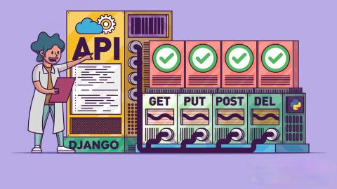
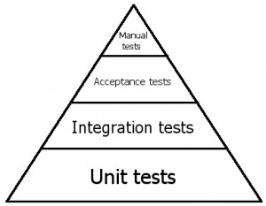

# Лекция 33: Тестирование Django, API в Django REST Framework



## Что такое тестирование и какие виды тестов бывают

Прежде чем мы перейдём к коду, давайте вспомним, что вообще такое тестирование и какие бывают его уровни.

В программировании тесты можно условно разделить по глубине проверки:
от самых маленьких (отдельная функция) до самых больших (всё приложение целиком).

Это удобно представить в виде пирамиды:



### 1. Unit-тесты (юнит-тесты) — основание пирамиды

Это самые базовые тесты, которых должно быть больше всего. Они проверяют отдельные функции и методы в изоляции — без базы данных, без сервера, без внешних зависимостей.

Пример:
 - тестируем функцию расчёта скидки;
 - проверяем поведение метода `.is_valid()` в сериализаторе.

Они пишутся быстро, запускаются мгновенно и позволяют локализовать ошибку.

### 2. Интеграционные тесты

Юнит-тест проверяет один кусок, а интеграционный — как эти куски работают вместе. Здесь мы уже можем подключить базу, модель, сериализатор, вью — и проверить, что в связке они ведут себя корректно.

Пример:
 - создать продукт, проверить, что он сохраняется в `БД`;
 - протестировать `APIView`, который использует несколько слоёв логики.

### 3. Приемочные тесты (acceptance tests)

Такие тесты имитируют работу настоящего пользователя. Они проверяют готовность системы в целом — например, "пользователь может зарегистрироваться, залогиниться, добавить товар в корзину и оформить заказ".

Обычно такие тесты пишутся на уровне `API` или через инструменты типа `Selenium`.

### 4. Ручное тестирование (manual tests)

Всё, что вы делаете руками — открыть страницу, нажать кнопку, посмотреть ответ — это ручное тестирование. Оно важно, но его должно быть минимум, потому что оно:

 - не повторяется автоматически,
 - не запускается на `CI`,
 - требует времени и внимания.

### Зачем понимать уровни

Когда мы будем писать тесты в Django, мы в основном будем работать на уровне:
 - юнит-тестов — например, сериализаторы, utils;
 - интеграционных тестов — запросы к API через APIClient.

Чем выше в пирамиде — тем сложнее и медленнее тест, тем реже он должен встречаться. Но тем больше уверенности он даёт.

## Как писать тесты в Django

На прошлых занятиях мы уже писали тесты — использовали `unittest.TestCase`, `django.test.TestCase`, методы `setUp()` и `tearDown()`, писали функции с префиксом `test_`, и проверяли поведение моделей, сериализаторов и утилит.

Вы помните, что:
 - Тесты — это обычные классы, начинающиеся с `Test` и наследующиеся от `TestCase`;
 - Перед каждым тестом можно подготовить данные в `setUp()` — например, создать объекты в базе;
 - Каждый тест — это отдельный метод `test_`...;
 - Для проверки используются `assertEqual`, `assertTrue`, `assertContains`, `assertRaises` и т.д.;
 - Django автоматически создаёт тестовую базу, запускает тест, откатывает изменения и переходит к следующему.

Теперь мы пойдём дальше — начнём писать интеграционные тесты для `REST API`. И вместо обычного `self.client`, который мы использовали для `view` и `url`, мы будем использовать `APIClient`, который позволяет работать с `endpoint'ами API` напрямую: отправлять `POST`, `GET`, `PUT`, `DELETE`, передавать токены и проверять ответы.

## Где хранить тесты и как работает тестовая база данных
Когда мы запускаем тесты в Django, он автоматически создаёт отдельную тестовую базу данных. Это нужно для того, чтобы тесты не мешали основной базе и не оставляли после себя мусор.
После каждого теста база откатывается к исходному состоянию, так что все изменения, сделанные в тестах, не сохраняются.

### Где писать тесты в структуре проекта

Сейчас у вас есть приложение `my_app`, и внутри него — отдельная папка `api/`, в которой находятся `views.py`, `serializers.p`y и остальная логика `API`.

Если вы планируете активно тестировать `API`, `permissions`, фильтрацию, авторизацию и т.д. — лучше не хранить всё в одном `tests.py`, а создать полноценную папку `tests/`.

### Как это оформить
Рекомендуемая структура для тестов в твоём случае будет выглядеть так:

```markdown
my_app/
├── api/
│   ├── views.py
│   ├── serializers.py
│   ├── urls.py
│   └── ...
├── tests/
│   ├── __init__.py
│   ├── test_api_crud.py
│   ├── test_permissions.py
│   ├── test_auth.py
│   └── test_filters.py
├── models.py
├── views.py
├── tests.py         ← можно удалить или оставить заглушку
└── ...
```

Теперь каждый тестовый файл отвечает за свой аспект:
 - `test_api_crud.py` — проверяет создание, обновление, удаление объектов;
 - `test_permissions.py` — кто и к чему имеет доступ;
 - `test_auth.py` — токены, логин, доступ;
 - `test_filters.py` — фильтрация, поиск, сортировка.

Если в проекте остался `tests.py`, и вы не используете его — его можно удалить, либо оставить как заглушку.

### Как Django находит тесты

Django автоматически обходит все приложения и находит:
файлы, имена которых начинаются с `test_`;
классы, наследуемые от `TestCase`, `APITestCase`, `SimpleTestCase` и т.д.;
методы, начинающиеся с `test_`.

Никакой дополнительной настройки не требуется — достаточно запустить:

```bash
# Запустить все тесты проекта
python manage.py test

# Запустить только тесты приложения my_app
python manage.py test my_app

# Запустить определённый файл
python manage.py test my_app.tests.test_api_crud

# Запустить конкретный метод
python manage.py test my_app.tests.test_api_crud.ProductAPITestCase.test_create_product
```

### Как работает тестовая база данных

`Django` никогда не запускает тесты в вашей реальной (разработческой или продакшн) базе данных. Вместо этого он выполняет следующие шаги:
 - Создаёт временную базу данных на основе настроек `DATABASES`.
 - Применяет к ней все миграции.
 - Выполняет тесты: всё, что создаётся в ходе выполнения `.objects.create()` или `setUp()`, сохраняется только в эту базу.
 - После завершения всех тестов — временная база удаляется.

### Зачем это нужно
 - Вы не рискуете повредить реальные данные;
 - Все тесты изолированы друг от друга и запускаются *"с нуля"*;
 - Можно повторять запуск тестов сколько угодно раз, без побочных эффектов.

### Нужно ли отдельно настраивать тестовую БД?
Нет. `Django` создаёт её автоматически. Если вы используете `SQLite` — всё произойдёт без вашего участия. Если используется `PostgreSQL` или другая система, где требуется логин/пароль, `Django` может запросить права доступа или создать тестовую базу с префиксом `test_`.

## Тестирование методов CBV: get_context_data, dispatch и другие

Когда мы используем `CBV (Class-Based Views)` в Django, мы часто расширяем или переопределяем методы представлений, такие как `get_context_data`, `dispatch`, `get_queryset`, `form_valid` и другие.

Важно не только проверять ответ на `URL` через `self.client`, но и уметь протестировать конкретную бизнес-логику этих методов в изоляции. Для этого лучше всего использовать `RequestFactory`, который позволяет вызывать методы напрямую, минуя `URL-маршруты` и `middleware`.

**Пример: тест метода `get_context_data()`**

Предположим, у нас есть класс-представление, который добавляет дополнительную переменную в контекст.

```python
# views.py
from django.views.generic import TemplateView

class HomeView(TemplateView):
    template_name = "home.html"

    def get_context_data(self, **kwargs):
        context = super().get_context_data(**kwargs)
        context["environment"] = "Production"
        return context
```

Теперь напишем тест, который проверит, что эта переменная действительно попадает в контекст:

```python
# tests/test_cbv.py
from django.test import RequestFactory, TestCase
from my_app.views import HomeView

class HomeViewTestCase(TestCase):
    def setUp(self):
        self.factory = RequestFactory()

    def test_environment_in_context(self):
        request = self.factory.get("/")
        view = HomeView()
        view.setup(request)  # обязательный вызов в CBV
        context = view.get_context_data()
        self.assertIn("environment", context)
        self.assertEqual(context["environment"], "Production")
```

Здесь мы не делаем реальный запрос в Django-сервер — мы вручную создаём представление и вызываем нужный метод напрямую.

**Пример: тест метода `dispatch()`**

Метод `dispatch()` управляет маршрутизацией запроса к нужному методу (`get()`, `post()`, и т.д.) в зависимости от `HTTP-метода`. Его можно переопределить, например, для добавления логики проверки прав или логирования.

```python
# views.py
from django.views import View
from django.http import HttpResponseForbidden, HttpResponse

class MyView(View):
    def dispatch(self, request, *args, **kwargs):
        if not request.user.is_authenticated:
            return HttpResponseForbidden("Нет доступа")
        return super().dispatch(request, *args, **kwargs)

    def get(self, request, *args, **kwargs):
        return HttpResponse("Успешно")
```

**Тестируем:**

```python
from django.contrib.auth.models import AnonymousUser, User
from my_app.views import MyView

class MyViewDispatchTest(TestCase):
    def setUp(self):
        self.factory = RequestFactory()
        self.user = User.objects.create_user(username="test", password="123")

    def test_dispatch_with_anonymous_user(self):
        request = self.factory.get("/some-url/")
        request.user = AnonymousUser()

        response = MyView.as_view()(request)
        self.assertEqual(response.status_code, 403)

    def test_dispatch_with_authenticated_user(self):
        request = self.factory.get("/some-url/")
        request.user = self.user

        response = MyView.as_view()(request)
        self.assertEqual(response.status_code, 200)
        self.assertContains(response, "Успешно")
```

**Общие рекомендации**
 - Если вы тестируете отдельные методы `CBV`, не используйте `self.client`. Вместо этого — `RequestFactory` и ручной вызов `view.setup(request)`.
 - Всегда подставляйте `request.user`, если в представлении есть логика, зависящая от пользователя.
 - Если вы хотите протестировать `form_valid`, `form_invalid`, `get_queryset` — действуйте аналогично: создайте запрос, вызовите `setup()`, затем нужный метод.

## APIClient и интеграционные тесты в Django REST Framework

Когда мы работаем с обычными Django-приложениями, мы используем `self.client` — клиент, который умеет делать запросы к `views`, работать с `HTML-ответами`, проверять шаблоны. Но для `REST API` это уже не совсем то, что нам нужно.

В `Django REST Framework` есть свой собственный клиент — `APIClient`, который предоставляет всё то же самое, но работает с `JSON`, `HTTP-заголовками`, токенами, кодами состояния и сериализованными данными.

### Зачем нужен APIClient

С его помощью можно:

 - делать полноценные запросы к `API`: `GET`, `POST`, `PUT`, `PATCH`, `DELETE`;
 - передавать данные в формате `JSON`;
 - устанавливать заголовки (`Authorization`, `Content`-Type);
 - проверять коды ответов (`201`, `204`, `400`, `403` и т.д.);
 - работать с аутентификацией: `login`, `токены`, `JWT`.


### Как использовать APIClient
Мы больше не тестируем отдельные функции или методы. Мы тестируем поведение системы в целом:
 - "можно ли создать продукт через API?"
 - "что произойдёт, если удалить товар без авторизации?"
 - "как отреагирует API, если передать некорректные данные?"

Это уже интеграционное тестирование. Мы проверяем, как взаимодействуют между собой сериализаторы, вьюхи, `permissions`, аутентификация и база.

### Пример тестов CRUD

Создайте файл `test_api_crud`.py в папке `tests/` и опишите базовые тесты:

```python
# tests/test_api_crud.py

from rest_framework.test import APITestCase, APIClient
from rest_framework import status
from django.urls import reverse
from django.contrib.auth import get_user_model
from my_app.models import Product, Category


class ProductAPITestCase(APITestCase):
    def setUp(self):
        self.client = APIClient()

        # Создание пользователя и авторизация
        self.user = get_user_model().objects.create_user(username="admin", password="123", is_staff=True)
        self.client.force_authenticate(user=self.user)

        # Категория и продукт
        self.category = Category.objects.create(name="Электроника")
        self.product = Product.objects.create(name="Ноутбук", price=1000, category=self.category)

        # URL-ы
        self.list_url = reverse("product-list")
        self.detail_url = reverse("product-detail", args=[self.product.pk])

    def test_get_product_list(self):
        response = self.client.get(self.list_url)
        self.assertEqual(response.status_code, 200)
        self.assertIn("results", response.data)

    def test_create_product(self):
        data = {"name": "Телефон", "price": 2000, "category": self.category.id}
        response = self.client.post(self.list_url, data, format="json")
        self.assertEqual(response.status_code, 201)
        self.assertEqual(Product.objects.count(), 2)

    def test_update_product(self):
        data = {"name": "Обновлённый ноутбук", "price": 1500, "category": self.category.id}
        response = self.client.put(self.detail_url, data, format="json")
        self.assertEqual(response.status_code, 200)
        self.assertEqual(response.data["name"], "Обновлённый ноутбук")

    def test_partial_update_product(self):
        data = {"price": 1200}
        response = self.client.patch(self.detail_url, data, format="json")
        self.assertEqual(response.status_code, 200)
        self.assertEqual(response.data["price"], "1200.00")

    def test_delete_product(self):
        response = self.client.delete(self.detail_url)
        self.assertEqual(response.status_code, 204)
        self.assertFalse(Product.objects.filter(pk=self.product.pk).exists())
```

### Обзор APIClient

*APIClient* — это класс из `rest_framework.test`, предназначенный для эмуляции `HTTP`-запросов к `REST API`. Он расширяет стандартный `Django Client` и добавляет поддержку сериализации данных, заголовков `Content-Type`, обработки токенов и других особенностей `API`.

Пример создания клиента:

```python
from rest_framework.test import APIClient

client = APIClient()
```

#### Аутентификация

Для прохождения проверки прав в `API`, необходимо авторизовать клиента:

```python
from django.contrib.auth import get_user_model

user = get_user_model().objects.create_user(username="admin", password="123", is_staff=True)
client.force_authenticate(user=user)
```

Этот метод эмулирует вход пользователя без необходимости проходить через механизм логина.

#### Методы APIClient

| Метод                     | HTTP-метод | Назначение                              |
| ------------------------- | ---------- | --------------------------------------- |
| `client.get(url)`         | GET        | Получение данных                        |
| `client.post(url, data)`  | POST       | Создание нового объекта                 |
| `client.put(url, data)`   | PUT        | Полное обновление существующего объекта |
| `client.patch(url, data)` | PATCH      | Частичное обновление объекта            |
| `client.delete(url)`      | DELETE     | Удаление объекта                        |


При использовании `POST`, `PUT` и `PATCH` обязательно указывать `format="json"`, чтобы передаваемые данные были сериализованы корректно.

**Что проверяют тесты:**

| Метод  | Тест | Цель теста                                    |
| ------ | --- | --------------------------------------------- |
| `GET`    | `test_get_product_list()` | Проверить, что API возвращает список объектов |
| `POST`   | `test_create_product()` | Проверить возможность создания нового объекта |
| `PUT`    | `test_update_product()` | Проверить возможность полного обновления      |
| `PATCH`  | `test_partial_update_product()` | Проверить возможность частичного обновления   |
| `DELETE` | `test_delete_product()` | Проверить удаление объекта                    |

### Подробное описание каждого теста

#### test_get_product_list

```python
def test_get_product_list(self):
    response = self.client.get(self.list_url)
    self.assertEqual(response.status_code, 200)
    self.assertIn("results", response.data)
```

**Что делает:**
 - Отправляет `GET-запрос` на эндпоинт `/products/`, возвращающий список всех продуктов.
 - Проверяет, что сервер возвращает статус `200 (OK)`.
 - Убеждается, что в ответе есть ключ `"results"` — это структура, возвращаемая при использовании пагинации.

**Зачем нужен:**
 - Удостовериться, что список продуктов доступен для чтения.
 - Проверка корректной настройки маршрута, сериализатора и метода `list()` в `ViewSet`.

#### test_create_product

```python
def test_create_product(self):
    data = {"name": "Телефон", "price": 2000, "category": self.category.id}
    response = self.client.post(self.list_url, data, format="json")
    self.assertEqual(response.status_code, 201)
    self.assertEqual(Product.objects.count(), 2)
```

**Что делает:**
 - Отправляет `POST-запрос` на `/products/` с `JSON-данными` для нового продукта.
 - Передаёт имя, цену и ID категории (внешний ключ).
 - Проверяет, что ответ имеет статус `201 (Created)`.
 - Проверяет, что в базе данных теперь два продукта (был один в `setUp`, добавился ещё один).

**Зачем нужен:**
 - Удостовериться, что `POST-запрос` корректно создает новый объект.
 - Проверить, что сериализатор принимает category по `ID`, и объект сохраняется правильно.
 - Убедиться, что `ModelViewSet` корректно реализует метод `create()` и обработку данных.

#### test_update_product

```python
def test_update_product(self):
    data = {"name": "Обновлённый ноутбук", "price": 1500, "category": self.category.id}
    response = self.client.put(self.detail_url, data, format="json")
    self.assertEqual(response.status_code, 200)
    self.assertEqual(response.data["name"], "Обновлённый ноутбук")
```

**Что делает:**
 - Отправляет `PUT-запрос` на `/products/<pk>/`, полностью обновляя объект.
 - Передаёт новые значения всех обязательных полей: `name`, `price`, `category`.
 - Проверяет, что API вернул `200 OK`.
 - Проверяет, что имя продукта в ответе действительно изменилось.

**Зачем нужен:**
 - Проверка полного обновления объекта: все поля заменяются на новые.
 - Удостовериться, что сериализатор и метод `update()` в `ViewSet` работают корректно.
 - Подтверждение, что можно передавать внешний ключ (категорию) по `ID`.

#### test_partial_update_product

```python
def test_partial_update_product(self):
    data = {"price": 1200}
    response = self.client.patch(self.detail_url, data, format="json")
    self.assertEqual(response.status_code, 200)
    self.assertEqual(response.data["price"], "1200.00")
```

**Что делает:**
 - Отправляет `PATCH-запрос` на `/products/<pk>/`, частично обновляя объект.
 - Изменяет только поле price, остальные поля не трогаются.
 - Проверяет, что статус ответа `200 OK`.
 - Проверяет, что цена действительно обновилась.

**Зачем нужен:**
 - Проверка частичного обновления объекта через `PATCH`.
 - Убедиться, что сериализатор поддерживает `partial=True`, и необязательные поля не требуются.
 - Позволяет изменить отдельные значения без передачи всей структуры.

#### test_delete_product

```python
def test_delete_product(self):
    response = self.client.delete(self.detail_url)
    self.assertEqual(response.status_code, 204)
    self.assertFalse(Product.objects.filter(pk=self.product.pk).exists())
```

**Что делает:**
- Отправляет `DELETE-запрос` на `/products/<pk>/`.
- Проверяет, что API возвращает `статус 204 (No Content)` — стандарт для успешного удаления.
- Убеждается, что объект действительно удалён из базы.

**Зачем нужен:**
 - Проверка удаления объекта.
 - Подтверждение работы метода `destroy()` в `ModelViewSet`.
 - Удостовериться, что после удаления объект отсутствует в базе (а не просто не отображается в списке).

#### Дополнительные рекомендации

Если в проекте используется `IsAuthenticated` или `IsAdminOrReadOnly`, обязательно включайте в тесты:
 - Создание пользователя.
 - Авторизацию через `self.client.force_authenticate(user=user)`.
 - Также стоит протестировать:
 - Попытки неаутентифицированного доступа.
 - Попытки изменения объекта пользователем без нужных прав (например, обычным `user`, а не `is_staff`).

### Проверка прав доступа: неавторизованные и обычные пользователи

Если в вашем `ViewSet` настроены ограничения доступа через `permission_classes`, например:

```python
from rest_framework.permissions import IsAdminUser, IsAuthenticated

permission_classes = [IsAuthenticated]  # или IsAdminOrReadOnly
```

то необходимо убедиться, что:
 - неаутентифицированный пользователь не может изменять или создавать объекты;
 - аутентифицированный пользователь с недостаточными правами также получает отказ.

Создадим второй тестовый класс `ProductPermissionsTestCase` для проверки прав доступа:

```python
# tests/test_permissions.py

from rest_framework.test import APITestCase, APIClient
from rest_framework import status
from django.urls import reverse
from django.contrib.auth import get_user_model
from my_app.models import Product, Category


class ProductPermissionsTestCase(APITestCase):
    def setUp(self):
        self.client = APIClient()
        self.category = Category.objects.create(name="Тест")

        self.product = Product.objects.create(
            name="Ноутбук", price=1000, category=self.category
        )

        self.list_url = reverse("product-list")
        self.detail_url = reverse("product-detail", args=[self.product.pk])

        # Обычный пользователь (не staff)
        self.user = get_user_model().objects.create_user(
            username="user", password="123", is_staff=False
        )

    def test_unauthenticated_user_cannot_create_product(self):
        data = {"name": "Телефон", "price": 2000, "category": self.category.id}
        response = self.client.post(self.list_url, data, format="json")
        self.assertEqual(response.status_code, status.HTTP_401_UNAUTHORIZED)

    def test_unauthenticated_user_can_view_list(self):
        response = self.client.get(self.list_url)
        self.assertEqual(response.status_code, status.HTTP_200_OK)

    def test_authenticated_user_without_staff_rights_cannot_update(self):
        self.client.force_authenticate(user=self.user)
        data = {"name": "Обновление", "price": 1234, "category": self.category.id}
        response = self.client.put(self.detail_url, data, format="json")
        self.assertEqual(response.status_code, status.HTTP_403_FORBIDDEN)

    def test_authenticated_user_without_staff_rights_cannot_delete(self):
        self.client.force_authenticate(user=self.user)
        response = self.client.delete(self.detail_url)
        self.assertEqual(response.status_code, status.HTTP_403_FORBIDDEN)
```

#### Что проверяют эти тесты

| Сценарий                                    | Ожидаемый статус   | Цель                                                                     |
| ------------------------------------------- | ------------------ | ------------------------------------------------------------------------ |
| POST от неаутентифицированного пользователя | `401 Unauthorized` | Проверка, что только авторизованные пользователи могут создавать объекты |
| GET от неаутентифицированного пользователя  | `200 OK`           | Проверка, что чтение доступно всем                                       |
| PUT от авторизованного, но не `is_staff`    | `403 Forbidden`    | Проверка, что права на редактирование есть только у админов              |
| DELETE от авторизованного, но не `is_staff` | `403 Forbidden`    | Проверка, что только админ может удалять объекты                         |


#### Рекомендации
 - Если в проекте будет использоваться `IsAuthenticatedOrReadOnly` или `IsAdminUser`, такие проверки должны быть обязательными.
 - Также можно добавить аналогичные тесты для других моделей или `ViewSet-ов` (например, `CategoryViewSet`).

## FactoryBoy и Faker для генерации тестовых данных

Когда в тестах нужно создавать множество объектов с различными полями, вручную писать `Model.objects.create(...)` в `setUp()` становится громоздко и неудобно. Особенно если модель имеет десятки полей или есть связи между моделями (`ForeignKey`, `ManyToMany`).

Чтобы избежать повторений, упростить создание объектов и сделать код читаемым, используют библиотеку `FactoryBoy`, которая реализует паттерн фабрики для моделей. Для генерации реалистичных фейковых значений — `Faker`.

Установка

```bash
pip install factory_boy Faker
```

### Пример фабрики для модели Category и Product

Допустим, у нас есть такие модели:

```python
# models.py
class Category(models.Model):
    name = models.CharField(max_length=100)

class Product(models.Model):
    name = models.CharField(max_length=100)
    price = models.DecimalField(max_digits=8, decimal_places=2)
    category = models.ForeignKey(Category, on_delete=models.CASCADE)
```

Теперь создадим фабрики:

```python
# tests/factories.py
import factory
from faker import Faker
from my_app.models import Category, Product

fake = Faker()

class CategoryFactory(factory.django.DjangoModelFactory):
    class Meta:
        model = Category

    name = factory.Faker("word")


class ProductFactory(factory.django.DjangoModelFactory):
    class Meta:
        model = Product

    name = factory.Faker("word")
    price = factory.Faker("pydecimal", left_digits=4, right_digits=2, positive=True)
    category = factory.SubFactory(CategoryFactory)
```

**Обратите внимание:**

- `factory.Faker(...)` использует шаблоны `Faker`, такие как `word`, `pydecimal`, `name`, `email`, `text`, `sentence`, `date` и другие.
- `SubFactory` означает, что при создании `Product` автоматически будет создана и связанная Category.

### Использование фабрик в тестах

Теперь можно создавать тестовые данные буквально одной строкой:

```python
from .factories import ProductFactory

def test_product_created(self):
    product = ProductFactory()
    self.assertIsNotNone(product.pk)
    self.assertTrue(product.name)
```

Создание сразу нескольких объектов:

```python
products = ProductFactory.create_batch(5)
self.assertEqual(len(products), 5)
```

### Тестирование CBV с использованием FactoryBoy

Допустим, у нас есть CBV-класс, отображающий список продуктов:

```python
# views.py
from django.views.generic import ListView
from my_app.models import Product

class ProductListView(ListView):
    model = Product
    template_name = "product_list.html"
    context_object_name = "products"

    def get_context_data(self, **kwargs):
        context = super().get_context_data(**kwargs)
        context["extra_info"] = "Список товаров на складе"
        return context
```

Тест: проверка `get_context_data` и работы шаблона

```python
# tests/test_views.py
from django.test import RequestFactory, TestCase
from my_app.views import ProductListView
from my_app.models import Product
from .factories import ProductFactory


class ProductListViewTest(TestCase):
    def setUp(self):
        self.factory = RequestFactory()
        # создаём 3 объекта с помощью фабрики
        self.products = ProductFactory.create_batch(3)

    def test_get_context_data(self):
        request = self.factory.get("/products/")
        view = ProductListView()
        view.setup(request)  # привязываем request
        view.object_list = Product.objects.all()  # задаём object_list вручную

        context = view.get_context_data()
        self.assertIn("products", context)
        self.assertEqual(len(context["products"]), 3)
        self.assertIn("extra_info", context)
        self.assertEqual(context["extra_info"], "Список товаров на складе")
```

**Что делает этот тест**
 - Используем `RequestFactory`, чтобы создать тестовый `GET-запрос` к `/products/`.
 - Через `view.setup(request)` и `view.object_list = ...` вручную инициализируем `ListView`, т.к. мы тестируем не через `URL`, а напрямую класс.
 - Получаем словарь контекста через `get_context_data()` и проверяем, что в нем:
    - есть ключ `products` с нужным количеством объектов;
    - есть дополнительное поле `extra_info`, заданное вручную в методе.

**Зачем это нужно**

Такой способ позволяет изолированно протестировать логику метода `get_context_data`, не затрагивая рендеринг `HTML` и `middleware`. Подходит для юнит-тестов, в отличие от `self.client.get(...)`, который вызывает весь стек `middleware` и маршрутизации.

Полезно для тестирования кастомной логики внутри методов `CBV`: `dispatch()`, `get_queryset()`, `form_valid()` и т.д.

### Задание конкретных значений:

```python
product = ProductFactory(name="MacBook", price=2999.99)
self.assertEqual(product.name, "MacBook")
```
### Faker для генерации фейковых данных

`Faker` имеет десятки провайдеров для генерации:
 - `name`, `first_name`, `last_name`, `email`, `address` - Методы для генерации фейковых имен, адресов и электронной почты.
 - `text`, `sentence`, `paragraph` - Генерация случайных текстов, предложений и абзацев.
 - `date_of_birth`, `date_this_year`, `iso8601` - Генерация дат рождения, текущих дат и дат в формате ISO 8601.
 - `pyint`, `pydecimal`, `pyfloat` - Генерация случайных чисел, десятичных и вещественных чисел.
 - `uuid4`, `slug`, `url`, `ipv4`, `color_name` - Генерация UUID, слагов, URL, IPv4-адресов и названий цветов.

**Примеры:**

```python
from faker import Faker
fake = Faker()

print(fake.name())        # John Doe
print(fake.email())       # john.doe@gmail.com
print(fake.pydecimal())   # 8932.21
print(fake.sentence())    # "This is an example sentence."
```
### Советы по использованию фабрик
 - Используйте фабрики для создания тестовых данных в `setUpTestData()` или непосредственно в тестах.
 - Не создавайте объекты вручную через `Model.objects.create()`, если есть фабрика — это упрощает код и делает его более читаемым.
 - Фабрики позволяют легко изменять структуру модели, не переписывая все тесты.
 - Используйте `Faker` для генерации реалистичных данных, чтобы тесты были ближе к реальным сценариям использования.

 