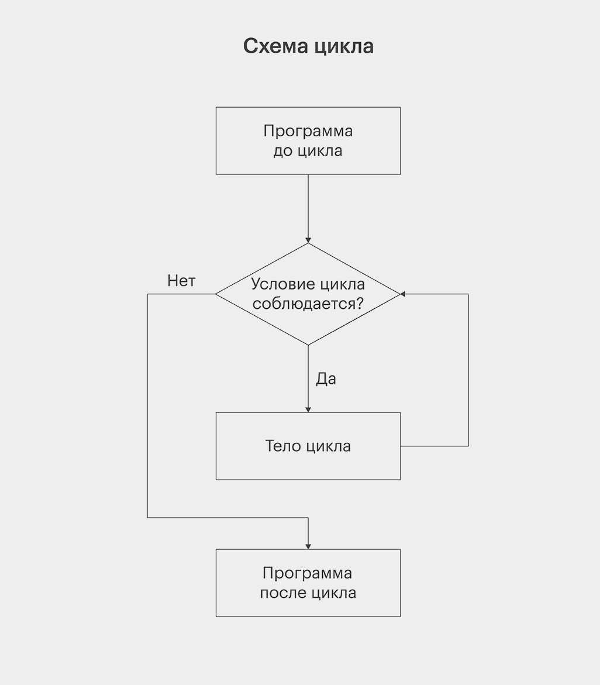

# Лекция 4. Списки, срезы, Циклы (For, While)

## Списки в Python

**Что такое список?**
Список - это упорядоченная коллекция элементов, которая может содержать объекты разных типов.

Создать список можно, заключив элементы в квадратные скобки [] и разделив их запятыми.
В списке Python могут одновременно находиться элементы разных типов, например, числа, строки и даже другие списки. Это делает их очень гибкими и удобными для хранения различных данных.

```python
# Пустой список
empty_list = []

# Список чисел
numbers = [1, 2, 3, 4, 5]

# Список строк
words = ["яблоко", "банан", "апельсин"]

# Список с разными типами данных
mixed_list = [42, "hello", 3.14, True]

# Список с разными типами данных и списком внутри
mixed_list_with_list = [42, "hello", 3.14, True, [1, 2, 3]]
```

### Доступ к элементам списка

Каждый элемент списка имеет индекс (Нумерация элементов в списке начинается с 0), по которому к нему можно обратиться. Благодаря этому мы можем легко получать, изменять или удалять элементы.Списки являются динамическими структурами данных, что означает, что их можно изменять во время работы программы: добавлять новые элементы, удалять существующие или заменять их.

```python
fruits = ["яблоко", "банан", "апельсин"]

print(fruits[0])  # яблоко (первый элемент)
print(fruits[1])  # банан
print(fruits[2])  # апельсин
```

Можно использовать отрицательные индексы, если нужно обратиться к элементу с конца списка:

```python
fruits = ["яблоко", "банан", "апельсин"]

print(fruits[-1])  # апельсин (последний элемент)
print(fruits[-2])  # банан
```

### Изменение элементов списка

Списки можно изменять, например мы можем заменить объект по индексу:

```python
numbers = [1, 2, 3, 4]
numbers[1] = 10  # Заменяем второй элемент (индекс 1)
print(numbers)  # [1, 10, 3, 4]
```

### Операции со списками

**Конкатенация (сложение списков)**

```python
list1 = [1, 2, 3]
list2 = [4, 5, 6]

result = list1 + list2  # Объединение списков
print(result)  # [1, 2, 3, 4, 5, 6]
```

**Дублирование списка (умножение)**

```python
nums = [0, 1]
print(nums * 3)  # [0, 1, 0, 1, 0, 1]
```

**Проверка наличия элемента**

```python
colors = ["red", "blue", "green"]

print("red" in colors)  # True
print("black" in colors)  # False
```

### Немного про методы

Практически у любого объекта в питоне есть возможность с ним совершить какие-то дополнительные действия. Обычно для этого используются методы (детально мы будем рассматривать эту тему дальше), что бы вызвать какой-либо метод, необходимо обратиться к объекту через точку, указать какой именно метод вам нужен, и если необходимо в скобках указать параметры для этого вызова.

```python
obj.method(params)  # Параметры не обязательны
```

### Методы списков

Python предоставляет удобные методы для работы со списками. Давайте поговорим он них немного.

#### Добавление элементов

- `append()` – добавляет элемент в конец списка.
- `insert(index, value)` – вставляет элемент по индексу.
- `extend(collection)` - расширяет список другой коллекцией 

```python
nums = [1, 2, 3]
nums.append(4)  # Добавляем 4 в конец списка
print(nums)  # [1, 2, 3, 4]

nums.insert(1, 99)  # Вставляем 99 на позицию 1
print(nums)  # [1, 99, 2, 3, 4]

l1 = [1, 2, 3]
l2 = ['a', 'b']
l1.extend(l2)
print(l1)  # [1,2,3,'a','b']
```

#### Удаление элементов

- `remove(value)` – удаляет первый найденный элемент.
- `pop(index)` – удаляет элемент по индексу (по умолчанию – последний).
- `clear()` – очищает список.

```python
nums = [1, 2, 3, 4, 5]
nums.remove(3)  # Удаляем 3
print(nums)  # [1, 2, 4, 5]

nums.pop(1)  # Удаляем элемент по индексу 1
print(nums)  # [1, 4, 5]

nums.clear()  # Очищаем список
print(nums)  # []
```

#### Поиск элементов

- `index(value)` – возвращает индекс первого найденного элемента.
- `count(value)` – считает, сколько раз элемент встречается в списке.

```python
nums = [10, 20, 30, 10, 20, 10]

print(nums.index(30))  # 2 (индекс первого 30)
print(nums.count(10))  # 3 (сколько раз встречается 10)
```

#### Сортировка и разворот списка

- `sort()` – сортирует список.
- `reverse()` – переворачивает список.

```python
nums = [5, 2, 9, 1]
nums.sort()  # Сортируем
print(nums)  # [1, 2, 5, 9]

nums.reverse()  # Разворачиваем
print(nums)  # [9, 5, 2, 1]
```


#### copy()

Метод возвращает копию списка.

```python
l = [1, 2, 3]
l2 = l.copy()
print(l is l2)  # False Вернемся к этому оператору после функций
print(l == l2)  # True
```

#### Основные возможные исключения связанные со списками

В случае работы со списками могут произойти ранее не рассмотренное исключения(Надеюсь прошлую лекцию вы еще не забыли:) ).
`IndexError` - Случается когда мы пытаемся получить объект по индексу, а такого индекса не существует.

```python
l = [1, 2, 3]
print(l[5])  # IndexError
```

#### Еще немного плезной информации про списки

Когда создаётся список, Python автоматически выделяет под него память. Нам не нужно беспокоиться о том, сколько места потребуется или когда оно освободится — интерпретатор Python управляет этим самостоятельно. Если список увеличивается, система выделяет больше памяти, если уменьшается — освобождает ненужное. В основе списков Python лежит структура данных, похожая на массив, но с важными отличиями. В классическом массиве каждому элементу выделяется фиксированное количество памяти, и они хранятся непрерывно. В Python-списках такого ограничения нет — они могут содержать объекты разного размера и типа. Как это работает? В Python список — это массив ссылок. Вместо того чтобы хранить сами данные, элементы списка содержат ссылки на их местоположение в памяти. Это позволяет работать с данными более эффективно, но также означает, что операции со списками могут быть чуть менее предсказуемыми по скорости по сравнению с массивами в других языках программирования.

### Строки как коллекции в Python

В Python строки `(str)` представляют собой упорядоченные неизменяемые коллекции символов. Это означает, что строка — это набор символов, пронумерованных по индексам, а также то, что изменить её содержимое после создания нельзя.

#### Строки похожи на списки
Хотя строки и списки являются разными типами данных, у них есть общие свойства:

- Они упорядочены (можно обращаться по индексу).
- Они поддерживают итерацию (можно перебрать символы в цикле).
- Они поддерживают срезы (можно получить подстроку).
- Они поддерживают поиск и методы обработки данных.

#### Доступ к символам по индексу

```python
text = "Python"
print(text[0])  # 'P'  - первый символ
print(text[1])  # 'y'  - второй символ
print(text[-1]) # 'n'  - последний символ (обратный индекс)
```

Обратные индексы позволяют обращаться к элементам с конца (-1, -2 и т. д.).
**Но изменять символы по индексу нельзя !!!!**
```python
text[0] = "J"  # TypeError: 'str' object does not support item assignment
```

У строк очень много разных полезных методов, и особенностей, мы рассмотрим только основные, хотя их там много, кто хочет
детально почитать про все [сюда](https://www.w3schools.com/python/python_ref_string.asp).

#### Методы работы со строками в Python

Python предоставляет множество встроенных методов для удобной работы со строками. Давайте рассмотрим основные из них.

#### Преобразование регистра

Методы, которые изменяют регистр символов в строке.

- `lower()` – переводит строку в нижний регистр

```python
text = "Hello World"
print(text.lower())  # "hello world"
```
- `upper()` – переводит строку в верхний регистр

```python
text = "Hello World"
print(text.upper())  # "HELLO WORLD"
```
- `capitalize()` – делает первую букву строки заглавной, остальные – - трочными

```python
text = "hello world"
print(text.capitalize())  # "Hello world"
```
- `title()` – делает заглавными первые буквы каждого слова

```python
text = "hello world python"
print(text.title())  # "Hello World Python"
```
- `swapcase()` – меняет регистр на противоположный

```python
text = "Hello World"
print(text.swapcase())  # "hELLO wORLD"
```

#### Работа с пробелами и символами

Методы, которые позволяют удалять лишние пробелы и символы.

- `.strip()` – убирает пробелы и символы переноса в начале и конце строки

```python
text = "   hello world   "
print(text.strip())  # "hello world"
```

- `.lstrip()` – убирает пробелы только в начале строки

```python
text = "   hello world"
print(text.lstrip())  # "hello world"
```

- `.rstrip()` – убирает пробелы только в конце строки

```python
text = "hello world   "
print(text.rstrip())  # "hello world"
```

- `.strip("xyz")` – удаляет указанные символы по краям строки

```python
text = "xxxyhello worldyyy"
print(text.strip("xy"))  # "hello world"
```

#### Поиск и проверка наличия подстроки

Методы, которые позволяют проверять и находить подстроки в строке.

- `.startswith()` – проверяет, начинается ли строка с указанного символа/подстроки

```python
text = "Hello World"
print(text.startswith("Hello"))  # True
print(text.startswith("World"))  # False
```

- `.endswith()` – проверяет, заканчивается ли строка указанным символом/подстрокой

```python
text = "Hello World"
print(text.endswith("World"))  # True
print(text.endswith("Hello"))  # False
```

- `.find()` – находит индекс первого вхождения подстроки (если нет – возвращает -1)

```python
text = "Hello World"
print(text.find("World"))  # 6
print(text.find("Python"))  # -1 (не найдено)
```

- `.rfind()` – находит индекс последнего вхождения подстроки

```python
text = "Hello World World"
print(text.rfind("World"))  # 12 (индекс последнего "World")
```

- `.count()` – считает количество вхождений подстроки

```python
text = "banana banana banana"
print(text.count("banana"))  # 3
```

#### Замена и модификация строки
Методы, которые позволяют изменять строку.

- `.replace(old, new)` – заменяет одну подстроку на другую

```python
text = "Hello World"
print(text.replace("World", "Python"))  # "Hello Python"
```

- `replace(old, new, count)` – заменяет только первые `count` вхождений

```python
text = "banana banana banana"
print(text.replace("banana", "apple", 2))  # "apple apple banana"
```

#### Разделение и объединение строк
Методы, которые позволяют разбивать строку на части и соединять строки.

- `.split()` – разбивает строку по указанному разделителю и возвращает список

```python
text = "apple,banana,grape"
print(text.split(","))  # ['apple', 'banana', 'grape']
```

- `.split(" ", maxsplit=1)` – разбивает строку только `maxsplit` раз

```python
text = "apple banana grape"
print(text.split(" ", 1))  # ['apple', 'banana grape']
```

- `.rsplit()` – аналог `.split()`, но разбиение идёт справа налево

```python
text = "apple banana grape"
print(text.rsplit(" ", 1))  # ['apple banana', 'grape']
```

- `.join()` – объединяет список строк в одну строку, используя разделитель

```python
words = ["apple", "banana", "grape"]
print(", ".join(words))  # "apple, banana, grape"
```

## Форматирование строк

Мы обсудили что строки можно конкатенировать, но это далеко не единственная возможность для форматирования строк в
пайтоне всего их вроде 5, но мы рассмотрим два основных, современный и слегка устаревший, но все еще часто применяемый.

Python также предоставляет мощные инструменты для форматирования строк. Один из способов - это использование
метода `str.format()`.

```python
name = "Иван"
age = 30
text = "Привет, меня зовут {} и мне {} лет.".format(name, age)
# Результат: "Привет, меня зовут Иван и мне 30 лет."
```

Для его использования вам необходимо указать в строке символы `{}` для обозначения места куда будут подставлены данные,
и после вызвать метод `.format()` куда передать значения которые необходимо подставить, кол-во элементов должно
совпадать с количеством скобок. Там довольно много деталей, можете изучить их самостоятельно

### F-строки

Python 3.6 и выше поддерживают f-строки (f-strings), которые представляют собой удобный способ вставки переменных и
выражений в строки. Самый распространенный способ форматирования строк на данный момент


```python
name = "Иван"
age = 30
text = f"Привет, меня зовут {name} и мне {age} лет."
print(text) # Привет, меня зовут Иван и мне 30 лет.
```

F-строки начинаются с буквы `f` перед открывающей кавычкой, и в фигурных скобках `{}` можно вставлять переменные или
выражения, которые будут вычислены и подставлены в строку.

Мы будем много использовать оба способа форматирования, а иногда даже сталкиваться с более старыми способами, так что рекомендую разобраться как это работает.

### Срезы в Python
Срезы (slices) — это мощный инструмент, который позволяет извлекать части последовательностей, таких как списки, строки, кортежи. Они позволяют получать подмножества данных без использования циклов.

**Синтаксис срезов**

Срез записывается в квадратных скобках [] после имени переменной и имеет следующий формат:

```python
последовательность[start:stop:step]
```

Где:
- `start` — индекс, с которого начинается срез (включительно).
- `stop` — индекс, на котором заканчивается срез (не включается).
- `step` — шаг (по умолчанию 1).

Помним! Индексация в Python начинается с 0.

#### Примеры работы со срезами

**Основные примеры**

```python
numbers = [0, 1, 2, 3, 4, 5, 6, 7, 8, 9]

print(numbers[2:6])   # [2, 3, 4, 5] (элементы с 2 до 6, но 6 не включается)
print(numbers[:4])    # [0, 1, 2, 3] (с начала до 4-го индекса)
print(numbers[5:])    # [5, 6, 7, 8, 9] (с 5-го элемента до конца)
print(numbers[:])     # [0, 1, 2, 3, 4, 5, 6, 7, 8, 9] (копия списка)
```

**Отрицательные индексы**

Можно использовать отрицательные индексы, чтобы отсчитывать элементы с конца.

```python
print(numbers[-4:])    # [6, 7, 8, 9] (последние 4 элемента)
print(numbers[:-3])    # [0, 1, 2, 3, 4, 5, 6] (все элементы, кроме последних трёх)
print(numbers[-5:-2])  # [5, 6, 7] (с пятого элемента с конца до третьего с конца)
```

**Использование шага**

Можно задать шаг (step), который указывает, как пропускать элементы.

```python
print(numbers[::2])   # [0, 2, 4, 6, 8] (каждый второй элемент)
print(numbers[1::2])  # [1, 3, 5, 7, 9] (каждый второй элемент, начиная с 1)
print(numbers[::-1])  # [9, 8, 7, 6, 5, 4, 3, 2, 1, 0] (разворот списка)
print(numbers[7:2:-1]) # [7, 6, 5, 4, 3] (обратный порядок)
```

#### Срезы со строками
Строки в Python также являются последовательностями символов, поэтому их можно обрабатывать срезами.

```python
text = "Hello, World!"

print(text[0:5])   # 'Hello' (первые 5 символов)
print(text[:5])    # 'Hello' (эквивалентно предыдущему)
print(text[7:])    # 'World!' (все символы с 7-го индекса до конца)
print(text[::-1])  # '!dlroW ,olleH' (переворот строки)
print(text[::2])   # 'Hlo ol!' (каждый второй символ)
```

#### Изменение списков с помощью срезов
Срез можно использовать не только для получения подсписка, но и для изменения или удаления части списка.

**Замена элементов**

```python
numbers = [0, 1, 2, 3, 4, 5, 6, 7, 8, 9]
numbers[2:5] = [20, 30, 40]
print(numbers)  # [0, 1, 20, 30, 40, 5, 6, 7, 8, 9]
```

**Удаление элементов**

```python
numbers[2:5] = []
print(numbers)  # [0, 1, 5, 6, 7, 8, 9]
```

**Вставка элементов**

```python
numbers[2:2] = [99, 100]
print(numbers)  # [0, 1, 99, 100, 2, 3, 4, 5, 6, 7, 8, 9]
```

## Понятие циклов и их необходимость


Код в Python обычно выполняется последовательно: первая строка, потом вторая, третья и так далее. Но некоторые конструкции позволяют нарушать этот порядок, чтобы совершать более сложные операции.Например, циклы выполняют один и тот же блок кода несколько раз.

### Что такое цикл?

Цикл — это структура, которая повторяет выполнение определённого участка кода до тех пор, пока выполняется условие.

**Зачем нужны циклы?**

- Автоматизация повторяющихся задач — например, вывод чисел от 1 до 100.
- Обход элементов коллекций — например, обработка элементов списка.
- Работа с файлами и базами данных — когда нужно выполнить операцию над множеством данных.
- Поиск и обработка информации — например, фильтрация данных по условиям.

**Как работают циклы**

Любой цикл состоит из двух обязательных элементов:

- условие — начальный параметр; цикл запустится только при его выполнении и закончится, как только условие перестанет выполняться;
- тело — сама программа, которая выполняется внутри цикла.

Схематически его можно представить так:



### Виды циклов в Python:

В Python есть два основных вида циклов: `while` и `for`. О них и поговорим.

- `for` — используется, когда количество повторений известно заранее.
- `while` — выполняется, пока выполняется условие.

#### Цикл for в Python
Цикл `for` чаще всего используется для перебора элементов коллекций (списков, строк, словарей и т. д.).

**Синтаксис `for`**

```python
for переменная in коллекция:
    # Тело цикла
```

Каждый элемент коллекции записывается в переменную, после чего выполняется тело цикла.

**Пример: перебор списка**

```python
fruits = ["Apple", "Banana", "Watermelon"]
for fruit in fruits:
    print(fruit)
```

Вывод:

```sh
Apple
Banana
Watermelon
```

#### Использование `range()`

Функция `range(start, stop, step)` генерирует последовательность чисел, чаще всего применяется в циклах `for` и его производных.
Принимает до 3 параметров. Один обязательный, и два вспомогательных.

Если введен только один параметр, то генерирует последовательность чисел от 0 до указанного числа, не включительно.

```python
for i in range(7):  # Выведет числа от 0 до 7
    print(i)
```

Если введены два параметра, то `range` их воспринимает как начало и конец, конец не включительно.

```python
for i in range(1, 6):  # Выведет числа от 1 до 5
    print(i)
```

Если введены три параметра, то третий воспринимается как шаг между элементами.

```python
for i in range(1, 10, 2):
    print(i)
```

Вывод:


Пример с обратным шагом

```python
for i in range(10, 0, -2):
    print(i)
```

#### Цикл `while` в Python

Цикл `while` выполняется, пока выполняется заданное условие.

**Синтаксис `while`**

```python
while условие:
    # Тело цикла
```

Как только условие становится `False`, выполнение цикла прекращается.

**Пример: счётчик**

```python
count = 1
while count <= 5:
    print(count)
    count += 1  # Увеличиваем счётчик
```

Вывод:

```
1
2
3
4
5
```

**Использование ``while`` для пользовательского ввода**

```python
password = ""
while password != "python123":
    password = input("Введите пароль: ")
print("Доступ разрешён!")
```

#### Бесконечный цикл

Бесконечный цикл `while` — это цикл, в котором условие никогда не становится ложным. Это значит, что тело исполняется снова и снова, а цикл никогда не заканчивается.

```python
while True:
    print("Hello python")
```

В данном примере строка `"Hello python"` будет выводится бесконечно!!!

Бесконечные циклы могут быть полезными в тех случаях, когда нужно создать программу, которая работает в фоновом режиме и ожидает какого-либо события, либо когда нужно регулярно выполнять какую-то задачу, например, мониторинг сенсоров или сетевых подключений.

Не забывайте, что бесконечные циклы должны иметь какой-то механизм для прерывания, иначе программа будет выполняться бесконечно и может привести к зависанию.

#### `Else` в цикле `while`

В Python с циклами `while` также можно использовать инструкцию `else`. В этом случае блок в `else` исполняется, когда условие цикла становится ложным.

Пример: 

```python
a = 1
while a < 5:
   print('условие верно')
   a = a + 1
else:
   print('условие неверно')
```

Вывод:

```sh
условие верно
условие верно
условие верно
условие верно
условие неверно
```

#### Операторы break и continue

Оператор `break`**

`break` используется для выхода из цикла досрочно, даже если условие цикла остается истинным. Обычно `break` используется внутри условия, чтобы определить момент завершения цикла.

**Пример с циклом `while`:**

```python
count = 0

while count < 5:
    if count == 3:
        break  # Выход из цикла, если count равно 3
    print(count)
    count += 1
```

**Пример с циклом `for`:**

```python
for i in range(1, 10):
    if i == 5:
        print("Остановка на 5")
        break  # Выход из цикла если i равно 5
    print(i)
```

**Оператор `continue`**

`continue` используется для перехода к следующей итерации цикла, игнорируя оставшуюся часть текущей итерации. Обычно continue используется внутри условия для пропуска определенных действий.

Пример с циклом while:

```python
count = 0

while count < 5:
    count += 1
    if count == 3:
        continue  # Пропустить вывод числа 3
    print(count)
```

Пример с циклом for:

```python
fruits = ['яблоко', 'киви', 'груша', 'апельсин']

for fruit in fruits:
    if fruit == 'груша':
        continue  # Пропустить вывод 'груши'
    print(fruit)
```

Ключевые слова `break` и `continue` полезны при создании более сложной логики в циклах и позволяют управлять потоком выполнения программы в более гибком стиле.

#### Вложенные циклы в Python

Циклы в Python можно вкладывать друг в друга — то есть в теле одного цикла вызывать другой. Логика программы при этом усложняется.Можно вкладывать друг в друга сколько угодно циклов. При этом для каждого нового уровня вложенности нужно увеличивать отступ. Выглядит это так:

```python
while condition:
    pass
    while inner_condition:
        pass
    pass
```

Напишем программу, которая будет выводить номер итерации внешнего и внутреннего цикла.

```python
for i in range(3):
    print(f'Итерация внешнего цикла: {i}')
    for j in range(2):
        print(f'Итерация внутреннего цикла: {j}')
```

Вывод:

```sh
Итерация внешнего цикла: 0
Итерация внутреннего цикла: 0
Итерация внутреннего цикла: 1
Итерация внешнего цикла: 1
Итерация внутреннего цикла: 0
Итерация внутреннего цикла: 1
Итерация внешнего цикла: 2
Итерация внутреннего цикла: 0
Итерация внутреннего цикла: 1
```

#### Практика

1. Создайте произвольный список из чисел. Представьте его в обратном порядке.
2. Создайте список из имен-строк. Затем добавьте в этот список два новых имени и удалите последнее имя. Выведите финальный список на консоль.
3. Создайте строку text с произвольным текстом. Используя цикл for, выведите каждый символ из строки text.
4. Напишите программу, которая удаляет из списка чисел четные числа.
5. Напишите программу, которая удаляет дубликаты из списка.
6. Напишите программу, которая с помощью цикла создает список чисел от 1 до 10, а также списки их квадратов и кубов. В конце списки выводятся на консоль.
7. Найти сумму всех чисел от 1 до 100.
8. Создать список из 5 элементов и вывести только те, что больше 10.
9. Используя while, запрашивать ввод чисел у пользователя, пока он не введёт 0.
11. Создать программу, которая проверяет, является ли введённое число простым (делится только на 1 и себя).
12. Используя вложенные циклы, нарисовать прямоугольник из *.
13. Сгенерировать список квадратов чисел от 1 до 10 с помощью for.
14. Найти факториал числа (5! = 5 × 4 × 3 × 2 × 1).
15. Написать программу, которая запрашивает у пользователя число и печатает таблицу умножения на него.
16. Написать таблицу умножения.

