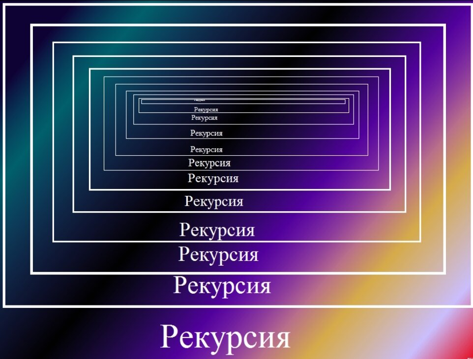
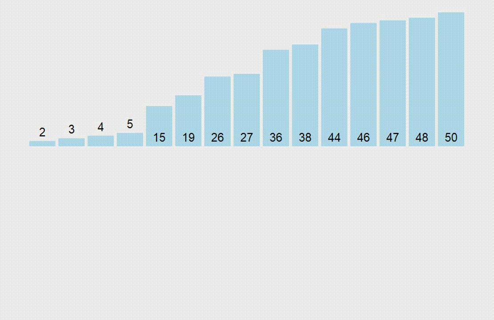
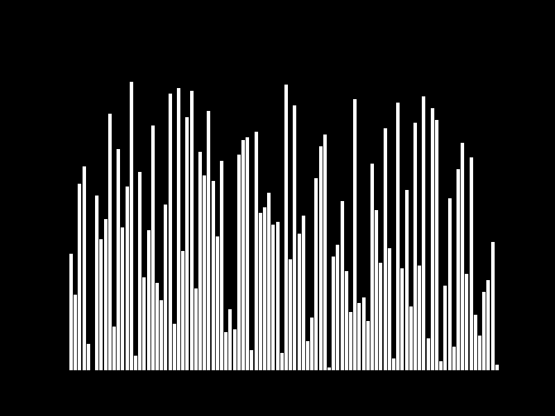

# Лекция 8. Рекурсия, алгоритмы, бинарный поиск, сортировки

## Рекурсия



### Что такое рекурсия?

**Рекурсия** – это метод программирования, при котором функция вызывает саму себя. Это мощный инструмент, который помогает решать задачи, естественным образом разбиваемые на подзадачи.

#### Принцип работы рекурсии

Каждый рекурсивный вызов создает новую копию функции, которая выполняется независимо от предыдущих. Однако для корректной работы рекурсии необходимы:

1. **Базовый случай (условие выхода)** – это условие, при котором рекурсивные вызовы прекращаются.
2. **Шаг рекурсии** – это вызов функции с измененными аргументами, приближающий решение к базовому случаю.

**Пример рекурсивной функции**

Простейший пример – вычисление факториала числа `n! = n * (n-1) * (n-2) * ... * 1`.

Пример без рекурсии (цикл `for`):

```python
def factorial(n):
    result = 1
    for i in range(1, n + 1):
        result *= i
    return result

print(factorial(5))  # Выведет 120
```

**Рекурсивный вариант:**

```python
def factorial(n):
    if n == 1:  # Базовый случай
        return 1
    return n * factorial(n - 1)  # Рекурсивный вызов

print(factorial(5))  # Выведет 120
```

**Как работает этот код?**

Вызов `factorial(5)` приводит к следующей цепочке вызовов:

```scss
factorial(5) -> 5 * factorial(4)
factorial(4) -> 4 * factorial(3)
factorial(3) -> 3 * factorial(2)
factorial(2) -> 2 * factorial(1)
factorial(1) -> 1 (базовый случай)
```

После этого результаты начинают возвращаться назад и перемножаться.

#### Преимущества и ограничения рекурсии


**Преимущества:**

- Рекурсия может сделать код более читаемым и интуитивно понятным, особенно для задач, связанных с древовидными или рекурсивными структурами данных.
- Она может предоставить более лаконичное и элегантное решение для некоторых задач.

**Ограничения:**

- Рекурсия может быть менее эффективной по сравнению с итеративными методами в некоторых случаях из-за накладных расходов на вызов функций.
- Слишком глубокая рекурсия может вызвать переполнение стека вызовов (stack overflow), что приведет к ошибке.
- При использовании рекурсии важно правильно формулировать базовый и рекурсивный случаи, чтобы функция завершилась и не вошла в бесконечный цикл.

**Практика**

1. Напишите рекурсивную функцию вычисления факториала.

2. Напишите рекурсивную функцию вычисления n-ого числа Фибоначчи

## Алгоритмы

### Что такое алгоритмы?

**Алгоритм** – это последовательность шагов, необходимых для решения задачи. Программы – это по сути алгоритмы, записанные на языке программирования.

Признаки хорошего алгоритма

- Точность – алгоритм должен строго определять порядок действий.
- Конечность – должен заканчиваться после выполнения конечного количества шагов.
- Эффективность – должен работать быстро и не использовать лишние ресурсы.
- Корректность – должен давать правильный результат для любых входных данных.

Если вы хотите глубже разобраться в алгоритмах, рекомендую несколько простых и доступных книг:

1️. "Грокаем алгоритмы" – Адитья Бхаргава

- Отличная книга для новичков, объясняющая алгоритмы на интуитивном уровне с множеством подробных картинок.
- Подходит для быстрого знакомства с темой.

2️. "Алгоритмы. Вводный курс" – Томас Кормен

- Облегчённая версия известного учебника "Алгоритмы. Построение и анализ".
- Даёт прочную базу для понимания основных алгоритмов.

3️. "Алгоритмы на Python" – Кайл Симпсон

- Фокусируется на алгоритмах с примерами на Python.
- Отличный выбор для практиков, которые сразу хотят применять алгоритмы в коде.

4️. "Алгоритмы для начинающих" – Джон Седер

- Простая и доступная книга с примерами из реальной жизни.
- Хороший вариант для первого знакомства с алгоритмами.

Я рекомендую книгу Грокаем алгоритмы (Grokking Algorithms: An illustrated guide for programmers and other curious people ). Она написано легким стилем и доступна практически каждому.

### О-большое (Big-O Notation) в алгоритмах

#### Что такое О-большое?

**О-большое (или Big-O notation)** — это математическое обозначение, используемое для описания эффективности алгоритма, особенно его временной и пространственной сложности. Оно позволяет оценить, как изменяется время выполнения или объем используемой памяти по мере роста размера входных данных.

#### Зачем это нужно?

Когда мы пишем код, важно понимать, насколько эффективно он работает. Если ваш алгоритм выполняется слишком долго на больших данных, он может стать бесполезным. О-большое помогает оценить производительность алгоритма ещё до его выполнения.

### Как читается О-большое?
Оно записывается как `O(f(n))`, где:

- `O` — обозначение предельного роста функции,
- `f(n)` — функция, описывающая, как алгоритм ведёт себя при увеличении размера входных данных `n`.

Простые примеры О-большого:

| О-большое  | Название                | Описание |
|------------|-------------------------|----------|
| **O(1)**   | Константное время       | Время выполнения не зависит от размера входных данных. |
| **O(log n)** | Логарифмическое время  | Время выполнения увеличивается медленно (пример: бинарный поиск). |
| **O(n)**   | Линейное время          | Время выполнения растёт пропорционально количеству элементов. |
| **O(n log n)** | Квазилинейное время  | Используется в алгоритмах сортировки (быстрая сортировка, слиянием). |
| **O(n²)**  | Квадратичное время      | Время выполнения растёт как квадрат размера входных данных (пример: вложенные циклы). |
| **O(2ⁿ)**  | Экспоненциальное время  | Очень медленно растущий алгоритм (пример: решение задачи о Ханойских башнях). |
| **O(n!)**  | Факториальное время     | Чрезвычайно неэффективные алгоритмы (перебор всех возможных вариантов). |


### Бинарный поиск

#### Что такое бинарный поиск?

**Бинарный поиск** – это эффективный алгоритм поиска в **отсортированном** массиве. Он работает по принципу "разделяй и властвуй". Он рекурсивно или итеративно делит массив пополам и проверяет, находится ли искомый элемент в левой или правой половине.

Алгоритм более эффективен, чем линейный поиск, так как сокращает количество возможных сравнений в два раза на каждом шаге.

#### Как работает бинарный поиск?

Допустим, у нас есть отсортированный список:

```csharp
[2, 5, 8, 12, 16, 23, 38, 56, 72, 91]
```

И нам нужно найти число 23.

1️. Определяем середину списка:

Находим индекс середины: (начало + конец) // 2
Проверяем элемент в середине.

2️. Сравниваем:

- Если число в середине равно искомому — возвращаем его.
- Если число в середине меньше искомого — продолжаем поиск в правой половине.
- Если число в середине больше искомого — продолжаем поиск в левой половине.

3️. Повторяем процесс, пока не найдем элемент или не останется диапазона для поиска.

#### Сложность алгоритма

Бинарный поиск значительно быстрее, чем линейный (перебор всех элементов).

- Линейный поиск `(O(n))`: Проверяет каждый элемент поочередно.
- Бинарный поиск `(O(log n))`: Делит список пополам на каждом шаге.

Пример:

- При 100 элементах нужно максимум 7 шагов (log₂(100) ≈ 7).
- При 1 000 000 элементах — всего 20 шагов (log₂(1 000 000) ≈ 20).


```python
def binary_search(arr, target):
    left, right = 0, len(arr) - 1  # Устанавливаем границы поиска
    
    while left <= right:
        mid = (left + right) // 2  # Находим середину списка
        
        if arr[mid] == target:
            return mid  # Элемент найден, возвращаем его индекс
        elif arr[mid] < target:
            left = mid + 1  # Искомый элемент справа, сдвигаем границу
        else:
            right = mid - 1  # Искомый элемент слева, сдвигаем границу

    return -1  # Элемент не найден

numbers = [2, 5, 8, 12, 16, 23, 38, 56, 72, 91]
target = 23

result = binary_search(numbers, target)
print("Элемент найден на индексе:", result)  # Выведет: Элемент найден на индексе: 5
```

#### Реализация бинарного поиска (рекурсивно)

```python
def binary_search_recursive(arr, target, left, right):
    if left > right:
        return -1  # Базовый случай: элемент не найден
    
    mid = (left + right) // 2  # Находим середину списка
    
    if arr[mid] == target:
        return mid  # Элемент найден
    elif arr[mid] < target:
        return binary_search_recursive(arr, target, mid + 1, right)  # Поиск справа
    else:
        return binary_search_recursive(arr, target, left, mid - 1)  # Поиск слева

# Тест
numbers = [2, 5, 8, 12, 16, 23, 38, 56, 72, 91]
target = 23

result = binary_search_recursive(numbers, target, 0, len(numbers) - 1)
print("Элемент найден на индексе:", result)  # Выведет: Элемент найден на индексе: 5
```

### Алгоритмы сортировки в Python 

Алгоритмы сортировки играют важную роль в программировании. Они используются для упорядочивания данных, что делает их поиск и обработку более эффективными. Давайте рассмотрим три основных алгоритма сортировки: пузырьковую, слиянием и быструю сортировки.

#### Пузырьковая сортировка (Bubble Sort)

**Сортировка пузырьком** - это метод сортировки массивов и списков путем последовательного сравнения соседних элементов и их обмена, если предшествующий оказывается больше последующего (при сортировке по возрастанию).

В процессе выполнения данного алгоритма элементы с большими значениями оказываются в конце списка, а элементы с меньшими значениями постепенно перемещаются по направлению к началу списка. Образно говоря, тяжелые элементы падают на дно, а легкие медленно всплывают подобно пузырькам воздуха. При этом в начале сортировки отсортированным становится конец списка, а не его начало.

**Принцип работы:**

- Сравнивайте каждый элемент списка с его соседним.
- Меняйте их местами, если они в неправильном порядке.
- Повторяйте процесс до тех пор, пока не будет произведен проход по списку без единой перестановки.


**Сложность:**

- Худший и средний случай: O(n²)
- Лучший случай (если массив уже отсортирован): O(n)


**Пример на Python:**

```python
def bubble_sort(arr):
    n = len(arr)
    for i in range(n):
        swapped = False
        for j in range(0, n - i - 1):
            if arr[j] > arr[j + 1]:
                arr[j], arr[j + 1] = arr[j + 1], arr[j]  # Меняем местами
                swapped = True
        if not swapped:  # Если перестановок не было, массив уже отсортирован
            break
    return arr

# Тест сортировки
arr = [64, 34, 25, 12, 22, 11, 90]
print("Отсортированный массив:", bubble_sort(arr))
```

**Недостаток:** работает медленно на больших массивах.

#### Сортировка слиянием (Merge Sort)

**Сортировка слиянием (Merge Sort)** — это эффективный, стабильный и сравнительный алгоритм сортировки. Алгоритм делит массив на две половины, рекурсивно сортирует каждую половину, а затем сливает отсортированные половины в один отсортированный массив.

**Принцип работы:**

**Разделение:**

- Разделите исходный массив пополам, чтобы получить два подмассива.
- Повторяйте процесс для каждого подмассива до тех пор, пока каждый подмассив не станет массивом из одного элемента (или пустым).

**Слияние:**

- Сливайте два соседних подмассива в один отсортированный массив.
- Повторяйте процесс слияния, пока не будет получен один отсортированный массив.





**Сложность:**

- Худший, средний и лучший случай: `O(n log n)`
- Затраты памяти: `O(n)` из-за рекурсивных вызовов.

**Пример реализации:**
```python
def merge_sort(arr):
    if len(arr) <= 1:
        return arr

    mid = len(arr) // 2  # Находим середину
    left_half = merge_sort(arr[:mid])  # Рекурсивно сортируем левую часть
    right_half = merge_sort(arr[mid:])  # Рекурсивно сортируем правую часть

    return merge(left_half, right_half)  # Объединяем

def merge(left, right):
    result = []
    i = j = 0

    while i < len(left) and j < len(right):  # Сравниваем и объединяем
        if left[i] < right[j]:
            result.append(left[i])
            i += 1
        else:
            result.append(right[j])
            j += 1

    result.extend(left[i:])  # Добавляем оставшиеся элементы
    result.extend(right[j:])
    return result

# Тест сортировки
arr = [38, 27, 43, 3, 9, 82, 10]
print("Отсортированный массив:", merge_sort(arr))
```


#### Быстрая сортировка (Quick Sort)

**Быстрая сортировка (Quick Sort)** — это эффективный алгоритм сортировки, который использует подход "разделяй и властвуй". Он работает путём выбора опорного элемента `(pivot)`, разделения массива на два подмассива — элементы, меньшие опорного, и элементы, большие опорного, а затем рекурсивного применения того же процесса к каждому подмассиву.

Алгоритм быстрой сортировки появился как попытка решить проблему «как можно быстрее перебросить влево маленькие элементы, а вправо — большие». Допустим, у нас самый маленький элемент — крайний справа, можно ли как-то быстро перебросить его, если не на его финальную позицию, то близко к ней? Это бы сильно уменьшило количество ненужных сравнений.

**Принцип работы:**

- Выбираем опорный элемент (pivot).
- Разделяем массив на две части:
- Элементы меньше pivot.
- Элементы больше pivot.
- Рекурсивно сортируем обе части.
- Объединяем отсортированные части.


**Сложность:**

- Лучший и средний случай: O(n log n)
- Худший случай (если массив уже отсортирован): O(n²)

**Пример на Python:**

```python
def quick_sort(arr):
    if len(arr) <= 1:
        return arr

    pivot = arr[len(arr) // 2]
    left = [x for x in arr if x < pivot]
    middle = [x for x in arr if x == pivot]
    right = [x for x in arr if x > pivot]

    return quick_sort(left) + middle + quick_sort(right)


# Пример использования
arr = [3, 6, 8, 10, 1, 2, 1]
print(f"Отсортированный массив: {quick_sort(arr)}")
```

#### Сравнение алгоритмов сортировки

| Алгоритм       | Лучший случай | Средний случай | Худший случай | Простота реализации | Использование памяти |
|---------------|--------------|---------------|--------------|--------------------|--------------------|
| **Bubble Sort** | O(n) | O(n²) | O(n²) | Очень простой | O(1) |
| **Merge Sort** | O(n log n) | O(n log n) | O(n log n) | Сложнее | O(n) (доп. память) |
| **Quick Sort** | O(n log n) | O(n log n) | O(n²) (редко) | Средний | O(log n) (рекурсия) |


**Заключение**

1️. Пузырьковая сортировка — понятный, но медленный алгоритм. Используется в учебных целях.
2️. Сортировка слиянием — работает стабильно, но требует дополнительной памяти.
3️. Быстрая сортировка — один из самых эффективных алгоритмов, но в редких случаях может работать медленно.

**Дополнительные рекомендации:**

- Если массив маленький или почти отсортирован → Bubble Sort
- Если важна стабильность сортировки → Merge Sort
- Если нужна скорость и нет ограничений по памяти → Quick Sort

Знание алгоритмов сортировки поможет вам оптимизировать код и писать эффективные программы! 