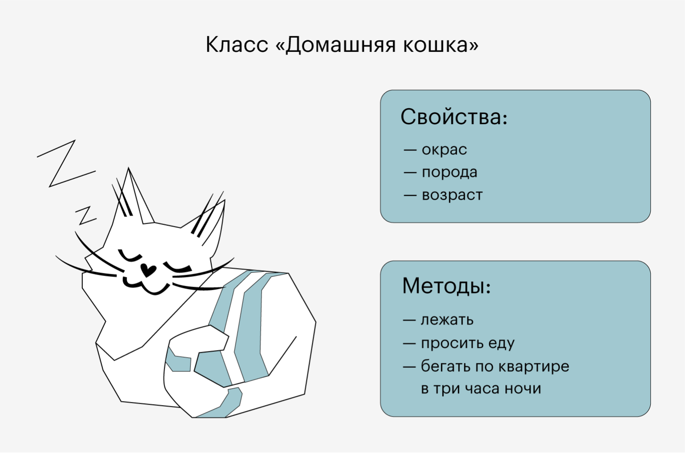

# Лекция 11. Основы ООП.


## Введение в ООП.

**Объектно-ориентированное программирование (ООП)** — это парадигма программирования, которая использует объекты и классы для организации кода. ООП помогает разработчикам создавать более структурированные и понятные программы, что особенно важно для крупных проектов. Основные понятия ООП включают объекты, классы, атрибуты и методы. Разберем их подробнее.

ООП возникло как ответ на необходимость улучшения структуры и читаемости кода, особенно в крупных проектах. В отличие от процедурного программирования, где код организован в виде функций и процедур, ООП позволяет объединить данные и функции, работающие с этими данными, в единые сущности — объекты. Это делает код более интуитивно понятным и легким для сопровождения.

### Почему ООП важно?

В реальном мире мы мыслим объектами:

- Когда мы описываем вещи вокруг нас, мы не говорим "у меня есть список характеристик", а скорее "у меня есть автомобиль с определёнными параметрами".
- Машина – это объект, у которого есть характеристики (атрибуты), например, цвет, марка, скорость.
- У машины есть действия (методы): она может ехать, тормозить, сигналить.


## Что такое объекты и классы?

### Простая аналогия из жизни

Представьте, что класс — это порода кота, а объект — это конкретный кот. У всех котов одной породы есть схожие черты (размер, окрас, поведение), но каждый кот индивидуален. В программировании класс задаёт структуру, а объекты — это реальные экземпляры с уникальными данными.

**Класс** — это шаблон или чертеж для создания объектов. Класс определяет, какие атрибуты и методы будут у объектов, созданных на его основе. Например, класс "Автомобиль" может иметь атрибуты "марка", "модель" и "год выпуска", а также методы "завести двигатель" и "остановить двигатель". Классы позволяют создавать множество объектов с одинаковыми свойствами и поведением, что упрощает процесс разработки и уменьшает количество дублирующегося кода.

**В ООП объект**  — это сущность, экземпляр класса, содержащий свои атрибуты и свои методы, созданный при помощи шаблона (т. е. класса).. Объекты могут представлять реальные или абстрактные сущности. Например, объектом может быть автомобиль, пользователь или банковский счет. Объекты обладают состоянием и поведением, что делает их мощным инструментом для моделирования реального мира в программном коде.

**Атрибуты** — это характеристики объекта. Они хранят данные, описывающие объект.

**Методы** — это функции внутри класса, которые определяют поведение объекта.

## self в Python

В Python self — это специальное слово, которое используется в методах класса для ссылки на конкретный экземпляр объекта. Оно позволяет объектам обращаться к своим атрибутам и другим методам внутри класса.

### Пример:

```python
class Person:
    name = ""
    age = 0
  
    def introduce(self):
        print(f"Привет, меня зовут {self.name}, мне {self.age} лет.")

person1 = Person()
person1.name = "Даниил"
person1.age = 26

person1.introduce()  # Привет, меня зовут Даниил, мне 26 лет.
```

### Почему нужен self?

Когда создаётся объект, Python автоматически передаёт его в методы, но вам нужно явно указать параметр `self`, чтобы обращаться к атрибутам объекта.

#### Пример с автомобилями и сигналом

- У всех автомобилей есть гудок.
- Он реализован в классе `Car` для всех машин.
- В объекте автомобиля нужно как-то вызвать `honk()` у класса `Car`.
- Как это сделать?

Если вызвать `Car.honk()`, засигналят сразу все машины.Если вызвать `self.honk()`, сигналит только конкретный автомобиль.

```python
class Car:
    brand = ""
  
    def honk(self):
        print(f"{self.brand} сигналит: Бип-бип!")

car1 = Car()
car1.brand = "Toyota"

car2 = Car()
car2.brand = "Mercedes"

car1.honk()  # Toyota сигналит: Бип-бип!
car2.honk()  # Mercedes сигналит: Бип-бип!
```

Благодаря `self`, сигнал привязан только к конкретному автомобилю (`Toyota` или `Mercedes`), а не ко всему классу `Car` сразу..

### Примеры использования классов и объектов

После того как мы разобрали `self`, посмотрим, как создаются и взаимодействуют объекты:

**Как примеры и без котиков :) ????**



```python
class Cat:
    name = ""
    color = ""
    age = 0
    energy = 100
  
    def meow(self):
        print(f"{self.name} говорит: Мяу!")
  
    def sleep(self):
        self.energy += 20
        print(f"{self.name} поспал и теперь чувствует себя бодрее! Энергия: {self.energy}")
  
    def scratch_furniture(self):
        self.energy -= 10
        print(f"{self.name} дерёт диван! Хозяин в шоке!")
  
    def wake_owner_at_night(self):
        print(f"{self.name} разбудил хозяина в 3 часа ночи, просто потому что может!")
```

Создадим объекты:

```python
cat1 = Cat()
cat1.name = "Барсик"
cat1.color = "Рыжий"
cat1.age = 2

cat2 = Cat()
cat2.name = "Мурка"
cat2.color = "Серый"
cat2.age = 3

cat3 = Cat()
cat3.name = "Снежок"
cat3.color = "Белый"
cat3.age = 1

cat4 = Cat()
cat4.name = "Гарфилд"
cat4.color = "Оранжевый"
cat4.age = 5

cat1.meow()  # Барсик говорит: Мяу!
cat2.meow()  # Мурка говорит: Мяу!
cat3.scratch_furniture()  # Снежок дерёт диван! Хозяин в шоке!
cat4.wake_owner_at_night()  # Гарфилд разбудил хозяина в 3 часа ночи, просто потому что может!
cat1.sleep()  # Барсик поспал и теперь чувствует себя бодрее! Энергия: 120
```
