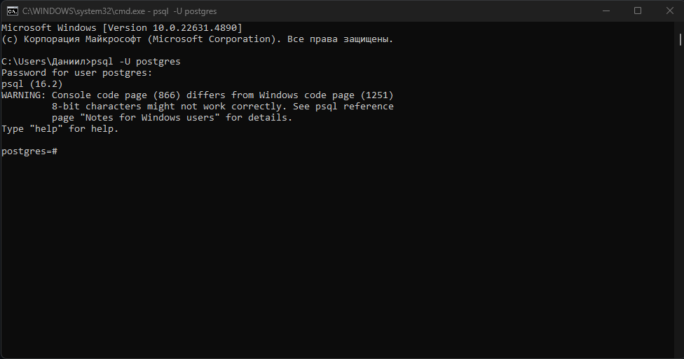

# Руководство по установке PostgreSQL


## Что такое СУБД и зачем она нужна?

Современные приложения, будь то веб-сайты, мобильные приложения или корпоративные системы, активно используют базы данных для хранения информации. Будь то пользовательские данные, транзакции, заказы, логи или любая другая информация – всё это требует надежного способа хранения, обработки и организации.

Для этого используются **Системы Управления Базами Данных** (СУБД).

## Что такое СУБД?

**Система управления базами данных (СУБД)** – это программное обеспечение, предназначенное для создания, хранения, управления и обработки данных в базах данных. Проще говоря, это инструмент, который позволяет работать с данными более удобно, безопасно и эффективно.

СУБД позволяет:

- Организовывать данные в таблицы, связанные между собой.
- Выполнять операции поиска, добавления, изменения и удаления информации.
- Обеспечивать целостность и надежность данных.
- Управлять доступом пользователей и уровнем безопасности данных.
- Автоматизировать процессы работы с данными.

## Основные типы СУБД

Существует несколько видов систем управления базами данных, каждая из которых предназначена для определенных задач.

### 1. Реляционные СУБД (SQL-based)

Это один из самых популярных видов `СУБД`, основанный на работе с таблицами. Данные хранятся в виде строк и столбцов, а для работы с ними используется язык `SQL` (Structured Query Language).

Примеры реляционных `СУБД`:

- PostgreSQL – мощная, бесплатная и кроссплатформенная база данных с расширенными возможностями.
- MySQL – популярная база данных, широко используемая в веб-разработке.
- SQLite – лёгкая встраиваемая база данных, часто используемая в мобильных приложениях.
- Microsoft SQL Server – корпоративное решение от Microsoft.

Реляционные базы данных хорошо подходят для структурированных данных, например, для хранения информации о пользователях, заказах, товарах в интернет-магазинах.

### 2. NoSQL-СУБД (нереляционные)

В отличие от реляционных баз данных, NoSQL-хранилища не используют таблицы и SQL. Они предназначены для работы с неструктурированными данными, масштабируемости и высокой скорости обработки.

Примеры NoSQL СУБД:

- MongoDB – документно-ориентированная база данных, где данные хранятся в формате JSON.
- Redis – быстрая in-memory база данных для кэширования данных.
- Cassandra – распределённая система для работы с огромными объёмами данных.
- DynamoDB – облачная NoSQL-база данных от Amazon.

NoSQL базы подходят для хранения больших объемов неструктурированных данных, работы с Big Data и распределенных систем.

### 3. Графовые базы данных

Используются для работы с данными, которые имеют сложные связи. Они представляют информацию в виде графов (узлов и связей).
Примеры:

- Neo4j – одна из самых популярных графовых СУБД.
- ArangoDB – мультипарадигменная СУБД с поддержкой графов.

Графовые базы данных используются, например, в социальных сетях для хранения информации о друзьях и связях между пользователями.

### 4. Key-Value хранилища

Простые базы данных, в которых данные хранятся в виде пар "ключ – значение".

Примеры:

- Redis – сверхбыстрая in-memory база.
- Riak – распределённое key-value хранилище.

Часто используются для кэширования, например, для хранения сессий пользователей в веб-приложениях.

### Почему именно PostgreSQL?

**PostgreSQL** – это одна из самых мощных реляционных баз данных, которая обладает широкими возможностями.

- Бесплатная и с открытым исходным кодом – PostgreSQL является Open Source продуктом, который развивается сообществом.
- Кроссплатформенность – работает на Windows, macOS и Linux.
- Соответствует стандарту SQL – поддерживает мощные инструменты работы с данными.
- Поддерживает ACID-транзакции – гарантирует надежность и целостность данных.
- Расширяемость – можно подключать сторонние модули и писать свои расширения.
- Отлично справляется с высокими нагрузками – PostgreSQL применяется в крупных проектах и корпоративных системах.
- Наиболее часто используемая СУБД на реальных проектах с python.

Теперь перейдём к установке PostgreSQL на разные операционные системы.
Когда вы устанавливаете себе PostgreSQL (А это будет основная СУБД с которой мы будем работать и наиболее часто используемая СУБД на реальных проектах с python) вы устанавливаете себе сразу и сервер, и клиент на ваш личный компьютер.

Сервер после установки, будет запускаться вместе с компьютером (это можно отключить если необходимо). И поэтому мы чаще всего вообще не задумываемся о запуске локально сервера для базы данных. Но это важный компонент работы системы.

## Установка на Windows

- Загрузите установочный файл с официального [сайта](https://www.postgresql.org/download/windows/) PostgreSQL.
- Запустите установочный файл и следуйте инструкциям мастера установки.
- Выберите компоненты для установки, включая **PostgreSQL Server**, **pgAdmin**, и **psql**.
- Установите пароль для суперпользователя (по умолчанию postgres).
- **Запомните пароль(а лучше запишите!!!) и путь куда вы устанавливаете свою базу данных**.
- Завершите установку.

### Установка на macOS

1. Установите Homebrew, если он еще не установлен, с помощью команды:
   ```sh
   /bin/bash -c "$(curl -fsSL https://raw.githubusercontent.com/Homebrew/install/HEAD/install.sh)"
   ```
2. Установите PostgreSQL через Homebrew:
   ```sh
   brew install postgresql
   ```
3. Запустите сервер:
   ```sh
   brew services start postgresql
   ```

### Установка на Linux

Для Ubuntu:

1. Добавьте официальный репозиторий PostgreSQL:
   ```sh
   sudo sh -c 'echo "deb http://apt.postgresql.org/pub/repos/apt/ $(lsb_release -cs)-pgdg main" > /etc/apt/sources.list.d/pgdg.list'
   ```
2. Импортируйте ключ репозитория:
   ```sh
   wget -qO - https://www.postgresql.org/media/keys/ACCC4CF8.asc | sudo apt-key add -
   ```
3. Обновите список пакетов и установите PostgreSQL:
   ```sh
   sudo apt-get update
   sudo apt-get install postgresql
   ```
4. Проверьте статус сервера:
   ```sh
   sudo systemctl status postgresql
   ```

### Что такое psql?

**psql** — это командная строка для работы с PostgreSQL, одной из самых мощных реляционных баз данных с открытым исходным кодом. Он позволяет выполнять SQL-запросы, управлять базой данных, настраивать пользователей, просматривать данные и выполнять административные команды. При установке `PostgreSQL` - `psql` была уже установлена..

### Настройка psql

#### Windows

Для того чтобы `psql` заработала на Windows нужно добавить его в системную переменную PATH.(Да да Винда далеко не идеальна!!!)

После того как был установлен `PostgreSQL`, нужно добавить каталог `bin` PostgreSQL в переменную PATH, чтобы можно было запускать psql из командной строки:

Вам нужно найти где именно у вас на компьютере установлена база данных. В ней будет папка с номером версии которую вы
установили, например 16.

Вам нужно скопировать полный путь к этой папке. Например: `C:\Program Files\PostgreSQL\16\bin`

После этого в терминале выполнить вот эту команду **указав правильный путь**:

```sh
   setx PATH "%PATH%;C:\Program Files\PostgreSQL\xx\bin"
```

#### macOS и Linux

После установки PostgreSQL через Homebrew или пакетный менеджер, psql уже будет доступен в PATH.

### Запуск psql и подключение к базе

Чтобы открыть `psql`, открой `cmd`(Win) (или PowerShell) и введи:

### Windows

```sh
psql -U postgres
```

### Linux/mac

```sh
sudo -u postgres psql
```

Линукс либо мак при такой команде сначала спросит пароль от системы и только после этого пароль от базы, это нормально.

После того как вы введете команду, postgress попросит у вас пароль(*тот который нужно было запомнить при установке!!!!*). **Когда начнете его вводить, вы не увидите ни какой анимации ввода пароля!!!**.**Это так и задумано**, пароль вводится, продолжайте его набирать и в конце нажмите `ENTER`.

Если вы сделали все правильно у вас в консоле будет вот такой текст :)



Чтобы выйти из `psql` введите `\q`.

Продолжим изучение PostgreSQL на следующей лекции)))
